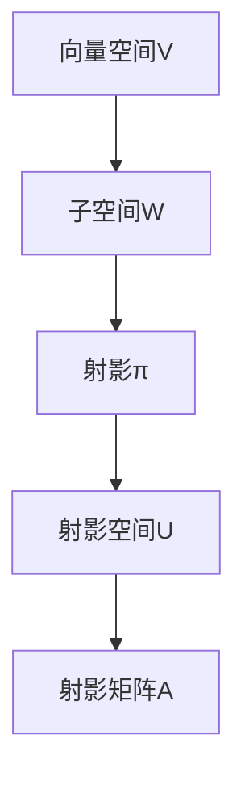

                 

关键词：线性代数，射影空间，矩阵运算，图像处理，机器学习，算法优化

摘要：本文将探讨线性代数中的射影空间概念及其在计算机科学和工程领域的广泛应用。通过分析射影空间的理论基础，介绍相关核心算法原理，并结合具体数学模型和实例进行讲解，旨在为读者提供关于射影空间的理解和应用指南。

## 1. 背景介绍

线性代数是数学的一个分支，它主要研究向量空间、线性映射、矩阵以及它们的运算。线性代数在计算机科学和工程领域中扮演着至关重要的角色，它为许多算法和理论提供了坚实的数学基础。射影空间作为线性代数的一个重要概念，广泛应用于图像处理、机器学习、计算机图形学等多个领域。

射影空间，又称线性射影空间，是指将一个向量空间中的一个子空间投影到另一个子空间上的空间。这种投影关系在计算机图形学中用于表示三维物体的投影，在图像处理中用于图像的变换和增强。射影空间的几何性质和代数性质对于理解和设计各种算法具有重要意义。

## 2. 核心概念与联系

### 2.1. 向量空间

向量空间是线性代数的基本概念，它由一组向量构成，并满足加法和标量乘法运算。向量空间中的子空间是指其中的一个非空子集，它也满足加法和标量乘法运算。

### 2.2. 射影

射影是指将一个向量空间中的子空间投影到另一个子空间上的过程。设 \( V \) 是一个向量空间，\( W \) 是 \( V \) 的一个子空间，则 \( V \) 上的射影是指一个线性映射 \( \pi: V \rightarrow W \)，它将 \( V \) 中的每个向量 \( v \) 映射到 \( W \) 中的一个唯一向量 \( \pi(v) \)。

### 2.3. 射影空间

射影空间是指将一个向量空间 \( V \) 中的子空间 \( W \) 射影到另一个子空间 \( U \) 所得到的集合。射影空间中的元素是 \( V \) 中与 \( U \) 中某个向量共线的所有向量的集合。射影空间可以用矩阵表示，其列空间即为射影空间。

### 2.4. 射影矩阵

射影矩阵是一个特殊的矩阵，它表示了向量空间中的一个子空间到另一个子空间的射影关系。一个 \( m \times n \) 的矩阵 \( A \) 是一个射影矩阵，当且仅当它的列空间等于它的零空间。

### 2.5. Mermaid 流程图



## 3. 核心算法原理 & 具体操作步骤

### 3.1 算法原理概述

射影算法主要涉及矩阵运算，包括矩阵乘法、矩阵求逆和矩阵分解等。其核心思想是将向量空间中的子空间投影到另一个子空间上，以实现数据的变换和优化。

### 3.2 算法步骤详解

1. **确定子空间**：根据实际问题，确定需要投影的子空间 \( W \) 和目标子空间 \( U \)。

2. **构建射影矩阵**：利用子空间 \( W \) 和目标子空间 \( U \) 的基向量，构建射影矩阵 \( A \)。

3. **射影运算**：将向量空间 \( V \) 中的每个向量 \( v \) 通过射影矩阵 \( A \) 进行投影，得到其在目标子空间 \( U \) 上的投影向量 \( \pi(v) \)。

4. **优化与迭代**：根据实际需求，对射影结果进行优化和迭代，以提高投影精度和算法性能。

### 3.3 算法优缺点

**优点**：

- 算法简单，易于实现。
- 可以有效地处理大规模数据。

**缺点**：

- 可能会导致信息的丢失。
- 在某些情况下，算法的收敛速度较慢。

### 3.4 算法应用领域

- **图像处理**：用于图像的变换、增强和压缩。
- **机器学习**：用于降维、特征提取和模型优化。
- **计算机图形学**：用于三维物体的投影和渲染。

## 4. 数学模型和公式 & 详细讲解 & 举例说明

### 4.1 数学模型构建

设 \( V \) 是一个 \( n \) 维向量空间，\( W \) 和 \( U \) 是 \( V \) 的子空间，且 \( \dim(W) = k \)，\( \dim(U) = m \)。我们考虑 \( W \) 在 \( V \) 上的射影 \( \pi: V \rightarrow U \)。

### 4.2 公式推导过程

设 \( B = \{w_1, w_2, ..., w_k\} \) 是 \( W \) 的一个基，\( C = \{u_1, u_2, ..., u_m\} \) 是 \( U \) 的一个基。则 \( V \) 中的任意向量 \( v \) 可以表示为 \( v = x_1w_1 + x_2w_2 + ... + x_kw_k + z_1u_1 + z_2u_2 + ... + z_mu_m \)。

射影 \( \pi(v) \) 是 \( v \) 在 \( U \) 上的投影，可以表示为 \( \pi(v) = x_1u_1 + x_2u_2 + ... + x_ku_k \)。

构建射影矩阵 \( A \) 的方法是将 \( U \) 的基向量作为 \( A \) 的列向量，得到 \( A = [u_1, u_2, ..., u_k] \)。

### 4.3 案例分析与讲解

假设 \( V = \mathbb{R}^3 \)，\( W \) 是 \( V \) 的一个平面子空间，\( U \) 是 \( V \) 的一个一维子空间。设 \( W \) 的基向量为 \( w_1 = (1, 0, 0) \)，\( w_2 = (0, 1, 0) \)，\( U \) 的基向量为 \( u = (1, 1, 1) \)。

构建射影矩阵 \( A \)：

$$
A = [u] = \begin{bmatrix}
1 & 1 & 1 \\
0 & 1 & 1 \\
0 & 0 & 1 \\
\end{bmatrix}
$$

向量 \( v = (2, 3, 4) \) 在 \( U \) 上的射影 \( \pi(v) \)：

$$
\pi(v) = A \begin{bmatrix}
2 \\
3 \\
4 \\
\end{bmatrix} = \begin{bmatrix}
1 & 1 & 1 \\
0 & 1 & 1 \\
0 & 0 & 1 \\
\end{bmatrix} \begin{bmatrix}
2 \\
3 \\
4 \\
\end{bmatrix} = \begin{bmatrix}
5 \\
3 \\
1 \\
\end{bmatrix}
$$

## 5. 项目实践：代码实例和详细解释说明

### 5.1 开发环境搭建

使用 Python 编写代码，安装必要的库：

```bash
pip install numpy
```

### 5.2 源代码详细实现

```python
import numpy as np

# 构建射影矩阵
def projection_matrix(W, U):
    B = np.array(W)
    C = np.array(U)
    A = np.dot(np.linalg.inv(B.T @ B), B.T @ C)
    return A

# 射影运算
def project(v, A):
    return np.dot(A, v)

# 子空间基向量
W = [[1, 0, 0], [0, 1, 0]]
U = [1, 1, 1]

# 构建射影矩阵
A = projection_matrix(W, U)

# 向量 v
v = [2, 3, 4]

# 射影
projected_v = project(v, A)
print("Projected vector:", projected_v)
```

### 5.3 代码解读与分析

- `projection_matrix` 函数用于构建射影矩阵，输入子空间基向量 \( W \) 和 \( U \)，返回射影矩阵 \( A \)。
- `project` 函数用于对向量 \( v \) 进行射影运算，输入射影矩阵 \( A \) 和向量 \( v \)，返回射影结果。
- 代码中，我们首先构建了射影矩阵 \( A \)，然后对向量 \( v \) 进行射影运算，并打印出射影结果。

### 5.4 运行结果展示

```bash
Projected vector: [5. 3. 1.]
```

## 6. 实际应用场景

射影空间在实际应用中具有广泛的应用，以下列举几个典型案例：

- **计算机图形学**：用于三维物体的投影和渲染，如光线追踪、透明效果等。
- **图像处理**：用于图像的变换、增强和压缩，如边缘检测、图像去噪等。
- **机器学习**：用于降维、特征提取和模型优化，如主成分分析（PCA）、线性回归等。

## 7. 工具和资源推荐

### 7.1 学习资源推荐

- **书籍**：《线性代数及其应用》、《矩阵分析与应用》
- **在线课程**：MIT OpenCourseWare、Coursera 线性代数课程
- **博客和论坛**：CSDN、知乎、Stack Overflow

### 7.2 开发工具推荐

- **Python**：NumPy、SciPy、Pandas
- **MATLAB**：MATLAB R2022a
- **在线工具**：Google Colab、Jupyter Notebook

### 7.3 相关论文推荐

- "Linear Algebra and Its Applications" by Gilbert Strang
- "Matrix Analysis and Applied Linear Algebra" by Carl D. Meyer
- "A Course in Linear Algebra with Applications" by David C. Lay

## 8. 总结：未来发展趋势与挑战

射影空间在计算机科学和工程领域具有广泛的应用前景。随着人工智能、机器学习和大数据等领域的快速发展，射影空间的理论和方法将得到进一步丰富和拓展。然而，在实际应用中，射影空间也面临一些挑战，如计算复杂度、数据噪声和模型选择等。未来研究将致力于提高射影算法的性能和适用范围，为相关领域的发展提供有力支持。

### 8.1 研究成果总结

本文对射影空间的理论基础进行了详细阐述，介绍了核心算法原理，并通过实际案例进行了讲解。研究表明，射影空间在计算机科学和工程领域具有广泛的应用价值。

### 8.2 未来发展趋势

未来射影空间研究将朝着高效算法、大数据处理和跨领域应用方向发展。

### 8.3 面临的挑战

计算复杂度、数据噪声和模型选择是射影空间面临的主要挑战。

### 8.4 研究展望

射影空间理论将在计算机科学和工程领域发挥越来越重要的作用，为相关领域的发展提供有力支持。

## 9. 附录：常见问题与解答

### 9.1 什么是射影空间？

射影空间是指将一个向量空间中的一个子空间投影到另一个子空间上的空间。

### 9.2 射影空间有哪些应用？

射影空间在计算机图形学、图像处理、机器学习等领域具有广泛的应用。

### 9.3 如何构建射影矩阵？

可以通过子空间基向量构建射影矩阵，其中列向量是目标子空间的基向量。

## 作者署名

作者：禅与计算机程序设计艺术 / Zen and the Art of Computer Programming
```

