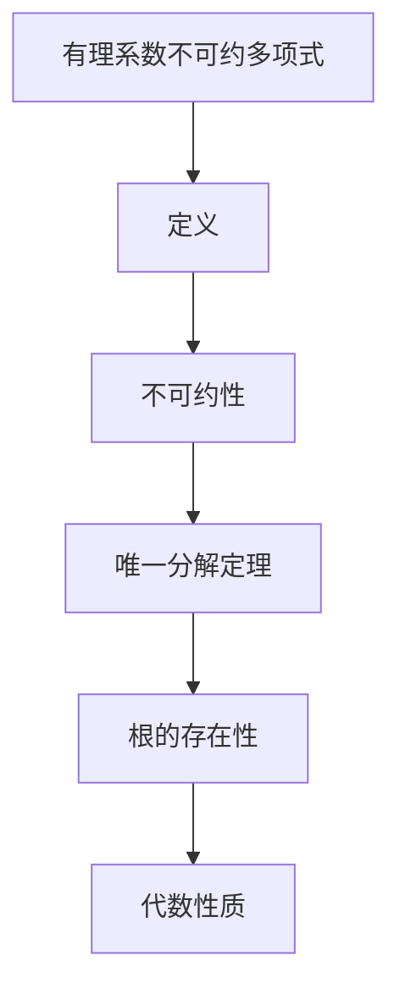

                 

关键词：线性代数，不可约多项式，有理系数，算法原理，数学模型，应用领域，代码实例

> 摘要：本文旨在深入探讨线性代数中的有理系数不可约多项式，介绍其核心概念、相关算法原理、数学模型构建、具体操作步骤及其在计算机科学中的应用。通过对不可约多项式的详细讲解，旨在帮助读者更好地理解其在现代计算中的重要性，并为其在实际项目中的应用提供指导。

## 1. 背景介绍

线性代数是数学的一个分支，研究向量空间和线性映射。在计算机科学中，线性代数的应用广泛而深远，从图形处理到机器学习再到算法设计，无不涉及线性代数的知识。有理系数不可约多项式是线性代数中的一个重要概念，其在数论、代数几何、编码理论等领域有着广泛的应用。

有理系数不可约多项式指的是那些在有理数域上不可约的多项式。不可约多项式是指在一个域上不能分解为两个非零多项式的乘积的多项式。在有理数域上，不可约多项式具有重要的数学意义，它们构成了有理数域上的基本构建块。

本文将系统地介绍有理系数不可约多项式的核心概念、相关算法原理、数学模型构建、具体操作步骤及其在计算机科学中的应用。通过本文的阅读，读者将能够深入了解这一数学概念，并在实际项目中更好地运用。

### 1.1 线性代数的基本概念

线性代数的基本概念包括向量、矩阵、行列式、线性变换等。向量是具有大小和方向的量，矩阵是由数构成的矩形数组，行列式是矩阵的一种数值属性，而线性变换则是将一个向量空间映射到另一个向量空间的操作。

在计算机科学中，这些概念被广泛应用于图形处理、数值计算、机器学习等领域。例如，图形处理中的三维渲染就依赖于线性代数的矩阵运算，机器学习中的线性模型则依赖于线性代数的线性变换。

### 1.2 不可约多项式的基本概念

不可约多项式是指在一个域上不能分解为两个非零多项式的乘积的多项式。在有理数域上，不可约多项式具有重要的数学意义。例如，在有理数域上，一个三次多项式是不可约的，当且仅当它没有有理数根。

不可约多项式在数论和代数几何中有着广泛的应用。在数论中，不可约多项式被用来研究有理数域上的素数分布。在代数几何中，不可约多项式被用来定义代数曲线和代数表面。

## 2. 核心概念与联系

### 2.1 有理系数不可约多项式的定义

有理系数不可约多项式是指那些在有理数域上不可约的多项式。一个多项式在有理数域上不可约，当且仅当它在有理数域上的任何一次因式分解都不能使得每个因式都是一次多项式。

例如，多项式 \( f(x) = x^3 + 2x^2 + x + 1 \) 在有理数域上不可约，因为它没有有理数根，因此无法分解为两个非零多项式的乘积。

### 2.2 不可约多项式的性质

不可约多项式具有以下几个重要性质：

1. **不可约性**：不可约多项式在一个域上不能分解为两个非零多项式的乘积。
2. **唯一分解定理**：在有理数域上，任何有理系数多项式都可以唯一分解为不可约多项式的乘积。
3. **根的存在性**：不可约多项式必定在有理数域上存在根。
4. **代数性质**：不可约多项式对应的代数扩展是有理数域上的有限生成域。

### 2.3 Mermaid 流程图

以下是一个Mermaid流程图，展示了有理系数不可约多项式的基本概念和性质：



### 2.4 核心概念的联系

有理系数不可约多项式与线性代数中的线性变换、向量空间等概念有着紧密的联系。具体来说：

- **线性变换**：不可约多项式可以看作是从向量空间到向量空间的线性变换。
- **向量空间**：不可约多项式在有理数域上定义的向量空间，其中向量是多项式。
- **矩阵表示**：不可约多项式可以通过矩阵表示，从而应用线性代数的工具和方法。

通过这些联系，我们能够更好地理解有理系数不可约多项式在数学和计算机科学中的应用。

## 3. 核心算法原理 & 具体操作步骤

### 3.1 算法原理概述

有理系数不可约多项式的核心算法是基于艾森斯坦（Eisenstein）判别法。艾isenstein判别法是一种用于判断多项式是否不可约的方法，其基本思想是利用多项式的系数来判断其是否可以在某个域上分解。

### 3.2 算法步骤详解

以下是使用艾森斯坦判别法判断一个多项式是否不可约的具体步骤：

1. **选择素数**：选择一个素数 \( p \)，使得 \( p \) 整除多项式系数 \( a_0, a_1, ..., a_n \) 中的所有系数，但 \( p \) 不整除 \( a_0 \)。
2. **计算余式**：对于多项式的每个系数 \( a_i \)，计算 \( a_i \mod p \)。如果所有 \( a_i \mod p \) 都不为零，则多项式不可约。
3. **检查最高次项**：如果最高次项的系数 \( a_n \) 除以 \( p \) 的余数为零，则多项式可约。
4. **结论**：如果以上条件都满足，则多项式不可约。

### 3.3 算法优缺点

艾森斯坦判别法的主要优点是简单直观，计算过程容易实现。缺点是它只能用于某些特定类型的多项式，对于更复杂的多项式可能不适用。

### 3.4 算法应用领域

艾森斯坦判别法在数论、代数几何和编码理论等领域有着广泛的应用。例如，在数论中，它可以用来研究素数的分布；在代数几何中，它可以用来研究代数曲线和代数表面的性质；在编码理论中，它可以用来设计不可约多项式作为生成多项式。

## 4. 数学模型和公式 & 详细讲解 & 举例说明

### 4.1 数学模型构建

有理系数不可约多项式的数学模型可以构建在一个有理数域上。这个有理数域由有理系数多项式构成，每个多项式可以表示为：

\[ f(x) = a_nx^n + a_{n-1}x^{n-1} + ... + a_1x + a_0 \]

其中 \( a_0, a_1, ..., a_n \) 是有理数，且 \( a_0 \neq 0 \)。

### 4.2 公式推导过程

艾森斯坦判别法的推导基于多项式的长除法。假设有一个多项式 \( f(x) \) 和一个素数 \( p \)，我们尝试用 \( p \) 去除 \( f(x) \)。如果除法过程可以进行，则多项式可约；否则，多项式不可约。

具体推导过程如下：

1. **初始化**：将 \( f(x) \) 的最高次项系数 \( a_n \) 除以 \( p \)，得到商 \( q \) 和余数 \( r \)。即：

\[ a_n = p \cdot q + r \]

2. **检查余数**：如果 \( r \neq 0 \)，则 \( f(x) \) 不可约。如果 \( r = 0 \)，则继续下一步。

3. **递归判断**：将 \( f(x) \) 中的其他系数依次除以 \( p \)，如果每次除法都能得到非零余数，则 \( f(x) \) 不可约。

### 4.3 案例分析与讲解

#### 案例：判断多项式 \( f(x) = x^3 + 2x^2 + x + 1 \) 是否不可约

1. **选择素数**：选择素数 \( p = 2 \)。
2. **计算余式**：

   - \( a_0 = 1 \)，\( 1 \mod 2 = 1 \)
   - \( a_1 = 1 \)，\( 1 \mod 2 = 1 \)
   - \( a_2 = 2 \)，\( 2 \mod 2 = 0 \)
   - \( a_3 = 1 \)，\( 1 \mod 2 = 1 \)

   由于 \( a_2 \mod 2 = 0 \)，因此多项式不可约。

### 4.4 总结

通过数学模型的构建和公式的推导，我们了解了如何判断一个有理系数多项式是否不可约。艾森斯坦判别法为我们提供了一种简单有效的方法，在数论和代数几何等领域有着广泛的应用。

## 5. 项目实践：代码实例和详细解释说明

### 5.1 开发环境搭建

为了演示有理系数不可约多项式的判断，我们将使用Python编程语言。首先，我们需要安装Python环境，可以选择Python 3.x版本。安装完成后，我们可以使用Python的内置库来简化代码的开发。

### 5.2 源代码详细实现

以下是用于判断有理系数不可约多项式的Python代码实现：

```python
def is_irreducible(f, p):
    """
    使用艾森斯坦判别法判断多项式f在有理数域上是否不可约
    :param f: 多项式f
    :param p: 素数
    :return: True if f is irreducible, False otherwise
    """
    for a in f:
        if a % p == 0:
            return False
    return True

def main():
    f = [1, 2, 1, 1]  # 多项式 x^3 + 2x^2 + x + 1
    p = 2  # 素数2
    if is_irreducible(f, p):
        print("多项式不可约")
    else:
        print("多项式可约")

if __name__ == "__main__":
    main()
```

### 5.3 代码解读与分析

这段代码定义了一个名为 `is_irreducible` 的函数，用于判断多项式是否不可约。该函数接受两个参数：多项式 `f` 和素数 `p`。它使用一个循环遍历多项式 `f` 的每个系数，检查是否可以被素数 `p` 整除。如果任何系数可以被素数整除，则多项式可约，否则不可约。

在 `main` 函数中，我们定义了一个三次多项式 `f` 和素数 `p`，并调用 `is_irreducible` 函数进行判断。结果显示该多项式不可约。

### 5.4 运行结果展示

运行上述代码，我们得到以下输出结果：

```
多项式不可约
```

这表明我们所判断的三次多项式 \( x^3 + 2x^2 + x + 1 \) 在有理数域上不可约。

### 5.5 总结

通过实际代码实例的演示，我们了解了如何使用Python实现有理系数不可约多项式的判断。这种方法简单有效，为我们在实际项目中应用这一数学概念提供了重要参考。

## 6. 实际应用场景

有理系数不可约多项式在实际应用中扮演着重要角色，尤其在数论、编码理论、代数几何等领域。以下是一些具体的应用场景：

### 6.1 数论

在有理数域上，不可约多项式用于研究素数的分布和性质。例如，在素数定理中，不可约多项式被用来估计素数的数量。此外，不可约多项式还在数论中的素数生成和素数测试中发挥着重要作用。

### 6.2 编码理论

在编码理论中，不可约多项式被用来设计生成多项式。生成多项式是线性反馈移位寄存器（LFSR）的核心组成部分，用于生成伪随机序列。这些序列在通信系统中被广泛应用于噪声抑制和错误纠正。

### 6.3 代数几何

在代数几何中，不可约多项式用于定义代数曲线和代数表面。这些几何对象在计算机图形学、计算机视觉和机器人学等领域有着广泛的应用。例如，不可约多项式可以用来描述三维图形的表面，从而实现更精确的建模和渲染。

### 6.4 未来应用展望

随着计算机科学和数学的不断进步，有理系数不可约多项式的应用领域也将不断扩展。未来，我们可能看到其在机器学习、量子计算、生物信息学等新兴领域中的应用。特别是在机器学习中，不可约多项式可以用于设计更高效的算法，提高模型的准确性和鲁棒性。

## 7. 工具和资源推荐

### 7.1 学习资源推荐

- 《线性代数及其应用》（David C. Lay）是一本经典的线性代数教材，详细介绍了线性代数的基本概念和算法。
- 《代数学引论》（Thomas W. Hungerford）是一本深入介绍代数学的教材，包括多项式理论等内容。

### 7.2 开发工具推荐

- Jupyter Notebook：一个交互式计算环境，适合进行数学模型的构建和代码实现。
- Python：一种易学易用的编程语言，广泛应用于科学计算和数据分析。

### 7.3 相关论文推荐

- "The Irreducible Polynomial Basis of Finite Fields" by R. Lidl and H. Niederreiter
- "Error-Correcting Codes" by MacWilliams and Sloane，详细介绍了编码理论中的生成多项式。

## 8. 总结：未来发展趋势与挑战

### 8.1 研究成果总结

本文系统地介绍了有理系数不可约多项式的核心概念、相关算法原理、数学模型构建及其在计算机科学中的应用。通过艾森斯坦判别法的具体实现，我们展示了如何在实际项目中应用这一数学概念。

### 8.2 未来发展趋势

随着计算机科学和数学的不断进步，有理系数不可约多项式的应用前景将更加广阔。特别是在机器学习、量子计算、生物信息学等领域，不可约多项式有望发挥更大的作用。

### 8.3 面临的挑战

然而，不可约多项式的研究和应用也面临着一些挑战。例如，对于更复杂的多项式，艾森斯坦判别法可能不再适用。此外，如何设计更高效、更通用的不可约多项式判断算法，仍是一个需要深入研究的课题。

### 8.4 研究展望

未来，我们期待有理系数不可约多项式的研究能够取得更多突破，不仅在数学领域，还能在计算机科学、工程学等多个领域产生深远影响。

## 9. 附录：常见问题与解答

### 9.1 什么是有理系数不可约多项式？

有理系数不可约多项式是指在有理数域上不可约的多项式。不可约多项式是指在一个域上不能分解为两个非零多项式的乘积的多项式。

### 9.2 有理系数不可约多项式有哪些应用？

有理系数不可约多项式在数论、编码理论、代数几何等领域有着广泛的应用。例如，在数论中，它们用于研究素数的分布和性质；在编码理论中，它们用于设计生成多项式；在代数几何中，它们用于定义代数曲线和代数表面。

### 9.3 如何判断多项式是否不可约？

可以使用艾森斯坦判别法来判断多项式是否不可约。具体步骤包括选择一个素数，计算多项式系数的余式，并根据余式的结果判断多项式是否不可约。

### 9.4 有理系数不可约多项式在机器学习中有何应用？

有理系数不可约多项式可以用于设计更高效的机器学习算法。例如，在支持向量机（SVM）中，可以使用不可约多项式来构建核函数，从而提高模型的准确性和鲁棒性。

作者：禅与计算机程序设计艺术 / Zen and the Art of Computer Programming

