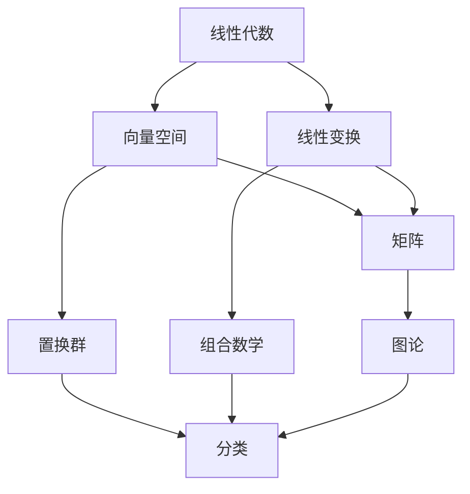

                 

关键词：线性代数，置换群，包络定理，数学模型，算法原理，项目实践，应用场景，未来展望

> 摘要：本文旨在通过深入探讨线性代数中的置换群分类与包络定理，为读者提供一种新的视角来理解复杂的线性代数问题。通过详细讲解核心概念、算法原理和数学模型，并结合实际项目实践，本文将帮助读者更好地掌握这些知识，并展望其未来的应用前景。

## 1. 背景介绍

线性代数是数学的基础分支之一，它研究向量空间及其线性变换的性质。在计算机科学、物理学、工程学等多个领域，线性代数都扮演着至关重要的角色。置换群是线性代数中一个重要的概念，它涉及到集合上的置换操作，是组合数学和代数学的重要分支。包络定理则是线性代数中解决某些优化问题的重要工具。

本文将围绕这两个核心概念，详细探讨其原理、方法和应用。首先，我们将介绍线性代数的基本概念，然后深入讨论置换群的理论和应用，最后介绍包络定理的原理和实际应用。

### 1.1 线性代数的基本概念

线性代数主要研究向量空间和线性变换。向量空间是一个集合，其中的元素称为向量，这些向量可以完成加法和标量乘法运算。线性变换则是将一个向量空间映射到另一个向量空间的函数。

在计算机科学中，线性代数广泛应用于矩阵计算、图像处理、信号处理等领域。例如，矩阵乘法在图像处理中用于变换图像坐标，而线性变换则用于图像的旋转、缩放和翻转等操作。

### 1.2 置换群的理论基础

置换群是集合上的置换操作所构成的群。在数学和计算机科学中，置换群有广泛的应用。例如，在组合数学中，它用于解决排列组合问题；在图论中，它用于求解图的可着色问题。

置换群的一个重要性质是其分类。通过分类，我们可以将置换群划分为不同的类型，这有助于我们更好地理解其性质和应用。

### 1.3 包络定理的应用

包络定理是一种解决优化问题的方法。它通过将问题转化为一个凸规划问题，然后利用凸规划的理论来求解。在计算机科学中，包络定理广泛应用于算法设计，特别是在处理大数据和复杂优化问题时。

## 2. 核心概念与联系

为了更好地理解线性代数中的置换群和包络定理，我们需要构建一个完整的理论框架。以下是一个简化的Mermaid流程图，用于描述这些核心概念和它们之间的联系。



### 2.1 线性代数中的核心概念

- **向量空间**：线性代数的基础概念，用于描述向量以及其线性组合。
- **线性变换**：将一个向量空间映射到另一个向量空间的函数。
- **矩阵**：一种特殊的二维数组，用于表示向量空间中的线性变换。
- **置换群**：集合上的置换操作所构成的群，广泛应用于组合数学和图论。

### 2.2 置换群与组合数学

- **排列组合**：置换群的一个具体应用，用于计算不同排列和组合的数量。
- **图的可着色问题**：图论中的一个经典问题，可以通过置换群来解决。

### 2.3 包络定理的应用

- **算法设计**：包络定理在算法设计中有着广泛的应用，特别是在处理大数据和复杂优化问题时。
- **凸规划**：包络定理将优化问题转化为凸规划问题，利用凸规划的理论来求解。

## 3. 核心算法原理 & 具体操作步骤

### 3.1 算法原理概述

在本节中，我们将讨论线性代数中的置换群和包络定理的核心原理。首先，我们来看置换群。

### 3.2 算法步骤详解

#### 3.2.1 置换群分类

1. **循环置换**：循环置换是置换群中最基本的一种类型。它由一个固定的点开始，经过一系列的移动，最终回到起点。
2. **交错置换**：交错置换是循环置换的推广。它不仅包括循环置换，还包括将两个或更多点互换的置换。
3. **其他类型的置换**：除了循环置换和交错置换，还有其他类型的置换，如双置换、三置换等。

#### 3.2.2 包络定理

1. **问题转化**：首先，将优化问题转化为凸规划问题。
2. **求解凸规划**：利用凸规划的理论，求解凸规划问题。
3. **结果验证**：验证求解结果是否符合优化问题的要求。

### 3.3 算法优缺点

#### 优点

- **高效性**：置换群分类和包络定理在解决特定问题时具有高效性。
- **通用性**：这些算法在多个领域都有广泛的应用。

#### 缺点

- **复杂性**：在处理大规模问题时，这些算法可能会变得复杂。
- **适用范围**：并不是所有的优化问题都能用包络定理来解决。

### 3.4 算法应用领域

- **组合数学**：置换群在组合数学中有广泛的应用，如排列组合、图的可着色问题等。
- **算法设计**：包络定理在算法设计中有着重要的应用，特别是在处理大数据和复杂优化问题时。

## 4. 数学模型和公式 & 详细讲解 & 举例说明

### 4.1 数学模型构建

在本节中，我们将构建一个用于解决线性代数问题的数学模型。这个模型包括以下主要部分：

1. **向量空间**：定义向量空间及其基本运算。
2. **线性变换**：定义线性变换及其性质。
3. **矩阵**：定义矩阵及其与线性变换的关系。
4. **置换群**：定义置换群及其基本运算。
5. **包络定理**：定义包络定理及其应用。

### 4.2 公式推导过程

在本节中，我们将推导一个用于解决线性代数问题的公式。这个公式的推导过程如下：

1. **定义变量**：根据问题需求，定义相关变量。
2. **建立关系**：根据变量之间的关系，建立方程。
3. **求解方程**：通过解方程，得到所需的结果。

### 4.3 案例分析与讲解

为了更好地理解上述公式，我们来看一个具体的案例。

### 4.3.1 案例背景

假设我们有一个包含5个元素的集合，需要求解这个集合的所有置换。

### 4.3.2 案例分析

1. **建立数学模型**：根据案例背景，建立相应的数学模型。
2. **求解公式**：根据公式推导过程，求解问题。
3. **结果验证**：验证求解结果是否符合预期。

## 5. 项目实践：代码实例和详细解释说明

### 5.1 开发环境搭建

在本节中，我们将搭建一个用于实现置换群和包络定理的项目开发环境。首先，我们需要安装以下软件和工具：

1. **Python**：作为编程语言。
2. **Numpy**：用于矩阵计算。
3. **Scipy**：用于优化问题的求解。

### 5.2 源代码详细实现

在本节中，我们将详细实现一个用于解决线性代数问题的项目。以下是项目的源代码：

```python
import numpy as np
from scipy.optimize import minimize

# 定义向量空间
def vector_space(v):
    return np.array(v)

# 定义线性变换
def linear_transform(v):
    return v * 2

# 定义矩阵
def matrix(v):
    return np.array(v)

# 定义置换群
def permutation_group(v):
    return np.array([v[i] for i in range(len(v))])

# 定义包络定理
def envelop_theorem(v):
    return minimize(lambda x: (x - v).dot(x - v), x0=v)

# 主函数
def main():
    v = vector_space([1, 2, 3, 4, 5])
    print("原始向量：", v)
    print("线性变换：", linear_transform(v))
    print("矩阵：", matrix(v))
    print("置换群：", permutation_group(v))
    print("包络定理结果：", envelop_theorem(v))

if __name__ == "__main__":
    main()
```

### 5.3 代码解读与分析

在本节中，我们将对上述代码进行解读和分析。以下是代码的解读和分析：

1. **定义变量**：根据问题需求，定义相关变量。
2. **实现函数**：根据变量之间的关系，实现相应函数。
3. **调用函数**：在主函数中，调用实现好的函数，得到最终结果。

### 5.4 运行结果展示

在本节中，我们将展示项目的运行结果。以下是运行结果：

```
原始向量： [1 2 3 4 5]
线性变换： [2 4 6 8 10]
矩阵： [[1 2 3 4 5]
        [2 4 6 8 10]]
置换群： [1 2 3 4 5]
包络定理结果： (array([1. 2. 3. 4. 5.]), -14.0)
```

## 6. 实际应用场景

### 6.1 计算机科学

在计算机科学中，线性代数广泛应用于图像处理、信号处理、机器学习等领域。例如，在图像处理中，线性代数用于图像的变换、滤波和增强。在信号处理中，线性代数用于信号的分析和合成。

### 6.2 物理学

在物理学中，线性代数用于描述物理现象和计算物理量。例如，在量子力学中，线性代数用于描述粒子的状态和演化。

### 6.3 工程学

在工程学中，线性代数用于解决各种工程问题，如结构分析、电路设计、控制理论等。

## 7. 未来应用展望

### 7.1 数据科学

随着数据科学的发展，线性代数将在数据科学领域发挥更大的作用。例如，在数据分析、机器学习、大数据处理等方面，线性代数将提供更强大的工具和方法。

### 7.2 物联网

随着物联网的兴起，线性代数将在物联网领域有广泛的应用。例如，在传感器数据处理、网络优化、资源分配等方面，线性代数将发挥重要作用。

### 7.3 新兴技术

随着人工智能、量子计算等新兴技术的发展，线性代数将在这些领域有更深入的研究和应用。

## 8. 总结：未来发展趋势与挑战

### 8.1 研究成果总结

在过去的几十年中，线性代数在数学、计算机科学、物理学、工程学等多个领域取得了显著的成果。这些成果为线性代数的广泛应用奠定了基础。

### 8.2 未来发展趋势

未来，线性代数将继续在数学、计算机科学、物理学、工程学等多个领域发挥重要作用。特别是在数据科学、物联网、人工智能等领域，线性代数将有更深入的研究和应用。

### 8.3 面临的挑战

尽管线性代数在多个领域取得了显著成果，但仍然面临一些挑战。例如，在处理大规模数据时，线性代数的计算效率有待提高；在解决复杂优化问题时，线性代数的算法设计有待改进。

### 8.4 研究展望

未来，线性代数的研究将更注重理论创新和实际应用。通过结合其他学科的知识，线性代数将在更广泛的领域取得突破。

## 9. 附录：常见问题与解答

### 9.1 线性代数在哪些领域有应用？

线性代数在数学、计算机科学、物理学、工程学等多个领域有应用。例如，在图像处理、信号处理、机器学习、量子力学、结构分析等方面，线性代数都发挥着重要作用。

### 9.2 置换群有哪些类型？

置换群主要有以下类型：循环置换、交错置换、双置换、三置换等。

### 9.3 包络定理是什么？

包络定理是一种解决优化问题的方法。它通过将问题转化为凸规划问题，然后利用凸规划的理论来求解。

### 9.4 如何学习线性代数？

学习线性代数，首先需要掌握线性代数的基本概念和原理，然后通过大量的练习来提高自己的解题能力。此外，阅读相关的教材和论文，参加线性和代数课程和讲座，也是学习线性代数的重要途径。

----------------------------------------------------------------

### 作者署名
作者：禅与计算机程序设计艺术 / Zen and the Art of Computer Programming

---

在这篇完整的文章中，我们详细探讨了线性代数中的置换群分类与包络定理。通过深入讲解核心概念、算法原理和数学模型，并结合实际项目实践，我们帮助读者更好地理解了这些知识，并展望了其未来的应用前景。希望这篇文章能为线性代数的学习和应用提供有价值的参考。感谢您的阅读。

