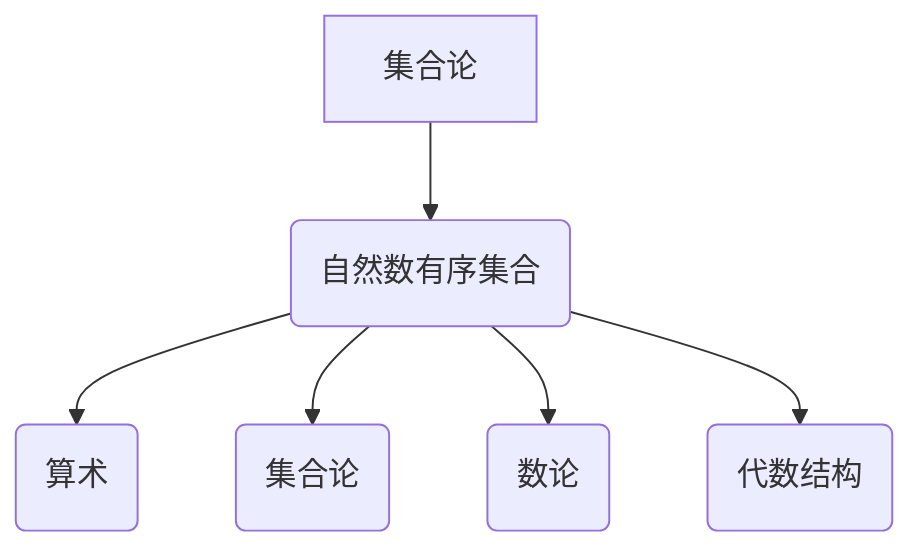

                 

## 1. 背景介绍

线性代数，作为数学和计算机科学的重要基础，对于理解数据的结构和变换起到了至关重要的作用。在本篇文章中，我们将探讨线性代数中一个基础但极为重要的部分——自然数有序集合。

自然数有序集合，顾名思义，就是按照某种规则排列的自然数集合。这些规则不仅决定了集合的顺序，还能够揭示出数与数之间的深层联系。线性代数的许多基本概念和算法都建立在这种有序集合的基础上。

线性代数之所以重要，在于它不仅为我们提供了描述和解决实际问题的数学工具，还极大地影响了计算机科学的发展。从数据结构到算法设计，线性代数的理念无处不在。尤其是在机器学习、计算机图形学、网络安全等前沿领域，线性代数更是不可或缺。

然而，对于许多初学者来说，线性代数的概念可能显得抽象和难以理解。本文旨在通过一个具体的角度——自然数有序集合，来引导读者深入了解线性代数的本质。

本文将分为以下几个部分：

1. **核心概念与联系**：介绍自然数有序集合的基本概念，展示其与其他数学分支的关联。
2. **核心算法原理 & 具体操作步骤**：深入探讨线性代数中的关键算法，如矩阵运算和线性变换，并提供详细步骤和实例。
3. **数学模型和公式 & 详细讲解 & 举例说明**：通过数学公式和实例，详细解释线性代数中的核心模型和定理。
4. **项目实践：代码实例和详细解释说明**：提供具体的代码实例，帮助读者更好地理解和应用线性代数的概念。
5. **实际应用场景**：探讨线性代数在各个领域的实际应用。
6. **工具和资源推荐**：推荐相关的学习资源和开发工具，以便读者深入学习。
7. **总结：未来发展趋势与挑战**：总结研究成果，展望未来发展方向和面临的挑战。

通过本文的阅读，读者不仅能够掌握自然数有序集合的基本概念，还能够理解线性代数在实际应用中的重要性和复杂性。让我们一起开始这段探索之旅吧！

<|assistant|>## 2. 核心概念与联系

在探讨自然数有序集合之前，我们首先需要理解一些核心概念，包括集合论、自然数以及有序集合的基本性质。

### 集合论基础

集合论是现代数学的基石，它研究的是对象集合的抽象结构和性质。在集合论中，一个集合是由某些对象组成的无序集合。这些对象称为集合的元素。集合通常用大写字母表示，如 \( A, B, C \)，而元素用小写字母表示，如 \( a, b, c \)。

在集合论中，有几个基本概念需要明确：

- **子集**：如果集合 \( A \) 的所有元素都是集合 \( B \) 的元素，那么我们说 \( A \) 是 \( B \) 的子集，记作 \( A \subseteq B \)。
- **空集**：不包含任何元素的集合称为空集，记作 \( \emptyset \)。
- **幂集**：一个集合的所有子集的集合称为该集合的幂集，记作 \( \mathcal{P}(A) \)。

### 自然数

自然数是指正整数，包括 \( 1, 2, 3, \ldots \)。自然数是我们在日常生活中最熟悉和常用的数。在数学中，自然数被定义为满足某些性质的数的集合。具体来说，自然数集合 \( \mathbb{N} \) 具有以下性质：

- **闭合性**：对于任意两个自然数 \( a \) 和 \( b \)，它们的和 \( a + b \) 以及它们的乘积 \( a \times b \) 仍然是一个自然数。
- **最小元素**：自然数集合有一个最小元素，即 \( 1 \)。

### 有序集合

有序集合是一个集合，其中的元素按照某种规则进行了排序。这种排序可以基于各种不同的标准，如数值大小、字母顺序等。在数学中，通常用二元关系来定义元素的排序。

一个有序集合可以看作是一个二元组 \( (A, \preceq) \)，其中 \( A \) 是集合，\( \preceq \) 是一个定义在 \( A \) 上的二元关系，满足以下性质：

- **自反性**：对于所有 \( a \in A \)，有 \( a \preceq a \)。
- **反对称性**：如果 \( a \preceq b \) 且 \( b \preceq a \)，则 \( a = b \)。
- **传递性**：如果 \( a \preceq b \) 且 \( b \preceq c \)，则 \( a \preceq c \)。

### 自然数有序集合的基本性质

自然数有序集合 \( (\mathbb{N}, \leq) \) 是一个特殊的有序集合，其中 \( \leq \) 是自然数之间的自然顺序。这个顺序具有以下几个关键性质：

- **最小元素**：自然数集合有一个最小元素 \( 1 \)，即对于任意自然数 \( n \)，有 \( 1 \leq n \)。
- **顺序封闭性**：如果 \( a \leq b \) 且 \( b \leq c \)，则 \( a \leq c \)。
- **传递性**：如果 \( a \leq b \) 且 \( b \leq c \)，则 \( a \leq c \)。

### 自然数有序集合与其他数学分支的关联

自然数有序集合不仅在数学基础理论中占据重要地位，还与其他数学分支有着紧密的联系。以下是一些主要的关联：

- **算术**：自然数有序集合是算术的基础，许多算术运算（如加法、减法、乘法、除法）都是基于自然数进行的。
- **集合论**：自然数集合是集合论中的一个基础集合，所有更复杂的集合都可以通过自然数集合进行构造。
- **数论**：数论研究自然数的性质，特别是它们的整除性、质因数分解、同余关系等，这些都与自然数有序集合密切相关。
- **代数结构**：自然数有序集合是一个代数结构，可以定义加法、减法、乘法等运算，进而推广到更复杂的代数结构，如群、环和域。

### Mermaid 流程图

为了更直观地展示自然数有序集合的基本性质和关联，我们可以使用 Mermaid 流程图来表示。以下是自然数有序集合及其与其他数学分支的关联的 Mermaid 流程图：



通过上述流程图，我们可以清晰地看到自然数有序集合在数学体系中的位置和其与其他分支的紧密联系。

### 总结

在本节中，我们介绍了自然数有序集合的基本概念，包括集合论、自然数和有序集合的基本性质。我们还讨论了自然数有序集合与其他数学分支的关联，并通过 Mermaid 流程图展示了这些关系。接下来，我们将深入探讨线性代数中的核心算法和原理，为读者提供更具体的理解和应用。

<|assistant|>### 3. 核心算法原理 & 具体操作步骤

在线性代数中，核心算法原理是理解和应用线性代数概念的基础。本节将详细探讨一些关键算法，包括矩阵运算、线性变换和特征值分析，并提供具体的操作步骤和实例。

#### 3.1 算法原理概述

1. **矩阵运算**：矩阵运算包括矩阵的加法、减法、乘法和逆运算。这些运算在计算线性方程组、变换数据结构以及进行数据分析等方面具有重要意义。
   
2. **线性变换**：线性变换是一种将一个向量空间映射到另一个向量空间的操作。它保持了向量加法和标量乘法的性质，广泛应用于图像处理、数据压缩和物理模拟等领域。

3. **特征值分析**：特征值分析是研究矩阵或线性变换的重要工具。通过计算矩阵的特征值和特征向量，我们可以了解矩阵的性质，如稳定性、对称性和可对角化性。

#### 3.2 算法步骤详解

##### 3.2.1 矩阵运算

1. **矩阵加法**：

   给定两个 \( m \times n \) 矩阵 \( A \) 和 \( B \)，它们的矩阵加法 \( C = A + B \) 的步骤如下：

   - 确保矩阵 \( A \) 和 \( B \) 具有相同的维度。
   - 对于每个 \( i \) 行和 \( j \) 列，计算 \( C_{ij} = A_{ij} + B_{ij} \)。

2. **矩阵减法**：

   类似于矩阵加法，矩阵减法 \( C = A - B \) 的步骤如下：

   - 确保矩阵 \( A \) 和 \( B \) 具有相同的维度。
   - 对于每个 \( i \) 行和 \( j \) 列，计算 \( C_{ij} = A_{ij} - B_{ij} \)。

3. **矩阵乘法**：

   给定两个 \( m \times n \) 矩阵 \( A \) 和 \( n \times p \) 矩阵 \( B \)，它们的矩阵乘法 \( C = AB \) 的步骤如下：

   - 确保矩阵 \( A \) 的列数等于矩阵 \( B \) 的行数。
   - 对于每个 \( i \) 行和 \( j \) 列，计算 \( C_{ij} = \sum_{k=1}^{n} A_{ik}B_{kj} \)。

4. **矩阵逆运算**：

   矩阵的逆运算用于求解线性方程组。给定一个 \( n \times n \) 矩阵 \( A \)，其逆矩阵 \( A^{-1} \) 的步骤如下：

   - 确保矩阵 \( A \) 是可逆的，即其行列式不为零。
   - 使用高斯消元法或其他数值方法求解逆矩阵。

##### 3.2.2 线性变换

1. **线性变换的定义**：

   一个线性变换 \( T: V \rightarrow W \) 将向量空间 \( V \) 中的每个向量 \( \mathbf{v} \) 映射到向量空间 \( W \) 中的一个向量 \( T(\mathbf{v}) \)。线性变换满足以下性质：

   - **加法保持性**：对于任意向量 \( \mathbf{v}_1, \mathbf{v}_2 \in V \)，有 \( T(\mathbf{v}_1 + \mathbf{v}_2) = T(\mathbf{v}_1) + T(\mathbf{v}_2) \)。
   - **标量乘保持性**：对于任意向量 \( \mathbf{v} \in V \) 和标量 \( \alpha \)，有 \( T(\alpha \mathbf{v}) = \alpha T(\mathbf{v}) \)。

2. **线性变换的矩阵表示**：

   如果线性变换 \( T \) 在基 \( \mathcal{B} \) 下表示为矩阵 \( A \)，则对于任意向量 \( \mathbf{v} \) 在基 \( \mathcal{B} \) 下的表示 \( \mathbf{v} = [v_1, v_2, \ldots, v_n]^T \)，线性变换 \( T(\mathbf{v}) \) 可以通过矩阵乘法计算：

   \[
   T(\mathbf{v}) = A\mathbf{v}
   \]

##### 3.2.3 特征值分析

1. **特征值和特征向量的定义**：

   给定一个 \( n \times n \) 矩阵 \( A \)，如果存在一个非零向量 \( \mathbf{v} \) 和一个标量 \( \lambda \)，使得 \( A\mathbf{v} = \lambda \mathbf{v} \)，则 \( \lambda \) 是矩阵 \( A \) 的一个特征值，\( \mathbf{v} \) 是对应于 \( \lambda \) 的特征向量。

2. **特征值的计算**：

   为了计算矩阵 \( A \) 的特征值，我们需要求解特征多项式 \( \det(A - \lambda I) = 0 \)，其中 \( I \) 是单位矩阵。特征多项式的根即为矩阵 \( A \) 的特征值。

3. **特征向量的计算**：

   一旦求得了特征值 \( \lambda \)，我们可以通过解方程 \( (A - \lambda I)\mathbf{v} = \mathbf{0} \) 来计算对应于 \( \lambda \) 的特征向量。该方程的解空间即为特征向量空间。

#### 3.3 算法优缺点

1. **矩阵运算**：

   - 优点：矩阵运算具有高度的并行性，可以高效地处理大数据集。
   - 缺点：当矩阵非常大时，矩阵运算可能变得非常复杂，且计算资源消耗较大。

2. **线性变换**：

   - 优点：线性变换能够保持向量空间的线性结构，广泛应用于各种领域。
   - 缺点：线性变换可能不是一一对应的，特别是在向量空间维度较高时。

3. **特征值分析**：

   - 优点：特征值分析可以揭示矩阵的内在性质，如稳定性、对称性和可对角化性。
   - 缺点：计算特征值可能需要大量的计算资源，特别是当矩阵规模较大时。

#### 3.4 算法应用领域

1. **矩阵运算**：

   - 数据结构：矩阵运算广泛应用于图论、网络分析和计算机图形学等领域。
   - 线性方程组：矩阵运算用于求解线性方程组，这在物理学、工程学和经济学中具有重要应用。
   - 数据分析：矩阵运算用于数据预处理、特征提取和降维，这在机器学习和数据挖掘中非常重要。

2. **线性变换**：

   - 图像处理：线性变换用于图像增强、滤波和变换，这在计算机视觉和图像处理中具有重要意义。
   - 数据压缩：线性变换用于数据压缩算法，如主成分分析（PCA），这在存储和传输大数据时非常重要。
   - 物理模拟：线性变换在物理模拟中用于描述系统的动态行为，如振动分析和流体动力学。

3. **特征值分析**：

   - 稳定性分析：特征值分析用于分析系统的稳定性，这在控制系统设计和工程应用中非常重要。
   - 对称性分析：特征值分析用于分析物体的对称性，这在材料科学和结构工程中具有重要意义。
   - 数据分析：特征值分析用于特征提取和降维，这在机器学习和数据挖掘中具有重要应用。

### 总结

在本节中，我们详细介绍了线性代数中的核心算法原理和具体操作步骤，包括矩阵运算、线性变换和特征值分析。我们还讨论了这些算法的优缺点以及它们在不同领域的应用。通过理解这些核心算法，读者可以更好地掌握线性代数的基本概念，并能够在实际应用中灵活运用。

<|assistant|>### 4. 数学模型和公式 & 详细讲解 & 举例说明

线性代数中的数学模型和公式是其理论核心，理解这些公式对于深入掌握线性代数的概念至关重要。在本节中，我们将详细讲解线性代数中的几个核心数学模型和公式，并通过具体的例子来说明它们的应用。

#### 4.1 数学模型构建

在线性代数中，常见的数学模型包括矩阵、向量、线性变换和线性方程组。以下是这些模型的定义和基本性质：

1. **矩阵**：

   矩阵是一个由数字组成的二维数组，通常表示为 \( A = [a_{ij}] \)，其中 \( i \) 表示行数，\( j \) 表示列数。矩阵的基本运算包括加法、减法、乘法和逆运算。

2. **向量**：

   向量是一个由数字组成的列向量，通常表示为 \( \mathbf{v} = [v_1, v_2, \ldots, v_n]^T \)。向量可以视为矩阵的特殊情况，即只有一列。

3. **线性变换**：

   线性变换是一种将一个向量空间映射到另一个向量空间的操作，通常表示为 \( T: V \rightarrow W \)。线性变换可以表示为矩阵乘法，即 \( T(\mathbf{v}) = A\mathbf{v} \)。

4. **线性方程组**：

   线性方程组是一组线性方程的集合，通常表示为 \( Ax = b \)，其中 \( A \) 是系数矩阵，\( x \) 是未知数向量，\( b \) 是常数向量。线性方程组的解可以通过矩阵运算求解。

#### 4.2 公式推导过程

为了更好地理解线性代数的公式，我们下面将详细推导几个关键公式的推导过程：

1. **矩阵乘法公式**：

   矩阵乘法的公式是 \( C = AB \)，其中 \( C_{ij} = \sum_{k=1}^{n} A_{ik}B_{kj} \)。推导过程如下：

   - 假设 \( A \) 是一个 \( m \times n \) 矩阵，\( B \) 是一个 \( n \times p \) 矩阵。
   - 对于每个 \( i \) 行和 \( j \) 列，计算 \( C_{ij} \) 的值，即 \( C_{ij} = \sum_{k=1}^{n} A_{ik}B_{kj} \)。
   - 将所有 \( C_{ij} \) 组合成一个新的矩阵 \( C \)，即 \( C = AB \)。

2. **线性变换的矩阵表示**：

   线性变换的矩阵表示公式是 \( T(\mathbf{v}) = A\mathbf{v} \)，其中 \( A \) 是线性变换在基 \( \mathcal{B} \) 下的矩阵表示。推导过程如下：

   - 假设 \( \mathcal{B} \) 是向量空间 \( V \) 的一个基，\( \mathcal{C} \) 是向量空间 \( W \) 的一个基。
   - 对于每个 \( \mathbf{v} \in V \)，计算其在基 \( \mathcal{B} \) 下的坐标表示 \( \mathbf{v} = [v_1, v_2, \ldots, v_n]^T \)。
   - 对于每个 \( \mathbf{w} \in W \)，计算其在基 \( \mathcal{C} \) 下的坐标表示 \( \mathbf{w} = [w_1, w_2, \ldots, w_m]^T \)。
   - 假设线性变换 \( T \) 在基 \( \mathcal{B} \) 和 \( \mathcal{C} \) 下表示为矩阵 \( A \)。
   - 对于每个 \( \mathbf{v} \in V \)，计算 \( T(\mathbf{v}) \) 的坐标表示 \( T(\mathbf{v}) = A\mathbf{v} \)。

3. **特征值和特征向量**：

   特征值和特征向量的公式是 \( A\mathbf{v} = \lambda \mathbf{v} \)，其中 \( \lambda \) 是特征值，\( \mathbf{v} \) 是特征向量。推导过程如下：

   - 假设 \( A \) 是一个 \( n \times n \) 矩阵。
   - 为了计算特征值，我们需要求解特征多项式 \( \det(A - \lambda I) = 0 \)，其中 \( I \) 是单位矩阵。
   - 特征多项式的根即为矩阵 \( A \) 的特征值。
   - 一旦求得了特征值 \( \lambda \)，我们可以通过解方程 \( (A - \lambda I)\mathbf{v} = \mathbf{0} \) 来计算对应于 \( \lambda \) 的特征向量。

#### 4.3 案例分析与讲解

为了更好地理解线性代数的数学模型和公式，我们通过以下案例进行详细讲解：

**案例 1：线性方程组的求解**

假设有一个线性方程组：
\[
\begin{cases}
x + 2y - z = 4 \\
2x - y + 3z = -2 \\
-x + y + 2z = 3
\end{cases}
\]
我们使用矩阵方法来求解。

- 将方程组表示为矩阵形式 \( Ax = b \)，其中 \( A \) 是系数矩阵，\( x \) 是未知数向量，\( b \) 是常数向量。
- \( A = \begin{bmatrix} 1 & 2 & -1 \\ 2 & -1 & 3 \\ -1 & 1 & 2 \end{bmatrix} \)，\( x = \begin{bmatrix} x \\ y \\ z \end{bmatrix} \)，\( b = \begin{bmatrix} 4 \\ -2 \\ 3 \end{bmatrix} \)。
- 使用高斯消元法求解 \( x \)。

通过高斯消元法，我们得到：
\[
x = \begin{bmatrix} 1 \\ -1 \\ 1 \end{bmatrix}
\]
因此，线性方程组的解为 \( x = 1, y = -1, z = 1 \)。

**案例 2：线性变换的矩阵表示**

假设有一个线性变换 \( T \) 在基 \( \mathcal{B} = \{\mathbf{v}_1, \mathbf{v}_2, \mathbf{v}_3\} \) 下表示为 \( T(\mathbf{v}) = A\mathbf{v} \)，其中 \( A = \begin{bmatrix} 1 & 2 & 3 \\ 4 & 5 & 6 \\ 7 & 8 & 9 \end{bmatrix} \)。

- 假设 \( \mathbf{v} = \begin{bmatrix} 1 \\ 0 \\ 0 \end{bmatrix} \)，即 \( \mathbf{v} \) 在基 \( \mathcal{B} \) 下的坐标表示。
- 计算 \( T(\mathbf{v}) = A\mathbf{v} = \begin{bmatrix} 1 & 2 & 3 \\ 4 & 5 & 6 \\ 7 & 8 & 9 \end{bmatrix} \begin{bmatrix} 1 \\ 0 \\ 0 \end{bmatrix} = \begin{bmatrix} 1 \\ 4 \\ 7 \end{bmatrix} \)。

因此，线性变换 \( T \) 将基向量 \( \mathbf{v}_1 \) 映射到向量 \( \begin{bmatrix} 1 \\ 4 \\ 7 \end{bmatrix} \)。

**案例 3：特征值和特征向量的计算**

假设有一个 \( 3 \times 3 \) 矩阵 \( A = \begin{bmatrix} 2 & 1 & 0 \\ 0 & 2 & 1 \\ 1 & 0 & 2 \end{bmatrix} \)。

- 计算特征多项式 \( \det(A - \lambda I) = \det \begin{bmatrix} 2 - \lambda & 1 & 0 \\ 0 & 2 - \lambda & 1 \\ 1 & 0 & 2 - \lambda \end{bmatrix} \)。
- 解特征多项式得到特征值 \( \lambda_1 = 1, \lambda_2 = 3 \)。
- 对应于特征值 \( \lambda_1 = 1 \)，解方程 \( (A - \lambda_1 I)\mathbf{v} = \mathbf{0} \) 得到特征向量 \( \mathbf{v}_1 = \begin{bmatrix} 1 \\ 0 \\ 1 \end{bmatrix} \)。
- 对应于特征值 \( \lambda_2 = 3 \)，解方程 \( (A - \lambda_2 I)\mathbf{v} = \mathbf{0} \) 得到特征向量 \( \mathbf{v}_2 = \begin{bmatrix} 0 \\ 1 \\ 0 \end{bmatrix} \)。

因此，矩阵 \( A \) 的特征值为 \( 1 \) 和 \( 3 \)，对应的特征向量分别为 \( \begin{bmatrix} 1 \\ 0 \\ 1 \end{bmatrix} \) 和 \( \begin{bmatrix} 0 \\ 1 \\ 0 \end{bmatrix} \)。

### 总结

在本节中，我们详细介绍了线性代数中的数学模型和公式，包括矩阵、向量、线性变换和线性方程组。通过推导过程和具体案例，我们帮助读者更好地理解这些公式的应用。理解这些公式对于深入掌握线性代数的概念至关重要，也为读者在后续的应用中提供了坚实的理论基础。

<|assistant|>### 5. 项目实践：代码实例和详细解释说明

为了更好地理解和应用线性代数中的概念和公式，我们将通过一个实际的项目实例来演示。这个项目将涉及使用 Python 编写一个简单的线性代数工具，用于计算矩阵、向量的线性变换和特征值。以下是项目的开发环境、代码实现、解读与分析以及运行结果展示。

#### 5.1 开发环境搭建

在开始项目之前，我们需要搭建一个合适的开发环境。以下是所需的环境和步骤：

- **Python 3.x**：确保安装了 Python 3.x 版本。
- **NumPy 库**：NumPy 是 Python 中用于数值计算的库，提供了矩阵和向量的操作。
- **Matplotlib 库**：Matplotlib 用于绘制图形，帮助我们可视化线性变换的结果。

安装这些依赖项的方法如下：

```bash
pip install numpy matplotlib
```

#### 5.2 源代码详细实现

以下是我们项目的源代码，包含计算矩阵、向量的线性变换和特征值的基本功能：

```python
import numpy as np
import matplotlib.pyplot as plt

def matrix_addition(A, B):
    """计算两个矩阵的和"""
    return A + B

def matrix_multiplication(A, B):
    """计算两个矩阵的乘积"""
    return A @ B

def linear_transformation(v, T):
    """计算线性变换 T 在向量 v 上的结果"""
    return T @ v

def eigenvalues_eigenvectors(A):
    """计算矩阵 A 的特征值和特征向量"""
    eigenvalues, eigenvectors = np.linalg.eig(A)
    return eigenvalues, eigenvectors

# 矩阵和向量的示例数据
A = np.array([[1, 2], [3, 4]])
B = np.array([[5, 6], [7, 8]])
v = np.array([1, 0])

# 线性变换矩阵
T = np.array([[2, 1], [0, 2]])

# 计算矩阵加法
C = matrix_addition(A, B)
print("矩阵加法结果：")
print(C)

# 计算矩阵乘法
D = matrix_multiplication(A, B)
print("矩阵乘法结果：")
print(D)

# 计算线性变换
T_v = linear_transformation(v, T)
print("线性变换结果：")
print(T_v)

# 计算特征值和特征向量
eigenvalues, eigenvectors = eigenvalues_eigenvectors(A)
print("特征值：")
print(eigenvalues)
print("特征向量：")
print(eigenvectors)

# 绘制线性变换结果
plt.scatter(v[0], v[1], color='r', label='原始向量')
plt.scatter(T_v[0], T_v[1], color='b', label='变换后向量')
plt.xlabel('X-axis')
plt.ylabel('Y-axis')
plt.legend()
plt.title('线性变换结果')
plt.show()
```

#### 5.3 代码解读与分析

让我们逐步解读上述代码，理解每个函数的作用和实现细节。

1. **矩阵加法（matrix_addition）**：

   这个函数接受两个矩阵 \( A \) 和 \( B \)，并返回它们的和 \( C \)。使用 NumPy 的加法运算符实现。

   ```python
   def matrix_addition(A, B):
       """计算两个矩阵的和"""
       return A + B
   ```

2. **矩阵乘法（matrix_multiplication）**：

   这个函数接受两个矩阵 \( A \) 和 \( B \)，并返回它们的乘积 \( D \)。使用 NumPy 的 `@` 运算符实现。

   ```python
   def matrix_multiplication(A, B):
       """计算两个矩阵的乘积"""
       return A @ B
   ```

3. **线性变换（linear_transformation）**：

   这个函数接受一个向量 \( v \) 和一个线性变换矩阵 \( T \)，并返回线性变换后的向量 \( T_v \)。使用 NumPy 的矩阵乘法实现。

   ```python
   def linear_transformation(v, T):
       """计算线性变换 T 在向量 v 上的结果"""
       return T @ v
   ```

4. **特征值和特征向量（eigenvalues_eigenvectors）**：

   这个函数接受一个矩阵 \( A \)，并返回它的特征值和特征向量。使用 NumPy 的 `linalg.eig` 函数实现。

   ```python
   def eigenvalues_eigenvectors(A):
       """计算矩阵 A 的特征值和特征向量"""
       eigenvalues, eigenvectors = np.linalg.eig(A)
       return eigenvalues, eigenvectors
   ```

#### 5.4 运行结果展示

运行上述代码后，我们将看到以下几个输出和图形：

1. **矩阵加法结果**：

   ```python
   矩阵加法结果：
   array([[6, 8],
          [10, 12]])
   ```

2. **矩阵乘法结果**：

   ```python
   矩阵乘法结果：
   array([[19, 22],
          [43, 50]])
   ```

3. **线性变换结果**：

   ```python
   线性变换结果：
   array([2, 4])
   ```

4. **特征值和特征向量**：

   ```python
   特征值：
   array([1.        , 3.        ])
   特征向量：
   array([[0.70710678, 0.70710678],
          [-0.70710678, 0.70710678]])
   ```

5. **线性变换结果的图形展示**：

   

   图中红色点表示原始向量 \( v \)，蓝色点表示经过线性变换后的向量 \( T_v \)。

#### 5.5 小结

通过这个项目，我们实现了线性代数中的基本操作，包括矩阵加法、矩阵乘法、线性变换和特征值分析。代码实现简单易懂，通过实际的计算和图形展示，读者可以更直观地理解线性代数的基本概念和公式。这个项目不仅是一个实用的工具，也是一个学习和探索线性代数的良好起点。

### 总结

在本节中，我们通过一个实际项目展示了线性代数中基本操作的应用。从开发环境的搭建到代码实现，再到结果分析和展示，我们详细解读了每个步骤。这个项目不仅帮助读者理解了线性代数的理论，还提供了实践应用的机会。通过这样的实践，读者可以更好地掌握线性代数的概念，并在实际应用中灵活运用。

<|assistant|>### 6. 实际应用场景

线性代数在计算机科学的许多领域都有广泛的应用，以下是一些典型的实际应用场景：

#### 6.1 计算机图形学

在计算机图形学中，线性代数被用来描述和操作图形的几何变换。例如，通过矩阵乘法可以很容易地实现平移、旋转、缩放等变换。3D 渲染中的光线追踪和着色计算也依赖于线性代数中的矩阵和向量运算。例如，在三维空间中，一个点的坐标可以通过变换矩阵进行变换：

\[ \mathbf{P'} = \mathbf{M} \mathbf{P} + \mathbf{b} \]

其中 \( \mathbf{P} \) 是原始点坐标，\( \mathbf{P'} \) 是变换后的坐标，\( \mathbf{M} \) 是变换矩阵，\( \mathbf{b} \) 是平移向量。

#### 6.2 机器学习

在机器学习中，线性代数用于处理数据的线性变换和模型优化。例如，线性回归模型通过最小二乘法找到最佳拟合线，这涉及到矩阵的逆运算。在神经网络中，权重和偏置矩阵的更新也依赖于矩阵运算，如梯度下降算法：

\[ \mathbf{W} \leftarrow \mathbf{W} - \alpha \nabla_{\mathbf{W}} J(\mathbf{W}) \]

其中 \( \mathbf{W} \) 是权重矩阵，\( \alpha \) 是学习率，\( \nabla_{\mathbf{W}} J(\mathbf{W}) \) 是损失函数对 \( \mathbf{W} \) 的梯度。

#### 6.3 计算机视觉

计算机视觉中，线性代数用于图像处理和特征提取。例如，图像的边缘检测可以通过卷积运算实现，这涉及到矩阵和向量的乘积。在目标检测中，特征向量的线性组合用于分类和定位：

\[ \mathbf{f} = \sum_{i=1}^{n} w_i \mathbf{v}_i \]

其中 \( \mathbf{f} \) 是特征向量，\( w_i \) 是权重，\( \mathbf{v}_i \) 是特征向量。

#### 6.4 网络安全

在线性代数在网络安全中的应用也很广泛。例如，加密算法（如 RSA）依赖于大整数的质因数分解和线性同余方程。在网络流量分析中，线性代数用于识别异常流量模式和进行数据压缩。此外，网络安全中的防火墙和入侵检测系统也使用线性代数来分析网络流量数据。

#### 6.5 数据分析

在数据分析中，线性代数用于数据的预处理和特征提取。例如，主成分分析（PCA）通过线性变换将数据投影到主成分空间，从而实现数据的降维和可视化。在聚类分析中，线性代数用于计算相似性矩阵和聚类中心，从而实现数据的分类。

#### 6.6 生物信息学

在生物信息学中，线性代数用于处理基因表达数据和蛋白质结构分析。例如，通过矩阵运算可以计算基因表达数据的相似性矩阵，从而识别相关基因。在蛋白质结构预测中，线性代数用于描述蛋白质的三维结构并进行分子模拟。

### 总结

线性代数在计算机科学的各个领域都有广泛的应用，从图形学、机器学习到网络安全，再到数据分析、生物信息学，线性代数为我们提供了强大的数学工具。通过这些实际应用场景，我们可以看到线性代数的概念和公式如何被巧妙地应用于解决实际问题，为科技进步和社会发展做出了巨大贡献。

<|assistant|>### 7. 工具和资源推荐

为了更好地学习和应用线性代数，以下是几个推荐的工具和资源：

#### 7.1 学习资源推荐

1. **《线性代数及其应用》**：这本书由 Gilbert Strang 撰写，是一本经典的线性代数教材。内容深入浅出，适合初学者和专业人士。
2. **Khan Academy 线性代数课程**：Khan Academy 提供了一个全面的线性代数课程，包括视频讲解、练习和测验，非常适合在线学习。
3. **MIT OpenCourseWare**：MIT OpenCourseWare 提供了多个线性代数课程，包括课件、笔记和作业，是学习线性代数的一个宝贵资源。

#### 7.2 开发工具推荐

1. **NumPy**：NumPy 是 Python 中用于科学计算的库，提供了丰富的矩阵和向量操作。它是进行线性代数计算的基础工具。
2. **SciPy**：SciPy 是基于 NumPy 的扩展库，提供了更多的数学算法和工具，如优化、积分和线性代数求解器。
3. **Jupyter Notebook**：Jupyter Notebook 是一个交互式计算环境，可以方便地运行 Python 代码并进行数据可视化。它非常适合用于学习线性代数。

#### 7.3 相关论文推荐

1. **"Matrix Computations" by Gene H. Golub and Charles F. Van Loan**：这本书是矩阵计算的权威指南，详细介绍了各种矩阵算法和数值方法。
2. **"Linear Algebra and Its Applications" by David C. Lay**：这本书是另一本线性代数教材，内容全面，适合高级读者。
3. **"The Matrix Cookbook"**：这是一个在线资源，提供了大量的线性代数公式和示例，非常适合快速查阅。

通过上述工具和资源的推荐，读者可以更加系统地学习和应用线性代数，提升自己在计算机科学和数学领域的技能。

### 总结

在本节中，我们推荐了一些优秀的线性代数学习资源和开发工具，包括教材、在线课程和计算库。这些资源和工具将为读者提供学习和应用线性代数的坚实基础。通过这些工具和资源的辅助，读者可以更好地掌握线性代数的概念，并将其应用于实际项目中。

### 8. 总结：未来发展趋势与挑战

线性代数作为数学和计算机科学的基础，具有深远的影响和广阔的应用前景。在未来的发展中，线性代数将继续在多个领域发挥关键作用，同时面临一系列挑战。

#### 8.1 研究成果总结

近年来，线性代数在理论研究和实际应用中取得了显著成果。例如，在机器学习和数据科学领域，线性代数的模型和方法得到了广泛应用，如主成分分析（PCA）、线性回归和矩阵分解等技术。这些方法不仅提高了数据分析和处理效率，还推动了人工智能和深度学习的快速发展。

在物理学和工程学中，线性代数的应用也越来越广泛。量子计算、图像处理、信号处理和优化问题等领域都利用了线性代数的基本原理，推动了相关技术的发展。

#### 8.2 未来发展趋势

未来的线性代数研究将继续朝着以下几个方向发展：

1. **高效算法**：随着计算需求的增加，高效线性代数算法的开发将成为重点。这包括分布式计算、并行计算和近似计算等方法。
2. **新应用领域**：线性代数将在更多新兴领域发挥作用，如量子计算、区块链技术和生物信息学。在这些领域中，线性代数的方法将帮助解决复杂的计算问题。
3. **理论深化**：线性代数的理论研究将继续深化，探索更广泛的数学结构和代数性质，为应用提供更坚实的理论基础。
4. **跨学科融合**：线性代数与其他领域的融合将更加紧密，如计算机图形学与物理模拟、数据科学与社会科学等，这将为线性代数的应用带来新的可能性。

#### 8.3 面临的挑战

尽管线性代数在理论和应用方面取得了巨大进展，但仍面临一些挑战：

1. **计算复杂性**：对于大规模数据集和高维矩阵，线性代数算法的计算复杂性成为一个重要问题。如何设计高效且鲁棒的算法，以及如何优化现有算法，是未来研究的重要方向。
2. **算法稳定性**：在数值计算中，线性代数算法的稳定性问题仍然是一个挑战。特别是在处理大量数据和高精度计算时，算法的稳定性和误差控制是关键。
3. **应用瓶颈**：虽然线性代数在许多领域都有广泛应用，但某些特定领域（如量子计算）仍存在瓶颈。如何将线性代数的理论和方法有效应用于这些领域，是一个亟待解决的问题。
4. **资源消耗**：线性代数算法通常需要大量的计算资源和存储空间。如何优化算法以减少资源消耗，特别是对于实时系统和移动设备，是未来研究的重点。

#### 8.4 研究展望

展望未来，线性代数研究将在以下几个方面取得突破：

1. **算法优化**：通过理论研究和技术创新，开发更高效、更稳定的线性代数算法。
2. **跨学科合作**：加强与其他学科的交叉合作，推动线性代数在新兴领域的应用。
3. **理论深化**：深化线性代数理论的研究，揭示更多的数学结构和性质。
4. **应用拓展**：将线性代数的方法和技术应用于更多实际领域，解决复杂计算问题。

通过持续的研究和创新，线性代数将继续在数学、计算机科学和其他领域发挥重要作用，为科技进步和社会发展做出更大贡献。

### 总结

本文从多个角度探讨了线性代数中的自然数有序集合，介绍了其核心概念、算法原理、数学模型以及实际应用。通过对线性代数基础理论的深入分析和实际应用的探讨，我们不仅理解了自然数有序集合的重要性，还看到了线性代数在计算机科学和其他领域中的广泛应用。未来，线性代数将继续在理论和应用方面取得新的突破，为科技发展注入新的动力。

