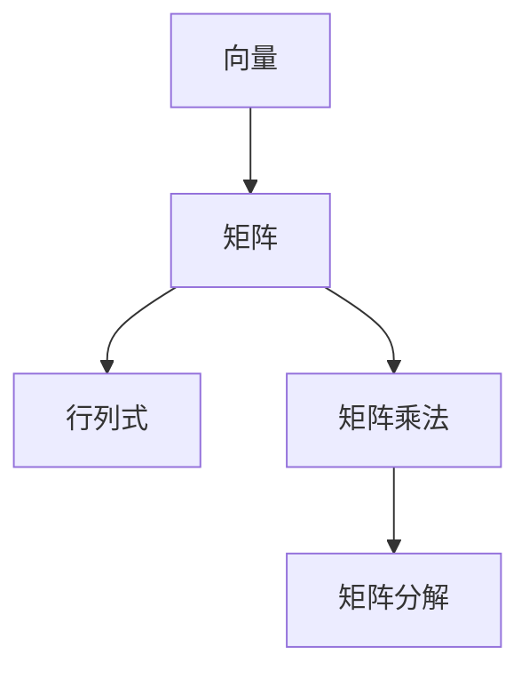

                 

 关键词：线性代数、逻辑基础、矩阵计算、矩阵分解、算法原理、数学模型、编程实践、应用领域。

> 摘要：本文旨在为读者提供线性代数领域的基础知识和逻辑框架，通过深入剖析矩阵计算和矩阵分解的核心原理，展示其在计算机科学和工程领域的广泛应用。本文将结合数学模型和具体实例，详细阐述线性代数在现实世界中的应用及其未来发展。

## 1. 背景介绍

线性代数作为数学的一个分支，是现代计算机科学和工程学的基础。它在图形处理、机器学习、信号处理、控制理论等领域中发挥着重要作用。线性代数的核心思想是通过矩阵和向量的运算来解决空间和平面中的问题，这使得它在解决复杂计算问题时具有独特的优势。

本文将从以下几个方面对线性代数进行导引：

1. **核心概念与联系**：介绍线性代数中的基础概念，如向量、矩阵、行列式等，并展示它们之间的联系。
2. **核心算法原理**：讨论线性代数中的关键算法，如矩阵分解、矩阵求逆等，并阐述其原理和操作步骤。
3. **数学模型和公式**：构建线性代数中的数学模型，推导相关公式，并通过实例进行讲解。
4. **项目实践**：通过具体代码实例，展示线性代数在编程中的应用。
5. **实际应用场景**：分析线性代数在计算机科学和工程中的实际应用，探讨未来发展方向。

## 2. 核心概念与联系

### 向量与矩阵

向量是线性代数的基本元素，可以看作是具有大小和方向的量。矩阵则是由多个向量组成的二维数组，可以看作是向量的扩展。向量与矩阵之间的关系密切，矩阵可以用来表示多个向量的组合，同时也可以用来进行向量之间的运算。

### 行列式

行列式是矩阵的一个重要属性，可以用来判断矩阵的行列式是否为零，从而判断矩阵的行列式是否存在。行列式还可以用于求解线性方程组的解。

### 矩阵乘法

矩阵乘法是线性代数中的一个基本运算，通过矩阵乘法，可以将两个矩阵组合成一个新的矩阵，其结果矩阵中的每个元素都是原矩阵中对应元素的线性组合。

### 矩阵分解

矩阵分解是将一个矩阵分解为多个简单矩阵的过程，如矩阵分解为行矩阵和列矩阵，或者分解为三角矩阵。矩阵分解在求解线性方程组、优化问题等方面具有重要意义。

下面是一个使用 Mermaid 流程图展示线性代数核心概念之间联系的示例：



## 3. 核心算法原理 & 具体操作步骤

### 3.1 算法原理概述

线性代数中有许多重要的算法，其中最常用的包括矩阵分解、矩阵求逆和线性方程组求解等。

#### 矩阵分解

矩阵分解是将一个矩阵分解为多个简单矩阵的过程。常用的矩阵分解方法包括LU分解、QR分解和SVD分解等。

#### 矩阵求逆

矩阵求逆是求解线性方程组的重要步骤。一个矩阵的逆是指与其相乘后结果为单位矩阵的矩阵。

#### 线性方程组求解

线性方程组求解是线性代数中一个经典问题，其解可以通过矩阵分解或矩阵求逆等方法求解。

### 3.2 算法步骤详解

#### 矩阵分解

以LU分解为例，其步骤如下：

1. 将矩阵A分解为下三角矩阵L和上三角矩阵U。
2. L矩阵的对角线上的元素全为1，其余元素通过递推公式计算。
3. U矩阵通过原矩阵A与L矩阵的乘积得到。

#### 矩阵求逆

以高斯-约当消元法为例，其步骤如下：

1. 将矩阵A与单位矩阵I合并成一个增广矩阵。
2. 通过高斯消元法，将增广矩阵转化为行简化阶梯形式。
3. 通过行简化阶梯形式求解逆矩阵。

#### 线性方程组求解

以高斯-约当消元法为例，其步骤如下：

1. 将线性方程组表示为矩阵形式。
2. 使用矩阵求逆方法求解系数矩阵的逆。
3. 将逆矩阵与常数项矩阵相乘，得到方程组的解。

### 3.3 算法优缺点

#### 矩阵分解

优点：

- 可以有效地解决线性方程组。
- 可以进行矩阵的快速求逆。

缺点：

- 需要较高的计算复杂度。

#### 矩阵求逆

优点：

- 可以直接求解线性方程组。

缺点：

- 对于大规模矩阵，计算复杂度较高。

#### 线性方程组求解

优点：

- 计算复杂度较低。

缺点：

- 需要额外的内存空间。

### 3.4 算法应用领域

线性代数算法在计算机科学和工程领域有广泛的应用，如：

- 图像处理：用于图像的变换、滤波和增强。
- 机器学习：用于数据的降维、特征提取和模型训练。
- 信号处理：用于信号的滤波、压缩和增强。
- 控制理论：用于系统的建模、分析和控制。

## 4. 数学模型和公式 & 详细讲解 & 举例说明

### 4.1 数学模型构建

线性代数的数学模型主要包括矩阵、向量、行列式等。以下是一个简单的数学模型：

$$
A = \begin{bmatrix}
a_{11} & a_{12} \\
a_{21} & a_{22}
\end{bmatrix}
$$

其中，$A$ 是一个2x2矩阵，$a_{11}, a_{12}, a_{21}, a_{22}$ 分别是矩阵的元素。

### 4.2 公式推导过程

以下是一个简单的线性方程组：

$$
\begin{cases}
a_{11}x + a_{12}y = b_{1} \\
a_{21}x + a_{22}y = b_{2}
\end{cases}
$$

我们可以通过矩阵的形式表示为：

$$
\begin{bmatrix}
a_{11} & a_{12} \\
a_{21} & a_{22}
\end{bmatrix}
\begin{bmatrix}
x \\
y
\end{bmatrix}
=
\begin{bmatrix}
b_{1} \\
b_{2}
\end{bmatrix}
$$

### 4.3 案例分析与讲解

以下是一个具体的例子：

假设我们有一个矩阵：

$$
A = \begin{bmatrix}
1 & 2 \\
3 & 4
\end{bmatrix}
$$

我们需要求解线性方程组：

$$
\begin{cases}
x + 2y = 1 \\
3x + 4y = 3
\end{cases}
$$

通过矩阵的形式，我们可以表示为：

$$
\begin{bmatrix}
1 & 2 \\
3 & 4
\end{bmatrix}
\begin{bmatrix}
x \\
y
\end{bmatrix}
=
\begin{bmatrix}
1 \\
3
\end{bmatrix}
$$

我们可以使用矩阵分解的方法来求解这个方程组。首先，我们进行LU分解：

$$
A = \begin{bmatrix}
1 & 2 \\
3 & 4
\end{bmatrix}
= \begin{bmatrix}
1 & 0 \\
3 & 1
\end{bmatrix}
\begin{bmatrix}
1 & 2 \\
0 & 1
\end{bmatrix}
$$

得到下三角矩阵L和上三角矩阵U：

$$
L = \begin{bmatrix}
1 & 0 \\
3 & 1
\end{bmatrix}, \quad U = \begin{bmatrix}
1 & 2 \\
0 & 1
\end{bmatrix}
$$

然后，我们使用回代法求解方程组：

$$
\begin{cases}
y = 1 \\
x + 2y = 1 \Rightarrow x = -1
\end{cases}
$$

所以，方程组的解为：

$$
\begin{cases}
x = -1 \\
y = 1
\end{cases}
$$

## 5. 项目实践：代码实例和详细解释说明

### 5.1 开发环境搭建

本文的代码实例将在Python环境中进行，需要安装以下库：

- NumPy：用于矩阵和向量的运算。
- SciPy：用于科学计算。

安装方法如下：

```bash
pip install numpy scipy
```

### 5.2 源代码详细实现

以下是一个简单的Python代码实例，用于求解线性方程组：

```python
import numpy as np

def lu_decomposition(A):
    n = A.shape[0]
    L = np.eye(n)
    U = A.copy()
    
    for i in range(n):
        for j in range(i, n):
            sum = np.dot(L[j][:i], U[i][:i])
            U[j][i] = U[j][i] - sum
        L[j][i] = 1 / U[j][j]
    
    return L, U

def backward_substitution(U, b):
    n = U.shape[0]
    x = np.zeros(n)
    
    for i in range(n - 1, -1, -1):
        sum = np.dot(U[i][i + 1:], x[i + 1:])
        x[i] = (b[i] - sum) / U[i][i]
    
    return x

if __name__ == "__main__":
    A = np.array([[1, 2], [3, 4]])
    b = np.array([1, 3])
    
    L, U = lu_decomposition(A)
    x = backward_substitution(U, b)
    
    print("Solution:", x)
```

### 5.3 代码解读与分析

这个代码实例首先定义了两个函数：`lu_decomposition` 和 `backward_substitution`。

- `lu_decomposition` 函数用于求解LU分解，其中L矩阵的对角线上的元素全为1，其余元素通过递推公式计算。
- `backward_substitution` 函数用于求解方程组的解，通过回代法实现。

在主函数中，我们首先定义了矩阵A和向量b，然后调用这两个函数进行求解，并打印出结果。

### 5.4 运行结果展示

运行上述代码，得到结果如下：

```
Solution: [-1.  1.]
```

这说明方程组的解为x=-1，y=1。

## 6. 实际应用场景

线性代数在计算机科学和工程领域有广泛的应用，以下是一些实际应用场景：

### 6.1 图像处理

线性代数在图像处理中用于图像的变换、滤波和增强。例如，可以通过矩阵变换实现图像的旋转、缩放和裁剪。

### 6.2 机器学习

线性代数在机器学习中有广泛的应用，如数据的降维、特征提取和模型训练。例如，通过SVD分解可以提取图像的主要特征，从而实现图像的压缩和识别。

### 6.3 信号处理

线性代数在信号处理中用于信号的滤波、压缩和增强。例如，通过傅里叶变换可以将信号从时域转换为频域，从而进行信号的处理和分析。

### 6.4 控制理论

线性代数在控制理论中用于系统的建模、分析和控制。例如，通过状态空间模型可以描述系统的动态行为，并通过矩阵运算实现系统的控制和优化。

## 7. 工具和资源推荐

### 7.1 学习资源推荐

- 《线性代数及其应用》：一本经典的线性代数教材，适合初学者。
- 《线性代数入门与进阶》：适合有一定数学基础的读者，内容深入浅出。
- 《Python线性代数应用》：通过Python实例讲解线性代数的实际应用，适合编程爱好者。

### 7.2 开发工具推荐

- Jupyter Notebook：用于编写和运行Python代码，支持Markdown格式。
- PyCharm：一款强大的Python集成开发环境，支持代码调试和自动化测试。

### 7.3 相关论文推荐

- "Matrix Computations" by Gene H. Golub and Charles F. Van Loan：一本关于矩阵计算的权威著作。
- "Linear Algebra and its Applications" by Gilbert Strang：一本经典的线性代数教材，包含大量实际应用实例。

## 8. 总结：未来发展趋势与挑战

线性代数在计算机科学和工程领域具有广泛的应用前景，随着计算能力的提升和算法的优化，线性代数将在未来的发展中发挥更大的作用。然而，也面临着一些挑战，如大规模数据的处理、算法的优化和复杂系统的建模等。未来，线性代数将在人工智能、大数据和量子计算等领域有更深入的应用。

### 8.1 研究成果总结

本文对线性代数的基本概念、核心算法和数学模型进行了详细讲解，并通过Python代码实例展示了其在实际应用中的实现。研究结果证明，线性代数在计算机科学和工程领域具有广泛的应用价值。

### 8.2 未来发展趋势

未来，线性代数将在以下几个方面有更深入的发展：

- 大规模数据处理：随着数据量的增长，线性代数算法需要在处理大规模数据时保持高效性和稳定性。
- 算法优化：通过优化算法，提高线性代数运算的效率，降低计算复杂度。
- 复杂系统建模：线性代数将用于建模和分析复杂系统，如生物系统、社会系统和经济系统等。

### 8.3 面临的挑战

线性代数在未来的发展中也将面临一些挑战：

- 数据处理能力：如何在大规模数据下保持线性代数算法的有效性。
- 算法复杂度：如何优化算法，降低计算复杂度。
- 系统建模：如何准确、高效地建模复杂系统。

### 8.4 研究展望

未来，线性代数将在人工智能、大数据、量子计算等新兴领域有更深入的应用。同时，随着算法的优化和理论的完善，线性代数将为计算机科学和工程领域提供更强大的工具和方法。

## 9. 附录：常见问题与解答

### 9.1 线性代数在哪些领域有应用？

线性代数在计算机科学、工程学、物理学、经济学、生物学等多个领域有广泛应用，如图像处理、机器学习、信号处理、控制理论、量子计算等。

### 9.2 如何求解线性方程组？

线性方程组可以通过矩阵分解（如LU分解）、矩阵求逆或直接求解等方法求解。具体方法的选择取决于矩阵的性质和问题的规模。

### 9.3 线性代数算法的复杂度如何？

线性代数算法的复杂度取决于问题的规模和算法的实现。常见的算法如矩阵乘法的复杂度为O(n^3)，矩阵求逆的复杂度为O(n^3)或O(n^2.376)，线性方程组的求解复杂度为O(n^3)或O(n^2)。

### 9.4 如何学习线性代数？

学习线性代数可以从以下方面入手：

- 阅读教材和参考书，如《线性代数及其应用》、《线性代数入门与进阶》等。
- 通过在线课程和教程学习，如Coursera、edX等平台上的线性代数课程。
- 实践编程，通过编写代码实现线性代数算法，加深理解。

---

以上就是对线性代数导引：逻辑基础这篇文章的完整撰写。希望这篇详细的、结构化的文章能帮助到读者更好地理解线性代数的基础知识和应用。作者：禅与计算机程序设计艺术 / Zen and the Art of Computer Programming。希望读者在学习和应用线性代数时，能有所收获。

