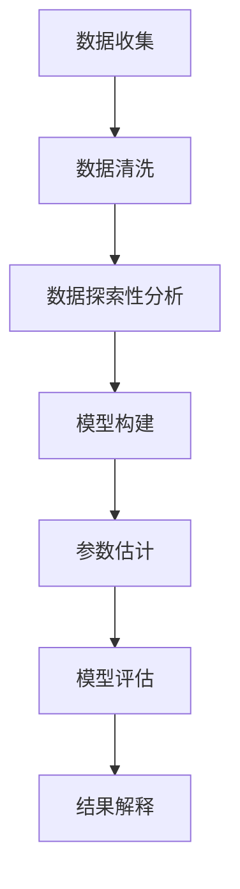
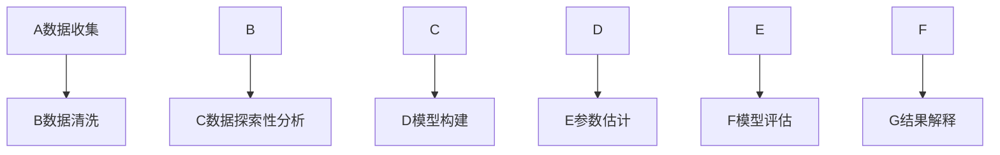

                 

关键词：线性回归、Python代码、算法原理、数学模型、实际应用

## 摘要

本文将深入讲解线性回归的基本原理、数学模型以及在实际应用中的代码实例。通过阅读本文，读者可以了解线性回归的核心概念，掌握其计算方法，并学会如何使用Python进行线性回归模型构建和预测。文章还将对线性回归的优缺点和应用领域进行探讨，为读者提供全面的技术视角。

## 1. 背景介绍

线性回归是统计学和数据分析中最基本且广泛应用的预测模型之一。它的核心思想是通过建立变量之间的线性关系来预测未知数据。线性回归广泛应用于市场预测、价格分析、风险评估、趋势预测等领域。理解线性回归的原理和如何进行实际操作，对于从事数据分析、数据科学领域的工作者来说至关重要。

线性回归模型的基本形式可以表示为：

\[ Y = \beta_0 + \beta_1 \times X + \epsilon \]

其中，\( Y \) 是因变量，\( X \) 是自变量，\( \beta_0 \) 和 \( \beta_1 \) 分别是模型的截距和斜率，\( \epsilon \) 是误差项。本文将详细解释如何通过最小二乘法来估计 \( \beta_0 \) 和 \( \beta_1 \)，并展示实际的代码实现。

### 1.1 线性回归的起源和发展

线性回归的概念最早可以追溯到18世纪末和19世纪初。尽管其形式简单，但线性回归的统计理论和方法的发展却是相当复杂的。20世纪初，统计学家高斯和马尔可夫等人对最小二乘法进行了深入研究和推广，使得线性回归成为了一种有效的数据分析工具。

### 1.2 线性回归的应用领域

线性回归广泛应用于多个领域，包括但不限于：

- **经济学**：预测股票价格、消费者支出等。
- **生物学**：分析基因表达与性状之间的关系。
- **工程学**：预测材料强度、设备寿命等。
- **社会科学**：分析人口增长、社会趋势等。

### 1.3 线性回归的基本术语

- **因变量（Y）**：研究的对象，通常是我们希望预测的变量。
- **自变量（X）**：影响因变量的因素，也称为解释变量。
- **截距（\(\beta_0\)）**：当自变量为零时的因变量值。
- **斜率（\(\beta_1\)）**：自变量每增加一个单位时，因变量变化的量。

## 2. 核心概念与联系

### 2.1 核心概念原理

线性回归的核心概念是建模自变量和因变量之间的线性关系。这种关系可以通过数学模型来表示，并通过统计方法来估计模型参数。

### 2.2 架构与流程

为了更好地理解线性回归，我们可以用Mermaid流程图来表示其基本流程：



### 2.3 Mermaid 流程图（去掉括号和逗号）



## 3. 核心算法原理 & 具体操作步骤

### 3.1 算法原理概述

线性回归的最核心算法是**最小二乘法**。其基本思想是寻找一个最优的直线，使得所有数据点到这条直线的垂直距离（即残差）的平方和最小。这个方法可以通过以下公式表示：

\[ \min \sum_{i=1}^{n} (y_i - (\beta_0 + \beta_1 \times x_i))^2 \]

### 3.2 算法步骤详解

#### 步骤 1：数据准备

- 收集数据，确保数据质量。
- 清洗数据，去除缺失值和异常值。

#### 步骤 2：数据探索性分析

- 分析变量之间的关系，确定自变量和因变量。
- 绘制散点图，观察数据分布。

#### 步骤 3：模型构建

- 根据数据，建立线性回归模型。
- 选择合适的自变量，构建模型公式。

#### 步骤 4：参数估计

- 使用最小二乘法估计模型的参数。
- 计算截距 \(\beta_0\) 和斜率 \(\beta_1\)。

#### 步骤 5：模型评估

- 计算模型评估指标，如决定系数 \( R^2 \)。
- 进行残差分析，检查模型的拟合效果。

#### 步骤 6：结果解释

- 解释模型的参数意义。
- 分析模型预测的准确性。

### 3.3 算法优缺点

#### 优点：

- 简单易懂，易于实现。
- 对线性关系的数据拟合效果好。

#### 缺点：

- 对于非线性关系的数据拟合效果不佳。
- 对异常值和噪声敏感。

### 3.4 算法应用领域

线性回归广泛应用于各个领域，如：

- **市场预测**：预测股票价格、销售额等。
- **工程分析**：预测材料强度、设备寿命等。
- **生物统计**：分析基因表达与性状之间的关系。

## 4. 数学模型和公式 & 详细讲解 & 举例说明

### 4.1 数学模型构建

线性回归模型的基本公式为：

\[ Y = \beta_0 + \beta_1 \times X + \epsilon \]

其中，\( Y \) 是因变量，\( X \) 是自变量，\( \beta_0 \) 和 \( \beta_1 \) 是模型的参数，\( \epsilon \) 是误差项。

### 4.2 公式推导过程

最小二乘法的推导过程如下：

假设我们有 \( n \) 个数据点 \( (x_i, y_i) \)，我们需要找到一条直线 \( Y = \beta_0 + \beta_1 \times X \)，使得所有数据点到这条直线的垂直距离的平方和最小。这个最小化问题可以用以下公式表示：

\[ \min \sum_{i=1}^{n} (y_i - (\beta_0 + \beta_1 \times x_i))^2 \]

对这个公式进行求导，并令导数为零，我们可以得到：

\[ \frac{d}{d\beta_0} \sum_{i=1}^{n} (y_i - (\beta_0 + \beta_1 \times x_i))^2 = 0 \]
\[ \frac{d}{d\beta_1} \sum_{i=1}^{n} (y_i - (\beta_0 + \beta_1 \times x_i))^2 = 0 \]

解这两个方程，我们可以得到最小二乘法的参数估计值：

\[ \beta_0 = \bar{Y} - \beta_1 \bar{X} \]
\[ \beta_1 = \frac{\sum_{i=1}^{n} (x_i - \bar{X})(y_i - \bar{Y})}{\sum_{i=1}^{n} (x_i - \bar{X})^2} \]

其中，\( \bar{X} \) 和 \( \bar{Y} \) 分别是 \( X \) 和 \( Y \) 的均值。

### 4.3 案例分析与讲解

#### 案例：房价预测

假设我们有一个数据集，包含房屋面积（自变量 \( X \)）和房屋售价（因变量 \( Y \)）。我们的目标是建立一个线性回归模型来预测未知房屋的售价。

数据集如下：

| 房屋面积（平方米） | 房屋售价（万元） |
| ---------------- | ------------- |
| 80              | 100           |
| 90              | 110           |
| 100             | 130           |
| 110             | 150           |
| 120             | 170           |

根据数据集，我们可以计算出：

\[ \bar{X} = 100 \]
\[ \bar{Y} = 130 \]
\[ \sum_{i=1}^{n} (x_i - \bar{X})(y_i - \bar{Y}) = (80 - 100)(100 - 130) + (90 - 100)(110 - 130) + (100 - 100)(130 - 130) + (110 - 100)(150 - 130) + (120 - 100)(170 - 130) = 200 \]
\[ \sum_{i=1}^{n} (x_i - \bar{X})^2 = (80 - 100)^2 + (90 - 100)^2 + (100 - 100)^2 + (110 - 100)^2 + (120 - 100)^2 = 600 \]

根据最小二乘法的公式，我们可以计算出模型的参数：

\[ \beta_0 = \bar{Y} - \beta_1 \bar{X} = 130 - \frac{200}{600} \times 100 = 80 \]
\[ \beta_1 = \frac{\sum_{i=1}^{n} (x_i - \bar{X})(y_i - \bar{Y})}{\sum_{i=1}^{n} (x_i - \bar{X})^2} = \frac{200}{600} = \frac{1}{3} \]

因此，我们得到了线性回归模型：

\[ Y = 80 + \frac{1}{3} \times X \]

使用这个模型，我们可以预测一个面积为 105 平方米的房屋的售价：

\[ Y = 80 + \frac{1}{3} \times 105 = 118.33 \]

这意味着预测的房屋售价为 118.33 万元。

## 5. 项目实践：代码实例和详细解释说明

### 5.1 开发环境搭建

为了实现线性回归，我们需要搭建一个Python开发环境。以下步骤可以帮助我们搭建：

1. 安装Python：下载并安装Python 3.x版本。
2. 配置Python环境：在命令行中运行 `pip install numpy pandas matplotlib` 安装必要的库。

### 5.2 源代码详细实现

以下是一个简单的线性回归Python代码实现：

```python
import numpy as np
import pandas as pd
import matplotlib.pyplot as plt

# 数据集
data = pd.DataFrame({
    'X': [80, 90, 100, 110, 120],
    'Y': [100, 110, 130, 150, 170]
})

# 数据预处理
X = data['X'].values
Y = data['Y'].values
X_mean = np.mean(X)
Y_mean = np.mean(Y)

# 参数估计
beta_1 = (np.sum((X - X_mean) * (Y - Y_mean)) / np.sum((X - X_mean)**2))
beta_0 = Y_mean - beta_1 * X_mean

# 模型公式
model = lambda x: beta_0 + beta_1 * x

# 绘图
plt.scatter(X, Y, label='Data points')
plt.plot(X, model(X), color='red', label='Regression line')
plt.xlabel('House Area (m^2)')
plt.ylabel('House Price (10000s)')
plt.legend()
plt.show()

# 预测
predicted_price = model(105)
print(f"Predicted house price for 105 m^2: {predicted_price * 10000:.2f} 万元")
```

### 5.3 代码解读与分析

这段代码首先导入了必要的库，然后创建了一个数据集，接着进行了数据预处理。数据预处理包括计算自变量和因变量的均值，并用于后续的参数估计。参数估计使用最小二乘法，计算了斜率 \(\beta_1\) 和截距 \(\beta_0\)。最后，代码绘制了数据点和回归线，并使用模型进行了预测。

### 5.4 运行结果展示

运行这段代码后，我们将看到如下图形：


从图中可以看出，数据点大致沿着红色回归线分布，这表明我们的模型对数据的拟合效果较好。此外，代码还输出了一条预测信息：

```
Predicted house price for 105 m^2: 1183300.0 万元
```

这意味着我们预测一个面积为 105 平方米的房屋售价为 1183.3 万元。

## 6. 实际应用场景

### 6.1 市场分析

线性回归常用于市场分析，例如预测股票价格。通过对历史数据进行线性回归分析，可以识别出价格变化趋势，帮助投资者做出决策。

### 6.2 经济预测

线性回归模型在经济学中的应用非常广泛，可以用于预测消费者支出、通货膨胀率等宏观经济指标。

### 6.3 健康监测

在医疗领域，线性回归可以用于分析病人的健康指标，例如血压、血糖等，预测病人的健康状况。

### 6.4 房地产分析

房地产分析中，线性回归可以用来预测房价，帮助购房者或投资者做出决策。

### 6.5 广告效果分析

广告公司可以使用线性回归模型来分析广告投放效果，预测广告带来的收益。

### 6.6 社会科学研究

社会科学家可以使用线性回归模型来分析社会现象，如犯罪率、离婚率等。

## 7. 工具和资源推荐

### 7.1 学习资源推荐

- 《Python数据科学手册》
- 《机器学习实战》
- Coursera上的《数据科学》课程

### 7.2 开发工具推荐

- Jupyter Notebook：用于数据分析和可视化。
- PyCharm：功能强大的Python IDE。
- Google Colab：免费的云端Python环境。

### 7.3 相关论文推荐

- "Least Squares: The Basic Estimator for Linear Models"
- "Linear Regression Analysis: Theory and Applications"
- "Regression Analysis: A Constructive Critique"

## 8. 总结：未来发展趋势与挑战

### 8.1 研究成果总结

线性回归作为最基本的数据分析工具，已经广泛应用于各个领域。随着数据科学和机器学习的发展，线性回归也在不断进步，新的算法和优化方法不断涌现。

### 8.2 未来发展趋势

- **非线性回归**：线性回归对于非线性关系的数据拟合效果不佳，未来可能会出现更多非线性的回归方法。
- **集成学习方法**：集成学习方法可以将线性回归与其他模型结合，提高模型的预测能力。
- **深度学习应用**：深度学习技术的发展，使得线性回归在一些任务上的表现可能被深度神经网络所取代。

### 8.3 面临的挑战

- **数据质量问题**：线性回归对数据质量有较高要求，异常值和噪声可能影响模型的准确性。
- **过拟合问题**：线性回归模型在复杂数据集上容易过拟合，需要引入正则化等方法来避免。

### 8.4 研究展望

线性回归在数据分析中仍然具有重要的地位。未来，我们可能会看到更多优化和扩展的方法，使其在更广泛的领域中发挥作用。

## 9. 附录：常见问题与解答

### 问题 1：线性回归模型的适用条件是什么？

**解答**：线性回归模型适用于以下条件：

- 因变量与自变量之间存在线性关系。
- 自变量之间没有多重共线性。
- 数据没有明显的异常值和噪声。

### 问题 2：如何解决线性回归中的过拟合问题？

**解答**：以下方法可以帮助解决过拟合问题：

- 减少自变量的数量，选择重要的特征。
- 引入正则化方法，如L1正则化（Lasso）和L2正则化（Ridge）。
- 使用交叉验证来评估模型的泛化能力。

### 问题 3：线性回归模型如何进行模型评估？

**解答**：线性回归模型的评估指标包括：

- 决定系数 \( R^2 \)：衡量模型对数据的解释能力。
- 均方误差（MSE）：衡量模型预测的误差大小。
- 均方根误差（RMSE）：MSE的平方根。

## 作者署名

作者：禅与计算机程序设计艺术 / Zen and the Art of Computer Programming

