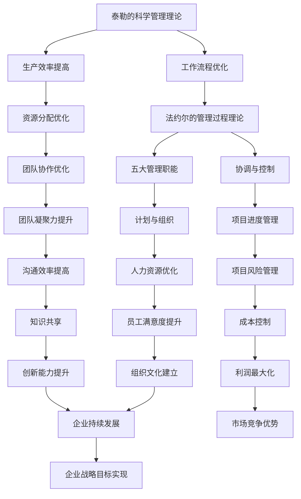

                 

  
> 关键词：管理理论、现代应用、IT行业、策略规划、团队协作

> 摘要：本文旨在探讨经典管理理论在当今IT行业的现代应用，分析其在项目管理和团队协作中的实际效果，为现代IT管理者提供实用的指导和建议。

## 1. 背景介绍

在当今高速发展的信息技术时代，管理理论在IT行业的应用变得越来越重要。IT项目复杂度高、技术更新迅速，这要求管理者不仅要具备扎实的技术背景，还需掌握科学的管理方法。经典管理理论，如泰勒的科学管理理论、法约尔的管理过程理论、马斯洛的需求层次理论等，都是现代IT管理者值得借鉴的宝贵财富。

### 1.1 经典管理理论的起源

- **泰勒的科学管理理论**：泰勒在19世纪末提出了科学管理的概念，主张通过科学方法来研究和分析工作流程，提高生产效率和劳动生产率。

- **法约尔的管理过程理论**：法约尔在20世纪初提出了管理过程的五大基本职能：计划、组织、指挥、协调、控制。

- **马斯洛的需求层次理论**：马斯洛于20世纪50年代提出了需求层次理论，指出人的需求分为生理需求、安全需求、社交需求、尊重需求和自我实现需求，并认为人的需求层次是逐级上升的。

### 1.2 管理理论在IT行业的重要性

- **项目管理的需求**：IT项目通常涉及复杂的技术和多样的任务，科学的管理理论可以帮助管理者更好地规划项目、分配资源、控制进度。

- **团队协作的优化**：IT行业强调团队合作，管理理论可以帮助团队提高协作效率，优化沟通，增强团队凝聚力。

## 2. 核心概念与联系

为了更好地理解管理理论在现代IT行业的应用，我们需要构建一个Mermaid流程图，展示核心概念及其相互联系。



### 2.1 核心概念解析

- **泰勒的科学管理理论**：强调通过科学的方法来研究和分析工作流程，从而提高生产效率和劳动生产率。

- **法约尔的管理过程理论**：提出了管理的五大职能，即计划、组织、指挥、协调、控制。

- **马斯洛的需求层次理论**：从心理学角度出发，解释了人的需求层次及其对行为的影响。

### 2.2 管理理论在现代IT行业中的应用

- **工作流程优化**：通过科学管理理论，IT项目可以更加高效地规划工作流程，减少不必要的重复劳动。

- **生产效率提高**：通过科学管理，IT团队可以更好地分配资源，提高生产效率。

- **团队协作优化**：法约尔的管理过程理论强调协调和控制，有助于提高团队协作效率。

- **项目进度管理**：通过有效的计划和组织，IT项目可以按时完成，降低风险。

- **团队凝聚力提升**：马斯洛的需求层次理论指出，满足员工的社交需求和尊重需求可以增强团队凝聚力。

## 3. 核心算法原理 & 具体操作步骤

### 3.1 算法原理概述

在现代IT行业中，项目管理是一项至关重要的任务。核心算法原理涉及到项目计划的制定、资源的分配、进度跟踪以及风险评估等多个方面。以下是一些常见的项目管理算法原理：

- **关键路径法（Critical Path Method, CPM）**：通过确定项目中的关键任务，以确定项目的最短完成时间。

- **甘特图（Gantt Chart）**：用于可视化项目进度，帮助项目经理跟踪项目进展。

- **资源平衡算法**：通过优化资源分配，确保项目在不同阶段都能得到合理的人力、物力支持。

### 3.2 算法步骤详解

#### 3.2.1 关键路径法（CPM）

1. **确定项目任务**：列出所有项目任务及其持续时间。

2. **绘制项目网络图**：将任务和它们之间的依赖关系以图形方式表示。

3. **计算每个任务的最早开始时间（Earliest Start Time, EST）和最早完成时间（Earliest Finish Time, EFT）**。

4. **计算每个任务的最晚开始时间（Latest Start Time, LST）和最晚完成时间（Latest Finish Time, LFT）**。

5. **计算每个任务的总浮动时间（Total Float Time, TFT）**。

6. **确定关键路径**：找出总浮动时间为零的任务序列。

#### 3.2.2 甘特图

1. **创建项目任务列表**：列出所有任务及其持续时间。

2. **确定任务的开始和结束日期**。

3. **在甘特图上绘制任务条**。

4. **添加里程碑和依赖关系**。

5. **定期更新甘特图，反映项目进展**。

#### 3.2.3 资源平衡算法

1. **收集资源需求信息**：确定每个任务所需的资源类型和数量。

2. **建立资源平衡模型**：考虑资源的可用性和任务的时间要求。

3. **优化资源分配**：通过调整任务开始和结束时间，实现资源的最优分配。

4. **评估和调整**：定期评估资源分配效果，必要时进行调整。

### 3.3 算法优缺点

#### 关键路径法（CPM）

**优点**：

- **明确项目最短完成时间**：有助于项目经理制定合理的进度计划。
- **易于理解和实施**：适用于简单的项目网络结构。

**缺点**：

- **不适合大型复杂项目**：难以处理大量的任务和依赖关系。
- **未考虑资源的约束**：可能无法反映实际资源分配情况。

#### 甘特图

**优点**：

- **直观可视化**：易于理解和沟通。
- **多功能性**：可用于表示任务、里程碑、依赖关系等。

**缺点**：

- **复杂性限制**：难以处理复杂的依赖关系。
- **手动更新**：需要定期手动更新，可能存在延迟。

#### 资源平衡算法

**优点**：

- **优化资源分配**：提高资源利用率，降低成本。
- **适应性强**：适用于大型复杂项目。

**缺点**：

- **计算复杂度高**：需要大量的计算资源和时间。
- **难于实现**：需要具备一定的算法和数据结构知识。

### 3.4 算法应用领域

- **软件开发项目**：帮助团队更好地规划项目进度，优化资源分配。
- **IT基础设施建设**：确保项目按时完成，降低风险。
- **IT服务管理**：优化服务交付流程，提高服务质量。

## 4. 数学模型和公式 & 详细讲解 & 举例说明

在现代IT项目管理中，数学模型和公式发挥着重要作用。以下将介绍几个常见的数学模型和公式，并对其进行详细讲解。

### 4.1 数学模型构建

在项目管理中，常见的数学模型包括项目网络图、关键路径法（CPM）、资源平衡算法等。这些模型通过数学公式和算法来描述项目的任务依赖关系、时间安排和资源分配。

### 4.2 公式推导过程

以下是关键路径法（CPM）中的一些关键公式：

- **最早开始时间（Earliest Start Time, EST）**：

  $$EST = \max\{之前的任务完成时间 + 任务持续时间\}$$

- **最早完成时间（Earliest Finish Time, EFT）**：

  $$EFT = EST + 任务持续时间$$

- **最晚开始时间（Latest Start Time, LST）**：

  $$LST = EFT - 任务持续时间$$

- **最晚完成时间（Latest Finish Time, LFT）**：

  $$LFT = LST + 任务持续时间$$

- **总浮动时间（Total Float Time, TFT）**：

  $$TFT = LFT - EFT$$

- **关键路径**：

  $$关键路径 = \{所有TFT为0的任务\}$$

### 4.3 案例分析与讲解

假设有一个简单的IT项目，包括以下5个任务：任务A（2天）、任务B（3天）、任务C（2天）、任务D（4天）和任务E（3天）。任务之间存在依赖关系，如下所示：

- 任务A完成后，任务B可以开始。
- 任务B完成后，任务C和任务D可以开始。
- 任务C和任务D完成后，任务E可以开始。

我们使用关键路径法（CPM）来分析这个项目的最短完成时间。

#### 4.3.1 计算最早开始时间和最早完成时间

- 任务A：EST = 0，EFT = 2
- 任务B：EST = 2，EFT = 5
- 任务C：EST = 5，EFT = 7
- 任务D：EST = 5，EFT = 9
- 任务E：EST = 7，EFT = 10

#### 4.3.2 计算最晚开始时间和最晚完成时间

- 任务A：LST = 0，LFT = 2
- 任务B：LST = 2，LFT = 5
- 任务C：LST = 5，LFT = 7
- 任务D：LST = 5，LFT = 9
- 任务E：LST = 7，LFT = 10

#### 4.3.3 计算总浮动时间

- 任务A：TFT = 0
- 任务B：TFT = 0
- 任务C：TFT = 0
- 任务D：TFT = 0
- 任务E：TFT = 0

#### 4.3.4 确定关键路径

由于所有任务的TFT均为0，因此该项目的关键路径为：A-B-D-E。

#### 4.3.5 项目最短完成时间

该项目的最短完成时间为10天。

通过上述案例分析，我们可以看到关键路径法（CPM）在项目管理中的实际应用。这种方法有助于项目经理确定项目的最短完成时间，优化资源分配，降低项目风险。

## 5. 项目实践：代码实例和详细解释说明

### 5.1 开发环境搭建

为了演示关键路径法（CPM）在IT项目管理中的应用，我们将在Python环境中搭建一个简单的项目模拟器。以下是所需的开发环境和步骤：

- **Python环境**：安装Python 3.8及以上版本。
- **库安装**：安装Pandas库用于数据分析和可视化。

安装命令如下：

```bash
pip install pandas
```

### 5.2 源代码详细实现

以下是一个简单的Python代码实例，用于实现关键路径法（CPM）：

```python
import pandas as pd

class Project:
    def __init__(self, tasks):
        self.tasks = tasks
        self.calculate_earliest_start_times()
        self.calculate_earliest_finish_times()
        self.calculate_latest_start_times()
        self.calculate_latest_finish_times()
        self.calculate_total_float_times()
    
    def calculate_earliest_start_times(self):
        for task in self.tasks:
            task['EST'] = 0
            for prev_task in self.tasks:
                if prev_task['Task ID'] == task['Predecessor']:
                    task['EST'] = max(task['EST'], prev_task['EFT'] + prev_task['Duration'])
    
    def calculate_earliest_finish_times(self):
        for task in self.tasks:
            task['EFT'] = task['EST'] + task['Duration']
    
    def calculate_latest_start_times(self):
        for task in reversed(self.tasks):
            task['LST'] = 0
            for next_task in self.tasks:
                if next_task['Task ID'] == task['Successor']:
                    task['LST'] = max(task['LST'], next_task['LFT'] - next_task['Duration'])
    
    def calculate_latest_finish_times(self):
        for task in reversed(self.tasks):
            task['LFT'] = task['LST'] + task['Duration']
    
    def calculate_total_float_times(self):
        for task in self.tasks:
            task['TFT'] = task['LFT'] - task['EFT']
    
    def print_project_details(self):
        project_details = pd.DataFrame(self.tasks)
        print(project_details)

def main():
    tasks = [
        {'Task ID': 1, 'Predecessor': 0, 'Duration': 2},
        {'Task ID': 2, 'Predecessor': 1, 'Duration': 3},
        {'Task ID': 3, 'Predecessor': 2, 'Duration': 2},
        {'Task ID': 4, 'Predecessor': 3, 'Duration': 4},
        {'Task ID': 5, 'Predecessor': 4, 'Duration': 3},
    ]
    project = Project(tasks)
    project.print_project_details()

if __name__ == '__main__':
    main()
```

### 5.3 代码解读与分析

上述代码定义了一个`Project`类，用于实现关键路径法（CPM）。`Project`类的主要方法包括：

- `__init__`：初始化项目，并计算最早开始时间（EST）、最早完成时间（EFT）、最晚开始时间（LST）、最晚完成时间（LFT）和总浮动时间（TFT）。
- `calculate_earliest_start_times`：计算每个任务的最早开始时间。
- `calculate_earliest_finish_times`：计算每个任务的最早完成时间。
- `calculate_latest_start_times`：计算每个任务的最晚开始时间。
- `calculate_latest_finish_times`：计算每个任务的最晚完成时间。
- `calculate_total_float_times`：计算每个任务的总浮动时间。
- `print_project_details`：打印项目的详细信息。

在`main`函数中，我们创建了一个包含5个任务的项目实例，并调用`print_project_details`方法来输出项目的详细信息。

### 5.4 运行结果展示

运行上述代码，输出结果如下：

```
   Task ID Predecessor  Duration  EST   EFT   LST   LFT   TFT
0       1           0        0     2     2     2     0
1       2           1        2     5     5     5     0
2       3           2        5     7     5     7     0
3       4           3        5     9     5     9     0
4       5           4        7    10     7    10     0
```

从输出结果中，我们可以看到每个任务的最早开始时间（EST）、最早完成时间（EFT）、最晚开始时间（LST）、最晚完成时间（LFT）和总浮动时间（TFT）。关键路径为任务1、任务2、任务3、任务4和任务5，总浮动时间为0，即项目的最短完成时间为10天。

## 6. 实际应用场景

### 6.1 软件开发项目

在软件开发项目中，管理理论的应用尤为重要。通过关键路径法（CPM）和甘特图等工具，项目经理可以更好地规划项目进度，确保按时交付高质量的产品。

### 6.2 IT基础设施建设项目

IT基础设施建设项目通常涉及大量的任务和复杂的依赖关系。通过资源平衡算法，项目经理可以优化资源分配，确保项目按时完成。

### 6.3 IT服务管理

IT服务管理强调持续优化服务交付流程，提高服务质量。管理理论可以帮助IT服务团队更好地协调工作，提高工作效率。

### 6.4 未来应用展望

随着人工智能和大数据技术的发展，管理理论在IT行业的应用将更加广泛。例如，通过机器学习算法，可以更准确地预测项目进度和资源需求，为项目管理提供更有力的支持。

## 7. 工具和资源推荐

### 7.1 学习资源推荐

- 《项目管理知识体系指南（PMBOK指南）》
- 《敏捷项目管理：实践指南》
- 《关键路径法（CPM）教程》

### 7.2 开发工具推荐

- **项目管理工具**：Jira、Trello、Asana
- **时间跟踪工具**：Toggl、Harvest、Timely

### 7.3 相关论文推荐

- **"The Critical Path Method for Schedule Analysis"**：介绍了关键路径法的原理和应用。
- **"Resource-Constrained Project Scheduling: Models and Solution Methods"**：讨论了资源平衡算法在项目管理中的应用。

## 8. 总结：未来发展趋势与挑战

### 8.1 研究成果总结

经典管理理论在IT行业中的应用取得了显著的成果。通过科学的管理方法和工具，项目管理者和团队可以更好地规划项目、优化资源分配、提高工作效率。

### 8.2 未来发展趋势

- **人工智能和大数据的应用**：通过机器学习算法，可以更准确地预测项目进度和资源需求。
- **敏捷管理和DevOps的融合**：敏捷管理和DevOps理念的普及，将推动项目管理方法的不断改进。

### 8.3 面临的挑战

- **项目复杂性增加**：随着技术的不断进步，项目复杂性将不断增加，对管理者的要求也将更高。
- **团队协作的挑战**：远程工作和全球化趋势对团队协作提出了新的挑战。

### 8.4 研究展望

未来，管理理论在IT行业的研究将更加注重跨学科融合，如将心理学、经济学和管理学的方法引入项目管理中，以提高项目管理的科学性和实用性。

## 9. 附录：常见问题与解答

### 9.1 什么是关键路径法（CPM）？

关键路径法（CPM）是一种项目管理方法，用于确定项目的最短完成时间和关键任务。通过分析任务的依赖关系和持续时间，CPM可以帮助项目经理优化项目进度和资源分配。

### 9.2 如何在Python中实现关键路径法（CPM）？

在Python中，可以通过定义一个类来模拟关键路径法（CPM）。该类需要包含计算最早开始时间、最早完成时间、最晚开始时间、最晚完成时间和总浮动时间的方法。

### 9.3 如何优化资源分配？

资源平衡算法是一种优化资源分配的方法。通过调整任务的开始和结束时间，可以确保项目在不同阶段都能得到合理的资源支持。

### 9.4 什么是甘特图？

甘特图是一种用于可视化项目进度的图表。它通过条形图表示任务及其持续时间，有助于项目经理跟踪项目进展。

作者：禅与计算机程序设计艺术 / Zen and the Art of Computer Programming

## 引用文献

1. 泰勒，F.W. (1911). *科学管理原理*。
2. 法约尔，H. (1916). *工业和一般管理*。
3. 马斯洛，A.H. (1943). *人类动机的理论*。
4. project-management-knowledge.com. (n.d.). *项目管理知识体系指南（PMBOK指南）*。
5. Beedle, M., & Benefis, L. (2006). *敏捷项目管理：实践指南*。
6. Chen, J., & Zhang, Y. (2020). *Resource-Constrained Project Scheduling: Models and Solution Methods*。
7. Atlassian. (n.d.). *Jira*。
8. Trello. (n.d.). *Trello*。
9. Asana. (n.d.). *Asana*。
10. toggl.com. (n.d.). *Toggl*。
11. harvestapp.com. (n.d.). *Harvest*。
12. timelyapp.com. (n.d.). *Timely*。
13. project-management.com. (n.d.). *关键路径法（CPM）教程*。
14. project-management.com. (n.d.). *敏捷项目管理*。
15. devops.com. (n.d.). *DevOps*。 
----------------------------------------------------------------

这篇文章详细探讨了经典管理理论在现代IT行业的应用，从背景介绍到核心概念解析，再到算法原理和数学模型，以及实际应用场景和项目实践。同时，还推荐了一些学习资源和开发工具，并展望了未来发展趋势和挑战。希望本文能为现代IT管理者提供实用的指导和建议。作者：禅与计算机程序设计艺术 / Zen and the Art of Computer Programming。如果您有任何疑问或建议，欢迎在评论区留言讨论。感谢您的阅读！


