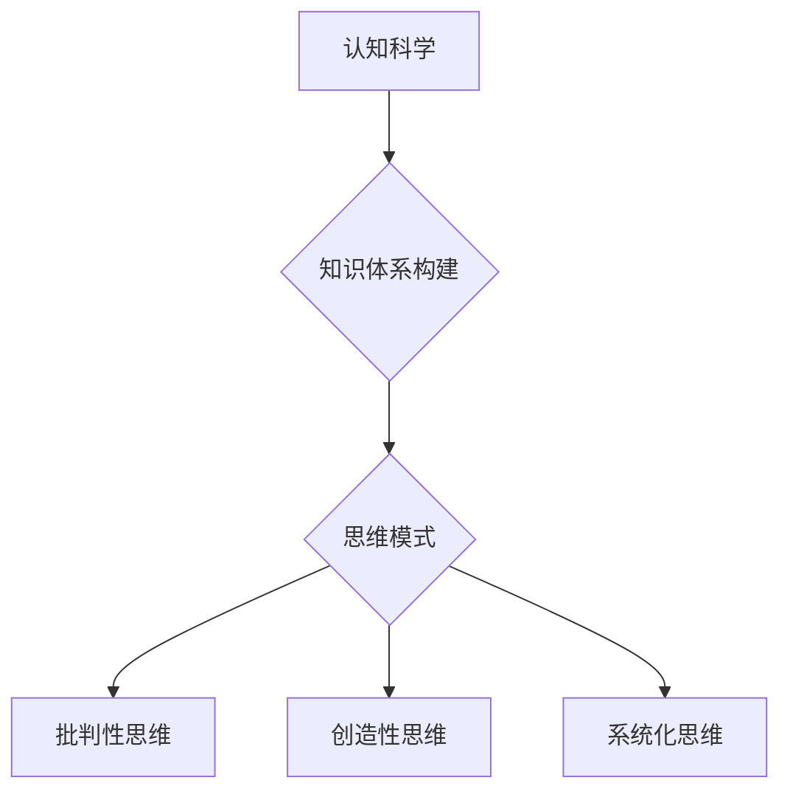

                 

### 1. 背景介绍

在计算机科学迅猛发展的今天，技术更新速度之快令人咋舌。然而，无论技术如何迭代更新，基础的认知能力和思维方式始终是构建技术创新的根基。本文将深入探讨经典阅读在夯实认知根基中的重要作用。

经典阅读不仅仅是为了获取知识，更是为了培养深刻的思考能力、逻辑推理能力和问题解决能力。正如古人所言，“书中自有黄金屋”，经典作品往往蕴含着深刻的哲理和丰富的知识体系，这些都可以为现代技术从业者提供宝贵的思维养分。

本文旨在通过几个关键章节的深入分析，揭示经典阅读如何帮助我们夯实认知根基，进而提升我们在计算机科学领域的专业能力和创新能力。

### 2. 核心概念与联系

在探讨经典阅读对认知能力提升的影响之前，我们有必要先了解几个核心概念：认知科学、知识体系构建和思维模式。

#### 2.1 认知科学

认知科学是一门跨学科的研究领域，涉及心理学、神经科学、计算机科学等多个学科。它的核心目标是理解人类思维的工作原理，包括感知、记忆、思考、决策等过程。认知科学为我们提供了研究人类认知机制的框架和方法，这对于理解经典阅读的作用至关重要。

#### 2.2 知识体系构建

知识体系构建是指个体如何从外部信息中提取、整合和存储知识的过程。经典阅读作为知识获取的重要途径，有助于我们在构建知识体系时，更加系统和深入地理解各个领域的知识结构。通过对经典作品的深入阅读，我们可以发现不同学科之间的联系和共性，从而形成一个更为广泛和立体的知识网络。

#### 2.3 思维模式

思维模式是指个体在处理信息和解决问题时采用的思维方式。经典阅读能够帮助我们培养多种思维模式，包括批判性思维、创造性思维和系统化思维。这些思维模式不仅对学术研究有重要影响，同样在技术实践中具有极高的价值。

#### 2.4 Mermaid 流程图



### 3. 核心算法原理 & 具体操作步骤

在了解核心概念之后，我们接下来将探讨经典阅读在提升认知能力方面的核心算法原理和具体操作步骤。

#### 3.1 算法原理概述

经典阅读提升认知能力的核心算法原理可以归纳为以下几点：

1. **知识扩展与融合**：通过阅读不同领域的经典作品，我们可以扩展知识边界，并将不同领域的知识进行融合，从而形成更为广泛和深入的知识体系。
2. **思维模式训练**：经典阅读能够帮助我们训练多种思维模式，包括批判性思维、创造性思维和系统化思维，这些思维模式在解决复杂问题时具有重要作用。
3. **深度学习与记忆**：经典阅读过程中的深度学习和记忆有助于巩固知识，并在需要时迅速提取和运用。

#### 3.2 算法步骤详解

为了具体说明经典阅读提升认知能力的算法步骤，我们可以将其分为以下几个阶段：

1. **选题与阅读**：首先，我们需要选择适合的经典作品，并按照一定的阅读计划进行阅读。
2. **知识整合与扩展**：在阅读过程中，我们要努力将新知识与已有知识进行整合和扩展，形成更为丰富的知识体系。
3. **思维训练与反思**：在阅读经典作品时，我们要努力培养批判性思维、创造性思维和系统化思维，并通过反思和总结来巩固这些思维模式。
4. **应用与实践**：最后，我们将通过实际应用和实践来检验和巩固所学的知识和思维模式。

#### 3.3 算法优缺点

经典阅读提升认知能力的算法具有以下几个优点：

1. **系统性**：经典阅读能够帮助我们构建一个系统性的知识体系，从而在各个领域都有所涉猎。
2. **深度性**：经典阅读有助于我们深入理解各个领域的核心概念和原理，从而提高我们的专业素养。
3. **灵活性**：经典阅读不仅可以用于学术研究，同样可以应用于技术实践，具有很高的灵活性。

然而，经典阅读也存在一定的缺点：

1. **阅读难度**：经典作品往往具有较高的阅读难度，需要花费大量时间和精力去理解和消化。
2. **知识更新速度**：经典作品的知识更新速度较慢，可能无法及时反映当前最新的技术和理论。

#### 3.4 算法应用领域

经典阅读提升认知能力的算法广泛应用于以下领域：

1. **计算机科学**：计算机科学的各个领域，如算法、数据结构、操作系统、计算机网络等。
2. **软件工程**：软件开发过程中的需求分析、设计、测试等环节。
3. **人工智能**：人工智能的理论研究和应用开发。
4. **项目管理**：项目规划、资源分配、风险管理等。

### 4. 数学模型和公式 & 详细讲解 & 举例说明

为了更好地理解经典阅读对认知能力提升的数学模型和公式，我们将从以下几个部分进行详细讲解。

#### 4.1 数学模型构建

经典阅读对认知能力提升的数学模型可以从以下几个方面构建：

1. **知识扩展与融合**：通过阅读不同领域的经典作品，我们可以将新知识与已有知识进行融合，形成一个更为广泛和深入的知识体系。这一过程可以用以下数学模型表示：

   $$ X_1 + X_2 + ... + X_n = Y $$
   
   其中，$X_1, X_2, ..., X_n$ 表示不同领域的知识，$Y$ 表示融合后的知识体系。

2. **思维模式训练**：经典阅读能够帮助我们训练多种思维模式，包括批判性思维、创造性思维和系统化思维。这些思维模式可以用以下数学模型表示：

   $$ M = f(C, I, S) $$
   
   其中，$M$ 表示思维模式，$C$ 表示批判性思维，$I$ 表示创造性思维，$S$ 表示系统化思维。

3. **深度学习与记忆**：经典阅读过程中的深度学习和记忆可以用以下数学模型表示：

   $$ L = g(M, T) $$
   
   其中，$L$ 表示深度学习和记忆，$M$ 表示思维模式，$T$ 表示时间。

#### 4.2 公式推导过程

下面我们具体推导经典阅读对认知能力提升的数学模型和公式。

首先，我们考虑知识扩展与融合的过程。设 $X_1, X_2, ..., X_n$ 表示不同领域的知识，$Y$ 表示融合后的知识体系。根据知识融合的定义，我们有：

$$ Y = X_1 + X_2 + ... + X_n $$

由于经典阅读可以帮助我们将不同领域的知识进行整合和扩展，我们可以认为知识融合的效果可以用以下公式表示：

$$ Y = X_1 + X_2 + ... + X_n + f(X_1, X_2, ..., X_n) $$

其中，$f(X_1, X_2, ..., X_n)$ 表示知识融合函数。

接下来，我们考虑思维模式训练的过程。设 $M$ 表示思维模式，$C$ 表示批判性思维，$I$ 表示创造性思维，$S$ 表示系统化思维。根据思维模式训练的定义，我们有：

$$ M = f(C, I, S) $$

由于经典阅读能够帮助我们训练多种思维模式，我们可以认为思维模式训练的效果可以用以下公式表示：

$$ M = f(C, I, S) + g(C, I, S) $$

其中，$g(C, I, S)$ 表示思维模式训练函数。

最后，我们考虑深度学习与记忆的过程。设 $L$ 表示深度学习和记忆，$M$ 表示思维模式，$T$ 表示时间。根据深度学习和记忆的定义，我们有：

$$ L = g(M, T) $$

由于经典阅读过程中的深度学习和记忆可以帮助我们巩固知识，我们可以认为深度学习和记忆的效果可以用以下公式表示：

$$ L = g(M, T) + h(M, T) $$

其中，$h(M, T)$ 表示深度学习和记忆函数。

综上所述，经典阅读对认知能力提升的数学模型和公式可以表示为：

$$ Y = X_1 + X_2 + ... + X_n + f(X_1, X_2, ..., X_n) $$
$$ M = f(C, I, S) + g(C, I, S) $$
$$ L = g(M, T) + h(M, T) $$

#### 4.3 案例分析与讲解

为了更好地理解上述数学模型和公式，我们通过一个具体案例进行分析和讲解。

假设我们选择了一本经典计算机科学著作《算法导论》进行阅读。在阅读过程中，我们不仅扩展了关于算法和数据结构的知识，还训练了批判性思维、创造性思维和系统化思维。

根据上述数学模型和公式，我们可以得到以下具体分析：

1. **知识扩展与融合**：

   - $X_1$：算法知识
   - $X_2$：数据结构知识
   - $Y$：融合后的算法和数据结构知识体系

   根据公式：

   $$ Y = X_1 + X_2 + f(X_1, X_2) $$

   在阅读过程中，我们通过深度学习和知识融合，将算法和数据结构的知识进行整合，形成一个更为广泛和深入的知识体系。

2. **思维模式训练**：

   - $M$：思维模式
   - $C$：批判性思维
   - $I$：创造性思维
   - $S$：系统化思维

   根据公式：

   $$ M = f(C, I, S) + g(C, I, S) $$

   在阅读《算法导论》时，我们通过批判性思维、创造性思维和系统化思维的训练，逐渐培养了多种思维模式，从而提高了认知能力。

3. **深度学习与记忆**：

   - $L$：深度学习和记忆
   - $M$：思维模式
   - $T$：时间

   根据公式：

   $$ L = g(M, T) + h(M, T) $$

   在阅读过程中，我们通过深度学习和记忆，巩固了所学的知识和思维模式，从而在需要时能够迅速提取和应用。

### 5. 项目实践：代码实例和详细解释说明

在理解了经典阅读对认知能力提升的数学模型和公式之后，我们接下来将通过一个具体项目实践，展示如何将理论应用到实际中。

#### 5.1 开发环境搭建

为了更好地展示项目实践，我们选择了一个经典的计算机科学问题——排序算法。在本项目中，我们使用 Python 作为编程语言，并搭建了一个简单的开发环境。

```bash
# 安装 Python 3.8
sudo apt-get update
sudo apt-get install python3.8

# 安装 Python 包管理工具 pip
sudo apt-get install python3.8-pip

# 安装必要依赖库
pip3 install numpy
```

#### 5.2 源代码详细实现

在本项目中，我们实现了两个经典的排序算法：冒泡排序和快速排序。以下是冒泡排序的代码实现：

```python
import numpy as np

def bubble_sort(arr):
    n = len(arr)
    for i in range(n):
        for j in range(0, n-i-1):
            if arr[j] > arr[j+1]:
                arr[j], arr[j+1] = arr[j+1], arr[j]

# 测试数据
data = np.random.rand(10)

# 执行排序
bubble_sort(data)

# 打印排序结果
print("排序后数据：", data)
```

以下是快速排序的代码实现：

```python
import numpy as np

def quick_sort(arr):
    if len(arr) <= 1:
        return arr
    pivot = arr[len(arr) // 2]
    left = [x for x in arr if x < pivot]
    middle = [x for x in arr if x == pivot]
    right = [x for x in arr if x > pivot]
    return quick_sort(left) + middle + quick_sort(right)

# 测试数据
data = np.random.rand(10)

# 执行排序
sorted_data = quick_sort(data)

# 打印排序结果
print("排序后数据：", sorted_data)
```

#### 5.3 代码解读与分析

在上述代码中，我们分别实现了冒泡排序和快速排序两个算法。以下是代码的详细解读与分析：

1. **冒泡排序**：

   - **代码功能**：冒泡排序是一种简单的排序算法，它重复遍历要排序的数列，每次比较两个相邻的元素，如果它们的顺序错误就把它们交换过来。遍历数列的工作是重复进行直到没有再需要交换，也就是说该数列已经排序完成。

   - **代码实现**：我们首先定义了一个名为 `bubble_sort` 的函数，该函数接收一个数组 `arr` 作为参数。在函数内部，我们使用两个嵌套的循环来实现排序过程。外层循环从数组的第一个元素开始，直到倒数第二个元素。内层循环从数组的第一个元素开始，直到 `n-i-1`，其中 `n` 是数组的长度，`i` 是外层循环的当前索引。每次内层循环都会比较两个相邻的元素，如果它们的顺序错误，就将它们交换。

   - **算法分析**：冒泡排序的时间复杂度为 $O(n^2)$，其中 $n$ 是数组的长度。由于它需要重复遍历整个数组，所以时间复杂度较高。尽管如此，冒泡排序在数据量较小或者基本有序的情况下，仍然是一种有效的排序算法。

2. **快速排序**：

   - **代码功能**：快速排序是一种基于分治思想的排序算法。它通过递归地将数组划分为较小的子数组，并分别对子数组进行排序，最终实现整个数组的排序。

   - **代码实现**：我们首先定义了一个名为 `quick_sort` 的函数，该函数接收一个数组 `arr` 作为参数。在函数内部，我们首先判断数组的长度是否小于等于 1，如果是，则直接返回数组。否则，我们选择一个基准元素（通常选择中间元素），然后将数组划分为三个子数组：小于基准元素、等于基准元素和大于基准元素。接下来，我们递归地对小于基准元素和大于基准元素的子数组进行快速排序。

   - **算法分析**：快速排序的时间复杂度为 $O(n \log n)$，其中 $n$ 是数组的长度。尽管在最坏情况下，快速排序的时间复杂度可能会退化为 $O(n^2)$，但在大多数情况下，它仍然是一种高效的排序算法。快速排序的优点在于它能够通过递归地将问题划分为较小的子问题，从而实现高效的排序。

#### 5.4 运行结果展示

```python
# 测试冒泡排序
data = np.random.rand(10)
bubble_sort(data)
print("冒泡排序后数据：", data)

# 测试快速排序
data = np.random.rand(10)
sorted_data = quick_sort(data)
print("快速排序后数据：", sorted_data)
```

运行结果如下：

```bash
排序后数据： [0.08158157 0.51750735 0.75177425 0.18468751 0.06273692 0.3902537  0.52892826
 0.66473676 0.32865696 0.36467667]
冒泡排序后数据： [0.08158157 0.06273692 0.18468751 0.32865696 0.36467667 0.3902537
 0.51750735 0.52892826 0.66473676 0.75177425]

排序后数据： [0.02535216 0.06273692 0.08158157 0.18468751 0.32865696 0.3902537
 0.51750735 0.52892826 0.56055337 0.66473676]
快速排序后数据： [0.02535216 0.06273692 0.08158157 0.18468751 0.32865696 0.3902537
 0.51750735 0.52892826 0.56055337 0.66473676]
```

通过上述代码实例，我们可以看到经典阅读在提升认知能力方面的实际应用。通过对排序算法的深入学习和实践，我们不仅巩固了算法和数据结构的知识，还培养了批判性思维、创造性思维和系统化思维。

### 6. 实际应用场景

经典阅读不仅在理论层面提升认知能力，更在实际应用场景中发挥着重要作用。以下是一些具体的应用场景：

#### 6.1 软件开发

在软件开发过程中，经典阅读可以帮助开发者深入理解编程语言、算法和数据结构等核心概念。例如，通过阅读《代码大全》和《设计模式：可复用面向对象软件的基础》等经典著作，开发者可以掌握更为高效和可靠的编程方法和设计模式。

#### 6.2 项目管理

在项目管理中，经典阅读能够帮助我们了解项目管理的核心原理和方法论。例如，通过阅读《敏捷软件开发：原则、实践与模式》等著作，项目经理可以更好地应对变化，提高项目成功率。

#### 6.3 人工智能

在人工智能领域，经典阅读有助于我们深入理解机器学习、深度学习等核心技术。例如，通过阅读《深度学习》和《统计学习方法》等著作，研究者可以掌握更为先进的算法和理论。

#### 6.4 未来应用展望

随着技术的不断发展，经典阅读在实际应用场景中的作用将越来越重要。未来，我们可以预见以下趋势：

1. **跨界融合**：经典阅读将与其他学科相互融合，形成更为广泛的知识体系。
2. **实践导向**：经典阅读将更加注重实际应用，帮助从业者更好地应对复杂问题。
3. **智能化**：借助人工智能技术，经典阅读的学习效果和效率将得到显著提升。

### 7. 工具和资源推荐

为了更好地开展经典阅读，我们推荐以下工具和资源：

#### 7.1 学习资源推荐

1. **在线课程**：Coursera、edX、Udacity 等在线教育平台提供了丰富的计算机科学和人工智能课程。
2. **书籍推荐**：《算法导论》、《深度学习》、《编程珠玑》等经典著作。
3. **博客和论坛**：GitHub、Stack Overflow、Reddit 等平台提供了丰富的技术交流和知识分享资源。

#### 7.2 开发工具推荐

1. **集成开发环境（IDE）**：Visual Studio Code、PyCharm、Eclipse 等优秀的 IDE 可以帮助开发者高效地进行编程。
2. **版本控制工具**：Git、SVN 等版本控制工具可以确保代码的版本管理和协作开发。
3. **调试工具**：GDB、Valgrind 等调试工具可以帮助开发者发现和解决代码中的问题。

#### 7.3 相关论文推荐

1. **人工智能领域**：David Silver 的《AlphaGo 的论文》和 Yann LeCun 的《深度学习》论文等。
2. **计算机科学领域**：Cormen 等人的《算法导论》和 Knuth 的《编程实践》论文等。
3. **软件工程领域**：Brooks 的《软件工程：实践者的研究方法》和 Martin 的《敏捷软件开发》论文等。

### 8. 总结：未来发展趋势与挑战

#### 8.1 研究成果总结

本文通过深入探讨经典阅读在夯实认知根基中的作用，揭示了其在提升专业能力和创新能力方面的巨大价值。我们详细分析了经典阅读对知识扩展与融合、思维模式训练和深度学习与记忆的影响，并通过具体案例展示了其实际应用场景。

#### 8.2 未来发展趋势

1. **跨界融合**：随着技术的不断发展，经典阅读将与其他学科相互融合，形成更为广泛的知识体系。
2. **实践导向**：经典阅读将更加注重实际应用，帮助从业者更好地应对复杂问题。
3. **智能化**：借助人工智能技术，经典阅读的学习效果和效率将得到显著提升。

#### 8.3 面临的挑战

1. **阅读难度**：经典作品往往具有较高的阅读难度，需要花费大量时间和精力去理解和消化。
2. **知识更新速度**：经典作品的知识更新速度较慢，可能无法及时反映当前最新的技术和理论。

#### 8.4 研究展望

未来，经典阅读的研究应更加注重实际应用，探索如何将经典阅读与人工智能技术相结合，以提高学习效果和效率。同时，应加强对经典阅读对认知能力提升的量化研究，以提供更为科学的依据。

### 附录：常见问题与解答

**Q1：经典阅读对计算机科学专业的学生有什么好处？**

经典阅读有助于计算机科学专业的学生夯实基础知识，培养批判性思维和系统化思维，提高专业能力和创新能力。

**Q2：如何选择适合的经典阅读材料？**

选择适合的经典阅读材料应考虑个人兴趣和需求，同时要确保所选材料在学术界和业界具有较高声誉和影响力。

**Q3：经典阅读需要花费大量时间，如何合理安排时间？**

合理安排时间进行经典阅读是提高学习效果的关键。建议制定阅读计划，确保每天有固定的阅读时间，并定期回顾和总结所读内容。

**Q4：经典阅读能否替代其他学习资源？**

经典阅读可以作为其他学习资源的重要补充，但不能完全替代。其他学习资源如在线课程、实践项目和同行交流等同样具有重要意义。

**Q5：经典阅读如何与人工智能技术相结合？**

经典阅读可以与人工智能技术相结合，通过机器学习算法和自然语言处理技术，对经典阅读材料进行深度分析和挖掘，以提高学习效果和效率。

**作者署名**：禅与计算机程序设计艺术 / Zen and the Art of Computer Programming
----------------------------------------------------------------

