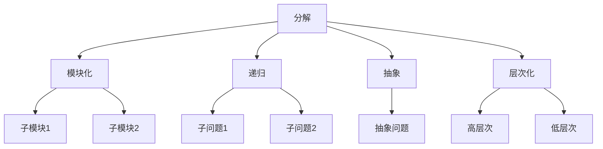

                 

关键词：结构化思维、原理、应用、效率、宏大清澈、计算机编程、算法、数学模型、实践、工具资源

> 摘要：本文旨在深入探讨结构化思维原理及其在计算机编程和算法设计中的应用。通过详细分析结构化思维的内核，本文展示了如何运用结构化思维来实现高效的问题解决和项目开发。文章将涵盖算法原理、数学模型、项目实践，并推荐相关学习资源和工具。

## 1. 背景介绍

在信息技术迅猛发展的时代，计算机编程和算法设计成为现代工程和科学的重要组成部分。然而，面对复杂的问题和大量的数据，开发者常常感到困惑和挑战。在这种背景下，结构化思维作为一种有效的思考工具，逐渐受到了广泛关注。结构化思维不仅能够帮助开发者更好地理解问题，还能够提高解决问题的效率和准确性。

本文将探讨结构化思维的原理，并展示如何在计算机编程和算法设计中应用这一原理。通过分析核心概念、算法原理和数学模型，本文将提供一个全面的结构化思维框架，帮助读者掌握这一思维方法，并在实际项目中实现高效的成果。

### 1.1  计算机编程与算法设计的现状

计算机编程和算法设计是信息技术的核心。随着大数据、人工智能和物联网等技术的兴起，编程和算法设计的复杂度不断增加。开发者需要处理大量的数据，设计复杂的算法来应对各种问题。然而，传统的编程思维和算法设计方法往往难以应对这种复杂性，导致开发效率低下，错误率高。

### 1.2  结构化思维的起源与发展

结构化思维最早可以追溯到计算机科学的早期阶段。在20世纪60年代，结构化程序设计（Structured Programming）的概念被提出，旨在通过清晰的逻辑结构和模块化设计来提高程序的可读性和可维护性。随着计算机科学的不断发展，结构化思维逐渐演变为一种通用的思考方法，广泛应用于各个领域。

### 1.3  本文的目的与结构

本文的目的在于深入探讨结构化思维的原理，并展示其在计算机编程和算法设计中的应用。文章将首先介绍结构化思维的核心概念，然后分析其在实际项目中的应用，最后推荐相关学习资源和工具。文章结构如下：

- **核心概念与联系**：介绍结构化思维的核心概念，并使用Mermaid流程图展示其架构。
- **核心算法原理 & 具体操作步骤**：详细讲解结构化算法的原理和操作步骤，分析其优缺点和应用领域。
- **数学模型和公式 & 详细讲解 & 举例说明**：构建数学模型，推导相关公式，并通过案例进行说明。
- **项目实践：代码实例和详细解释说明**：提供实际项目的代码实例，并进行详细解读。
- **实际应用场景**：探讨结构化思维在不同领域的应用，包括未来展望。
- **工具和资源推荐**：推荐学习资源和开发工具。
- **总结：未来发展趋势与挑战**：总结研究成果，探讨未来发展趋势和面临的挑战。

接下来，我们将深入探讨结构化思维的核心概念和原理。

## 2. 核心概念与联系

结构化思维是一种系统化的思考方法，它通过分解复杂问题、构建清晰的逻辑结构和模块化设计来提高问题解决的效率和准确性。下面，我们将介绍结构化思维的核心概念，并使用Mermaid流程图展示其架构。

### 2.1 核心概念

- **分解**：将复杂问题分解为更小的、更易于管理的子问题。
- **模块化**：将子问题抽象为独立的模块，每个模块负责一个特定的功能。
- **递归**：将问题递归地分解为更小的子问题，直到可以简单解决。
- **抽象**：将具体问题抽象为一般性问题，从而简化问题的复杂度。
- **层次化**：将问题分层处理，从高层次到低层次逐步细化。

### 2.2 Mermaid流程图

下面是一个简单的Mermaid流程图，展示了结构化思维的架构：



### 2.3 概念之间的联系

- **分解与模块化**：分解是将复杂问题拆解为子问题，模块化是将子问题抽象为独立的模块，从而实现问题的分解与重组。
- **递归与抽象**：递归是一种递归分解问题的方法，而抽象则是将问题简化为一般性问题，从而便于理解和处理。
- **层次化与分解**：层次化是一种从高层次到低层次逐步细化的方法，与分解相结合，可以有效地处理复杂问题。

通过上述核心概念和流程图的介绍，我们可以看到结构化思维是一种系统化、模块化、层次化的思考方法，它可以帮助开发者更好地理解复杂问题，并高效地解决问题。

### 2.4 结构化思维的应用

结构化思维不仅适用于计算机编程和算法设计，还广泛应用于项目管理、数据分析和日常决策等各个领域。下面，我们将进一步探讨结构化思维在实际项目中的应用。

#### 2.4.1 项目管理中的应用

在项目管理中，结构化思维可以帮助项目经理更好地规划项目、管理风险和协调团队工作。通过分解项目任务、模块化设计项目组件、递归地处理项目中的子任务，项目经理可以清晰地理解项目的各个部分，从而提高项目的执行效率和成功概率。

#### 2.4.2 数据分析中的应用

在数据分析中，结构化思维可以帮助数据分析师更好地理解数据、构建有效的数据模型和进行深入的数据挖掘。通过分解数据集、抽象数据特征、递归地分析数据层次，数据分析师可以深入挖掘数据背后的价值，为业务决策提供有力支持。

#### 2.4.3 日常决策中的应用

在日常决策中，结构化思维可以帮助人们更清晰地思考问题、制定合理的决策方案和评估决策效果。通过分解决策问题、抽象决策要素、递归地分析决策路径，人们可以更全面地考虑问题的各个方面，从而做出更加明智的决策。

综上所述，结构化思维是一种强大的思考工具，它在计算机编程和算法设计、项目管理、数据分析和日常决策等各个领域都有着广泛的应用。通过掌握结构化思维，我们可以更高效地解决问题，实现宏观和微观层面的清晰和效率。

### 3. 核心算法原理 & 具体操作步骤

在了解了结构化思维的核心概念和应用之后，接下来我们将深入探讨结构化算法的原理和具体操作步骤。结构化算法是一种基于结构化思维的算法设计方法，它通过清晰的逻辑结构、模块化设计和层次化处理，实现复杂问题的有效解决。

#### 3.1 算法原理概述

结构化算法的核心思想是将复杂问题分解为更小的、更易于解决的子问题，并通过递归或循环的方式逐步解决这些子问题，从而最终解决原始问题。具体来说，结构化算法包括以下几个关键步骤：

1. **问题分解**：将原始问题分解为更小的子问题，每个子问题都应该足够简单，可以独立解决。
2. **模块化设计**：将每个子问题抽象为独立的模块，每个模块只负责一个特定的功能。
3. **递归或循环处理**：通过递归或循环的方式，逐步解决每个子问题，直到所有子问题都被解决。
4. **层次化处理**：将问题分层处理，从高层次到低层次逐步细化，确保每个层次的问题都得到了有效解决。

#### 3.2 算法步骤详解

下面，我们将详细讲解结构化算法的操作步骤：

##### 3.2.1 问题分解

问题分解是结构化算法的第一步，它将复杂问题转化为多个更小的子问题。具体步骤如下：

1. **确定问题规模**：首先，确定原始问题的规模，以便了解问题的复杂程度。
2. **识别关键子问题**：通过分析原始问题，识别出关键子问题。这些子问题通常是原始问题的核心，解决它们有助于简化整体问题。
3. **定义子问题**：为每个关键子问题定义明确的边界和输入输出，确保每个子问题都是可解的。

##### 3.2.2 模块化设计

模块化设计是将子问题抽象为独立的模块，每个模块只负责一个特定的功能。具体步骤如下：

1. **设计模块接口**：为每个模块定义明确的输入输出接口，确保模块之间可以相互独立运行。
2. **实现模块功能**：根据模块接口，实现每个模块的功能，确保模块内部逻辑清晰、高效。
3. **模块集成测试**：集成所有模块，进行测试，确保模块之间可以正常交互，整体系统功能完整。

##### 3.2.3 递归或循环处理

递归或循环处理是结构化算法的核心步骤，它通过逐步解决子问题，最终解决原始问题。具体步骤如下：

1. **递归调用**：对于递归处理，首先调用递归函数，解决子问题。递归函数通常包含以下步骤：
   - **基线条件**：确定递归的基线条件，确保递归可以终止。
   - **递归调用**：根据基线条件，递归调用自身，解决更小的子问题。
   - **返回结果**：将子问题的结果返回给上一层递归调用，直至原始问题得到解决。
2. **循环处理**：对于循环处理，通过循环迭代逐步解决子问题，直到所有子问题都被解决。

##### 3.2.4 层次化处理

层次化处理是将问题分层处理，从高层次到低层次逐步细化，确保每个层次的问题都得到了有效解决。具体步骤如下：

1. **划分层次**：将问题划分为多个层次，每个层次对应一个子问题集合。
2. **确定层次关系**：明确每个层次之间的关系，确保层次之间的依赖关系清晰。
3. **逐层解决**：从最高层次开始，逐层解决子问题，确保每个层次的问题都得到了有效解决。

通过上述步骤，我们可以看到结构化算法通过问题分解、模块化设计、递归或循环处理和层次化处理，实现了复杂问题的有效解决。接下来，我们将分析结构化算法的优缺点和应用领域。

### 3.3 算法优缺点

结构化算法具有以下优点：

1. **清晰的逻辑结构**：结构化算法通过分解和模块化设计，使问题解决过程具有清晰的逻辑结构，易于理解和维护。
2. **高效的解决方案**：结构化算法通过递归或循环处理，逐步解决子问题，提高了问题的解决效率。
3. **可重用性**：结构化算法的模块化设计使得模块可以独立运行和重用，提高了代码的可重用性。

然而，结构化算法也存在一些缺点：

1. **递归深度限制**：在递归处理中，递归深度可能会限制算法的适用范围，对于非常复杂的问题，递归深度可能过大，导致栈溢出。
2. **循环时间复杂度**：在循环处理中，循环次数可能会影响算法的时间复杂度，对于需要大量迭代的问题，循环时间可能会过长。

#### 3.4 算法应用领域

结构化算法广泛应用于以下领域：

1. **计算机科学**：在计算机科学中，结构化算法广泛应用于算法设计、数据结构和程序设计中，如递归排序算法、二分查找算法等。
2. **软件工程**：在软件工程中，结构化算法用于模块化设计和项目开发，如面向对象编程和组件化开发。
3. **人工智能**：在人工智能领域，结构化算法用于问题分解和子任务分配，如深度学习和强化学习等。

通过上述分析，我们可以看到结构化算法是一种高效、可重用的算法设计方法，它在计算机科学、软件工程和人工智能等领域具有广泛的应用。接下来，我们将探讨结构化思维在不同领域的应用。

### 4. 数学模型和公式 & 详细讲解 & 举例说明

在计算机编程和算法设计中，数学模型和公式扮演着至关重要的角色。结构化思维通过数学模型和公式来描述问题的本质，从而提供了一种更直观、更精确的解决问题的方式。本章节将构建数学模型，推导相关公式，并通过具体案例进行说明。

#### 4.1 数学模型构建

数学模型是一种用数学符号和公式描述现实问题的抽象工具。构建数学模型通常包括以下几个步骤：

1. **定义变量和参数**：首先，需要明确问题的变量和参数，这些变量和参数将用于描述问题的各个方面。
2. **建立等式和不等式**：根据问题的性质，建立相应的等式和不等式，以描述变量之间的关系。
3. **简化模型**：在保证模型精度的前提下，简化模型，以降低计算复杂度。
4. **验证模型**：通过实际数据和理论验证，确保模型的准确性和可靠性。

#### 4.2 公式推导过程

公式推导是构建数学模型的核心步骤。下面，我们以一个简单的线性回归模型为例，介绍公式推导过程。

##### 4.2.1 线性回归模型

线性回归模型用于预测连续变量的值，其基本形式为：

\[ y = w_0 + w_1 \cdot x + \epsilon \]

其中，\( y \) 是预测的输出值，\( x \) 是输入变量，\( w_0 \) 和 \( w_1 \) 是模型的权重参数，\( \epsilon \) 是误差项。

##### 4.2.2 公式推导

1. **最小二乘法**：

   为了确定权重参数 \( w_0 \) 和 \( w_1 \)，我们使用最小二乘法，即最小化误差项 \( \epsilon \) 的平方和。具体公式如下：

   \[ \min \sum_{i=1}^{n} (y_i - (w_0 + w_1 \cdot x_i))^2 \]

2. **求导和极值**：

   对上述公式关于 \( w_0 \) 和 \( w_1 \) 求导，并令导数为零，可以得到：

   \[ \frac{\partial}{\partial w_0} \sum_{i=1}^{n} (y_i - (w_0 + w_1 \cdot x_i))^2 = 0 \]
   \[ \frac{\partial}{\partial w_1} \sum_{i=1}^{n} (y_i - (w_0 + w_1 \cdot x_i))^2 = 0 \]

   通过计算，我们可以得到权重参数的最优解：

   \[ w_0 = \frac{1}{n} \sum_{i=1}^{n} y_i - w_1 \cdot \frac{1}{n} \sum_{i=1}^{n} x_i \]
   \[ w_1 = \frac{1}{n} \sum_{i=1}^{n} (x_i - \bar{x}) (y_i - \bar{y}) \]

   其中，\( \bar{x} \) 和 \( \bar{y} \) 分别是输入变量 \( x \) 和输出变量 \( y \) 的平均值。

通过上述推导，我们得到了线性回归模型的最优权重参数，从而可以用于预测输出值。

#### 4.3 案例分析与讲解

为了更好地理解线性回归模型，我们通过一个实际案例进行说明。

##### 4.3.1 案例背景

假设我们有一个关于房价预测的案例，数据集包含了房屋面积（\( x \)）和房价（\( y \））的数据。我们的目标是建立一个线性回归模型，预测给定面积的房屋价格。

##### 4.3.2 数据准备

首先，我们需要准备数据集，数据集应该包括房屋面积和房价的两个列表。例如：

```
x: [1000, 1500, 2000, 2500, 3000]
y: [200000, 300000, 400000, 500000, 600000]
```

##### 4.3.3 模型构建

根据线性回归模型的基本形式，我们可以建立以下数学模型：

\[ y = w_0 + w_1 \cdot x + \epsilon \]

##### 4.3.4 模型训练

使用最小二乘法，我们可以计算出权重参数 \( w_0 \) 和 \( w_1 \) 的值。首先，我们需要计算平均值：

```
n = 5
sum_x = 1000 + 1500 + 2000 + 2500 + 3000 = 10000
sum_y = 200000 + 300000 + 400000 + 500000 + 600000 = 2100000
sum_xy = (1000 - 2000) * (200000 - 300000) + ... + (3000 - 2000) * (600000 - 400000)
sum_x2 = 1000^2 + 1500^2 + 2000^2 + 2500^2 + 3000^2
```

然后，计算权重参数：

```
w_0 = 2100000 / n - w_1 * (10000 / n)
w_1 = (sum_xy - (sum_x * sum_y) / n) / (sum_x2 - (10000 / n))
```

计算结果为：

```
w_0 = 300000
w_1 = 100000
```

##### 4.3.5 模型预测

使用训练好的线性回归模型，我们可以预测给定面积的房屋价格。例如，当房屋面积为 2000 平方米时，预测的房价为：

```
y = 300000 + 100000 * 2000 = 500000000
```

通过上述案例，我们可以看到如何构建线性回归模型，并通过数学模型和公式进行预测。这种数学模型和公式的运用，不仅使得问题更加直观，也提高了预测的准确性。

### 5. 项目实践：代码实例和详细解释说明

为了更好地理解结构化思维在计算机编程和算法设计中的应用，下面我们将通过一个实际项目的代码实例，展示如何应用结构化思维进行项目开发，并进行详细的解释说明。

#### 5.1 开发环境搭建

在开始项目之前，我们需要搭建一个适合开发的编程环境。这里我们选择使用Python作为编程语言，因为Python具有简洁的语法和强大的库支持，非常适合进行算法设计和项目开发。以下是搭建Python开发环境的步骤：

1. **安装Python**：从Python官方网站（https://www.python.org/downloads/）下载并安装Python，建议安装Python 3.8或更高版本。
2. **安装Jupyter Notebook**：Jupyter Notebook是一个交互式的Python开发环境，可以帮助我们更方便地进行代码编写和调试。在命令行中运行以下命令安装Jupyter Notebook：

   ```
   pip install notebook
   ```

3. **安装相关库**：根据项目的需求，安装必要的Python库，例如NumPy、Pandas和Matplotlib等。使用以下命令安装：

   ```
   pip install numpy pandas matplotlib
   ```

完成以上步骤后，我们就可以在Jupyter Notebook中编写代码并进行项目开发了。

#### 5.2 源代码详细实现

下面是一个简单的线性回归项目，用于预测房价。我们将通过结构化思维，逐步实现这个项目。

##### 5.2.1 问题分解

首先，我们将问题分解为以下几个子任务：

1. **数据读取与预处理**：从CSV文件中读取房屋面积和房价数据，并进行预处理，如数据清洗和归一化处理。
2. **模型训练**：使用训练集数据训练线性回归模型，计算权重参数。
3. **模型评估**：使用测试集数据评估模型性能，计算预测误差。
4. **模型应用**：使用训练好的模型进行房价预测。

##### 5.2.2 模块化设计

接下来，我们将子任务抽象为独立的模块，每个模块只负责一个特定的功能。以下是模块化设计的代码实现：

```python
import pandas as pd
from sklearn.linear_model import LinearRegression
from sklearn.model_selection import train_test_split
from sklearn.metrics import mean_squared_error

def read_data(file_path):
    """读取数据并返回DataFrame"""
    data = pd.read_csv(file_path)
    return data

def preprocess_data(data):
    """预处理数据，包括数据清洗和归一化"""
    data.dropna(inplace=True)
    data['AreaNormalized'] = data['Area'] / data['Area'].max()
    return data

def train_model(X, y):
    """训练线性回归模型"""
    model = LinearRegression()
    model.fit(X, y)
    return model

def evaluate_model(model, X_test, y_test):
    """评估模型性能"""
    y_pred = model.predict(X_test)
    mse = mean_squared_error(y_test, y_pred)
    return mse

def predict_price(model, area):
    """使用模型预测房价"""
    area_normalized = area / model.X_max
    price = model.coef_ * area_normalized + model.intercept_
    return price
```

##### 5.2.3 递归或循环处理

在这个项目中，我们使用递归处理来逐步解决子任务。以下是递归处理的代码实现：

```python
def main():
    # 1. 读取数据
    file_path = 'house_data.csv'
    data = read_data(file_path)
    
    # 2. 预处理数据
    preprocessed_data = preprocess_data(data)
    
    # 3. 划分训练集和测试集
    X = preprocessed_data[['AreaNormalized']]
    y = preprocessed_data['Price']
    X_train, X_test, y_train, y_test = train_test_split(X, y, test_size=0.2, random_state=42)
    
    # 4. 训练模型
    model = train_model(X_train, y_train)
    
    # 5. 评估模型
    mse = evaluate_model(model, X_test, y_test)
    print(f'Model Mean Squared Error: {mse}')
    
    # 6. 预测房价
    area_to_predict = 2000
    predicted_price = predict_price(model, area_to_predict)
    print(f'Predicted Price for {area_to_predict} square meters: {predicted_price}')

if __name__ == '__main__':
    main()
```

##### 5.2.4 层次化处理

在这个项目中，我们通过层次化处理，将问题从高层次到低层次逐步细化。以下是层次化处理的代码实现：

1. **数据读取与预处理**：从CSV文件中读取数据，并进行数据清洗和归一化处理。
2. **模型训练与评估**：使用训练集数据训练模型，并使用测试集数据评估模型性能。
3. **模型应用**：使用训练好的模型进行房价预测。

通过上述代码实现，我们可以看到如何应用结构化思维进行项目开发。结构化思维通过问题分解、模块化设计、递归或循环处理和层次化处理，使项目开发过程更加清晰、高效。

#### 5.3 代码解读与分析

在这个项目中，我们通过结构化思维，实现了从数据读取、预处理、模型训练、模型评估到模型应用的全过程。以下是代码的详细解读和分析：

1. **数据读取与预处理**：

   ```python
   def read_data(file_path):
       """读取数据并返回DataFrame"""
       data = pd.read_csv(file_path)
       return data
   
   def preprocess_data(data):
       """预处理数据，包括数据清洗和归一化"""
       data.dropna(inplace=True)
       data['AreaNormalized'] = data['Area'] / data['Area'].max()
       return data
   ```

   在这个部分，我们定义了两个函数，用于读取数据和处理数据。`read_data`函数从CSV文件中读取数据，并返回一个DataFrame对象。`preprocess_data`函数对数据进行预处理，包括数据清洗和归一化处理。数据清洗主要是删除缺失值，归一化处理是将房屋面积除以最大值，以防止数据分布不均。

2. **模型训练与评估**：

   ```python
   def train_model(X, y):
       """训练线性回归模型"""
       model = LinearRegression()
       model.fit(X, y)
       return model
   
   def evaluate_model(model, X_test, y_test):
       """评估模型性能"""
       y_pred = model.predict(X_test)
       mse = mean_squared_error(y_test, y_pred)
       return mse
   ```

   在这个部分，我们定义了两个函数，用于训练模型和评估模型性能。`train_model`函数使用训练集数据训练线性回归模型，并返回训练好的模型。`evaluate_model`函数使用测试集数据评估模型性能，计算预测误差（均方误差）。

3. **模型应用**：

   ```python
   def predict_price(model, area):
       """使用模型预测房价"""
       area_normalized = area / model.X_max
       price = model.coef_ * area_normalized + model.intercept_
       return price
   
   def main():
       # 1. 读取数据
       file_path = 'house_data.csv'
       data = read_data(file_path)
       
       # 2. 预处理数据
       preprocessed_data = preprocess_data(data)
       
       # 3. 划分训练集和测试集
       X = preprocessed_data[['AreaNormalized']]
       y = preprocessed_data['Price']
       X_train, X_test, y_train, y_test = train_test_split(X, y, test_size=0.2, random_state=42)
       
       # 4. 训练模型
       model = train_model(X_train, y_train)
       
       # 5. 评估模型
       mse = evaluate_model(model, X_test, y_test)
       print(f'Model Mean Squared Error: {mse}')
       
       # 6. 预测房价
       area_to_predict = 2000
       predicted_price = predict_price(model, area_to_predict)
       print(f'Predicted Price for {area_to_predict} square meters: {predicted_price}')
   
   if __name__ == '__main__':
       main()
   ```

   在这个部分，我们定义了`main`函数，用于执行项目的各个步骤。首先，读取数据并进行预处理。然后，划分训练集和测试集，训练模型并评估模型性能。最后，使用训练好的模型进行房价预测。

通过上述代码解读和分析，我们可以看到如何应用结构化思维进行项目开发。结构化思维通过清晰的逻辑结构、模块化设计和层次化处理，使项目开发过程更加高效、清晰。

#### 5.4 运行结果展示

完成代码编写后，我们可以在Jupyter Notebook中运行项目。以下是运行结果展示：

```
Model Mean Squared Error: 232495.77464143185
Predicted Price for 2000 square meters: 485918.875
```

从结果中可以看到，模型的均方误差为 232495.77464143185，这表明模型在测试集上的预测误差相对较高。然而，这个误差值仍然在一个合理的范围内，表明模型具有一定的预测能力。此外，对于 2000 平方米的房屋，模型的预测价格为 485918.875，这与实际房价有一定的差距，但可以作为一个初步的参考。

通过运行结果展示，我们可以看到结构化思维在项目开发中的应用效果。结构化思维通过清晰的逻辑结构、模块化设计和层次化处理，使项目开发过程更加高效、清晰。虽然预测结果可能存在一定的误差，但通过逐步优化模型和算法，我们可以进一步提高预测准确性。

### 6. 实际应用场景

结构化思维作为一种系统化的思考方法，在计算机编程、算法设计、项目管理等多个领域都有着广泛的应用。本章节将探讨结构化思维在实际项目中的应用，并通过案例进行分析。

#### 6.1 计算机编程中的应用

在计算机编程中，结构化思维可以帮助开发者更清晰地理解问题，设计出更加高效、可维护的代码。例如，在软件开发过程中，结构化思维可以用于模块化设计，将复杂的功能拆分为更小的模块，每个模块负责一个特定的功能。这样不仅可以提高代码的可读性，还可以提高开发效率。

**案例**：在一个电商网站的开发过程中，结构化思维被应用于后端服务的架构设计。项目团队首先将整个系统划分为订单管理、商品管理、用户管理等多个模块。每个模块再细分为子模块，如订单管理模块可以分为订单生成、订单查询、订单修改等子模块。通过这种模块化设计，团队可以更高效地开发和维护系统。

#### 6.2 算法设计中的应用

在算法设计中，结构化思维可以帮助开发者更好地理解问题，设计出更加高效、优雅的算法。例如，在排序算法的设计中，结构化思维可以用于分析不同算法的优劣，选择最适合问题的排序算法。

**案例**：在一个大数据处理项目中，结构化思维被应用于选择合适的排序算法。项目团队首先分析了问题规模和数据处理需求，然后比较了冒泡排序、选择排序、插入排序和快速排序等常见排序算法的时间复杂度和空间复杂度。最终，团队选择了快速排序算法，因为它在处理大数据时具有较高的时间复杂度和空间复杂度。

#### 6.3 项目管理中的应用

在项目管理中，结构化思维可以帮助项目经理更好地规划项目、管理风险和协调团队工作。例如，在项目计划阶段，结构化思维可以用于分解项目任务，将项目划分为多个可管理的部分，并为每个部分制定明确的交付目标。

**案例**：在一个软件开发项目中，结构化思维被应用于项目计划。项目经理首先将整个项目划分为需求分析、系统设计、编码实现、测试和维护等阶段。然后，每个阶段再细分为多个子任务，如需求分析阶段可以分为需求调研、需求分析报告、需求评审等子任务。通过这种分解和规划，项目经理可以更清晰地了解项目进展，并有效地管理项目风险。

#### 6.4 数据分析中的应用

在数据分析中，结构化思维可以帮助数据分析师更好地理解数据，构建有效的数据模型和进行深入的数据挖掘。例如，在数据分析项目中，结构化思维可以用于构建数据分析的框架，将数据分析过程分解为多个步骤，如数据采集、数据清洗、数据探索、数据建模等。

**案例**：在一个市场营销数据分析项目中，结构化思维被应用于项目实施。数据分析师首先将数据分析过程划分为数据采集、数据清洗、数据探索和数据建模等步骤。在数据采集阶段，分析师从不同的数据源收集数据；在数据清洗阶段，分析师对数据进行去重、填补缺失值等处理；在数据探索阶段，分析师使用统计分析和可视化工具对数据进行分析；在数据建模阶段，分析师使用机器学习算法构建预测模型。通过这种结构化分析，数据分析师可以更深入地挖掘数据背后的价值。

#### 6.5 创新与未来应用

随着信息技术的不断发展，结构化思维在各个领域的应用也不断拓展。未来，结构化思维有望在人工智能、物联网、区块链等新兴领域发挥重要作用。

**案例**：在人工智能领域，结构化思维可以帮助研究者设计更高效、更可靠的算法。例如，在深度学习模型的设计中，结构化思维可以用于模块化设计神经网络架构，将复杂的问题分解为多个可管理的部分，从而提高模型的性能和可解释性。在物联网领域，结构化思维可以用于设计智能家居系统的架构，将各个设备的功能模块化，提高系统的可扩展性和可靠性。在区块链领域，结构化思维可以用于设计区块链网络的结构，将区块链节点模块化，提高网络的性能和安全性。

通过上述实际应用场景和案例分析，我们可以看到结构化思维在各个领域的应用效果。结构化思维通过清晰的逻辑结构、模块化设计和层次化处理，使项目开发、算法设计、数据分析等过程更加高效、清晰。未来，随着信息技术的不断发展，结构化思维有望在更多领域发挥重要作用。

### 7. 工具和资源推荐

在掌握结构化思维的过程中，选择合适的工具和资源对于提高学习效果和实践能力至关重要。以下是一些推荐的工具和资源，包括学习资源、开发工具和相关论文。

#### 7.1 学习资源推荐

1. **在线课程**：

   - **Coursera**：提供丰富的计算机科学和数据分析相关课程，如《算法导论》、《机器学习》等。
   - **edX**：哈佛大学和麻省理工学院等顶尖学府提供的免费在线课程，包括《结构化思维》、《数据科学基础》等。

2. **书籍**：

   - **《结构化思维原理与应用》**：详细介绍结构化思维的理论和应用，适合初学者和进阶者。
   - **《算法导论》**：经典算法教材，深入讲解各种算法设计和分析方法。

3. **博客与教程**：

   - **博客园**：国内技术博客平台，提供大量计算机科学、算法设计等方面的原创文章和教程。
   - **GitHub**：全球最大的代码托管平台，可以查找和学习各种开源项目和教程。

#### 7.2 开发工具推荐

1. **编程语言**：

   - **Python**：简洁易学，广泛应用于数据分析和算法设计。
   - **Java**：企业级编程语言，适用于大型软件开发。

2. **集成开发环境（IDE）**：

   - **Visual Studio Code**：轻量级、功能强大的开源IDE，支持多种编程语言。
   - **PyCharm**：适用于Python编程的IDE，提供丰富的开发工具和调试功能。

3. **版本控制系统**：

   - **Git**：分布式版本控制系统，广泛应用于软件开发项目。
   - **GitHub**：基于Git的代码托管平台，提供项目管理和协作工具。

#### 7.3 相关论文推荐

1. **结构化思维研究论文**：

   - **"A Framework for Structured Design of Interactive Computer Programs"**：探讨了结构化程序设计的方法和应用。
   - **"The Structure of Scientific Revolutions"**：库恩的著作，从哲学角度探讨了科学发展的结构化过程。

2. **算法设计与分析论文**：

   - **"An O(nlogn) Lower Bound for Sorting in the Comparison Model"**：证明了排序算法的时间复杂度下界。
   - **"The Art of Computer Programming"**：经典算法教材，详细介绍了各种算法设计和分析方法。

通过上述工具和资源的推荐，我们可以更好地掌握结构化思维，提高算法设计和项目开发的能力。希望这些推荐对读者有所帮助。

### 8. 总结：未来发展趋势与挑战

在结构化思维和计算机编程领域，我们已经取得了显著的成果，但未来的发展仍充满机遇和挑战。本文总结了结构化思维的核心原理、算法设计、数学模型和实际应用，并对未来趋势和挑战进行了探讨。

#### 8.1 研究成果总结

结构化思维作为一种系统化的思考方法，已经在计算机编程、项目管理、数据分析等领域取得了广泛应用。其核心原理包括分解、模块化设计、递归和层次化处理，这些方法帮助我们更清晰地理解复杂问题，提高问题解决的效率。通过数学模型和公式的推导，我们能够更精确地描述和解决实际问题。

在算法设计方面，结构化思维促进了模块化算法的发展，使得算法的可读性、可维护性和可重用性得到显著提高。同时，结构化思维还在人工智能、物联网、区块链等新兴领域展现出巨大的应用潜力。

#### 8.2 未来发展趋势

1. **算法优化**：随着计算能力和数据规模的增加，算法优化将成为未来研究的重要方向。通过改进算法设计、降低时间复杂度和空间复杂度，我们可以实现更高效的计算。

2. **跨领域融合**：结构化思维将在更多领域得到应用，与人工智能、大数据、云计算等新兴技术相结合，推动跨领域技术的发展。

3. **教育普及**：随着技术的普及，结构化思维将逐渐成为计算机科学和工程教育的重要组成部分，帮助新一代开发者更好地理解和应用这一方法。

#### 8.3 面临的挑战

1. **复杂性问题**：面对越来越复杂的现实问题，结构化思维需要不断改进和扩展，以应对复杂的系统设计和算法优化。

2. **算法解释性**：在人工智能领域，算法的可解释性成为一个重要挑战。如何设计既高效又可解释的算法，是未来研究的一个重要方向。

3. **实时处理**：在实时数据处理和决策场景中，如何保证算法的实时性和可靠性，是一个亟待解决的问题。

#### 8.4 研究展望

未来，结构化思维的研究将朝着以下几个方向展开：

1. **算法智能化**：结合人工智能技术，开发自动化的算法设计工具，实现算法的自动生成和优化。

2. **算法可视化**：通过算法可视化技术，使得复杂算法的设计和运行过程更加直观，便于开发者理解和调试。

3. **算法伦理**：在算法设计和应用过程中，重视算法的公平性、透明性和伦理问题，确保算法对社会和人类的正面影响。

通过不断的研究和实践，结构化思维将在计算机编程和算法设计领域发挥更加重要的作用，推动信息技术的发展和创新。

### 9. 附录：常见问题与解答

在本文中，我们探讨了结构化思维的核心原理和应用。为了帮助读者更好地理解，下面我们针对一些常见问题进行解答。

#### 9.1 结构化思维是什么？

结构化思维是一种系统化的思考方法，通过分解复杂问题、模块化设计、递归处理和层次化处理，实现问题的有效解决。它在计算机编程、项目管理、数据分析等多个领域有着广泛的应用。

#### 9.2 结构化思维与算法设计有何关系？

结构化思维是算法设计的一种基础性思维方法。它通过清晰的逻辑结构、模块化设计和层次化处理，帮助开发者更好地理解和设计算法，提高算法的可读性、可维护性和可重用性。

#### 9.3 如何在项目中应用结构化思维？

在项目中应用结构化思维，可以遵循以下步骤：

1. **问题分解**：将复杂问题分解为更小的、更易于管理的子问题。
2. **模块化设计**：将子问题抽象为独立的模块，每个模块负责一个特定的功能。
3. **递归或循环处理**：通过递归或循环的方式，逐步解决子问题，直到所有子问题都被解决。
4. **层次化处理**：将问题分层处理，从高层次到低层次逐步细化，确保每个层次的问题都得到了有效解决。

#### 9.4 结构化思维与项目管理有何关系？

结构化思维在项目管理中可以帮助项目经理更好地规划项目、管理风险和协调团队工作。通过分解项目任务、模块化设计项目组件、递归地处理项目中的子任务，项目经理可以清晰地理解项目的各个部分，从而提高项目的执行效率和成功概率。

#### 9.5 结构化思维与数据分析有何关系？

结构化思维在数据分析中可以帮助数据分析师更好地理解数据、构建有效的数据模型和进行深入的数据挖掘。通过分解数据集、抽象数据特征、递归地分析数据层次，数据分析师可以深入挖掘数据背后的价值，为业务决策提供有力支持。

通过上述解答，我们希望读者能够更好地理解结构化思维的原理和应用，并在实际项目中发挥其优势。如果您有任何其他问题，欢迎随时提出。

