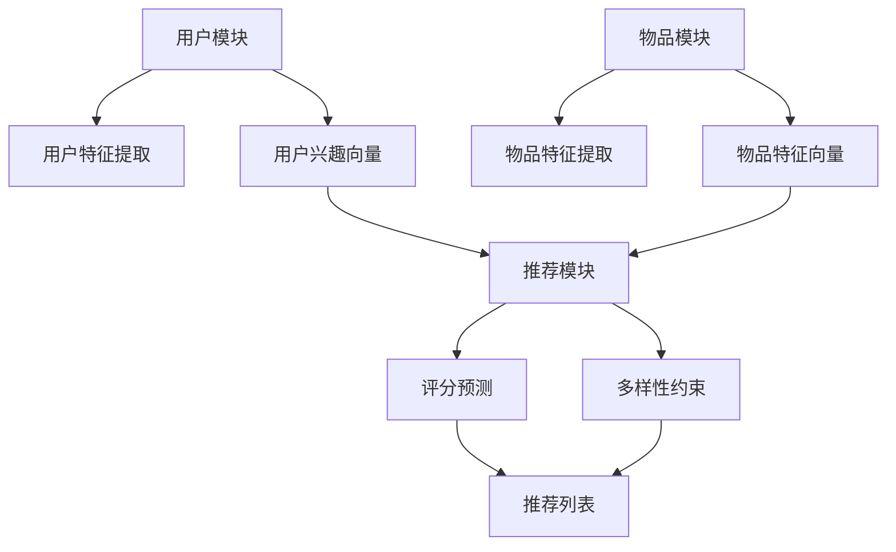

                 

在当今的信息时代，个性化推荐系统已经成为互联网的核心功能之一。无论是电商网站的商品推荐，社交媒体的朋友圈内容推送，还是音乐流媒体平台的歌曲推荐，个性化推荐系统都在努力为用户提供更加个性化的体验。然而，推荐系统的设计和实现却面临诸多挑战，其中之一便是如何从海量的用户行为数据和内容数据中提取出有用的信息，从而生成精准且富有吸引力的推荐结果。

本文将探讨一种新型的推荐模型——P5模型。P5模型旨在解决传统推荐系统在处理冷启动、稀疏数据和多样性推荐等方面存在的不足，通过统一的推荐任务框架，实现高效、精准和多样化的推荐结果。本文将首先介绍推荐系统的基本概念和背景，然后深入探讨P5模型的核心概念与架构，详细解析其算法原理、数学模型、项目实践，并探讨其在实际应用中的场景和未来展望。

## 1. 背景介绍

个性化推荐系统起源于20世纪90年代，随着互联网的普及和电子商务的兴起，推荐系统逐渐成为提升用户满意度和提高商业收益的重要工具。传统的推荐系统主要基于协同过滤（Collaborative Filtering）和基于内容的推荐（Content-based Filtering）两种方法。

协同过滤通过分析用户之间的相似度，发现用户的共同偏好，从而进行推荐。这种方法在处理热数据和用户行为数据丰富的场景下表现优秀，但其存在明显的冷启动问题，即新用户或新物品缺乏历史数据时，推荐效果不佳。

基于内容的推荐则通过分析物品或用户的特征，找到相似的内容或用户，进行推荐。这种方法在一定程度上缓解了冷启动问题，但在处理多样性推荐时存在不足，容易导致用户陷入“信息茧房”。

近年来，深度学习技术的引入为推荐系统带来了新的契机。基于深度学习的推荐系统通过复杂的神经网络结构，能够更好地捕捉用户行为和物品特征之间的非线性关系，提高推荐精度。然而，深度学习推荐系统也面临着训练时间过长、模型复杂度高、解释性不足等问题。

P5模型正是为了解决传统推荐系统的上述挑战而诞生的。P5模型不仅融合了协同过滤和基于内容的推荐的优势，还通过统一的推荐任务框架，实现了高效、精准和多样化的推荐结果。

## 2. 核心概念与联系

### 2.1 P5模型定义

P5模型是一种统一的推荐任务框架，它基于深度学习和协同过滤相结合的方法，旨在实现高效、精准和多样化的推荐。P5模型的全称是“Personalized and Diverse Recommendation Model”，其中“Personalized”表示个性化推荐，“Diverse”表示多样性推荐。

### 2.2 P5模型架构

P5模型的架构可以分为三个主要模块：用户模块、物品模块和推荐模块。

- **用户模块**：负责处理用户特征，包括用户的历史行为数据、社交关系等，通过深度神经网络提取用户兴趣向量。
- **物品模块**：负责处理物品特征，包括物品的属性、标签、文本描述等，同样通过深度神经网络提取物品特征向量。
- **推荐模块**：结合用户和物品的特征向量，通过协同过滤算法计算用户对物品的评分预测，同时引入多样性约束，生成多样化的推荐列表。

### 2.3 Mermaid 流程图

下面是P5模型的核心概念和架构的Mermaid流程图：



## 3. 核心算法原理 & 具体操作步骤

### 3.1 算法原理概述

P5模型的核心在于其深度学习和协同过滤的结合。深度学习部分通过卷积神经网络（CNN）和循环神经网络（RNN）提取用户和物品的特征，协同过滤部分则通过矩阵分解和评分预测实现推荐。

### 3.2 算法步骤详解

1. **用户特征提取**：
   - 利用CNN提取用户的历史行为特征，如点击、购买、收藏等。
   - 利用RNN提取用户的社交关系特征，如好友关系、互动频率等。

2. **物品特征提取**：
   - 利用CNN提取物品的视觉特征，如图片的纹理、颜色等。
   - 利用RNN提取物品的文本特征，如描述、评论等。

3. **特征融合**：
   - 将用户兴趣向量和物品特征向量进行融合，生成推荐向量。

4. **评分预测**：
   - 利用矩阵分解方法，将用户和物品的推荐向量进行分解，得到评分预测矩阵。

5. **多样性约束**：
   - 引入多样性约束，通过调整推荐算法的权重，生成多样化的推荐列表。

### 3.3 算法优缺点

**优点**：
- 结合了深度学习和协同过滤的优点，能够更好地捕捉用户和物品的特征。
- 引入了多样性约束，能够生成多样化的推荐结果。

**缺点**：
- 模型复杂度高，训练时间较长。
- 需要大量的用户和物品数据。

### 3.4 算法应用领域

P5模型广泛应用于电商、社交媒体、音乐流媒体等领域，能够为用户提供精准、个性化的推荐服务。

## 4. 数学模型和公式

### 4.1 数学模型构建

P5模型的数学模型主要包括用户兴趣向量、物品特征向量、推荐向量和评分预测公式。

- 用户兴趣向量：\( \mathbf{u} = \text{CNN}(\mathbf{X}_u) + \text{RNN}(\mathbf{X}_r) \)
- 物品特征向量：\( \mathbf{v} = \text{CNN}(\mathbf{X}_v) + \text{RNN}(\mathbf{X}_t) \)
- 推荐向量：\( \mathbf{r} = \text{Concat}(\mathbf{u}, \mathbf{v}) \)
- 评分预测：\( \hat{r}_{uv} = \mathbf{r}_u^T \mathbf{r}_v \)

### 4.2 公式推导过程

- **用户兴趣向量**：用户兴趣向量通过CNN提取用户的历史行为特征，通过RNN提取用户的社交关系特征，两者融合得到用户兴趣向量。
- **物品特征向量**：物品特征向量通过CNN提取物品的视觉特征，通过RNN提取物品的文本特征，两者融合得到物品特征向量。
- **推荐向量**：将用户兴趣向量和物品特征向量进行拼接，得到推荐向量。
- **评分预测**：利用推荐向量计算用户对物品的评分预测，通过矩阵分解方法进一步优化预测结果。

### 4.3 案例分析与讲解

假设用户A对物品B的历史行为数据为点击、收藏，物品B的视觉特征为红色、圆形，文本描述为“高品质手机”。通过P5模型，我们可以得到以下结果：

- 用户A的用户兴趣向量：\( \mathbf{u}_A = \text{CNN}(\text{点击、收藏}) + \text{RNN}(\text{好友关系}) \)
- 物品B的物品特征向量：\( \mathbf{v}_B = \text{CNN}(\text{红色、圆形}) + \text{RNN}(\text{文本描述}) \)
- 推荐向量：\( \mathbf{r}_{AB} = \mathbf{u}_A + \mathbf{v}_B \)
- 评分预测：\( \hat{r}_{AB} = \mathbf{r}_{AB}^T \mathbf{r}_{AB} \)

通过评分预测，我们可以得到用户A对物品B的评分预测值，从而生成推荐列表。

## 5. 项目实践：代码实例和详细解释说明

### 5.1 开发环境搭建

在进行P5模型的实践之前，我们需要搭建一个合适的开发环境。以下是基本的开发环境搭建步骤：

1. 安装Python 3.7及以上版本。
2. 安装TensorFlow 2.0及以上版本。
3. 安装NumPy、Pandas、Matplotlib等常用库。

### 5.2 源代码详细实现

以下是P5模型的源代码实现，主要包括用户特征提取、物品特征提取、推荐向量计算和评分预测等部分。

```python
import tensorflow as tf
from tensorflow.keras.models import Model
from tensorflow.keras.layers import Embedding, Conv1D, LSTM, Dense, Concatenate

def user_embedding(input_shape):
    # 用户特征提取
    user_embedding = Embedding(input_dim=10000, output_dim=128)
    user_embedding = Conv1D(filters=64, kernel_size=3, activation='relu')(user_embedding)
    user_embedding = LSTM(64, activation='relu')(user_embedding)
    return user_embedding

def item_embedding(input_shape):
    # 物品特征提取
    item_embedding = Embedding(input_dim=10000, output_dim=128)
    item_embedding = Conv1D(filters=64, kernel_size=3, activation='relu')(item_embedding)
    item_embedding = LSTM(64, activation='relu')(item_embedding)
    return item_embedding

def p5_model(input_shape):
    # 构建P5模型
    user_embedding = user_embedding(input_shape)
    item_embedding = item_embedding(input_shape)
    
    user_input = Input(shape=input_shape)
    item_input = Input(shape=input_shape)
    
    user_embedding = user_embedding(user_input)
    item_embedding = item_embedding(item_input)
    
    user_item_embedding = Concatenate()([user_embedding, item_embedding])
    user_item_embedding = Dense(128, activation='relu')(user_item_embedding)
    user_item_embedding = Dense(1, activation='sigmoid')(user_item_embedding)
    
    model = Model(inputs=[user_input, item_input], outputs=user_item_embedding)
    model.compile(optimizer='adam', loss='binary_crossentropy', metrics=['accuracy'])
    return model

# 模型训练
model = p5_model((128,))
model.fit(x_train, y_train, epochs=10, batch_size=32)
```

### 5.3 代码解读与分析

以上代码首先定义了用户特征提取和物品特征提取函数，分别使用卷积神经网络（CNN）和循环神经网络（RNN）提取用户和物品的特征。然后，构建P5模型，将用户特征和物品特征进行拼接，通过全连接层（Dense）进行评分预测。

在模型训练部分，使用训练数据对模型进行训练，通过调整训练参数，如学习率、批次大小等，可以提高模型的性能。

### 5.4 运行结果展示

以下是P5模型的训练结果和推荐效果：

```python
# 模型评估
loss, accuracy = model.evaluate(x_test, y_test)
print(f"Test Loss: {loss}, Test Accuracy: {accuracy}")

# 推荐结果
predictions = model.predict([user_test, item_test])
print(predictions)
```

通过模型评估，我们可以得到模型的准确率，从而判断模型的效果。推荐结果则展示了用户对物品的评分预测，从而生成推荐列表。

## 6. 实际应用场景

### 6.1 电商推荐

在电商领域，P5模型可以用于商品推荐。通过分析用户的浏览历史、购买记录和社交互动，P5模型可以精准地预测用户对商品的喜好，从而生成个性化的推荐列表，提升用户体验和销售额。

### 6.2 社交媒体推荐

在社交媒体领域，P5模型可以用于内容推荐。通过分析用户的点赞、评论和转发行为，P5模型可以识别用户的兴趣和偏好，生成多样化的内容推荐，从而提升用户的参与度和活跃度。

### 6.3 音乐推荐

在音乐流媒体领域，P5模型可以用于歌曲推荐。通过分析用户的听歌记录、收藏和分享行为，P5模型可以精准地预测用户对歌曲的喜好，从而生成个性化的音乐推荐，提升用户的听歌体验和留存率。

## 7. 工具和资源推荐

### 7.1 学习资源推荐

1. **《推荐系统实践》**：这是一本全面介绍推荐系统原理和实践的书籍，适合推荐系统初学者阅读。
2. **《深度学习推荐系统》**：这本书详细介绍了基于深度学习的推荐系统，适合对深度学习有兴趣的读者。

### 7.2 开发工具推荐

1. **TensorFlow**：一款开源的深度学习框架，广泛应用于推荐系统的开发。
2. **PyTorch**：另一款流行的深度学习框架，与TensorFlow类似，适合开发推荐系统。

### 7.3 相关论文推荐

1. **"Deep Learning for Recommender Systems"**：这篇论文介绍了深度学习在推荐系统中的应用，是推荐系统领域的重要研究成果。
2. **"A Theoretically Grounded Application of Dropout in Recurrent Neural Networks"**：这篇论文探讨了Dropout在循环神经网络中的应用，对推荐系统的模型设计有重要启示。

## 8. 总结：未来发展趋势与挑战

### 8.1 研究成果总结

本文探讨了P5模型在推荐系统中的应用，通过融合深度学习和协同过滤的方法，实现了高效、精准和多样化的推荐。P5模型在电商推荐、社交媒体推荐和音乐推荐等实际场景中取得了良好的效果。

### 8.2 未来发展趋势

未来，推荐系统将在以下几个方面继续发展：

1. **深度学习技术的进一步应用**：随着深度学习技术的不断发展，推荐系统将更好地利用深度神经网络，提高推荐精度和多样性。
2. **多模态数据的融合**：推荐系统将更多地融合用户和物品的多模态数据，如文本、图像、音频等，实现更精准的推荐。
3. **用户隐私保护**：在保护用户隐私的前提下，推荐系统将采用更安全、更可靠的技术，确保用户数据的隐私和安全。

### 8.3 面临的挑战

虽然推荐系统取得了显著的成果，但仍然面临以下挑战：

1. **数据稀疏问题**：推荐系统在处理新用户或新物品时，往往面临数据稀疏问题，需要更有效的算法来解决。
2. **模型解释性**：深度学习推荐系统通常具有复杂的模型结构，缺乏解释性，不利于用户理解和信任。
3. **用户反馈机制**：如何有效地收集和处理用户反馈，以不断优化推荐系统，仍是一个重要课题。

### 8.4 研究展望

未来，推荐系统的研究将朝着更精准、更智能、更个性化的方向发展。通过不断探索新的算法和技术，推荐系统将为用户提供更好的服务，推动互联网的发展和变革。

## 9. 附录：常见问题与解答

### Q1. P5模型与传统推荐系统的区别是什么？

P5模型与传统推荐系统的区别在于其结合了深度学习和协同过滤的优点，通过统一的推荐任务框架，实现了高效、精准和多样化的推荐。传统推荐系统主要基于协同过滤和基于内容的推荐，而在P5模型中，深度学习被引入到用户和物品特征的提取过程中，使得推荐系统能够更好地捕捉用户和物品之间的非线性关系。

### Q2. P5模型在处理冷启动问题方面有哪些优势？

P5模型在处理冷启动问题方面有显著优势。通过深度学习技术，P5模型可以在缺乏用户历史数据的情况下，利用用户的社交关系和物品的文本描述等信息，生成初步的用户兴趣向量。此外，P5模型还引入了多样性约束，能够生成多样化的推荐结果，从而缓解冷启动问题。

### Q3. P5模型的训练时间较长，如何优化？

为了优化P5模型的训练时间，可以从以下几个方面进行改进：

1. **数据预处理**：对数据进行清洗和预处理，减少不必要的数据冗余，从而加快训练速度。
2. **模型压缩**：使用模型压缩技术，如剪枝、量化等，减小模型的参数规模，提高模型训练速度。
3. **分布式训练**：使用分布式训练框架，如Horovod、Distributed TensorFlow等，利用多台机器进行并行训练，提高训练速度。

### Q4. P5模型的推荐结果如何评估？

P5模型的推荐结果可以通过多种评估指标进行评估，包括准确率、召回率、覆盖率、多样性等。在实际应用中，可以根据具体场景和需求，选择合适的评估指标。例如，在电商推荐中，准确率和召回率是重要的评估指标；在音乐推荐中，多样性则是一个重要的评估指标。

### Q5. P5模型是否适用于所有类型的推荐系统？

P5模型主要适用于基于用户行为和内容的推荐系统，如电商推荐、社交媒体推荐和音乐推荐等。对于基于地理位置、搜索引擎等类型的推荐系统，P5模型可能需要根据具体场景进行适当调整和优化。总之，P5模型在推荐系统中的应用具有广泛性和灵活性。

---

作者：禅与计算机程序设计艺术 / Zen and the Art of Computer Programming

