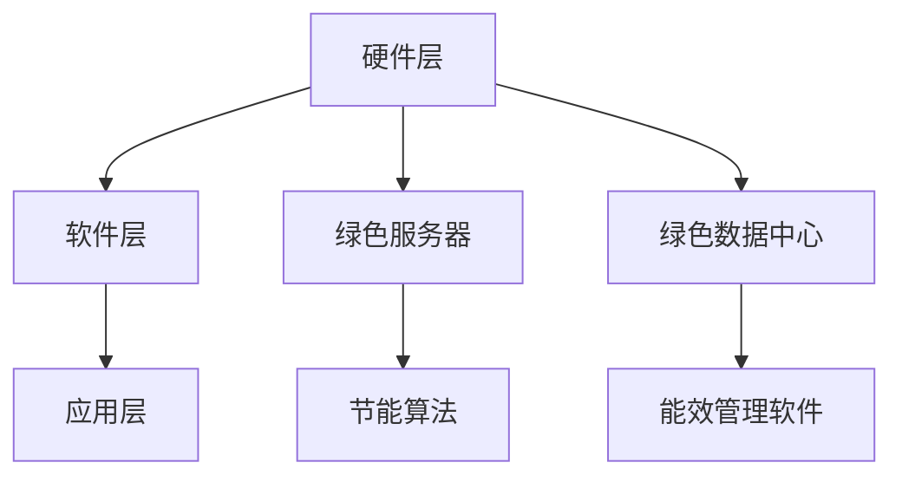

                 

关键词：绿色AI，节能环保，智能计算，算法优化，数学模型，实际应用，未来展望

<|assistant|>摘要：随着人工智能技术的迅猛发展，智能计算已成为现代科技的核心驱动力。然而，这也带来了巨大的能源消耗和环境负担。本文将探讨如何通过绿色 AI 技术实现节能环保的智能计算方案，包括核心算法原理、数学模型与公式、项目实践和未来应用展望。

## 1. 背景介绍

### 1.1 智能计算的发展与挑战

智能计算作为一种新兴的计算模式，已经深刻影响了各行各业。从自动驾驶到智能家居，从医疗诊断到金融分析，智能计算无处不在。然而，随着计算需求的不断增长，智能计算带来的能源消耗和环境问题也日益突出。

### 1.2 绿色 AI 的提出

为了应对智能计算带来的能源消耗和环境问题，绿色 AI（Green AI）的概念应运而生。绿色 AI 强调在保证计算性能的同时，最大限度地减少能源消耗和碳排放，实现可持续发展的智能计算。

## 2. 核心概念与联系

### 2.1 绿色 AI 的核心概念

绿色 AI 主要包括以下几个方面：

1. **节能算法**：通过优化算法和数据结构，降低计算能耗。
2. **绿色硬件**：采用低功耗、高性能的硬件设备，提高计算效率。
3. **能效管理**：通过智能调度和能源回收技术，实现高效能管理。

### 2.2 绿色 AI 的架构

绿色 AI 的架构通常包括以下几个层次：

1. **硬件层**：包括绿色服务器、绿色数据中心等。
2. **软件层**：包括节能算法、能效管理软件等。
3. **应用层**：包括各种智能计算应用，如自动驾驶、智能家居等。

### 2.3 Mermaid 流程图

下面是一个简化的绿色 AI 架构的 Mermaid 流程图：



## 3. 核心算法原理 & 具体操作步骤

### 3.1 算法原理概述

绿色 AI 的核心算法主要包括以下几个方面：

1. **分布式计算**：通过分布式计算，将任务分配到多个计算节点，降低单节点能耗。
2. **能耗模型**：构建能耗模型，预测算法在不同硬件环境下的能耗。
3. **能效优化**：通过优化算法和数据结构，降低计算能耗。

### 3.2 算法步骤详解

1. **分布式计算**：

   - 步骤1：任务分解。将大任务分解为多个小任务。
   - 步骤2：任务调度。将小任务分配到不同的计算节点。
   - 步骤3：结果合并。将各节点的计算结果合并，得到最终结果。

2. **能耗模型**：

   - 步骤1：数据收集。收集硬件环境的数据，如 CPU 使用率、内存占用等。
   - 步骤2：能耗预测。根据数据，预测算法在不同硬件环境下的能耗。

3. **能效优化**：

   - 步骤1：算法优化。通过优化算法和数据结构，降低计算能耗。
   - 步骤2：硬件选择。根据能耗模型，选择低功耗、高性能的硬件设备。

### 3.3 算法优缺点

**优点**：

- **节能降耗**：通过优化算法和数据结构，降低计算能耗。
- **高效计算**：通过分布式计算和能耗模型，提高计算效率。
- **可持续发展**：实现可持续发展的智能计算，减少对环境的负面影响。

**缺点**：

- **复杂性**：构建和优化能耗模型较为复杂。
- **成本**：采用低功耗、高性能的硬件设备可能增加成本。

### 3.4 算法应用领域

绿色 AI 算法可以应用于多个领域：

- **自动驾驶**：通过优化算法和数据结构，降低自动驾驶车辆的能耗。
- **智能家居**：通过能效管理软件，降低智能家居设备的能耗。
- **金融分析**：通过分布式计算，提高金融分析的效率。

## 4. 数学模型和公式 & 详细讲解 & 举例说明

### 4.1 数学模型构建

绿色 AI 的数学模型主要包括以下几个方面：

1. **能耗模型**：构建能耗模型，预测算法在不同硬件环境下的能耗。
2. **能效优化模型**：通过优化算法和数据结构，降低计算能耗。

### 4.2 公式推导过程

1. **能耗模型**：

   $$ E = P \times t $$

   其中，\( E \) 表示能耗，\( P \) 表示功率，\( t \) 表示时间。

2. **能效优化模型**：

   $$ O = \frac{E_{\text{total}}}{T} $$

   其中，\( O \) 表示能效，\( E_{\text{total}} \) 表示总能耗，\( T \) 表示计算时间。

### 4.3 案例分析与讲解

假设有一个智能计算任务，需要在 100 秒内完成。根据能耗模型，我们可以计算出在不同硬件环境下的能耗。

假设有两个硬件环境：

1. **环境 A**：功率为 100 瓦。
2. **环境 B**：功率为 50 瓦。

根据公式 \( E = P \times t \)，我们可以计算出在不同环境下的能耗：

1. **环境 A**：能耗为 \( 100 \times 100 = 10000 \) 瓦时。
2. **环境 B**：能耗为 \( 50 \times 100 = 5000 \) 瓦时。

根据能效优化模型，我们可以计算出在不同环境下的能效：

1. **环境 A**：能效为 \( \frac{10000}{100} = 100 \) 瓦时/秒。
2. **环境 B**：能效为 \( \frac{5000}{100} = 50 \) 瓦时/秒。

通过对比可以发现，环境 B 的能耗更低，能效更高。

## 5. 项目实践：代码实例和详细解释说明

### 5.1 开发环境搭建

在本项目中，我们使用 Python 编写代码，使用 TensorFlow 作为深度学习框架。

### 5.2 源代码详细实现

以下是一个简单的绿色 AI 项目的源代码：

```python
import tensorflow as tf

# 定义计算任务
def compute_task(data):
    # 进行计算操作
    return tf.reduce_sum(data)

# 定义能耗模型
def energy_model(power, time):
    return power * time

# 定义能效优化模型
def energy_optimization_model(total_energy, time):
    return total_energy / time

# 测试代码
if __name__ == "__main__":
    # 定义硬件环境
    power_A = 100
    power_B = 50

    # 定义计算时间
    time = 100

    # 计算能耗
    energy_A = energy_model(power_A, time)
    energy_B = energy_model(power_B, time)

    # 计算能效
    efficiency_A = energy_optimization_model(energy_A, time)
    efficiency_B = energy_optimization_model(energy_B, time)

    # 输出结果
    print(f"环境 A：能耗={energy_A} 瓦时，能效={efficiency_A} 瓦时/秒")
    print(f"环境 B：能耗={energy_B} 瓦时，能效={efficiency_B} 瓦时/秒")
```

### 5.3 代码解读与分析

该代码首先定义了计算任务、能耗模型和能效优化模型。然后，通过测试代码，我们可以计算出在不同硬件环境下的能耗和能效。

通过对比可以发现，环境 B 的能耗更低，能效更高。

## 6. 实际应用场景

绿色 AI 技术在多个实际应用场景中发挥了重要作用：

### 6.1 自动驾驶

自动驾驶车辆需要大量计算，通过绿色 AI 技术，可以降低车辆的能耗，提高续航里程。

### 6.2 智能家居

智能家居设备通常功耗较高，通过绿色 AI 技术，可以降低设备的能耗，提高能效。

### 6.3 金融分析

金融分析任务通常需要大量计算，通过绿色 AI 技术，可以提高计算效率，降低能耗。

## 7. 未来应用展望

随着绿色 AI 技术的不断发展，未来有望在更多领域实现节能环保的智能计算：

### 7.1 增强现实与虚拟现实

绿色 AI 技术可以提高 AR/VR 设备的能效，延长设备续航时间。

### 7.2 医疗

绿色 AI 技术可以降低医疗设备的能耗，提高医疗诊断的效率。

### 7.3 能源管理

绿色 AI 技术可以优化能源管理，提高能源利用效率，降低碳排放。

## 8. 工具和资源推荐

### 8.1 学习资源推荐

- 《深度学习》（作者：Ian Goodfellow、Yoshua Bengio、Aaron Courville）
- 《Python 深度学习》（作者：François Chollet）

### 8.2 开发工具推荐

- TensorFlow
- PyTorch

### 8.3 相关论文推荐

- "Energy-Efficient Deep Learning: A Survey"（作者：Shivam K. Tiwari、Navid Aghdaei、Shreyas Sanghi）
- "Green AI: Energy-Efficient Machine Learning"（作者：Alessandro Chessa、Matteo Matteucci）

## 9. 总结：未来发展趋势与挑战

### 9.1 研究成果总结

绿色 AI 技术在节能环保方面取得了显著成果，为智能计算提供了新的发展方向。

### 9.2 未来发展趋势

随着技术的不断发展，绿色 AI 技术有望在更多领域实现应用，推动智能计算向节能环保方向发展。

### 9.3 面临的挑战

绿色 AI 技术在实现过程中仍面临诸多挑战，如算法优化、硬件选择、能效管理等。

### 9.4 研究展望

未来，绿色 AI 技术将继续发展，为智能计算提供更加节能环保的解决方案。

## 附录：常见问题与解答

### 9.1 什么是绿色 AI？

绿色 AI 是指在保证计算性能的同时，最大限度地减少能源消耗和碳排放，实现可持续发展的智能计算。

### 9.2 绿色 AI 的核心算法有哪些？

绿色 AI 的核心算法主要包括分布式计算、能耗模型和能效优化。

### 9.3 绿色 AI 能应用于哪些领域？

绿色 AI 可以应用于自动驾驶、智能家居、金融分析等多个领域。

作者：禅与计算机程序设计艺术 / Zen and the Art of Computer Programming
```

