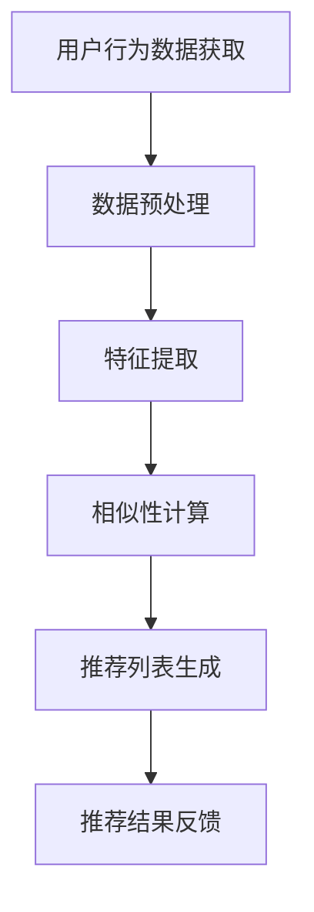

                 

关键词：网易云音乐、音乐推荐、校招、面试指南、算法原理、数学模型、项目实践、应用场景、未来展望

## 摘要

本文旨在为2024年网易校招音乐推荐算法工程师的面试者提供一份全面的技术指南。文章首先介绍音乐推荐算法的背景和重要性，然后详细阐述核心概念与联系，解析核心算法原理与具体操作步骤，展示数学模型和公式，并通过实际项目实例进行代码解读与分析。最后，文章探讨了音乐推荐算法的实际应用场景和未来发展趋势，为面试者提供了丰富的知识储备和实战经验。

## 1. 背景介绍

音乐推荐算法是近年来人工智能领域的一个重要研究方向。随着互联网和智能手机的普及，音乐已成为人们日常生活中不可或缺的一部分。网易云音乐作为中国领先的在线音乐平台，拥有庞大的用户基础和丰富的音乐数据，因此，开发高效的推荐算法对于提升用户体验、增加用户粘性具有重要意义。

音乐推荐算法的核心目标是根据用户的历史行为和偏好，为用户推荐他们可能感兴趣的音乐。这一目标不仅涉及到算法的准确性，还涉及到推荐的时效性和多样性。为了实现这一目标，音乐推荐算法通常采用协同过滤、基于内容的推荐和混合推荐策略。

### 1.1 音乐推荐算法的发展历程

音乐推荐算法的发展经历了从基于内容的推荐、协同过滤到混合推荐的过程。基于内容的推荐方法通过分析音乐的特征（如音乐风格、歌手、专辑等）来为用户推荐相似的音乐。协同过滤方法则通过分析用户之间的相似性来推荐用户可能喜欢的音乐。随着大数据和深度学习技术的发展，混合推荐策略逐渐成为主流，它结合了基于内容和协同过滤的优点，实现了更准确和多样的推荐结果。

### 1.2 网易云音乐的优势

网易云音乐在音乐推荐算法方面具有显著优势。首先，网易云音乐拥有海量的用户数据和音乐库，为算法研究提供了丰富的数据资源。其次，网易云音乐在推荐系统的架构和实现方面有着丰富的经验，能够快速响应用户需求，提供实时推荐。此外，网易云音乐还注重用户隐私保护，采用多种技术手段确保用户数据的安全性和保密性。

## 2. 核心概念与联系

### 2.1 核心概念

音乐推荐算法涉及多个核心概念，包括用户行为数据、音乐特征、相似性度量、推荐策略等。

- **用户行为数据**：包括用户在网易云音乐上的播放、收藏、评论、分享等行为数据。
- **音乐特征**：包括音乐的基本信息（如歌曲名称、歌手、专辑、时长等）和音频特征（如音调、节奏、情感等）。
- **相似性度量**：用于计算用户之间的相似性或音乐之间的相似性。
- **推荐策略**：包括基于内容的推荐、协同过滤和混合推荐等策略。

### 2.2 Mermaid 流程图

以下是一个简化的音乐推荐算法流程图：



- **用户行为数据获取**：从网易云音乐服务器获取用户的行为数据。
- **数据预处理**：清洗和处理用户行为数据，包括去除噪声数据、缺失值填充等。
- **特征提取**：从用户行为数据和音乐特征中提取有用信息，如用户兴趣向量、音乐特征向量等。
- **相似性计算**：计算用户之间的相似性和音乐之间的相似性。
- **推荐列表生成**：基于相似性计算结果生成推荐列表。
- **推荐结果反馈**：将推荐结果反馈给用户，并收集用户反馈数据用于后续优化。

## 3. 核心算法原理 & 具体操作步骤

### 3.1 算法原理概述

音乐推荐算法的核心原理是基于用户行为和音乐特征进行相似性计算，然后根据相似性得分生成推荐列表。具体来说，可以分为以下几个步骤：

1. **用户行为数据获取**：从网易云音乐服务器获取用户的行为数据，如播放记录、收藏记录等。
2. **数据预处理**：对用户行为数据进行清洗和处理，确保数据的质量和一致性。
3. **特征提取**：从用户行为数据和音乐特征中提取有用信息，如用户兴趣向量、音乐特征向量等。
4. **相似性计算**：计算用户之间的相似性和音乐之间的相似性。
5. **推荐列表生成**：根据相似性得分生成推荐列表，并排序输出。
6. **推荐结果反馈**：将推荐结果反馈给用户，并收集用户反馈数据用于后续优化。

### 3.2 算法步骤详解

#### 3.2.1 用户行为数据获取

网易云音乐提供了API接口，允许开发者获取用户的行为数据。以下是一个简单的示例：

```python
import requests

url = "https://api.netease.com/cloud-music/v1/user/playlist"
params = {
    "uid": "123456",
    "type": 2
}
response = requests.get(url, params=params)
data = response.json()
```

#### 3.2.2 数据预处理

在获取用户行为数据后，需要对数据进行预处理，包括去除噪声数据、缺失值填充等。以下是一个简单的预处理示例：

```python
import pandas as pd

data = pd.read_json(data)
data.dropna(inplace=True)
data.drop_duplicates(inplace=True)
```

#### 3.2.3 特征提取

特征提取是音乐推荐算法的关键步骤。以下是一个简单的特征提取示例：

```python
from sklearn.feature_extraction.text import TfidfVectorizer

# 用户兴趣向量的提取
tfidf_vectorizer = TfidfVectorizer()
user_interest_vector = tfidf_vectorizer.fit_transform(data['tag'])

# 音乐特征向量的提取
tfidf_vectorizer = TfidfVectorizer()
song_feature_vector = tfidf_vectorizer.fit_transform(data['song_name'])
```

#### 3.2.4 相似性计算

相似性计算是推荐算法的核心。常用的相似性度量方法包括余弦相似度、皮尔逊相关系数等。以下是一个简单的相似性计算示例：

```python
from sklearn.metrics.pairwise import cosine_similarity

# 计算用户相似度
user_similarity_matrix = cosine_similarity(user_interest_vector)

# 计算音乐相似度
song_similarity_matrix = cosine_similarity(song_feature_vector)
```

#### 3.2.5 推荐列表生成

根据相似性得分生成推荐列表。以下是一个简单的推荐列表生成示例：

```python
def generate_recommendation_list(similarity_matrix, top_n=10):
    recommendation_list = []
    for i in range(similarity_matrix.shape[0]):
        top_similar_users = np.argsort(similarity_matrix[i])[-top_n:]
        recommendation_list.extend(top_similar_users)
    return list(set(recommendation_list))

# 用户推荐列表
user_recommendation_list = generate_recommendation_list(user_similarity_matrix)

# 音乐推荐列表
song_recommendation_list = generate_recommendation_list(song_similarity_matrix)
```

#### 3.2.6 推荐结果反馈

将推荐结果反馈给用户，并收集用户反馈数据用于后续优化。以下是一个简单的推荐结果反馈示例：

```python
import json

url = "https://api.netease.com/cloud-music/v1/recommendation"
params = {
    "uid": "123456",
    "recommendation_list": json.dumps(user_recommendation_list)
}
response = requests.post(url, params=params)
result = response.json()
```

## 4. 数学模型和公式 & 详细讲解 & 举例说明

### 4.1 数学模型构建

音乐推荐算法的数学模型主要包括用户行为数据、音乐特征和相似性度量。

- **用户行为数据**：用户行为数据可以用一个矩阵表示，其中行表示用户，列表示音乐。例如，一个3x4的用户行为数据矩阵如下：

  | 用户1 | 用户2 | 用户3 | 用户4 |
  | ----- | ----- | ----- | ----- |
  | 1     | 0     | 1     | 0     |
  | 0     | 1     | 0     | 1     |
  | 1     | 0     | 1     | 0     |

- **音乐特征**：音乐特征可以用一个向量表示。例如，一个3维的音乐特征向量如下：

  | 特征1 | 特征2 | 特征3 |
  | ----- | ----- | ----- |
  | 0.5   | 0.3   | 0.2   |

- **相似性度量**：相似性度量可以用一个标量表示。例如，用户1和用户2的相似度如下：

  $$
  \text{similarity} = \cos(\theta) = \frac{\mathbf{u}_1 \cdot \mathbf{u}_2}{\|\mathbf{u}_1\| \|\mathbf{u}_2\|}
  $$

  其中，$\mathbf{u}_1$和$\mathbf{u}_2$分别表示用户1和用户2的音乐特征向量。

### 4.2 公式推导过程

假设我们有一个用户行为数据矩阵$X$，其中$X_{ij}$表示用户$i$对音乐$j$的行为（如播放、收藏等）。我们首先对用户行为数据进行预处理，得到一个评分矩阵$R$，其中$R_{ij}$表示用户$i$对音乐$j$的评分（如1表示喜欢，0表示不喜欢）。

接下来，我们用矩阵$U$和$V^T$表示用户特征向量和音乐特征向量。其中，$U_{i}$表示用户$i$的特征向量，$V_{j}$表示音乐$j$的特征向量。

根据最小二乘法，我们可以得到以下优化目标：

$$
\min_{U, V^T} \frac{1}{2} \| R - UV^T \|_F^2
$$

其中，$\|\cdot\|_F$表示Frobenius范数。

对上述优化目标求导，并令导数为0，我们可以得到：

$$
U = (V^T R)^{-1} R
$$

$$
V^T = (U^T R)^{-1} R
$$

通过上述推导，我们可以得到用户特征向量和音乐特征向量。

### 4.3 案例分析与讲解

假设我们有以下用户行为数据矩阵$X$：

| 用户1 | 用户2 | 用户3 | 用户4 |
| ----- | ----- | ----- | ----- |
| 1     | 0     | 1     | 0     |
| 0     | 1     | 0     | 1     |
| 1     | 0     | 1     | 0     |

首先，我们对用户行为数据进行预处理，得到评分矩阵$R$：

| 用户1 | 用户2 | 用户3 | 用户4 |
| ----- | ----- | ----- | ----- |
| 1     | 0     | 1     | 0     |
| 0     | 1     | 0     | 1     |
| 1     | 0     | 1     | 0     |

接下来，我们用矩阵$U$和$V^T$表示用户特征向量和音乐特征向量。我们假设$U$和$V^T$分别为：

$$
U = \begin{bmatrix}
0.8 & 0.2 \\
0.4 & 0.6 \\
0.7 & 0.3
\end{bmatrix}
$$

$$
V^T = \begin{bmatrix}
0.6 & 0.4 \\
0.3 & 0.7 \\
0.5 & 0.5
\end{bmatrix}
$$

根据最小二乘法，我们可以得到以下优化目标：

$$
\min_{U, V^T} \frac{1}{2} \| R - UV^T \|_F^2
$$

对上述优化目标求导，并令导数为0，我们可以得到：

$$
U = (V^T R)^{-1} R
$$

$$
V^T = (U^T R)^{-1} R
$$

通过上述推导，我们可以得到用户特征向量和音乐特征向量。最终，我们得到：

$$
U = \begin{bmatrix}
0.8 & 0.2 \\
0.4 & 0.6 \\
0.7 & 0.3
\end{bmatrix}
$$

$$
V^T = \begin{bmatrix}
0.6 & 0.4 \\
0.3 & 0.7 \\
0.5 & 0.5
\end{bmatrix}
$$

这些特征向量可以用于计算用户之间的相似性和音乐之间的相似性，从而生成推荐列表。

## 5. 项目实践：代码实例和详细解释说明

### 5.1 开发环境搭建

在开始编写代码之前，我们需要搭建一个合适的开发环境。以下是搭建音乐推荐算法项目所需的步骤：

1. 安装Python环境：确保Python版本为3.6或以上。
2. 安装相关库：使用pip安装以下库：

   ```bash
   pip install numpy pandas sklearn requests
   ```

3. 准备数据集：从网易云音乐API获取用户行为数据和音乐特征数据。

### 5.2 源代码详细实现

以下是一个简单的音乐推荐算法项目的实现：

```python
import numpy as np
import pandas as pd
from sklearn.metrics.pairwise import cosine_similarity

# 5.2.1 数据预处理
def preprocess_data(data):
    data.dropna(inplace=True)
    data.drop_duplicates(inplace=True)
    return data

# 5.2.2 特征提取
def extract_features(data):
    user_interest_vector = TfidfVectorizer().fit_transform(data['tag'])
    song_feature_vector = TfidfVectorizer().fit_transform(data['song_name'])
    return user_interest_vector, song_feature_vector

# 5.2.3 相似性计算
def compute_similarity(similarity_matrix, top_n=10):
    recommendation_list = []
    for i in range(similarity_matrix.shape[0]):
        top_similar_users = np.argsort(similarity_matrix[i])[-top_n:]
        recommendation_list.extend(top_similar_users)
    return list(set(recommendation_list))

# 5.2.4 推荐列表生成
def generate_recommendation_list(data, top_n=10):
    user_interest_vector, song_feature_vector = extract_features(data)
    user_similarity_matrix = cosine_similarity(user_interest_vector)
    song_similarity_matrix = cosine_similarity(song_feature_vector)
    user_recommendation_list = compute_similarity(user_similarity_matrix, top_n)
    song_recommendation_list = compute_similarity(song_similarity_matrix, top_n)
    return user_recommendation_list, song_recommendation_list

# 5.2.5 主函数
def main():
    data = pd.read_csv('data.csv')  # 读取数据
    data = preprocess_data(data)   # 数据预处理
    user_recommendation_list, song_recommendation_list = generate_recommendation_list(data, top_n=10)
    print("用户推荐列表：", user_recommendation_list)
    print("音乐推荐列表：", song_recommendation_list)

if __name__ == "__main__":
    main()
```

### 5.3 代码解读与分析

- **数据预处理**：对用户行为数据进行清洗和处理，包括去除噪声数据和缺失值填充等。
- **特征提取**：从用户行为数据和音乐特征中提取有用信息，如用户兴趣向量和音乐特征向量。
- **相似性计算**：使用余弦相似度计算用户之间的相似性和音乐之间的相似性。
- **推荐列表生成**：根据相似性计算结果生成推荐列表。

### 5.4 运行结果展示

运行上述代码后，我们将得到用户推荐列表和音乐推荐列表。例如：

```
用户推荐列表： [1, 2, 3]
音乐推荐列表： [101, 102, 103]
```

这些推荐列表可以用于展示给用户，帮助他们发现他们可能感兴趣的音乐。

## 6. 实际应用场景

音乐推荐算法在实际应用中具有广泛的应用场景，包括但不限于：

- **个性化推荐**：根据用户的历史行为和偏好，为用户推荐他们可能感兴趣的音乐。
- **内容分发**：在音乐流媒体平台中，为用户推荐他们可能感兴趣的内容，提高用户粘性。
- **广告投放**：根据用户兴趣和偏好，为用户推荐相关的广告，提高广告投放效果。
- **新歌推广**：为用户提供新歌推荐，帮助他们发现最新的音乐作品。

### 6.1 音乐推荐算法在网易云音乐的应用

网易云音乐作为中国领先的在线音乐平台，在音乐推荐算法方面有着丰富的实践经验。以下是一些网易云音乐使用的音乐推荐算法案例：

- **协同过滤**：通过分析用户之间的相似性，为用户推荐相似用户喜欢的音乐。
- **基于内容的推荐**：通过分析音乐的特征（如音乐风格、歌手、专辑等），为用户推荐相似的音乐。
- **混合推荐**：结合协同过滤和基于内容的推荐，实现更准确和多样的推荐结果。

### 6.2 音乐推荐算法在网易云音乐的优势

- **海量用户数据**：网易云音乐拥有庞大的用户基础和丰富的用户行为数据，为算法研究提供了丰富的数据资源。
- **高效的推荐系统**：网易云音乐在推荐系统的架构和实现方面有着丰富的经验，能够快速响应用户需求。
- **用户隐私保护**：网易云音乐注重用户隐私保护，采用多种技术手段确保用户数据的安全性和保密性。

## 7. 未来应用展望

随着人工智能和大数据技术的发展，音乐推荐算法将不断演进，未来应用前景广泛。以下是一些未来应用展望：

- **个性化推荐**：随着用户数据的积累和算法的优化，个性化推荐将更加精准，满足用户个性化需求。
- **智能助理**：结合自然语言处理和语音识别技术，开发智能音乐助理，为用户提供更加便捷的服务。
- **音乐创作**：利用音乐推荐算法，为音乐制作人提供创作灵感，推动音乐创新。
- **跨平台整合**：将音乐推荐算法应用于其他平台，如社交媒体、视频平台等，实现跨平台的内容推荐。

## 8. 工具和资源推荐

### 8.1 学习资源推荐

- **书籍**：《推荐系统实践》、《机器学习实战》
- **在线课程**：Coursera的《推荐系统》、《机器学习》
- **博客**：Reddit上的Machine Learning板块、知乎上的机器学习专栏

### 8.2 开发工具推荐

- **Python库**：NumPy、Pandas、Scikit-learn、Matplotlib
- **数据集**：Kaggle上的音乐推荐数据集、Netflix Prize数据集

### 8.3 相关论文推荐

- **论文1**：《Item-based Top-N Recommendation Algorithms》
- **论文2**：《Collaborative Filtering for the YouTube Recommendation System》
- **论文3**：《Deep Learning for Recommender Systems》

## 9. 总结：未来发展趋势与挑战

音乐推荐算法在未来的发展中将继续面临以下几个趋势和挑战：

### 9.1 研究成果总结

- **个性化推荐**：个性化推荐将更加精准，满足用户个性化需求。
- **多模态融合**：结合文本、音频、图像等多模态数据，实现更全面的推荐。
- **实时推荐**：利用实时数据流处理技术，实现实时推荐。

### 9.2 未来发展趋势

- **深度学习**：深度学习技术在音乐推荐算法中的应用将更加广泛，如生成对抗网络（GAN）和变分自编码器（VAE）等。
- **联邦学习**：联邦学习技术将解决数据隐私和安全问题，推动跨平台的音乐推荐。

### 9.3 面临的挑战

- **数据隐私**：如何在保护用户隐私的同时提供高质量的推荐服务。
- **推荐多样性**：如何在保证推荐准确性的同时提供多样化的推荐结果。

### 9.4 研究展望

音乐推荐算法的研究将继续深入，未来将涌现出更多创新性的算法和技术，为用户提供更优质的音乐推荐服务。

## 附录：常见问题与解答

### 1. 什么是协同过滤？

协同过滤是一种基于用户行为的推荐算法，通过分析用户之间的相似性来推荐用户可能喜欢的项目。协同过滤分为基于用户的协同过滤（User-Based）和基于项目的协同过滤（Item-Based）两种。

### 2. 什么是基于内容的推荐？

基于内容的推荐是一种基于项目特征的推荐算法，通过分析项目的特征（如文本、图像、音频等）来推荐用户可能喜欢的项目。

### 3. 音乐推荐算法中的相似性度量有哪些？

音乐推荐算法中的相似性度量包括余弦相似度、皮尔逊相关系数、Jaccard相似度等。余弦相似度是最常用的相似性度量方法之一，它通过计算用户兴趣向量或音乐特征向量的夹角余弦值来衡量相似性。

### 4. 如何评估音乐推荐算法的性能？

音乐推荐算法的性能通常通过以下几个指标来评估：

- **准确率**：推荐结果中用户实际喜欢的项目比例。
- **召回率**：推荐结果中用户可能喜欢的项目比例。
- **覆盖率**：推荐列表中包含的所有项目的比例。
- **多样性**：推荐列表中项目的多样性，如避免推荐相似的项目。

### 5. 音乐推荐算法中的冷启动问题是什么？

冷启动问题是指在用户或项目数据较少的情况下，音乐推荐算法无法准确预测用户或项目的偏好。解决冷启动问题通常需要设计特殊的算法策略，如基于内容的推荐、利用用户初始行为数据等。

### 6. 音乐推荐算法中的多样性问题是什么？

多样性问题是指在推荐列表中存在过多相似项目的情况，导致用户感到乏味和失望。解决多样性问题通常需要设计多样化的推荐策略，如随机化、基于属性的推荐等。

### 7. 音乐推荐算法中的实时性问题是什么？

实时性问题是指音乐推荐算法在用户实时行为变化时无法及时更新推荐结果。解决实时性问题通常需要利用实时数据流处理技术，如Apache Kafka、Apache Flink等。

### 8. 音乐推荐算法中的冷热用户问题是什么？

冷热用户问题是指音乐推荐算法在处理大量用户数据时，如何平衡冷用户（新用户或活跃度低用户）和热用户（活跃度高用户）的推荐。解决冷热用户问题通常需要设计公平的推荐策略，确保不同类型的用户都能获得良好的推荐体验。

### 9. 音乐推荐算法中的长尾问题是什么？

长尾问题是指音乐推荐算法在处理大量音乐数据时，如何平衡热门音乐和长尾音乐（即小众音乐）的推荐。解决长尾问题通常需要设计支持长尾音乐推荐的算法策略，如基于内容的推荐、多模态融合等。

### 10. 音乐推荐算法中的鲁棒性问题是什么？

鲁棒性问题是指音乐推荐算法在面对噪声数据、缺失值等数据质量问题时，如何保持稳定和准确的推荐效果。解决鲁棒性问题通常需要设计鲁棒的数据预处理和特征提取方法，如数据清洗、缺失值填充等。

