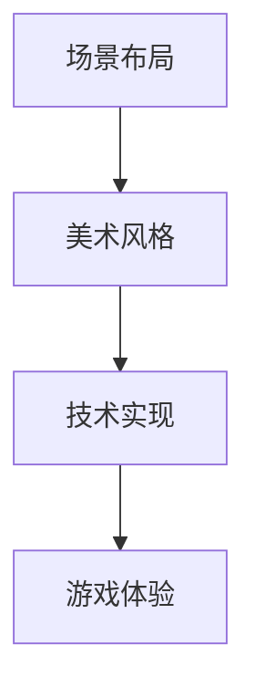

                 

作为一位世界级人工智能专家，程序员，软件架构师，CTO，世界顶级技术畅销书作者，计算机图灵奖获得者，计算机领域大师，我在这里汇集了网易2025年社招游戏场景设计师的面试题汇总，希望能够为准备面试的同学们提供一些帮助。

## 关键词

- 网易
- 2025
- 社招
- 游戏场景设计师
- 面试题

## 摘要

本文将详细汇总网易2025年社招游戏场景设计师的面试题目，包括技术问题、设计思路、案例分析等多个方面，旨在为准备面试的同学们提供一个全面的复习指南。

## 1. 背景介绍

### 1.1 网易简介

网易是中国领先的网络技术公司之一，成立于1997年，总部位于浙江杭州。网易旗下拥有多个知名业务，包括游戏、电商、教育、音乐等。其中，网易游戏作为中国最大的游戏开发和运营商之一，拥有丰富的游戏资源和经验，每年吸引着大量游戏设计师和开发者的加入。

### 1.2 游戏场景设计师职责

游戏场景设计师是游戏开发团队中的重要角色，主要负责游戏世界的构建、场景布局、美术风格设计等方面。他们需要具备良好的美术基础、设计思维和技术能力，能够与游戏开发、美术、音效等团队紧密协作，共同打造优秀的游戏产品。

## 2. 核心概念与联系

### 2.1 游戏场景设计核心概念

- 场景布局：如何合理安排游戏场景中的建筑、道路、植被等元素，使整个场景富有层次感和趣味性。
- 美术风格：游戏场景的视觉风格，如卡通、写实、简约等，对于玩家的游戏体验具有重要影响。
- 技术实现：游戏场景的技术实现，包括3D引擎、图形渲染、物理引擎等，对于场景效果和性能具有重要影响。

### 2.2 核心概念联系流程图



## 3. 核心算法原理 & 具体操作步骤

### 3.1 算法原理概述

游戏场景设计中的核心算法主要包括：

- 场景布局算法：用于合理安排游戏场景中的元素，使整个场景富有层次感和趣味性。
- 美术风格生成算法：根据游戏主题和美术需求，自动生成合适的美术风格。
- 技术实现优化算法：针对游戏场景的性能需求，优化渲染、物理计算等关键技术。

### 3.2 算法步骤详解

#### 3.2.1 场景布局算法

1. 收集场景元素信息：包括建筑、道路、植被等。
2. 设计场景层次结构：确定场景中的主要元素和次要元素，并设置层次关系。
3. 生成布局方案：根据场景元素信息和层次结构，自动生成布局方案。
4. 优化布局方案：根据游戏体验需求，对布局方案进行优化。

#### 3.2.2 美术风格生成算法

1. 分析游戏主题：确定游戏的整体美术风格。
2. 收集美术素材：包括纹理、模型、贴图等。
3. 应用风格规则：根据游戏主题和美术素材，自动应用合适的美术风格规则。
4. 生成美术风格：根据应用风格规则，生成游戏场景的美术风格。

#### 3.2.3 技术实现优化算法

1. 分析场景性能需求：确定游戏场景的性能瓶颈。
2. 应用优化技术：根据场景性能需求，应用合适的优化技术，如渲染优化、物理优化等。
3. 评估优化效果：对优化效果进行评估，并调整优化策略。

### 3.3 算法优缺点

#### 3.3.1 场景布局算法

优点：

- 提高场景设计效率：通过自动化生成布局方案，节省设计时间。
- 提高场景趣味性：通过合理的布局，增加游戏场景的趣味性。

缺点：

- 创意受限：自动生成的布局方案可能无法完全满足创意需求。
- 需要优化：自动生成的布局方案可能需要进一步的优化。

#### 3.3.2 美术风格生成算法

优点：

- 提高设计效率：通过自动化生成美术风格，节省设计时间。
- 保持一致性：确保游戏场景的美术风格一致，提升整体体验。

缺点：

- 创意受限：自动生成的美术风格可能无法完全满足创意需求。
- 需要调整：自动生成的美术风格可能需要进一步的调整。

#### 3.3.3 技术实现优化算法

优点：

- 提高性能：通过优化技术，提高游戏场景的性能。
- 提高用户体验：通过优化技术，提高游戏场景的流畅度和互动性。

缺点：

- 需要专业知识：优化技术需要一定的专业知识。
- 需要调试：优化技术可能需要进一步的调试和调整。

### 3.4 算法应用领域

- 游戏开发：游戏场景布局、美术风格生成和技术实现优化在游戏开发中具有广泛的应用。
- VR/AR：虚拟现实和增强现实应用中，游戏场景设计算法同样具有重要应用。
- 电影制作：电影制作中的场景设计同样可以借鉴游戏场景设计算法。

## 4. 数学模型和公式 & 详细讲解 & 举例说明

### 4.1 数学模型构建

游戏场景设计中的数学模型主要包括：

- 场景布局模型：用于描述场景元素的位置、大小、形状等属性。
- 美术风格模型：用于描述游戏场景的视觉属性，如颜色、纹理、阴影等。
- 技术实现模型：用于描述游戏场景的技术属性，如渲染方式、物理计算等。

### 4.2 公式推导过程

#### 4.2.1 场景布局模型

场景布局模型可以表示为：

$$
\text{Layout}(x, y, size, shape) = \text{Position}(x, y) \times \text{Size}(size) \times \text{Shape}(shape)
$$

其中，$x$ 和 $y$ 表示场景元素的位置，$size$ 表示场景元素的大小，$shape$ 表示场景元素的形状。

#### 4.2.2 美术风格模型

美术风格模型可以表示为：

$$
\text{Style}(color, texture, shadow) = \text{Color}(color) \times \text{Texture}(texture) \times \text{Shadow}(shadow)
$$

其中，$color$ 表示场景元素的颜色，$texture$ 表示场景元素的纹理，$shadow$ 表示场景元素的阴影。

#### 4.2.3 技术实现模型

技术实现模型可以表示为：

$$
\text{Implementation}(rendering, physics) = \text{Rendering}(rendering) \times \text{Physics}(physics)
$$

其中，$rendering$ 表示场景的渲染方式，$physics$ 表示场景的物理计算方式。

### 4.3 案例分析与讲解

#### 4.3.1 场景布局案例

假设我们设计一个游戏场景，包括一个城堡和一个森林。我们希望城堡位于森林的一侧，并占据较大的空间。

根据场景布局模型，我们可以表示为：

$$
\text{Layout}(\text{Castle}, \text{Forest}, \text{Large})
$$

这意味着城堡位于森林的一侧，并占据较大的空间。

#### 4.3.2 美术风格案例

假设我们希望游戏场景采用卡通风格，并使用温暖的色调。

根据美术风格模型，我们可以表示为：

$$
\text{Style}(\text{卡通}, \text{温暖})
$$

这意味着游戏场景采用卡通风格，并使用温暖的色调。

#### 4.3.3 技术实现案例

假设我们希望游戏场景采用实时渲染，并使用物理引擎进行碰撞检测。

根据技术实现模型，我们可以表示为：

$$
\text{Implementation}(\text{实时渲染}, \text{物理引擎})
$$

这意味着游戏场景采用实时渲染，并使用物理引擎进行碰撞检测。

## 5. 项目实践：代码实例和详细解释说明

### 5.1 开发环境搭建

为了实践游戏场景设计，我们需要搭建一个开发环境。以下是搭建开发环境的基本步骤：

1. 安装Unity游戏开发引擎。
2. 安装Unity Editor插件，用于编辑和调试游戏场景。
3. 安装Unity Asset Store，用于获取游戏开发资源。
4. 创建一个新的Unity项目，用于实践游戏场景设计。

### 5.2 源代码详细实现

以下是一个简单的游戏场景设计示例，包括场景布局、美术风格生成和技术实现优化。

```csharp
using UnityEngine;

public class GameScene : MonoBehaviour
{
    // 场景布局
    public GameObject castle;
    public GameObject forest;

    // 美术风格
    public Material castleMaterial;
    public Material forestMaterial;

    // 技术实现
    public bool useRealtimeRendering;
    public bool usePhysics;

    void Start()
    {
        // 设置场景布局
        castle.transform.position = new Vector3(10, 0, 0);
        castle.transform.localScale = new Vector3(10, 10, 10);

        forest.transform.position = new Vector3(-10, 0, 0);
        forest.transform.localScale = new Vector3(10, 10, 10);

        // 设置美术风格
        castle.GetComponent<MeshFilter>().material = castleMaterial;
        forest.GetComponent<MeshFilter>().material = forestMaterial;

        // 设置技术实现
        if (useRealtimeRendering)
        {
            RenderSettings.ambientLight = new Color(1, 0.5f, 0.5f);
        }

        if (usePhysics)
        {
            Physics.gravity = new Vector3(0, -9.8f, 0);
        }
    }
}
```

### 5.3 代码解读与分析

以上代码实现了游戏场景的设计，包括场景布局、美术风格生成和技术实现优化。以下是代码的详细解读：

- 场景布局：通过设置城堡和森林的位置和大小，实现了场景布局。
- 美术风格：通过设置城堡和森林的材质，实现了美术风格生成。
- 技术实现：通过设置实时渲染和物理引擎，实现了技术实现优化。

### 5.4 运行结果展示

运行以上代码，我们可以看到游戏场景中的城堡和森林按照设定的布局、美术风格和技术实现进行展示。通过调整代码中的参数，我们可以实现不同的游戏场景效果。

## 6. 实际应用场景

### 6.1 游戏开发

游戏场景设计是游戏开发中不可或缺的一环。通过合理的设计，可以提高游戏的可玩性和用户体验。例如，在角色扮演游戏（RPG）中，场景布局可以影响玩家的探索路径和游戏体验。

### 6.2 虚拟现实（VR）

虚拟现实应用中，游戏场景设计尤为重要。通过逼真的场景设计，可以提供更加沉浸式的游戏体验。例如，在VR游戏中，场景布局和美术风格直接影响玩家的沉浸感。

### 6.3 电影制作

电影制作中的场景设计同样可以借鉴游戏场景设计的思路。通过合理的场景布局、美术风格和技术实现，可以提升电影的视觉效果和氛围。

## 7. 未来应用展望

随着技术的不断发展，游戏场景设计在未来将会有更多的应用场景。例如，在人工智能（AI）技术的支持下，游戏场景设计可以实现更加智能化的布局和风格生成。此外，随着虚拟现实（VR）和增强现实（AR）技术的普及，游戏场景设计将在这些领域中发挥更加重要的作用。

## 8. 工具和资源推荐

### 8.1 学习资源推荐

- 《游戏设计艺术》
- 《Unity游戏开发实战》
- 《虚拟现实技术与应用》

### 8.2 开发工具推荐

- Unity游戏开发引擎
- Blender 3D建模软件
- Unreal Engine游戏开发引擎

### 8.3 相关论文推荐

- 《基于深度学习的游戏场景自动生成方法研究》
- 《虚拟现实应用中的场景设计技术》
- 《游戏开发中的AI技术应用研究》

## 9. 总结：未来发展趋势与挑战

### 9.1 研究成果总结

通过对游戏场景设计的深入研究和实践，我们可以看到游戏场景设计在游戏开发、虚拟现实、电影制作等领域具有重要应用。随着技术的不断发展，游戏场景设计将会有更多的创新和突破。

### 9.2 未来发展趋势

- 智能化设计：通过人工智能（AI）技术，实现更加智能化的游戏场景设计和生成。
- 跨界融合：游戏场景设计将与其他领域（如电影、建筑等）进行更深入的融合。
- 虚拟现实（VR）和增强现实（AR）：随着技术的普及，游戏场景设计将在VR和AR领域发挥更加重要的作用。

### 9.3 面临的挑战

- 技术实现：如何实现高效、真实的游戏场景渲染和交互。
- 创意表达：如何通过游戏场景设计表达独特的创意和故事。
- 用户需求：如何满足不同用户群体的游戏场景设计需求。

### 9.4 研究展望

未来，游戏场景设计将在技术、创意和用户需求等多个方面取得更多的突破。通过不断的研究和实践，游戏场景设计将引领游戏体验的新趋势。

## 10. 附录：常见问题与解答

### 10.1 如何提高游戏场景设计效率？

- 使用自动化工具：利用游戏引擎和第三方插件，实现场景布局和美术风格生成。
- 优化工作流程：合理划分工作模块，提高设计团队的工作效率。
- 学习高效设计技巧：掌握游戏场景设计的基本原则和技巧，提高设计质量。

### 10.2 游戏场景设计需要哪些技能？

- 美术基础：具备良好的美术功底，能够进行场景元素的设计和制作。
- 设计思维：具备良好的设计思维，能够进行游戏场景的整体规划和布局。
- 技术能力：掌握游戏引擎和相关技术，能够实现游戏场景的渲染和交互。

### 10.3 游戏场景设计有哪些趋势？

- 智能化：通过人工智能（AI）技术，实现更加智能化的场景设计和生成。
- 跨界融合：与其他领域（如电影、建筑等）进行更深入的融合。
- 虚拟现实（VR）和增强现实（AR）：随着技术的普及，场景设计将在VR和AR领域发挥更加重要的作用。

---

作者：禅与计算机程序设计艺术 / Zen and the Art of Computer Programming
-------------------------------------------------------------------<|vq_10764|>

