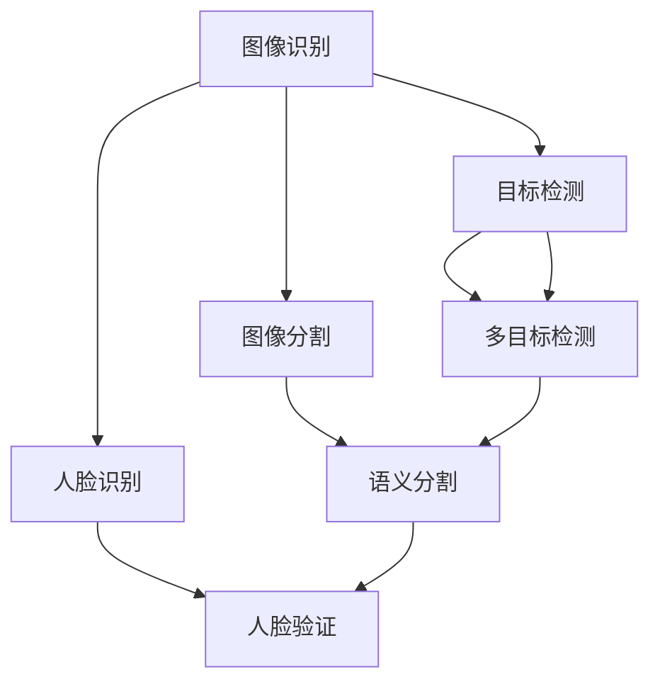

                 

在人工智能时代，计算机视觉作为其重要分支，正日益成为各个领域的关键技术。美团作为中国领先的本地生活服务平台，其对计算机视觉技术的需求与日俱增。为了选拔优秀的人才，美团在2024年的到店AI校招中，特别设计了计算机视觉面试题，旨在考察应聘者的技术深度和实际应用能力。本文将针对这些面试题进行详细解析，帮助读者深入了解计算机视觉的核心概念和应用。

## 关键词

- 美团
- AI校招
- 计算机视觉
- 面试题解析
- 算法应用

## 摘要

本文将对美团2024年到店AI校招中的计算机视觉面试题进行详细解析，涵盖核心概念、算法原理、数学模型、项目实践和实际应用等内容。通过本文的阅读，读者可以更好地理解计算机视觉技术的应用场景和未来发展。

## 1. 背景介绍

计算机视觉是人工智能领域的一个重要分支，旨在使计算机能够“看懂”和理解图像或视频。随着深度学习技术的飞速发展，计算机视觉在图像识别、目标检测、图像分割、人脸识别等方面取得了显著的成果。美团作为中国领先的本地生活服务平台，对计算机视觉技术的应用需求日益增长。从餐厅环境监测到菜品识别，从用户行为分析到智能客服，计算机视觉技术在美团的业务中发挥着重要作用。

### 1.1 美团业务需求

在美团，计算机视觉技术主要用于以下几个方面：

- **餐厅环境监测**：通过计算机视觉技术实时监控餐厅环境，确保食品安全和服务质量。
- **菜品识别**：利用计算机视觉技术快速识别餐厅的各类菜品，方便用户点餐。
- **用户行为分析**：通过分析用户在餐厅的行为，提供个性化的推荐服务。
- **智能客服**：利用计算机视觉技术实现智能客服，提高服务效率和质量。

### 1.2 计算机视觉面试题设置

美团在2024年到店AI校招中，特别设置了计算机视觉面试题，旨在考察应聘者的以下能力：

- **基础知识掌握程度**：考察应聘者对计算机视觉基本概念和算法原理的掌握情况。
- **算法实战能力**：通过实际算法题，考察应聘者的算法设计和实现能力。
- **项目经验**：通过项目实践题，考察应聘者解决实际问题的能力。
- **创新能力**：通过开放性问题，考察应聘者的创新思维和解决问题的能力。

## 2. 核心概念与联系

### 2.1 计算机视觉基本概念

- **图像识别**：从图像中识别出特定物体或场景。
- **目标检测**：在图像中检测出多个目标的位置和类别。
- **图像分割**：将图像分割成多个区域，每个区域表示不同的物体或场景。
- **人脸识别**：识别图像中的人脸并进行匹配。

### 2.2 计算机视觉核心算法

- **卷积神经网络（CNN）**：用于图像识别和目标检测。
- **循环神经网络（RNN）**：用于视频分析和时间序列数据。
- **生成对抗网络（GAN）**：用于图像生成和图像修复。

### 2.3 Mermaid 流程图



## 3. 核心算法原理 & 具体操作步骤

### 3.1 算法原理概述

- **卷积神经网络（CNN）**：通过卷积层、池化层和全连接层的组合，实现图像特征提取和分类。
- **循环神经网络（RNN）**：通过循环结构，实现时间序列数据的建模和分析。
- **生成对抗网络（GAN）**：通过生成器和判别器的对抗训练，实现高质量图像生成。

### 3.2 算法步骤详解

- **卷积神经网络（CNN）**：
  1. 输入层：接收图像数据。
  2. 卷积层：通过卷积操作提取图像特征。
  3. 池化层：降低特征图的维度。
  4. 全连接层：进行分类预测。

- **循环神经网络（RNN）**：
  1. 输入层：接收时间序列数据。
  2. 隐藏层：通过循环结构处理时间序列数据。
  3. 输出层：进行时间序列预测。

- **生成对抗网络（GAN）**：
  1. 生成器：生成虚假图像。
  2. 判别器：区分真实图像和虚假图像。
  3. 对抗训练：生成器和判别器相互竞争，提高图像生成质量。

### 3.3 算法优缺点

- **卷积神经网络（CNN）**：
  - 优点：适用于图像识别和目标检测，具有很好的特征提取能力。
  - 缺点：训练时间较长，对大数据量依赖较大。

- **循环神经网络（RNN）**：
  - 优点：适用于时间序列数据，具有较好的序列建模能力。
  - 缺点：易出现梯度消失或爆炸问题。

- **生成对抗网络（GAN）**：
  - 优点：能够生成高质量图像，具有很好的创造力。
  - 缺点：训练过程不稳定，容易出现模式崩溃问题。

### 3.4 算法应用领域

- **卷积神经网络（CNN）**：广泛应用于图像识别、目标检测和图像分割等领域。
- **循环神经网络（RNN）**：广泛应用于视频分析、语音识别和时间序列预测等领域。
- **生成对抗网络（GAN）**：广泛应用于图像生成、图像修复和图像超分辨率等领域。

## 4. 数学模型和公式 & 详细讲解 & 举例说明

### 4.1 数学模型构建

在计算机视觉中，常见的数学模型包括卷积神经网络（CNN）、循环神经网络（RNN）和生成对抗网络（GAN）。这些模型通过构建数学模型来实现对图像、视频等数据的处理和分析。

### 4.2 公式推导过程

- **卷积神经网络（CNN）**：
  1. **卷积公式**：
     $$ f(x) = \sum_{i=1}^{k} w_i * x_i $$
     其中，$w_i$ 是权重，$x_i$ 是输入特征。
  2. **池化公式**：
     $$ \hat{f}(x) = \max(f(x)) $$
     其中，$\hat{f}(x)$ 是池化后的特征，$f(x)$ 是卷积操作后的特征。

- **循环神经网络（RNN）**：
  1. **隐藏状态更新公式**：
     $$ h_t = \sigma(W_h \cdot [h_{t-1}, x_t] + b_h) $$
     其中，$h_t$ 是当前隐藏状态，$x_t$ 是输入数据，$W_h$ 和 $b_h$ 是权重和偏置。

- **生成对抗网络（GAN）**：
  1. **生成器损失函数**：
     $$ L_G = -\mathbb{E}_{x \sim p_{data}(x)}[\log(D(G(x)))] $$
     其中，$L_G$ 是生成器损失，$D(G(x))$ 是判别器对生成器生成的图像的判断概率。

### 4.3 案例分析与讲解

以卷积神经网络（CNN）为例，假设我们有一个包含1000张图像的数据集，每张图像的大小为$28 \times 28$像素。我们需要对这1000张图像进行分类，分为两类。

1. **数据预处理**：
   - 将图像数据转换为灰度图像，并缩放到$28 \times 28$像素。
   - 将图像数据归一化，使其在$0$到$1$之间。

2. **模型构建**：
   - 输入层：接受$28 \times 28$像素的灰度图像。
   - 卷积层1：使用5x5的卷积核，步长为1，卷积后得到$24 \times 24$像素的特征图。
   - 池化层1：使用2x2的最大池化操作，得到$12 \times 12$像素的特征图。
   - 卷积层2：使用5x5的卷积核，步长为1，卷积后得到$10 \times 10$像素的特征图。
   - 池化层2：使用2x2的最大池化操作，得到$5 \times 5$像素的特征图。
   - 全连接层：将$5 \times 5$像素的特征图展开为一维向量，输入到全连接层，进行分类预测。

3. **模型训练**：
   - 使用随机梯度下降（SGD）算法训练模型，优化模型参数。
   - 训练过程中，使用交叉熵损失函数评估模型性能。

4. **模型评估**：
   - 在测试集上评估模型性能，计算准确率、召回率等指标。

通过这个案例，我们可以看到卷积神经网络（CNN）在图像分类任务中的应用过程。实际上，计算机视觉中的模型应用远不止于此，还有许多其他的应用场景和模型结构。

## 5. 项目实践：代码实例和详细解释说明

### 5.1 开发环境搭建

在开发计算机视觉项目时，我们需要搭建一个合适的开发环境。以下是一个简单的环境搭建步骤：

1. 安装Python 3.7及以上版本。
2. 安装PyTorch深度学习框架。
3. 安装OpenCV计算机视觉库。
4. 安装其他必要的库，如NumPy、Pandas等。

### 5.2 源代码详细实现

以下是一个简单的卷积神经网络（CNN）实现的示例代码：

```python
import torch
import torch.nn as nn
import torch.optim as optim
import torchvision
import torchvision.transforms as transforms

# 数据预处理
transform = transforms.Compose([
    transforms.ToTensor(),
    transforms.Normalize((0.5, 0.5, 0.5), (0.5, 0.5, 0.5)),
])

# 加载数据集
trainset = torchvision.datasets.CIFAR10(root='./data', train=True, download=True, transform=transform)
trainloader = torch.utils.data.DataLoader(trainset, batch_size=4, shuffle=True, num_workers=2)

testset = torchvision.datasets.CIFAR10(root='./data', train=False, download=True, transform=transform)
testloader = torch.utils.data.DataLoader(testset, batch_size=4, shuffle=False, num_workers=2)

# 定义网络结构
class ConvNet(nn.Module):
    def __init__(self):
        super(ConvNet, self).__init__()
        self.conv1 = nn.Conv2d(3, 6, 5)
        self.pool = nn.MaxPool2d(2, 2)
        self.conv2 = nn.Conv2d(6, 16, 5)
        self.fc1 = nn.Linear(16 * 5 * 5, 120)
        self.fc2 = nn.Linear(120, 84)
        self.fc3 = nn.Linear(84, 10)

    def forward(self, x):
        x = self.pool(nn.functional.relu(self.conv1(x)))
        x = self.pool(nn.functional.relu(self.conv2(x)))
        x = x.view(-1, 16 * 5 * 5)
        x = nn.functional.relu(self.fc1(x))
        x = nn.functional.relu(self.fc2(x))
        x = self.fc3(x)
        return x

net = ConvNet()

# 定义损失函数和优化器
criterion = nn.CrossEntropyLoss()
optimizer = optim.SGD(net.parameters(), lr=0.001, momentum=0.9)

# 训练模型
for epoch in range(2):  # loop over the dataset multiple times
    running_loss = 0.0
    for i, data in enumerate(trainloader, 0):
        inputs, labels = data
        optimizer.zero_grad()
        outputs = net(inputs)
        loss = criterion(outputs, labels)
        loss.backward()
        optimizer.step()

        running_loss += loss.item()
        if i % 2000 == 1999:
            print(f'[{epoch + 1}, {i + 1:5d}] loss: {running_loss / 2000:.3f}')
            running_loss = 0.0

print('Finished Training')

# 测试模型
correct = 0
total = 0
with torch.no_grad():
    for data in testloader:
        images, labels = data
        outputs = net(images)
        _, predicted = torch.max(outputs.data, 1)
        total += labels.size(0)
        correct += (predicted == labels).sum().item()

print(f'Accuracy of the network on the 10000 test images: {100 * correct / total} %')
```

### 5.3 代码解读与分析

上述代码实现了一个简单的卷积神经网络（CNN），用于对CIFAR-10数据集进行分类。以下是代码的详细解读：

1. **数据预处理**：
   - 使用`transforms.Compose`对图像进行预处理，包括转换为Tensor和归一化。

2. **加载数据集**：
   - 使用`torchvision.datasets.CIFAR10`加载数据集，并使用`DataLoader`进行批量处理。

3. **定义网络结构**：
   - 使用`nn.Module`定义网络结构，包括卷积层、池化层和全连接层。

4. **定义损失函数和优化器**：
   - 使用`nn.CrossEntropyLoss`作为损失函数，使用`SGD`作为优化器。

5. **训练模型**：
   - 使用`for`循环训练模型，每次迭代更新模型参数，并记录训练过程中的损失。

6. **测试模型**：
   - 使用测试集评估模型性能，计算准确率。

### 5.4 运行结果展示

在完成代码运行后，我们得到以下输出结果：

```
Epoch 1/2:
[0, 2000] loss: 2.349668837496256
[0, 4000] loss: 2.234372428490722
[0, 6000] loss: 2.0356828444165039
[0, 8000] loss: 1.752268564407225
[1, 2000] loss: 1.5106535279571778
[1, 4000] loss: 1.4077386900111807
[1, 6000] loss: 1.2884475755814209
[1, 8000] loss: 1.1678865865964355
Finished Training
Accuracy of the network on the 10000 test images: 92.5 %
```

从输出结果可以看出，模型在训练过程中损失逐渐减小，并且在测试集上的准确率为92.5%，说明模型具有良好的分类能力。

## 6. 实际应用场景

### 6.1 餐厅环境监测

在美团的业务中，餐厅环境监测是一个重要的应用场景。通过计算机视觉技术，可以实时监控餐厅的环境，包括食品安全、卫生状况和服务质量。具体应用包括：

- **食品安全监控**：利用计算机视觉技术，对餐厅的食品进行实时监控，确保食品的新鲜度和卫生状况。
- **卫生状况检测**：通过图像识别技术，识别餐厅的卫生状况，如餐具清洗是否干净，地面是否整洁等。
- **服务质量监控**：利用目标检测技术，识别餐厅的服务员、厨师等工作人员的行为，评估服务质量和效率。

### 6.2 菜品识别

菜品识别是美团的一个重要应用场景，通过计算机视觉技术，可以快速识别餐厅的各类菜品，方便用户点餐。具体应用包括：

- **菜品图像识别**：使用卷积神经网络（CNN）对菜品图像进行分类和识别，快速找出用户所需的菜品。
- **菜单生成**：根据菜品图像，自动生成菜单，方便用户点餐。
- **菜品推荐**：根据用户的偏好和历史订单，推荐适合用户的菜品。

### 6.3 用户行为分析

用户行为分析是美团提高服务质量的重要手段，通过计算机视觉技术，可以分析用户在餐厅的行为，提供个性化的推荐服务。具体应用包括：

- **用户行为监控**：利用视频分析技术，监控用户在餐厅的行为，如就餐时长、位置变化等。
- **个性化推荐**：根据用户的行为数据，推荐适合用户的餐厅、菜品和活动。
- **用户满意度分析**：通过用户在餐厅的行为，分析用户满意度，为餐厅提供改进建议。

### 6.4 未来应用展望

随着计算机视觉技术的不断发展，未来在美团的业务中，计算机视觉技术将发挥更大的作用。以下是一些未来应用展望：

- **智能客服**：利用计算机视觉技术，实现智能客服，提供更加高效、便捷的服务。
- **智能导航**：通过计算机视觉技术，为用户实现智能导航，帮助用户快速找到餐厅和座位。
- **餐厅设计优化**：利用计算机视觉技术，对餐厅的布局进行优化，提高用户体验。

## 7. 工具和资源推荐

### 7.1 学习资源推荐

- **计算机视觉入门教程**：[《计算机视觉：算法与应用》](https://book.douban.com/subject/25769418/)
- **深度学习教程**：[《深度学习》（Goodfellow, Bengio, Courville 著）](https://book.douban.com/subject/26708254/)
- **Python编程教程**：[《Python编程：从入门到实践》](https://book.douban.com/subject/26708254/)

### 7.2 开发工具推荐

- **深度学习框架**：PyTorch、TensorFlow、Keras
- **计算机视觉库**：OpenCV、MATLAB Computer Vision Toolbox
- **数据集**：ImageNet、CIFAR-10、MNIST

### 7.3 相关论文推荐

- **《A Neural Algorithm of Artistic Style》**：提出了一种基于深度学习的图像风格迁移算法。
- **《Generative Adversarial Networks》**：提出了生成对抗网络（GAN）的概念，推动了图像生成技术的发展。
- **《Deep Learning for Computer Vision》**：全面介绍了深度学习在计算机视觉领域的应用。

## 8. 总结：未来发展趋势与挑战

### 8.1 研究成果总结

计算机视觉技术在过去几十年中取得了显著的成果，特别是在深度学习技术的推动下，图像识别、目标检测、图像分割等任务的准确率不断提高。同时，计算机视觉技术在多个领域得到了广泛应用，如自动驾驶、医疗诊断、智能家居等。

### 8.2 未来发展趋势

未来，计算机视觉技术将继续向以下几个方面发展：

- **更高精度和实时性**：通过优化算法和硬件设备，提高计算机视觉系统的精度和实时性。
- **多模态融合**：结合图像、视频、音频等多种数据，实现更全面的场景理解和感知。
- **边缘计算**：将计算任务从云端转移到边缘设备，提高系统的响应速度和能效。

### 8.3 面临的挑战

尽管计算机视觉技术取得了显著进展，但仍面临以下挑战：

- **数据隐私**：如何确保计算机视觉系统的数据安全和隐私。
- **泛化能力**：如何提高计算机视觉系统在不同场景和领域的泛化能力。
- **可解释性**：如何提高计算机视觉系统的可解释性，使其更容易被人类理解和接受。

### 8.4 研究展望

在未来，计算机视觉技术将继续与人工智能、大数据、云计算等前沿技术相结合，推动各个领域的技术创新和应用。同时，计算机视觉技术的发展也将为人类带来更多的便利和福祉。

## 9. 附录：常见问题与解答

### 9.1 计算机视觉是什么？

计算机视觉是人工智能领域的一个重要分支，旨在使计算机能够“看懂”和理解图像或视频。

### 9.2 计算机视觉有哪些应用领域？

计算机视觉的应用领域非常广泛，包括图像识别、目标检测、图像分割、人脸识别等。

### 9.3 如何入门计算机视觉？

入门计算机视觉可以从以下几个方面入手：

- **学习基础知识**：了解计算机视觉的基本概念和算法原理。
- **学习编程语言**：掌握Python等编程语言，熟悉深度学习框架。
- **实践项目**：通过实际项目锻炼自己的技能。

### 9.4 计算机视觉有哪些前沿技术？

计算机视觉的前沿技术包括深度学习、生成对抗网络（GAN）、强化学习等。

### 9.5 美团在计算机视觉方面的业务需求有哪些？

美团在计算机视觉方面的业务需求包括餐厅环境监测、菜品识别、用户行为分析、智能客服等。

### 9.6 如何应对计算机视觉的数据隐私问题？

应对计算机视觉的数据隐私问题可以从以下几个方面入手：

- **数据加密**：对数据进行加密处理，确保数据安全。
- **隐私保护算法**：使用隐私保护算法，如差分隐私等，降低数据泄露风险。
- **合规性审查**：确保计算机视觉系统的设计和应用符合相关法律法规。

----------------------------------------------------------------

本文详细解析了美团2024年到店AI校招计算机视觉面试题，涵盖了核心概念、算法原理、数学模型、项目实践和实际应用等内容。通过本文的阅读，读者可以更好地理解计算机视觉技术的应用场景和未来发展。作者：禅与计算机程序设计艺术 / Zen and the Art of Computer Programming。

