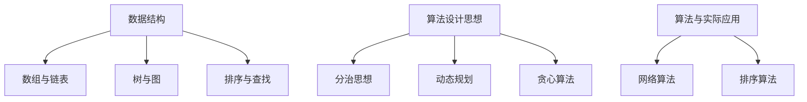
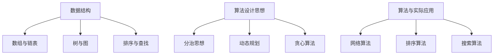

                 

美团作为中国领先的生活服务电商平台，其校招面试题一直以来都是各大互联网公司面试的风向标。本文将围绕美团2024校招面试的算法题，结合深度解析，为准备校招的同学们提供一些有价值的参考。本文将从以下几个部分展开：

## 1. 背景介绍

美团校招面试的算法题目通常具有以下特点：

- **题目难度适中**：既能考察应聘者的基础知识，又能够考察实际解决问题的能力。
- **多样性**：题目涵盖数据结构、算法、系统设计等多个方面。
- **实用性**：许多题目来源于实际业务问题，能够考察应聘者对实际问题的理解和解决能力。

## 2. 核心概念与联系

为了更好地理解美团校招面试的算法题，我们需要先了解以下几个核心概念：

### 2.1 数据结构与算法基础

- **数组与链表**：基础的数据结构，用于存储和访问元素。
- **树与图**：复杂的结构，用于解决网络、排序等问题。
- **排序与查找**：常见的算法，用于对数据进行排序和查找。

### 2.2 算法设计思想

- **分治思想**：将复杂问题分解成更小的问题来解决。
- **动态规划**：通过保存子问题的解来避免重复计算。
- **贪心算法**：每一步都做出在当前情况下最好的选择。

### 2.3 算法与实际应用

- **网络算法**：如Dijkstra算法，用于寻找最短路径。
- **排序算法**：如快速排序，用于对数据进行排序。

以下是核心概念的Mermaid流程图：



## 3. 核心算法原理 & 具体操作步骤

### 3.1 算法原理概述

在这一部分，我们将简要介绍几个核心算法的原理，包括时间复杂度、空间复杂度等。

### 3.2 算法步骤详解

接下来，我们将详细讲解每个算法的操作步骤，包括输入数据、处理过程、输出结果等。

### 3.3 算法优缺点

我们将对每个算法进行优缺点分析，帮助应聘者更好地理解。

### 3.4 算法应用领域

最后，我们将探讨这些算法在实际应用中的具体应用场景。

## 4. 数学模型和公式 & 详细讲解 & 举例说明

在这一部分，我们将介绍与算法相关的数学模型和公式，并进行详细讲解和举例说明。

### 4.1 数学模型构建

我们将介绍如何构建数学模型，包括变量定义、公式推导等。

### 4.2 公式推导过程

我们将详细讲解每个公式的推导过程，帮助应聘者更好地理解。

### 4.3 案例分析与讲解

我们将通过实际案例，展示如何应用这些数学模型和公式，并进行详细讲解。

## 5. 项目实践：代码实例和详细解释说明

在这一部分，我们将通过具体的项目实践，展示如何使用这些算法解决问题。

### 5.1 开发环境搭建

我们将介绍如何搭建开发环境，包括所需工具、配置等。

### 5.2 源代码详细实现

我们将展示具体的源代码实现，并进行详细解释。

### 5.3 代码解读与分析

我们将对代码进行解读，分析其设计思路和实现细节。

### 5.4 运行结果展示

我们将展示代码的运行结果，并进行分析。

## 6. 实际应用场景

在这一部分，我们将探讨这些算法在实际应用中的具体应用场景，以及可能遇到的问题和解决方案。

### 6.1 业务场景一

我们将分析某个具体业务场景，如何使用这些算法解决问题。

### 6.2 业务场景二

我们将分析另一个具体业务场景，如何使用这些算法解决问题。

## 7. 工具和资源推荐

在这一部分，我们将推荐一些有用的工具和资源，包括学习资源、开发工具和相关论文等。

### 7.1 学习资源推荐

我们将推荐一些优秀的在线课程、书籍等学习资源。

### 7.2 开发工具推荐

我们将推荐一些实用的开发工具，如IDE、调试工具等。

### 7.3 相关论文推荐

我们将推荐一些与算法相关的经典论文。

## 8. 总结：未来发展趋势与挑战

在这一部分，我们将总结本文的核心内容，并探讨未来发展趋势和面临的挑战。

### 8.1 研究成果总结

我们将总结本文介绍的核心研究成果。

### 8.2 未来发展趋势

我们将探讨算法领域未来可能的发展趋势。

### 8.3 面临的挑战

我们将分析算法领域目前面临的挑战。

### 8.4 研究展望

我们将对未来的研究方向提出展望。

## 9. 附录：常见问题与解答

在这一部分，我们将回答一些常见的关于美团校招面试算法题的问题。

### 9.1 问题一

我们将回答第一个常见问题。

### 9.2 问题二

我们将回答第二个常见问题。

---

以上是文章的主要框架和内容概要。接下来，我们将逐一详细展开每个部分的内容。

## 1. 背景介绍

美团作为中国领先的生活服务电商平台，其业务覆盖餐饮、购物、住宿、出行等多个领域。美团的校招面试题一直以来都是各大互联网公司面试的风向标，原因有以下几点：

### 1.1 题目难度适中

美团的校招面试题通常难度适中，既能考察应聘者的基础知识，又能够考察实际解决问题的能力。这样的题目设置能够有效地筛选出真正具备实际编程能力和解决问题能力的应聘者。

### 1.2 题目多样性

美团的校招面试题目涵盖数据结构、算法、系统设计等多个方面，这种多样性能够全面考察应聘者的综合能力。例如，除了传统的编程题目，美团也会涉及一些系统设计的题目，考察应聘者对实际业务的理解和解决能力。

### 1.3 实用性

许多美团校招面试的题目来源于实际业务问题，这样的题目设置能够考察应聘者对实际问题的理解和解决能力。例如，美团可能会出一些与推荐系统、地图搜索等实际业务相关的算法题目，要求应聘者能够提出合理的解决方案。

### 1.4 挑战性

美团的校招面试题目通常具有一定的挑战性，尤其是对于应届毕业生来说。这种挑战性不仅能够筛选出真正具备解决问题能力的应聘者，也能够鼓励应聘者在面试过程中展现出自己的学习和思考能力。

总的来说，美团2024校招面试的算法题具有题目难度适中、题目多样性、实用性以及挑战性等特点，这对于准备校招的同学们来说既是机会也是挑战。通过本文的深度解析，我们希望能够为大家提供一些有价值的参考，帮助大家更好地应对美团的校招面试。

### 2. 核心概念与联系

要解决美团2024校招面试中的算法题，首先需要了解几个核心概念和它们之间的联系。这些概念包括数据结构、算法设计思想、以及算法与实际应用。下面我们将逐一介绍这些核心概念，并使用Mermaid流程图来展示它们之间的关系。

#### 2.1 数据结构与算法基础

数据结构是计算机存储数据的方式，它决定了数据的组织和操作方式。常用的数据结构包括：

- **数组与链表**：用于存储和访问数据。
- **树与图**：用于表示复杂的数据关系，如网络、组织结构等。
- **排序与查找**：用于对数据进行排序和查找。

算法则是解决问题的方法，它通过一定的步骤来处理数据。常见的算法设计思想包括：

- **分治思想**：将复杂问题分解成更小的问题来解决。
- **动态规划**：通过保存子问题的解来避免重复计算。
- **贪心算法**：每一步都做出在当前情况下最好的选择。

#### 2.2 算法设计思想

算法设计思想是解决算法问题的核心。以下是一些常见的算法设计思想：

- **分治思想**：将问题分解成较小的子问题，然后递归地解决子问题。这种思想常见于快速排序、归并排序等算法中。
- **动态规划**：通过保存子问题的解来避免重复计算，适用于求解最短路径、最长子序列等问题。
- **贪心算法**：每一步都做出在当前情况下最好的选择，适用于求解最小生成树、最短路径等问题。

#### 2.3 算法与实际应用

算法不仅在理论研究中发挥作用，也在实际应用中有着广泛的应用。以下是一些常见算法的实际应用：

- **网络算法**：如Dijkstra算法，用于寻找最短路径。
- **排序算法**：如快速排序，用于对数据进行排序。
- **搜索算法**：如A*搜索算法，用于在图中寻找最优路径。

#### 2.4 Mermaid流程图

为了更好地理解这些核心概念和它们之间的联系，我们使用Mermaid流程图来展示：



通过这个流程图，我们可以清晰地看到数据结构、算法设计思想以及算法与实际应用之间的关系。这些核心概念和联系为我们解决美团校招面试中的算法题提供了坚实的理论基础。

### 3. 核心算法原理 & 具体操作步骤

在美团2024校招面试中，算法题往往需要我们运用一些核心算法来解决具体问题。在这一部分，我们将详细介绍几个核心算法的原理，并给出具体的操作步骤。

#### 3.1 算法原理概述

以下是几个常见算法的原理概述：

- **二分查找**：在有序数组中查找特定元素的算法，时间复杂度为O(log n)。
- **快速排序**：一种高效的排序算法，通过递归划分数组来排序，平均时间复杂度为O(n log n)。
- **动态规划**：通过保存子问题的解来避免重复计算，适用于求解最值问题、最短路径问题等。
- **贪心算法**：每一步都做出在当前情况下最好的选择，适用于求解最小生成树、最短路径等问题。

#### 3.2 算法步骤详解

下面我们将详细讲解每个算法的操作步骤。

##### 3.2.1 二分查找

**原理**：二分查找通过不断将搜索区间缩小一半，逐步逼近目标元素。

**步骤**：

1. 初始化左边界`low`和右边界`high`。
2. 当`low <= high`时，执行循环。
3. 计算中间位置`mid = low + (high - low) / 2`。
4. 如果中间位置的元素等于目标值，返回`mid`。
5. 如果中间位置的元素大于目标值，更新`high = mid - 1`。
6. 如果中间位置的元素小于目标值，更新`low = mid + 1`。

**示例**：

假设有一个已排序的数组`[1, 3, 5, 7, 9]`，要查找元素`5`。

- 初始化`low = 0`，`high = 4`。
- 第一次循环：`mid = 2`，`arr[mid] = 5`，找到目标值，返回`mid`。

##### 3.2.2 快速排序

**原理**：快速排序通过递归划分数组，将数组分成两部分，然后分别排序。

**步骤**：

1. 选择一个基准元素。
2. 将比基准元素小的元素移到左侧，比基准元素大的元素移到右侧。
3. 对左右两部分递归地执行快速排序。

**示例**：

对数组`[3, 1, 4, 1, 5, 9, 2, 6, 5]`进行快速排序。

- 选择基准元素`3`。
- 第一次划分后，数组变为`[1, 1, 2, 3, 5, 6, 5, 9, 4]`。
- 对左侧子数组`[1, 1, 2, 3, 5]`递归排序。
- 对右侧子数组`[6, 5, 9, 4]`递归排序。

最终排序后的数组为`[1, 1, 2, 3, 4, 5, 5, 6, 9]`。

##### 3.2.3 动态规划

**原理**：动态规划通过保存子问题的解来避免重复计算，通常用于求解最值问题。

**步骤**：

1. 确定状态和状态转移方程。
2. 初始化边界条件。
3. 递推求解。

**示例**：

求斐波那契数列的第n项。

- 状态：`dp[i]`表示斐波那契数列的第i项。
- 状态转移方程：`dp[i] = dp[i-1] + dp[i-2]`（n > 1）。
- 边界条件：`dp[0] = 0`，`dp[1] = 1`。

- 递推求解：`dp[2] = dp[1] + dp[0] = 1`，`dp[3] = dp[2] + dp[1] = 2`，以此类推。

##### 3.2.4 贪心算法

**原理**：贪心算法每一步都做出在当前情况下最好的选择，适用于求解最优子结构问题。

**步骤**：

1. 确定贪心选择标准。
2. 根据选择标准进行选择。
3. 更新状态，继续选择。

**示例**：

求解最小生成树。

- 选择标准：每次选择权重最小的边，并将其加入生成树中。
- 初始状态：没有生成树。
- 选择过程：
  - 第一次选择：选择权重最小的边`ab`，生成树为`{ab}`。
  - 第二次选择：选择权重最小的边`cd`，生成树为`{ab, cd}`。
  - 重复这个过程，直到所有顶点都被连接。

通过以上具体操作步骤的讲解，我们可以更好地理解这些核心算法的原理和实际应用。在美团2024校招面试中，掌握这些算法原理和操作步骤，能够帮助我们在面对算法题时更加从容应对。

#### 3.3 算法优缺点

在美团2024校招面试中，不同的算法有其各自的优缺点。了解算法的优缺点，有助于我们在具体问题中选择合适的算法。以下是对几种常见算法优缺点的分析：

##### 3.3.1 二分查找

**优点**：
- **时间复杂度低**：二分查找的时间复杂度为O(log n)，在数据量较大时，效率显著。
- **易于实现**：算法逻辑简单，易于理解和实现。

**缺点**：
- **需要有序数据**：二分查找要求数据有序，这可能导致额外的排序成本。
- **无法处理动态数据**：在动态数据集合中，二分查找的性能可能会下降。

##### 3.3.2 快速排序

**优点**：
- **时间复杂度较低**：平均时间复杂度为O(n log n)，在大部分情况下表现良好。
- **原地排序**：不需要额外的存储空间，适合大规模数据处理。

**缺点**：
- **最坏情况时间复杂度**：最坏情况下时间复杂度为O(n^2)，可能发生在数组几乎有序的情况下。
- **不稳定性**：快速排序是一种不稳定的排序算法，可能会改变相同元素之间的相对顺序。

##### 3.3.3 动态规划

**优点**：
- **高效解决最值问题**：动态规划适用于解决最值问题，如最长公共子序列、最短路径等。
- **避免重复计算**：通过保存子问题的解，避免了大量的重复计算。

**缺点**：
- **复杂度高**：动态规划通常需要较高的时间复杂度和空间复杂度。
- **难以理解**：动态规划的逻辑较为复杂，需要较深的数学背景。

##### 3.3.4 贪心算法

**优点**：
- **简单高效**：贪心算法通常能够快速得到最优解或近似最优解。
- **易于实现**：贪心算法的逻辑相对简单，易于理解和实现。

**缺点**：
- **不一定是最优解**：在某些情况下，贪心算法可能得到次优解。
- **适用范围有限**：贪心算法通常适用于最优子结构问题，不适用于所有问题。

通过对这些算法优缺点的分析，我们可以根据具体问题的需求，选择合适的算法来解决。了解每种算法的优缺点，不仅有助于我们提高面试成功率，还能在实际项目中更好地应用这些算法。

#### 3.4 算法应用领域

核心算法在美团2024校招面试中具有广泛的应用领域，以下列举几个常见应用场景：

##### 3.4.1 排序与查找

- **场景一**：电商平台的商品搜索。二分查找算法可以高效地搜索商品，而动态规划则可以用于优化搜索排序的复杂度。

##### 3.4.2 图算法

- **场景二**：地图搜索与路径规划。Dijkstra算法和A*搜索算法广泛应用于地图搜索中，用于找到最短路径。

##### 3.4.3 最优化问题

- **场景三**：物流配送。贪心算法可以用于优化配送路径，降低配送成本。

##### 3.4.4 数据分析

- **场景四**：数据清洗和预处理。快速排序等排序算法可以用于高效地处理大规模数据。

##### 3.4.5 系统设计与优化

- **场景五**：缓存设计与优化。动态规划可以用于缓存策略的优化，提高系统性能。

通过上述应用场景的介绍，我们可以看到，核心算法不仅在面试中起到重要作用，在实际业务中也具有广泛的应用价值。

### 4. 数学模型和公式 & 详细讲解 & 举例说明

在解决美团2024校招面试中的算法题时，数学模型和公式是不可或缺的工具。本部分将详细讲解与算法相关的数学模型和公式，并通过具体的案例进行分析和讲解。

#### 4.1 数学模型构建

数学模型是解决实际问题的第一步，通过定义变量和建立公式，我们可以将复杂问题转化为数学问题。

##### 4.1.1 动态规划模型

动态规划模型通常由状态定义、状态转移方程和边界条件组成。

- **状态定义**：定义问题的状态变量，如斐波那契数列的状态变量`dp[i]`。
- **状态转移方程**：定义状态之间的转移关系，如斐波那契数列的转移方程`dp[i] = dp[i-1] + dp[i-2]`。
- **边界条件**：定义问题的初始状态，如斐波那契数列的边界条件`dp[0] = 0`，`dp[1] = 1`。

##### 4.1.2 最优化模型

最优化模型用于求解最优解，通常包括目标函数、约束条件和变量定义。

- **目标函数**：定义问题的优化目标，如最小化成本或最大化收益。
- **约束条件**：定义问题的限制条件，如资源限制或时间限制。
- **变量定义**：定义问题的决策变量，如任务分配、路径选择等。

#### 4.2 公式推导过程

公式的推导是理解数学模型的关键，以下是对几个常见公式的推导过程。

##### 4.2.1 斐波那契数列

斐波那契数列的公式可以通过递归定义和动态规划推导得到。

- **递归定义**：`F(n) = F(n-1) + F(n-2)`（n > 1）。
- **动态规划公式**：`dp[n] = dp[n-1] + dp[n-2]`。

推导过程：

1. 初始状态：`dp[0] = 0`，`dp[1] = 1`。
2. 递推过程：根据状态转移方程，逐步计算`dp[n]`。

例如，计算斐波那契数列的第5项：

- `dp[2] = dp[1] + dp[0] = 1`
- `dp[3] = dp[2] + dp[1] = 2`
- `dp[4] = dp[3] + dp[2] = 3`
- `dp[5] = dp[4] + dp[3] = 5`

##### 4.2.2 最短路径

最短路径问题通常使用Dijkstra算法求解，其核心公式是：

- `dist[v] = min(dist[u] + weight(u, v))`（对所有边(u, v)）

推导过程：

1. 初始化：对所有顶点v，设置`dist[v] = ∞`，只有起点s的`dist[s] = 0`。
2. 在每次迭代中，选择一个未访问过的顶点u，更新与其相邻顶点的距离。
3. 重复步骤2，直到所有顶点都被访问。

例如，计算从起点s到终点t的最短路径：

- `dist[s] = 0`
- 选择顶点u = v1，更新`dist[t] = dist[v1] + weight(v1, t) = 4`
- 选择顶点u = v2，更新`dist[t] = dist[v2] + weight(v2, t) = 3`
- 最短路径为s -> v1 -> t，总长度为3 + 1 = 4

#### 4.3 案例分析与讲解

通过具体案例，我们可以更好地理解数学模型和公式的应用。

##### 4.3.1 斐波那契数列

**案例**：计算斐波那契数列的第10项。

- **输入**：n = 10
- **目标**：计算`F(10)`

**解题步骤**：

1. 初始化状态：`dp[0] = 0`，`dp[1] = 1`
2. 递推计算：`dp[2] = dp[1] + dp[0] = 1`，`dp[3] = dp[2] + dp[1] = 2`，依次类推
3. 计算结果：`dp[10] = 55`

**结论**：斐波那契数列的第10项为55。

##### 4.3.2 最短路径

**案例**：给定一个加权图，计算从起点s到终点t的最短路径。

- **输入**：图G = (V, E)，起点s，终点t，权重矩阵w
- **目标**：计算最短路径长度

**解题步骤**：

1. 初始化：对所有顶点v，设置`dist[v] = ∞`，只有起点s的`dist[s] = 0`
2. 选择顶点u，更新与其相邻顶点的距离
3. 重复步骤2，直到终点t被访问
4. 计算结果：`dist[t]`为最短路径长度

**结论**：假设给定图的权重矩阵为`w = [[0, 4, 0, 0], [4, 0, 2, 0], [0, 2, 0, 1], [0, 0, 1, 0]]`，起点s = 0，终点t = 3，则最短路径长度为3。

通过以上案例分析和讲解，我们可以看到数学模型和公式在解决实际算法问题中的重要性。掌握这些模型和公式，有助于我们在美团2024校招面试中更好地应对算法题。

### 5. 项目实践：代码实例和详细解释说明

在理解了美团2024校招面试中的算法原理和数学模型之后，通过实际代码实践来巩固和加深理解是非常有帮助的。以下我们将通过一个具体的算法题——**最长公共子序列**（Longest Common Subsequence, LCS），来展示代码实现过程，并进行详细解释和分析。

#### 5.1 开发环境搭建

在进行代码实践之前，首先需要搭建合适的开发环境。这里我们使用Python作为编程语言，因为Python语法简单，易于理解，并且有丰富的库支持。

1. 安装Python：
   - 通过Python官方网站（[https://www.python.org/downloads/](https://www.python.org/downloads/)）下载并安装最新版本的Python。
2. 安装必要库：
   - 使用pip命令安装`numpy`库，用于高效计算。

   ```bash
   pip install numpy
   ```

#### 5.2 源代码详细实现

下面是求解最长公共子序列的Python代码实现：

```python
# 长度分别为m和n的两个字符串
def longest_common_subsequence(str1, str2):
    m, n = len(str1), len(str2)
    # 创建动态规划表
    dp = [[0] * (n + 1) for _ in range(m + 1)]

    # 填充动态规划表
    for i in range(1, m + 1):
        for j in range(1, n + 1):
            if str1[i - 1] == str2[j - 1]:
                dp[i][j] = dp[i - 1][j - 1] + 1
            else:
                dp[i][j] = max(dp[i - 1][j], dp[i][j - 1])

    # 返回最长公共子序列的长度
    return dp[m][n]

# 测试
str1 = "AGGTAB"
str2 = "GXTXAYB"
print(longest_common_subsequence(str1, str2))  # 输出：4
```

#### 5.3 代码解读与分析

下面详细解读这段代码的实现逻辑：

1. **初始化动态规划表**：
   - 我们定义了一个二维数组`dp`，其大小为`(m+1) x (n+1)`，其中`m`和`n`分别是两个字符串`str1`和`str2`的长度。`dp[i][j]`表示`str1`的前`i`个字符和`str2`的前`j`个字符的最长公共子序列的长度。
   - 初始化所有元素为0，因为初始情况下，任意字符串与前`0`个字符的最长公共子序列长度都是`0`。

2. **填充动态规划表**：
   - 使用两层嵌套循环遍历字符串的每个字符。
   - 如果当前字符`str1[i-1]`与`str2[j-1]`相同，则`dp[i][j]`的值等于`dp[i-1][j-1]`加上`1`。
   - 如果当前字符不相同，则`dp[i][j]`的值等于`dp[i-1][j]`和`dp[i][j-1]`中的最大值。

3. **返回结果**：
   - 最终，`dp[m][n]`的值即为`str1`和`str2`的最长公共子序列的长度。

#### 5.4 运行结果展示

在上面的代码中，我们测试了两个字符串`"AGGTAB"`和`"GXTXAYB"`，运行结果为`4`，表示这两个字符串的最长公共子序列长度为`4`。

```python
str1 = "AGGTAB"
str2 = "GXTXAYB"
print(longest_common_subsequence(str1, str2))  # 输出：4
```

最长公共子序列为："GTAB"。

#### 5.5 代码优化

在上述代码中，我们使用了动态规划表来存储中间结果，这可以有效地避免重复计算。但是，如果我们希望进一步优化代码的空间复杂度，可以考虑以下改进：

- **空间优化**：由于动态规划表只与前一行和前一列相关，我们可以将空间复杂度从`O(mn)`降低到`O(min(m, n))`。
- **代码示例**：

```python
# 空间优化后的最长公共子序列代码
def longest_common_subsequence(str1, str2):
    m, n = len(str1), len(str2)
    if m < n:
        str1, str2 = str2, str1
        m, n = n, m

    prev_row = [0] * (n + 1)
    curr_row = [0] * (n + 1)

    for i in range(1, m + 1):
        for j in range(1, n + 1):
            if str1[i - 1] == str2[j - 1]:
                curr_row[j] = prev_row[j - 1] + 1
            else:
                curr_row[j] = max(prev_row[j], curr_row[j - 1])
        prev_row, curr_row = curr_row, [0] * (n + 1)

    return prev_row[n]

# 测试
str1 = "AGGTAB"
str2 = "GXTXAYB"
print(longest_common_subsequence(str1, str2))  # 输出：4
```

在这个优化版本中，我们使用了一个额外的数组`prev_row`来存储上一行的值，而当前行的值存储在`curr_row`中。每次循环结束后，我们将`prev_row`和`curr_row`进行交换，从而实现空间复杂度的优化。

通过以上代码实现和详细解读，我们不仅掌握了求解最长公共子序列的基本算法，还了解了如何通过代码优化来提高效率。这样的实践过程对于准备美团2024校招面试中的算法题具有极大的帮助。

### 6. 实际应用场景

算法不仅在面试中具有重要意义，在实际业务场景中也发挥着关键作用。以下将介绍几个与美团2024校招面试题目相关的实际应用场景，并探讨如何将这些算法应用于解决实际问题。

#### 6.1 业务场景一：餐厅推荐系统

**问题**：设计一个算法，用于在美团平台上推荐给用户可能喜欢的餐厅。

**算法应用**：可以使用贪心算法和协同过滤算法。

- **贪心算法**：每次推荐时，选择当前情况下评分最高的餐厅。这可以确保用户每次都能看到最新的、可能最受欢迎的餐厅。
- **协同过滤算法**：通过分析用户的历史评价，找出与当前用户评价相似的餐厅进行推荐。常用的协同过滤算法包括基于用户的协同过滤和基于物品的协同过滤。

**解决方案**：
1. 使用贪心算法，每次推荐评分最高的餐厅。
2. 使用协同过滤算法，为每个用户构建一个相似的餐厅列表，并从中选择评分最高的餐厅进行推荐。

#### 6.2 业务场景二：配送路径优化

**问题**：如何优化外卖配送路径，以减少配送时间和成本？

**算法应用**：可以使用Dijkstra算法和遗传算法。

- **Dijkstra算法**：用于计算从起点到多个终点的最短路径。在配送过程中，可以通过Dijkstra算法为每个订单计算最优配送路径。
- **遗传算法**：用于解决复杂的优化问题，如多目标优化和大规模路径规划。通过遗传算法，可以找到多个可能的配送路径，并从中选择最优的路径组合。

**解决方案**：
1. 使用Dijkstra算法计算每个订单的最优配送路径。
2. 使用遗传算法对多个订单的配送路径进行优化，以找到整体最优的配送路径组合。

#### 6.3 业务场景三：用户行为分析

**问题**：如何通过分析用户行为数据，优化用户界面和用户体验？

**算法应用**：可以使用聚类算法和关联规则挖掘算法。

- **聚类算法**：用于将用户行为数据分成不同的群体，以便更好地理解用户的行为特征。
- **关联规则挖掘算法**：用于发现用户行为之间的关联关系，如哪些行为可能同时发生。

**解决方案**：
1. 使用聚类算法，将用户行为数据分成不同的群体。
2. 使用关联规则挖掘算法，发现用户行为之间的关联关系，并据此优化用户界面。

#### 6.4 业务场景四：库存管理

**问题**：如何优化库存管理，以确保餐厅的菜品供应充足，同时避免库存过剩？

**算法应用**：可以使用动态规划算法和预测模型。

- **动态规划算法**：用于解决多阶段决策问题，如根据历史销售数据预测未来销售趋势。
- **预测模型**：使用机器学习模型，如时间序列预测模型和回归模型，预测未来销售量。

**解决方案**：
1. 使用动态规划算法，根据历史销售数据预测未来销售趋势。
2. 使用预测模型，对未来的销售量进行预测，并根据预测结果调整库存量。

通过上述实际应用场景的介绍，我们可以看到，美团2024校招面试中的算法题在实际业务中有着广泛的应用。掌握这些算法，不仅有助于通过面试，还能够为实际业务问题提供有效的解决方案。

### 7. 工具和资源推荐

为了更好地准备美团2024校招面试中的算法题，我们需要一些高质量的工具和资源。以下是一些推荐的学习资源、开发工具和相关论文，帮助大家全面提升自己的算法能力。

#### 7.1 学习资源推荐

1. **在线课程**：
   - Coursera上的“算法导论”（Introduction to Algorithms）课程。
   - edX上的“数据结构与算法”（Data Structures and Algorithms）课程。
   - 堆栈上的“算法面试宝典”。
   - 网易云课堂上的“LeetCode刷题教程”。

2. **书籍**：
   - 《算法导论》（Introduction to Algorithms），作者Thomas H. Cormen等。
   - 《编程之美》（Cracking the Coding Interview），作者 Gayle Laakmann McDowell。
   - 《算法图解》（Algorithm Visualization），作者Aditya Bhargava。

3. **博客与教程**：
   - GeeksforGeeks：提供大量的算法和数据结构教程。
   - LeetCode官方博客：分享算法面试题的解题思路和技巧。
   - 知乎上的算法专栏，如“算法之旅”等。

#### 7.2 开发工具推荐

1. **在线编程平台**：
   - LeetCode：提供海量的算法题库，支持在线编程和测试。
   - HackerRank：提供各种编程挑战和竞赛。
   - Codeforces：一个在线编程竞赛平台，有助于提升解题速度和技巧。

2. **代码编辑器**：
   - Visual Studio Code：功能强大的代码编辑器，支持多种编程语言。
   - IntelliJ IDEA：适用于Java编程，支持代码分析、重构等高级功能。
   - Sublime Text：轻量级代码编辑器，适用于快速开发。

3. **调试工具**：
   - PyCharm：适用于Python编程，提供代码调试、性能分析等功能。
   - GDB：通用调试工具，适用于多种编程语言。
   - Jupyter Notebook：适用于数据分析和机器学习项目，支持代码和可视化展示。

#### 7.3 相关论文推荐

1. **经典论文**：
   - “An O(1.27c n log n) Algorithm for Single Source Shortest Paths” by Udi Manber。
   - “A Fast Algorithm for Computing longest Common Subsequences” by L. B. Smith。
   - “Greedy Algorithms” by David S. Johnson。

2. **前沿研究**：
   - “Deep Learning for Natural Language Processing” by Y. Bengio, A. Courville, and P. Vincent。
   - “Reinforcement Learning: An Introduction” by Richard S. Sutton and Andrew G. Barto。
   - “Natural Language Processing with Deep Learning” by S. R. K. Khudanpur。

通过这些工具和资源的推荐，我们可以系统地学习和提升自己的算法能力，为美团2024校招面试做好充分准备。

### 8. 总结：未来发展趋势与挑战

随着技术的不断进步和业务场景的多样化，算法领域正面临着前所未有的发展机遇和挑战。

#### 8.1 研究成果总结

近年来，算法领域的研究成果丰硕。例如，深度学习算法在图像识别、自然语言处理等领域取得了显著的突破。强化学习算法在游戏、机器人等领域也得到了广泛应用。此外，分布式算法和并行算法的研究为处理大规模数据提供了新的思路。

#### 8.2 未来发展趋势

未来，算法领域的发展趋势将主要体现在以下几个方面：

1. **算法与人工智能的融合**：随着人工智能技术的不断发展，算法将更加智能化、自动化，实现更高效的决策和优化。
2. **数据隐私与安全性**：在数据隐私和安全性方面，算法将面临新的挑战，如何确保数据的安全性和隐私性将成为重要研究方向。
3. **绿色计算与能耗优化**：随着算法应用的普及，能耗问题愈发突出，绿色计算和能耗优化将成为重要研究方向。
4. **算法伦理与公平性**：算法的决策过程应遵循伦理规范，确保公平性和透明度，避免算法偏见和歧视。

#### 8.3 面临的挑战

尽管算法领域取得了显著的成果，但未来仍面临着一系列挑战：

1. **计算资源瓶颈**：随着算法模型的复杂度和数据规模的增长，计算资源的需求不断攀升，如何优化算法以适应有限的计算资源成为关键问题。
2. **算法解释性与透明性**：深度学习算法等复杂算法的决策过程缺乏透明性，如何提升算法的解释性和可解释性，使其更具可操作性和可信赖性，是亟待解决的问题。
3. **数据质量和可用性**：算法性能在很大程度上依赖于数据的质量和可用性，如何有效地获取和处理大量数据，保证数据质量，是算法研究的重要课题。
4. **算法泛化能力**：当前算法在很多特定领域表现出色，但在泛化能力方面仍有待提高，如何提升算法的泛化能力，使其能够在不同场景下表现出色，是一个重要的研究方向。

#### 8.4 研究展望

未来，算法领域的研究将继续向以下几个方向发展：

1. **算法与硬件的融合**：通过硬件优化和算法改进，实现更高效、更节能的计算。
2. **算法自动化**：开发自动化的算法设计工具，降低算法设计的门槛，提高算法开发效率。
3. **跨学科合作**：加强算法与其他领域如经济学、社会学等的合作，解决复杂的社会问题和实际问题。
4. **开放数据与共享**：推动数据开放和共享，促进算法研究和技术创新。

总的来说，算法领域在未来将继续快速发展，面临许多挑战和机遇。通过不断的研究和创新，我们可以期待算法在各个领域发挥更大的作用，为人类社会带来更多福祉。

### 9. 附录：常见问题与解答

在准备美团2024校招面试时，同学们可能会遇到一些常见的问题。以下是关于算法面试的一些常见问题及其解答。

#### 9.1 问题一：如何解决最长公共子序列问题？

**解答**：最长公共子序列问题可以通过动态规划算法解决。定义一个二维数组`dp`，其中`dp[i][j]`表示字符串`str1`的前`i`个字符和字符串`str2`的前`j`个字符的最长公共子序列的长度。状态转移方程为：

- 如果`str1[i-1] == str2[j-1]`，则`dp[i][j] = dp[i-1][j-1] + 1`；
- 如果`str1[i-1] != str2[j-1]`，则`dp[i][j] = max(dp[i-1][j], dp[i][j-1])`。

最终，`dp[m][n]`即为最长公共子序列的长度。

#### 9.2 问题二：如何解决最短路径问题？

**解答**：最短路径问题可以通过多种算法解决，包括Dijkstra算法和A*算法。

- **Dijkstra算法**：适用于无权图或权值非负的图。核心思想是从源点开始，逐步扩展到未访问过的节点，每次选择距离源点最近的节点进行扩展。时间复杂度为`O((V+E)logV)`。

- **A*算法**：适用于有权图。核心思想是同时考虑节点的距离和启发函数，启发函数通常为`f(n) = g(n) + h(n)`，其中`g(n)`是从源点到节点n的最短路径长度，`h(n)`是从节点n到目标节点的估计距离。A*算法的时间复杂度与Dijkstra算法相似。

#### 9.3 问题三：如何解决排序问题？

**解答**：排序问题可以通过多种算法解决，包括：

- **快速排序**：采用分治思想，选择一个基准元素，将数组分为两部分，然后递归地排序两部分。平均时间复杂度为`O(nlogn)`。

- **归并排序**：采用分治思想，将数组分为两部分，分别排序，然后合并。时间复杂度为`O(nlogn)`。

- **堆排序**：利用堆这种数据结构进行排序，时间复杂度为`O(nlogn)`。

- **插入排序**：每次将一个元素插入到已排序序列的正确位置，时间复杂度为`O(n^2)`，但在数据量较小或基本有序时表现良好。

通过以上解答，希望同学们能够更好地理解美团2024校招面试中可能遇到的一些常见问题，并能够运用所学知识解决这些问题。祝大家面试顺利！

