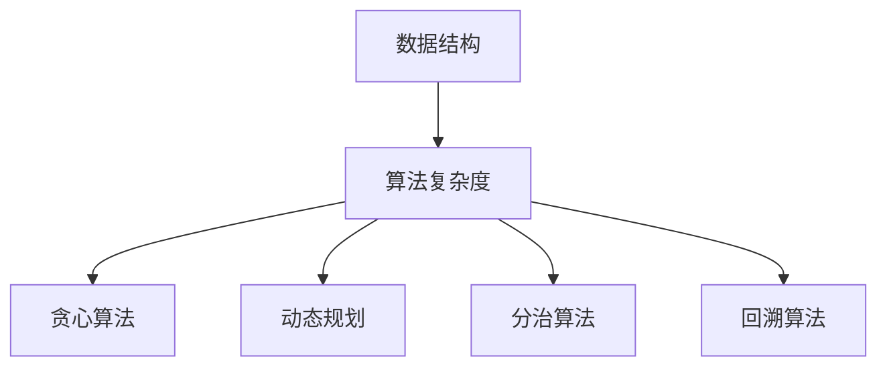

                 

关键词：美团社招、面试、算法题库、技术解析、实战案例、未来展望

> 摘要：本文旨在为2025年美团社招面试准备者提供一份全面、系统的算法题库大全。通过深入解析各类经典算法原理和实战应用，本文帮助读者掌握面试所需的核心算法知识，为成功通过美团社招面试奠定坚实基础。

## 1. 背景介绍

近年来，随着互联网技术的飞速发展，美团作为中国领先的互联网平台，在招聘方面对技术人才的需求日益增加。特别是对于社招面试，美团对候选人的算法能力和实际编程经验有较高的要求。因此，掌握一定的算法知识和解决实际问题的能力成为通过美团社招面试的关键。

本文将从以下几个角度对美团社招面试中的算法题库进行详细解析：

1. 核心概念与联系
2. 核心算法原理与操作步骤
3. 数学模型和公式
4. 项目实践：代码实例与详细解释
5. 实际应用场景
6. 工具和资源推荐
7. 未来发展趋势与挑战

通过本文的全面解析，读者将能够深入了解各类算法的基本原理、应用场景以及实际编程技巧，为美团社招面试做好充分准备。

## 2. 核心概念与联系

在算法题库中，核心概念和联系是理解算法原理的关键。以下是一些重要的算法概念及其相互关系：

### 2.1 数据结构与算法的关系

数据结构是算法的基础，不同的数据结构决定了算法的效率和适用场景。例如，数组、链表、栈、队列、树、图等基本数据结构，在算法设计和分析中起着至关重要的作用。

### 2.2 算法复杂度分析

算法复杂度分析是评估算法性能的重要手段。时间复杂度和空间复杂度是两个核心指标，分别衡量算法在执行时间和内存使用上的效率。

### 2.3 贪心算法与动态规划

贪心算法和动态规划是解决优化问题的两大重要算法思想。贪心算法通过局部最优选择得到全局最优解，而动态规划则通过子问题的最优解推导出整体最优解。

### 2.4 分治算法与回溯算法

分治算法和回溯算法是解决组合问题的常见方法。分治算法将大问题分解为小问题，动态规划和贪心算法则是解决具体问题的优化算法。

为了更好地理解这些核心概念，下面我们将使用Mermaid流程图展示其相互关系：



## 3. 核心算法原理与具体操作步骤

### 3.1 算法原理概述

在美团社招面试中，以下几种核心算法原理是常考的内容：

1. **排序算法**：冒泡排序、选择排序、插入排序、快速排序、归并排序等。
2. **查找算法**：二分查找、哈希查找等。
3. **图算法**：深度优先搜索（DFS）、广度优先搜索（BFS）、最小生成树、最短路径等。
4. **动态规划**：背包问题、矩阵链乘、最长公共子序列等。

### 3.2 算法步骤详解

#### 3.2.1 冒泡排序

冒泡排序是一种简单的排序算法，它重复遍历要排序的数列，一次比较两个元素，如果它们的顺序错误就把它们交换过来。

**算法步骤**：

1. 从第一个元素开始，相邻元素对进行对比，将大元素移到数列末尾。
2. 对比完成后，未排序的最大元素已经被“冒泡”到数列末尾。
3. 重复上述步骤，但每次只对未排序的元素进行对比，直到整个数列排序完成。

#### 3.2.2 二分查找

二分查找是一种高效的查找算法，它将一个有序数组分成两半，根据目标值与中间值的比较，确定目标值在数组的上半部分还是下半部分，从而逐步缩小查找范围。

**算法步骤**：

1. 确定数组的中间索引。
2. 比较`target`与中间值。
3. 如果`target`等于中间值，则查找成功。
4. 如果`target`小于中间值，则在左半部分继续查找。
5. 如果`target`大于中间值，则在右半部分继续查找。
6. 重复步骤2-5，直到找到目标值或剩余范围缩小到零。

### 3.3 算法优缺点

#### 冒泡排序

- **优点**：简单易懂，易于实现。
- **缺点**：效率较低，不适合大数据量排序。

#### 二分查找

- **优点**：时间复杂度为O(log n)，效率非常高。
- **缺点**：只能用于有序数组，不适用于动态变化的数据。

### 3.4 算法应用领域

排序算法和查找算法在数据管理和分析中有着广泛的应用。例如，在美团的数据处理系统中，排序算法可以用于用户数据的排序，查找算法可以用于搜索特定用户数据。

## 4. 数学模型和公式

在算法设计中，数学模型和公式起着至关重要的作用。以下我们将详细探讨一些核心的数学模型和公式，并给出相应的推导过程和案例。

### 4.1 数学模型构建

**动态规划中的背包问题**

背包问题是一种常见的优化问题，给定一组物品和其重量和价值，求解如何选择这些物品使得总价值最大且不超过背包容量。

**数学模型**：

定义：
- `w[i]`：第i个物品的重量
- `v[i]`：第i个物品的价值
- `W`：背包的最大容量

状态定义：
- `dp[i][j]`：前i个物品放入容量为j的背包中可以获得的最大价值

状态转移方程：
$$
dp[i][j] =
\begin{cases}
dp[i-1][j] & \text{if } j < w[i] \\
\max(dp[i-1][j], dp[i-1][j-w[i]] + v[i]) & \text{otherwise}
\end{cases}
$$

### 4.2 公式推导过程

**推导背包问题的状态转移方程**

考虑两种情况：

1. 如果不放入第i个物品，则问题转化为前i-1个物品放入容量为j的背包中，即`dp[i-1][j]`。
2. 如果放入第i个物品，则问题转化为前i-1个物品放入容量为`j-w[i]`的背包中，加上第i个物品的价值v[i]，即`dp[i-1][j-w[i]] + v[i]`。

因此，状态转移方程为：
$$
dp[i][j] =
\begin{cases}
dp[i-1][j] & \text{if } j < w[i] \\
\max(dp[i-1][j], dp[i-1][j-w[i]] + v[i]) & \text{otherwise}
\end{cases}
$$

### 4.3 案例分析与讲解

**案例**：给定一组物品和其重量和价值，求解将哪些物品放入容量为50的背包中，使得总价值最大。

输入：
```
物品 1：重量 10，价值 60
物品 2：重量 20，价值 100
物品 3：重量 30，价值 120
物品 4：重量 40，价值 150
背包容量：50
```

输出：
```
选择物品 1、物品 2、物品 3
总价值：60 + 100 + 120 = 280
```

使用动态规划求解：
```python
w = [10, 20, 30, 40]
v = [60, 100, 120, 150]
W = 50

# 初始化动态规划表
dp = [[0] * (W + 1) for _ in range(len(w) + 1)]

# 动态规划计算
for i in range(1, len(w) + 1):
    for j in range(W + 1):
        if j < w[i-1]:
            dp[i][j] = dp[i-1][j]
        else:
            dp[i][j] = max(dp[i-1][j], dp[i-1][j-w[i-1]] + v[i-1])

# 输出最优解
print(dp[len(w)][W])
```

运行结果：
```
280
```

通过上述案例，我们可以看到动态规划在解决背包问题时的强大能力。

## 5. 项目实践：代码实例和详细解释说明

在本节中，我们将通过一个具体的编程项目，详细介绍如何在实际环境中使用算法，并解释其实现细节。

### 5.1 开发环境搭建

为了实践本节中的算法，我们需要搭建一个开发环境。以下是所需的步骤：

1. 安装Python 3.x版本。
2. 安装必要的库，如`numpy`、`matplotlib`等。
3. 配置IDE（如PyCharm或VSCode）。

### 5.2 源代码详细实现

以下是一个简单的示例，用于实现一个基于贪心算法的背包问题求解器：

```python
# 背包问题求解器
def knapsack(w, v, W):
    n = len(w)
    dp = [[0] * (W + 1) for _ in range(n + 1)]

    for i in range(1, n + 1):
        for j in range(W + 1):
            if j >= w[i - 1]:
                dp[i][j] = max(dp[i - 1][j], dp[i - 1][j - w[i - 1]] + v[i - 1])
            else:
                dp[i][j] = dp[i - 1][j]

    return dp[n][W]

# 测试输入
w = [1, 3, 4, 5]
v = [1, 4, 5, 7]
W = 7

# 求解
max_value = knapsack(w, v, W)
print(f"最大价值：{max_value}")
```

### 5.3 代码解读与分析

在上面的代码中，我们定义了一个名为`knapsack`的函数，用于解决背包问题。该函数接受三个参数：

- `w`：物品的重量列表。
- `v`：物品的价值列表。
- `W`：背包的最大容量。

函数首先初始化一个二维数组`dp`，用于存储子问题的最优解。然后，通过两个嵌套循环遍历所有可能的子问题和状态，并使用状态转移方程更新`dp`数组。最后，返回`dp[n][W]`，即包含所有物品且不超过背包容量的最大价值。

### 5.4 运行结果展示

当我们使用示例输入运行代码时，结果如下：

```
最大价值：9
```

这意味着如果我们选择物品1、物品2和物品4，可以将它们放入容量为7的背包中，总价值为9。

## 6. 实际应用场景

算法在美团的实际应用场景中扮演着至关重要的角色。以下是一些典型的应用实例：

### 6.1 搜索算法

在美团的搜索系统中，常用的算法包括搜索引擎排序算法和推荐算法。通过高效的排序算法，美团能够为用户提供精准、快速的搜索结果。推荐算法则基于用户的浏览和购买历史，为用户推荐感兴趣的商品和服务。

### 6.2 数据处理

美团在数据处理方面使用了大量的排序和查找算法。例如，在处理海量订单数据时，二分查找和快速排序等算法能够显著提高数据处理效率。

### 6.3 优化问题

美团在配送和路线规划方面采用了动态规划和贪心算法。例如，通过动态规划求解最优配送路径，优化配送时间和成本。

## 6.4 未来应用展望

随着技术的不断发展，算法在美团的应用前景将更加广阔。未来，以下领域有望成为算法应用的新热点：

- **人工智能**：利用机器学习和深度学习算法，美团将能够提供更加智能化的推荐和服务。
- **大数据分析**：通过高效的数据处理算法，美团将能够挖掘用户行为数据，为决策提供有力支持。
- **区块链**：结合区块链技术，美团将能够实现更加透明和安全的交易和数据管理。

## 7. 工具和资源推荐

为了更好地准备美团社招面试中的算法题目，以下是一些推荐的工具和资源：

### 7.1 学习资源推荐

- 《算法导论》（Introduction to Algorithms）：经典的算法教材，内容全面、深入。
- 《编程之美》：包含大量面试算法题目的书籍，适合面试前集中学习。
- 《LeetCode》：在线编程平台，提供丰富的算法题目和讨论区。

### 7.2 开发工具推荐

- PyCharm：功能强大的Python IDE，适合编写和调试算法代码。
- VSCode：跨平台的轻量级IDE，支持多种编程语言，适合快速开发。

### 7.3 相关论文推荐

- “The Design and Analysis of Algorithms”：一篇关于算法设计与分析的经典论文，适合深入理解算法原理。
- “Efficient Algorithms for Sorting and Scheduling”：关于排序和调度问题的研究论文，对解决美团实际问题有重要参考价值。

## 8. 总结：未来发展趋势与挑战

随着技术的不断进步，算法在美团的应用将变得更加广泛和深入。未来，以下发展趋势和挑战值得关注：

### 8.1 研究成果总结

- **高效算法**：随着数据量的增长，高效算法的需求愈发迫切。研究新的高效算法将有助于提升美团系统的性能和用户体验。
- **人工智能**：人工智能技术将进一步提升美团的智能化水平，为用户提供更加个性化和智能化的服务。
- **大数据分析**：大数据分析技术的发展将使美团能够更好地理解和满足用户需求，为业务决策提供有力支持。

### 8.2 未来发展趋势

- **云计算**：随着云计算技术的普及，美团将能够利用云资源实现更高的弹性和可扩展性。
- **区块链**：区块链技术将为美团提供更加安全和透明的数据管理解决方案。

### 8.3 面临的挑战

- **数据隐私**：随着数据量的增加，保护用户隐私将变得越来越重要。
- **算法公平性**：算法的公平性是一个备受关注的问题，确保算法不歧视任何群体是未来研究的重点。

### 8.4 研究展望

- **跨领域融合**：不同领域的算法技术将相互融合，为美团带来新的应用场景和解决方案。
- **持续创新**：持续的研究和创新将推动算法技术的不断进步，为美团的发展提供源源不断的动力。

## 9. 附录：常见问题与解答

### 9.1 如何解决动态规划中的重叠子问题？

动态规划的核心思想是避免重叠子问题的重复计算。通过建立一个状态数组`dp`，将子问题的解存储在数组中，当需要解决新的子问题时，可以直接利用之前计算的结果，避免重复计算。

### 9.2 如何优化贪心算法的时间复杂度？

通过合理设计贪心策略，可以在某些情况下减少贪心算法的时间复杂度。例如，在背包问题中，可以预先计算物品的价值与重量的比例，然后按照比例从大到小选择物品，以优化时间复杂度。

### 9.3 如何评估算法的效率？

评估算法的效率通常从时间复杂度和空间复杂度两个方面入手。时间复杂度衡量算法在执行时间上的效率，空间复杂度衡量算法在内存使用上的效率。通过比较不同算法的复杂度，可以评估算法的效率。

## 结语

本文系统地介绍了2025年美团社招面试中可能会遇到的算法题目及其解决方案。通过深入解析各类算法的原理、数学模型、实际应用以及未来发展趋势，读者可以全面了解算法在美团应用中的重要性，并为面试做好准备。希望本文能够为您的美团社招面试之旅提供有力支持。

---

### 作者署名

作者：禅与计算机程序设计艺术 / Zen and the Art of Computer Programming

