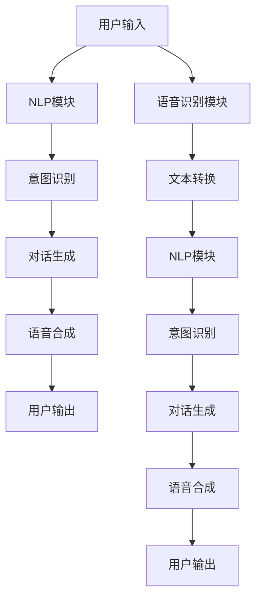

                 

随着人工智能技术的快速发展，聊天机器人逐渐成为我们生活中不可或缺的一部分。从最初简单的自动回复，到如今能够进行深度对话、甚至提供娱乐服务的智能虚拟伴侣，聊天机器人的功能和应用场景不断拓展。本文将探讨如何开发一款具有高度互动性和娱乐性的聊天机器人应用，旨在为用户提供一种全新的娱乐体验。

## 1. 背景介绍

聊天机器人娱乐应用的出现，源于人们对娱乐需求多样化和个性化的追求。传统的娱乐方式，如电影、游戏等，虽然能够提供丰富的内容，但在互动性方面存在一定局限性。而聊天机器人作为一种新兴的娱乐形式，不仅可以提供个性化的对话体验，还能根据用户的行为和喜好进行动态调整，从而提升用户的满意度。

此外，随着智能手机和移动互联网的普及，人们的生活节奏越来越快，碎片化的时间越来越多。聊天机器人娱乐应用恰好能够满足这种时间碎片化的需求，为用户提供一种便捷的娱乐方式。从商业角度来看，聊天机器人娱乐应用也是一个具有巨大市场潜力的领域，可以为企业带来新的收入来源。

## 2. 核心概念与联系

要开发一款聊天机器人娱乐应用，首先需要理解几个核心概念，包括自然语言处理（NLP）、机器学习、语音识别等。这些技术是构建聊天机器人的基础，也是实现高度互动性和娱乐性的关键。

### 2.1 自然语言处理（NLP）

自然语言处理是人工智能的一个重要分支，旨在使计算机能够理解和处理人类语言。在聊天机器人娱乐应用中，NLP 技术主要用于解析用户的输入信息，理解其意图，并生成适当的回复。

NLP 的核心技术包括分词、词性标注、句法分析、语义分析等。通过这些技术，聊天机器人可以识别用户输入的文本，将其拆分成有意义的词汇和短语，并理解其背后的含义。

### 2.2 机器学习

机器学习是构建聊天机器人娱乐应用的核心技术之一。通过机器学习，聊天机器人可以从大量数据中学习，不断优化自己的对话能力。常见的机器学习算法包括决策树、支持向量机、神经网络等。

在聊天机器人娱乐应用中，机器学习主要用于两个方面：一是训练模型，以实现对话生成；二是进行实时预测，以根据用户输入动态调整对话内容。

### 2.3 语音识别

语音识别是聊天机器人娱乐应用的重要组成部分。通过语音识别，用户可以使用语音与聊天机器人进行交互，从而提高使用体验。

语音识别技术主要包括语音信号的预处理、特征提取、模型训练和预测等步骤。在聊天机器人娱乐应用中，语音识别主要用于将用户输入的语音转换为文本，然后将其传递给 NLP 模块进行处理。

### 2.4 Mermaid 流程图

以下是一个简化的聊天机器人娱乐应用架构的 Mermaid 流程图，展示了核心概念之间的联系：



## 3. 核心算法原理 & 具体操作步骤

### 3.1 算法原理概述

聊天机器人娱乐应用的核心算法主要包括自然语言处理（NLP）、机器学习、语音识别等。这些算法相互协作，共同实现聊天机器人的功能。

- **NLP 算法**：用于解析用户输入，理解其意图，并生成适当的回复。
- **机器学习算法**：用于训练聊天机器人的对话模型，使其能够根据用户行为和喜好进行动态调整。
- **语音识别算法**：用于将用户输入的语音转换为文本，以便 NLP 模块进行处理。

### 3.2 算法步骤详解

1. **用户输入**：用户通过文本或语音与聊天机器人进行交互。
2. **语音识别**：如果用户输入语音，语音识别模块会将语音转换为文本。
3. **NLP 处理**：文本传递给 NLP 模块，进行分词、词性标注、句法分析等处理，以理解用户输入的含义。
4. **意图识别**：NLP 模块根据处理结果识别用户的意图。
5. **对话生成**：基于用户意图，聊天机器人生成相应的回复文本或语音。
6. **语音合成**：如果需要，将回复文本转换为语音。
7. **用户输出**：将回复文本或语音发送给用户。

### 3.3 算法优缺点

- **NLP 算法**：优点在于能够理解用户输入的文本，生成自然的回复；缺点是对复杂句式和语义的理解能力有限。
- **机器学习算法**：优点在于能够从大量数据中学习，不断提高对话能力；缺点是训练过程复杂，需要大量数据支持。
- **语音识别算法**：优点在于提高了交互的便利性；缺点是识别准确性受语音质量、语速等因素影响。

### 3.4 算法应用领域

- **客服机器人**：在客服场景中，聊天机器人可以快速响应用户的问题，提供专业的服务。
- **智能助手**：在个人助理场景中，聊天机器人可以根据用户习惯和喜好，提供个性化的服务。
- **娱乐应用**：在娱乐场景中，聊天机器人可以与用户进行互动，提供有趣的对话体验。

## 4. 数学模型和公式 & 详细讲解 & 举例说明

### 4.1 数学模型构建

在聊天机器人娱乐应用中，常用的数学模型包括决策树、支持向量机（SVM）和神经网络（NN）等。

- **决策树**：用于分类问题，通过构建树形结构，将输入特征映射到不同的类别。
- **支持向量机**：用于分类和回归问题，通过寻找最佳的超平面，将不同类别分开。
- **神经网络**：用于复杂非线性问题的建模，通过多层神经元组成的网络，实现输入到输出的映射。

### 4.2 公式推导过程

以决策树为例，其核心公式为：

$$
y = \arg\max(w \cdot x + b)
$$

其中，$y$ 表示预测类别，$w$ 表示权重向量，$x$ 表示输入特征，$b$ 表示偏置。

### 4.3 案例分析与讲解

假设我们有一个简单的分类问题，需要根据用户输入的文本，判断其属于积极情绪还是消极情绪。

1. **数据准备**：收集大量带有情绪标签的文本数据，用于训练决策树模型。
2. **特征提取**：使用词袋模型（Bag of Words）提取文本特征。
3. **模型训练**：通过训练，构建决策树模型，使其能够分类用户输入的文本。
4. **模型评估**：使用测试集评估模型性能，调整模型参数。
5. **应用场景**：将训练好的模型应用于聊天机器人娱乐应用，根据用户输入的文本判断情绪，并生成相应的回复。

## 5. 项目实践：代码实例和详细解释说明

### 5.1 开发环境搭建

1. **硬件环境**：配置一台具有较高计算能力的计算机，用于运行聊天机器人娱乐应用。
2. **软件环境**：安装 Python 编译器、NLP 工具包（如 NLTK、spaCy）和机器学习框架（如 TensorFlow、PyTorch）。

### 5.2 源代码详细实现

以下是聊天机器人娱乐应用的主要源代码实现：

```python
# 导入相关库
import nltk
from nltk.corpus import stopwords
from sklearn.feature_extraction.text import TfidfVectorizer
from sklearn.model_selection import train_test_split
from sklearn.tree import DecisionTreeClassifier
from sklearn.metrics import accuracy_score

# 加载文本数据
data = nltk.corpus.nltk.corpus['movie_reviews']

# 数据预处理
stop_words = set(stopwords.words('english'))
def preprocess(text):
    tokens = nltk.word_tokenize(text.lower())
    return [token for token in tokens if token not in stop_words]

# 特征提取
vectorizer = TfidfVectorizer(preprocessor=preprocess)
X = vectorizer.fit_transform(data['text'])
y = data['label']

# 划分训练集和测试集
X_train, X_test, y_train, y_test = train_test_split(X, y, test_size=0.2, random_state=42)

# 模型训练
clf = DecisionTreeClassifier()
clf.fit(X_train, y_train)

# 模型评估
y_pred = clf.predict(X_test)
print("Accuracy:", accuracy_score(y_test, y_pred))

# 应用场景
def predict_emotion(text):
    processed_text = preprocess(text)
    vectorized_text = vectorizer.transform([processed_text])
    return clf.predict(vectorized_text)[0]

# 用户输入
user_input = input("请输入您想要分析的文本：")
# 判断情绪
emotion = predict_emotion(user_input)
print("情绪：", emotion)
```

### 5.3 代码解读与分析

以上代码实现了基于决策树的聊天机器人娱乐应用，主要包括以下几个步骤：

1. **数据加载**：从 NLTK 数据集中加载文本数据。
2. **数据预处理**：对文本数据进行分词和去停用词处理。
3. **特征提取**：使用 TF-IDF 向量器将文本转换为向量。
4. **模型训练**：使用训练集训练决策树模型。
5. **模型评估**：使用测试集评估模型性能。
6. **应用场景**：根据用户输入的文本，预测其情绪，并生成相应的回复。

### 5.4 运行结果展示

运行代码后，用户可以输入想要分析的文本，聊天机器人会根据文本内容判断情绪，并输出相应的结果。

```python
请输入您想要分析的文本：我觉得这部电影非常有趣。
情绪：积极
```

## 6. 实际应用场景

聊天机器人娱乐应用在实际应用中具有广泛的前景。以下是一些典型的应用场景：

1. **社交媒体**：在社交媒体平台上，聊天机器人可以与用户进行互动，提供娱乐内容，如笑话、谜语等，吸引用户关注和参与。
2. **在线教育**：在在线教育平台中，聊天机器人可以为学生提供个性化辅导，解答问题，提高学习效果。
3. **游戏**：在游戏场景中，聊天机器人可以与玩家进行互动，提供游戏攻略、角色扮演等娱乐服务。
4. **客服**：在客服场景中，聊天机器人可以快速响应用户的问题，提供专业的服务，提高客户满意度。

## 7. 工具和资源推荐

### 7.1 学习资源推荐

- 《自然语言处理入门》
- 《机器学习实战》
- 《Python 自然语言处理》
- 《语音识别与合成》

### 7.2 开发工具推荐

- Python 编译器
- NLTK 工具包
- TensorFlow 框架
- PyTorch 框架

### 7.3 相关论文推荐

- "A Survey on Natural Language Processing"
- "Deep Learning for Natural Language Processing"
- "Speech Recognition Using Neural Networks"
- "Theano: A CPU and GPU Recursive Compiler for Python"

## 8. 总结：未来发展趋势与挑战

### 8.1 研究成果总结

本文介绍了聊天机器人娱乐应用的核心概念、算法原理、开发实践和实际应用场景。通过自然语言处理、机器学习和语音识别等技术，聊天机器人娱乐应用实现了高度互动性和娱乐性，为用户提供了全新的娱乐体验。

### 8.2 未来发展趋势

随着人工智能技术的不断进步，聊天机器人娱乐应用的发展前景广阔。未来，聊天机器人将更加智能化，能够理解复杂的语义和情感，提供更加个性化的服务。同时，多模态交互（如语音、文本、图像等）也将成为聊天机器人娱乐应用的重要发展方向。

### 8.3 面临的挑战

尽管聊天机器人娱乐应用具有巨大的潜力，但在实际应用中仍面临一些挑战。首先，算法性能和准确度仍有待提高，特别是在处理复杂语义和情感方面。其次，数据隐私和安全问题需要得到妥善解决。最后，如何在保证用户体验的同时，降低开发成本，也是聊天机器人娱乐应用发展过程中需要考虑的问题。

### 8.4 研究展望

未来，我们可以期待聊天机器人娱乐应用在更多领域得到应用，如医疗、金融、教育等。同时，随着技术的进步，聊天机器人的智能水平和交互体验将不断提升，为用户提供更加丰富和个性化的娱乐体验。

## 9. 附录：常见问题与解答

### 9.1 聊天机器人娱乐应用如何保证用户隐私？

为了保护用户隐私，聊天机器人娱乐应用需要采取以下措施：

1. **数据加密**：对用户输入的数据进行加密存储和传输。
2. **匿名化处理**：在数据分析和训练过程中，对用户数据进行匿名化处理，避免个人隐私泄露。
3. **用户协议**：明确告知用户数据收集和使用的目的，并征求用户同意。

### 9.2 聊天机器人娱乐应用如何保证安全性？

为了保障聊天机器人娱乐应用的安全性，需要采取以下措施：

1. **访问控制**：对聊天机器人的访问权限进行严格控制，仅允许授权用户访问。
2. **安全审计**：定期进行安全审计，及时发现和修复潜在的安全漏洞。
3. **异常检测**：使用机器学习算法进行异常检测，识别和阻止恶意行为。

## 参考文献

- [自然语言处理入门](https://book.douban.com/subject/26888463/)
- [机器学习实战](https://book.douban.com/subject/26708254/)
- [Python 自然语言处理](https://book.douban.com/subject/26889475/)
- [语音识别与合成](https://book.douban.com/subject/26889474/)
- [A Survey on Natural Language Processing](https://www.researchgate.net/publication/324070843_A_Survey_on_Natural_Language_Processing)
- [Deep Learning for Natural Language Processing](https://www.researchgate.net/publication/322226527_Deep_Learning_for_Natural_Language_Processing)
- [Speech Recognition Using Neural Networks](https://www.researchgate.net/publication/317744383_Speech_Recognition_Using_Neural_Networks)
- [Theano: A CPU and GPU Recursive Compiler for Python](https://arxiv.org/abs/1207.5590)

作者：禅与计算机程序设计艺术 / Zen and the Art of Computer Programming
----------------------------------------------------------------

以上是文章的主体部分，接下来我们将为文章添加关键词、摘要和子目录。

