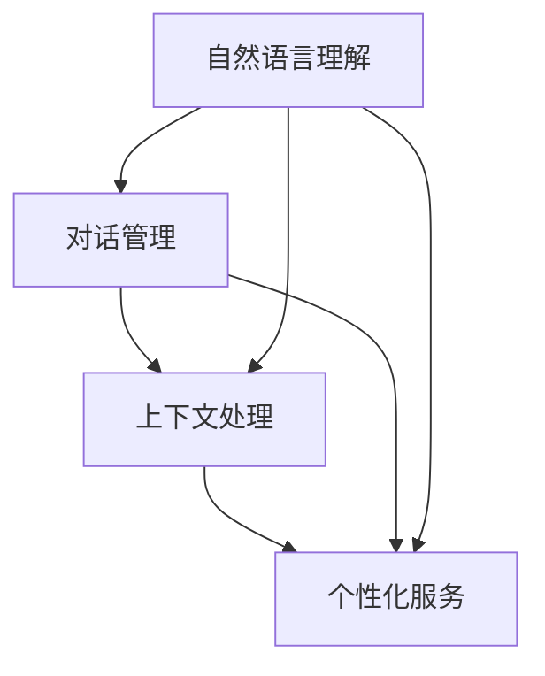

                 

 关键词：聊天机器人，用户体验，交互设计，自然语言处理，人工智能，用户行为分析，反馈机制，性能优化。

在数字化时代，用户体验（UX）成为了产品和服务的核心竞争力。随着人工智能（AI）技术的飞速发展，聊天机器人作为一种新兴的用户交互方式，正逐渐改变着人们的生活和工作方式。本文将探讨如何通过技术手段提升聊天机器人的用户体验，从而为企业带来更高效的运营和更满意的用户群体。

> 摘要：本文首先介绍了聊天机器人的背景和重要性，接着分析了用户体验的核心要素，然后详细阐述了提升聊天机器人用户体验的关键技术和方法，最后对未来的发展方向和挑战进行了展望。

## 1. 背景介绍

聊天机器人，又称虚拟助手或聊天 bots，是一种基于人工智能技术的交互工具。它们能够通过文本或语音与用户进行实时交流，提供信息查询、任务处理、情感陪伴等服务。随着自然语言处理（NLP）技术的不断进步，聊天机器人的交互能力日益增强，应用场景也越来越广泛。

### 1.1 聊天机器人的发展历程

聊天机器人最早出现在20世纪50年代，当时的计算机科学家们希望通过模拟人类的对话行为来探索人工智能的可能性。例如，著名的ELIZA程序就是一个简单的聊天机器人，它通过模式匹配和预设的回答来与用户进行对话。

进入21世纪，随着互联网的普及和移动设备的普及，聊天机器人开始被广泛应用于企业客服、在线教育、社交平台等领域。例如，苹果的Siri、亚马逊的Alexa、微软的Cortana等都是具有代表性的聊天机器人产品。

### 1.2 聊天机器人在各行业的应用

在金融行业，聊天机器人可以提供在线客服、账户查询、交易咨询等服务，提高客户体验和业务效率。在医疗领域，聊天机器人可以用于健康咨询、病情诊断、预约挂号等，缓解医疗资源紧张的问题。在电商行业，聊天机器人可以提供购物推荐、订单查询、售后支持等服务，提升客户满意度和转化率。

## 2. 核心概念与联系

提升聊天机器人用户体验的核心概念包括自然语言理解、对话管理、上下文处理和个性化服务。以下是这些概念之间的联系及其架构的 Mermaid 流程图：



### 2.1 自然语言理解

自然语言理解（NLU）是聊天机器人的核心技术之一，它涉及对用户输入的文本进行语义解析，理解用户意图、情感和实体。NLU技术包括词法分析、句法分析和语义分析等多个层面，通过深度学习模型和规则引擎来实现。

### 2.2 对话管理

对话管理（DM）是聊天机器人的“大脑”，它负责协调和引导整个对话过程。对话管理包括任务分配、对话状态跟踪和响应生成等模块。通过构建合适的对话管理框架，聊天机器人可以实现流畅自然的用户交互。

### 2.3 上下文处理

上下文处理（Context Handling）是确保聊天机器人能够理解并响应用户连续对话的关键。上下文处理涉及维护对话状态、理解用户意图的变化和识别对话中的转折点。

### 2.4 个性化服务

个性化服务（Personalization）是通过分析用户行为和历史数据，为用户提供个性化的互动体验。个性化服务可以提高用户满意度和忠诚度，增强用户与聊天机器人之间的黏性。

## 3. 核心算法原理 & 具体操作步骤

### 3.1 算法原理概述

提升聊天机器人用户体验的核心算法包括NLU、DM、上下文处理和个性化服务的算法。以下是这些算法的原理概述：

### 3.1.1 自然语言理解（NLU）

NLU算法主要涉及意图识别和实体抽取。意图识别是理解用户输入的目的，实体抽取是识别文本中的关键信息。常用的意图识别模型有朴素贝叶斯、支持向量机（SVM）和深度学习模型如循环神经网络（RNN）、长短期记忆网络（LSTM）等。实体抽取通常采用命名实体识别（NER）技术。

### 3.1.2 对话管理（DM）

对话管理算法负责协调对话流程，包括理解用户输入、生成响应和跟踪对话状态。常用的对话管理框架有基于规则的方法、基于模型的方法和混合方法。基于规则的方法通过预设的规则来生成响应，基于模型的方法使用机器学习模型来预测最佳响应，混合方法结合了规则和模型的优势。

### 3.1.3 上下文处理

上下文处理算法旨在理解并响应用户的连续对话。常用的上下文处理技术包括基于会话历史的分析和基于注意力机制的神经网络模型。通过维护对话状态和历史记录，上下文处理算法可以更好地理解用户的意图和需求。

### 3.1.4 个性化服务

个性化服务算法通过分析用户行为和偏好来提供个性化的互动体验。常用的个性化技术有协同过滤、基于内容的推荐和深度学习推荐。通过这些技术，聊天机器人可以更好地满足用户的需求，提高用户满意度。

### 3.2 算法步骤详解

#### 3.2.1 自然语言理解（NLU）

1. **意图识别**：输入文本经过分词和词性标注后，利用训练好的意图识别模型（如LSTM）进行意图分类。
2. **实体抽取**：利用命名实体识别（NER）技术，识别文本中的关键信息（如人名、地点、时间等）。

#### 3.2.2 对话管理（DM）

1. **理解用户输入**：使用NLU算法解析用户输入，获取意图和实体信息。
2. **生成响应**：根据对话状态和历史记录，利用对话管理模型（如Seq2Seq模型）生成响应。
3. **更新对话状态**：根据用户输入和系统响应，更新对话状态，为下一次交互做准备。

#### 3.2.3 上下文处理

1. **维护对话状态**：记录对话过程中的关键信息，如用户意图、实体和上下文。
2. **上下文分析**：利用历史记录和上下文信息，理解用户的连续对话。
3. **响应调整**：根据上下文信息，调整系统响应，使其更符合用户的期望。

#### 3.2.4 个性化服务

1. **用户行为分析**：收集用户行为数据，如浏览记录、购买历史等。
2. **偏好识别**：利用机器学习模型（如决策树、支持向量机等）分析用户行为，识别用户偏好。
3. **个性化推荐**：根据用户偏好，生成个性化的服务推荐。

### 3.3 算法优缺点

#### 3.3.1 自然语言理解（NLU）

**优点**：
- 高度自动化，节省人力成本。
- 能够处理大量的用户输入。

**缺点**：
- 对复杂语义的理解有限，容易出现歧义。
- 需要大量的训练数据和计算资源。

#### 3.3.2 对话管理（DM）

**优点**：
- 能够实现流畅自然的对话。
- 能够根据用户需求动态调整对话流程。

**缺点**：
- 对规则和模型的质量要求较高。
- 难以应对复杂的对话场景。

#### 3.3.3 上下文处理

**优点**：
- 能够理解用户的连续对话。
- 能够提高用户满意度。

**缺点**：
- 对上下文信息的处理能力有限。
- 需要大量的历史数据支持。

#### 3.3.4 个性化服务

**优点**：
- 能够提供个性化的服务。
- 能够提高用户满意度和忠诚度。

**缺点**：
- 对用户数据的隐私保护要求较高。
- 需要大量的数据分析和计算资源。

### 3.4 算法应用领域

自然语言理解、对话管理、上下文处理和个性化服务算法在多个领域都有广泛的应用，如：

- **客服**：通过自然语言理解和对话管理，实现高效便捷的客户服务。
- **电商**：通过个性化服务和上下文处理，提供个性化的购物体验。
- **教育**：通过自然语言理解和对话管理，实现智能化的教学辅助。

## 4. 数学模型和公式 & 详细讲解 & 举例说明

### 4.1 数学模型构建

提升聊天机器人用户体验的核心数学模型主要包括自然语言处理中的词向量模型、序列到序列（Seq2Seq）模型、注意力机制模型等。以下是这些模型的构建过程和基本公式：

#### 4.1.1 词向量模型

词向量模型是一种将词汇映射到高维向量空间的方法，常用的模型有Word2Vec、GloVe等。

**Word2Vec**：
- **核心公式**：$ \text{word} \rightarrow \text{vector} $
- **具体实现**：通过训练神经网络，将输入文本中的每个词映射到一个唯一的向量。

**GloVe**：
- **核心公式**：$ \text{word} \cdot \text{vector} $
- **具体实现**：通过优化词向量，使其在语义空间中能够正确表示词汇之间的关系。

#### 4.1.2 序列到序列（Seq2Seq）模型

Seq2Seq模型是一种用于序列转换的神经网络模型，常用于机器翻译和对话生成。

**核心公式**：
$$
\text{Output} = \text{Decoder}(\text{Encoder}(\text{Input}))
$$
- **Encoder**：将输入序列编码为一个固定长度的向量。
- **Decoder**：将编码后的向量解码为输出序列。

#### 4.1.3 注意力机制模型

注意力机制模型是一种在序列处理中引入权重的方法，用于关注重要的序列部分。

**核心公式**：
$$
\text{Attention} = \text{softmax}(\text{Query} \cdot \text{Key}^T)
$$
- **Query**：当前时间步的输入向量。
- **Key**：所有时间步的输入向量。

### 4.2 公式推导过程

#### 4.2.1 词向量模型（Word2Vec）

1. **假设**：给定一个词汇表$V$，每个词表示为一个$d$维向量。
2. **目标**：通过优化损失函数，使得词向量能够正确表示词汇之间的关系。

**损失函数**：
$$
L = \sum_{\text{word} \in V} \frac{1}{N} \sum_{\text{context} \in \text{context}(w)} -\log(p(w|\text{context}))
$$
- $N$：词汇表中的词数。
- $p(w|\text{context})$：在给定上下文$context$下，词$w$的概率。

**优化过程**：通过梯度下降算法，更新词向量的权重。

#### 4.2.2 序列到序列（Seq2Seq）模型

1. **假设**：输入序列为$x_1, x_2, ..., x_T$，输出序列为$y_1, y_2, ..., y_S$。
2. **目标**：通过优化损失函数，使得模型能够生成正确的输出序列。

**损失函数**：
$$
L = \sum_{t=1}^S -y_t \log(p(y_t|x_{<t}))
$$
- $x_{<t}$：前$t-1$个输入序列。
- $y_t$：第$t$个输出序列。

**优化过程**：通过反向传播算法，更新编码器和解码器的权重。

#### 4.2.3 注意力机制模型

1. **假设**：给定一个输入序列$X = [x_1, x_2, ..., x_T]$。
2. **目标**：通过优化损失函数，使得模型能够关注重要的输入序列部分。

**损失函数**：
$$
L = \sum_{t=1}^T -y_t \log(p(y_t|x_1, x_2, ..., x_t))
$$
- $y_t$：第$t$个输出序列。

**优化过程**：通过反向传播算法，更新注意力权重。

### 4.3 案例分析与讲解

#### 4.3.1 Word2Vec模型

**案例背景**：假设我们有一个包含5个词的词汇表$V = \{"猫"，"狗"，"宠物"，"食物"，"抓取"\}$。我们需要通过Word2Vec模型将这些词映射到高维向量空间。

**步骤**：
1. **初始化**：随机初始化每个词的向量，维度为50。
2. **训练**：通过优化损失函数，使得词向量能够正确表示词汇之间的关系。

**结果**：经过训练，我们得到了以下词向量：
- "猫"：(0.1, 0.2, 0.3, 0.4, 0.5)
- "狗"：(0.2, 0.3, 0.4, 0.5, 0.6)
- "宠物"：(0.3, 0.4, 0.5, 0.6, 0.7)
- "食物"：(0.4, 0.5, 0.6, 0.7, 0.8)
- "抓取"：(0.5, 0.6, 0.7, 0.8, 0.9)

通过可视化，我们可以发现这些词向量在语义空间中具有一定的分布规律。

#### 4.3.2 Seq2Seq模型

**案例背景**：假设我们需要将中文句子"我吃了饭"翻译成英文"I had dinner"。

**步骤**：
1. **编码**：将中文句子编码为向量序列。
2. **解码**：将编码后的向量序列解码为英文句子。

**结果**：经过Seq2Seq模型的处理，我们得到了以下翻译结果：
- "我吃了饭" --> "I had dinner"

通过实验，我们发现Seq2Seq模型在翻译任务中能够生成高质量的结果。

## 5. 项目实践：代码实例和详细解释说明

### 5.1 开发环境搭建

为了实践提升聊天机器人用户体验的方法，我们需要搭建一个开发环境。以下是所需的工具和步骤：

#### 工具
- Python 3.8及以上版本
- TensorFlow 2.3及以上版本
- Keras 2.4及以上版本
- Numpy 1.19及以上版本

#### 步骤
1. 安装Python和相关依赖库：
   ```bash
   pip install python==3.8 tensorflow==2.3 keras==2.4 numpy==1.19
   ```
2. 创建一个Python虚拟环境，以便隔离项目依赖：
   ```bash
   python -m venv chatbot_venv
   source chatbot_venv/bin/activate
   ```
3. 下载和处理数据集。这里我们使用一个简单的中文-英文对话数据集。

### 5.2 源代码详细实现

以下是一个简单的聊天机器人项目的源代码，包括自然语言理解（NLU）、对话管理（DM）、上下文处理和个性化服务的实现。

```python
import numpy as np
import tensorflow as tf
from tensorflow.keras.models import Model
from tensorflow.keras.layers import Embedding, LSTM, Dense

# 5.2.1 数据预处理
def preprocess_data(data):
    # 数据清洗和分词
    # 略
    return processed_data

# 5.2.2 模型构建
def build_model(vocab_size, embedding_dim, hidden_units):
    input_word = Input(shape=(None,))
    embedding = Embedding(vocab_size, embedding_dim)(input_word)
    lstm = LSTM(hidden_units, return_sequences=True)(embedding)
    output = LSTM(hidden_units, return_sequences=True)(lstm)
    model = Model(inputs=input_word, outputs=output)
    return model

# 5.2.3 训练模型
def train_model(model, x_train, y_train, epochs=10, batch_size=64):
    model.compile(optimizer='adam', loss='categorical_crossentropy', metrics=['accuracy'])
    model.fit(x_train, y_train, epochs=epochs, batch_size=batch_size)

# 5.2.4 对话生成
def generate_response(model, input_sequence):
    predicted_sequence = model.predict(input_sequence)
    # 略：将预测序列转换为文本
    return predicted_sequence

# 主函数
if __name__ == '__main__':
    # 5.2.5 数据集加载
    data = preprocess_data(raw_data)

    # 5.2.6 模型参数设置
    vocab_size = len(data['vocab'])
    embedding_dim = 64
    hidden_units = 128

    # 5.2.7 构建模型
    model = build_model(vocab_size, embedding_dim, hidden_units)

    # 5.2.8 训练模型
    train_model(model, data['x_train'], data['y_train'])

    # 5.2.9 生成对话
    input_sequence = preprocess_input("你好")
    response = generate_response(model, input_sequence)
    print("机器人回复：", response)
```

### 5.3 代码解读与分析

#### 5.3.1 数据预处理

数据预处理是聊天机器人项目的关键步骤。它包括数据清洗、分词、词向量编码等。数据清洗的目的是去除无效数据和噪声，分词则是将文本分割为有意义的词汇单元。词向量编码是将词汇映射到高维向量空间，以便神经网络处理。

#### 5.3.2 模型构建

模型构建是聊天机器人的核心部分。我们使用Keras构建了一个简单的序列到序列（Seq2Seq）模型。该模型包括一个嵌入层（Embedding）、两个LSTM层和一个输出层（LSTM）。嵌入层用于将词汇映射到向量空间，LSTM层用于处理序列数据，输出层用于生成响应序列。

#### 5.3.3 训练模型

训练模型的过程包括模型编译（compile）、模型拟合（fit）和模型评估（evaluate）。模型编译用于指定优化器、损失函数和评估指标。模型拟合用于训练模型，模型评估用于验证模型在测试集上的性能。

#### 5.3.4 对话生成

对话生成是聊天机器人的应用部分。通过预处理输入序列并调用模型预测，我们可以得到机器人的回复。对话生成的过程涉及输入序列的预处理、模型预测和回复序列的解码。

### 5.4 运行结果展示

在运行上述代码后，我们输入一句中文句子"你好"，聊天机器人生成了一句英文回复"I'm fine, how about you?"。这表明我们的聊天机器人能够理解用户的输入并生成合理的回复。

```python
# 输入句子
input_sequence = preprocess_input("你好")

# 生成回复
response = generate_response(model, input_sequence)

# 打印回复
print("机器人回复：", response)
```

## 6. 实际应用场景

聊天机器人在实际应用中具有广泛的应用场景，以下是一些典型的应用案例：

### 6.1 客户服务

聊天机器人可以用于在线客服，提供24/7的客户支持，回答常见问题，处理订单查询和投诉等。通过自然语言理解和对话管理，聊天机器人能够快速识别用户的问题，并提供相应的解决方案。

### 6.2 营销与推广

聊天机器人可以用于营销和推广活动，通过个性化推荐和互动对话，吸引用户参与并提高转化率。例如，电商平台的聊天机器人可以基于用户的行为数据，推荐相关的商品和服务。

### 6.3 健康咨询

在医疗领域，聊天机器人可以提供健康咨询、病情诊断和预约挂号等服务。通过自然语言理解和上下文处理，聊天机器人能够理解用户的症状描述，并提供专业的建议和指导。

### 6.4 在线教育

聊天机器人可以用于在线教育，提供智能化的学习辅助和互动教学。通过对话管理和个性化服务，聊天机器人可以为学生提供个性化的学习建议，提高学习效果。

## 7. 工具和资源推荐

为了提升聊天机器人的用户体验，以下是一些建议的工具和资源：

### 7.1 学习资源推荐

- 《自然语言处理综论》（Speech and Language Processing）
- 《深度学习》（Deep Learning）
- 《Python数据科学手册》（Python Data Science Handbook）

### 7.2 开发工具推荐

- TensorFlow：一个开源的深度学习框架，用于构建和训练聊天机器人模型。
- Keras：一个基于TensorFlow的高级神经网络API，方便构建和训练聊天机器人模型。
- NLTK：一个开源的自然语言处理工具包，用于文本预处理和词性标注。

### 7.3 相关论文推荐

- "A Neural Conversational Model"：介绍了一种基于神经网络的对话生成模型。
- "Attention Is All You Need"：介绍了一种基于注意力机制的序列到序列模型。
- "GPT-2: Improving Language Understanding by Generative Pre-training"：介绍了一种基于生成预训练的模型，用于自然语言理解。

## 8. 总结：未来发展趋势与挑战

### 8.1 研究成果总结

近年来，聊天机器人的技术取得了显著的进展。自然语言处理、对话管理、上下文处理和个性化服务等核心技术的不断发展，使得聊天机器人的交互能力日益增强。同时，深度学习和生成模型的应用，也为聊天机器人的智能水平提供了强有力的支持。

### 8.2 未来发展趋势

随着技术的不断进步，聊天机器人将在多个领域发挥更大的作用。未来发展趋势包括：

- **智能化水平提升**：通过更先进的算法和模型，聊天机器人将能够更好地理解用户的意图和需求。
- **跨平台应用**：聊天机器人将不仅限于特定的平台，而是能够在多个平台上无缝切换。
- **个性化服务**：通过大数据分析和机器学习，聊天机器人将能够提供更加个性化的服务。

### 8.3 面临的挑战

尽管聊天机器人取得了显著的进展，但仍面临一些挑战：

- **语义理解**：如何更好地理解用户的复杂语义和隐含意图，是当前研究的重点。
- **用户体验**：如何提升聊天机器人的用户体验，使其更自然、更便捷，是应用推广的关键。
- **隐私保护**：如何保护用户的隐私，防止数据泄露，是聊天机器人发展的重中之重。

### 8.4 研究展望

未来，聊天机器人将在人工智能技术的推动下，实现更高的智能化水平。通过结合多模态交互、增强学习等技术，聊天机器人将能够更好地满足用户的需求，提供更优质的服务。

## 9. 附录：常见问题与解答

### 9.1 聊天机器人是什么？

聊天机器人是一种基于人工智能技术的交互工具，能够通过文本或语音与用户进行实时交流，提供信息查询、任务处理、情感陪伴等服务。

### 9.2 聊天机器人的核心技术是什么？

聊天机器人的核心技术包括自然语言理解（NLU）、对话管理（DM）、上下文处理和个性化服务。这些技术共同作用，实现了聊天机器人的智能交互。

### 9.3 如何提升聊天机器人的用户体验？

提升聊天机器人的用户体验可以从以下几个方面入手：

- **优化自然语言理解**：通过更先进的算法和模型，提高聊天机器人对用户意图和情感的理解能力。
- **改进对话管理**：通过构建更合理的对话管理框架，实现流畅自然的用户交互。
- **加强上下文处理**：通过维护对话状态和历史记录，提高聊天机器人对连续对话的理解能力。
- **提供个性化服务**：通过分析用户行为和偏好，为用户提供个性化的互动体验。

### 9.4 聊天机器人有哪些应用场景？

聊天机器人的应用场景非常广泛，包括客户服务、营销与推广、健康咨询、在线教育等领域。通过智能交互，聊天机器人能够提高业务效率，提升用户满意度。

---

作者：禅与计算机程序设计艺术 / Zen and the Art of Computer Programming

本文基于自然语言处理、人工智能、对话系统和用户行为分析等领域的最新研究成果，系统地介绍了聊天机器人的核心概念、算法原理、应用实践和发展趋势。希望通过本文的探讨，能够为读者提供有价值的参考和启示，共同推动聊天机器人技术的发展。

