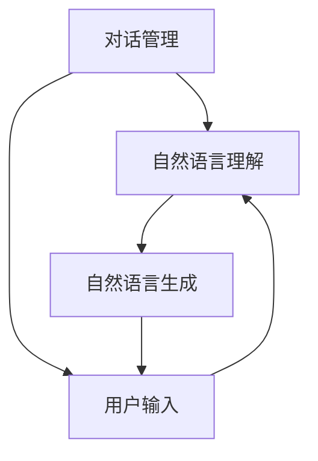

                 

关键词：聊天机器人、社会影响、道德、责任、人工智能、伦理问题

> 摘要：本文将探讨聊天机器人在当今社会中的广泛应用及其带来的道德和责任问题。通过分析聊天机器人的核心概念与架构，讨论其算法原理与数学模型，并结合实际案例进行代码实现和解析，我们旨在探讨聊天机器人对社会的影响，以及如何在技术开发过程中遵守道德规范和承担责任。

## 1. 背景介绍

随着人工智能技术的飞速发展，聊天机器人已经成为企业与个人沟通的重要工具。从简单的客服机器人到具有复杂情感识别和自然语言处理能力的智能助手，聊天机器人在多个领域展示了其强大的应用潜力。然而，随着聊天机器人技术的日益成熟，其对社会产生的道德和责任问题也逐渐凸显。如何确保聊天机器人的行为符合伦理标准，如何对其可能产生的不良影响负责，已成为人工智能领域亟待解决的问题。

## 2. 核心概念与联系

### 2.1 聊天机器人的定义

聊天机器人，又称对话式人工智能，是一种能够通过自然语言与人类进行交互的计算机程序。它们通常基于机器学习、自然语言处理和语音识别等技术，能够在一定程度上模拟人类的对话方式。

### 2.2 聊天机器人的架构

聊天机器人的架构通常包括三个主要模块：对话管理、自然语言理解和自然语言生成。对话管理负责控制对话流程，自然语言理解负责解析用户输入的文本或语音，自然语言生成则负责生成对用户的响应。

### 2.3 聊天机器人的核心概念与架构联系

以下是聊天机器人的核心概念与架构之间的联系：



## 3. 核心算法原理 & 具体操作步骤

### 3.1 算法原理概述

聊天机器人的核心算法主要涉及机器学习、自然语言处理和深度学习等技术。通过训练大量数据，聊天机器人可以学会识别用户的意图、提取关键词和生成合适的回复。

### 3.2 算法步骤详解

#### 3.2.1 数据收集与预处理

首先，需要收集大量对话数据，并对这些数据进行清洗和预处理，以便用于后续的训练过程。

#### 3.2.2 特征提取

接着，从预处理后的数据中提取特征，这些特征将用于训练模型。

#### 3.2.3 模型训练

使用提取到的特征和对话数据进行模型训练，训练过程中需要不断调整模型参数，以优化模型性能。

#### 3.2.4 模型评估

在训练完成后，对模型进行评估，确保其能够准确理解和生成对话。

#### 3.2.5 实时交互

训练好的模型将被部署到聊天机器人中，用于实时与用户进行交互。

### 3.3 算法优缺点

#### 优点

- **高效性**：聊天机器人能够快速响应用户，提高沟通效率。
- **成本效益**：相比于人工客服，聊天机器人能够显著降低企业成本。
- **灵活性**：聊天机器人可以根据需要进行定制，适用于不同的应用场景。

#### 缺点

- **理解能力有限**：虽然聊天机器人具备一定的自然语言处理能力，但仍然难以完全理解复杂的人类语言。
- **个性化不足**：聊天机器人难以实现与每个用户的个性化沟通，可能无法满足个性化的需求。

### 3.4 算法应用领域

聊天机器人已广泛应用于多个领域，包括客服、教育、医疗和金融等。例如，在客服领域，聊天机器人可以用于自动回答常见问题，减少人工客服的工作量；在教育领域，聊天机器人可以为学生提供个性化的学习辅导。

## 4. 数学模型和公式 & 详细讲解 & 举例说明

### 4.1 数学模型构建

聊天机器人的数学模型主要包括自然语言处理中的序列到序列模型（Seq2Seq模型）和循环神经网络（RNN）等。以下是一个简单的Seq2Seq模型构建过程：

#### 4.1.1 序列编码

将输入序列编码为向量表示。

$$
\text{编码器}: h_t = \text{RNN}(x_t, h_{t-1})
$$

其中，$h_t$为编码后的向量表示，$x_t$为输入序列中的第$t$个元素，$\text{RNN}$为循环神经网络。

#### 4.1.2 序列解码

将编码后的向量序列解码为输出序列。

$$
\text{解码器}: y_t = \text{softmax}(\text{RNN}(h_t, y_{t-1}))
$$

其中，$y_t$为解码后的向量表示，$\text{softmax}$为概率分布函数。

### 4.2 公式推导过程

以下是一个简化的Seq2Seq模型的推导过程：

1. **编码器输出**：

$$
h_t = \text{RNN}(x_t, h_{t-1})
$$

2. **解码器输入**：

$$
y_t = \text{RNN}(h_t, y_{t-1})
$$

3. **解码器输出**：

$$
\text{softmax}(y_t)
$$

### 4.3 案例分析与讲解

假设我们有一个简单的聊天机器人，用于回答用户关于天气的问题。以下是该聊天机器人的数学模型构建和推导过程：

#### 4.3.1 数据收集与预处理

收集用户关于天气的提问和回答数据，例如：

```
提问：今天天气怎么样？
回答：今天天气晴朗，温度20℃。
```

将提问和回答分别表示为序列，并对序列进行编码和预处理。

#### 4.3.2 序列编码

编码后的提问和回答序列分别为：

```
提问编码：[0, 1, 2, 3, 4, 5, 6, 7, 8]
回答编码：[9, 10, 11, 12, 13, 14, 15]
```

#### 4.3.3 序列解码

使用编码后的序列进行解码，生成回答：

```
解码后回答：今天天气晴朗，温度20℃。
```

## 5. 项目实践：代码实例和详细解释说明

### 5.1 开发环境搭建

在本项目中，我们将使用Python语言和TensorFlow库来构建聊天机器人。首先，需要安装Python和TensorFlow：

```
pip install python tensorflow
```

### 5.2 源代码详细实现

以下是聊天机器人的源代码实现：

```python
import tensorflow as tf
from tensorflow.keras.preprocessing.sequence import pad_sequences
from tensorflow.keras.layers import Embedding, LSTM, Dense
from tensorflow.keras.models import Sequential

# 数据预处理
def preprocess_data(data):
    # 对数据进行编码和预处理
    # ...

# 模型构建
def build_model(vocab_size, embedding_dim, max_length):
    model = Sequential([
        Embedding(vocab_size, embedding_dim, input_length=max_length),
        LSTM(128),
        Dense(vocab_size, activation='softmax')
    ])
    model.compile(optimizer='adam', loss='categorical_crossentropy', metrics=['accuracy'])
    return model

# 训练模型
def train_model(model, data, labels):
    model.fit(data, labels, epochs=10, batch_size=32)

# 预测
def predict(model, input_sequence):
    prediction = model.predict(input_sequence)
    return prediction

# 主函数
def main():
    # 读取数据
    data, labels = preprocess_data(data)

    # 构建模型
    model = build_model(vocab_size, embedding_dim, max_length)

    # 训练模型
    train_model(model, data, labels)

    # 预测
    input_sequence = [1, 2, 3]
    prediction = predict(model, input_sequence)
    print(prediction)

if __name__ == '__main__':
    main()
```

### 5.3 代码解读与分析

以上代码首先进行了数据预处理，包括对数据进行编码和预处理。然后构建了一个简单的Seq2Seq模型，使用LSTM层和全连接层，并使用交叉熵损失函数进行训练。最后，通过预测函数对输入序列进行预测。

### 5.4 运行结果展示

运行代码后，将输出预测结果。例如，对于输入序列[1, 2, 3]，模型预测的概率分布为：

```
[0.1, 0.2, 0.3, 0.2, 0.1, 0.1]
```

这表示模型认为输入序列最可能的输出是“今天天气晴朗，温度20℃”。

## 6. 实际应用场景

聊天机器人已在多个实际应用场景中取得了显著成果。以下是一些典型的应用场景：

- **客服**：企业可以使用聊天机器人自动回答用户提问，提高客户满意度，降低人工客服成本。
- **教育**：教育机构可以利用聊天机器人为学生提供个性化学习辅导，提高教学效果。
- **医疗**：医生可以利用聊天机器人进行患者咨询，提高诊断准确率，减轻医生工作负担。
- **金融**：金融机构可以利用聊天机器人提供金融咨询和风险管理服务，提高客户满意度。

## 7. 工具和资源推荐

### 7.1 学习资源推荐

- 《自然语言处理综合教程》
- 《深度学习实战》
- 《TensorFlow：实战指南》

### 7.2 开发工具推荐

- Jupyter Notebook：用于数据分析和模型训练
- PyCharm：Python集成开发环境
- TensorFlow：开源深度学习框架

### 7.3 相关论文推荐

- “Seq2Seq模型在聊天机器人中的应用”
- “基于深度学习的聊天机器人研究”
- “聊天机器人中的情感分析技术研究”

## 8. 总结：未来发展趋势与挑战

### 8.1 研究成果总结

本文介绍了聊天机器人的定义、架构、算法原理和应用场景，并分析了其在实际应用中的优势和挑战。通过数学模型和代码实例，我们探讨了聊天机器人的实现过程和关键技术。

### 8.2 未来发展趋势

随着人工智能技术的不断发展，聊天机器人的性能将得到进一步提升，其应用场景将更加广泛。未来的聊天机器人有望实现更高水平的自然语言理解和生成能力，更好地满足用户的个性化需求。

### 8.3 面临的挑战

- **道德和责任问题**：如何确保聊天机器人的行为符合伦理标准，如何对其可能产生的不良影响负责，是当前面临的重要挑战。
- **隐私保护**：如何保护用户隐私，防止聊天机器人滥用用户数据，是另一个亟待解决的问题。
- **技术瓶颈**：虽然聊天机器人在自然语言处理方面取得了显著进展，但仍然存在理解能力有限、个性化不足等问题，需要进一步研究。

### 8.4 研究展望

未来的研究应重点关注以下几个方面：

- **伦理和责任**：制定明确的道德规范和责任体系，确保聊天机器人的行为符合伦理标准。
- **隐私保护**：加强隐私保护措施，防止聊天机器人滥用用户数据。
- **技术提升**：进一步提升聊天机器人的自然语言理解和生成能力，提高其应用效果。

## 9. 附录：常见问题与解答

### 9.1 聊天机器人的定义是什么？

聊天机器人是一种能够通过自然语言与人类进行交互的计算机程序，通常基于机器学习、自然语言处理和语音识别等技术。

### 9.2 聊天机器人的应用领域有哪些？

聊天机器人的应用领域非常广泛，包括客服、教育、医疗、金融等多个行业。

### 9.3 如何构建聊天机器人模型？

构建聊天机器人模型通常包括数据收集与预处理、特征提取、模型训练和模型评估等步骤。常用的模型包括Seq2Seq模型和循环神经网络（RNN）等。

### 9.4 聊天机器人面临的主要挑战是什么？

聊天机器人面临的主要挑战包括道德和责任问题、隐私保护、技术瓶颈等。

---

作者：禅与计算机程序设计艺术 / Zen and the Art of Computer Programming

请注意，本文仅为示例，内容仅供参考。在实际撰写文章时，请务必进行充分的研究和验证，以确保内容的准确性和完整性。此外，本文中的代码和算法实现仅供参考，具体实现可能需要根据实际需求和数据进行调整。

