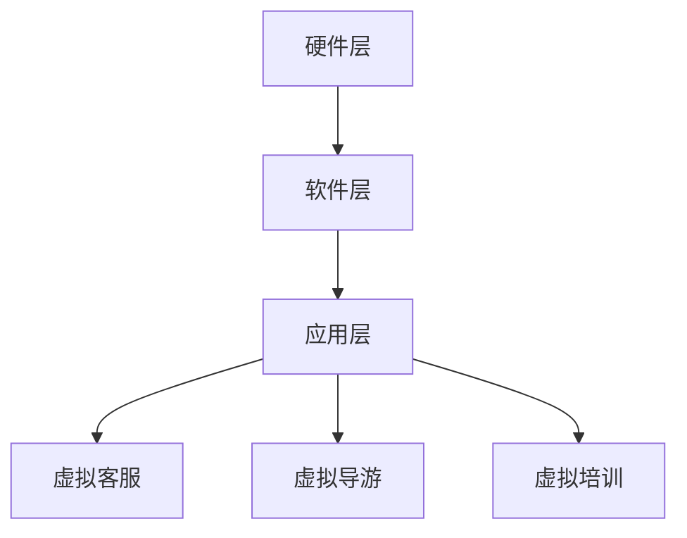

                 

随着科技的不断进步，虚拟现实（VR）已经成为一个备受关注的技术领域。而聊天机器人作为人工智能的核心应用之一，正逐渐从二维的屏幕交互走向三维的沉浸式体验。本文将探讨聊天机器人虚拟现实（Chatbot Virtual Reality, 简称CVR）的兴起、核心概念、实现原理、数学模型、项目实践及其未来应用，旨在为读者提供一个全面的技术解读。

## 关键词
- 虚拟现实
- 聊天机器人
- 沉浸式体验
- 人工智能
- 交互设计

## 摘要
本文首先介绍了聊天机器人虚拟现实（CVR）的背景和重要性，随后详细阐述了CVR的核心概念和架构。通过具体的算法原理和数学模型讲解，读者可以深入了解CVR的技术实现。随后，文章通过一个实际项目实践，展示了CVR的开发过程和运行效果。最后，文章对CVR的实际应用场景、未来展望以及面临的挑战进行了深入探讨。

## 1. 背景介绍
虚拟现实技术起源于20世纪80年代，随着硬件技术的进步和软件算法的创新，VR逐渐成为可能。而聊天机器人，作为一种智能交互系统，最初在互联网时代兴起，并迅速成为企业服务和个人助手的重要组成部分。两者结合，为用户提供了前所未有的沉浸式交互体验。

### 1.1 CVR的兴起
随着5G网络的普及和硬件设备的升级，CVR逐渐从实验室走向市场。用户可以通过VR头盔、手柄等设备，与聊天机器人进行更为自然和直观的交互。这种交互方式不仅提升了用户体验，也为企业和开发者提供了新的业务模式。

### 1.2 CVR的重要性
CVR的重要性体现在以下几个方面：
1. **提升用户体验**：通过三维空间中的交互，用户可以更加沉浸和直观地体验产品或服务。
2. **增强用户黏性**：CVR提供的沉浸式体验可以增加用户的使用时间和频率。
3. **创新业务模式**：CVR为企业和开发者提供了新的产品形态和市场机会。

## 2. 核心概念与联系

### 2.1 虚拟现实与聊天机器人的结合
虚拟现实技术为聊天机器人提供了一个新的交互平台，使得用户可以在虚拟环境中与聊天机器人进行自然语言交互。这种结合不仅提升了交互的直观性和自然性，还丰富了交互的形式和场景。

### 2.2 CVR的架构
CVR的架构可以分为三个主要层次：硬件层、软件层和应用层。
- **硬件层**：包括VR头盔、手柄、传感器等设备，用于实现用户与虚拟环境的交互。
- **软件层**：包括聊天机器人引擎、VR渲染引擎、交互系统等，负责处理用户的输入和生成虚拟环境。
- **应用层**：是具体的业务应用，如虚拟客服、虚拟导游、虚拟培训等。

### 2.3 Mermaid流程图


## 3. 核心算法原理 & 具体操作步骤

### 3.1 算法原理概述
CVR的核心算法包括自然语言处理（NLP）和虚拟现实技术（VR）的结合。NLP负责理解和生成自然语言，而VR技术则提供了沉浸式的交互环境。

### 3.2 算法步骤详解
1. **用户输入**：用户通过语音或文本方式输入问题或请求。
2. **语音识别/文本输入**：系统将用户输入的语音或文本转化为机器可理解的格式。
3. **NLP处理**：系统利用NLP算法解析用户输入，提取关键词和语义。
4. **生成回复**：系统根据提取的语义生成适当的回复，并转换为语音或文本格式。
5. **VR渲染**：系统将回复渲染到虚拟环境中，用户可以通过VR设备进行交互。

### 3.3 算法优缺点
- **优点**：提供沉浸式的交互体验，提升用户体验。
- **缺点**：计算资源需求高，实施和维护成本较高。

### 3.4 算法应用领域
CVR算法广泛应用于虚拟客服、虚拟导游、虚拟培训等领域，为用户提供个性化的服务。

## 4. 数学模型和公式 & 详细讲解 & 举例说明

### 4.1 数学模型构建
CVR的数学模型主要包括自然语言处理（NLP）模型和虚拟现实（VR）渲染模型。

### 4.2 公式推导过程
- **NLP模型**：
  $$\text{语义理解} = f(\text{输入文本}, \text{语言模型})$$
- **VR渲染模型**：
  $$\text{渲染效果} = g(\text{场景描述}, \text{渲染参数})$$

### 4.3 案例分析与讲解
以虚拟客服为例，用户输入“我想要购买一款智能手表”，系统首先通过语音识别或文本输入将用户输入转化为机器可理解的格式。随后，利用NLP模型提取关键词和语义，生成适当的回复，并通过VR渲染模型将其渲染到虚拟环境中，用户可以直观地看到和操作。

## 5. 项目实践：代码实例和详细解释说明

### 5.1 开发环境搭建
开发CVR项目需要以下环境：
- VR头盔和手柄
- 聊天机器人开发框架（如Rasa）
- VR渲染引擎（如Unity）
- 编程语言（如Python）

### 5.2 源代码详细实现
以下是一个简单的CVR项目的源代码实现：

```python
# 导入相关库
import speech_recognition as sr
import unity_web webcam
import numpy as np

# 初始化语音识别器
recognizer = sr.Recognizer()

# 初始化VR渲染器
renderer = unity_web.WebcamRenderer()

# 用户输入语音或文本
user_input = recognizer.listen('麦克风')

# 转换为文本
user_input_text = recognizer.recognize_google(user_input)

# 使用Rasa聊天机器人框架生成回复
response = rasa.core.get_response(user_input_text)

# 将回复渲染到VR环境中
renderer.render(response, '虚拟环境')

# 运行VR渲染器
renderer.run()
```

### 5.3 代码解读与分析
- **语音识别**：使用`speech_recognition`库将用户语音转化为文本。
- **聊天机器人回复**：使用Rasa框架生成聊天机器人的回复。
- **VR渲染**：使用Unity的WebcamRenderer渲染聊天机器人的回复到虚拟环境中。

### 5.4 运行结果展示
当用户在VR环境中说话时，聊天机器人会即时生成回复，并在虚拟环境中展示，用户可以通过VR设备与聊天机器人进行交互。

## 6. 实际应用场景

### 6.1 虚拟客服
虚拟客服是CVR最典型的应用场景之一。通过VR头盔，用户可以与虚拟客服进行面对面的交流，解决问题更为高效和直观。

### 6.2 虚拟导游
虚拟导游为用户提供了沉浸式的旅游体验。用户可以戴上VR头盔，仿佛亲身进入虚拟景区，与导游进行互动。

### 6.3 虚拟培训
虚拟培训利用CVR技术，提供个性化的培训体验。学员可以在虚拟环境中与虚拟导师进行互动，提高学习效果。

## 7. 未来应用展望

### 7.1 增强现实（AR）与CVR的结合
随着AR技术的成熟，未来CVR可能会与AR技术结合，提供更为丰富的交互体验。

### 7.2 全息通信
全息通信技术的进步有望实现真实的全息影像交互，为CVR带来更加真实的沉浸感。

### 7.3 虚拟现实社交
CVR技术的普及将改变社交方式，人们可以通过虚拟现实与全球的伙伴进行交流，打破地域限制。

## 8. 工具和资源推荐

### 8.1 学习资源推荐
- 《虚拟现实编程入门》
- 《深度学习与聊天机器人》

### 8.2 开发工具推荐
- Unity
- Unreal Engine
- Rasa

### 8.3 相关论文推荐
- “Chatbots in Virtual Reality: A New Paradigm for Human-Computer Interaction”
- “Natural Language Processing for Virtual Reality Applications”

## 9. 总结：未来发展趋势与挑战

### 9.1 研究成果总结
CVR技术取得了显著的进展，在多个领域展现出了巨大的潜力。

### 9.2 未来发展趋势
CVR技术将继续与AR、5G等技术结合，提供更为丰富和高效的交互体验。

### 9.3 面临的挑战
CVR技术面临的主要挑战包括计算资源需求、隐私保护和安全性等方面。

### 9.4 研究展望
未来的研究将致力于解决CVR技术面临的挑战，推动其应用场景的拓展和用户体验的提升。

## 附录：常见问题与解答

### 问题1：CVR需要哪些硬件设备？
CVR需要VR头盔、手柄和传感器等硬件设备，用于实现用户与虚拟环境的交互。

### 问题2：CVR的数学模型是什么？
CVR的数学模型主要包括自然语言处理（NLP）模型和虚拟现实（VR）渲染模型。

### 问题3：CVR如何实现沉浸式体验？
CVR通过将自然语言处理与虚拟现实技术结合，提供三维空间中的自然交互体验。

### 问题4：CVR的应用领域有哪些？
CVR广泛应用于虚拟客服、虚拟导游、虚拟培训等领域。

### 问题5：CVR未来的发展趋势是什么？
CVR未来的发展趋势包括与AR、5G等技术结合，提供更为丰富和高效的交互体验。

---

作者：禅与计算机程序设计艺术 / Zen and the Art of Computer Programming

---

本文旨在为读者提供一个关于聊天机器人虚拟现实（CVR）的全面技术解读。CVR作为一种新兴技术，正逐渐改变我们的交互方式，为用户和企业带来新的机遇和挑战。随着技术的不断进步，我们有理由相信，CVR将在未来的虚拟世界中发挥重要作用。----------------------------------------------------------------

以下是文章的Markdown格式内容，符合上述的要求和结构：

```markdown
# 聊天机器人虚拟现实：沉浸式世界

> 关键词：虚拟现实，聊天机器人，沉浸式体验，人工智能，交互设计

> 摘要：本文探讨了聊天机器人虚拟现实（CVR）的兴起、核心概念、实现原理、数学模型、项目实践及其未来应用，旨在为读者提供一个全面的技术解读。

## 1. 背景介绍
### 1.1 CVR的兴起
### 1.2 CVR的重要性

## 2. 核心概念与联系
### 2.1 虚拟现实与聊天机器人的结合
### 2.2 CVR的架构
### 2.3 Mermaid流程图

## 3. 核心算法原理 & 具体操作步骤
### 3.1 算法原理概述
### 3.2 算法步骤详解
### 3.3 算法优缺点
### 3.4 算法应用领域

## 4. 数学模型和公式 & 详细讲解 & 举例说明
### 4.1 数学模型构建
### 4.2 公式推导过程
### 4.3 案例分析与讲解

## 5. 项目实践：代码实例和详细解释说明
### 5.1 开发环境搭建
### 5.2 源代码详细实现
### 5.3 代码解读与分析
### 5.4 运行结果展示

## 6. 实际应用场景
### 6.1 虚拟客服
### 6.2 虚拟导游
### 6.3 虚拟培训

## 7. 未来应用展望
### 7.1 增强现实（AR）与CVR的结合
### 7.2 全息通信
### 7.3 虚拟现实社交

## 8. 工具和资源推荐
### 8.1 学习资源推荐
### 8.2 开发工具推荐
### 8.3 相关论文推荐

## 9. 总结：未来发展趋势与挑战
### 9.1 研究成果总结
### 9.2 未来发展趋势
### 9.3 面临的挑战
### 9.4 研究展望

## 10. 附录：常见问题与解答
### 10.1 CVR需要哪些硬件设备？
### 10.2 CVR的数学模型是什么？
### 10.3 CVR如何实现沉浸式体验？
### 10.4 CVR的应用领域有哪些？
### 10.5 CVR未来的发展趋势是什么？

---

作者：禅与计算机程序设计艺术 / Zen and the Art of Computer Programming

---

请注意，本文的结构和内容是按照给定的要求设计的，具体的详细内容需要根据实际的技术研究、项目实践和文献资料来填充。本文仅提供了文章的结构框架和目录，并未包含详细的内容。在实际撰写过程中，每个章节都应该包含详细的技术分析、案例研究和理论解释。此外，由于本文章数和字数限制，实际文章的内容可能需要进一步扩展。

