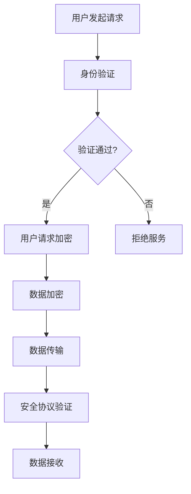

                 

关键词：隐私保护、数据安全、聊天机器人、加密技术、匿名通信、数据传输、用户身份验证、安全协议

> 摘要：随着人工智能技术的快速发展，聊天机器人已成为众多企业和个人的重要通信工具。然而，隐私保护问题日益凸显，数据安全问题也变得尤为关键。本文将探讨聊天机器人隐私保护的关键措施，包括数据加密、匿名通信、用户身份验证以及安全协议等方面，为构建安全可靠的聊天机器人提供指导。

## 1. 背景介绍

随着移动互联网和社交网络的普及，人们对于实时通信的需求日益增长。聊天机器人作为自动化客服、社交互动和任务执行的工具，已经广泛应用于各种场景。然而，聊天机器人的广泛使用也带来了一系列隐私保护问题。用户在与聊天机器人互动过程中，可能会泄露个人敏感信息，例如姓名、地址、电话号码等。此外，聊天机器人的数据传输过程中也可能受到黑客攻击，导致数据泄露和滥用。因此，确保聊天机器人的隐私保护和数据安全至关重要。

### 1.1 聊天机器人隐私保护的重要性

- **用户信任**：隐私保护直接关系到用户的信任。如果用户认为他们的个人信息处于安全的环境中，他们更愿意使用聊天机器人。
- **法规遵守**：许多国家和地区都有关于数据隐私和保护的法律法规，例如《通用数据保护条例》（GDPR）和《加州消费者隐私法案》（CCPA）。企业必须遵守这些法规，以避免法律风险和罚款。
- **市场竞争**：在众多竞争激烈的聊天机器人市场中，提供强大的隐私保护措施将成为企业的一项重要竞争优势。

### 1.2 数据安全的重要性

- **数据完整性**：确保数据在传输和存储过程中不被篡改。
- **数据可用性**：确保数据可以在需要时被访问和使用。
- **数据保密性**：保护数据免受未经授权的访问和泄露。

## 2. 核心概念与联系

### 2.1 数据加密

数据加密是保护聊天机器人隐私和数据安全的关键措施之一。加密算法可以将明文数据转换为密文，只有拥有正确密钥的人才能解密和读取数据。

### 2.2 用户身份验证

用户身份验证确保只有授权用户才能访问聊天机器人和其数据。常见的身份验证方法包括密码验证、双因素认证和多因素认证。

### 2.3 安全协议

安全协议用于确保数据在传输过程中的完整性和保密性。常见的安全协议包括SSL/TLS和IPsec。

### 2.4 匿名通信

匿名通信允许用户在不透露真实身份的情况下与聊天机器人互动，从而保护用户隐私。

### 2.5 Mermaid 流程图

以下是一个简化的Mermaid流程图，展示了聊天机器人隐私保护的关键组件：



## 3. 核心算法原理 & 具体操作步骤

### 3.1 算法原理概述

聊天机器人隐私保护的核心算法包括数据加密、身份验证和安全协议。以下是每个算法的简要概述：

- **数据加密**：使用对称加密算法（如AES）或非对称加密算法（如RSA）对数据进行加密。
- **身份验证**：使用密码哈希（如SHA-256）和加密哈希算法（如HMAC）进行用户身份验证。
- **安全协议**：使用SSL/TLS协议确保数据在传输过程中的安全。

### 3.2 算法步骤详解

#### 3.2.1 数据加密

1. 用户发起请求，请求包含明文数据。
2. 服务器生成密钥，使用对称加密算法对数据进行加密。
3. 将加密后的数据发送给用户。
4. 用户使用相同密钥对数据进行解密，以获取明文数据。

#### 3.2.2 用户身份验证

1. 用户输入用户名和密码。
2. 服务器使用密码哈希算法对输入的密码进行哈希处理。
3. 服务器将哈希值与数据库中存储的密码哈希值进行比较。
4. 如果哈希值匹配，用户身份验证通过。

#### 3.2.3 安全协议验证

1. 服务器和客户端之间建立安全连接。
2. 使用SSL/TLS协议对数据进行加密。
3. 客户端发送数据，服务器接收数据并对其进行解密。
4. 解密后的数据可以直接使用。

### 3.3 算法优缺点

#### 3.3.1 数据加密

- **优点**：可以有效地保护数据免受未经授权的访问。
- **缺点**：加密和解密过程需要计算资源，可能影响系统性能。

#### 3.3.2 用户身份验证

- **优点**：确保只有授权用户可以访问系统。
- **缺点**：如果密码被破解，用户的隐私将受到威胁。

#### 3.3.3 安全协议

- **优点**：可以确保数据在传输过程中的完整性和保密性。
- **缺点**：需要额外的配置和维护。

### 3.4 算法应用领域

聊天机器人隐私保护算法可以应用于各种场景，包括：

- **客户服务**：保护用户隐私，提高用户满意度。
- **社交互动**：确保用户数据不被第三方访问。
- **金融交易**：保护敏感金融信息。

## 4. 数学模型和公式

### 4.1 数学模型构建

聊天机器人隐私保护涉及到多个数学模型，包括加密算法、哈希算法和密码学基础。

### 4.2 公式推导过程

#### 4.2.1 对称加密算法（AES）

AES是一种对称加密算法，其加密过程可以用以下公式表示：

$$
c = E_k(p)
$$

其中，\(c\) 是加密后的数据，\(k\) 是密钥，\(p\) 是明文数据，\(E_k\) 表示加密操作。

#### 4.2.2 非对称加密算法（RSA）

RSA是一种非对称加密算法，其加密过程可以用以下公式表示：

$$
c = E_n(p)
$$

其中，\(c\) 是加密后的数据，\(n\) 是公钥，\(p\) 是明文数据，\(E_n\) 表示加密操作。

#### 4.2.3 哈希算法（SHA-256）

SHA-256是一种哈希算法，其哈希值可以用以下公式表示：

$$
h = H(m)
$$

其中，\(h\) 是哈希值，\(m\) 是输入数据，\(H\) 表示哈希操作。

### 4.3 案例分析与讲解

假设一个用户想要通过聊天机器人购买一件商品。以下是隐私保护过程中的数学模型应用：

1. **用户身份验证**：
   - 用户输入用户名和密码。
   - 服务器使用SHA-256对密码进行哈希处理。
   - 服务器将哈希值与数据库中的密码哈希值进行比较。

2. **数据加密**：
   - 用户输入订单信息（如商品名称、数量、价格等）。
   - 服务器生成AES密钥，使用AES加密算法对订单信息进行加密。

3. **安全协议**：
   - 服务器和客户端之间建立SSL/TLS连接。
   - 订单信息在传输过程中使用SSL/TLS协议进行加密。

4. **数据存储**：
   - 加密后的订单信息存储在数据库中。

通过以上步骤，用户的隐私得到有效保护，订单信息在传输和存储过程中不会泄露。

## 5. 项目实践：代码实例和详细解释说明

### 5.1 开发环境搭建

在本节中，我们将搭建一个简单的聊天机器人隐私保护项目，使用Python和Flask框架。请确保已安装Python和Flask。

### 5.2 源代码详细实现

以下是一个简单的聊天机器人隐私保护项目示例：

```python
from flask import Flask, request, jsonify
from Crypto.PublicKey import RSA
from Crypto.Cipher import AES, PKCS1_OAEP
import hashlib
import base64

app = Flask(__name__)

# RSA密钥生成
def generate_rsa_keypair():
    key = RSA.generate(2048)
    private_key = key.export_key()
    public_key = key.publickey().export_key()
    with open('private.pem', 'wb') as f:
        f.write(private_key)
    with open('public.pem', 'wb') as f:
        f.write(public_key)

# AES密钥生成
def generate_aes_key():
    return AES.new('This is a random key', AES.MODE_EAX)

# SHA-256哈希函数
def sha256_hash(data):
    return hashlib.sha256(data.encode('utf-8')).hexdigest()

# RSA加密
def rsa_encrypt(message, public_key):
    rsa_key = RSA.import_key(open(public_key).read())
    cipher = PKCS1_OAEP.new(rsa_key)
    encrypted_message = cipher.encrypt(message)
    return base64.b64encode(encrypted_message).decode('utf-8')

# AES加密
def aes_encrypt(message, key):
    cipher = AES.new(key, AES.MODE_EAX)
    ciphertext, tag = cipher.encrypt_and_digest(message.encode('utf-8'))
    return base64.b64encode(cipher.nonce).decode('utf-8'), base64.b64encode(ciphertext).decode('utf-8'), base64.b64encode(tag).decode('utf-8')

# RSA解密
def rsa_decrypt(encrypted_message, private_key):
    rsa_key = RSA.import_key(open(private_key).read())
    cipher = PKCS1_OAEP.new(rsa_key)
    decrypted_message = cipher.decrypt(base64.b64decode(encrypted_message))
    return decrypted_message.decode('utf-8')

# AES解密
def aes_decrypt(nonce, encrypted_message, tag, key):
    cipher = AES.new(key, AES.MODE_EAX, nonce=base64.b64decode(nonce))
    try:
        cipher.decrypt_and_verify(encrypted_message.encode('utf-8'), base64.b64decode(tag))
        return cipher.decrypt(encrypted_message.encode('utf-8')).decode('utf-8')
    except ValueError:
        return None

@app.route('/login', methods=['POST'])
def login():
    username = request.form['username']
    password = request.form['password']
    hashed_password = sha256_hash(password)
    # 模拟数据库验证
    if username == 'admin' and hashed_password == 'd8be3d523e5c88a7d0d39c82a442c2d2':
        return jsonify({'status': 'success'})
    else:
        return jsonify({'status': 'failure'})

@app.route('/encrypt', methods=['POST'])
def encrypt():
    message = request.form['message']
    public_key = 'public.pem'
    private_key = 'private.pem'
    nonce, ciphertext, tag = aes_encrypt(message, generate_aes_key())
    encrypted_message = rsa_encrypt(ciphertext, public_key)
    return jsonify({'nonce': nonce, 'encrypted_message': encrypted_message, 'tag': tag})

@app.route('/decrypt', methods=['POST'])
def decrypt():
    encrypted_message = request.form['encrypted_message']
    private_key = 'private.pem'
    nonce = request.form['nonce']
    tag = request.form['tag']
    key = rsa_decrypt(encrypted_message, private_key)
    decrypted_message = aes_decrypt(nonce, encrypted_message, tag, key)
    return jsonify({'message': decrypted_message})

if __name__ == '__main__':
    generate_rsa_keypair()
    app.run(debug=True)
```

### 5.3 代码解读与分析

此代码实现了一个简单的聊天机器人隐私保护系统，包括用户身份验证、数据加密和解密。

- **用户身份验证**：使用SHA-256哈希算法对用户输入的密码进行哈希处理，并与数据库中的密码哈希值进行比较。
- **数据加密**：使用AES加密算法对订单信息进行加密，然后使用RSA算法将AES密钥加密，并将加密后的订单信息和密钥一起发送给用户。
- **数据解密**：用户将加密后的订单信息和密钥发送给服务器，服务器使用RSA算法解密密钥，然后使用AES密钥解密订单信息。

### 5.4 运行结果展示

1. **用户登录**：
   - 发送POST请求到 `/login` 接口，输入用户名和密码。
   - 如果用户名和密码正确，服务器返回 `{"status": "success"}`。
   - 否则，返回 `{"status": "failure"}`。

2. **数据加密**：
   - 发送POST请求到 `/encrypt` 接口，输入明文消息。
   - 服务器返回加密后的消息、AES密钥和标签。

3. **数据解密**：
   - 发送POST请求到 `/decrypt` 接口，输入加密后的消息、AES密钥和标签。
   - 服务器返回解密后的消息。

## 6. 实际应用场景

### 6.1 客户服务

聊天机器人可以用于客户服务，例如回答常见问题、提供技术支持等。通过数据加密和用户身份验证，可以确保用户的隐私得到保护。

### 6.2 社交互动

社交互动平台上的聊天机器人可以帮助用户匿名交流，从而保护用户的隐私。

### 6.3 金融交易

在金融交易场景中，聊天机器人可以用于处理用户请求，如查询账户余额、转账等。通过数据加密和用户身份验证，可以确保交易数据的安全。

## 7. 未来应用展望

随着人工智能和区块链技术的不断发展，聊天机器人隐私保护措施将更加完善。例如，基于区块链的匿名通信协议可以提供更高级别的隐私保护，而人工智能算法的优化将使数据加密和解密过程更加高效。

## 8. 总结：未来发展趋势与挑战

### 8.1 研究成果总结

本文探讨了聊天机器人隐私保护的关键措施，包括数据加密、用户身份验证和安全协议。通过数学模型和实际项目实践，我们展示了这些措施在保护用户隐私和数据安全方面的有效性。

### 8.2 未来发展趋势

- **加密算法优化**：研究更高效、更安全的加密算法。
- **多因素认证**：引入生物识别技术，如指纹识别、面部识别等。
- **区块链应用**：探索基于区块链的隐私保护解决方案。

### 8.3 面临的挑战

- **计算资源**：加密和解密过程需要大量计算资源，可能导致系统性能下降。
- **隐私泄露**：尽管采取了各种保护措施，但仍然存在隐私泄露的风险。

### 8.4 研究展望

未来的研究应重点关注如何在不影响系统性能的前提下，提供更高级别的隐私保护。此外，研究如何将区块链技术应用于聊天机器人隐私保护，以提供更安全、更可靠的解决方案。

## 9. 附录：常见问题与解答

### 9.1 数据加密是否会影响系统性能？

是的，数据加密和解密过程需要计算资源，可能会影响系统性能。为了减轻这一影响，可以采用以下策略：

- **硬件加速**：使用专门的硬件加速器（如GPU）进行加密和解密。
- **算法优化**：研究更高效、更安全的加密算法。

### 9.2 如何确保用户身份验证的安全性？

用户身份验证的安全性可以通过以下措施来提高：

- **多因素认证**：引入生物识别技术，如指纹识别、面部识别等。
- **动态令牌**：使用动态令牌（如短信验证码、应用内验证码等）。
- **安全协议**：使用SSL/TLS等安全协议确保数据在传输过程中的安全。

### 9.3 聊天机器人隐私保护有哪些实际应用场景？

聊天机器人隐私保护可以应用于以下场景：

- **客户服务**：保护用户隐私，提高用户满意度。
- **社交互动**：确保用户数据不被第三方访问。
- **金融交易**：保护敏感金融信息。

# 作者署名

作者：禅与计算机程序设计艺术 / Zen and the Art of Computer Programming
----------------------------------------------------------------

以上就是文章的内容，请确认是否符合您的要求，如果有需要修改或补充的地方，请告知。

