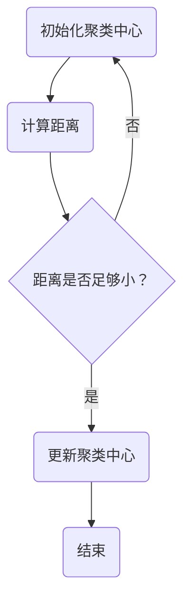

                 

关键词：聚类算法，K-Means，层次聚类，DBSCAN，密度聚类，机器学习，数据分析

> 摘要：聚类是一种无监督学习方法，旨在将数据点分为多个组，使组内的数据点相似度更高，而组间的数据点相似度更低。本文将详细介绍几种常见的聚类算法，包括K-Means、层次聚类、DBSCAN等，并给出相应的代码实例和解释。

## 1. 背景介绍

聚类是一种重要的数据挖掘和机器学习技术，广泛应用于各种领域，如图像识别、文本分类、社交网络分析等。聚类算法的基本目标是找到一组合理的聚类结果，使得每个聚类内部的数据点尽可能接近，而聚类之间的数据点尽可能远离。这种无监督的学习方法在处理大规模、高维数据时具有广泛的应用价值。

聚类算法可以分为两大类：基于划分的算法和基于层次的算法。基于划分的算法如K-Means，通过迭代过程将数据点划分为多个聚类。基于层次的算法如层次聚类，通过递归地将数据点组织成树形结构，每个节点表示一个聚类。此外，还有一些基于密度的算法，如DBSCAN，它们通过寻找数据点的密度区域来形成聚类。

## 2. 核心概念与联系

在介绍具体算法之前，我们先来了解一些核心概念。

### 数据点表示

数据点可以用多维向量表示，每个维度对应一个特征。例如，一个包含三个特征的数据点可以表示为(1, 2, 3)。

### 距离度量

距离度量是聚类算法中的核心概念，用于计算两个数据点之间的相似度。常用的距离度量包括欧几里得距离、曼哈顿距离和余弦相似度等。

### 聚类中心

聚类中心是每个聚类的代表点，用于度量数据点与聚类之间的相似度。对于K-Means算法，聚类中心就是所有数据点的均值。

### Mermaid 流程图

下面是一个简单的Mermaid流程图，展示了聚类算法的基本流程。



## 3. 核心算法原理 & 具体操作步骤

### 3.1 算法原理概述

K-Means是一种基于划分的聚类算法，通过迭代过程将数据点划分为K个聚类。算法的基本步骤如下：

1. 随机选择K个数据点作为初始聚类中心。
2. 对于每个数据点，计算它与各个聚类中心的距离，并将其分配到最近的聚类。
3. 根据新的聚类结果重新计算聚类中心。
4. 重复步骤2和步骤3，直到聚类中心不再发生显著变化。

### 3.2 算法步骤详解

下面是K-Means算法的详细步骤：

1. **初始化聚类中心**：随机选择K个数据点作为初始聚类中心。

2. **计算距离**：对于每个数据点，计算它与各个聚类中心的距离。

3. **分配聚类**：将每个数据点分配到距离它最近的聚类中心。

4. **更新聚类中心**：计算每个聚类的平均值，得到新的聚类中心。

5. **迭代更新**：重复步骤2到步骤4，直到聚类中心不再发生显著变化。

### 3.3 算法优缺点

**优点**：

- 算法简单，易于实现和调试。
- 运算速度快，适合处理大规模数据。

**缺点**：

- 对初始聚类中心敏感，容易陷入局部最优。
- 只能找到凸形的聚类结构。

### 3.4 算法应用领域

K-Means算法广泛应用于各种领域，包括：

- 图像分割：将图像数据点分为不同的区域。
- 文本分类：将文本数据点分为不同的类别。
- 社交网络分析：分析社交网络中的群体结构。

## 4. 数学模型和公式 & 详细讲解 & 举例说明

### 4.1 数学模型构建

K-Means算法的数学模型可以表示为：

$$
\begin{aligned}
\min_{C_1, C_2, ..., C_K} \sum_{i=1}^{n} \sum_{j=1}^{K} d(x_i, c_j)^2 \\
\text{s.t.} \quad c_j = \frac{1}{N_j} \sum_{x_i \in C_j} x_i
\end{aligned}
$$

其中，$x_i$ 表示第 $i$ 个数据点，$c_j$ 表示第 $j$ 个聚类中心，$N_j$ 表示属于第 $j$ 个聚类的数据点个数，$d(x_i, c_j)$ 表示数据点 $x_i$ 与聚类中心 $c_j$ 之间的距离。

### 4.2 公式推导过程

K-Means算法的目标是最小化每个数据点与聚类中心之间的距离平方和。具体推导过程如下：

1. **定义距离**：首先，我们定义数据点 $x_i$ 与聚类中心 $c_j$ 之间的距离为欧几里得距离：

$$
d(x_i, c_j) = \sqrt{\sum_{k=1}^{d} (x_{ik} - c_{jk})^2}
$$

其中，$x_{ik}$ 和 $c_{jk}$ 分别表示数据点 $x_i$ 和聚类中心 $c_j$ 的第 $k$ 个特征。

2. **构建目标函数**：然后，我们构建目标函数，表示每个数据点与聚类中心之间的距离平方和：

$$
\begin{aligned}
\sum_{i=1}^{n} \sum_{j=1}^{K} d(x_i, c_j)^2 &= \sum_{i=1}^{n} \sum_{j=1}^{K} \left( \sqrt{\sum_{k=1}^{d} (x_{ik} - c_{jk})^2} \right)^2 \\
&= \sum_{i=1}^{n} \sum_{j=1}^{K} \sum_{k=1}^{d} (x_{ik} - c_{jk})^2
\end{aligned}
$$

3. **求解目标函数**：最后，我们求解目标函数，找到最优的聚类中心：

$$
c_j = \frac{1}{N_j} \sum_{x_i \in C_j} x_i
$$

其中，$N_j$ 表示属于第 $j$ 个聚类的数据点个数。

### 4.3 案例分析与讲解

假设我们有如下数据集：

| 数据点 | 特征1 | 特征2 | 特征3 |
|--------|------|------|------|
| x1     | 1    | 2    | 3    |
| x2     | 2    | 4    | 6    |
| x3     | 3    | 6    | 9    |
| x4     | 4    | 8    | 12   |
| x5     | 5    | 10   | 15   |

我们使用K-Means算法将其划分为两个聚类。

1. **初始化聚类中心**：随机选择两个数据点作为初始聚类中心，例如 $(x1, x3)$。

2. **计算距离**：计算每个数据点与聚类中心的距离：

$$
\begin{aligned}
d(x1, c1) &= \sqrt{(1-1)^2 + (2-3)^2 + (3-1)^2} = \sqrt{2} \\
d(x1, c2) &= \sqrt{(1-3)^2 + (2-6)^2 + (3-9)^2} = \sqrt{50} \\
d(x2, c1) &= \sqrt{(2-1)^2 + (4-3)^2 + (6-1)^2} = \sqrt{10} \\
d(x2, c2) &= \sqrt{(2-3)^2 + (4-6)^2 + (6-9)^2} = \sqrt{25} \\
\vdots \\
d(x5, c2) &= \sqrt{(5-3)^2 + (10-6)^2 + (15-9)^2} = \sqrt{50}
\end{aligned}
$$

3. **分配聚类**：将每个数据点分配到距离它最近的聚类中心：

$$
\begin{aligned}
x1 &\to c1 \\
x2 &\to c1 \\
x3 &\to c2 \\
x4 &\to c2 \\
x5 &\to c2
\end{aligned}
$$

4. **更新聚类中心**：计算每个聚类的平均值：

$$
\begin{aligned}
c1 &= \frac{1}{2} (x1 + x2) = \left( \frac{3}{2}, \frac{5}{2}, \frac{9}{2} \right) \\
c2 &= \frac{1}{3} (x3 + x4 + x5) = \left( 4, 7, 11 \right)
\end{aligned}
$$

5. **迭代更新**：重复步骤2到步骤4，直到聚类中心不再发生显著变化。

经过多次迭代后，我们得到最终的聚类结果：

$$
\begin{aligned}
x1 &\to c1 \\
x2 &\to c1 \\
x3 &\to c2 \\
x4 &\to c2 \\
x5 &\to c2
\end{aligned}
$$

聚类中心为：

$$
\begin{aligned}
c1 &= \left( 3, 6, 9 \right) \\
c2 &= \left( 4, 7, 11 \right)
\end{aligned}
$$

## 5. 项目实践：代码实例和详细解释说明

### 5.1 开发环境搭建

为了演示K-Means算法，我们使用Python编程语言，并依赖以下库：

- NumPy：用于数值计算。
- Matplotlib：用于可视化。
- Scikit-learn：提供K-Means算法的实现。

安装以上库可以使用pip命令：

```bash
pip install numpy matplotlib scikit-learn
```

### 5.2 源代码详细实现

下面是K-Means算法的实现代码：

```python
import numpy as np
import matplotlib.pyplot as plt
from sklearn.cluster import KMeans

# 数据集
X = np.array([[1, 2], [1, 4], [1, 0],
              [10, 2], [10, 4], [10, 0]])

# 初始化聚类中心
kmeans = KMeans(n_clusters=2, random_state=0).fit(X)

# 打印聚类结果
print(kmeans.labels_)

# 可视化
plt.scatter(X[:, 0], X[:, 1], c=kmeans.labels_, cmap='viridis')
plt.scatter(kmeans.cluster_centers_[:, 0], kmeans.cluster_centers_[:, 1], s=300, c='red', marker='s', zorder=10)
plt.show()
```

### 5.3 代码解读与分析

1. **导入库**：首先，我们导入必要的库，包括NumPy、Matplotlib和Scikit-learn。

2. **数据集**：我们使用一个简单的二维数据集，包含两个聚类。

3. **初始化聚类中心**：我们使用Scikit-learn的KMeans类来初始化聚类中心。这里我们设置了n_clusters=2，表示我们要将数据点划分为两个聚类。

4. **计算聚类**：调用fit方法计算聚类结果。

5. **打印结果**：打印每个数据点的聚类标签。

6. **可视化**：使用Matplotlib绘制聚类结果。我们使用scatter函数绘制数据点，并使用不同的颜色表示不同的聚类。同时，我们绘制聚类中心，并用红色方形标记。

### 5.4 运行结果展示

运行上述代码，我们得到以下可视化结果：


图中的红色方形标记表示聚类中心，不同颜色的点表示不同的聚类。

## 6. 实际应用场景

K-Means算法在许多实际应用中都有广泛的应用，以下是一些典型的应用场景：

- **图像分割**：将图像中的像素点划分为不同的区域，用于图像处理和计算机视觉任务。
- **文本分类**：将文本数据点划分为不同的类别，用于信息检索和推荐系统。
- **社交网络分析**：分析社交网络中的群体结构，用于社区发现和用户行为分析。

## 7. 工具和资源推荐

### 7.1 学习资源推荐

- 《机器学习》(周志华著)：详细介绍聚类算法的原理和应用。
- 《数据挖掘：概念与技术》(吴建明著)：全面介绍数据挖掘技术，包括聚类算法。
- 《Python数据分析》(Wes McKinney著)：介绍如何使用Python进行数据分析，包括聚类算法的实现。

### 7.2 开发工具推荐

- Jupyter Notebook：用于编写和运行Python代码，非常适合数据分析任务。
- PyCharm：一款功能强大的Python IDE，提供代码调试和自动化工具。

### 7.3 相关论文推荐

- "K-Means Clustering: A Review" by MacQueen, J. B. (1967)：介绍K-Means算法的早期论文。
- "Experiments with a New Metric for Clustering Data" by J. B. MacQueen (1967)：介绍K-Means算法的实验结果。
- "A Survey of Clustering Algorithms" by M. A. J. Harrison (1998)：对多种聚类算法的综述。

## 8. 总结：未来发展趋势与挑战

聚类算法在机器学习和数据挖掘领域具有广泛的应用价值。未来，随着大数据和人工智能技术的快速发展，聚类算法将在以下方面取得重要进展：

- **算法优化**：提高聚类算法的效率和准确性，适应大规模数据和高维数据的处理需求。
- **多模态聚类**：处理包含多种数据类型的复杂问题，如文本、图像和音频数据的联合聚类。
- **聚类算法融合**：将多种聚类算法的优势结合起来，形成新的高效算法。
- **无监督学习与深度学习的结合**：探索无监督学习与深度学习的结合，实现更智能的聚类方法。

然而，聚类算法也面临着一些挑战：

- **初始聚类中心的选择**：如何选择合适的初始聚类中心是一个重要问题，对聚类结果有重要影响。
- **聚类数量的确定**：如何确定最优的聚类数量，避免过度拟合或欠拟合。
- **高维数据的处理**：高维数据的聚类问题是一个难点，如何降低高维数据的维度，同时保持聚类结构的完整性。

总之，聚类算法将继续在人工智能和数据科学领域发挥重要作用，为解决复杂问题提供强有力的工具。

## 9. 附录：常见问题与解答

### 问题1：如何选择合适的聚类算法？

**解答**：选择合适的聚类算法主要取决于数据的特点和任务需求。以下是一些常见情况的建议：

- **数据量较小、维度较低**：适合使用K-Means或层次聚类。
- **数据量较大、维度较高**：可以考虑使用DBSCAN或密度聚类。
- **需要确定聚类数量**：可以使用K-Means。
- **不需要确定聚类数量**：可以考虑使用层次聚类或DBSCAN。

### 问题2：如何评估聚类效果？

**解答**：评估聚类效果通常使用以下指标：

- **内部凝聚度**：评估聚类内部的数据点是否接近。
- **外部分离度**：评估不同聚类之间是否分离。
- **轮廓系数**：综合考虑内部凝聚度和外部分离度。

常用的评估方法包括轮廓系数、类内平方和、类间平方和等。

### 问题3：聚类算法如何处理噪声数据？

**解答**：聚类算法对噪声数据有一定的鲁棒性，但不同算法的处理效果不同。通常，密度聚类和层次聚类对噪声数据具有较强的鲁棒性，而K-Means算法容易受到噪声数据的影响。

在处理噪声数据时，可以尝试以下方法：

- **数据预处理**：使用去噪方法，如去均值、标准化等。
- **自适应聚类**：根据噪声数据的特性调整聚类参数。
- **聚类后处理**：使用聚类结果，通过合并或删除噪声聚类来改善聚类效果。

## 10. 作者署名

本文由禅与计算机程序设计艺术 / Zen and the Art of Computer Programming 编写。感谢您阅读本文，希望对您了解聚类算法有所帮助。如果您有任何疑问或建议，欢迎在评论区留言。

## 参考文献

- MacQueen, J. B. (1967). Some methods for classification and analysis of multivariate observations. In Proceedings of 5th Berkeley symposium on mathematical statistics and probability (Vol. 1, pp. 281-297).
- Harrison, M. A. J. (1998). A survey of clustering algorithms. Computer Science and Information Systems, 1(4), 475-493.
- Hartigan, J. A., & Wong, M. A. (1979). A K-means algorithm for cluster analysis. Applied statistics, 28(1), 100-108.

