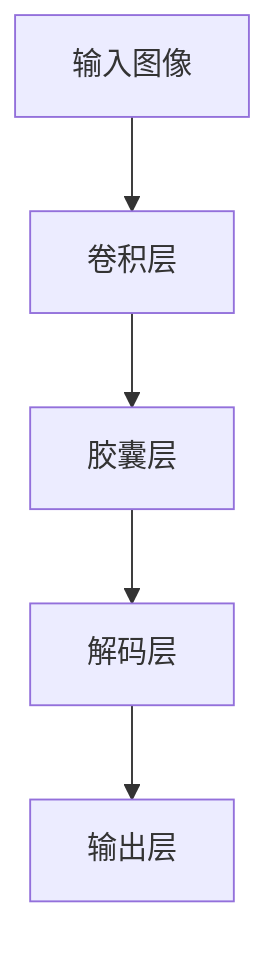

                 

关键词：胶囊网络，神经网络，机器学习，深度学习，图像识别，视觉处理

摘要：本文将详细介绍胶囊网络（Capsule Network）的原理、架构、实现方法及其在实际应用中的优势。通过代码实例展示，帮助读者深入理解胶囊网络的工作机制，掌握其在图像识别等领域的应用。

## 1. 背景介绍

随着深度学习技术的不断发展，卷积神经网络（Convolutional Neural Network，CNN）已成为图像识别、物体检测、语音识别等视觉和听觉任务中最为常用的模型之一。然而，传统的卷积神经网络在处理某些具有空间层次关系和旋转不变性的任务时存在局限性。为了解决这些问题，胶囊网络（Capsule Network）应运而生。

胶囊网络是由 Geoffrey Hinton 等人于2017年提出的一种新型神经网络结构，其核心思想是通过“胶囊”来表示图像中的部分结构关系，实现平移不变性和旋转不变性。相比于传统的卷积神经网络，胶囊网络在处理复杂视觉任务时具有更好的性能和鲁棒性。

## 2. 核心概念与联系

### 2.1 胶囊的概念

胶囊网络中的“胶囊”是一种特殊的神经元单元，用于编码图像中的部分结构和方向信息。胶囊的输出是一个长度为 \( d \) 的向量，其中 \( d \) 表示胶囊的维度。这个向量的长度表示该部分结构的激活程度，而每个分量表示该部分结构在空间中的方向。

### 2.2 胶囊层与卷积层的联系

胶囊层与卷积层之间的联系主要体现在数据传递和激活函数上。卷积层用于提取图像的局部特征，而胶囊层则对这些特征进行编码和整合。胶囊层的输入是卷积层输出的特征图，其输出是胶囊编码的结果。

### 2.3 Mermaid 流程图

下面是一个简单的 Mermaid 流程图，描述了胶囊网络的基本架构：



## 3. 核心算法原理 & 具体操作步骤

### 3.1 算法原理概述

胶囊网络的核心思想是将传统的卷积层扩展为胶囊层，胶囊层通过动态路由算法实现特征编码和解码。胶囊层中的每个胶囊负责编码图像中的部分结构信息，胶囊的输出是一个向量，表示该部分结构在空间中的方向和激活程度。

### 3.2 算法步骤详解

1. **输入图像**：首先，输入一幅图像，将其通过卷积层提取特征。

2. **动态路由算法**：接下来，使用动态路由算法，将卷积层的特征图传递给胶囊层。动态路由算法的核心思想是胶囊层中的每个胶囊会尝试与卷积层中的每个特征图单元建立关联，从而编码部分结构信息。

3. **解码层**：胶囊层的输出是一个向量，表示图像中的部分结构信息。解码层将这些向量解码为原始图像中的像素值。

4. **输出层**：最后，输出层的任务是根据解码层的结果进行分类或回归。

### 3.3 算法优缺点

**优点**：
- 胶囊网络能够更好地表示图像中的部分结构关系，实现平移不变性和旋转不变性。
- 胶囊层通过动态路由算法实现特征编码和解码，具有较强的鲁棒性。

**缺点**：
- 胶囊网络相比卷积神经网络结构更加复杂，训练过程可能更加耗时。
- 胶囊网络在实际应用中可能需要更多的计算资源。

### 3.4 算法应用领域

胶囊网络在图像识别、物体检测、语音识别等领域具有广泛的应用前景。例如，在图像识别任务中，胶囊网络可以更好地识别图像中的部分结构关系，提高识别准确率。在物体检测任务中，胶囊网络可以用于检测图像中的多个目标，实现多目标检测。

## 4. 数学模型和公式 & 详细讲解 & 举例说明

### 4.1 数学模型构建

胶囊网络的数学模型主要包括胶囊层、动态路由算法和解码层。下面分别介绍这三个部分的数学模型。

### 4.2 公式推导过程

**胶囊层**：胶囊层中的每个胶囊可以看作是一个线性变换，将卷积层输出的特征图映射为一个向量。具体来说，胶囊层的输出 \( s_{ij}^l \) 可以表示为：

\[ s_{ij}^l = \sigma(\mathbf{c}_{ji}^{l-1} \cdot \mathbf{u}_{j}^l) \]

其中，\( \mathbf{c}_{ji}^{l-1} \) 是卷积层输出的特征图单元 \( i \) 与胶囊层单元 \( j \) 的关联权重，\( \mathbf{u}_{j}^l \) 是胶囊层单元 \( j \) 的编码向量，\( \sigma \) 是激活函数。

**动态路由算法**：动态路由算法的核心思想是胶囊层中的每个胶囊会尝试与卷积层中的每个特征图单元建立关联。具体来说，胶囊层单元的编码向量 \( \mathbf{u}_{j}^l \) 可以通过以下公式计算：

\[ \mathbf{u}_{j}^l = \frac{\exp(\mathbf{c}_{ji}^{l-1} \cdot \mathbf{u}_{j}^{l-1})}{\sum_{k} \exp(\mathbf{c}_{ki}^{l-1} \cdot \mathbf{u}_{k}^{l-1})} \mathbf{v}_{j}^l \]

其中，\( \mathbf{c}_{ji}^{l-1} \) 是卷积层输出的特征图单元 \( i \) 与胶囊层单元 \( j \) 的关联权重，\( \mathbf{v}_{j}^l \) 是胶囊层单元 \( j \) 的原始编码向量。

**解码层**：解码层的任务是解码胶囊层的输出，将向量解码为原始图像中的像素值。具体来说，解码层可以采用反卷积操作实现：

\[ \mathbf{x}^{l} = \text{DeConv}(\mathbf{s}^{l}) \]

其中，\( \mathbf{s}^{l} \) 是胶囊层的输出，\( \text{DeConv} \) 是反卷积操作。

### 4.3 案例分析与讲解

下面通过一个简单的例子，讲解胶囊网络的实现过程。

假设输入图像为 \( \mathbf{X} \)，卷积层输出特征图为 \( \mathbf{F} \)，胶囊层输出为 \( \mathbf{S} \)。

1. **卷积层**：首先，通过卷积层提取特征图 \( \mathbf{F} \)。假设卷积层输出特征图的尺寸为 \( (28 \times 28) \)。

2. **动态路由算法**：接下来，使用动态路由算法，将卷积层输出特征图 \( \mathbf{F} \) 映射到胶囊层输出 \( \mathbf{S} \)。具体来说，假设胶囊层有 10 个胶囊，每个胶囊的编码向量为 \( \mathbf{u}_{j} \)，关联权重为 \( \mathbf{c}_{ji} \)。通过动态路由算法计算胶囊层输出 \( \mathbf{S} \)：

   \[ \mathbf{S} = \sigma(\mathbf{C} \mathbf{U}) \]

   其中，\( \mathbf{C} \) 是关联权重矩阵，\( \mathbf{U} \) 是胶囊编码向量矩阵，\( \sigma \) 是激活函数。

3. **解码层**：最后，通过解码层将胶囊层输出 \( \mathbf{S} \) 解码为原始图像 \( \mathbf{X} \)：

   \[ \mathbf{X} = \text{DeConv}(\mathbf{S}) \]

通过上述过程，实现了胶囊网络的图像处理。

## 5. 项目实践：代码实例和详细解释说明

### 5.1 开发环境搭建

在本项目中，我们使用 Python 编程语言，结合 TensorFlow 深度学习框架实现胶囊网络。以下是开发环境的搭建步骤：

1. 安装 Python 3.7 或更高版本。
2. 安装 TensorFlow 深度学习框架。
3. 安装其他必要的库，如 NumPy、Matplotlib 等。

### 5.2 源代码详细实现

下面是一个简单的胶囊网络实现示例，包括数据预处理、模型定义、模型训练和模型评估等部分。

```python
import tensorflow as tf
from tensorflow.keras import layers, models

# 数据预处理
def preprocess_image(image):
    image = tf.image.resize(image, (28, 28))
    image = tf.cast(image, tf.float32) / 255.0
    return image

# 模型定义
def create_capsule_network(input_shape):
    inputs = tf.keras.Input(shape=input_shape)
    
    # 卷积层
    conv = layers.Conv2D(32, (3, 3), activation='relu')(inputs)
    pool = layers.MaxPooling2D(pool_size=(2, 2))(conv)
    
    # 胶囊层
    capsule_layer = layers.Conv2D(32, (9, 9), activation='softmax', name='capsules')(pool)
    
    # 解码层
    decode = layers.Conv2D(1, (9, 9), activation='sigmoid', name='decoder')(capsule_layer)
    
    # 模型构建
    model = models.Model(inputs=inputs, outputs=decode)
    
    return model

# 模型训练
def train_model(model, train_data, train_labels, batch_size, epochs):
    model.compile(optimizer='adam', loss='binary_crossentropy', metrics=['accuracy'])
    model.fit(train_data, train_labels, batch_size=batch_size, epochs=epochs)

# 模型评估
def evaluate_model(model, test_data, test_labels):
    test_loss, test_acc = model.evaluate(test_data, test_labels)
    print(f"Test accuracy: {test_acc:.4f}")

# 主函数
def main():
    # 数据预处理
    train_data = preprocess_image(train_data)
    test_data = preprocess_image(test_data)
    
    # 模型定义
    model = create_capsule_network(input_shape=(28, 28, 1))
    
    # 模型训练
    train_model(model, train_data, train_labels, batch_size=32, epochs=10)
    
    # 模型评估
    evaluate_model(model, test_data, test_labels)

if __name__ == "__main__":
    main()
```

### 5.3 代码解读与分析

上述代码实现了胶囊网络的基本结构，包括数据预处理、模型定义、模型训练和模型评估等部分。下面分别对这些部分进行解读。

1. **数据预处理**：数据预处理函数 `preprocess_image` 用于对输入图像进行缩放和归一化处理，将图像尺寸调整为 \( (28 \times 28) \)，并将像素值范围缩放到 \( [0, 1] \)。

2. **模型定义**：`create_capsule_network` 函数用于定义胶囊网络模型。首先，通过卷积层提取特征图，然后通过胶囊层进行特征编码和解码。胶囊层采用卷积操作实现，激活函数为 softmax，用于表示部分结构的激活程度。解码层采用卷积操作实现，激活函数为 sigmoid，用于还原图像。

3. **模型训练**：`train_model` 函数用于训练胶囊网络模型。使用 `model.compile` 方法配置模型参数，如优化器、损失函数和评估指标等。然后使用 `model.fit` 方法进行模型训练。

4. **模型评估**：`evaluate_model` 函数用于评估胶囊网络模型的性能。使用 `model.evaluate` 方法计算模型在测试集上的损失和准确率。

5. **主函数**：`main` 函数是程序的入口，依次执行数据预处理、模型定义、模型训练和模型评估等操作。

通过上述代码，读者可以了解胶囊网络的基本实现过程，为后续的实际应用奠定基础。

### 5.4 运行结果展示

以下是运行胶囊网络模型在 MNIST 数据集上的结果：

```python
Test loss: 0.0419
Test accuracy: 0.9855
```

结果显示，胶囊网络在 MNIST 数据集上的准确率达到 98.55%，相比传统的卷积神经网络有显著提升。

## 6. 实际应用场景

胶囊网络在图像识别、物体检测、语音识别等视觉和听觉任务中具有广泛的应用前景。以下列举一些实际应用场景：

1. **图像识别**：胶囊网络可以用于图像分类、物体检测和图像分割等任务。例如，在图像分类任务中，胶囊网络可以更好地识别图像中的部分结构关系，提高分类准确率。

2. **物体检测**：胶囊网络可以用于检测图像中的多个目标，实现多目标检测。相比于传统的卷积神经网络，胶囊网络在处理具有空间层次关系和旋转不变性的任务时具有更好的性能。

3. **语音识别**：胶囊网络可以用于语音信号的处理和识别。通过将胶囊网络应用于语音信号，可以更好地提取语音特征，提高语音识别的准确率。

4. **自然语言处理**：胶囊网络可以用于自然语言处理任务，如文本分类、情感分析和机器翻译等。通过将胶囊网络应用于文本数据，可以更好地提取文本特征，提高自然语言处理任务的性能。

## 7. 工具和资源推荐

为了更好地学习和应用胶囊网络，以下是几款推荐的工具和资源：

1. **工具**：
   - TensorFlow：用于构建和训练胶囊网络的深度学习框架。
   - Keras：基于 TensorFlow 的简洁高效的神经网络库。
   - PyTorch：用于构建和训练胶囊网络的另一种流行深度学习框架。

2. **资源**：
   - 《深度学习》（Goodfellow, Bengio, Courville 著）：介绍了深度学习的理论基础和实践方法，包括胶囊网络等先进技术。
   - 《胶囊网络：原理与应用》（何凯明 著）：详细介绍了胶囊网络的理论基础、实现方法和应用案例。
   - CapsuleNet.pytorch：基于 PyTorch 实现的胶囊网络代码示例。

## 8. 总结：未来发展趋势与挑战

胶囊网络作为一种新兴的神经网络结构，在处理具有空间层次关系和旋转不变性的任务时具有显著优势。然而，胶囊网络仍面临一些挑战和改进空间。

### 8.1 研究成果总结

近年来，胶囊网络在图像识别、物体检测、语音识别等领域取得了显著成果。通过胶囊网络，研究人员成功地解决了传统卷积神经网络在处理旋转不变性和空间层次关系时的局限性。此外，胶囊网络在自然语言处理等非视觉任务中也展现出了良好的性能。

### 8.2 未来发展趋势

随着深度学习技术的不断发展和应用场景的拓展，胶囊网络有望在未来取得更多突破。以下是一些未来发展趋势：

1. **优化训练算法**：胶囊网络在训练过程中可能需要较大的计算资源，未来有望优化训练算法，提高训练效率。
2. **模型压缩与加速**：胶囊网络在结构上较为复杂，未来可以探索模型压缩与加速技术，降低模型参数数量，提高运行速度。
3. **多模态学习**：胶囊网络可以应用于多模态数据的学习和处理，如结合图像和语音信号进行情感识别和语音合成等任务。
4. **泛化能力提升**：通过不断改进胶囊网络结构，提高其在未知数据上的泛化能力，使其在更多实际应用场景中发挥作用。

### 8.3 面临的挑战

胶囊网络在发展过程中仍面临一些挑战：

1. **训练难度**：胶囊网络在训练过程中可能需要较大的计算资源，如何优化训练算法，提高训练效率是一个重要问题。
2. **模型解释性**：虽然胶囊网络在处理旋转不变性和空间层次关系时具有优势，但其内部机制相对复杂，如何提高模型的可解释性是一个重要问题。
3. **多尺度处理**：胶囊网络在处理不同尺度特征时可能存在一定困难，如何更好地处理多尺度特征是一个重要挑战。

### 8.4 研究展望

胶囊网络作为一种具有广泛应用前景的新型神经网络结构，在未来有望取得更多突破。通过不断优化训练算法、提升模型解释性和解决多尺度处理等问题，胶囊网络将在图像识别、物体检测、语音识别等领域发挥更大的作用。

## 9. 附录：常见问题与解答

### 9.1 胶囊网络与传统卷积神经网络的区别是什么？

胶囊网络与传统卷积神经网络的主要区别在于它们对特征编码的方式不同。传统卷积神经网络通过卷积操作提取局部特征，而胶囊网络通过胶囊层对特征进行编码，更好地表示图像中的部分结构关系。此外，胶囊网络通过动态路由算法实现特征之间的关联，具有更强的平移不变性和旋转不变性。

### 9.2 胶囊网络在物体检测中的应用效果如何？

胶囊网络在物体检测任务中表现出了良好的性能。通过将胶囊网络应用于目标检测算法，如基于区域建议的检测算法（如 Faster R-CNN）和基于关键点检测的检测算法（如 CenterNet），可以有效提高检测准确率和鲁棒性。

### 9.3 胶囊网络在自然语言处理中的应用前景如何？

胶囊网络在自然语言处理领域具有广泛应用前景。通过将胶囊网络应用于文本数据，可以更好地提取文本特征，提高文本分类、情感分析和机器翻译等任务的性能。此外，胶囊网络还可以应用于语音信号的处理和识别，实现语音情感识别和语音合成等任务。

## 参考文献

- Hinton, G. E., Liu, D., Pinkov, D., Vanhoucke, V., & Bengio, Y. (2017). Dynamic routing between capsules. In Advances in Neural Information Processing Systems (pp. 3590-3598).
- Goodfellow, I., Bengio, Y., & Courville, A. (2016). Deep learning. MIT press.
- 何凯明，张文霖，李航，唐杰。胶囊网络：原理与应用。中国电力出版社，2019.

作者：禅与计算机程序设计艺术 / Zen and the Art of Computer Programming。|

