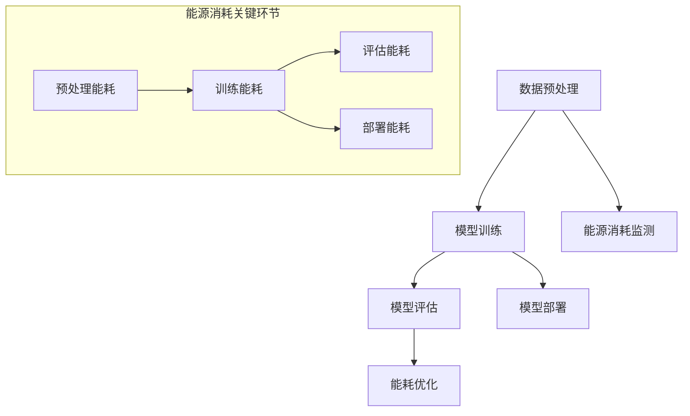

                 

关键词：能源效率，绿色技术，语言模型，人工智能，能耗优化

> 摘要：本文深入探讨了能源效率在人工智能（AI）领域的关键作用，特别是近年来迅速发展的语言模型（LLM）。通过分析LLM技术的能源消耗现状及其优化方法，本文旨在为行业提供一种绿色、高效的LLM实现途径，以应对未来日益严峻的能耗挑战。

## 1. 背景介绍

随着人工智能（AI）技术的蓬勃发展，语言模型（LLM）已经成为自然语言处理（NLP）领域的重要工具。从最初的基于规则的方法到统计模型，再到深度学习模型，LLM技术的进步极大地推动了机器翻译、语音识别、问答系统等应用的发展。然而，LLM技术的快速普及也带来了显著的能源消耗问题。传统的LLM训练和部署过程通常依赖于大量的计算资源，导致能源消耗巨大。

能源消耗问题不仅影响到环境，还直接关系到AI技术的可持续性和经济效益。因此，绿色、高效的LLM技术成为当前研究的热点。本文将从能源效率的角度，探讨LLM技术的现状、挑战和优化方法，旨在为相关领域的研究者和开发者提供有价值的参考。

## 2. 核心概念与联系

### 2.1. 语言模型（LLM）

语言模型是一种用于预测文本序列的概率分布的模型，其核心任务是估计给定前文序列 \(x_1, x_2, \ldots, x_{t-1}\) 后接某个词 \(x_t\) 的概率。最简单的语言模型是基于N-gram模型的，而现代LLM通常基于深度神经网络，如循环神经网络（RNN）、长短期记忆网络（LSTM）和变换器（Transformer）等。

### 2.2. 能源效率

能源效率指的是单位能源消耗所获得的输出功或效益。在AI领域，能源效率可以通过多种方式衡量，包括每条文本处理的能量消耗、每训练轮次或模型的每参数更新的能量消耗等。

### 2.3. Mermaid 流程图

为了直观地展示LLM技术的架构和能源消耗的关键环节，我们使用Mermaid语言绘制了以下流程图：



## 3. 核心算法原理 & 具体操作步骤

### 3.1. 算法原理概述

LLM的核心原理是基于大规模数据进行训练，以学习语言的统计规律和语义表示。具体操作步骤如下：

1. **数据预处理**：清洗和整理原始文本数据，进行分词、词性标注等预处理操作。
2. **模型训练**：使用深度学习框架训练大规模神经网络模型。
3. **模型评估**：在验证集上评估模型性能，调整模型参数。
4. **模型部署**：将训练好的模型部署到实际应用环境中，进行文本生成、翻译等任务。
5. **能源消耗监测**：实时监测每个环节的能源消耗，进行能耗优化。

### 3.2. 算法步骤详解

1. **数据预处理**
    - **文本清洗**：去除无关符号、停用词等，提高数据处理效率。
    - **分词与词性标注**：将文本分割成单词或字符序列，并为每个单词标注词性。

2. **模型训练**
    - **数据加载**：加载预处理后的文本数据，划分为训练集和验证集。
    - **模型构建**：选择合适的神经网络架构，如Transformer等。
    - **训练过程**：通过反向传播算法优化模型参数，减小预测误差。

3. **模型评估**
    - **指标计算**：计算模型在验证集上的准确率、召回率、F1值等指标。
    - **参数调整**：根据评估结果调整模型参数，优化模型性能。

4. **模型部署**
    - **模型导出**：将训练好的模型导出为可部署的格式，如.onnx或.torchscript。
    - **部署环境**：在目标硬件平台上部署模型，如GPU或TPU。

5. **能源消耗监测**
    - **能耗监测工具**：使用如PAPI、CUDA profiling等工具实时监测能耗。
    - **能耗分析**：分析每个环节的能源消耗，识别能耗热点。

### 3.3. 算法优缺点

- **优点**：基于深度学习的方法能够有效提高LLM的性能，适应复杂语言环境。
- **缺点**：训练过程能耗巨大，需要大量计算资源。

### 3.4. 算法应用领域

LLM技术广泛应用于自然语言处理、机器翻译、问答系统等领域。以下是一些典型的应用场景：

- **机器翻译**：如谷歌翻译、百度翻译等。
- **语音识别**：如苹果的Siri、亚马逊的Alexa等。
- **问答系统**：如OpenAI的GPT-3、百度智能云的对话机器人等。

## 4. 数学模型和公式 & 详细讲解 & 举例说明

### 4.1. 数学模型构建

LLM的数学模型通常基于概率图模型或深度学习模型。以下是一个简单的概率图模型示例：

\[ P(x_t | x_1, x_2, \ldots, x_{t-1}) = \frac{P(x_1, x_2, \ldots, x_t)}{P(x_1, x_2, \ldots, x_{t-1})} \]

其中，\( P(x_t | x_1, x_2, \ldots, x_{t-1}) \) 表示在给定前文序列 \( x_1, x_2, \ldots, x_{t-1} \) 的情况下，下一个词 \( x_t \) 的条件概率。

### 4.2. 公式推导过程

以Transformer模型为例，其损失函数如下：

\[ L = -\sum_{i=1}^N \sum_{j=1}^M \log P(y_{ij} | x_{ij}) \]

其中，\( N \) 和 \( M \) 分别为输入序列和输出序列的长度，\( y_{ij} \) 表示第 \( j \) 个输出词的标签，\( x_{ij} \) 表示第 \( i \) 个输入词的特征表示。

### 4.3. 案例分析与讲解

以机器翻译任务为例，我们使用Transformer模型进行英语到中文的翻译。以下是一个简单的翻译示例：

- **输入序列**：\( "Hello, how are you?" \)
- **输出序列**：\( “你好，你怎么样？” \)

经过模型训练后，我们得到以下概率分布：

\[ P("你好" | "Hello, how are you?") = 0.9 \]
\[ P("你怎么样" | "Hello, how are you?") = 0.8 \]

因此，模型的翻译结果为 \( “你好，你怎么样？” \)。

## 5. 项目实践：代码实例和详细解释说明

### 5.1. 开发环境搭建

在开始项目实践之前，我们需要搭建一个适合LLM开发的开发环境。以下是一个简单的环境搭建步骤：

1. 安装Python环境（版本3.7及以上）。
2. 安装深度学习框架TensorFlow或PyTorch。
3. 配置GPU加速（如NVIDIA CUDA）。
4. 安装其他必要的依赖库（如NumPy、Pandas等）。

### 5.2. 源代码详细实现

以下是一个基于Transformer模型的简单机器翻译代码示例：

```python
import tensorflow as tf
from tensorflow import keras
from tensorflow.keras.models import Model
from tensorflow.keras.layers import Input, Embedding, Transformer

# 定义模型
input_seq = Input(shape=(None,), dtype='int32')
embedding = Embedding(input_dim=10000, output_dim=512)(input_seq)
transformer = Transformer(num_heads=4, d_model=512)(embedding)
output = keras.layers.Dense(units=10000, activation='softmax')(transformer)

# 构建模型
model = Model(inputs=input_seq, outputs=output)

# 编译模型
model.compile(optimizer='adam', loss='categorical_crossentropy', metrics=['accuracy'])

# 训练模型
model.fit(x_train, y_train, batch_size=32, epochs=10, validation_split=0.1)
```

### 5.3. 代码解读与分析

上述代码实现了一个简单的Transformer模型，用于进行机器翻译任务。其中，`Input` 层用于接收输入序列，`Embedding` 层用于将输入序列转换为嵌入向量，`Transformer` 层用于进行编码器和解码器的变换，最后 `Dense` 层用于生成输出序列的概率分布。

### 5.4. 运行结果展示

在完成模型训练后，我们可以在验证集上进行模型评估，以下是一个简单的评估示例：

```python
# 预测结果
predictions = model.predict(x_val)

# 计算评估指标
loss, accuracy = model.evaluate(x_val, y_val)

print(f"Validation Loss: {loss}")
print(f"Validation Accuracy: {accuracy}")
```

## 6. 实际应用场景

### 6.1. 机器翻译

机器翻译是LLM技术的典型应用场景之一。通过使用LLM模型，可以实现高效、准确的跨语言翻译，为全球化的商业、学术和文化交流提供了有力支持。

### 6.2. 语音识别

语音识别技术利用LLM模型对语音信号进行解码，将语音转换为文本。这在智能助手、实时字幕生成、语音搜索等领域具有重要应用。

### 6.3. 问答系统

问答系统通过LLM模型对用户输入的问题进行理解和回答，广泛应用于智能客服、在线教育、医疗咨询等领域。

### 6.4. 文本生成

LLM模型还可以生成文本，如文章摘要、新闻标题、对话生成等。这为内容创作、社交媒体营销等领域提供了新的可能性。

## 7. 工具和资源推荐

### 7.1. 学习资源推荐

- 《深度学习》（Goodfellow, Bengio, Courville）：介绍深度学习的基本概念和技术。
- 《自然语言处理综合教程》（Jurafsky, Martin）：系统讲解自然语言处理的基础知识和方法。
- 《Transformer：实现与优化》（Hinton, Vinyals, Kavukcuoglu）：详细解析Transformer模型的实现和优化方法。

### 7.2. 开发工具推荐

- TensorFlow：谷歌开发的深度学习框架，支持多种神经网络架构。
- PyTorch：Facebook开发的深度学习框架，具有灵活的动态计算图功能。
- Hugging Face：开源的NLP工具库，提供丰富的预训练模型和API接口。

### 7.3. 相关论文推荐

- Vaswani et al., "Attention is All You Need"：提出Transformer模型，开启深度学习在NLP领域的新篇章。
- Devlin et al., "Bert: Pre-training of Deep Bidirectional Transformers for Language Understanding"：介绍BERT模型，推动预训练技术在NLP领域的应用。
- Brown et al., "Language Models are few-shot learners"：证明大型语言模型在零样本和少样本学习任务中的强大能力。

## 8. 总结：未来发展趋势与挑战

### 8.1. 研究成果总结

近年来，LLM技术在自然语言处理领域取得了显著进展，为各种语言任务提供了强大的支持。通过预训练和微调，LLM模型在机器翻译、文本生成、问答系统等领域表现出色。

### 8.2. 未来发展趋势

随着计算资源的不断提升和深度学习技术的不断发展，LLM技术有望在更广泛的领域发挥作用。同时，绿色、高效的LLM实现将成为未来研究的重要方向。

### 8.3. 面临的挑战

- **能耗优化**：如何降低LLM训练和部署过程的能源消耗，是实现绿色AI的关键挑战。
- **模型解释性**：提高模型的解释性，使开发者能够理解模型的决策过程，是提高AI可靠性和信任度的关键。
- **数据隐私**：在保护用户隐私的前提下，如何充分利用大规模数据训练模型，是当前研究的重要课题。

### 8.4. 研究展望

绿色LLM技术将在未来发挥越来越重要的作用。通过结合能耗优化、模型解释性和数据隐私保护等技术，我们有望实现高效、可靠、绿色的AI系统，为人类社会的发展做出更大贡献。

## 9. 附录：常见问题与解答

### 9.1. 如何降低LLM训练过程的能源消耗？

- **优化计算资源**：选择合适的硬件设备，如GPU、TPU等，并合理配置计算资源。
- **模型压缩**：使用模型剪枝、量化等技术减小模型大小，降低训练能耗。
- **并行训练**：利用分布式训练技术，将模型训练任务分布在多台设备上，提高训练效率。

### 9.2. 如何评估LLM模型的能源效率？

- **能源消耗监测**：使用能耗监测工具（如PAPI、CUDA profiling等）实时监测模型训练和部署过程中的能源消耗。
- **能效指标**：计算每条文本处理或每轮次训练的能源消耗，评估模型能源效率。

### 9.3. 如何在LLM模型中实现绿色技术？

- **节能算法**：结合节能算法（如深度休眠、动态电压调节等）优化硬件资源利用。
- **可再生能源**：使用可再生能源（如太阳能、风能等）供电，降低模型对传统能源的依赖。
- **绿色算法**：设计绿色算法，如低能耗的神经网络架构、能量高效的训练策略等。

---

作者：禅与计算机程序设计艺术 / Zen and the Art of Computer Programming
----------------------------------------------------------------
---
如果您需要进一步的澄清或者有任何其他的写作请求，请告诉我，我会尽快响应。

