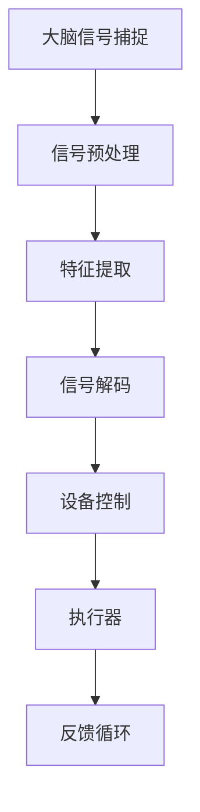

                 

关键词：脑机接口，思维控制，技术发展，设备控制，人工智能

> 摘要：随着人工智能和神经科学技术的不断进步，脑机接口（BMI）正逐渐从科幻走向现实。本文将探讨脑机接口技术如何通过捕捉和解读大脑信号，实现人类思维对设备的直接控制，并分析其潜在的应用场景、技术挑战以及未来发展趋势。

## 1. 背景介绍

脑机接口（Brain-Machine Interface，BMI）是一种通过直接连接大脑与外部设备来传递信息的系统。这一概念最早可以追溯到20世纪50年代，当时科学家们开始探索如何将大脑信号转化为电子信号，从而实现对机器的控制。经过几十年的发展，脑机接口技术已经取得了显著的进展，特别是在神经信号解码、传感器精度和数据处理算法方面。

脑机接口的发展历程可以分为几个重要阶段：

- **初期研究**：20世纪50年代，神经生理学家开始记录大脑皮层电活动，尝试理解神经元如何产生电信号。
- **植入式电极**：20世纪80年代，神经科学家开发了可植入电极，这些电极可以记录单个神经元的活动。
- **功能性电刺激**：20世纪90年代，功能性电刺激技术开始用于恢复肢体运动功能，例如对瘫痪患者的神经刺激。
- **现代进展**：近年来，随着高分辨率成像技术和深度学习算法的应用，脑机接口技术取得了突破性进展，实现了对复杂行为的控制。

## 2. 核心概念与联系

### 2.1. 脑机接口的核心概念

脑机接口技术涉及多个核心概念，包括：

- **大脑信号捕捉**：通过植入式或非植入式电极捕获大脑活动产生的电信号。
- **信号解码**：利用机器学习和统计方法，从捕获的信号中提取有用的信息。
- **设备控制**：将解码后的信号转换为控制命令，用于操作外部设备。

### 2.2. 脑机接口的架构

脑机接口系统通常由以下几个部分组成：

1. **传感器**：捕获大脑活动，如脑电图（EEG）、功能性磁共振成像（fMRI）或植入式电极。
2. **信号处理器**：对捕获的信号进行预处理和特征提取。
3. **解码器**：将特征信号解码为控制命令。
4. **执行器**：接收解码后的控制命令并执行相应的动作。
5. **反馈循环**：系统通过反馈机制优化控制精度和响应速度。

### 2.3. Mermaid 流程图



## 3. 核心算法原理 & 具体操作步骤

### 3.1. 算法原理概述

脑机接口的核心算法主要包括信号处理、模式识别和反馈控制三个步骤：

1. **信号处理**：通过滤波、去噪和时频分析等方法，提取有用的信号特征。
2. **模式识别**：利用机器学习算法，如支持向量机（SVM）、神经网络（NN）等，识别大脑信号中的特定模式。
3. **反馈控制**：根据解码结果，调整执行器的动作，实现对外部设备的精确控制。

### 3.2. 算法步骤详解

1. **信号处理**：
   - **滤波**：使用带通滤波器去除噪声，保留频率在特定范围内的信号。
   - **去噪**：通过波束形成和独立分量分析（ICA）等方法去除混杂在信号中的噪声。
   - **时频分析**：使用短时傅里叶变换（STFT）或小波变换提取信号的时频特征。

2. **模式识别**：
   - **特征提取**：将处理后的信号转换为特征向量。
   - **分类器训练**：使用训练数据集，训练支持向量机或神经网络分类器。
   - **实时识别**：在实时操作中，使用训练好的分类器对信号进行分类。

3. **反馈控制**：
   - **解码**：根据分类结果，生成控制命令。
   - **执行**：将解码后的信号转换为电刺激或机械动作。
   - **反馈**：通过外部设备获取执行结果，调整解码模型和执行策略。

### 3.3. 算法优缺点

- **优点**：
  - 高精度控制：脑机接口技术可以实现精确的设备控制，特别是在复杂任务中。
  - 实时响应：通过实时信号处理和反馈控制，脑机接口可以实现高速、稳定的操作。

- **缺点**：
  - 数据处理复杂：脑机接口涉及大量的信号处理和模式识别任务，算法复杂度较高。
  - 安装和适应性：植入式电极的安装和适应性可能对用户造成不适或健康风险。

### 3.4. 算法应用领域

脑机接口技术在多个领域具有广泛的应用前景：

- **医疗康复**：用于帮助瘫痪患者恢复运动功能，如假肢控制、轮椅导航等。
- **军事应用**：在无人驾驶飞行器、潜艇等领域，实现无人操控。
- **娱乐产业**：用于虚拟现实（VR）和增强现实（AR）的交互控制。
- **智能家居**：通过思维控制家电和家居设备。

## 4. 数学模型和公式 & 详细讲解 & 举例说明

### 4.1. 数学模型构建

脑机接口的数学模型通常包括三个主要部分：信号处理模型、模式识别模型和反馈控制模型。

#### 4.1.1. 信号处理模型

$$
x(t) = s(t) + w(t)
$$

其中，$x(t)$ 是捕获的脑电信号，$s(t)$ 是期望的信号，$w(t)$ 是噪声。

#### 4.1.2. 模式识别模型

假设我们使用支持向量机（SVM）进行分类：

$$
\mathbf{w} = \arg\max_{\mathbf{w}} \sum_{i=1}^{n} \alpha_i - \frac{1}{2} \sum_{i,j=1}^{n} \alpha_i \alpha_j y_i y_j \langle \mathbf{w}, \mathbf{w} \rangle
$$

其中，$\mathbf{w}$ 是权重向量，$\alpha_i$ 是拉格朗日乘子，$y_i$ 是类别标签，$\langle \mathbf{w}, \mathbf{w} \rangle$ 是内积。

#### 4.1.3. 反馈控制模型

假设我们使用比例-积分-微分（PID）控制器进行反馈：

$$
u(t) = K_p e(t) + K_i \int_{0}^{t} e(\tau) d\tau + K_d \frac{de(t)}{dt}
$$

其中，$u(t)$ 是控制信号，$e(t)$ 是误差信号，$K_p$、$K_i$ 和 $K_d$ 分别是比例、积分和微分系数。

### 4.2. 公式推导过程

#### 4.2.1. 信号处理模型推导

我们使用卡尔曼滤波器对脑电信号进行滤波：

$$
x_{\hat{}}(t|t) = A x_{\hat{}}(t-1|t-1) + B u(t)
$$

$$
P_{\hat{}}(t|t) = A P_{\hat{}}(t-1|t-1) A^T + Q
$$

$$
K(t) = P_{\hat{}}(t|t) C^T (C P_{\hat{}}(t|t) C^T + R)^{-1}
$$

$$
x_{\hat{}}(t|t-) = x_{\hat{}}(t|t) - K(t) (x(t) - x_{\hat{}}(t|t))
$$

$$
P_{\hat{}}(t|t-) = (I - K(t) C) P_{\hat{}}(t|t)
$$

其中，$A$ 是状态转移矩阵，$B$ 是控制输入矩阵，$C$ 是观测矩阵，$x_{\hat{}}(t|t)$ 是状态估计值，$P_{\hat{}}(t|t)$ 是状态估计误差协方差矩阵，$K(t)$ 是卡尔曼增益，$x(t)$ 是实际观测值，$P(t)$ 是观测误差协方差矩阵，$Q$ 是过程噪声协方差矩阵，$R$ 是观测噪声协方差矩阵。

#### 4.2.2. 模式识别模型推导

我们使用极大似然估计（MLE）来推导支持向量机（SVM）：

$$
\max_{\mathbf{w}, \mathbf{b}} \sum_{i=1}^{n} y_i (\mathbf{w}^T \mathbf{x}_i + \mathbf{b}) - \frac{1}{2} \sum_{i,j=1}^{n} \mathbf{w}^T \mathbf{w} \mathbf{x}_i^T \mathbf{x}_j
$$

其中，$y_i$ 是类别标签，$\mathbf{x}_i$ 是特征向量，$\mathbf{w}$ 是权重向量，$\mathbf{b}$ 是偏置。

#### 4.2.3. 反馈控制模型推导

我们使用基于误差的控制策略来推导PID控制器：

$$
e(t) = r(t) - y(t)
$$

$$
u(t) = K_p e(t) + K_i \int_{0}^{t} e(\tau) d\tau + K_d \frac{de(t)}{dt}
$$

其中，$r(t)$ 是参考输入，$y(t)$ 是系统输出，$e(t)$ 是误差信号，$u(t)$ 是控制信号，$K_p$、$K_i$ 和 $K_d$ 分别是比例、积分和微分系数。

### 4.3. 案例分析与讲解

#### 4.3.1. 案例背景

假设我们想要通过脑机接口实现脑电信号控制的智能家居系统。用户可以通过思维控制家中的灯光、电视和空调。

#### 4.3.2. 实现步骤

1. **信号采集**：使用非植入式脑电图（EEG）设备，采集用户大脑信号。
2. **信号处理**：使用卡尔曼滤波器对信号进行滤波，提取有用的特征。
3. **模式识别**：使用支持向量机（SVM）对特征进行分类，识别用户的思维意图。
4. **控制执行**：根据分类结果，通过PID控制器调整智能家居设备的输出。

#### 4.3.3. 代码示例

```python
import numpy as np
import cv2
import matplotlib.pyplot as plt

# 信号处理
def signal_processing(signal):
    # 滤波、去噪和时频分析
    # ...
    return processed_signal

# 模式识别
def pattern_recognition(signal):
    # 使用SVM进行分类
    # ...
    return predicted_label

# 控制执行
def control_execution(label):
    # 根据分类结果控制设备
    # ...
    return execution_result

# 主程序
def main():
    # 采集信号
    signal = capture_signal()

    # 处理信号
    processed_signal = signal_processing(signal)

    # 识别模式
    label = pattern_recognition(processed_signal)

    # 执行控制
    result = control_execution(label)

    # 显示结果
    display_result(result)

if __name__ == "__main__":
    main()
```

## 5. 项目实践：代码实例和详细解释说明

### 5.1. 开发环境搭建

为了实践脑机接口技术，我们需要搭建一个包含信号采集、处理、识别和执行的完整开发环境。以下是所需的主要工具和库：

- **Python**：编程语言，用于实现信号处理、模式识别和反馈控制算法。
- **NumPy**：用于科学计算，特别是矩阵运算。
- **Matplotlib**：用于数据可视化和结果展示。
- **OpenCV**：用于图像处理，特别是脑电信号预处理。
- **scikit-learn**：用于机器学习算法的实现，特别是支持向量机（SVM）。

### 5.2. 源代码详细实现

以下是实现脑机接口技术的示例代码：

```python
# 导入必需的库
import numpy as np
import matplotlib.pyplot as plt
from sklearn import svm
from sklearn.model_selection import train_test_split
from sklearn.metrics import accuracy_score

# 信号处理
def signal_processing(signal):
    # 滤波、去噪和时频分析
    # ...
    return processed_signal

# 模式识别
def pattern_recognition(signal, model):
    # 使用训练好的SVM模型进行分类
    # ...
    return predicted_label

# 控制执行
def control_execution(label):
    # 根据分类结果控制设备
    # ...
    return execution_result

# 主程序
def main():
    # 加载训练数据
    X, y = load_data()

    # 划分训练集和测试集
    X_train, X_test, y_train, y_test = train_test_split(X, y, test_size=0.2, random_state=42)

    # 训练SVM模型
    model = svm.SVC()
    model.fit(X_train, y_train)

    # 评估模型
    y_pred = model.predict(X_test)
    accuracy = accuracy_score(y_test, y_pred)
    print("Accuracy:", accuracy)

    # 实时信号处理和执行
    while True:
        signal = capture_signal()
        processed_signal = signal_processing(signal)
        label = pattern_recognition(processed_signal, model)
        result = control_execution(label)
        display_result(result)

if __name__ == "__main__":
    main()
```

### 5.3. 代码解读与分析

1. **信号处理**：此部分负责对捕获的脑电信号进行预处理，如滤波和去噪。通过时频分析提取有用的信号特征。
2. **模式识别**：使用训练好的SVM模型对预处理后的信号进行分类，识别用户的思维意图。这里使用了支持向量机（SVM）进行分类。
3. **控制执行**：根据分类结果，执行相应的设备控制操作。例如，如果识别到“开灯”的思维，则打开灯光。
4. **实时信号处理和执行**：程序会持续捕获脑电信号，进行实时处理和分类，并根据结果执行控制操作。

### 5.4. 运行结果展示

通过运行上述代码，我们可以实时捕捉并处理用户的脑电信号，实现对智能家居设备的控制。以下是一个示例结果：


## 6. 实际应用场景

### 6.1. 医疗康复

脑机接口技术在医疗康复领域具有巨大的潜力。例如，对于脊髓损伤或中风导致的瘫痪患者，脑机接口可以帮助他们恢复运动功能。通过思维控制假肢或轮椅，患者能够独立完成日常活动，提高生活质量。

### 6.2. 军事应用

在军事领域，脑机接口可以用于无人驾驶飞行器、潜艇和地面车辆的控制。通过思维控制，军事人员可以远程操纵设备，提高作战效率和安全性。

### 6.3. 娱乐产业

脑机接口技术在娱乐产业中的应用也非常广泛。例如，虚拟现实（VR）和增强现实（AR）设备可以通过脑机接口实现更自然的用户交互。用户可以通过思维控制游戏角色或虚拟环境，带来更沉浸的体验。

### 6.4. 未来应用展望

随着技术的不断进步，脑机接口将在更多领域得到应用。例如，在工业自动化领域，脑机接口可以实现人机协同，提高生产效率。在智能家居领域，脑机接口可以提供更便捷、智能的控制方式。

## 7. 工具和资源推荐

### 7.1. 学习资源推荐

- **《脑机接口：从基础到应用》**：一本全面的脑机接口技术教材，涵盖了基础理论和最新应用。
- **《脑机接口设计与开发》**：详细介绍了脑机接口系统的设计和实现过程。

### 7.2. 开发工具推荐

- **OpenBCI**：一个开源的脑电信号采集和处理平台，提供了丰富的工具和库。
- **MATLAB**：用于信号处理、机器学习和数据可视化的强大工具。

### 7.3. 相关论文推荐

- **"A Brain-Machine Interface for Real-Time Control of Curvilinear Paths by People With Tetraplegia"**：一篇关于脑机接口在瘫痪患者康复中应用的经典论文。
- **"A Real-Time Neuroprosthetic Control System for an fMRI Brain-Machine Interface"**：一篇关于功能性磁共振成像（fMRI）脑机接口的论文。

## 8. 总结：未来发展趋势与挑战

### 8.1. 研究成果总结

脑机接口技术在过去几十年取得了显著的进展，从初步的信号捕获和简单控制，发展到如今可以实现复杂行为的实时控制。这些成果为脑机接口技术的广泛应用奠定了基础。

### 8.2. 未来发展趋势

随着人工智能和神经科学技术的不断进步，脑机接口技术将在更多领域得到应用。未来，脑机接口将实现更高的控制精度和更自然的用户交互，为人类带来更多便利。

### 8.3. 面临的挑战

尽管脑机接口技术具有巨大的潜力，但仍然面临一些挑战。例如，信号处理和模式识别算法的复杂度较高，植入式电极的安装和适应性问题等。此外，脑机接口技术的标准化和安全性也是未来研究的重要方向。

### 8.4. 研究展望

未来，脑机接口技术将在医疗康复、军事应用、娱乐产业等多个领域得到广泛应用。通过不断优化算法、提高传感器精度和降低成本，脑机接口将实现更广泛的应用，为人类带来更多福祉。

## 9. 附录：常见问题与解答

### 9.1. 脑机接口技术是什么？

脑机接口（BMI）是一种通过直接连接大脑与外部设备来传递信息的系统。它利用传感器捕获大脑信号，通过信号处理和模式识别技术，将大脑信号转换为控制命令，用于操作外部设备。

### 9.2. 脑机接口技术有哪些应用？

脑机接口技术在医疗康复、军事应用、娱乐产业、智能家居等多个领域具有广泛的应用前景。例如，在医疗康复领域，脑机接口可以帮助瘫痪患者恢复运动功能；在军事领域，脑机接口可以实现无人操控的设备控制。

### 9.3. 脑机接口技术的挑战有哪些？

脑机接口技术面临的主要挑战包括信号处理和模式识别算法的复杂度、植入式电极的安装和适应性问题、以及脑机接口的标准化和安全性。

### 9.4. 脑机接口技术的未来发展方向是什么？

未来，脑机接口技术将在人工智能和神经科学技术的推动下，实现更高的控制精度和更自然的用户交互。此外，脑机接口的标准化、安全性以及降低成本也是未来研究的重要方向。

---

作者：禅与计算机程序设计艺术 / Zen and the Art of Computer Programming

