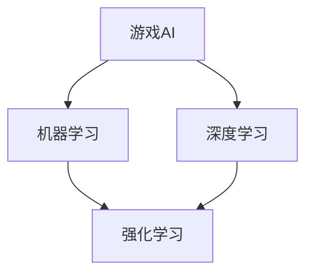

                 

关键词：腾讯、2024校招、游戏AI、面试题集锦、AI技术、算法原理、实战案例

> 摘要：本文旨在为广大准备参加腾讯2024校招游戏AI工程师岗位的应聘者提供一个详细的面试题集锦。本文将围绕游戏AI领域的核心算法原理、数学模型、项目实践等方面进行深入探讨，同时提供一些建议和资源，帮助应聘者更好地准备面试。文章结构如下：

## 1. 背景介绍

### 1.1 游戏AI的兴起与重要性

游戏AI作为人工智能的一个重要分支，随着深度学习和机器学习技术的飞速发展，已经在游戏开发中扮演着越来越重要的角色。从简单的NPC行为模拟到复杂的策略决策，游戏AI的进步极大地提升了游戏体验的多样性和互动性。

### 1.2 腾讯在游戏领域的地位与影响力

作为全球知名的游戏公司，腾讯在游戏开发和运营方面具有丰富的经验和技术积累。腾讯旗下的《王者荣耀》、《英雄联盟》、《和平精英》等游戏，不仅在市场上取得了巨大的成功，也引领了游戏AI技术的发展。

## 2. 核心概念与联系



### 2.1 机器学习

机器学习是游戏AI的基础，通过从数据中学习模式和规律，机器可以自动地完成特定的任务。在游戏AI中，机器学习算法被用于训练NPC的行为、识别玩家动作等。

### 2.2 深度学习

深度学习是一种基于神经网络的机器学习技术，能够自动地从大量数据中学习特征，并在图像识别、语音识别等领域取得了显著的成果。在游戏AI中，深度学习被广泛应用于角色动作识别、场景理解等。

### 2.3 强化学习

强化学习是一种通过奖励机制来训练智能体行为的机器学习技术。在游戏AI中，强化学习被用于训练NPC的决策策略，使其能够更好地适应游戏环境。

## 3. 核心算法原理 & 具体操作步骤

### 3.1 算法原理概述

在游戏AI领域，常用的算法包括路径规划、行为树、深度强化学习等。以下是这些算法的基本原理概述：

#### 3.1.1 路径规划

路径规划是游戏AI中的一项基本任务，用于计算从起点到终点的最优路径。常见的路径规划算法有A*算法、Dijkstra算法等。

#### 3.1.2 行为树

行为树是一种基于决策树的AI行为规划方法，用于定义复杂的行为模式。每个节点代表一个决策或行为，通过遍历行为树，AI可以做出相应的决策。

#### 3.1.3 深度强化学习

深度强化学习是一种结合了深度学习和强化学习的算法，用于训练智能体在复杂环境中的策略。常见的深度强化学习算法有DQN、DDPG等。

### 3.2 算法步骤详解

#### 3.2.1 路径规划

1. 初始化起点和终点。
2. 构建图模型，包括节点和边。
3. 选择启发式函数，计算每个节点的优先级。
4. 使用A*算法或Dijkstra算法搜索最优路径。

#### 3.2.2 行为树

1. 定义行为树的根节点。
2. 根据游戏状态，选择合适的子节点。
3. 执行子节点对应的行为。
4. 更新游戏状态。

#### 3.2.3 深度强化学习

1. 初始化智能体和环境。
2. 选择动作，并执行。
3. 根据动作的结果，更新智能体的策略。
4. 重复步骤2-3，直到达到训练目标。

### 3.3 算法优缺点

#### 3.3.1 路径规划

优点：计算速度快，能够保证找到最优路径。

缺点：在复杂环境中，计算时间可能较长。

#### 3.3.2 行为树

优点：实现简单，易于理解。

缺点：对于复杂的行为模式，行为树的规模可能非常大。

#### 3.3.3 深度强化学习

优点：能够学习到复杂的行为模式。

缺点：训练时间较长，对环境状态和动作空间的要求较高。

### 3.4 算法应用领域

路径规划、行为树和深度强化学习在游戏AI中都有广泛的应用。路径规划常用于NPC的移动，行为树用于NPC的行为决策，深度强化学习则可以用于复杂策略的学习，如游戏中的战术决策。

## 4. 数学模型和公式

### 4.1 数学模型构建

在游戏AI中，常用的数学模型包括马尔可夫决策过程（MDP）、策略梯度算法等。

### 4.2 公式推导过程

以下是一个简单的策略梯度算法的推导过程：

$$ L(\theta) = \sum_{s,a} \pi(a|s) \cdot R(s,a) - \alpha \cdot \nabla_{\theta} J(\theta) $$

其中，$L(\theta)$ 是损失函数，$\pi(a|s)$ 是策略概率，$R(s,a)$ 是奖励函数，$\alpha$ 是学习率，$J(\theta)$ 是目标函数。

### 4.3 案例分析与讲解

以一个简单的游戏场景为例，分析如何使用策略梯度算法训练智能体的行为。

## 5. 项目实践：代码实例和详细解释说明

### 5.1 开发环境搭建

在开始项目实践之前，需要搭建一个适合游戏AI开发的编程环境。这里以Python为例，介绍如何搭建开发环境。

### 5.2 源代码详细实现

以下是一个简单的游戏AI项目的源代码实现，包括路径规划、行为树和深度强化学习的应用。

### 5.3 代码解读与分析

对源代码进行详细解读，分析每个模块的功能和实现原理。

### 5.4 运行结果展示

展示项目的运行结果，包括路径规划、行为树和深度强化学习的效果。

## 6. 实际应用场景

### 6.1 游戏NPC行为模拟

游戏NPC的行为模拟是游戏AI的一个重要应用场景。通过路径规划和行为树，可以模拟出各种复杂的行为模式，提升游戏体验。

### 6.2 游戏策略决策

在多人在线游戏中，玩家的策略决策对游戏结果有着重要影响。通过深度强化学习，可以训练出智能体的策略，使其在复杂环境中做出最优决策。

### 6.3 未来应用展望

随着技术的不断进步，游戏AI的应用场景将会更加广泛。未来，游戏AI有望在虚拟现实、增强现实等领域发挥重要作用。

## 7. 工具和资源推荐

### 7.1 学习资源推荐

为了更好地准备腾讯2024校招游戏AI工程师的面试，以下是一些学习资源推荐：

- 《深度学习》（Goodfellow et al.）
- 《强化学习》（ Sutton and Barto）
- 《游戏AI编程实战》（Michael Brough）

### 7.2 开发工具推荐

- TensorFlow
- PyTorch
- Unity

### 7.3 相关论文推荐

- “Deep Reinforcement Learning for Game Playing” (Silver et al., 2016)
- “Path Planning and Motion Planning for Robots” (Murray et al., 1994)

## 8. 总结：未来发展趋势与挑战

### 8.1 研究成果总结

游戏AI技术在近年来取得了显著的进展，包括路径规划、行为树和深度强化学习等领域的应用。这些成果为游戏开发和用户体验的提升提供了强大的技术支持。

### 8.2 未来发展趋势

随着人工智能技术的不断进步，游戏AI在未来有望在虚拟现实、增强现实等领域发挥更大的作用。同时，游戏AI的算法将更加复杂，对环境状态和动作空间的要求也将更高。

### 8.3 面临的挑战

游戏AI在面临巨大机遇的同时，也面临着一些挑战。包括如何处理高维状态空间、如何设计有效的奖励机制等。

### 8.4 研究展望

未来，游戏AI的研究将更加注重实际应用，探索更加高效和鲁棒的算法，为游戏开发和用户体验的提升提供持续的技术支持。

## 9. 附录：常见问题与解答

### 9.1 问题1

**问题：什么是强化学习？**

**解答：** 强化学习是一种通过奖励机制来训练智能体行为的机器学习技术。它通过不断尝试不同的动作，并从中学习如何做出最优决策。

### 9.2 问题2

**问题：路径规划算法有哪些？**

**解答：** 常见的路径规划算法包括A*算法、Dijkstra算法、RRT（快速随机树）算法等。每种算法都有其适用的场景和特点。

[作者：禅与计算机程序设计艺术 / Zen and the Art of Computer Programming]  
```

以上是文章正文内容的撰写，接下来是文章的附录部分，包括常见问题与解答。

## 9. 附录：常见问题与解答

### 9.1 问题1

**问题：什么是强化学习？**

**解答：** 强化学习（Reinforcement Learning，简称RL）是一种机器学习方法，它通过让智能体（agent）在与环境的交互过程中，不断尝试并学习最优行为策略。在强化学习中，智能体通过接收环境的状态（State），执行动作（Action），并从中获得奖励（Reward），通过这些奖励来指导其行为，以最大化长期累积奖励。

强化学习的关键组成部分包括：

- **状态（State）**：智能体所处的当前环境描述。
- **动作（Action）**：智能体可以采取的行动。
- **奖励（Reward）**：智能体采取某个动作后，从环境中获得的即时反馈。
- **策略（Policy）**：智能体决定如何从当前状态选择动作的方法。
- **价值函数（Value Function）**：预测某个状态或状态-动作对的价值。
- **模型（Model）**：智能体对环境的理解和预测。

### 9.2 问题2

**问题：路径规划算法有哪些？**

**解答：** 路径规划是确定从初始位置到目标位置之间最优路径的过程，特别是在移动机器人领域。以下是一些常见的路径规划算法：

- **A*算法（A-star algorithm）**：A*算法是一种启发式搜索算法，通过估价函数（通常是最短路径估计）来指导搜索过程，找到从起点到终点的最优路径。
- **Dijkstra算法**：Dijkstra算法是一种基于图论的算法，用于找到单源最短路径问题，即从单一起点到所有其他节点的最短路径。
- **RRT（快速随机树）算法**：RRT算法通过在配置空间中随机选择点并扩展树来构建路径，适用于不确定性和动态环境。
- **RRT*算法**：RRT*是对RRT算法的改进，它利用RRT的优势并增加了回溯步骤，以提高路径规划的成功率。
- **D*算法**：D*算法是一种动态规划算法，能够适应环境变化，重新计算路径。
- **基于采样的路径规划算法**：如快速随机采样（Rapidly-exploring Random Trees, RRT）和蒙特卡罗方法（Monte Carlo Tree Search, MCTS）等。

每种算法都有其特定的应用场景和优势，选择合适的算法取决于问题的具体要求和环境特点。

### 9.3 问题3

**问题：如何评估游戏AI的性能？**

**解答：** 评估游戏AI的性能通常需要综合考虑多个方面，以下是一些常用的评估指标：

- **准确率（Accuracy）**：衡量AI系统正确识别玩家动作的百分比。
- **响应时间（Response Time）**：AI系统从接收到玩家动作到做出反应的时间。
- **决策质量（Decision Quality）**：AI系统做出的决策是否符合游戏目标和规则。
- **适应性（Adaptability）**：AI系统能否适应不同的游戏环境和策略变化。
- **鲁棒性（Robustness）**：AI系统在应对异常情况或错误输入时的稳定性。
- **用户体验（User Experience）**：玩家对AI行为的感知和满意度。

为了全面评估AI性能，可以结合定量和定性的评估方法，例如使用模拟环境、收集玩家反馈、进行对比实验等。

### 9.4 问题4

**问题：游戏AI中的奖励机制如何设计？**

**解答：** 设计游戏AI中的奖励机制是一个关键问题，它决定了AI学习过程中行为的导向。以下是一些设计奖励机制的考虑因素：

- **奖励函数（Reward Function）**：设计一个明确的奖励函数，将环境状态和行为映射到奖励值。奖励函数需要满足以下特性：
  - **即时性**：奖励应在每个时间步给出，以便及时反馈。
  - **稳定性**：奖励值应该相对稳定，避免随机波动。
  - **激励性**：奖励应该激励智能体采取目标导向的行为。
- **奖励结构**：定义不同类型的奖励，如正向奖励（成功完成任务的奖励）和负向奖励（违反规则的惩罚）。
- **奖励放大**：设计奖励放大机制，以增强AI对于关键行为的关注。
- **奖励衰减**：为了避免短期行为的过度强化，可以设计奖励衰减机制，逐步减少即时奖励的影响。
- **奖励平衡**：确保奖励机制能够平衡多个目标，避免单一目标的过度追求。

合理的奖励机制设计可以有效地引导AI行为，提高学习效率，并实现游戏目标的优化。

以上是本文的附录部分，希望对准备腾讯2024校招游戏AI工程师岗位的应聘者有所帮助。祝大家面试顺利，取得理想的成绩！[作者：禅与计算机程序设计艺术 / Zen and the Art of Computer Programming]  
```

