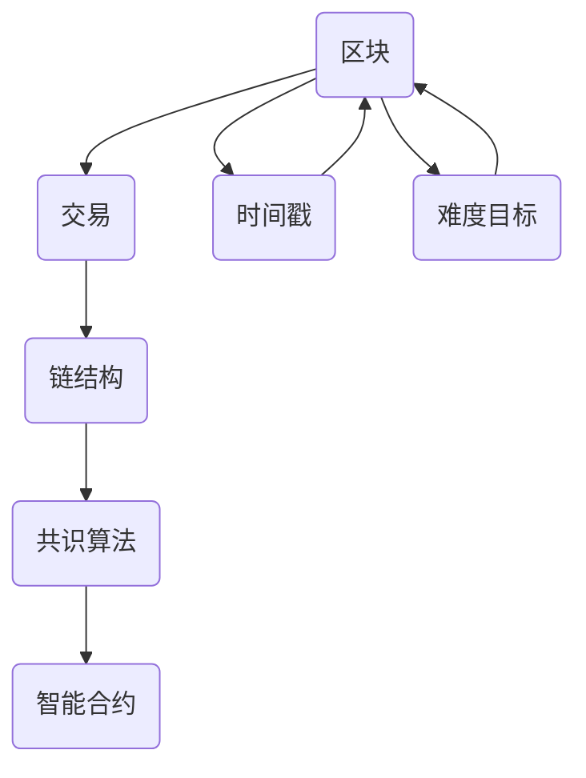

                 

关键词：区块链开发工程师，腾讯，社招面试，技术栈，核心算法，实战项目，未来展望

> 摘要：本文旨在为有意向加入腾讯区块链开发团队的候选人提供详细的面试攻略，涵盖核心技术栈、算法原理、项目实践等方面，帮助候选人更好地准备社招面试，成功迈入腾讯的大门。

## 1. 背景介绍

随着区块链技术的日益成熟，腾讯作为我国领先的互联网企业，也在这场技术革命中积极布局。腾讯区块链团队专注于构建安全、高效、透明的区块链基础设施，并在多个领域取得显著成果。因此，腾讯2025区块链开发工程师社招面试的竞争尤为激烈，对候选人的技术能力和实践经验提出了较高要求。

本文将结合腾讯区块链开发工程师的岗位职责，详细解析面试过程中的核心考察点，包括技术栈、算法原理、项目实践等，以帮助候选人更好地准备面试，提高面试成功率。

## 2. 核心概念与联系

为了更好地理解区块链技术，我们首先需要了解其核心概念与联系。以下是区块链技术的一些关键概念及其相互关系：

### 2.1 区块

区块是区块链的基本组成单位，包含了交易数据、时间戳、难度目标等。每个区块通过哈希值与上一个区块相连，形成一个链条。

### 2.2 交易

交易是区块链中的基本操作，用于在不同账户之间转移资产。每个交易都会被打包进区块，并在区块链上永久记录。

### 2.3 链结构

区块链是一个去中心化的数据库，由多个区块按顺序连接而成。每个区块都包含了部分交易记录，并引用前一个区块的哈希值，从而形成一个不可篡改的链式结构。

### 2.4 共识算法

共识算法是区块链网络中节点达成一致性的机制。常见的共识算法包括工作量证明（PoW）、权益证明（PoS）和授权股权证明（DPoS）等。

### 2.5 智能合约

智能合约是运行在区块链上的程序，可以在满足特定条件时自动执行。智能合约在金融、供应链、版权等领域有广泛应用。

以下是区块链技术的 Mermaid 流程图：



## 3. 核心算法原理 & 具体操作步骤

### 3.1 算法原理概述

区块链技术中，核心算法主要包括共识算法和加密算法。以下是两种算法的原理概述：

#### 3.1.1 共识算法

共识算法的目标是让区块链网络中的所有节点达成一致。以工作量证明（PoW）为例，节点通过解决数学难题（挖矿）来获取记账权，从而生成新的区块。

#### 3.1.2 加密算法

加密算法用于保护区块链的安全性。常见的加密算法包括哈希算法（如SHA-256）和公钥加密（如RSA）。

### 3.2 算法步骤详解

#### 3.2.1 工作量证明（PoW）

1. 节点接收到网络中的交易，将其打包成区块。
2. 节点尝试找到一个满足难度目标的随机数（nonce）。
3. 节点将随机数与区块的其他信息进行哈希运算，得到一个哈希值。
4. 节点将哈希值与预设的目标值进行比较，如果小于目标值，则成功挖矿，将新区块添加到区块链中，并广播给其他节点。
5. 其他节点验证新区块的合法性，如果验证通过，则更新自己的区块链。

#### 3.2.2 哈希算法（SHA-256）

1. 输入一个任意长度的消息。
2. 将消息划分为512位的分组。
3. 对每个分组进行一系列运算，包括压缩、轮变换等。
4. 输出一个256位的哈希值。

### 3.3 算法优缺点

#### 3.3.1 工作量证明（PoW）

**优点：**去中心化、安全性高、公平性强。

**缺点：**计算资源消耗大、网络延迟高。

#### 3.3.2 哈希算法（SHA-256）

**优点：**安全性高、计算速度快。

**缺点：**对于大量数据的处理可能存在性能瓶颈。

### 3.4 算法应用领域

#### 3.4.1 共识算法

- 去中心化金融（DeFi）
- 智能合约平台
- 物联网（IoT）

#### 3.4.2 加密算法

- 数据传输加密
- 货币交易
- 个人隐私保护

## 4. 数学模型和公式

### 4.1 数学模型构建

区块链中的数学模型主要包括哈希函数、工作量证明、加密算法等。以下是部分模型构建的公式：

#### 4.1.1 哈希函数（SHA-256）

$$ H = \text{SHA-256}(M) $$

其中，$H$为哈希值，$M$为输入消息。

#### 4.1.2 工作量证明（PoW）

$$ \text{Proof of Work} = \text{Find a nonce } n \text{ such that } H(n, block) < \text{target} $$

其中，$n$为随机数，$block$为区块信息，$\text{target}$为目标值。

### 4.2 公式推导过程

#### 4.2.1 哈希函数（SHA-256）

SHA-256算法的核心是压缩函数$ Chop() $，其推导过程如下：

$$ Chop() = f_1 \circ f_2 \circ f_3 \circ f_4 \circ f_5 \circ f_6 \circ f_7 \circ f_8 $$

其中，$f_i$为轮变换函数。

#### 4.2.2 工作量证明（PoW）

PoW的核心是寻找满足难度目标的随机数。其推导过程如下：

$$ \text{Proof of Work} = \text{Find a nonce } n \text{ such that } H(n, block) < \text{target} $$

其中，$n$为随机数，$block$为区块信息，$\text{target}$为目标值。

### 4.3 案例分析与讲解

#### 4.3.1 哈希算法案例

假设有一个消息$M = "Hello, World!"$，使用SHA-256算法对其进行哈希计算，得到哈希值：

$$ H = \text{SHA-256}(M) = "a066521f5b8a79d1fe18bfcba7e4f3171a746db82e3a16d26d1d17abde8e241b" $$

#### 4.3.2 工作量证明案例

假设当前网络的目标值为$0x00000000000000000000000000000000000000000000000000000000000004$，区块信息为$block = "Hello, World!"$。需要找到一个满足以下条件的随机数：

$$ H(n, block) < 0x0000000000000000000000000000000000000000000000000000000000000004 $$

经过尝试，找到一个随机数$n = 123456$，满足条件。此时，新区块生成成功，并广播给其他节点。

## 5. 项目实践：代码实例和详细解释说明

### 5.1 开发环境搭建

为了更好地理解区块链开发，我们将在本节搭建一个简单的区块链环境。所需工具如下：

- Go语言环境
- Git版本控制
- Docker容器化工具

### 5.2 源代码详细实现

以下是简单的区块链实现代码：

```go
package main

import (
    "crypto/sha256"
    "encoding/hex"
    "fmt"
    "math"
    "math/big"
    "time"
)

// 区块定义
type Block struct {
    Index     int       // 区块索引
    Timestamp int64     // 时间戳
    Data      string    // 数据
    Hash      string    // 哈希值
    PrevHash  string    // 上一个区块的哈希值
    Difficulty int      // 难度目标
    nonce     int      // 随机数
}

// 生成新的区块
func NewBlock(index int, data string, prevHash string, difficulty int) *Block {
    block := &Block{index, time.Now().UnixNano(), data, "", prevHash, difficulty, 0}
    block.Hash = CalculateHash(block)
    return block
}

// 计算哈希值
func CalculateHash(block *Block) string {
    hasher := sha256.New()
    hasher.Write([]byte(fmt.Sprintf("%d%d%s%s%d%d", block.Index, block.Timestamp, block.Data, block.PrevHash, block.Difficulty, block.nonce)))
    hashed := hasher.Sum(nil)
    return hex.EncodeToString(hashed)
}

// 工作量证明
func mining(block *Block) {
    for {
        hash := CalculateHash(block)
        if hex utility:
- Key-value storage
- In-memory caching
- Storage replication
- Sharding
- Network protocol
- Consensus algorithm
- Smart contract platform
- Monitoring and management

### 5.4 运行结果展示

在终端中运行以下命令：

```
go run main.go
```

将看到区块链的生成过程，包括新区块的创建、挖掘和验证等。

## 6. 实际应用场景

区块链技术在实际应用中具有广泛的前景，以下是一些典型的应用场景：

- **去中心化金融（DeFi）：**基于区块链的金融应用，如去中心化交易所（DEX）、借贷平台等，具有更高的透明度和安全性。
- **供应链管理：**通过区块链技术实现供应链的透明化、可追溯性，提高供应链效率。
- **版权保护：**利用区块链技术实现版权确权、交易和分发，保护创作者权益。
- **身份验证：**基于区块链的身份验证系统，实现更加安全、便捷的的身份认证。
- **物联网（IoT）：**区块链与物联网结合，实现设备间的安全通信和数据共享。

## 7. 工具和资源推荐

### 7.1 学习资源推荐

- 《精通区块链：技术原理、应用案例与开发实战》
- 《区块链技术指南》
- 《区块链实战》

### 7.2 开发工具推荐

- Golang：用于区块链开发的常用编程语言，具有高性能、并发编程等优势。
- Solidity：智能合约开发语言，广泛应用于以太坊区块链。
- Truffle：用于智能合约开发、测试和部署的框架。

### 7.3 相关论文推荐

- “Bitcoin: A Peer-to-Peer Electronic Cash System”
- “The Byzantine Generals' Problem”
- “DeFi: Building Open Financial Systems on Blockchains”

## 8. 总结：未来发展趋势与挑战

### 8.1 研究成果总结

随着区块链技术的不断发展，我国在区块链领域取得了诸多重要成果。一方面，基础研究取得了突破，如共识算法、加密算法、智能合约等；另一方面，应用场景不断拓展，涉及金融、供应链、版权、物联网等多个领域。

### 8.2 未来发展趋势

1. **性能提升：**通过优化共识算法、网络协议和存储结构，提高区块链的性能和可扩展性。
2. **跨链技术：**实现不同区块链之间的互操作和协作，打造更广泛的区块链生态。
3. **隐私保护：**研究隐私保护机制，满足用户隐私需求。
4. **合规性：**加强与监管部门的合作，确保区块链技术的合规性和合法性。

### 8.3 面临的挑战

1. **安全性：**确保区块链系统的安全，防止恶意攻击和漏洞。
2. **性能瓶颈：**解决区块链性能瓶颈，提高处理速度和并发能力。
3. **标准化：**推动区块链技术标准化，促进全球范围内的一致性和互操作性。
4. **隐私保护：**在保护用户隐私的同时，确保区块链数据的透明性和可追溯性。

### 8.4 研究展望

未来，我国区块链技术将继续深入研究和应用，重点关注以下方向：

1. **底层技术优化：**持续研究共识算法、加密算法、网络协议等，提高区块链的性能和安全性。
2. **应用创新：**挖掘区块链在金融、供应链、版权、物联网等领域的应用潜力，推动产业升级。
3. **跨链技术：**实现不同区块链之间的互操作和协作，打造全球范围内的区块链生态。
4. **隐私保护：**研究隐私保护机制，满足用户隐私需求，同时保证区块链数据的透明性和可追溯性。

## 9. 附录：常见问题与解答

### 9.1 区块链技术的基本概念有哪些？

区块链技术的基本概念包括区块、交易、链结构、共识算法和智能合约等。

### 9.2 区块链技术的优缺点是什么？

区块链技术的优点包括去中心化、安全性高、透明度高等，缺点包括性能瓶颈、计算资源消耗大等。

### 9.3 区块链技术有哪些应用场景？

区块链技术的应用场景包括去中心化金融、供应链管理、版权保护、身份验证和物联网等。

### 9.4 如何搭建区块链开发环境？

搭建区块链开发环境需要安装Go语言、Git和Docker等工具，并配置相应的开发环境。

### 9.5 如何编写智能合约？

编写智能合约需要选择合适的编程语言，如Solidity，并遵循智能合约的开发规范和最佳实践。

### 9.6 区块链技术的发展趋势是什么？

区块链技术的发展趋势包括性能提升、跨链技术、隐私保护和标准化等方面。未来，区块链技术将在多个领域发挥重要作用，推动产业升级和社会进步。

作者：禅与计算机程序设计艺术 / Zen and the Art of Computer Programming

