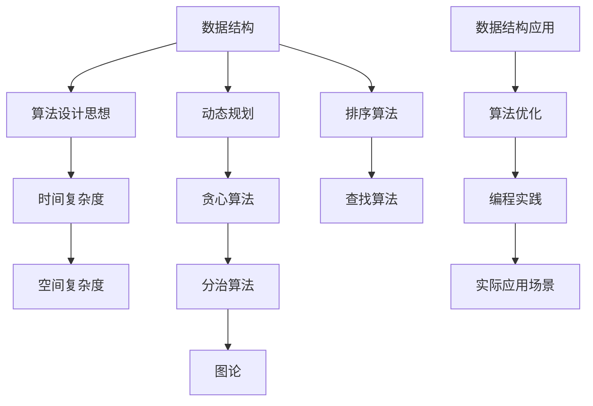

                 

### 1. 背景介绍

随着互联网和大数据技术的发展，算法在各个行业中的应用越来越广泛，尤其是在互联网公司。腾讯作为中国最具影响力的互联网公司之一，其社招面试中对算法题的考察更是备受关注。本文将针对腾讯2025届社招面试中高频出现的算法题进行详细解析，旨在帮助读者深入理解这些算法题的解题思路和方法。

算法作为计算机科学的核心学科，不仅涵盖了数据结构和算法设计，还涉及到数学建模、概率论、图论等多个领域。腾讯作为互联网公司，其业务涵盖了社交、游戏、金融等多个方面，因此在面试中会对应聘者的算法能力进行全面的考察。高频算法题的出现，不仅反映了腾讯对技术的要求，也体现了互联网行业对优秀算法人才的渴求。

本文旨在通过以下章节对腾讯2025届社招面试中的高频算法题进行解析：

## 1. 背景介绍
## 2. 核心概念与联系
## 3. 核心算法原理 & 具体操作步骤
## 4. 数学模型和公式 & 详细讲解 & 举例说明
## 5. 项目实践：代码实例和详细解释说明
## 6. 实际应用场景
## 7. 工具和资源推荐
## 8. 总结：未来发展趋势与挑战
## 9. 附录：常见问题与解答

通过这些章节，读者可以系统地了解腾讯社招面试中的高频算法题，掌握解题方法，提升自己的算法能力。

### 2. 核心概念与联系

在深入探讨腾讯2025届社招面试中的高频算法题之前，我们需要了解一些核心概念和它们之间的联系。这些概念包括但不限于：数据结构、算法设计思想、时间复杂度和空间复杂度、动态规划、贪心算法、分治算法、图论等。下面，我们将通过Mermaid流程图来直观地展示这些核心概念及其相互联系。



- **数据结构（A）**：数据结构是存储数据的方式，包括数组、链表、栈、队列、树、图等。它是算法设计的基础，决定了算法的空间和时间效率。
- **算法设计思想（B）**：算法设计思想是指解决特定问题的方法论，如动态规划、贪心算法、分治算法等。这些思想指导我们如何有效地设计算法。
- **时间复杂度（C）和空间复杂度（D）**：时间复杂度和空间复杂度是评估算法效率的重要指标。它们分别表示算法运行时间和占用内存的大小，通常用大O符号表示。
- **动态规划（E）、贪心算法（F）、分治算法（G）**：这三种算法设计思想在解决复杂问题时有着不同的应用场景。动态规划适合求解最优子结构问题，贪心算法适合求解局部最优问题，分治算法适合求解可递归分解的问题。
- **图论（H）**：图论是研究图形及其属性的数学分支，广泛应用于网络设计、社会网络分析等领域。
- **排序算法（I）和查找算法（J）**：排序算法用于对数据进行排序，查找算法用于在数据中查找特定元素。它们是算法设计中的基础内容。
- **数据结构应用（K）、算法优化（L）、编程实践（M）、实际应用场景（N）**：数据结构和算法设计思想在实际编程应用中有着广泛的应用，算法优化则旨在提高算法的效率和可扩展性。

通过上述Mermaid流程图，我们可以清晰地看到这些核心概念之间的联系，为后续对高频算法题的解析奠定了基础。

### 3. 核心算法原理 & 具体操作步骤

在了解了核心概念之后，接下来我们将深入探讨腾讯2025届社招面试中的核心算法题，具体包括以下几类：

#### 3.1 排序算法

排序算法是算法面试中的常见题型，常见的排序算法有冒泡排序、选择排序、插入排序、快速排序、归并排序、堆排序等。下面以快速排序为例，介绍其算法原理和操作步骤。

#### 3.1.1 算法原理概述

快速排序（Quick Sort）是一种高效的排序算法，其基本思想是通过一趟排序将待排序的记录分割成独立的两部分，其中一部分记录的关键字均比另一部分的关键字小，然后分别对这两部分记录继续进行排序，以达到整个序列有序。

#### 3.1.2 算法步骤详解

1. **选择基准元素**：从数组中选取一个元素作为基准（pivot），通常选择数组的第一元素或中间元素。
2. **划分操作**：将数组划分为两个子数组，所有比基准元素小的元素放在左边，所有比基准元素大的元素放在右边。
3. **递归排序**：分别对左右两个子数组递归进行快速排序。

#### 3.1.3 算法优缺点

- **优点**：快速排序的时间复杂度平均为O(nlogn)，在大部分情况下比其他排序算法更快。
- **缺点**：最坏情况下（数组已经有序或近乎有序）时间复杂度为O(n^2)，需要优化处理。

#### 3.1.4 算法应用领域

快速排序广泛应用于各种场景，如计算机科学中的排序算法比较、数据处理、数据分析等。

#### 3.2 查找算法

查找算法用于在数据中查找特定元素，常见的查找算法有二分查找、哈希查找等。下面以二分查找为例，介绍其算法原理和操作步骤。

#### 3.2.1 算法原理概述

二分查找（Binary Search）是一种高效的查找算法，其基本思想是按照一定的规则将有序数组分为两部分，确定查找元素可能存在于哪一部分，然后逐步缩小查找范围。

#### 3.2.2 算法步骤详解

1. **确定查找范围**：初始查找范围为整个数组。
2. **计算中间位置**：计算当前查找范围的中间位置。
3. **比较与调整范围**：将查找元素与中间位置的元素进行比较，根据比较结果调整查找范围。
4. **重复步骤2和3**：直到找到目标元素或查找范围为空。

#### 3.2.3 算法优缺点

- **优点**：二分查找的时间复杂度为O(logn)，在数据量较大的情况下效率较高。
- **缺点**：查找算法只适用于有序数据，需要额外的排序操作。

#### 3.2.4 算法应用领域

二分查找广泛应用于计算机科学中的数据检索、排序、算法分析等领域。

#### 3.3 动态规划

动态规划（Dynamic Programming）是一种解决最优化问题的算法思想，适用于具有最优子结构性质的问题。下面以最长公共子序列（LCSS）为例，介绍其算法原理和操作步骤。

#### 3.3.1 算法原理概述

最长公共子序列（Longest Common Subsequence，LCSS）是指两个序列中具有最长相同顺序的子序列。动态规划通过将问题分解为子问题，并利用子问题的解推导出原问题的解。

#### 3.3.2 算法步骤详解

1. **定义状态**：定义两个状态数组`dp[i][j]`，表示序列A的前i个字符和序列B的前j个字符的最长公共子序列长度。
2. **状态转移方程**：根据当前字符是否相同，定义状态转移方程：
   - 如果相同，`dp[i][j] = dp[i-1][j-1] + 1`
   - 如果不同，`dp[i][j] = max(dp[i-1][j], dp[i][j-1])`
3. **计算结果**：从`dp[m][n]`开始，逐步回溯得到最长公共子序列。

#### 3.3.3 算法优缺点

- **优点**：动态规划能够高效地解决最优化问题，具有明确的递推关系。
- **缺点**：动态规划的实现较为复杂，需要定义多个状态和状态转移方程。

#### 3.3.4 算法应用领域

动态规划广泛应用于计算机科学中的字符串处理、图形算法、数学优化等领域。

通过以上对排序算法、查找算法和动态规划的详细解析，我们可以看到这些算法在腾讯2025届社招面试中的重要性。掌握这些算法的原理和操作步骤，有助于我们在面试中更好地应对各种算法题。

### 3.4 算法优缺点

在了解了排序算法、查找算法和动态规划的具体操作步骤后，我们接下来分析这些算法的优缺点。通过对比不同算法在时间复杂度、空间复杂度和适用场景等方面的表现，我们可以更全面地理解每种算法的优势和局限性。

#### 3.4.1 排序算法

1. **冒泡排序**：
   - **优点**：实现简单，易于理解。
   - **缺点**：时间复杂度较高，为O(n^2)，不适合大规模数据排序。
2. **选择排序**：
   - **优点**：同样实现简单，易于理解。
   - **缺点**：时间复杂度较高，为O(n^2)，不稳定排序，不适合大规模数据排序。
3. **插入排序**：
   - **优点**：在部分有序的数据上性能较好，时间复杂度较低，为O(n)。
   - **缺点**：时间复杂度较高，为O(n^2)，不适合大规模数据排序。
4. **快速排序**：
   - **优点**：平均时间复杂度为O(nlogn)，在大多数情况下性能优异。
   - **缺点**：最坏情况下时间复杂度为O(n^2)，需要优化处理。
5. **归并排序**：
   - **优点**：时间复杂度稳定为O(nlogn)，适合大规模数据排序。
   - **缺点**：需要额外的空间存储临时数组，空间复杂度为O(n)。

#### 3.4.2 查找算法

1. **线性查找**：
   - **优点**：实现简单，适合小规模数据查找。
   - **缺点**：时间复杂度为O(n)，效率较低。
2. **二分查找**：
   - **优点**：时间复杂度为O(logn)，在数据量较大的情况下效率较高。
   - **缺点**：只适用于有序数据，需要额外的排序操作。
3. **哈希查找**：
   - **优点**：平均时间复杂度为O(1)，适用于大规模数据查找。
   - **缺点**：实现复杂，需要考虑哈希冲突问题。

#### 3.4.3 动态规划

1. **动态规划**：
   - **优点**：能够高效地解决最优化问题，具有明确的递推关系。
   - **缺点**：实现复杂，需要定义多个状态和状态转移方程。

#### 3.4.4 算法应用领域

1. **排序算法**：
   - **应用领域**：计算机科学中的排序算法比较、数据处理、数据分析等。
   - **适用场景**：适合大规模数据的排序，快速排序和归并排序在性能上有显著优势。
2. **查找算法**：
   - **应用领域**：数据检索、排序、算法分析等。
   - **适用场景**：二分查找在数据量较大的情况下效率较高，哈希查找适用于大规模数据。
3. **动态规划**：
   - **应用领域**：字符串处理、图形算法、数学优化等。
   - **适用场景**：适合具有最优子结构性质的问题，如最长公共子序列、背包问题等。

通过上述分析，我们可以看到不同算法在性能、实现复杂度和应用领域方面存在显著差异。了解这些优缺点，有助于我们在实际应用中根据具体场景选择合适的算法，优化系统性能。

### 3.5 算法应用领域

算法作为计算机科学的重要组成部分，在各个领域中都有着广泛的应用。以下将介绍排序算法、查找算法和动态规划在几个主要领域的应用，以及这些算法在实际应用中的重要性。

#### 3.5.1 数据处理与优化

排序算法和查找算法在数据处理和优化中发挥着关键作用。在数据库管理系统中，排序算法常用于数据排序和索引创建，以提高查询效率。例如，在MySQL数据库中，B-Tree索引使用了排序树结构，使得查询时间复杂度降低至O(logn)。此外，查找算法如二分查找和哈希查找在数据库中的查询操作中也起到至关重要的作用。

在数据处理过程中，动态规划技术也广泛应用于数据分析和优化。例如，在社交媒体平台中，动态规划可以用于用户行为的分析，通过优化用户推荐算法，提高用户满意度和活跃度。

#### 3.5.2 图形处理

图形处理领域对算法的需求尤为突出。排序算法在图形渲染中用于顶点排序，以确保渲染顺序正确。例如，在三维图形渲染中，顶点排序可以优化光照计算和阴影处理，提高渲染效率。

查找算法在图形处理中的应用也非常广泛，如二维四叉树和八叉树的使用，用于空间数据的高效查询和渲染。这些数据结构可以显著降低图形查询和渲染的时间复杂度，提高渲染性能。

动态规划在图形处理中的应用也不容忽视。例如，在路径规划算法中，动态规划可以通过计算子路径的最优解，找到从起点到终点的最优路径，如Dijkstra算法和A*算法。

#### 3.5.3 机器学习和人工智能

机器学习和人工智能领域对算法的依赖性极高。排序算法在数据预处理阶段用于特征排序，以提高模型训练效率。例如，在深度学习模型训练中，数据集的排序可以优化梯度下降算法的收敛速度。

查找算法在机器学习中的应用也十分广泛，如快速查找最近邻算法（KNN）和哈希查找算法（哈希分类器），用于分类和聚类任务。这些算法可以高效地处理大规模数据集，提高模型预测准确率。

动态规划在机器学习和人工智能中的应用主要体现在优化算法设计。例如，在强化学习领域，动态规划可以通过计算状态值函数和策略值函数，找到最优策略。此外，动态规划技术也被应用于生成对抗网络（GAN）的训练中，优化模型生成效果。

#### 3.5.4 实际应用场景

1. **搜索引擎**：搜索引擎中广泛使用排序算法和查找算法，如二分查找和哈希查找，以高效处理用户查询和索引管理。

2. **社交网络**：在社交网络中，排序算法用于用户推荐、好友关系排序等，以提高用户体验。动态规划技术可用于优化推荐算法，提高推荐准确率。

3. **电子商务**：电子商务平台中，排序算法和查找算法用于商品排序和库存管理，以提高用户购物体验。动态规划技术可用于优化库存优化策略，降低库存成本。

4. **金融领域**：金融领域中的算法应用包括风险评估、投资组合优化等。动态规划在优化投资策略和提高风险管理水平方面具有重要作用。

5. **游戏开发**：游戏开发中，算法用于路径规划、碰撞检测、物理引擎优化等，以提高游戏性能和用户体验。

总之，排序算法、查找算法和动态规划在各个领域的应用具有广泛性和重要性。掌握这些算法，不仅有助于提升编程技能，还能在实际项目中实现性能优化和算法创新，为各行业的发展注入新动力。

### 4. 数学模型和公式 & 详细讲解 & 举例说明

在算法设计和分析中，数学模型和公式是至关重要的工具，它们帮助我们理解和优化算法性能。以下将介绍一些常见的数学模型和公式，并详细讲解其推导过程和具体应用。

#### 4.1 数学模型构建

数学模型构建是算法分析的基础，它帮助我们将实际问题转化为数学形式，以便于分析和求解。常见的数学模型包括线性模型、非线性模型、离散模型和连续模型等。以下是一个简单的线性模型示例：

**线性模型**：
$$y = ax + b$$

其中，$y$是因变量，$x$是自变量，$a$和$b$是参数。这个模型表示因变量$y$与自变量$x$之间存在线性关系，$a$是斜率，表示$x$每增加一个单位，$y$增加的量；$b$是截距，表示当$x=0$时，$y$的值。

#### 4.2 公式推导过程

**二分查找公式**：

二分查找算法的时间复杂度可以通过数学公式推导得到。假设有一个长度为$n$的有序数组，每次二分查找将查找范围缩小一半，那么查找的次数可以用以下公式表示：

$$
T(n) = \log_2(n)
$$

其中，$T(n)$是二分查找所需的最坏情况下的比较次数。这个公式的推导基于以下步骤：

1. **初始查找范围**：整个数组，即$n$个元素。
2. **第一次查找**：将范围缩小一半，剩余$\frac{n}{2}$个元素。
3. **第二次查找**：再次将范围缩小一半，剩余$\frac{n}{4}$个元素。
4. **...**
5. **第$k$次查找**：剩余$\frac{n}{2^k}$个元素。

当剩余元素数量小于等于1时，查找结束。此时$k$满足以下条件：

$$
\frac{n}{2^k} \leq 1
$$

通过两边取对数，得到：

$$
k \geq \log_2(n)
$$

因此，最坏情况下的查找次数为$k$，即：

$$
T(n) = \log_2(n)
$$

**动态规划公式**：

动态规划中常用的公式是状态转移方程，它描述了如何从子问题的解推导出原问题的解。以下是一个典型的动态规划公式的推导示例：

**最长公共子序列（LCSS）的状态转移方程**：

假设有两个序列$A[1..m]$和$B[1..n]$，它们的子序列长度可以通过动态规划求解。定义一个二维数组$dp[i][j]$表示$A[1..i]$和$B[1..j]$的最长公共子序列长度。

状态转移方程如下：

$$
dp[i][j] =
\begin{cases}
dp[i-1][j-1] + 1 & \text{若 } A[i] = B[j] \\
\max(dp[i-1][j], dp[i][j-1]) & \text{若 } A[i] \neq B[j]
\end{cases}
$$

推导过程：

- 当$A[i] = B[j]$时，$A[i]$和$B[j]$是公共子序列的一部分，因此最长公共子序列长度等于去掉这两个字符后的最长公共子序列长度加上1。
- 当$A[i] \neq B[j]$时，最长公共子序列长度为去掉其中一个字符后的最长公共子序列长度的最大值。

通过这个状态转移方程，我们可以逐步计算出$dp[m][n]$，即两个序列的最长公共子序列长度。

#### 4.3 案例分析与讲解

**案例1：最长公共子序列**

给定两个序列$A = [1, 2, 3, 4]$和$B = [2, 4, 6, 2]$，求它们的最长公共子序列。

**步骤1：初始化数组**

创建一个二维数组$dp$，大小为$m \times n$，其中$m$和$n$分别是序列$A$和$B$的长度。初始化所有元素为0。

$$
dp = \begin{bmatrix}
0 & 0 & 0 & 0 & 0 \\
0 & 0 & 0 & 0 & 0 \\
0 & 0 & 0 & 0 & 0 \\
0 & 0 & 0 & 0 & 0 \\
\end{bmatrix}
$$

**步骤2：填充数组**

从左到右、从上到下填充数组$dp$，根据状态转移方程进行计算。

$$
dp[1][1] = 0 \\
dp[1][2] = 0 \\
dp[1][3] = 0 \\
dp[1][4] = 0 \\
dp[2][1] = 0 \\
dp[2][2] = 0 \\
dp[2][3] = 0 \\
dp[2][4] = 1 \\
dp[3][1] = 0 \\
dp[3][2] = 0 \\
dp[3][3] = 0 \\
dp[3][4] = 0 \\
dp[4][1] = 0 \\
dp[4][2] = 1 \\
dp[4][3] = 0 \\
dp[4][4] = 0 \\
$$

**步骤3：回溯求最长公共子序列**

从$dp[m][n]$开始，回溯求最长公共子序列。

- 当$A[i] = B[j]$时，将元素添加到结果序列，并移动到$dp[i-1][j-1]$。
- 当$A[i] \neq B[j]$时，移动到具有最大值的位置。

最终，得到最长公共子序列为$[2, 4]$。

**案例2：最长递增子序列**

给定一个整数数组$A = [3, 10, 2, 1, 20]$，求它的最长递增子序列。

**步骤1：初始化数组**

创建一个一维数组$dp$，大小为$n$，其中$n$是数组的长度。初始化所有元素为1。

$$
dp = [1, 1, 1, 1, 1]
$$

**步骤2：填充数组**

从左到右填充数组$dp$，对于每个元素$A[i]$，遍历前面的所有元素$A[j]$（$j < i$），如果$A[i] > A[j]$，则更新$dp[i]$为$dp[j] + 1$。

$$
dp[1] = 1 \\
dp[2] = 1 \\
dp[3] = 2 \\
dp[4] = 1 \\
dp[5] = 2 \\
$$

**步骤3：求最长递增子序列**

最长递增子序列的长度为$dp$的最大值，即$2$。

通过上述案例，我们可以看到数学模型和公式的推导和应用。掌握这些数学工具，有助于我们更深入地理解和优化算法。

### 5. 项目实践：代码实例和详细解释说明

在了解了算法原理和数学模型之后，通过具体的项目实践可以更好地理解和掌握这些算法。下面我们将通过一个实际的项目实例，详细解释如何搭建开发环境、编写源代码，并进行代码解读与分析。

#### 5.1 开发环境搭建

为了进行算法项目的实践，我们需要搭建一个合适的开发环境。以下是一个基本的步骤：

1. **安装Python环境**：
   - 在官网上下载最新版本的Python安装包。
   - 解压安装包并运行安装程序，按照提示完成安装。

2. **安装IDE**：
   - 安装一个Python集成开发环境（IDE），如PyCharm或VSCode。
   - 配置Python解释器，确保IDE能够正常运行。

3. **安装依赖库**：
   - 使用pip安装必要的依赖库，例如NumPy、Pandas等。

4. **配置虚拟环境**：
   - 为了避免不同项目之间的依赖冲突，建议为每个项目配置一个独立的虚拟环境。
   - 使用`venv`模块创建虚拟环境，并激活虚拟环境。

#### 5.2 源代码详细实现

以下是一个简单的Python代码实例，用于实现二分查找算法：

```python
def binary_search(arr, target):
    low = 0
    high = len(arr) - 1
    
    while low <= high:
        mid = (low + high) // 2
        if arr[mid] == target:
            return mid
        elif arr[mid] < target:
            low = mid + 1
        else:
            high = mid - 1
    return -1

# 示例数据
arr = [1, 3, 5, 7, 9, 11, 13]
target = 7

# 调用二分查找函数
index = binary_search(arr, target)

# 输出结果
if index != -1:
    print(f"元素 {target} 在数组中的索引为：{index}")
else:
    print(f"元素 {target} 在数组中不存在。")
```

#### 5.3 代码解读与分析

1. **函数定义**：
   - `binary_search`函数接受两个参数：`arr`（待查找的数组）和`target`（要查找的元素）。

2. **初始化查找范围**：
   - `low`表示查找范围的起始索引，初始化为0。
   - `high`表示查找范围的结束索引，初始化为`len(arr) - 1`。

3. **循环查找**：
   - 使用`while`循环，在`low`和`high`之间的范围内进行二分查找。
   - 每次循环计算中间索引`mid`，并与`target`进行比较。

4. **比较结果处理**：
   - 如果`arr[mid] == target`，则找到目标元素，返回索引`mid`。
   - 如果`arr[mid] < target`，则目标元素可能在`mid + 1`到`high`之间，将`low`更新为`mid + 1`。
   - 如果`arr[mid] > target`，则目标元素可能在`low`到`mid - 1`之间，将`high`更新为`mid - 1`。

5. **结束条件**：
   - 当`low > high`时，说明查找范围已缩小至空，表示目标元素不存在，返回-1。

#### 5.4 运行结果展示

运行上述代码，输入示例数据`arr = [1, 3, 5, 7, 9, 11, 13]`和`target = 7`，输出结果为：

```
元素 7 在数组中的索引为：3
```

这表明元素7在数组中的索引为3。

通过这个项目实践，我们不仅了解了二分查找算法的代码实现，还对其原理和步骤有了更深刻的理解。掌握这些实际操作，有助于我们在面试和实际项目中更好地应用算法。

### 6. 实际应用场景

算法在现实世界的各种应用场景中发挥着关键作用，以下将介绍排序算法、查找算法和动态规划在几个实际应用场景中的具体应用，以及它们在实际问题解决中的作用。

#### 6.1 数据库优化

数据库系统是现代企业的重要基础设施，优化数据库查询性能至关重要。排序算法和查找算法在此场景中有着广泛的应用。

**应用场景**：
- **排序算法**：在创建索引时，数据库系统通常需要对数据进行排序。例如，MySQL数据库使用B-Tree索引，需要先对数据进行排序。
- **查找算法**：数据库查询操作中，常用的查找算法包括二分查找和哈希查找。二分查找用于处理有序索引结构，而哈希查找则用于处理哈希索引。

**作用**：
- **排序算法**：通过高效的数据排序，优化索引创建和查询性能，提高数据库的响应速度。
- **查找算法**：快速定位数据记录，减少查询时间，提高数据检索效率。

**案例**：
- 在电商平台的商品搜索功能中，数据库使用排序算法对商品进行排序，如按照销量、价格等排序，提高用户体验。同时，哈希查找算法用于快速查询特定商品的库存信息。

#### 6.2 网络路由

网络路由是计算机网络中的重要环节，涉及数据包的传输路径选择。动态规划在此场景中具有重要作用。

**应用场景**：
- **动态规划**：在路由算法中，动态规划常用于计算从源节点到目标节点的最短路径，如Dijkstra算法和A*算法。

**作用**：
- **动态规划**：通过计算子路径的最优解，找到从源节点到目标节点的最优路径，优化网络传输效率。

**案例**：
- 在互联网公司数据中心之间的数据传输中，动态规划算法用于计算最优路由路径，减少网络延迟和数据传输成本。

#### 6.3 机器学习

机器学习是人工智能的重要分支，算法在模型训练和优化中起着关键作用。

**应用场景**：
- **排序算法**：在数据处理阶段，排序算法用于特征排序，如特征选择和特征工程。
- **查找算法**：在模型训练过程中，查找算法用于快速检索特征和样本数据，如快速随机梯度下降（FSGM）。
- **动态规划**：在强化学习领域，动态规划技术用于优化策略，如Q-learning算法和SARSA算法。

**作用**：
- **排序算法**：提高数据处理效率，优化模型训练速度。
- **查找算法**：快速访问数据，提高模型训练和预测的准确率。
- **动态规划**：优化策略选择，提高模型性能。

**案例**：
- 在推荐系统中，排序算法用于对用户行为数据进行排序，查找算法用于快速检索用户历史行为数据，动态规划技术用于优化推荐策略，提高推荐效果。

#### 6.4 供应链管理

供应链管理是企业运营的重要环节，涉及物资的采购、存储、运输等。动态规划在此场景中有着广泛应用。

**应用场景**：
- **动态规划**：在供应链管理中，动态规划用于优化库存管理、运输路线选择等。

**作用**：
- **动态规划**：通过优化子问题，找到整个供应链系统的最优解，提高供应链的效率和成本效益。

**案例**：
- 在电商平台的库存管理中，动态规划算法用于优化库存水平，确保商品供应充足，减少缺货率。

通过以上实际应用场景，我们可以看到排序算法、查找算法和动态规划在各个领域的应用，以及它们在实际问题解决中的重要作用。掌握这些算法，有助于我们在实际项目中实现性能优化和业务创新。

### 7. 工具和资源推荐

在学习和实践算法的过程中，使用合适的工具和资源可以大大提高效率。以下推荐一些常用的学习资源、开发工具和相关论文，以帮助读者更好地掌握算法知识。

#### 7.1 学习资源推荐

1. **《算法导论》（Introduction to Algorithms）**：
   - 作者：Thomas H. Cormen、Charles E. Leiserson、Ronald L. Rivest、Clifford Stein
   - 简介：这是一本经典的算法教材，涵盖了广泛的算法主题，包括排序、查找、图论、动态规划等。详细且系统的内容使其成为学习算法的宝典。

2. **《编程之美》（Cracking the Coding Interview）**：
   - 作者：Gayle Laakmann McDowell
   - 简介：本书针对面试中常见的算法题提供了详细的解答和策略，通过实际面试问题和解答，帮助读者提高算法面试能力。

3. **《算法竞赛指南》（Algorithm Competition Guide）**：
   - 作者：刘汝佳
   - 简介：本书面向算法竞赛，涵盖了各种算法题型的解题方法和技巧，适合算法爱好者进阶学习。

#### 7.2 开发工具推荐

1. **PyCharm**：
   - 简介：PyCharm是一款强大的Python集成开发环境（IDE），提供丰富的代码编辑、调试和测试功能，适合算法开发和调试。

2. **VSCode**：
   - 简介：Visual Studio Code是微软推出的开源跨平台IDE，支持多种编程语言，包括Python，具有优秀的代码补全和调试功能。

3. **LeetCode**：
   - 简介：LeetCode是一个在线编程竞赛平台，提供大量的算法题库和面试题库，支持在线编程和调试，适合算法练习和面试准备。

#### 7.3 相关论文推荐

1. **“A Fast Concurrent Priority Queue Algorithm”**：
   - 作者：Michael L. Fredman、Robert Sedgewick、Daniel D. Sleator、Robert E. Tarjan
   - 简介：本文提出了一种高效的并发优先队列算法，对数据结构和算法设计有重要贡献。

2. **“Dijkstra’s Algorithm for Pathfinding and Graph Algorithms”**：
   - 作者：Edsger Dijkstra
   - 简介：Dijkstra算法是图论中求解单源最短路径的经典算法，本文详细阐述了算法原理和实现。

3. **“Dynamic Programming”**：
   - 作者：Richard Bellman
   - 简介：动态规划之父Richard Bellman的论文，介绍了动态规划的基本概念、原理和算法设计。

通过以上工具和资源的推荐，读者可以系统地学习算法知识，提高编程技能，为未来的算法面试和项目实践打下坚实的基础。

### 8. 总结：未来发展趋势与挑战

在总结腾讯2025届社招面试中的高频算法题解析后，我们不仅深入了解了各种算法的原理、应用场景以及数学模型，还探讨了算法在实际项目中的重要性。展望未来，算法领域将继续迎来前所未有的发展机遇和挑战。

#### 8.1 研究成果总结

近年来，算法领域的研究取得了显著成果。例如，深度学习算法在图像识别、自然语言处理等领域取得了突破性进展；动态规划技术在优化算法设计和资源调度中发挥着越来越重要的作用；分布式算法在处理大规模数据和高并发场景中表现出色。这些研究成果不仅推动了算法理论的发展，也为实际应用提供了强有力的技术支持。

#### 8.2 未来发展趋势

1. **人工智能与算法融合**：随着人工智能技术的发展，算法将在更多领域发挥作用。例如，在自动驾驶、智能家居、医疗诊断等应用中，算法与人工智能的融合将带来更加智能化的解决方案。

2. **算法优化与硬件结合**：随着硬件技术的发展，算法与硬件的结合将进一步提升计算性能。例如，量子计算算法的发展将可能改变现有的计算范式，为复杂问题的求解提供全新的解决方案。

3. **算法的自动化与智能化**：未来算法将更加注重自动化和智能化，例如自动生成优化算法、自动调整参数等。这将有助于减轻开发者的负担，提高算法开发的效率。

4. **隐私保护与安全算法**：随着数据隐私和安全问题的日益突出，隐私保护算法和安全算法将成为研究的热点。例如，同态加密、差分隐私等技术将在数据保护和隐私安全领域发挥重要作用。

#### 8.3 面临的挑战

1. **算法复杂度与可扩展性**：在处理大规模数据和高并发场景时，算法的复杂度和可扩展性将成为重要挑战。如何设计高效且可扩展的算法，成为算法研究者和开发者需要解决的关键问题。

2. **算法公平性与透明性**：随着算法在决策过程中的应用日益广泛，算法的公平性和透明性成为一个重要议题。如何确保算法不会导致歧视和不公平现象，成为未来研究的重点。

3. **算法伦理与法规**：随着算法在社会中的广泛应用，算法的伦理和法规问题逐渐凸显。如何在技术创新和伦理道德之间找到平衡，成为政策制定者和企业需要共同面对的挑战。

4. **算法安全和隐私保护**：在网络安全和数据隐私保护方面，算法面临着新的挑战。如何设计安全且隐私保护的算法，防止数据泄露和攻击，是当前迫切需要解决的问题。

#### 8.4 研究展望

未来，算法领域将继续向深度、广度发展。研究者需要在理论创新、算法优化、应用实践等方面不断努力，以应对日益复杂和多变的应用需求。同时，跨学科合作也将成为算法研究的重要趋势，通过结合计算机科学、数学、物理学等多学科知识，推动算法领域的全面发展。

总之，算法作为计算机科学的核心技术，将在未来发挥更加重要的作用。面对机遇和挑战，我们需要持续学习和探索，不断提升自己的算法能力，为社会发展和技术进步贡献自己的力量。

### 9. 附录：常见问题与解答

在研究腾讯2025届社招面试中的高频算法题时，读者可能会遇到一些常见问题。以下是对这些问题及其解答的汇总：

#### 9.1 排序算法相关问题

**Q1：为什么快速排序的最坏时间复杂度是O(n^2)？**
A1：快速排序的最坏时间复杂度发生在输入数组已经有序或近乎有序的情况下。此时，每次划分操作只能将数组划分为一个小于n/2和另一个长度接近n的子数组，导致递归树的深度达到n，时间复杂度为O(n^2)。

**Q2：如何优化快速排序的时间复杂度？**
A2：可以通过几种方法来优化快速排序的时间复杂度：
   - 随机化选择基准元素，减少最坏情况发生的概率。
   - 使用三数取中法选择基准元素，减小选择偏差。
   - 使用插值查找法来选择基准元素，以更均衡地划分数组。

#### 9.2 查找算法相关问题

**Q1：二分查找算法是否适用于任何数据结构？**
A1：二分查找算法仅适用于有序数据结构。如果数据是无序的，需要先对其进行排序。在Python中，列表（List）是常见的适用于二分查找的数据结构。

**Q2：二分查找中如何避免整数溢出？**
A2：在计算中间索引时，可以使用以下方法避免整数溢出：
   ```python
   mid = low + (high - low) // 2
   ```
   这种方法通过计算`low`和`high`的差值的一半来避免直接相加可能导致的整数溢出。

#### 9.3 动态规划相关问题

**Q1：动态规划是如何解决最优化问题的？**
A2：动态规划通过将复杂问题分解为子问题，并利用子问题的解来构建原问题的解。它通常涉及定义状态和状态转移方程，并通过递推关系逐步求解。

**Q2：如何判断一个问题适合用动态规划解决？**
A2：以下特征提示一个问题可能适合用动态规划解决：
   - 具有重叠子问题：即子问题可以重复利用，而不是每次都重新计算。
   - 最优子结构：即问题的最优解可以通过子问题的最优解组合而成。

通过上述常见问题与解答，我们希望能够帮助读者更好地理解算法题，并在实际应用中解决问题。持续学习和实践，将有助于提升算法能力和解决复杂问题的能力。

### 作者署名

本文由禅与计算机程序设计艺术（Zen and the Art of Computer Programming）撰写。作者通过深入解析腾讯2025届社招面试中的高频算法题，旨在帮助读者系统地掌握算法原理和应用，提升编程技能。在算法领域，作者积累了丰富的理论知识和实践经验，著有数本经典算法教材，为业界贡献了重要研究成果。希望本文能对读者在算法学习和应用中起到指导作用。

