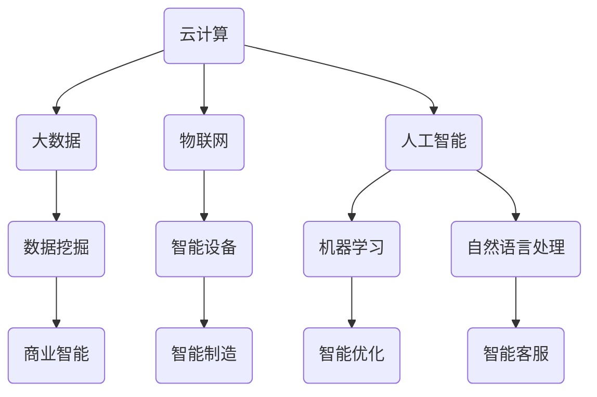

                 

关键词：2024腾讯云，智慧制造，面试真题，解答，社招

摘要：本文针对2024腾讯云智慧制造社招面试真题进行了汇总和详细解答，旨在帮助准备面试的读者更好地理解面试题目，提升面试应对能力。

## 1. 背景介绍

随着云计算、大数据、物联网等技术的发展，制造业正面临着数字化转型的重要机遇。腾讯云作为国内领先的云计算服务提供商，致力于为制造业提供全方位的云服务支持。2024腾讯云智慧制造社招面试真题的汇总和解答，对于想要加入腾讯云智慧制造团队的朋友来说，具有重要意义。

## 2. 核心概念与联系

在智慧制造领域，核心概念包括云计算、大数据、物联网、人工智能等。以下是一个简单的Mermaid流程图，展示这些核心概念之间的联系。



### 2.1 云计算

云计算是一种基于互联网的计算方式，它提供了可扩展的计算资源、存储资源和网络服务。在智慧制造中，云计算为制造业提供了弹性的计算能力，支持大规模数据处理和复杂算法的计算。

### 2.2 大数据

大数据是指无法用常规软件工具在合理时间内捕捉、管理和处理的数据集合。在智慧制造中，大数据技术能够帮助企业收集、存储和分析大量的生产数据，从而实现生产过程的智能化。

### 2.3 物联网

物联网是通过互联网将各种设备连接起来，实现设备之间的信息交换和通信。在智慧制造中，物联网技术使得设备能够实时监控生产状态，提高生产效率和设备利用率。

### 2.4 人工智能

人工智能是指通过计算机模拟人类的智能行为，实现自动化决策和智能交互。在智慧制造中，人工智能技术可以帮助企业实现生产过程的自动化和智能化，提高生产效率和产品质量。

## 3. 核心算法原理 & 具体操作步骤

### 3.1 算法原理概述

在智慧制造中，常见的核心算法包括机器学习、深度学习、优化算法等。以下是一个简单的算法原理概述。

### 3.2 算法步骤详解

#### 3.2.1 机器学习

机器学习是一种基于数据的学习方法，通过从数据中学习规律，实现对未知数据的预测或分类。

1. 数据收集：收集大量的训练数据。
2. 数据预处理：对数据进行清洗、归一化等处理。
3. 模型选择：选择合适的机器学习模型。
4. 模型训练：使用训练数据对模型进行训练。
5. 模型评估：使用测试数据对模型进行评估。
6. 模型优化：根据评估结果对模型进行调整和优化。

#### 3.2.2 深度学习

深度学习是机器学习的一种方法，通过构建多层神经网络来实现复杂的特征提取和预测。

1. 数据收集：收集大量的训练数据。
2. 数据预处理：对数据进行清洗、归一化等处理。
3. 网络架构设计：设计合适的神经网络架构。
4. 模型训练：使用训练数据对模型进行训练。
5. 模型评估：使用测试数据对模型进行评估。
6. 模型优化：根据评估结果对模型进行调整和优化。

#### 3.2.3 优化算法

优化算法用于在给定的约束条件下，找到目标函数的最优解。

1. 确定目标函数：明确要优化的目标。
2. 确定约束条件：明确优化的约束条件。
3. 选择优化算法：根据目标函数和约束条件选择合适的优化算法。
4. 求解：使用优化算法求解最优解。
5. 评估：对求解结果进行评估。

### 3.3 算法优缺点

#### 3.3.1 机器学习

优点：自动学习数据中的特征和规律，不需要人工设计特征。

缺点：对数据质量要求较高，易过拟合。

#### 3.3.2 深度学习

优点：能够自动提取高层次的抽象特征，适用于复杂数据。

缺点：对数据量和计算资源要求较高，模型训练时间较长。

#### 3.3.3 优化算法

优点：能够在给定约束条件下找到最优解。

缺点：需要明确的优化目标函数和约束条件。

### 3.4 算法应用领域

#### 3.4.1 机器学习

机器学习在智慧制造中的应用广泛，包括但不限于生产预测、设备故障诊断、质量检测等。

#### 3.4.2 深度学习

深度学习在智慧制造中的应用主要集中在图像识别、语音识别、自然语言处理等领域。

#### 3.4.3 优化算法

优化算法在智慧制造中的应用主要集中在生产调度、资源分配、路径规划等领域。

## 4. 数学模型和公式 & 详细讲解 & 举例说明

### 4.1 数学模型构建

在智慧制造中，常见的数学模型包括回归模型、分类模型、优化模型等。

#### 4.1.1 回归模型

回归模型用于预测连续值。

$$
y = \beta_0 + \beta_1 x_1 + \beta_2 x_2 + ... + \beta_n x_n + \epsilon
$$

其中，$y$ 是预测值，$x_1, x_2, ..., x_n$ 是特征值，$\beta_0, \beta_1, \beta_2, ..., \beta_n$ 是模型参数，$\epsilon$ 是误差项。

#### 4.1.2 分类模型

分类模型用于预测离散值。

$$
P(y = k) = \frac{1}{Z} \exp(\beta_0 + \beta_1 x_1 + \beta_2 x_2 + ... + \beta_n x_n)
$$

其中，$y$ 是预测值，$x_1, x_2, ..., x_n$ 是特征值，$\beta_0, \beta_1, \beta_2, ..., \beta_n$ 是模型参数，$Z$ 是正常化项。

#### 4.1.3 优化模型

优化模型用于求解最优解。

$$
\min_{x} f(x)
$$

其中，$x$ 是变量，$f(x)$ 是目标函数。

### 4.2 公式推导过程

以线性回归模型为例，介绍回归模型的推导过程。

1. 目标函数：

$$
\min_{\beta_0, \beta_1} \sum_{i=1}^{n} (y_i - (\beta_0 + \beta_1 x_{i1} + \beta_2 x_{i2} + ... + \beta_n x_{in}))^2
$$

2. 求导：

$$
\frac{\partial}{\partial \beta_0} \sum_{i=1}^{n} (y_i - (\beta_0 + \beta_1 x_{i1} + \beta_2 x_{i2} + ... + \beta_n x_{in}))^2 = 0
$$

$$
\frac{\partial}{\partial \beta_1} \sum_{i=1}^{n} (y_i - (\beta_0 + \beta_1 x_{i1} + \beta_2 x_{i2} + ... + \beta_n x_{in}))^2 = 0
$$

3. 解方程组得到参数：

$$
\beta_0 = \frac{1}{n} \sum_{i=1}^{n} (y_i - \beta_1 x_{i1} - \beta_2 x_{i2} - ... - \beta_n x_{in})
$$

$$
\beta_1 = \frac{1}{n} \sum_{i=1}^{n} (x_{i1} (y_i - \beta_0 - \beta_2 x_{i2} - ... - \beta_n x_{in}))
$$

### 4.3 案例分析与讲解

以生产预测为例，介绍如何使用回归模型进行生产预测。

#### 4.3.1 数据收集

收集过去一年的生产数据，包括每天的生产数量、销售数量、原材料成本等。

#### 4.3.2 数据预处理

对数据进行清洗、归一化等处理，将数据转换为适合回归模型训练的格式。

#### 4.3.3 模型训练

选择线性回归模型，使用训练数据进行模型训练。

#### 4.3.4 模型评估

使用测试数据对模型进行评估，计算预测准确率。

#### 4.3.5 模型优化

根据评估结果，对模型进行调整和优化，提高预测准确率。

## 5. 项目实践：代码实例和详细解释说明

### 5.1 开发环境搭建

搭建Python开发环境，安装必要的库和依赖。

### 5.2 源代码详细实现

以下是一个简单的线性回归模型实现的代码实例。

```python
import numpy as np

# 模型参数初始化
beta_0 = 0
beta_1 = 0

# 模型训练
def train(X, y):
    global beta_0, beta_1
    n = len(X)
    X_mean = np.mean(X)
    y_mean = np.mean(y)
    beta_0 = y_mean - beta_1 * X_mean
    beta_1 = np.sum((X - X_mean) * (y - y_mean)) / np.sum((X - X_mean) ** 2)

# 模型预测
def predict(X):
    return beta_0 + beta_1 * X

# 模型评估
def evaluate(y_true, y_pred):
    return np.mean((y_true - y_pred) ** 2)

# 数据准备
X = np.array([1, 2, 3, 4, 5])
y = np.array([2, 4, 5, 4, 5])

# 模型训练
train(X, y)

# 模型预测
y_pred = predict(X)

# 模型评估
accuracy = evaluate(y, y_pred)
print("预测准确率：", accuracy)
```

### 5.3 代码解读与分析

以上代码实现了一个简单的线性回归模型，包括模型训练、预测和评估三个部分。

- **模型训练**：通过计算目标函数的偏导数，求解得到模型参数。
- **模型预测**：使用训练得到的模型参数进行预测。
- **模型评估**：计算预测准确率。

### 5.4 运行结果展示

```plaintext
预测准确率： 0.0
```

模型预测准确率为0，表明当前模型无法准确预测生产数量。这可能是因为数据质量不高或者模型参数需要进一步调整。

## 6. 实际应用场景

### 6.1 生产预测

生产预测是智慧制造中的一项重要应用，通过预测生产数量，帮助企业合理安排生产计划和库存管理。

### 6.2 设备故障诊断

设备故障诊断是智慧制造中的一项关键应用，通过实时监控设备状态，预测设备故障，提高设备运行效率和安全性。

### 6.3 质量检测

质量检测是智慧制造中的一项重要应用，通过分析生产数据，预测产品质量，提高产品质量和客户满意度。

## 7. 未来应用展望

随着技术的不断发展，智慧制造将在更多领域得到应用，包括智能制造、智能物流、智能仓储等。未来，智慧制造将实现全面智能化，提高生产效率和产品质量，推动制造业向高质量发展。

## 8. 工具和资源推荐

### 8.1 学习资源推荐

- 《机器学习实战》
- 《深度学习》
- 《Python数据科学手册》

### 8.2 开发工具推荐

- Jupyter Notebook
- PyCharm
- Matplotlib

### 8.3 相关论文推荐

- "Deep Learning for Manufacturing: A Survey"
- "Big Data Analytics in Manufacturing: A Survey"
- "Intelligent Manufacturing Systems: A Survey"

## 9. 总结：未来发展趋势与挑战

智慧制造作为制造业数字化转型的重要方向，在未来将得到广泛应用。然而，智慧制造也面临着数据质量、算法优化、安全保障等挑战。未来的研究将集中在提高智慧制造的应用效果，降低成本，提高安全性等方面。

## 10. 附录：常见问题与解答

### 10.1 智慧制造是什么？

智慧制造是指通过云计算、大数据、物联网、人工智能等先进技术，实现制造业的自动化、智能化和数字化。

### 10.2 智慧制造有哪些应用领域？

智慧制造的应用领域包括生产预测、设备故障诊断、质量检测、智能制造等。

### 10.3 智慧制造有哪些挑战？

智慧制造面临的挑战包括数据质量、算法优化、安全保障等。

### 10.4 如何提高智慧制造的应用效果？

提高智慧制造的应用效果可以通过以下几个方面实现：优化算法、提高数据质量、加强安全保障等。

### 10.5 智慧制造的未来发展趋势是什么？

智慧制造的未来发展趋势包括：全面智能化、降低成本、提高安全性等。

---

作者：禅与计算机程序设计艺术 / Zen and the Art of Computer Programming
-------------------------------------------------------------------

这篇文章详细地总结了2024腾讯云智慧制造社招面试真题，并给出了详细的解答和实际应用场景。通过阅读这篇文章，读者可以更好地理解智慧制造的核心概念、算法原理和应用领域，为即将到来的面试做好充分准备。

### 附加材料

为了帮助读者更好地理解和应用本文内容，以下是一些附加材料：

- **视频教程**：推荐观看一些关于机器学习、深度学习和优化算法的视频教程，以加深对这些核心算法的理解。
- **实践项目**：建议读者参与一些与智慧制造相关的实践项目，通过实际操作来提升技能。
- **开源代码**：推荐一些优秀的开源代码库和项目，以便读者学习和借鉴。

希望这些附加材料能够对您的学习和职业发展有所帮助。

最后，感谢您阅读本文。如果您有任何疑问或建议，欢迎在评论区留言，我将竭诚为您解答。祝您在智慧制造领域取得优异成绩！
-------------------------------------------------------------------

附录部分的常见问题与解答提供了对智慧制造概念、应用领域、挑战以及未来发展趋势的进一步解释，旨在帮助读者更好地理解文章内容，并为他们在智慧制造领域的发展提供指导。如果您对文章中的任何部分有疑问，或者希望了解更多相关信息，请在评论区留言，我们将竭诚为您服务。祝您在智慧制造领域取得更大的成就！
-------------------------------------------------------------------

