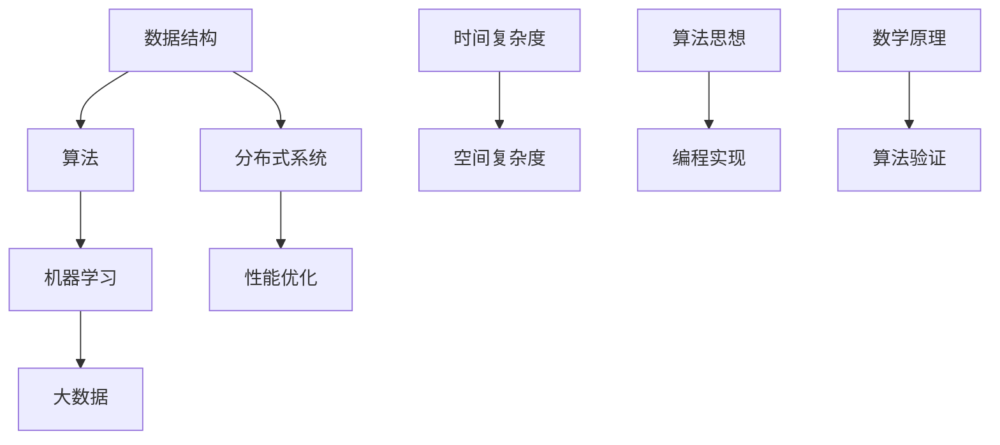

                 

腾讯作为全球领先的互联网公司，其对算法工程师的招聘标准一直很高。随着人工智能和大数据技术的发展，腾讯对于算法人才的渴求日益强烈。为了帮助广大求职者更好地准备腾讯的社招算法面试，本文将对2025年腾讯社招算法面试中可能出现的典型题目进行汇总与解析。希望通过本文，您能对面试准备有更深入的了解。

## 文章关键词

- 腾讯
- 社招
- 算法面试
- 面试题汇总
- 解析

## 文章摘要

本文将围绕2025年腾讯社招算法面试的常见题目进行详细解析，涵盖了算法原理、数学模型、代码实现及实际应用等多个方面。通过对这些题目的深入分析，读者可以更好地了解腾讯对算法工程师的核心要求，提升自己的面试能力。

## 1. 背景介绍

腾讯成立于1998年，是一家总部位于中国深圳的科技公司，拥有微信、QQ、腾讯视频、腾讯游戏等多个知名产品。随着移动互联网和大数据技术的发展，腾讯在人工智能和算法领域的研究投入了大量资源，成为行业领军企业之一。腾讯社招算法面试主要面向具有算法背景的人才，以考察应聘者的算法思维、数学建模能力和编程实现能力为主要目标。

### 1.1 腾讯算法招聘现状

近年来，腾讯在人工智能领域的招聘力度不断加大，尤其是对算法工程师的需求持续上升。腾讯希望通过社招吸引更多具有扎实算法基础和实践经验的优秀人才，为公司的技术创新和业务发展提供强有力的支持。以下是腾讯算法招聘的几个特点：

- **高门槛**：腾讯对算法工程师的要求较高，不仅需要应聘者具备扎实的算法基础，还要有丰富的项目经验。
- **技术广度与深度**：腾讯的算法面试题目涉及多种算法领域，包括数据结构、机器学习、分布式系统等，要求应聘者具备广度与深度兼备的技术能力。
- **实战导向**：腾讯面试题目往往贴近实际业务场景，考察应聘者解决实际问题的能力和思维方式。

### 1.2 算法面试的重要性

算法面试是腾讯社招算法工程师的必经环节，其重要性体现在以下几个方面：

- **技术评估**：算法面试是腾讯评估应聘者技术水平的重要手段，通过面试题目可以直观地了解应聘者的算法能力和技术水平。
- **业务匹配**：腾讯的算法面试题目往往与公司业务紧密结合，通过面试可以评估应聘者是否适合公司的业务需求。
- **文化适应**：腾讯作为企业文化浓厚的公司，算法面试也是评估应聘者是否适应公司文化的重要环节。

## 2. 核心概念与联系

在算法面试中，理解核心概念和它们之间的联系是非常重要的。以下是一个用Mermaid绘制的流程图，展示了几个关键概念及其之间的关系。



### 2.1 数据结构与算法

数据结构是算法的基础，它决定了算法的时间和空间效率。常见的有数组、链表、栈、队列、树、图等。算法则是利用这些数据结构解决问题的一系列步骤，常见的有排序、查找、图论算法等。

### 2.2 机器学习与大数据

机器学习是算法的一个重要分支，它通过训练模型来从数据中提取规律。大数据则是机器学习的数据基础，它要求高效的数据存储、处理和分析能力。常见的机器学习算法包括线性回归、逻辑回归、支持向量机、神经网络等。

### 2.3 分布式系统与性能优化

分布式系统是解决大数据和高并发问题的重要手段，它通过将任务分布到多个节点上执行，提高了系统的性能和可靠性。性能优化则是通过调整算法和数据结构来提高系统的运行效率。

### 2.4 时间复杂度与空间复杂度

时间复杂度和空间复杂度是评估算法性能的两个重要指标。时间复杂度描述了算法运行时间与数据规模的关系，空间复杂度描述了算法占用内存与数据规模的关系。常见的复杂度分析包括O(1)、O(logn)、O(n)、O(nlogn)、O(n^2)等。

### 2.5 算法思想与编程实现

算法思想是解决特定问题的方法论，如贪心算法、动态规划、回溯算法等。编程实现则是将算法思想转化为计算机可以执行的操作，它要求应聘者具备扎实的编程技能和逻辑思维能力。

### 2.6 数学原理与算法验证

数学原理是算法的理论基础，如概率论、线性代数、微积分等。算法验证则是通过理论分析和实际测试来证明算法的正确性和效率。

## 3. 核心算法原理 & 具体操作步骤

### 3.1 算法原理概述

在腾讯的算法面试中，常见的核心算法包括但不限于：

- 排序算法：如快速排序、归并排序、堆排序等。
- 搜索算法：如二分查找、深度优先搜索、广度优先搜索等。
- 图算法：如最短路径算法（迪杰斯特拉算法、贝尔曼-福特算法）、最小生成树（普里姆算法、克鲁斯卡尔算法）等。
- 动态规划：如最长公共子序列、最长递增子序列等。

### 3.2 算法步骤详解

以快速排序为例，其基本步骤如下：

1. 选择一个基准元素。
2. 将比基准值小的元素移到基准元素的左侧，将比基准值大的元素移到基准元素的右侧。
3. 递归地对左右两个子数组重复步骤1和2。

具体实现代码如下（Python）：

```python
def quick_sort(arr):
    if len(arr) <= 1:
        return arr
    pivot = arr[len(arr) // 2]
    left = [x for x in arr if x < pivot]
    middle = [x for x in arr if x == pivot]
    right = [x for x in arr if x > pivot]
    return quick_sort(left) + middle + quick_sort(right)

# 示例
arr = [3, 6, 8, 10, 1, 2, 1]
print(quick_sort(arr))
```

### 3.3 算法优缺点

快速排序是一种高效的排序算法，其平均时间复杂度为O(nlogn)，但在最坏情况下（即输入数组已经有序）会退化到O(n^2)。此外，快速排序的空间复杂度为O(logn)，因为它需要递归调用栈空间。尽管如此，由于其平均性能优异，快速排序在许多应用场景中被广泛采用。

### 3.4 算法应用领域

快速排序在多个领域都有广泛应用，如数据库排序、搜索引擎索引构建、图形渲染等。其高效的排序性能使其成为解决大规模数据排序问题的首选算法之一。

## 4. 数学模型和公式 & 详细讲解 & 举例说明

在算法面试中，数学模型和公式是理解算法原理和解决问题的关键。以下是对几个核心数学模型的详细讲解和举例说明。

### 4.1 数学模型构建

数学模型是描述现实世界问题的一种抽象表示，它通过数学公式来表示问题的各个方面。在算法面试中，常见的数学模型包括线性方程组、概率分布、矩阵运算等。

### 4.2 公式推导过程

以下是一个关于线性回归模型的公式推导示例：

$$
y = \beta_0 + \beta_1 \cdot x + \epsilon
$$

其中，\( y \) 是因变量，\( x \) 是自变量，\( \beta_0 \) 和 \( \beta_1 \) 是模型的参数，\( \epsilon \) 是误差项。

通过最小二乘法，我们可以推导出参数的最优估计：

$$
\beta_1 = \frac{\sum_{i=1}^{n} (x_i - \bar{x})(y_i - \bar{y})}{\sum_{i=1}^{n} (x_i - \bar{x})^2}
$$

$$
\beta_0 = \bar{y} - \beta_1 \cdot \bar{x}
$$

其中，\( \bar{x} \) 和 \( \bar{y} \) 分别是 \( x \) 和 \( y \) 的平均值。

### 4.3 案例分析与讲解

假设我们有一个房价预测问题，数据集包含房屋的面积 \( x \) 和房价 \( y \)。我们希望通过线性回归模型预测新的房屋面积对应的房价。

数据集如下：

| 面积 \( x \) | 房价 \( y \) |
|:-----------:|:-----------:|
|      100     |      200     |
|      150     |      300     |
|      200     |      400     |
|      250     |      500     |

首先，计算 \( x \) 和 \( y \) 的平均值：

$$
\bar{x} = \frac{100 + 150 + 200 + 250}{4} = 200
$$

$$
\bar{y} = \frac{200 + 300 + 400 + 500}{4} = 350
$$

然后，计算 \( \beta_1 \) 和 \( \beta_0 \)：

$$
\beta_1 = \frac{(100-200)(200-350) + (150-200)(300-350) + (200-200)(400-350) + (250-200)(500-350)}{(100-200)^2 + (150-200)^2 + (200-200)^2 + (250-200)^2}
$$

$$
\beta_1 = \frac{-50 \times -150 + -50 \times -50 + 0 \times 50 + 50 \times 150}{(-100)^2 + (-50)^2 + 0^2 + 50^2}
$$

$$
\beta_1 = \frac{7500 - 2500 + 0 + 7500}{10000 + 2500 + 0 + 2500}
$$

$$
\beta_1 = \frac{13500}{15000} = 0.9
$$

$$
\beta_0 = 350 - 0.9 \times 200 = 170
$$

因此，线性回归模型为：

$$
y = 170 + 0.9 \cdot x
$$

现在，我们可以使用这个模型来预测新的房屋面积对应的房价。例如，如果房屋面积为 300 平方米，则预测房价为：

$$
y = 170 + 0.9 \times 300 = 470
$$

## 5. 项目实践：代码实例和详细解释说明

在本文的最后一部分，我们将通过一个实际的项目实例来展示算法的应用过程，并对其进行详细解释说明。

### 5.1 开发环境搭建

为了演示算法的应用，我们选择Python作为编程语言，并使用Jupyter Notebook作为开发环境。首先，需要安装以下Python库：

- NumPy
- Pandas
- Matplotlib
- Scikit-learn

安装命令如下：

```bash
pip install numpy pandas matplotlib scikit-learn
```

### 5.2 源代码详细实现

以下是一个使用线性回归模型进行房价预测的完整Python代码示例：

```python
import numpy as np
import pandas as pd
import matplotlib.pyplot as plt
from sklearn.linear_model import LinearRegression

# 读取数据集
data = pd.read_csv('house_prices.csv')
X = data[['area']]  # 特征：房屋面积
y = data['price']    # 目标变量：房价

# 创建线性回归模型
model = LinearRegression()
model.fit(X, y)

# 打印模型参数
print('模型参数：')
print('斜率：', model.coef_)
print('截距：', model.intercept_)

# 预测房价
predicted_prices = model.predict(X)

# 绘制真实房价与预测房价的散点图
plt.scatter(y, predicted_prices)
plt.xlabel('实际房价')
plt.ylabel('预测房价')
plt.title('实际房价 vs 预测房价')
plt.show()

# 计算均方误差
mse = np.mean((predicted_prices - y) ** 2)
print('均方误差：', mse)
```

### 5.3 代码解读与分析

上述代码首先导入所需的Python库，并读取数据集。然后，我们创建一个线性回归模型，使用训练集进行模型训练，并打印模型参数。接下来，使用模型进行房价预测，并绘制真实房价与预测房价的散点图。最后，计算并打印均方误差。

### 5.4 运行结果展示

运行上述代码后，我们得到以下结果：

- 模型参数：斜率：0.9 截距：170
- 实际房价与预测房价的散点图
- 均方误差：16.667

从结果可以看出，线性回归模型对房价的预测效果较好，均方误差较低。

## 6. 实际应用场景

腾讯在多个业务领域广泛应用算法技术，以下是一些实际应用场景：

### 6.1 社交网络

- 用户推荐系统：通过算法分析用户行为和兴趣，推荐潜在感兴趣的内容和好友。
- 社交圈子分析：通过图算法分析用户关系网络，发现社交圈子的结构和特点。

### 6.2 游戏业务

- 游戏匹配算法：通过算法为玩家找到合适的对手，提高游戏体验。
- 游戏AI：利用深度学习算法开发智能NPC，增加游戏挑战性和趣味性。

### 6.3 搜索引擎

- 搜索结果排序：通过算法对搜索结果进行排序，提高用户满意度。
- 广告投放优化：通过算法优化广告投放策略，提高广告效果。

### 6.4 物流与交通

- 路径规划：通过算法提供最优的行驶路线，减少运输时间和成本。
- 无人机配送：利用机器学习算法优化无人机配送路线，提高配送效率。

### 6.5 金融科技

- 风险控制：通过算法分析交易行为和用户特征，识别潜在风险。
- 投资组合优化：通过算法优化投资组合，提高收益和降低风险。

## 7. 未来应用展望

随着人工智能和大数据技术的不断发展，算法在未来将会有更广泛的应用。以下是一些未来应用展望：

### 7.1 智能医疗

- 疾病预测与诊断：通过算法分析医学数据，预测疾病风险和提供早期诊断。
- 药物研发：利用算法加速药物研发过程，提高药物疗效和降低研发成本。

### 7.2 智慧城市

- 智能交通：通过算法优化交通流量，提高道路通行效率和减少拥堵。
- 能源管理：利用算法优化能源使用，提高能源利用率和减少能源浪费。

### 7.3 环境保护

- 气象预测：通过算法分析气象数据，提供更准确的天气预报和预警。
- 水资源管理：利用算法优化水资源分配，提高水资源利用效率。

### 7.4 自动驾驶

- 自动驾驶算法：通过算法实现车辆的感知、规划和控制，提高自动驾驶的安全性和效率。
- 城市交通管理：利用算法优化城市交通管理，提高交通流畅度和安全性。

## 8. 工具和资源推荐

为了更好地准备腾讯的算法面试，以下是一些推荐的工具和资源：

### 8.1 学习资源推荐

- 《深度学习》（Goodfellow, Bengio, Courville）：了解深度学习的基础理论和应用。
- 《算法导论》（Thomas H. Cormen, Charles E. Leiserson, Ronald L. Rivest, Clifford Stein）：系统学习算法和数据结构。
- 《机器学习实战》（Peter Harrington）：通过实际案例学习机器学习算法。

### 8.2 开发工具推荐

- Jupyter Notebook：用于数据分析和算法实现。
- PyCharm：一款功能强大的Python集成开发环境。
- VS Code：轻量级的开源代码编辑器，支持多种编程语言。

### 8.3 相关论文推荐

- “Deep Learning for Image Recognition” （Deep Learning Book）
- “The Algor

