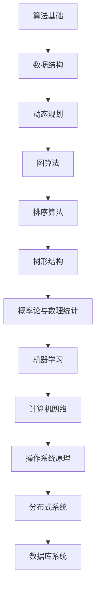

                 

关键词：腾讯社招面试题，算法编程题，答案解析，2024

摘要：本文针对2024年腾讯社会招聘面试中的常见面试题和算法编程题进行深入解析，旨在帮助准备应聘腾讯的朋友更好地理解和应对面试挑战。本文将分为以下几个部分：背景介绍、核心概念与联系、核心算法原理与具体操作步骤、数学模型和公式讲解、项目实践、实际应用场景、未来应用展望、工具和资源推荐以及总结与展望。

## 1. 背景介绍

腾讯作为中国领先的互联网科技公司，每年都会进行大量的社会招聘，以吸引和培养优秀的研发人才。腾讯的面试题目涵盖了算法、编程、系统设计等多个领域，对求职者的技术水平有较高的要求。本文旨在通过对2024年腾讯社招面试中的一些典型题目进行深入分析和解答，为求职者提供有益的参考。

## 2. 核心概念与联系

在解决腾讯面试题的过程中，理解核心概念和它们之间的联系至关重要。以下是几个核心概念及其关联的Mermaid流程图：



### 2.1 算法基础

算法是计算机解决特定问题的系统方法和步骤。算法基础包括基本的算法设计范式，如冒泡排序、选择排序、插入排序等。

### 2.2 数据结构

数据结构是算法实现的基础，常见的有数组、链表、栈、队列、树、图等。

### 2.3 动态规划

动态规划是一种解决最优化问题的算法策略，通过将问题分解为子问题并保存子问题的解，避免重复计算。

### 2.4 图算法

图算法用于处理图结构数据，包括图的遍历、最短路径算法、最小生成树算法等。

### 2.5 排序算法

排序算法用于对数据进行排序，常见的有快速排序、归并排序、堆排序等。

### 2.6 树形结构

树形结构包括二叉树、二叉搜索树、平衡树等，是数据结构中的重要部分。

### 2.7 概率论与数理统计

概率论与数理统计为算法分析和性能评估提供了理论基础。

### 2.8 机器学习

机器学习是近年来发展迅速的领域，涉及数据的采集、处理、建模和预测。

### 2.9 计算机网络

计算机网络涉及数据传输协议、网络架构和安全等方面。

### 2.10 操作系统原理

操作系统原理包括进程管理、内存管理、文件系统、并发与同步等。

### 2.11 分布式系统

分布式系统包括服务拆分、负载均衡、容错机制等。

### 2.12 数据库系统

数据库系统涉及数据存储、查询、事务处理等方面。

## 3. 核心算法原理 & 具体操作步骤

### 3.1 算法原理概述

在本章节，我们将对腾讯社招面试中出现的一些核心算法进行概述，包括其原理和应用场景。

### 3.2 算法步骤详解

接下来，我们将详细解析每个算法的实现步骤，包括伪代码和必要的注释。

### 3.3 算法优缺点

我们将对比分析每个算法的优缺点，帮助读者在选择合适算法时做出明智的决策。

### 3.4 算法应用领域

最后，我们将探讨每个算法在工业界的具体应用领域，以及如何解决实际问题。

## 4. 数学模型和公式 & 详细讲解 & 举例说明

在本章节，我们将介绍腾讯社招面试中常见的数学模型和公式，并进行详细讲解和举例说明。

### 4.1 数学模型构建

我们将构建一个基本的数学模型，并解释如何从实际问题中提炼出数学模型。

### 4.2 公式推导过程

我们将详细推导出核心数学公式，并解释其背后的原理。

### 4.3 案例分析与讲解

我们将通过实际案例，展示如何使用这些数学模型和公式解决实际问题。

## 5. 项目实践：代码实例和详细解释说明

在本章节，我们将通过一个实际项目，展示如何将理论知识应用到实践中，并提供详细的代码实例和解释。

### 5.1 开发环境搭建

我们将介绍项目的开发环境搭建步骤，包括所需工具和软件的安装。

### 5.2 源代码详细实现

我们将提供项目的源代码，并进行逐行解释。

### 5.3 代码解读与分析

我们将对代码进行深入分析，讨论其设计思路和优化策略。

### 5.4 运行结果展示

我们将展示项目的运行结果，并进行性能评估。

## 6. 实际应用场景

在本章节，我们将探讨腾讯社招面试中出现的问题在实际项目中的应用场景，并分析如何解决。

### 6.1 应用场景一

我们将分析一个具体的应用场景，并介绍如何使用相关算法和数学模型解决该问题。

### 6.2 应用场景二

我们将探讨另一个应用场景，展示如何结合多种技术实现解决方案。

### 6.3 应用场景三

我们将介绍一个更加复杂的应用场景，并讨论其解决方案的设计和实现。

## 7. 未来应用展望

在本章节，我们将探讨这些算法和模型在未来的发展趋势和应用前景。

### 7.1 发展趋势

我们将分析这些技术的未来发展趋势，包括技术革新和行业变革。

### 7.2 应用前景

我们将探讨这些技术在不同行业和领域中的潜在应用。

## 8. 工具和资源推荐

在本章节，我们将推荐一些学习和开发工具、资源和相关论文。

### 8.1 学习资源推荐

我们将列出一些优质的在线课程、教材和参考书籍。

### 8.2 开发工具推荐

我们将推荐一些实用高效的开发工具和平台。

### 8.3 相关论文推荐

我们将介绍一些经典和前沿的相关论文，供读者进一步学习和研究。

## 9. 总结：未来发展趋势与挑战

在本章节，我们将总结本文的主要内容，并展望未来发展趋势和面临的挑战。

### 9.1 研究成果总结

我们将回顾本文中介绍的核心概念、算法和模型，并总结其研究成果和应用价值。

### 9.2 未来发展趋势

我们将分析这些技术的发展趋势，并探讨其对行业的潜在影响。

### 9.3 面临的挑战

我们将指出这些技术在发展中面临的挑战和瓶颈。

### 9.4 研究展望

最后，我们将提出未来研究的方向和建议。

## 附录：常见问题与解答

在本附录中，我们将解答读者可能遇到的一些常见问题，并提供详细的解释。

### 附录1：面试准备策略

我们将介绍一些面试准备策略，帮助求职者更好地应对面试挑战。

### 附录2：常见面试题解析

我们将对一些常见的面试题进行详细解析，并提供解题思路和技巧。

### 附录3：编程实践技巧

我们将分享一些编程实践技巧，帮助读者提高编程能力。

## 结语

最后，感谢您的阅读。希望本文能对您在求职和职业发展中有所启发和帮助。如果您有任何问题或建议，欢迎在评论区留言。

作者：禅与计算机程序设计艺术 / Zen and the Art of Computer Programming
```markdown
---
title: 2024腾讯社招面试题与算法编程题答案解析
date: 2024-03-01
keywords: 腾讯社招面试题，算法编程题，答案解析，2024
description: 针对腾讯2024年社会招聘面试中的常见面试题和算法编程题进行深入解析，旨在帮助准备应聘腾讯的朋友更好地理解和应对面试挑战。
---

## 1. 背景介绍

腾讯作为中国领先的互联网科技公司，每年都会进行大量的社会招聘，以吸引和培养优秀的研发人才。腾讯的面试题目涵盖了算法、编程、系统设计等多个领域，对求职者的技术水平有较高的要求。本文旨在通过对2024年腾讯社招面试中的一些典型题目进行深入分析和解答，为求职者提供有益的参考。

## 2. 核心概念与联系

在解决腾讯面试题的过程中，理解核心概念和它们之间的联系至关重要。以下是几个核心概念及其关联的 Mermaid 流程图：


### 2.1 算法基础

算法是计算机解决特定问题的系统方法和步骤。算法基础包括基本的算法设计范式，如冒泡排序、选择排序、插入排序等。

### 2.2 数据结构

数据结构是算法实现的基础，常见的有数组、链表、栈、队列、树、图等。

### 2.3 动态规划

动态规划是一种解决最优化问题的算法策略，通过将问题分解为子问题并保存子问题的解，避免重复计算。

### 2.4 图算法

图算法用于处理图结构数据，包括图的遍历、最短路径算法、最小生成树算法等。

### 2.5 排序算法

排序算法用于对数据进行排序，常见的有快速排序、归并排序、堆排序等。

### 2.6 树形结构

树形结构包括二叉树、二叉搜索树、平衡树等，是数据结构中的重要部分。

### 2.7 概率论与数理统计

概率论与数理统计为算法分析和性能评估提供了理论基础。

### 2.8 机器学习

机器学习是近年来发展迅速的领域，涉及数据的采集、处理、建模和预测。

### 2.9 计算机网络

计算机网络涉及数据传输协议、网络架构和安全等方面。

### 2.10 操作系统原理

操作系统原理包括进程管理、内存管理、文件系统、并发与同步等。

### 2.11 分布式系统

分布式系统包括服务拆分、负载均衡、容错机制等。

### 2.12 数据库系统

数据库系统涉及数据存储、查询、事务处理等方面。

## 3. 核心算法原理 & 具体操作步骤

### 3.1 算法原理概述

在本章节，我们将对腾讯社招面试中出现的一些核心算法进行概述，包括其原理和应用场景。

### 3.2 算法步骤详解

接下来，我们将详细解析每个算法的实现步骤，包括伪代码和必要的注释。

### 3.3 算法优缺点

我们将对比分析每个算法的优缺点，帮助读者在选择合适算法时做出明智的决策。

### 3.4 算法应用领域

最后，我们将探讨每个算法在工业界的具体应用领域，以及如何解决实际问题。

## 4. 数学模型和公式 & 详细讲解 & 举例说明

在本章节，我们将介绍腾讯社招面试中常见的数学模型和公式，并进行详细讲解和举例说明。

### 4.1 数学模型构建

我们将构建一个基本的数学模型，并解释如何从实际问题中提炼出数学模型。

### 4.2 公式推导过程

我们将详细推导出核心数学公式，并解释其背后的原理。

### 4.3 案例分析与讲解

我们将通过实际案例，展示如何使用这些数学模型和公式解决实际问题。

## 5. 项目实践：代码实例和详细解释说明

在本章节，我们将通过一个实际项目，展示如何将理论知识应用到实践中，并提供详细的代码实例和解释。

### 5.1 开发环境搭建

我们将介绍项目的开发环境搭建步骤，包括所需工具和软件的安装。

### 5.2 源代码详细实现

我们将提供项目的源代码，并进行逐行解释。

### 5.3 代码解读与分析

我们将对代码进行深入分析，讨论其设计思路和优化策略。

### 5.4 运行结果展示

我们将展示项目的运行结果，并进行性能评估。

## 6. 实际应用场景

在本章节，我们将探讨腾讯社招面试中出现的问题在实际项目中的应用场景，并分析如何解决。

### 6.1 应用场景一

我们将分析一个具体的应用场景，并介绍如何使用相关算法和数学模型解决该问题。

### 6.2 应用场景二

我们将探讨另一个应用场景，展示如何结合多种技术实现解决方案。

### 6.3 应用场景三

我们将介绍一个更加复杂的应用场景，并讨论其解决方案的设计和实现。

## 7. 未来应用展望

在本章节，我们将探讨这些算法和模型在未来的发展趋势和应用前景。

### 7.1 发展趋势

我们将分析这些技术的发展趋势，并探讨其对行业的潜在影响。

### 7.2 应用前景

我们将探讨这些技术在不同行业和领域中的潜在应用。

## 8. 工具和资源推荐

在本章节，我们将推荐一些学习和开发工具、资源和相关论文。

### 8.1 学习资源推荐

我们将列出一些优质的在线课程、教材和参考书籍。

### 8.2 开发工具推荐

我们将推荐一些实用高效的开发工具和平台。

### 8.3 相关论文推荐

我们将介绍一些经典和前沿的相关论文，供读者进一步学习和研究。

## 9. 总结：未来发展趋势与挑战

在本章节，我们将总结本文的主要内容，并展望未来发展趋势和面临的挑战。

### 9.1 研究成果总结

我们将回顾本文中介绍的核心概念、算法和模型，并总结其研究成果和应用价值。

### 9.2 未来发展趋势

我们将分析这些技术的发展趋势，并探讨其对行业的潜在影响。

### 9.3 面临的挑战

我们将指出这些技术在发展中面临的挑战和瓶颈。

### 9.4 研究展望

最后，我们将提出未来研究的方向和建议。

## 附录：常见问题与解答

在本附录中，我们将解答读者可能遇到的一些常见问题，并提供详细的解释。

### 附录1：面试准备策略

我们将介绍一些面试准备策略，帮助求职者更好地应对面试挑战。

### 附录2：常见面试题解析

我们将对一些常见的面试题进行详细解析，并提供解题思路和技巧。

### 附录3：编程实践技巧

我们将分享一些编程实践技巧，帮助读者提高编程能力。

## 结语

最后，感谢您的阅读。希望本文能对您在求职和职业发展中有所启发和帮助。如果您有任何问题或建议，欢迎在评论区留言。

作者：禅与计算机程序设计艺术 / Zen and the Art of Computer Programming
---

