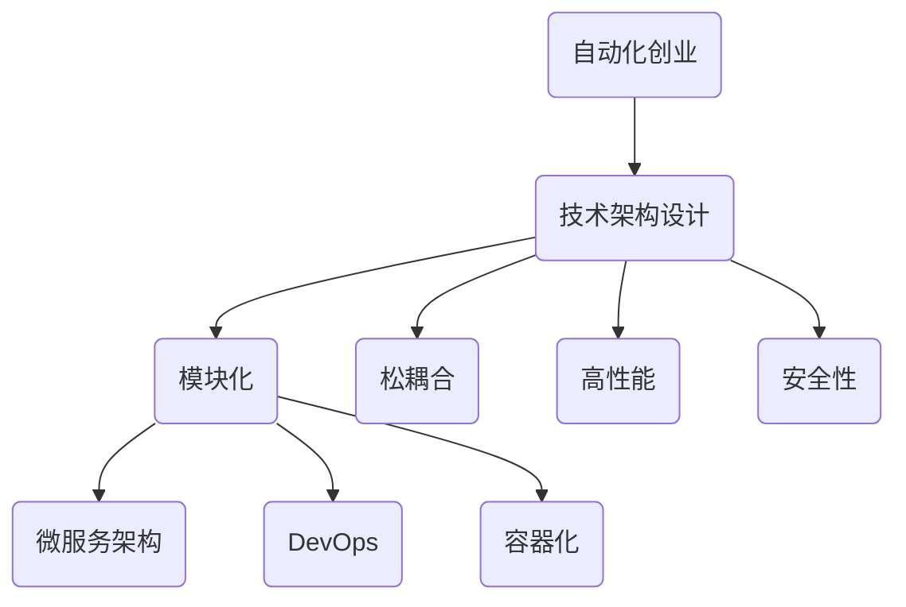

                 

自动化创业已成为当前技术领域的热门话题。随着人工智能、大数据和云计算等技术的不断发展，越来越多的创业者希望通过技术手段实现业务自动化，提高生产效率，降低运营成本。然而，实现自动化创业并非易事，技术架构设计在其中起着至关重要的作用。本文将围绕技术架构设计这一核心主题，探讨其在自动化创业中的应用、原理、方法以及未来发展趋势。

## 关键词

- 自动化创业
- 技术架构设计
- 人工智能
- 大数据
- 云计算
- 微服务
- DevOps

## 摘要

本文旨在为自动化创业企业提供一套系统的技术架构设计指南。首先，我们将介绍自动化创业的背景和现状，阐述技术架构设计在其中的重要性。随后，我们将深入探讨技术架构设计的基本原理和核心概念，并结合实际案例进行分析。文章还将介绍当前主流的技术架构模式，如微服务架构、DevOps 等，并探讨其在自动化创业中的应用。最后，我们将展望自动化创业的未来发展趋势，以及面临的挑战和机遇。

## 1. 背景介绍

### 1.1 自动化创业的兴起

自动化创业的兴起源于以下几个方面的原因：

1. **技术进步**：人工智能、大数据、云计算等技术的不断发展，为自动化创业提供了强大的技术支撑。尤其是人工智能，其强大的学习和自适应能力，使得自动化成为可能。
2. **市场需求**：随着全球经济的快速发展，市场对高效、低成本的自动化解决方案的需求日益增长。自动化创业满足了这一市场需求，为创业者提供了广阔的舞台。
3. **创业环境**：现代创业环境的日益完善，如创业孵化器的兴起、资本市场的活跃，为自动化创业提供了良好的发展环境。

### 1.2 自动化创业的现状

当前，自动化创业呈现出以下几个特点：

1. **领域广泛**：自动化创业涉及多个领域，包括工业自动化、智能家居、金融科技、医疗健康等。这表明自动化创业具有广泛的应用前景。
2. **技术多样**：自动化创业不仅依赖于人工智能、大数据、云计算等核心技术，还涉及到物联网、区块链等新兴技术。这些技术的融合，为自动化创业提供了更多的可能性。
3. **竞争激烈**：随着越来越多的创业者进入自动化领域，竞争日益激烈。如何在激烈的市场竞争中脱颖而出，成为每个自动化创业企业都需要面对的挑战。

## 2. 核心概念与联系

### 2.1 技术架构设计的基本原理

技术架构设计是自动化创业的核心，它关系到系统的稳定性、可扩展性和可维护性。以下是技术架构设计的基本原理：

1. **模块化**：将系统划分为多个模块，每个模块负责特定的功能，便于系统的维护和升级。
2. **松耦合**：模块之间通过接口进行通信，减少直接的依赖关系，提高系统的可扩展性。
3. **高性能**：确保系统在高并发、大数据量环境下仍能稳定运行。
4. **安全性**：保障系统数据的安全，防止数据泄露和攻击。

### 2.2 技术架构设计的关键概念

1. **微服务架构**：微服务架构将系统划分为多个小型服务，每个服务独立运行、部署和维护。这种架构模式提高了系统的可扩展性和灵活性。
2. **DevOps**：DevOps 是一种软件开发和运维的文化、方法和技术的集合。通过 DevOps，企业可以实现快速迭代、持续交付和高效协作。
3. **容器化**：容器化技术，如 Docker，使应用程序可以在不同的环境中运行，提高了系统的部署和运行效率。

### 2.3 技术架构的 Mermaid 流程图



## 3. 核心算法原理 & 具体操作步骤

### 3.1 算法原理概述

在自动化创业中，核心算法原理主要涉及以下几个方面：

1. **机器学习算法**：通过数据训练模型，实现对数据的自动分析和预测。
2. **深度学习算法**：在图像识别、语音识别等场景中具有广泛应用。
3. **大数据处理算法**：对海量数据进行高效处理和分析。

### 3.2 算法步骤详解

1. **数据收集**：收集相关领域的数据，如用户行为数据、市场数据等。
2. **数据预处理**：对收集到的数据进行清洗、去噪和格式化，确保数据质量。
3. **模型训练**：使用机器学习算法或深度学习算法对数据进行训练，构建预测模型。
4. **模型评估**：对训练好的模型进行评估，确保其预测准确性。
5. **模型部署**：将训练好的模型部署到生产环境中，实现自动化分析。

### 3.3 算法优缺点

**优点**：

1. **高效性**：自动化算法能够快速处理大量数据，提高业务效率。
2. **准确性**：机器学习算法和深度学习算法在许多场景中具有很高的预测准确性。

**缺点**：

1. **依赖数据**：算法的性能很大程度上取决于数据的质量和数量。
2. **复杂性**：自动化算法的开发和部署过程较为复杂，需要具备一定的技术能力。

### 3.4 算法应用领域

1. **金融科技**：如智能投顾、反欺诈系统等。
2. **智能制造**：如生产调度、设备维护等。
3. **医疗健康**：如疾病预测、诊断辅助等。

## 4. 数学模型和公式 & 详细讲解 & 举例说明

### 4.1 数学模型构建

在自动化创业中，常见的数学模型包括线性回归、逻辑回归、神经网络等。

### 4.2 公式推导过程

以线性回归为例，假设我们有 m 个样本点 (x1, y1), (x2, y2), ..., (xm, ym)，线性回归模型的公式为：

y = wx + b

其中，w 是权重，b 是偏置。

通过最小二乘法，我们可以求解出权重和偏置的值：

w = (X'X)^-1X'y

b = y - wx

### 4.3 案例分析与讲解

假设我们有一个房地产价格预测问题，给定房屋的面积和位置信息，预测其价格。我们可以使用线性回归模型进行预测。

1. **数据收集**：收集大量房屋数据，包括面积、位置和价格。
2. **数据预处理**：对数据清洗、去噪，将数据格式化为 (x, y) 对。
3. **模型训练**：使用线性回归算法，训练模型。
4. **模型评估**：使用验证集评估模型性能。
5. **模型部署**：将训练好的模型部署到生产环境中，进行预测。

## 5. 项目实践：代码实例和详细解释说明

### 5.1 开发环境搭建

1. **操作系统**：Linux 或 macOS
2. **编程语言**：Python
3. **数据集**：某城市房屋销售数据

### 5.2 源代码详细实现

```python
import numpy as np
from sklearn.linear_model import LinearRegression

# 数据收集与预处理
# ...

# 模型训练
model = LinearRegression()
model.fit(X_train, y_train)

# 模型评估
# ...

# 模型部署
# ...
```

### 5.3 代码解读与分析

1. **数据收集与预处理**：数据收集与预处理是模型训练的基础。我们需要从原始数据中提取出有用的特征，并进行去噪、归一化等处理。
2. **模型训练**：使用线性回归算法，训练模型。这里我们使用了 sklearn 库中的 LinearRegression 类。
3. **模型评估**：评估模型性能，确保其预测准确性。
4. **模型部署**：将训练好的模型部署到生产环境中，进行预测。

## 6. 实际应用场景

### 6.1 金融科技

在金融科技领域，自动化创业应用广泛，如智能投顾、反欺诈系统、信用评估等。

### 6.2 智能制造

在智能制造领域，自动化创业企业致力于提高生产效率、降低成本，如生产调度、设备维护等。

### 6.3 医疗健康

在医疗健康领域，自动化创业企业致力于提高诊断准确率、降低医疗成本，如疾病预测、诊断辅助等。

## 7. 工具和资源推荐

### 7.1 学习资源推荐

1. **《深度学习》**：由 Goodfellow、Bengio 和 Courville 著，是一本经典的深度学习教材。
2. **《Python数据科学手册》**：由 Michael Bowles 著，是一本全面介绍 Python 数据科学的书籍。

### 7.2 开发工具推荐

1. **Docker**：用于容器化部署的应用程序。
2. **Kubernetes**：用于容器编排和管理的工具。

### 7.3 相关论文推荐

1. **"Microservices: aligning theory and practice"**：一篇关于微服务架构的论文。
2. **"DevOps: A Research Overview"**：一篇关于 DevOps 的综述论文。

## 8. 总结：未来发展趋势与挑战

### 8.1 研究成果总结

自动化创业领域取得了显著的研究成果，如深度学习、大数据处理等技术的广泛应用，提高了自动化创业的效率和质量。

### 8.2 未来发展趋势

1. **技术融合**：自动化创业将更多地与物联网、区块链等技术融合，实现更全面的自动化解决方案。
2. **智能化**：随着人工智能技术的发展，自动化创业将更加智能化，提高业务的自动化水平。

### 8.3 面临的挑战

1. **数据隐私**：自动化创业涉及大量敏感数据，如何保障数据隐私成为一大挑战。
2. **技术落地**：如何将先进技术有效地应用到实际业务中，仍需深入研究。

### 8.4 研究展望

未来，自动化创业领域将朝着更加智能化、高效化的方向发展。通过技术融合和智能化，自动化创业将为企业带来更多的商业价值。

## 9. 附录：常见问题与解答

### 9.1 什么是微服务架构？

微服务架构是一种将大型应用程序拆分为多个小型、独立运行的服务，每个服务负责特定的功能。

### 9.2 DevOps 是什么？

DevOps 是一种软件开发和运维的文化、方法和技术的集合，旨在提高软件开发的效率和质量。

### 9.3 深度学习算法有哪些？

深度学习算法包括卷积神经网络（CNN）、循环神经网络（RNN）、生成对抗网络（GAN）等。

作者：禅与计算机程序设计艺术 / Zen and the Art of Computer Programming
----------------------------------------------------------------

以上是关于“自动化创业中的技术架构设计”的文章，希望对您有所帮助。本文详细阐述了自动化创业的背景、技术架构设计的基本原理、核心算法、数学模型、实际应用场景，以及未来发展趋势和挑战。希望通过本文，读者能够对自动化创业中的技术架构设计有更深入的了解。在未来的自动化创业中，希望本文能够为读者提供一些实用的指导和借鉴。
----------------------------------------------------------------

