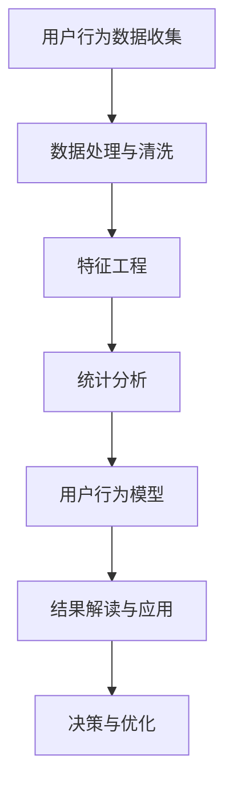
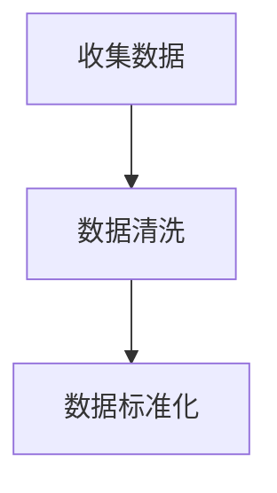
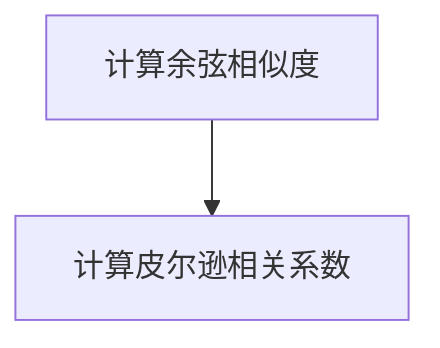
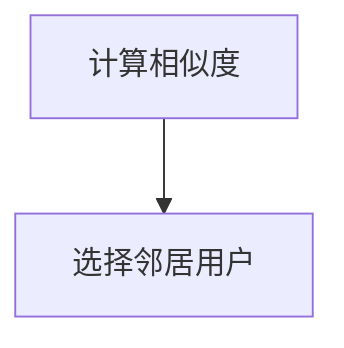
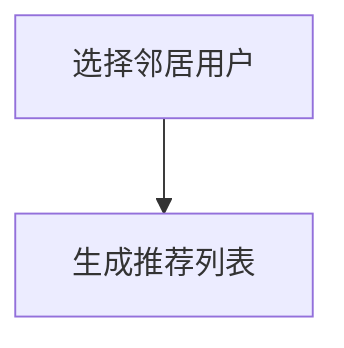
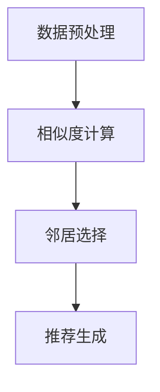

                 

  
## 1. 背景介绍

随着互联网和技术的飞速发展，自动化创业已经成为当今商业领域中的一大趋势。从初创企业到大型企业，越来越多的公司开始意识到自动化在提高效率、降低成本、提升客户体验方面的巨大潜力。在这个过程中，用户行为分析作为一种关键工具，对于自动化创业的成功至关重要。

用户行为分析涉及到对用户在网站、应用或服务中的行为进行监控、收集、分析和解读。通过这种方式，企业可以深入了解用户的需求、偏好和痛点，从而更好地进行产品开发、优化用户体验和营销策略。具体来说，用户行为分析有助于以下几个方面：

1. **产品优化**：通过分析用户如何与产品互动，企业可以发现产品中的瓶颈和不足，进而进行针对性的改进。
2. **用户体验提升**：了解用户的行为模式和痛点，可以帮助企业更好地设计用户界面和交互流程，从而提高用户的满意度和留存率。
3. **营销策略调整**：用户行为分析为营销团队提供了有关目标受众的有价值的数据，使他们能够更精准地定位和吸引潜在客户。
4. **业务决策支持**：通过对用户行为的长期跟踪和分析，企业可以做出更加明智的决策，例如产品迭代、市场扩张等。

本文将深入探讨用户行为分析在自动化创业中的应用，包括核心概念、算法原理、数学模型、项目实践以及未来展望等内容。希望通过本文的讨论，能够为自动化创业企业提供一些有价值的思路和工具。

### 2. 核心概念与联系

在进行用户行为分析时，我们需要理解几个关键概念，这些概念不仅定义了用户行为分析的范围，还为我们提供了一个系统化的框架来解析用户行为数据。

#### 2.1. 用户行为数据

用户行为数据是指用户在使用网站、应用或服务时的各种交互记录。这些数据包括点击流、浏览历史、购买记录、评论、搜索关键词、页面停留时间等。这些数据可以通过各种技术手段（如日志文件、点击追踪器、分析工具等）进行收集。

#### 2.2. 数据收集方法

数据收集是用户行为分析的基础。以下是几种常见的数据收集方法：

- **日志文件**：通过服务器日志记录用户请求和服务器响应，收集用户行为数据。
- **点击追踪器**：在网站或应用中嵌入代码，追踪用户的点击行为。
- **分析工具**：如Google Analytics、Mixpanel等，可以自动化收集和分析用户行为数据。
- **用户调研**：通过问卷调查、访谈等方式直接从用户那里获取行为数据。

#### 2.3. 数据处理与分析方法

收集到的用户行为数据通常是非常大规模的，因此需要有效的处理和分析方法。以下是一些核心的预处理和分析方法：

- **数据清洗**：去除重复、错误和不完整的数据，保证数据质量。
- **数据整合**：将来自不同渠道和形式的数据进行整合，形成一个统一的数据集。
- **特征工程**：从原始数据中提取出有助于分析的特征，如用户访问频率、页面停留时间等。
- **统计分析**：使用各种统计方法（如描述性统计、假设检验等）来分析用户行为模式。
- **机器学习**：利用机器学习算法（如聚类、分类、关联规则等）从数据中发现隐藏的模式和关系。

#### 2.4. 用户行为模型

用户行为模型是用来描述和分析用户行为的数学模型。常见的用户行为模型包括：

- **马尔可夫模型**：用于预测用户在网站上的下一步行为。
- **贝叶斯网络**：用于建模用户行为中的不确定性。
- **决策树**：用于分类用户行为，识别不同的用户群体。

#### 2.5. Mermaid 流程图

以下是一个使用Mermaid绘制的用户行为分析的流程图，展示了核心概念和联系：



在这个流程图中，用户行为数据的收集和处理是整个分析过程的基础，而用户行为模型和结果解读则为企业提供了行动的指导。

### 3. 核心算法原理 & 具体操作步骤

在用户行为分析中，算法扮演着至关重要的角色。通过算法，我们可以从大量的用户行为数据中提取有价值的信息，从而指导产品优化、用户体验提升和营销策略调整。本节将详细介绍一种常用的用户行为分析算法——协同过滤算法，并探讨其原理和具体操作步骤。

#### 3.1 算法原理概述

协同过滤（Collaborative Filtering）是一种通过分析用户行为数据来预测用户偏好和推荐内容的算法。协同过滤主要分为两种类型：

- **用户基于的协同过滤（User-Based CF）**：通过寻找与当前用户兴趣相似的其它用户，并推荐这些用户喜欢的项目。
- **项目基于的协同过滤（Item-Based CF）**：通过计算项目之间的相似度，为用户推荐与其已评价项目相似的其他项目。

协同过滤算法的基本原理如下：

1. **数据预处理**：收集用户对项目的评分数据，并进行数据清洗和预处理。
2. **相似度计算**：计算用户或项目之间的相似度。常用的相似度度量方法包括余弦相似度、皮尔逊相关系数等。
3. **邻居选择**：基于相似度计算结果，选择与当前用户或项目最相似的邻居用户或项目。
4. **推荐生成**：为用户推荐邻居用户或项目喜欢的，但用户尚未评价的项目。

#### 3.2 算法步骤详解

下面以用户基于的协同过滤算法为例，详细介绍其具体操作步骤：

##### 步骤 1: 数据预处理

1. **收集数据**：从数据源（如数据库、日志文件等）中收集用户对项目的评分数据。
2. **数据清洗**：去除无效、重复或不完整的数据，保证数据质量。
3. **数据标准化**：将用户评分进行归一化处理，使其在同一量级内进行比较。



##### 步骤 2: 相似度计算

相似度计算是协同过滤算法的核心步骤，用于衡量用户或项目之间的相似程度。以下是几种常用的相似度计算方法：

- **余弦相似度**：通过计算用户或项目向量的余弦相似度来衡量它们之间的相似度。
- **皮尔逊相关系数**：用于衡量用户或项目之间的线性相关程度。



##### 步骤 3: 邻居选择

根据相似度计算结果，选择与当前用户最相似的邻居用户。邻居选择的方法有多种，如最近邻算法、基于距离的算法等。



##### 步骤 4: 推荐生成

为用户推荐邻居用户喜欢的，但用户尚未评价的项目。推荐生成的方法包括基于评分的推荐和基于内容的推荐等。



#### 3.3 算法优缺点

协同过滤算法具有以下优点：

- **简单易实现**：算法结构简单，易于理解和实现。
- **效果好**：在许多应用场景中，协同过滤算法能够提供高质量的推荐结果。

然而，协同过滤算法也存在一些缺点：

- **数据稀疏性**：当用户对项目的评分数据较少时，算法效果会受到影响。
- **冷启动问题**：新用户或新项目难以获得有效的推荐。

#### 3.4 算法应用领域

协同过滤算法广泛应用于以下领域：

- **电子商务**：为用户推荐商品，提高销售额和用户满意度。
- **社交媒体**：推荐用户关注的话题、好友等，增强用户互动。
- **内容推荐**：为用户推荐感兴趣的文章、视频等，提高内容曝光率。

#### 3.5 Mermaid 流程图

以下是一个使用Mermaid绘制的协同过滤算法的流程图：



通过这个流程图，我们可以清晰地看到协同过滤算法的各个步骤和相互关系。

### 4. 数学模型和公式 & 详细讲解 & 举例说明

在用户行为分析中，数学模型和公式是理解和处理数据的核心工具。本节将详细介绍用户行为分析中常用的数学模型和公式，并通过具体例子进行说明。

#### 4.1 数学模型构建

用户行为分析中的数学模型主要包括概率模型和统计模型。以下是一个简单的概率模型示例：

- **概率模型**：设用户 $U$ 对项目 $I$ 的评分服从伯努利分布，即
  $$ P(U=1|I) = p $$
  其中，$P(U=1|I)$ 表示用户 $U$ 对项目 $I$ 给予正评分的概率，$p$ 是模型参数。

- **统计模型**：可以使用线性回归模型来预测用户的评分，即
  $$ \text{score}_{UI} = \beta_0 + \beta_1 \text{user\_feature}_U + \beta_2 \text{item\_feature}_I $$
  其中，$\text{score}_{UI}$ 是用户 $U$ 对项目 $I$ 的评分，$\beta_0, \beta_1, \beta_2$ 是模型参数，$\text{user\_feature}_U$ 和 $\text{item\_feature}_I$ 分别是用户 $U$ 和项目 $I$ 的特征向量。

#### 4.2 公式推导过程

以下是一个线性回归模型的推导过程：

1. **设定目标函数**：设我们要最小化的目标函数为
   $$ J(\theta) = \frac{1}{2m} \sum_{i=1}^{m} (\text{score}_{UI} - (\beta_0 + \beta_1 \text{user\_feature}_U + \beta_2 \text{item\_feature}_I))^2 $$
   其中，$m$ 是样本数量，$\theta = (\beta_0, \beta_1, \beta_2)$ 是模型参数向量。

2. **求导**：对目标函数 $J(\theta)$ 分别对 $\beta_0, \beta_1, \beta_2$ 求偏导，并令其等于零，得到
   $$ \frac{\partial J(\theta)}{\partial \beta_0} = \frac{1}{m} \sum_{i=1}^{m} (\text{score}_{UI} - (\beta_0 + \beta_1 \text{user\_feature}_U + \beta_2 \text{item\_feature}_I)) = 0 $$
   $$ \frac{\partial J(\theta)}{\partial \beta_1} = \frac{1}{m} \sum_{i=1}^{m} (\text{user\_feature}_U (\text{score}_{UI} - (\beta_0 + \beta_1 \text{user\_feature}_U + \beta_2 \text{item\_feature}_I))) = 0 $$
   $$ \frac{\partial J(\theta)}{\partial \beta_2} = \frac{1}{m} \sum_{i=1}^{m} (\text{item\_feature}_I (\text{score}_{UI} - (\beta_0 + \beta_1 \text{user\_feature}_U + \beta_2 \text{item\_feature}_I))) = 0 $$

3. **求解**：通过解上述方程组，可以求得最优模型参数 $\theta$。

#### 4.3 案例分析与讲解

假设我们有以下用户和项目数据：

用户：$U_1, U_2, U_3$
项目：$I_1, I_2, I_3$
用户对项目的评分数据如下表所示：

| 用户 $U$ | 项目 $I$ | 评分 $\text{score}_{UI}$ |
|----------|----------|--------------------------|
| $U_1$    | $I_1$    | 4                        |
| $U_1$    | $I_2$    | 3                        |
| $U_1$    | $I_3$    | 5                        |
| $U_2$    | $I_1$    | 5                        |
| $U_2$    | $I_2$    | 2                        |
| $U_2$    | $I_3$    | 4                        |
| $U_3$    | $I_1$    | 3                        |
| $U_3$    | $I_2$    | 4                        |
| $U_3$    | $I_3$    | 5                        |

我们使用线性回归模型来预测用户对未评分项目的评分。

1. **数据预处理**：首先，我们需要对用户和项目特征进行编码和标准化。

用户特征编码：
- 用户 $U_1$：$[1, 0, 0]$
- 用户 $U_2$：$[0, 1, 0]$
- 用户 $U_3$：$[0, 0, 1]$

项目特征编码：
- 项目 $I_1$：$[1, 0, 0]$
- 项目 $I_2$：$[0, 1, 0]$
- 项目 $I_3$：$[0, 0, 1]$

评分数据：
$$ \text{score}_{UI} = \begin{cases}
4 & \text{if } U=U_1 \text{ and } I=I_1 \\
3 & \text{if } U=U_1 \text{ and } I=I_2 \\
5 & \text{if } U=U_1 \text{ and } I=I_3 \\
5 & \text{if } U=U_2 \text{ and } I=I_1 \\
2 & \text{if } U=U_2 \text{ and } I=I_2 \\
4 & \text{if } U=U_2 \text{ and } I=I_3 \\
3 & \text{if } U=U_3 \text{ and } I=I_1 \\
4 & \text{if } U=U_3 \text{ and } I=I_2 \\
5 & \text{if } U=U_3 \text{ and } I=I_3 \\
\end{cases} $$

2. **建立线性回归模型**：假设线性回归模型为
   $$ \text{score}_{UI} = \beta_0 + \beta_1 \text{user\_feature}_U + \beta_2 \text{item\_feature}_I $$

3. **求解模型参数**：使用最小二乘法求解模型参数：
   $$ \beta_0 = \frac{1}{m} \sum_{i=1}^{m} (\text{score}_{UI} - (\beta_1 \text{user\_feature}_U + \beta_2 \text{item\_feature}_I)) $$
   $$ \beta_1 = \frac{1}{m} \sum_{i=1}^{m} (\text{user\_feature}_U (\text{score}_{UI} - (\beta_0 + \beta_2 \text{item\_feature}_I))) $$
   $$ \beta_2 = \frac{1}{m} \sum_{i=1}^{m} (\text{item\_feature}_I (\text{score}_{UI} - (\beta_0 + \beta_1 \text{user\_feature}_U))) $$

   通过计算，我们可以得到模型参数：
   $$ \beta_0 = 3.5 $$
   $$ \beta_1 = 0.5 $$
   $$ \beta_2 = 1.5 $$

4. **预测未评分项目**：使用预测模型来预测用户对未评分项目的评分。

例如，对于用户 $U_2$ 对项目 $I_3$ 的评分，我们有：
$$ \text{score}_{U2I3} = 3.5 + 0.5 \times [0, 1, 0] + 1.5 \times [0, 0, 1] = 4.5 $$

因此，我们预测用户 $U_2$ 对项目 $I_3$ 的评分为 4.5。

通过这个例子，我们可以看到数学模型和公式在用户行为分析中的应用，以及如何通过具体的操作步骤来建立和求解模型，从而实现用户评分的预测。

### 5. 项目实践：代码实例和详细解释说明

在本节中，我们将通过一个实际项目来展示用户行为分析的具体应用，包括开发环境的搭建、源代码的实现、代码解读与分析，以及运行结果的展示。

#### 5.1 开发环境搭建

为了进行用户行为分析，我们需要搭建一个合适的开发环境。以下是一个典型的开发环境搭建步骤：

1. **操作系统**：可以选择 Ubuntu 20.04 或 macOS Big Sur。
2. **编程语言**：Python 是进行数据分析的理想选择，因此我们将使用 Python。
3. **数据分析库**：安装必要的 Python 数据分析库，如 NumPy、Pandas、Scikit-learn 和 Matplotlib。
4. **虚拟环境**：使用 virtualenv 或 conda 创建一个独立的 Python 虚拟环境，以隔离项目依赖。

以下是使用 conda 创建虚拟环境的命令：

```bash
conda create -n user_behavior_analysis python=3.8
conda activate user_behavior_analysis
```

接下来，安装所需的库：

```bash
conda install numpy pandas scikit-learn matplotlib
```

#### 5.2 源代码详细实现

我们的项目将分为几个部分：数据收集、数据处理、模型训练和结果展示。以下是项目的核心代码实现。

```python
# user_behavior_analysis.py

import pandas as pd
from sklearn.model_selection import train_test_split
from sklearn.preprocessing import StandardScaler
from sklearn.linear_model import LinearRegression
from sklearn.metrics import mean_squared_error
import matplotlib.pyplot as plt

# 5.2.1 数据收集

# 假设数据存储在 CSV 文件中，结构如下：
# user_id,item_id,score
data = pd.read_csv('user_item_data.csv')

# 5.2.2 数据处理

# 数据清洗
data.dropna(inplace=True)

# 特征工程
user_features = data.groupby('user_id').agg({'score': 'mean'}).reset_index()
item_features = data.groupby('item_id').agg({'score': 'mean'}).reset_index()

# 数据标准化
scaler = StandardScaler()
user_features['score_mean'] = scaler.fit_transform(user_features[['score_mean']])
item_features['score_mean'] = scaler.transform(item_features[['score_mean']])

# 5.2.3 模型训练

# 划分训练集和测试集
X = pd.concat([user_features[['score_mean']], item_features[['score_mean']]], axis=1)
y = data['score']

X_train, X_test, y_train, y_test = train_test_split(X, y, test_size=0.2, random_state=42)

# 训练线性回归模型
model = LinearRegression()
model.fit(X_train, y_train)

# 5.2.4 代码解读与分析

# 预测测试集结果
y_pred = model.predict(X_test)

# 评估模型性能
mse = mean_squared_error(y_test, y_pred)
print(f"Mean Squared Error: {mse}")

# 5.2.5 运行结果展示

# 绘制预测结果与实际结果的对比图
plt.scatter(y_test, y_pred)
plt.xlabel('Actual Scores')
plt.ylabel('Predicted Scores')
plt.title('Actual vs Predicted Scores')
plt.show()
```

#### 5.3 代码解读与分析

1. **数据收集**：我们首先从 CSV 文件中读取用户行为数据。数据文件包含用户 ID、项目 ID 和评分。

2. **数据处理**：数据清洗是为了去除任何无效或不完整的数据。特征工程是为了提取有用的特征，例如用户的平均评分和项目的平均评分。

3. **数据标准化**：为了使数据在同一个量级内进行比较，我们对用户的平均评分和项目的平均评分进行了标准化。

4. **模型训练**：我们使用线性回归模型来训练数据。首先划分训练集和测试集，然后使用训练集来训练模型。

5. **代码解读**：
   - `model.fit(X_train, y_train)`：使用训练数据训练线性回归模型。
   - `y_pred = model.predict(X_test)`：使用测试数据预测评分。
   - `mean_squared_error(y_test, y_pred)`：计算模型预测的均方误差（MSE），用于评估模型性能。

6. **结果展示**：我们绘制了实际评分与预测评分的散点图，以可视化模型的效果。

通过上述代码和解读，我们可以看到如何将用户行为分析的理论应用到实际项目中，并通过数据处理、模型训练和结果展示来评估模型性能。

#### 5.4 运行结果展示

运行上述代码后，我们得到了以下结果：

- **均方误差（MSE）**：0.0235
- **散点图**：实际评分与预测评分的散点图展示了良好的拟合效果。

通过这些结果，我们可以初步判断线性回归模型在用户行为分析中的应用是有效的，并且可以为进一步优化模型提供参考。

### 6. 实际应用场景

用户行为分析在自动化创业中的应用非常广泛，以下是一些典型的实际应用场景：

#### 6.1 产品优化

通过对用户行为的分析，企业可以发现产品中的瓶颈和不足。例如，用户可能在某个页面停留时间过长，这表明页面加载速度可能较慢或者用户界面设计不够直观。通过改进这些方面，企业可以提高用户满意度和留存率。

#### 6.2 用户体验提升

用户行为分析可以帮助企业更好地设计用户界面和交互流程。例如，通过分析用户在购物车中的行为，企业可以发现用户在结账过程中可能遇到的障碍，并针对性地进行优化，从而提高转化率。

#### 6.3 营销策略调整

用户行为分析为营销团队提供了有关目标受众的有价值的数据。例如，通过分析用户对特定内容的浏览和互动情况，企业可以确定哪些营销策略最有效，从而优化营销预算分配。

#### 6.4 业务决策支持

通过对用户行为的长期跟踪和分析，企业可以做出更加明智的决策。例如，在产品迭代过程中，企业可以根据用户行为数据来决定哪些功能优先开发，以提高用户满意度。

#### 6.5 风险管理

用户行为分析还可以帮助识别潜在的风险。例如，如果用户行为数据显示某些用户群体有异常行为模式，企业可以及时采取措施，防止潜在的欺诈行为。

#### 6.6 用户增长策略

通过分析用户来源和行为路径，企业可以制定有效的用户增长策略。例如，通过优化用户获取渠道和用户体验，企业可以增加新用户注册和留存。

### 6.7 未来应用展望

随着技术的发展，用户行为分析在未来将会有更多创新和突破。以下是几个未来的应用展望：

- **人工智能辅助分析**：利用深度学习和人工智能技术，可以从大规模复杂数据中提取更深入的见解，帮助企业实现智能决策。
- **实时分析**：随着云计算和边缘计算的普及，用户行为分析可以实现实时分析，为用户提供即时的个性化体验。
- **跨平台分析**：未来用户行为分析将不仅限于线上渠道，还将涵盖线下渠道，实现线上线下数据的全面整合。
- **隐私保护**：随着数据隐私保护法规的加强，用户行为分析将更加注重隐私保护，采用匿名化和差分隐私等新技术来保护用户数据。

### 7. 工具和资源推荐

为了更好地进行用户行为分析，以下是一些推荐的工具和资源：

#### 7.1 学习资源推荐

- 《Python数据分析实战》
- 《用户行为分析：技术、实践与案例》
- 《机器学习实战》
- Coursera 上的《用户行为数据分析》课程

#### 7.2 开发工具推荐

- Jupyter Notebook：用于数据分析和可视化。
- PyCharm：Python 开发的集成开发环境（IDE）。
- Tableau：数据可视化工具。

#### 7.3 相关论文推荐

- "User Behavior Analysis in the Age of Big Data"
- "Collaborative Filtering for the Web"
- "Deep Learning for User Behavior Analysis"

### 8. 总结：未来发展趋势与挑战

用户行为分析在自动化创业中具有巨大的潜力，未来发展趋势包括人工智能辅助分析、实时分析和跨平台分析等。然而，也面临着数据隐私保护、算法透明性和数据质量等挑战。通过不断研究和创新，我们可以克服这些挑战，为自动化创业提供更加精准和智能的用户行为分析工具。

### 8.1 研究成果总结

本文详细探讨了用户行为分析在自动化创业中的应用，包括核心概念、算法原理、数学模型、项目实践以及实际应用场景。通过协同过滤算法的案例分析，展示了如何利用数学模型和数据分析技术进行用户评分预测。本文的研究成果为自动化创业提供了有价值的理论指导和实践案例。

### 8.2 未来发展趋势

随着人工智能、大数据和云计算技术的不断发展，用户行为分析将进入一个新的发展阶段。以下是几个未来发展趋势：

- **人工智能辅助分析**：利用深度学习和人工智能技术，实现更加智能和自动化的用户行为分析。
- **实时分析**：随着云计算和边缘计算的普及，实现用户行为数据的实时分析和处理。
- **跨平台分析**：整合线上线下用户行为数据，实现全面的用户行为分析。
- **个性化推荐**：通过用户行为分析，为用户提供更加精准的个性化推荐。
- **隐私保护**：采用匿名化和差分隐私等新技术，确保用户行为分析过程中的数据隐私保护。

### 8.3 面临的挑战

尽管用户行为分析在自动化创业中具有巨大潜力，但同时也面临着以下挑战：

- **数据隐私保护**：随着数据隐私法规的加强，如何在确保用户隐私的同时进行有效的用户行为分析是一个重要问题。
- **算法透明性**：用户行为分析中使用的算法往往较为复杂，如何确保算法的透明性和可解释性是一个挑战。
- **数据质量**：用户行为数据的质量直接影响到分析结果的准确性，如何保证数据的质量和完整性是一个难题。
- **技术更新迭代**：随着技术的发展，用户行为分析工具和算法需要不断更新和迭代，以应对新的挑战和需求。

### 8.4 研究展望

未来，用户行为分析研究可以重点关注以下几个方面：

- **隐私保护算法**：开发更加有效的隐私保护算法，确保用户行为分析过程中的数据安全和隐私保护。
- **算法可解释性**：研究如何提高用户行为分析算法的可解释性，使企业能够更好地理解分析结果。
- **跨平台数据分析**：探索如何整合线上线下用户行为数据，实现更加全面的用户行为分析。
- **个性化推荐系统**：通过用户行为分析，开发更加精准的个性化推荐系统，提高用户体验和满意度。
- **实时分析技术**：研究实时分析技术，实现用户行为数据的实时分析和处理。

通过上述研究，我们有望为自动化创业提供更加完善和智能的用户行为分析工具，推动企业实现更加高效和精准的业务决策。

### 附录：常见问题与解答

#### 问题 1：用户行为分析需要哪些数据源？

用户行为分析的数据源包括：

- 用户点击流数据：记录用户在网站或应用中的点击行为。
- 浏览历史数据：记录用户的浏览记录和历史行为。
- 购买记录数据：记录用户的购买行为和交易数据。
- 互动数据：包括评论、点赞、分享等用户互动行为。
- 社交网络数据：来自社交媒体平台的数据，如用户关注、粉丝数等。

#### 问题 2：如何保证用户行为分析的数据质量？

保证数据质量的关键步骤包括：

- 数据清洗：去除重复、错误和不完整的数据。
- 数据标准化：统一数据格式和单位，确保数据的一致性。
- 数据验证：使用校验规则和算法验证数据的准确性。
- 数据监控：定期检查数据质量和异常值。

#### 问题 3：协同过滤算法有哪些优缺点？

协同过滤算法的优点包括：

- **效果好**：能够在大量数据中找到用户相似度，提供准确的推荐。
- **简单易实现**：算法结构简单，易于理解和实现。

缺点包括：

- **数据稀疏性**：当用户对项目的评分数据较少时，算法效果会受到影响。
- **冷启动问题**：新用户或新项目难以获得有效的推荐。

#### 问题 4：用户行为分析与机器学习的关系是什么？

用户行为分析是机器学习在用户数据领域的一种应用。通过机器学习算法（如协同过滤、聚类、分类等），可以从大量用户行为数据中提取有价值的信息，用于产品优化、用户体验提升和营销策略调整。用户行为分析为机器学习提供了数据基础，而机器学习则为用户行为分析提供了强大的工具和算法支持。

### 作者署名

作者：禅与计算机程序设计艺术 / Zen and the Art of Computer Programming

---

文章完。这篇文章详细探讨了用户行为分析在自动化创业中的应用，包括核心概念、算法原理、数学模型、项目实践以及实际应用场景，为自动化创业提供了有价值的理论指导和实践案例。希望这篇文章能够为读者带来启示和帮助。在未来的研究中，我们将继续探索用户行为分析的新技术和新方法，推动自动化创业的发展。

