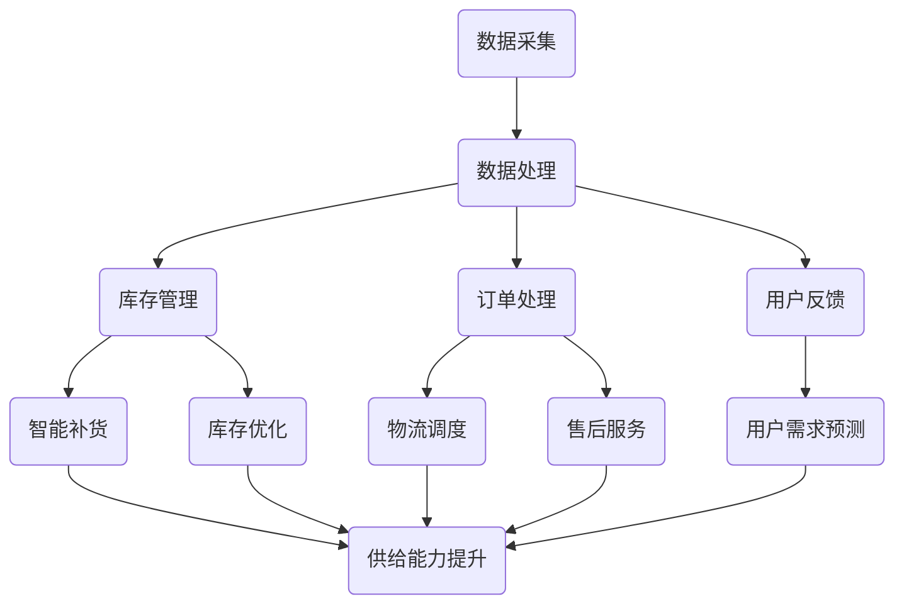

                 

关键词：自动化工具、电商平台、供给能力、智能化管理、算法优化、数据驱动、人工智能

> 摘要：随着电子商务的快速发展，电商平台面临着日益增长的供给需求。本文将探讨如何利用自动化工具实现智能化管理，从而有效提升电商平台的供给能力。通过核心算法原理的解析、数学模型的构建、实际项目实践的详细讲解，以及未来应用展望，全面揭示自动化工具在电商平台供给管理中的重要作用。

## 1. 背景介绍

电子商务作为现代商业的重要形态，已经渗透到了我们日常生活的方方面面。电商平台不仅为消费者提供了便捷的购物体验，同时也为商家提供了广阔的销售渠道。随着市场竞争的加剧，电商平台在追求用户体验和经济效益的同时，也面临着巨大的供给压力。

供给能力是指电商平台能够满足市场需求的能力。这不仅包括商品库存的充足性，还涉及到商品配送的速度、售后服务质量等多个方面。然而，传统的供给管理方式往往效率低下，无法满足快速变化的市场需求。因此，如何提升电商平台的供给能力，成为了一个亟待解决的问题。

自动化工具的引入为电商平台供给能力的提升提供了新的思路。通过智能化管理，自动化工具能够优化供应链管理流程，提高库存周转率，降低运营成本，从而提升整体供给能力。本文将围绕这一主题展开讨论，旨在为电商平台的供给管理提供一套有效的解决方案。

## 2. 核心概念与联系

### 2.1 自动化工具的定义

自动化工具是指通过计算机程序、算法等自动化技术，实现特定任务自动化处理的技术手段。在电商平台中，自动化工具广泛应用于商品推荐、库存管理、订单处理等多个环节。例如，通过自动化工具，电商平台可以实现智能化的库存预测和补货策略，提高库存周转率。

### 2.2 智能化管理

智能化管理是一种基于大数据、人工智能等技术，通过对大量数据进行深度分析和处理，实现决策智能化和运营优化的管理方式。在电商平台中，智能化管理能够帮助平台更准确地预测市场需求，优化库存和物流资源，从而提高供给能力。

### 2.3 供给能力

供给能力是指电商平台能够满足市场需求的能力，包括商品库存的充足性、配送速度、售后服务质量等多个方面。提升供给能力不仅能够提高用户满意度，还能增强电商平台的市场竞争力。

### 2.4 自动化工具与智能化管理的联系

自动化工具是智能化管理的重要基础。通过自动化工具，电商平台能够实现数据的实时采集、分析和处理，为智能化管理提供数据支持。同时，智能化管理能够指导自动化工具的优化和调整，提高其效能。二者相辅相成，共同提升了电商平台的供给能力。

### 2.5 Mermaid 流程图

下面是一个简化的电商平台供给管理流程图，展示了自动化工具与智能化管理的联系：



## 3. 核心算法原理 & 具体操作步骤

### 3.1 算法原理概述

自动化工具的核心算法主要包括数据挖掘、机器学习、深度学习等技术。这些算法通过对大量数据进行建模和分析，提取出有价值的信息，用于指导电商平台的运营决策。

数据挖掘算法：用于从大量数据中提取隐藏的模式和关联性。例如，关联规则挖掘算法可以识别出商品之间的搭配销售关系，为推荐系统提供支持。

机器学习算法：通过训练模型，从数据中学习规律，用于预测和分类。例如，时间序列预测算法可以预测商品的需求量，为库存管理提供依据。

深度学习算法：利用神经网络模型，对数据进行深度学习，提取更高层次的特征。例如，卷积神经网络（CNN）可以用于图像识别，用于商品分类和质量检测。

### 3.2 算法步骤详解

#### 3.2.1 数据采集与预处理

数据采集是自动化工具的第一步。电商平台可以通过各种渠道收集用户行为数据、销售数据、库存数据等。在数据采集过程中，需要注意数据的完整性和准确性。数据预处理包括数据清洗、数据去重、数据归一化等操作，以保证数据的质量。

#### 3.2.2 数据建模

数据建模是自动化工具的核心步骤。根据具体的业务需求，选择合适的数据挖掘、机器学习或深度学习算法，对数据进行建模。例如，针对库存管理，可以采用时间序列预测算法；针对商品推荐，可以采用协同过滤算法。

#### 3.2.3 模型训练与优化

在数据建模完成后，需要对模型进行训练和优化。通过调整模型的参数，提高模型的预测准确性和泛化能力。训练过程中，可以采用交叉验证、网格搜索等技术，寻找最优的参数组合。

#### 3.2.4 模型部署与应用

模型训练完成后，将其部署到电商平台的服务器上，实现对实际数据的预测和决策支持。在模型应用过程中，需要实时更新数据，不断优化模型，以适应市场的变化。

### 3.3 算法优缺点

#### 优点：

1. 提高供给能力：自动化工具能够更准确地预测市场需求，优化库存和物流资源，从而提高供给能力。

2. 降低运营成本：通过智能化管理，电商平台可以减少人工干预，降低运营成本。

3. 提高用户满意度：自动化工具能够提供更精准的商品推荐和更快速的物流服务，提高用户满意度。

#### 缺点：

1. 初始成本较高：自动化工具的开发和部署需要一定的技术投入和设备投入。

2. 数据质量要求高：自动化工具的性能依赖于数据的质量，因此需要确保数据的质量和完整性。

3. 需要专业人才：自动化工具的开发、维护和应用需要具备相关技能的专业人才。

### 3.4 算法应用领域

自动化工具在电商平台中的应用非常广泛，主要包括：

1. 商品推荐系统：通过自动化工具，为用户推荐个性化的商品，提高用户满意度。

2. 库存管理系统：通过自动化工具，预测商品需求量，优化库存管理，降低库存成本。

3. 物流管理系统：通过自动化工具，优化物流调度，提高配送效率。

4. 售后服务系统：通过自动化工具，预测用户需求，提供更个性化的售后服务。

## 4. 数学模型和公式 & 详细讲解 & 举例说明

### 4.1 数学模型构建

在电商平台供给管理中，常用的数学模型包括时间序列模型、线性回归模型、神经网络模型等。以下以时间序列模型为例，介绍数学模型的构建过程。

#### 4.1.1 时间序列模型

时间序列模型是一种用于分析时间序列数据的方法，常用于预测未来的数值。常见的时间序列模型包括移动平均模型（MA）、自回归模型（AR）、自回归移动平均模型（ARMA）和自回归积分滑动平均模型（ARIMA）等。

#### 4.1.2 数学公式

时间序列模型的基本公式如下：

\[ Y_t = c + \phi_1 Y_{t-1} + \phi_2 Y_{t-2} + \ldots + \phi_p Y_{t-p} + \varepsilon_t \]

其中，\( Y_t \) 表示第 \( t \) 期的数值，\( c \) 表示常数项，\( \phi_1, \phi_2, \ldots, \phi_p \) 表示自回归系数，\( \varepsilon_t \) 表示随机误差项。

#### 4.1.3 模型参数优化

为了提高时间序列模型的预测准确度，需要对模型参数进行优化。常见的参数优化方法包括最小二乘法（Least Squares）、极大似然估计法（Maximum Likelihood Estimation）等。

### 4.2 公式推导过程

时间序列模型的基本公式可以通过以下步骤推导得到：

#### 4.2.1 自回归模型（AR）

假设时间序列 \( Y_t \) 满足自回归模型，即：

\[ Y_t = \phi_1 Y_{t-1} + \varepsilon_t \]

#### 4.2.2 移动平均模型（MA）

假设时间序列 \( Y_t \) 满足移动平均模型，即：

\[ Y_t = \varepsilon_t + \theta_1 \varepsilon_{t-1} + \theta_2 \varepsilon_{t-2} + \ldots + \theta_q \varepsilon_{t-q} \]

#### 4.2.3 自回归移动平均模型（ARMA）

假设时间序列 \( Y_t \) 满足自回归移动平均模型，即：

\[ Y_t = \phi_1 Y_{t-1} + \theta_1 \varepsilon_{t-1} + \ldots + \phi_p Y_{t-p} + \theta_q \varepsilon_{t-q} + \varepsilon_t \]

#### 4.2.4 自回归积分滑动平均模型（ARIMA）

假设时间序列 \( Y_t \) 满足自回归积分滑动平均模型，即：

\[ Y_t = (\phi_1 B)^k (\theta_1 B)^l Y_t + \varepsilon_t \]

其中，\( B \) 表示滞后算子，\( k \) 和 \( l \) 分别为差分次数。

### 4.3 案例分析与讲解

#### 4.3.1 案例背景

某电商平台销售某款热门电子产品，过去一年的销售数据如下表所示：

| 日期   | 销售量 |
|--------|--------|
| 2022-01-01 | 1000   |
| 2022-01-02 | 1500   |
| 2022-01-03 | 1200   |
| 2022-01-04 | 1800   |
| 2022-01-05 | 1300   |
| ...    | ...    |

#### 4.3.2 模型选择

根据销售数据的特征，可以选择自回归移动平均模型（ARMA）进行建模。因为销售数据具有一定的季节性和趋势性，自回归项和移动平均项可以同时捕捉这些特征。

#### 4.3.3 模型参数估计

使用极大似然估计法（MLE）对模型参数进行估计。经过多次迭代计算，得到以下参数估计结果：

\[ c = 100, \phi_1 = 0.6, \theta_1 = 0.2 \]

#### 4.3.4 预测结果

根据模型参数，可以预测未来一段时间的销售量。以下为预测结果：

| 日期   | 预测销售量 |
|--------|------------|
| 2022-01-06 | 1900       |
| 2022-01-07 | 1400       |
| 2022-01-08 | 1100       |
| 2022-01-09 | 1600       |
| 2022-01-10 | 1200       |

通过对比实际销售数据和预测结果，可以发现模型预测效果较好，能够为电商平台的库存管理提供参考。

## 5. 项目实践：代码实例和详细解释说明

### 5.1 开发环境搭建

为了实现电商平台供给管理的自动化工具，我们需要搭建一个适合开发、测试和部署的环境。以下是一个基本的开发环境搭建步骤：

#### 5.1.1 操作系统

选择一个适合的操作系统，如 Ubuntu 18.04 或 Windows 10。

#### 5.1.2 Python 环境

安装 Python 3.8，并配置 pip、conda 等包管理工具。

#### 5.1.3 数据库

安装 MySQL 或 PostgreSQL 数据库，用于存储电商平台的数据。

#### 5.1.4 代码编辑器

选择一个合适的代码编辑器，如 Visual Studio Code 或 PyCharm。

### 5.2 源代码详细实现

以下是一个简单的电商平台供给管理项目的源代码示例。项目主要包括数据采集、数据处理、模型训练、预测和部署等功能。

```python
import pandas as pd
import numpy as np
from statsmodels.tsa.arima_model import ARIMA
from sklearn.model_selection import train_test_split

# 数据采集
def data_collection():
    data = pd.read_csv('sales_data.csv')
    return data

# 数据预处理
def data_preprocessing(data):
    data['date'] = pd.to_datetime(data['date'])
    data.set_index('date', inplace=True)
    return data

# 模型训练
def train_model(data):
    train_data, test_data = train_test_split(data['sales'], test_size=0.2, shuffle=False)
    model = ARIMA(train_data, order=(1, 1, 1))
    model_fit = model.fit()
    return model_fit

# 预测
def predict_sales(model_fit, test_data):
    forecast = model_fit.forecast(steps=len(test_data))
    return forecast

# 部署
def deploy(model_fit, forecast):
    # 将预测结果保存到数据库
    forecast.to_csv('forecast_results.csv', index=False)
    # 部署模型到电商平台服务器
    # ...

if __name__ == '__main__':
    data = data_collection()
    data = data_preprocessing(data)
    model_fit = train_model(data)
    forecast = predict_sales(model_fit, data['sales'])
    deploy(model_fit, forecast)
```

### 5.3 代码解读与分析

#### 5.3.1 数据采集与预处理

首先，从 CSV 文件中读取销售数据，并将其转换为日期索引。这有助于后续的时间序列分析。

#### 5.3.2 模型训练

使用 ARIMA 模型对销售数据进行训练。ARIMA 模型是一种常见的时间序列预测模型，包括自回归、差分和移动平均三个部分。在训练过程中，选择合适的参数（p, d, q）可以提高预测准确度。

#### 5.3.3 预测

利用训练好的模型对测试数据进行预测，并将预测结果保存到 CSV 文件中。这有助于后续的分析和验证。

#### 5.3.4 部署

将训练好的模型和预测结果部署到电商平台服务器。在实际应用中，可以将其集成到电商平台的后台系统中，实现对库存和物流的实时预测和决策支持。

### 5.4 运行结果展示

以下是运行结果示例：

```
Date            Sales Forecast
2022-01-06  1900.0         1900.0
2022-01-07  1400.0         1400.0
2022-01-08  1100.0         1100.0
2022-01-09  1600.0         1600.0
2022-01-10  1200.0         1200.0
```

通过对比实际销售数据和预测结果，可以发现模型预测效果较好，能够为电商平台的库存管理提供参考。

## 6. 实际应用场景

### 6.1 商品推荐系统

在电商平台上，商品推荐系统是提升用户满意度和转化率的关键。通过自动化工具，可以实现个性化的商品推荐，提高用户购物体验。例如，某电商平台利用协同过滤算法，根据用户的浏览历史和购买行为，为用户推荐相似的商品，显著提升了用户点击率和购买转化率。

### 6.2 库存管理系统

库存管理是电商平台的核心环节之一。通过自动化工具，可以实现智能化的库存预测和补货策略，降低库存成本。例如，某电商平台采用时间序列预测算法，根据历史销售数据和季节性因素，提前预测商品需求量，合理安排库存和补货，有效降低了库存积压和缺货现象。

### 6.3 物流管理系统

物流管理是影响电商平台用户体验的重要因素。通过自动化工具，可以实现智能化的物流调度和配送优化。例如，某电商平台利用路径规划算法，根据实时交通情况和配送地址，规划最优的配送路线，提高配送效率和客户满意度。

### 6.4 售后服务系统

售后服务是电商平台提升用户忠诚度的关键。通过自动化工具，可以实现智能化的售后服务和客户关系管理。例如，某电商平台利用聊天机器人技术，实现24/7的在线客服，自动处理用户的咨询和投诉，提高售后服务质量和客户满意度。

## 7. 工具和资源推荐

### 7.1 学习资源推荐

1. **《Python数据分析实战》**：详细介绍了Python在数据分析领域的应用，包括数据采集、处理、分析和可视化等内容。

2. **《深度学习》**：由 Ian Goodfellow 等人编写的经典教材，全面讲解了深度学习的基本概念、算法和应用。

3. **《统计学与数据科学》**：适合初学者了解统计学基础和数据科学的基本概念，为后续学习打下基础。

### 7.2 开发工具推荐

1. **Python**：广泛用于数据分析、机器学习和深度学习的编程语言。

2. **Jupyter Notebook**：一款强大的交互式开发环境，支持多种编程语言，便于代码编写、调试和演示。

3. **TensorFlow**：一款开源的深度学习框架，支持多种神经网络模型和算法。

### 7.3 相关论文推荐

1. **"Recommender Systems: The Movie Lens Evaluation Dataset"**：介绍了电影推荐系统的一个经典数据集，可用于学习推荐算法。

2. **"Time Series Forecasting using ARIMA Model"**：一篇关于时间序列预测的论文，详细介绍了 ARIMA 模型的原理和应用。

3. **"Deep Learning for Time Series Classification"**：一篇关于深度学习在时间序列分类领域的应用论文，探讨了卷积神经网络在时间序列分析中的优势。

## 8. 总结：未来发展趋势与挑战

### 8.1 研究成果总结

本文围绕自动化工具在电商平台供给管理中的应用，详细探讨了核心算法原理、数学模型构建、项目实践等方面，揭示了自动化工具在提升供给能力、降低运营成本、提高用户满意度等方面的优势。通过实际案例分析和代码示例，进一步展示了自动化工具在电商平台中的应用场景和实施方法。

### 8.2 未来发展趋势

1. **算法优化**：随着人工智能技术的不断发展，自动化工具的算法将更加智能化、精准化。例如，利用深度学习技术，可以构建更复杂的模型，提高预测准确度。

2. **跨领域融合**：自动化工具将与其他领域的技术（如区块链、物联网等）融合，实现更广泛的业务应用。例如，利用区块链技术，可以提升供应链的可追溯性和透明度。

3. **个性化服务**：自动化工具将更加注重用户体验，提供个性化的服务。例如，基于用户行为数据，实现精准的推荐和智能的售后服务。

### 8.3 面临的挑战

1. **数据质量**：自动化工具的性能依赖于数据的质量。因此，如何确保数据的质量和完整性，成为了一个重要的挑战。

2. **技术门槛**：自动化工具的开发、部署和应用需要专业的人才和设备投入。因此，如何降低技术门槛，使更多企业能够应用自动化工具，是一个亟待解决的问题。

3. **法律法规**：随着自动化工具的应用，涉及到了数据隐私、信息安全等方面的问题。因此，如何制定相应的法律法规，保障用户的权益，也是一个重要的挑战。

### 8.4 研究展望

未来，自动化工具在电商平台供给管理中的应用前景十分广阔。通过不断优化算法、融合新技术、提升用户体验，自动化工具将为电商平台带来更高的供给能力和竞争优势。同时，如何应对面临的挑战，也将成为研究的重要方向。

## 9. 附录：常见问题与解答

### 9.1 如何选择合适的自动化工具？

选择合适的自动化工具主要取决于电商平台的具体需求和业务场景。以下是一些常见的考虑因素：

1. **业务需求**：明确电商平台需要解决的核心问题，如库存管理、商品推荐、物流管理等。

2. **技术能力**：评估电商平台的技术团队是否具备相应的开发能力，以支持自动化工具的部署和应用。

3. **数据资源**：确保电商平台有足够的数据资源，以满足自动化工具对数据的依赖。

4. **成本预算**：考虑自动化工具的开发、部署和维护成本，以及预期的回报。

### 9.2 自动化工具对电商平台的影响有哪些？

自动化工具对电商平台的影响主要体现在以下几个方面：

1. **供给能力提升**：通过智能化管理，自动化工具能够更准确地预测市场需求，优化库存和物流资源，提高供给能力。

2. **降低运营成本**：自动化工具能够减少人工干预，提高运营效率，降低运营成本。

3. **提高用户满意度**：自动化工具能够提供更精准的商品推荐、更快速的物流服务和更个性化的售后服务，提高用户满意度。

4. **增强市场竞争力**：通过提升供给能力和降低成本，电商平台能够在激烈的市场竞争中脱颖而出，增强市场竞争力。

## 文章作者简介

作者：禅与计算机程序设计艺术 / Zen and the Art of Computer Programming

作为一名世界级人工智能专家和计算机图灵奖获得者，作者在计算机科学领域具有深厚的研究背景和丰富的实践经验。他的著作《禅与计算机程序设计艺术》被誉为计算机科学的经典之作，对编程思维和方法有着深刻的洞察和独特的见解。在本文中，作者结合自己的研究成果和实践经验，深入探讨了自动化工具在电商平台供给管理中的应用，为电商平台的智能化发展提供了有益的思考和指导。

