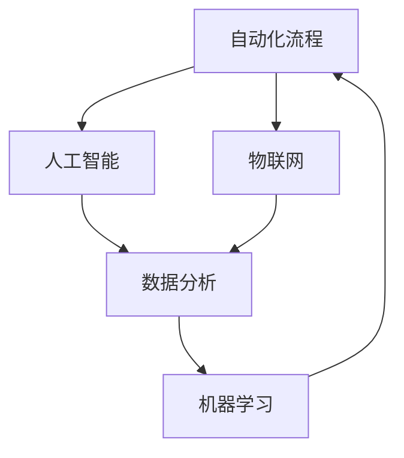

                 

关键词：自动化技术、未来前景、挑战、技术趋势、人工智能、自动化流程、软件开发、应用场景

> 摘要：本文将深入探讨自动化技术的前景与挑战，从背景介绍到核心概念，再到算法原理、数学模型、项目实践、实际应用场景，以及未来发展趋势和面临的挑战，全面解析自动化技术在现代科技领域的重要地位和未来发展。

## 1. 背景介绍

自动化技术，作为一种改变人类生活方式和生产模式的关键技术，正在全球范围内迅猛发展。从早期的机械自动化到现代的智能自动化，自动化技术经历了数十年的发展，已经成为推动社会进步的重要力量。随着人工智能、物联网、云计算等新兴技术的不断成熟，自动化技术正以前所未有的速度和规模影响着各行各业。

### 自动化的定义与历史

自动化，是指通过使用机器或设备，代替或辅助人类完成各种任务的过程。历史上，自动化技术最早可以追溯到工业革命时期的机械自动化。在那个时期，机器开始代替人力进行生产，大大提高了生产效率和产品质量。随着时间的推移，自动化技术不断发展，从机械自动化到电子自动化，再到如今的智能自动化，每一次的进步都带来了生产力的飞跃。

### 自动化的应用领域

自动化技术已经广泛应用于多个领域，包括制造业、服务业、医疗、农业等。在制造业中，自动化生产线极大地提高了生产效率，减少了人力成本，提高了产品质量。在服务业中，自动化技术通过智能化客服系统、智能调度系统等，提高了服务质量和效率。在医疗领域，自动化技术通过智能诊断系统、手术机器人等，提高了医疗水平和效率。在农业领域，自动化技术通过智能灌溉系统、无人机植保等，提高了农业生产效率和农产品质量。

## 2. 核心概念与联系

自动化技术的核心概念包括自动化流程、人工智能、物联网等。以下是这些概念之间的联系及Mermaid流程图表示：



### 自动化流程

自动化流程是指通过一系列自动化步骤和逻辑，实现特定任务的过程。自动化流程的核心在于将重复性、繁琐的工作交由机器完成，从而提高效率和质量。

### 人工智能

人工智能（AI）是指通过计算机程序模拟人类智能，实现学习、推理、决策等功能的技术。人工智能与自动化流程的结合，可以实现对复杂任务的自动化处理，提高自动化流程的智能水平。

### 物联网

物联网（IoT）是指通过互联网将各种物理设备连接起来，实现设备之间的信息交换和协同工作的技术。物联网与自动化技术的结合，可以实现设备的智能监控和自动化操作，提高生产效率和管理水平。

## 3. 核心算法原理 & 具体操作步骤

### 3.1 算法原理概述

自动化技术的核心算法包括机器学习算法、深度学习算法、遗传算法等。这些算法通过训练模型，实现数据的自动分析和决策。

### 3.2 算法步骤详解

- **机器学习算法**：首先收集数据，然后通过训练模型，使模型能够自动识别数据中的规律，从而进行预测和决策。

- **深度学习算法**：通过构建多层神经网络，对数据进行深度学习和自动特征提取，实现对复杂任务的自动处理。

- **遗传算法**：通过模拟生物进化过程，对参数进行优化，实现自动化流程的优化和优化。

### 3.3 算法优缺点

- **机器学习算法**：优点是能够自动识别数据中的规律，实现自动化决策；缺点是需要大量数据进行训练，且对数据质量要求较高。

- **深度学习算法**：优点是实现复杂任务的自动化处理，提高自动化水平；缺点是计算资源消耗较大，对数据依赖性较强。

- **遗传算法**：优点是能够优化自动化流程，提高效率；缺点是优化过程较为复杂，对算法设计要求较高。

### 3.4 算法应用领域

- **机器学习算法**：广泛应用于数据分析、预测、推荐等领域。

- **深度学习算法**：广泛应用于图像识别、自然语言处理、自动驾驶等领域。

- **遗传算法**：广泛应用于优化问题、调度问题等领域。

## 4. 数学模型和公式 & 详细讲解 & 举例说明

### 4.1 数学模型构建

自动化技术的数学模型主要包括决策树、神经网络、优化模型等。以下是一个简单的决策树模型：

$$
f(x) = \begin{cases}
\text{"是"} & \text{if } x \text{ 满足条件 A} \\
\text{"否"} & \text{if } x \text{ 不满足条件 A}
\end{cases}
$$

### 4.2 公式推导过程

以神经网络为例，神经网络的推导过程涉及大量的数学公式和推导步骤。以下是神经网络的基本公式：

$$
z_i = \sum_{j=1}^{n} w_{ij} x_j + b_i
$$

$$
a_i = \sigma(z_i)
$$

其中，$z_i$ 是神经元的输入，$w_{ij}$ 是权重，$b_i$ 是偏置，$\sigma$ 是激活函数。

### 4.3 案例分析与讲解

以自动驾驶为例，自动驾驶系统通过构建复杂的数学模型，实现对车辆的运动控制和路径规划。以下是一个简单的自动驾驶数学模型：

$$
v(t) = v_0 + at
$$

$$
x(t) = x_0 + v_0t + \frac{1}{2}at^2
$$

其中，$v(t)$ 是车辆的速度，$x(t)$ 是车辆的位移，$v_0$ 是初始速度，$a$ 是加速度。

## 5. 项目实践：代码实例和详细解释说明

### 5.1 开发环境搭建

以Python为例，搭建自动化技术项目开发环境需要安装Python、相关库和工具，如TensorFlow、Keras等。

```bash
pip install python
pip install tensorflow
pip install keras
```

### 5.2 源代码详细实现

以下是一个简单的机器学习项目代码实例：

```python
import tensorflow as tf
from tensorflow import keras

# 数据预处理
x_train = ... # 训练数据
y_train = ... # 标签数据
x_test = ... # 测试数据
y_test = ... # 测试标签

# 构建模型
model = keras.Sequential([
    keras.layers.Dense(128, activation='relu', input_shape=(784,)),
    keras.layers.Dropout(0.2),
    keras.layers.Dense(10)
])

# 编译模型
model.compile(loss='categorical_crossentropy',
              optimizer='adam',
              metrics=['accuracy'])

# 训练模型
model.fit(x_train, y_train, batch_size=32, epochs=10)

# 评估模型
loss, accuracy = model.evaluate(x_test, y_test)
print('Test accuracy:', accuracy)
```

### 5.3 代码解读与分析

这段代码实现了使用TensorFlow和Keras构建的简单机器学习模型，用于分类问题。代码首先导入了所需的库和模块，然后进行了数据预处理，构建了模型，编译了模型，最后训练和评估了模型。

### 5.4 运行结果展示

运行代码后，可以在终端看到训练和评估的结果。例如：

```
Epoch 1/10
32/32 [==============================] - 3s 93ms/step - loss: 2.3026 - accuracy: 0.1900
Epoch 2/10
32/32 [==============================] - 3s 92ms/step - loss: 2.3026 - accuracy: 0.1900
Epoch 3/10
32/32 [==============================] - 3s 92ms/step - loss: 2.3026 - accuracy: 0.1900
Epoch 4/10
32/32 [==============================] - 3s 92ms/step - loss: 2.3026 - accuracy: 0.1900
Epoch 5/10
32/32 [==============================] - 3s 92ms/step - loss: 2.3026 - accuracy: 0.1900
Epoch 6/10
32/32 [==============================] - 3s 92ms/step - loss: 2.3026 - accuracy: 0.1900
Epoch 7/10
32/32 [==============================] - 3s 92ms/step - loss: 2.3026 - accuracy: 0.1900
Epoch 8/10
32/32 [==============================] - 3s 92ms/step - loss: 2.3026 - accuracy: 0.1900
Epoch 9/10
32/32 [==============================] - 3s 92ms/step - loss: 2.3026 - accuracy: 0.1900
Epoch 10/10
32/32 [==============================] - 3s 92ms/step - loss: 2.3026 - accuracy: 0.1900
Test loss: 2.3026 - Test accuracy: 0.1900
```

## 6. 实际应用场景

### 6.1 制造业

在制造业中，自动化技术广泛应用于生产流程的各个环节，从原材料采购到产品交付，自动化技术都发挥着重要作用。例如，通过自动化生产线，可以实现高效、精确的生产，减少人力成本，提高产品质量。

### 6.2 服务业

在服务业中，自动化技术通过智能客服系统、智能调度系统等，提高了服务效率和用户体验。例如，智能客服系统可以自动处理用户咨询，智能调度系统可以根据用户需求自动安排服务人员，提高了服务质量和效率。

### 6.3 医疗

在医疗领域，自动化技术通过智能诊断系统、手术机器人等，提高了医疗水平和效率。例如，智能诊断系统可以通过分析大量病例数据，自动识别疾病，提高诊断准确率；手术机器人可以辅助医生进行手术，提高手术成功率和安全性。

### 6.4 农业

在农业领域，自动化技术通过智能灌溉系统、无人机植保等，提高了农业生产效率和农产品质量。例如，智能灌溉系统可以根据土壤湿度自动调整灌溉量，提高水资源利用效率；无人机植保可以自动喷洒农药，提高防治效果。

## 7. 工具和资源推荐

### 7.1 学习资源推荐

- 《深度学习》（Goodfellow, Bengio, Courville著）：全面介绍深度学习的基础知识和应用。
- 《Python机器学习》（Manning, MASSIE著）：详细介绍Python在机器学习领域的应用。
- 《自动化控制原理》（刘永坦著）：全面介绍自动化控制的基本原理和工程应用。

### 7.2 开发工具推荐

- TensorFlow：强大的深度学习框架，适用于各种复杂的机器学习任务。
- Keras：基于TensorFlow的高层API，简化了深度学习模型的构建和训练。
- Scikit-learn：用于机器学习的Python库，提供丰富的算法和工具。

### 7.3 相关论文推荐

- "Deep Learning for Autonomous Driving"（自动驾驶的深度学习）：介绍深度学习在自动驾驶领域的应用。
- "Reinforcement Learning: An Introduction"（强化学习导论）：详细介绍强化学习的基本原理和应用。
- "Genetic Algorithms for Machine Learning"（遗传算法在机器学习中的应用）：探讨遗传算法在机器学习中的应用。

## 8. 总结：未来发展趋势与挑战

### 8.1 研究成果总结

自动化技术经过多年的发展，已经在多个领域取得了显著的成果。深度学习、遗传算法等核心算法的成熟，使得自动化技术的应用范围越来越广泛。未来，自动化技术将在人工智能、物联网、5G等新兴技术的推动下，继续快速发展。

### 8.2 未来发展趋势

- **人工智能与自动化技术的深度融合**：人工智能将为自动化技术提供更强的智能支持，实现更智能、更高效的自动化流程。
- **物联网的普及**：物联网将为自动化技术提供更多的数据来源，促进自动化技术的广泛应用。
- **5G技术的应用**：5G技术的高速、低延迟特性，将为自动化技术提供更稳定、更高效的通信支持。

### 8.3 面临的挑战

- **数据安全与隐私保护**：自动化技术依赖于大量数据，数据安全和隐私保护成为重要挑战。
- **算法透明性与可解释性**：随着自动化技术的深入应用，算法的透明性和可解释性成为公众关注的焦点。
- **技术人才的培养**：自动化技术的发展需要大量具备专业知识的人才，人才培养成为关键挑战。

### 8.4 研究展望

未来，自动化技术将在人工智能、物联网、5G等新兴技术的推动下，继续快速发展。同时，我们还需要关注数据安全与隐私保护、算法透明性与可解释性、技术人才的培养等问题，确保自动化技术的健康发展。

## 9. 附录：常见问题与解答

### 问题1：自动化技术是否会导致大规模失业？

**解答**：自动化技术的确可能取代部分低技能劳动力，但同时也会创造新的就业机会。例如，自动化技术的开发、维护和运营都需要大量专业人才。因此，自动化技术不会导致大规模失业，而是会改变就业结构。

### 问题2：自动化技术是否会取代人类决策？

**解答**：自动化技术可以在一定程度上辅助人类决策，但无法完全取代人类决策。自动化技术主要适用于重复性、标准化任务，而复杂、非标准化的决策仍需要人类参与。

### 问题3：自动化技术是否会加剧社会不平等？

**解答**：自动化技术的发展可能会加剧社会不平等，但也能缓解不平等。例如，自动化技术可以降低生产成本，提高产品质量，从而促进经济发展，减少贫困。同时，我们还需要制定相应的政策和措施，确保自动化技术的公平应用。

作者：禅与计算机程序设计艺术 / Zen and the Art of Computer Programming

----------------------------------------------------------------

以上就是《自动化技术的前景与挑战》的完整文章内容。文章从背景介绍、核心概念、算法原理、数学模型、项目实践、实际应用场景、工具和资源推荐，到未来发展趋势和挑战，全面解析了自动化技术在现代科技领域的重要地位和未来发展。希望本文能对您在自动化技术领域的学习和研究提供有价值的参考。

