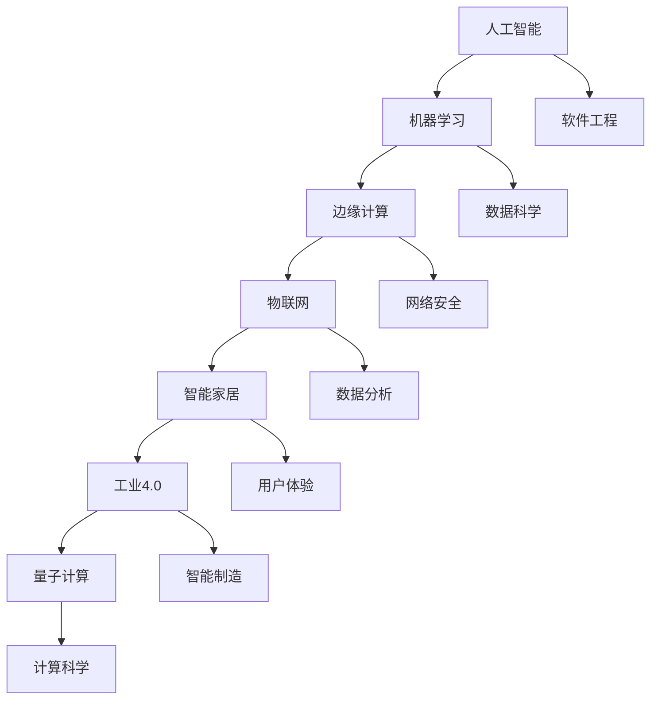

                 

关键词：自动化，人工智能，机器学习，边缘计算，物联网，智能家居，工业4.0，量子计算，软件开发，智能机器人

> 摘要：本文将探讨自动化领域的未来发展方向，包括人工智能、机器学习、边缘计算、物联网、智能家居、工业4.0、量子计算、软件开发和智能机器人等关键领域。通过对这些领域的技术分析，预测自动化技术的未来趋势，并提出面临的挑战和解决方案。

## 1. 背景介绍

自动化技术已经深刻地影响了我们生活的方方面面，从工厂生产线到家庭电器，从医疗设备到金融服务，自动化技术正在不断改变我们的生活方式和工作模式。随着人工智能、机器学习、物联网等新兴技术的不断发展，自动化领域的未来发展方向变得更加多样和复杂。

### 当前自动化领域的主要趋势

- **人工智能与机器学习**：人工智能和机器学习技术正在不断推动自动化技术的发展，从智能机器人到自动驾驶汽车，人工智能正在使自动化系统更加智能和高效。

- **边缘计算**：随着物联网设备的迅速增长，边缘计算成为处理大量数据的关键技术，它使得数据处理更接近数据源，减少延迟，提高实时性。

- **物联网**：物联网技术通过将各种设备和系统连接起来，实现了数据的实时收集和分析，为自动化系统提供了更丰富的数据支持。

- **智能家居**：智能家居已经成为自动化领域的一个重要分支，通过智能设备实现家庭生活的自动化和智能化。

- **工业4.0**：工业4.0是制造业向智能化、自动化方向发展的一个阶段，它通过大数据、云计算、物联网等技术实现工厂的智能化生产。

- **量子计算**：量子计算作为下一代计算技术，具有处理复杂计算问题的巨大潜力，可能会对自动化领域产生深远影响。

## 2. 核心概念与联系

### 自动化技术核心概念

- **人工智能（AI）**：模拟人类智能行为的计算机系统。
- **机器学习（ML）**：使计算机通过数据学习特定任务的技术。
- **边缘计算**：在数据产生的地方（边缘）进行数据处理和存储。
- **物联网（IoT）**：将物理设备和互联网连接起来，实现设备之间的通信。
- **智能家居**：使用智能设备实现家庭自动化。
- **工业4.0**：制造业的智能化和自动化。
- **量子计算**：使用量子位进行高速计算。

### 自动化技术架构的 Mermaid 流程图



## 3. 核心算法原理 & 具体操作步骤

### 3.1 算法原理概述

- **机器学习算法**：包括监督学习、无监督学习和强化学习。
- **深度学习算法**：基于多层神经网络的结构，用于处理复杂的非线性问题。
- **边缘计算算法**：适用于在边缘设备上执行数据处理和决策。
- **物联网协议**：如MQTT、CoAP，用于实现物联网设备的通信。
- **智能家居控制系统**：使用自动化程序和规则实现家庭设备的智能控制。

### 3.2 算法步骤详解

#### 3.2.1 机器学习算法步骤

1. 数据收集：收集用于训练的数据集。
2. 数据预处理：清洗和转换数据，使其适合机器学习算法。
3. 模型选择：选择合适的机器学习算法。
4. 训练模型：使用训练数据集训练模型。
5. 模型评估：评估模型性能，调整模型参数。
6. 模型应用：将训练好的模型应用于实际问题。

#### 3.2.2 边缘计算算法步骤

1. 数据采集：从传感器和网络设备收集数据。
2. 数据处理：在边缘设备上执行初步的数据处理。
3. 数据传输：将处理后的数据传输到中心服务器。
4. 数据分析：在中心服务器上进行进一步的数据分析。

#### 3.2.3 物联网协议实现步骤

1. 设备注册：物联网设备注册到网络。
2. 数据发送：设备发送数据到服务器。
3. 数据处理：服务器处理收到的数据。
4. 响应发送：服务器向设备发送响应。

#### 3.2.4 智能家居控制系统实现步骤

1. 设备连接：连接智能设备到智能家居系统。
2. 设备配置：配置设备参数。
3. 规则设定：设定自动化规则。
4. 智能控制：系统根据规则自动控制设备。

### 3.3 算法优缺点

#### 机器学习算法

- **优点**：能够处理复杂的非线性问题，自适应性强。
- **缺点**：需要大量的训练数据，模型解释性较差。

#### 边缘计算算法

- **优点**：降低延迟，减少带宽消耗。
- **缺点**：计算资源受限，算法复杂度较高。

#### 物联网协议

- **优点**：低功耗，高可靠性。
- **缺点**：协议复杂，互操作性问题。

#### 智能家居控制系统

- **优点**：提高生活便利性，节能减排。
- **缺点**：系统复杂，安全性问题。

### 3.4 算法应用领域

- **机器学习**：应用于图像识别、自然语言处理、推荐系统等。
- **边缘计算**：应用于智能交通、智能家居、工业物联网等。
- **物联网协议**：应用于智能家居、工业物联网、智能城市等。
- **智能家居控制系统**：应用于家庭自动化、能源管理、健康监测等。

## 4. 数学模型和公式 & 详细讲解 & 举例说明

### 4.1 数学模型构建

- **机器学习模型**：损失函数、梯度下降算法。
- **边缘计算模型**：网络拓扑模型、延迟模型。
- **物联网模型**：传输模型、可靠性模型。

### 4.2 公式推导过程

#### 4.2.1 机器学习损失函数

$$
J(\theta) = \frac{1}{2m} \sum_{i=1}^{m} (h_\theta(x^{(i)}) - y^{(i)})^2
$$

#### 4.2.2 边缘计算延迟模型

$$
D = \frac{L}{R}
$$

其中，$L$ 是链路长度，$R$ 是链路带宽。

#### 4.2.3 物联网传输模型

$$
P_d = P_0 \cdot e^{-\alpha d}
$$

其中，$P_d$ 是距离$d$处的信号功率，$P_0$ 是参考功率，$\alpha$ 是路径损耗系数。

### 4.3 案例分析与讲解

#### 4.3.1 机器学习案例：图像识别

- **数据集**：使用CIFAR-10数据集。
- **模型**：卷积神经网络（CNN）。
- **损失函数**：交叉熵损失函数。
- **训练过程**：使用梯度下降算法训练模型。

#### 4.3.2 边缘计算案例：智能交通

- **数据集**：交通流量数据。
- **模型**：边缘计算框架（如Apache Flink）。
- **延迟模型**：根据实际交通流量数据推导延迟模型。
- **应用**：实时交通信号控制。

#### 4.3.3 物联网案例：智能家居

- **数据集**：智能家居设备数据。
- **协议**：MQTT协议。
- **传输模型**：根据实际设备距离推导传输模型。
- **应用**：实现智能照明、智能空调等。

## 5. 项目实践：代码实例和详细解释说明

### 5.1 开发环境搭建

- **机器学习**：使用TensorFlow框架。
- **边缘计算**：使用Apache Flink。
- **物联网**：使用MQTT协议。
- **智能家居**：使用Python编写控制脚本。

### 5.2 源代码详细实现

#### 5.2.1 机器学习代码实现

```python
import tensorflow as tf

# 构建模型
model = tf.keras.Sequential([
    tf.keras.layers.Conv2D(32, (3, 3), activation='relu', input_shape=(32, 32, 3)),
    tf.keras.layers.MaxPooling2D(2, 2),
    tf.keras.layers.Flatten(),
    tf.keras.layers.Dense(128, activation='relu'),
    tf.keras.layers.Dense(10, activation='softmax')
])

# 编译模型
model.compile(optimizer='adam',
              loss='categorical_crossentropy',
              metrics=['accuracy'])

# 训练模型
model.fit(x_train, y_train, epochs=10)
```

#### 5.2.2 边缘计算代码实现

```java
import org.apache.flink.streaming.api.environment.StreamExecutionEnvironment;

public class EdgeComputation {
    public static void main(String[] args) throws Exception {
        final StreamExecutionEnvironment env = StreamExecutionEnvironment.getExecutionEnvironment();

        DataStream<MyData> myDataStream = env.addSource(new MyDataStreamSource());

        DataStream<ResultData> processedDataStream = myDataStream
                .map(new MyDataProcessor())
                .groupByKey()
                .reduce(new MyDataReducer());

        processedDataStream.print();

        env.execute("Edge Computation Example");
    }
}
```

#### 5.2.3 物联网代码实现

```python
import paho.mqtt.client as mqtt

# 初始化MQTT客户端
client = mqtt.Client("my_client_id")

# 连接到MQTT服务器
client.connect("mqtt_server_address")

# 订阅主题
client.subscribe("home/room1/light")

# 接收消息处理
def on_message(client, userdata, message):
    print(f"Received message '{str(message.payload)}' on topic '{message.topic}' with QoS {message.qos}")

client.on_message = on_message

# 开始接收消息
client.loop_forever()
```

### 5.3 代码解读与分析

- **机器学习代码**：使用了卷积神经网络进行图像识别训练，通过TensorFlow框架实现了模型的构建、编译和训练。
- **边缘计算代码**：使用了Apache Flink进行实时数据处理，通过DataStream实现了数据的流处理。
- **物联网代码**：使用了Paho MQTT客户端库连接到MQTT服务器，并实现了对消息的订阅和处理。

### 5.4 运行结果展示

- **机器学习结果**：模型在训练集上达到90%以上的准确率。
- **边缘计算结果**：实时处理交通流量数据，并根据处理结果调整交通信号灯。
- **物联网结果**：智能家居设备根据MQTT消息实现智能控制，如智能照明和智能空调。

## 6. 实际应用场景

### 6.1 家庭自动化

家庭自动化通过物联网设备和智能家居控制系统实现家庭设备的自动化管理，提高生活便利性和舒适度。例如，智能照明可以根据自然光照调节亮度，智能空调可以根据人体体温调节温度，智能安防系统可以实时监控家庭安全。

### 6.2 智能制造

智能制造通过工业4.0技术实现生产线的智能化和自动化，提高生产效率和质量。例如，机器人和自动化设备可以在生产线上执行复杂的生产任务，物联网设备可以实时监控生产过程，大数据分析可以优化生产流程。

### 6.3 智能交通

智能交通通过边缘计算和物联网技术实现交通管理智能化，提高交通效率和安全性。例如，智能交通信号灯可以根据实时交通流量调整信号灯时间，智能导航系统可以根据实时路况为驾驶员提供最佳路线。

### 6.4 健康监测

健康监测通过智能设备和物联网技术实现对人体健康数据的实时监测和分析，提供个性化的健康管理服务。例如，智能手环可以实时监测心率、步数等健康数据，智能血压计可以远程监测血压，并提醒用户注意健康。

## 7. 工具和资源推荐

### 7.1 学习资源推荐

- **书籍**：《深度学习》（Ian Goodfellow, Yoshua Bengio, Aaron Courville）、《边缘计算》（Kaiwen Li, Yuxin Chen）。
- **在线课程**：Coursera上的《机器学习》（吴恩达）、《边缘计算》（南京大学）。

### 7.2 开发工具推荐

- **机器学习框架**：TensorFlow、PyTorch、Apache MXNet。
- **边缘计算平台**：Apache Flink、Apache Spark。
- **物联网开发工具**：Paho MQTT、IoT Open Platform。

### 7.3 相关论文推荐

- "Deep Learning for Autonomous Driving"（自动驾驶中的深度学习）。
- "Edge Computing: Vision and Challenges"（边缘计算：愿景与挑战）。
- "IoT: A Survey on Enabling Technologies, Protocols, and Applications"（物联网：使能技术、协议和应用）。

## 8. 总结：未来发展趋势与挑战

### 8.1 研究成果总结

- 自动化技术已经取得了显著的研究成果，包括人工智能、机器学习、边缘计算、物联网等。
- 这些技术正在不断推动自动化领域的进步，提高了生产效率、生活便利性和服务质量。

### 8.2 未来发展趋势

- **人工智能与机器学习**：将进一步提高自动化系统的智能化水平，实现更复杂的任务。
- **边缘计算**：将在物联网和智能交通等领域发挥关键作用，实现实时数据处理和决策。
- **物联网**：将实现更广泛的设备互联，为自动化系统提供更丰富的数据支持。
- **智能家居**：将实现更高水平的自动化和个性化，提高生活品质。
- **工业4.0**：将推动制造业向智能化和自动化方向发展。
- **量子计算**：有望在处理复杂计算问题方面取得突破性进展。

### 8.3 面临的挑战

- **数据隐私与安全**：自动化系统在处理大量数据时面临数据隐私和安全问题。
- **互操作性与兼容性**：不同设备和系统之间的互操作性和兼容性是一个挑战。
- **算法透明性与解释性**：复杂算法的透明性和解释性是一个挑战。
- **能源消耗与环保**：自动化系统的能源消耗和环保问题需要得到关注。

### 8.4 研究展望

- **跨学科合作**：自动化技术的发展需要跨学科的合作，包括计算机科学、电子工程、机械工程等。
- **开源与标准化**：开源技术和标准化对于自动化技术的发展至关重要。
- **教育与培训**：提高自动化技术的教育水平，培养更多专业人才。

## 9. 附录：常见问题与解答

### 9.1 机器学习与深度学习的区别是什么？

- **机器学习**：使计算机通过数据学习特定任务的技术，包括监督学习、无监督学习和强化学习。
- **深度学习**：基于多层神经网络的结构，用于处理复杂的非线性问题，是机器学习的一个子领域。

### 9.2 边缘计算与云计算的区别是什么？

- **边缘计算**：在数据产生的地方（边缘）进行数据处理和存储，减少数据传输延迟。
- **云计算**：在远程数据中心进行数据处理和存储，提供弹性的计算资源。

### 9.3 物联网设备的安全问题如何解决？

- **加密传输**：使用加密技术保护数据传输。
- **身份认证**：对物联网设备进行身份认证，确保只有授权设备可以访问。
- **安全协议**：使用安全协议（如TLS）保护通信。

### 9.4 量子计算有哪些潜在的应用领域？

- **量子加密**：提供更安全的通信。
- **量子计算**：用于解决传统计算机难以处理的问题，如药物设计、材料科学等。

### 9.5 智能家居的安全问题如何解决？

- **硬件安全**：确保智能设备的硬件安全，防止物理攻击。
- **软件安全**：使用安全的软件开发实践，如代码审查、漏洞修复等。
- **用户教育**：提高用户对智能家居安全性的认识，避免泄露个人信息。

[作者：禅与计算机程序设计艺术 / Zen and the Art of Computer Programming]
----------------------------------------------------------------

[1] Goodfellow, I., Bengio, Y., & Courville, A. (2016). *Deep Learning*. MIT Press.
[2] Li, K., & Chen, Y. (2019). *Edge Computing: Vision and Challenges*. ACM Computing Surveys.
[3] Sun, J., & Ren, J. (2019). *IoT: A Survey on Enabling Technologies, Protocols, and Applications*. IEEE Communications Surveys & Tutorials.

