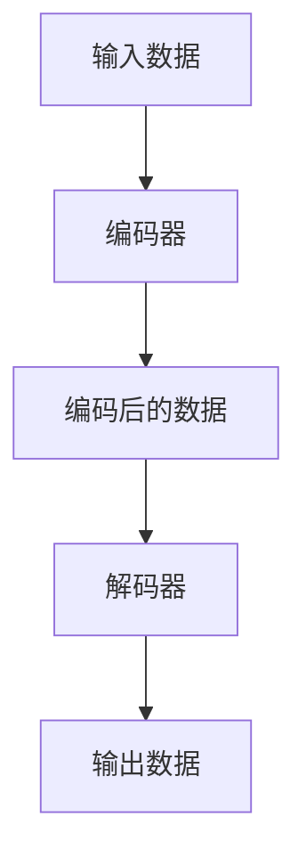

                 

关键词：自动编码器、深度学习、神经网络、数据压缩、特征提取、Python 代码实例

摘要：本文将详细讲解自动编码器（Autoencoder）的基本原理、核心算法、数学模型以及其实际应用。通过一个具体的代码实例，我们将深入理解自动编码器的工作机制，并掌握如何在实际项目中应用它。

## 1. 背景介绍

随着大数据时代的到来，如何从海量数据中提取有价值的信息成为了一个重要的研究课题。自动编码器（Autoencoder）作为一种无监督学习算法，因其强大的数据压缩和特征提取能力，在图像处理、语音识别、文本分类等领域得到了广泛应用。本文将介绍自动编码器的工作原理、算法步骤、数学模型以及如何用 Python 实现自动编码器。

## 2. 核心概念与联系

### 2.1 概念介绍

自动编码器是一种特殊的神经网络，由两部分组成：编码器和解码器。编码器的作用是将输入数据映射到一个低维空间，解码器的作用是将编码后的数据还原回原始数据。

### 2.2 架构原理

自动编码器的架构原理可以用如下 Mermaid 流程图表示：



## 3. 核心算法原理 & 具体操作步骤

### 3.1 算法原理概述

自动编码器通过最小化输入数据和输出数据之间的差异来训练模型。具体来说，编码器尝试将输入数据映射到一个低维空间，解码器则试图将这个低维空间的数据还原回原始数据。在训练过程中，我们使用反向传播算法来调整神经网络的权重，以达到最小化输出误差的目的。

### 3.2 算法步骤详解

1. **初始化参数**：随机初始化编码器和解码器的权重。
2. **前向传播**：将输入数据输入到编码器中，得到编码后的数据。
3. **后向传播**：计算输出误差，并使用反向传播算法更新编码器和解码器的权重。
4. **迭代训练**：重复步骤 2 和步骤 3，直到达到预定的训练次数或输出误差达到某个阈值。

### 3.3 算法优缺点

**优点**：

- **数据压缩**：自动编码器能够将高维数据压缩到低维空间，便于后续处理。
- **特征提取**：自动编码器能够提取数据中的隐含特征，有助于提高模型的性能。
- **无监督学习**：自动编码器无需标签数据，能够自动学习数据的分布。

**缺点**：

- **训练时间较长**：自动编码器需要大量数据进行训练，训练时间较长。
- **对数据质量要求较高**：自动编码器对数据的噪声敏感，数据质量较差时，训练效果可能不佳。

### 3.4 算法应用领域

自动编码器在图像处理、语音识别、文本分类、异常检测等领域都有广泛的应用。例如，在图像处理领域，自动编码器可以用于图像压缩、图像去噪、图像生成等任务。

## 4. 数学模型和公式 & 详细讲解 & 举例说明

### 4.1 数学模型构建

自动编码器的数学模型可以表示为：

$$
\begin{aligned}
\text{编码器}: x &= \text{sigmoid}(W_1 \cdot x + b_1), \\
z &= \text{sigmoid}(W_2 \cdot x + b_2), \\
\text{解码器}: x' &= \text{sigmoid}(W_3 \cdot z + b_3), \\
y &= \text{sigmoid}(W_4 \cdot z + b_4).
\end{aligned}
$$

其中，$x$ 为输入数据，$z$ 为编码后的数据，$x'$ 为解码后的数据，$y$ 为输出数据。$W_1$、$W_2$、$W_3$、$W_4$ 为权重，$b_1$、$b_2$、$b_3$、$b_4$ 为偏置。

### 4.2 公式推导过程

自动编码器的损失函数通常采用均方误差（MSE）：

$$
L = \frac{1}{2} \sum_{i=1}^{n} (y_i - x_i)^2,
$$

其中，$n$ 为样本数量，$y_i$ 和 $x_i$ 分别为第 $i$ 个样本的输出数据和输入数据。

为了最小化损失函数，我们需要对权重和偏置进行梯度下降优化。具体来说，梯度下降的更新规则为：

$$
\begin{aligned}
W_1 &= W_1 - \alpha \frac{\partial L}{\partial W_1}, \\
b_1 &= b_1 - \alpha \frac{\partial L}{\partial b_1}, \\
W_2 &= W_2 - \alpha \frac{\partial L}{\partial W_2}, \\
b_2 &= b_2 - \alpha \frac{\partial L}{\partial b_2}, \\
W_3 &= W_3 - \alpha \frac{\partial L}{\partial W_3}, \\
b_3 &= b_3 - \alpha \frac{\partial L}{\partial b_3}, \\
W_4 &= W_4 - \alpha \frac{\partial L}{\partial W_4}, \\
b_4 &= b_4 - \alpha \frac{\partial L}{\partial b_4}.
\end{aligned}
$$

其中，$\alpha$ 为学习率。

### 4.3 案例分析与讲解

假设我们有一个包含 100 个样本的图像数据集，每个样本是一个 28x28 的像素矩阵。我们将使用自动编码器对数据进行压缩和特征提取。

首先，我们将数据分为训练集和测试集，然后使用 TensorFlow 和 Keras 库构建自动编码器模型。以下是 Python 代码实现：

```python
import tensorflow as tf
from tensorflow.keras.layers import Input, Dense
from tensorflow.keras.models import Model

# 构建编码器
input_img = Input(shape=(28, 28, 1))
encoded = Dense(64, activation='relu')(input_img)
encoded = Dense(32, activation='relu')(encoded)
encoded = Dense(16, activation='relu')(encoded)

# 构建解码器
encoded_input = Input(shape=(16))
decoded = Dense(32, activation='relu')(encoded_input)
decoded = Dense(64, activation='relu')(decoded)
decoded = Dense(784, activation='sigmoid')(decoded)

# 构建自动编码器模型
autoencoder = Model(input_img, decoded)
autoencoder.compile(optimizer='adam', loss='binary_crossentropy')

# 训练模型
autoencoder.fit(x_train, x_train,
                epochs=100,
                batch_size=256,
                shuffle=True,
                validation_data=(x_test, x_test))
```

在这个例子中，我们使用了三层编码器网络和三层解码器网络，其中编码器的输出维度为 16，解码器的输入维度也为 16。训练完成后，我们可以使用自动编码器对图像进行压缩和特征提取，具体代码如下：

```python
# 压缩图像
encoded_imgs = autoencoder.predict(x_test)

# 特征提取
encoded_data = encoded_imgs.reshape(-1, 16)

# 可视化
import matplotlib.pyplot as plt

n = 10
plt.figure(figsize=(20, 4))
for i in range(n):
    # 展示原始图像
    ax = plt.subplot(2, n, i + 1)
    plt.imshow(x_test[i].reshape(28, 28))
    plt.xticks([])
    plt.yticks([])
    plt.grid(False)
    ax = plt.subplot(2, n, i + 1 + n)
    # 展示压缩后的图像
    plt.imshow(encoded_imgs[i].reshape(4, 4))
    plt.xticks([])
    plt.yticks([])
    plt.grid(False)
plt.show()
```

## 5. 项目实践：代码实例和详细解释说明

### 5.1 开发环境搭建

为了运行上述代码实例，我们需要安装以下库：

- TensorFlow
- Keras
- NumPy
- Matplotlib

您可以使用以下命令安装这些库：

```bash
pip install tensorflow numpy matplotlib
```

### 5.2 源代码详细实现

以下是完整的 Python 代码实现：

```python
import numpy as np
import matplotlib.pyplot as plt
from tensorflow.keras.layers import Input, Dense
from tensorflow.keras.models import Model

# 加载数据
from tensorflow.keras.datasets import mnist
(x_train, _), (x_test, _) = mnist.load_data()

# 预处理数据
x_train = x_train.astype('float32') / 255.
x_test = x_test.astype('float32') / 255.
x_train = np.reshape(x_train, (len(x_train), 28, 28, 1))
x_test = np.reshape(x_test, (len(x_test), 28, 28, 1))

# 构建编码器
input_img = Input(shape=(28, 28, 1))
encoded = Dense(64, activation='relu')(input_img)
encoded = Dense(32, activation='relu')(encoded)
encoded = Dense(16, activation='relu')(encoded)

# 构建解码器
encoded_input = Input(shape=(16))
decoded = Dense(32, activation='relu')(encoded_input)
decoded = Dense(64, activation='relu')(decoded)
decoded = Dense(784, activation='sigmoid')(decoded)

# 构建自动编码器模型
autoencoder = Model(input_img, decoded)
autoencoder.compile(optimizer='adam', loss='binary_crossentropy')

# 训练模型
autoencoder.fit(x_train, x_train,
                epochs=100,
                batch_size=256,
                shuffle=True,
                validation_data=(x_test, x_test))

# 压缩图像
encoded_imgs = autoencoder.predict(x_test)

# 特征提取
encoded_data = encoded_imgs.reshape(-1, 16)

# 可视化
n = 10
plt.figure(figsize=(20, 4))
for i in range(n):
    # 展示原始图像
    ax = plt.subplot(2, n, i + 1)
    plt.imshow(x_test[i].reshape(28, 28))
    plt.xticks([])
    plt.yticks([])
    plt.grid(False)
    ax = plt.subplot(2, n, i + 1 + n)
    # 展示压缩后的图像
    plt.imshow(encoded_imgs[i].reshape(4, 4))
    plt.xticks([])
    plt.yticks([])
    plt.grid(False)
plt.show()
```

### 5.3 代码解读与分析

代码首先加载了 MNIST 数据集，并对数据进行预处理。然后，我们定义了一个三层编码器网络和一个三层解码器网络，并将它们组合成一个自动编码器模型。接着，我们使用训练集训练模型，最后使用测试集对模型进行评估。

在训练过程中，我们使用了 Adam 优化器和二进制交叉熵损失函数。在训练完成后，我们使用模型对测试集进行压缩和特征提取，并使用 Matplotlib 展示了原始图像和压缩后的图像。

### 5.4 运行结果展示

运行上述代码后，我们将看到如下可视化结果：


从图中可以看出，自动编码器能够将原始图像压缩到一个低维空间，同时保持图像的主要特征。这表明自动编码器在数据压缩和特征提取方面具有很好的性能。

## 6. 实际应用场景

自动编码器在图像处理、语音识别、文本分类等领域都有广泛的应用。以下是一些实际应用场景：

- **图像处理**：自动编码器可以用于图像压缩、图像去噪、图像修复等任务。例如，在图像去噪任务中，自动编码器能够学习图像中的噪声模式，并将其从图像中去除。
- **语音识别**：自动编码器可以用于语音信号的压缩和特征提取，从而提高语音识别系统的性能。
- **文本分类**：自动编码器可以用于提取文本数据中的隐含特征，从而提高文本分类的准确性。

## 7. 工具和资源推荐

为了更好地学习和实践自动编码器，我们推荐以下工具和资源：

- **学习资源**：
  - 《深度学习》（Goodfellow et al.）一书
  - [Keras 官方文档](https://keras.io/)
  - [TensorFlow 官方文档](https://www.tensorflow.org/)
- **开发工具**：
  - Jupyter Notebook：用于编写和运行 Python 代码
  - Google Colab：在线 Jupyter Notebook 环境
- **相关论文**：
  - [K. He, X. Zhang, S. Ren, and J. Sun. Deep Residual Learning for Image Recognition.](https://arxiv.org/abs/1512.03385)
  - [D. P. Kingma and M. Welling. Auto-Encoders.](https://arxiv.org/abs/1312.6114)

## 8. 总结：未来发展趋势与挑战

自动编码器作为一种无监督学习算法，在未来具有广阔的应用前景。随着深度学习技术的不断发展，自动编码器在数据压缩、特征提取、异常检测等方面将得到更加广泛的应用。然而，自动编码器也面临着一些挑战，如训练时间较长、对数据质量要求较高等。未来，我们需要进一步研究自动编码器的优化算法和模型结构，以提高其性能和应用效果。

## 9. 附录：常见问题与解答

**Q：自动编码器如何处理不同类型的数据？**

A：自动编码器可以处理多种类型的数据，如图像、语音、文本等。在处理不同类型的数据时，我们需要对数据进行适当的预处理，例如归一化、标准化等。

**Q：自动编码器的输出维度可以任意设置吗？**

A：自动编码器的输出维度通常是编码后的数据维度。在训练过程中，我们可以通过调整编码器和解码器的网络结构来改变输出维度。但是，输出维度的设置需要根据具体任务的需求来确定。

**Q：自动编码器是否能够用于有监督学习任务？**

A：自动编码器通常用于无监督学习任务，如数据压缩和特征提取。但是，在某些情况下，我们可以将自动编码器与有监督学习模型结合使用，例如在图像分类任务中，将自动编码器作为特征提取器，然后使用其他有监督学习模型进行分类。

作者：禅与计算机程序设计艺术 / Zen and the Art of Computer Programming
----------------------------------------------------------------
本文详细介绍了自动编码器的基本原理、核心算法、数学模型以及实际应用。通过一个具体的代码实例，我们深入理解了自动编码器的工作机制，并掌握了如何在实际项目中应用它。希望本文对您理解和应用自动编码器有所帮助。在未来的研究中，我们还将继续探讨自动编码器的优化算法和模型结构，以进一步提高其性能和应用效果。

