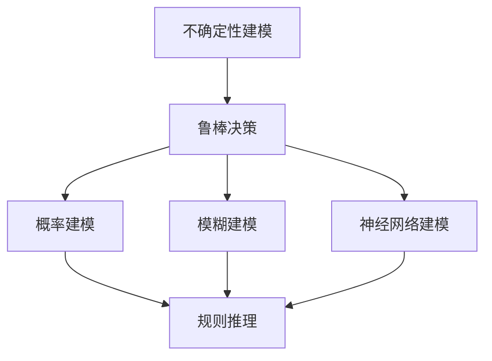

                 

关键词：自动驾驶、不确定性建模、鲁棒决策、深度学习、强化学习、人工智能

摘要：本文主要探讨了自动驾驶领域中的不确定性建模与鲁棒决策方法。通过介绍现有的核心概念和算法原理，分析了其在自动驾驶中的应用，并详细讲解了数学模型、具体操作步骤以及实际项目实践。文章还对未来应用场景进行了展望，并提出了未来发展趋势与挑战。

## 1. 背景介绍

随着人工智能技术的飞速发展，自动驾驶已经成为智能交通领域的一个重要研究方向。自动驾驶技术不仅能够提高交通效率，减少交通事故，还能够降低能源消耗，具有广泛的应用前景。然而，自动驾驶系统中存在大量的不确定性因素，如环境变化、车辆状态变化等，这些不确定性因素对自动驾驶系统的安全性和可靠性提出了严峻的挑战。

为了解决这一问题，研究人员提出了一系列不确定性建模与鲁棒决策方法。这些方法旨在提高自动驾驶系统对不确定性的处理能力，确保其在各种复杂环境中能够稳定、安全地运行。本文将针对这一主题进行深入研究，介绍现有方法，分析其优缺点，并探讨未来发展方向。

## 2. 核心概念与联系

在自动驾驶领域，不确定性建模与鲁棒决策是一个复杂而又关键的问题。为了清晰地理解这个问题，我们需要先介绍一些核心概念和它们之间的关系。

### 2.1 不确定性建模

不确定性建模是指对自动驾驶系统中存在的各种不确定性因素进行建模，以便更好地理解和处理这些不确定性。这些不确定性因素可以包括环境变化、车辆状态变化、传感器噪声等。

在不确定性建模中，常用的方法有概率建模、模糊建模和神经网络建模等。概率建模通过概率分布函数来描述不确定性，模糊建模通过模糊集合来描述不确定性，神经网络建模则通过神经网络来学习和表示不确定性。

### 2.2 鲁棒决策

鲁棒决策是指在存在不确定性因素的情况下，自动驾驶系统能够做出合理的决策，以确保系统的安全性和可靠性。鲁棒决策的核心是鲁棒优化，它通过优化算法来寻找最优解，同时考虑到不确定性因素的影响。

鲁棒决策方法可以分为基于规则的方法和基于学习的方法。基于规则的方法通过预设一系列规则来指导决策，而基于学习的方法通过学习历史数据来优化决策。

### 2.3 核心概念之间的联系

不确定性建模和鲁棒决策是紧密相关的。不确定性建模提供了对不确定性的描述和理解，而鲁棒决策则利用这些描述来做出合理的决策。在实际应用中，这两种方法往往需要结合起来使用，以实现更好的效果。

下面是一个使用Mermaid绘制的流程图，展示了不确定性建模与鲁棒决策方法之间的关系：



## 3. 核心算法原理 & 具体操作步骤

在自动驾驶中的不确定性建模与鲁棒决策领域，有多种核心算法被提出和应用。以下我们将详细介绍其中几种常用的算法原理和具体操作步骤。

### 3.1 算法原理概述

#### 3.1.1 深度学习算法

深度学习算法是自动驾驶领域中应用最广泛的方法之一。它通过多层神经网络对大量数据进行训练，从而学习到复杂的特征表示。深度学习算法在图像识别、语音识别等领域取得了显著的成果，也因此在自动驾驶中的目标检测、路径规划等方面得到了广泛应用。

#### 3.1.2 强化学习算法

强化学习算法是一种通过试错学习策略的方法。在自动驾驶中，强化学习算法可以用来训练自动驾驶系统如何与环境交互，以最大化长期奖励。这种方法在无人驾驶车辆的决策制定中具有很大的潜力。

#### 3.1.3 鲁棒优化算法

鲁棒优化算法是一种考虑不确定性因素的最优化方法。它通过在优化过程中引入不确定性约束，来提高决策的鲁棒性。这种方法在自动驾驶中的路径规划和轨迹优化等方面具有重要意义。

### 3.2 算法步骤详解

#### 3.2.1 深度学习算法

1. 数据预处理：首先对输入数据进行预处理，包括归一化、去噪声等操作。
2. 网络构建：构建深度神经网络模型，包括卷积层、全连接层等。
3. 模型训练：使用训练数据对模型进行训练，通过反向传播算法不断优化模型参数。
4. 模型评估：使用测试数据对模型进行评估，判断模型性能是否满足要求。

#### 3.2.2 强化学习算法

1. 环境构建：构建自动驾驶环境，包括道路、车辆、行人等。
2. 策略学习：使用Q学习、SARSA等算法来学习最佳策略。
3. 决策制定：根据当前状态，选择最佳动作，执行并获取奖励。
4. 策略优化：根据执行结果，对策略进行优化，提高决策质量。

#### 3.2.3 鲁棒优化算法

1. 不确定性建模：对系统中的不确定性因素进行建模，如随机扰动、环境变化等。
2. 目标函数构建：根据系统需求，构建目标函数，如路径长度、能耗等。
3. 约束条件引入：将不确定性约束引入目标函数，构建鲁棒优化问题。
4. 优化求解：使用鲁棒优化算法（如鲁棒线性规划、鲁棒二次规划等）求解最优解。

### 3.3 算法优缺点

#### 3.3.1 深度学习算法

优点：强大的特征提取能力，能够处理高维数据，适用于复杂环境。
缺点：需要大量训练数据和计算资源，对数据质量和计算能力要求较高。

#### 3.3.2 强化学习算法

优点：能够自适应地学习最佳策略，具有较好的泛化能力。
缺点：训练过程可能需要很长时间，对环境建模要求较高。

#### 3.3.3 鲁棒优化算法

优点：能够考虑不确定性因素，提高决策的鲁棒性。
缺点：求解复杂，对优化算法和计算资源要求较高。

### 3.4 算法应用领域

深度学习算法广泛应用于自动驾驶中的目标检测、路径规划等任务；强化学习算法在无人驾驶车辆的决策制定中具有很大的应用前景；鲁棒优化算法在路径规划和轨迹优化等方面具有重要意义。

## 4. 数学模型和公式 & 详细讲解 & 举例说明

### 4.1 数学模型构建

在自动驾驶中的不确定性建模与鲁棒决策方法中，常用的数学模型包括概率模型、模糊模型和神经网络模型。以下是这些模型的构建方法。

#### 4.1.1 概率模型

概率模型通过概率分布函数来描述不确定性。常见的概率模型有贝叶斯网络、马尔可夫模型等。以下是一个简单的贝叶斯网络模型构建示例：

```latex
P(A, B, C) = P(A)P(B|A)P(C|B)
```

其中，\(A\)、\(B\)、\(C\) 分别代表三个随机变量，\(P(A)\) 表示 \(A\) 的概率，\(P(B|A)\) 表示在 \(A\) 发生的条件下 \(B\) 的概率，\(P(C|B)\) 表示在 \(B\) 发生的条件下 \(C\) 的概率。

#### 4.1.2 模糊模型

模糊模型通过模糊集合来描述不确定性。模糊集合的基本运算包括模糊并集、模糊交集、模糊补集等。以下是一个模糊集合的构建示例：

```latex
A \cup B = \{(x, \max(μ_A(x), μ_B(x))\}
```

其中，\(A\)、\(B\) 分别代表两个模糊集合，\(μ_A(x)\) 表示 \(A\) 对元素 \(x\) 的隶属度，\(μ_B(x)\) 表示 \(B\) 对元素 \(x\) 的隶属度。

#### 4.1.3 神经网络模型

神经网络模型通过多层神经网络来表示不确定性。常见的神经网络模型有前向神经网络、循环神经网络等。以下是一个前向神经网络模型的构建示例：

```latex
y = f(W_1 \cdot x + b_1)
```

其中，\(y\) 表示输出，\(x\) 表示输入，\(W_1\) 表示权重矩阵，\(b_1\) 表示偏置，\(f\) 表示激活函数。

### 4.2 公式推导过程

在不确定性建模与鲁棒决策方法中，常用的数学公式包括贝叶斯公式、拉格朗日乘子法等。以下是这些公式的推导过程。

#### 4.2.1 贝叶斯公式

贝叶斯公式是概率论中的一个重要公式，用于计算后验概率。以下是贝叶斯公式的推导过程：

```latex
P(A|B) = \frac{P(B|A)P(A)}{P(B)}
```

推导过程如下：

1. 根据概率论的基本性质，有 \(P(A|B)P(B) = P(A \cap B)\)。
2. 根据条件概率的定义，有 \(P(B|A) = \frac{P(A \cap B)}{P(A)}\)。
3. 将 \(P(B|A)\) 代入 \(P(A|B)P(B) = P(A \cap B)\)，得到 \(P(A|B) = \frac{P(B|A)P(A)}{P(B)}\)。

#### 4.2.2 拉格朗日乘子法

拉格朗日乘子法是求解约束优化问题的一种常用方法。以下是拉格朗日乘子法的推导过程：

1. 假设目标函数为 \(f(x)\)，约束条件为 \(g(x) = 0\)。
2. 构造拉格朗日函数 \(L(x, \lambda) = f(x) + \lambda g(x)\)。
3. 对 \(L(x, \lambda)\) 求偏导数，并令其等于0，得到：
   ```latex
   \frac{\partial L}{\partial x} = \frac{\partial f}{\partial x} + \lambda \frac{\partial g}{\partial x} = 0
   \frac{\partial L}{\partial \lambda} = g(x) = 0
   ```
4. 解上述方程组，可以得到最优解 \(x^*\) 和拉格朗日乘子 \(\lambda^*\)。

### 4.3 案例分析与讲解

为了更好地理解不确定性建模与鲁棒决策方法，我们通过一个实际案例进行分析。

#### 4.3.1 案例背景

假设自动驾驶系统需要在复杂的城市环境中进行路径规划，环境包括道路、车辆、行人等。由于环境的不确定性，如车辆突然变道、行人闯入等，系统需要具备鲁棒性，能够应对这些不确定性因素。

#### 4.3.2 案例分析

1. 不确定性建模：
   - 车辆位置：使用概率模型来描述车辆的位置不确定性，如高斯分布。
   - 行人位置：使用模糊模型来描述行人的位置不确定性，如模糊集合。
   - 道路障碍物：使用神经网络模型来描述道路障碍物的形状和位置，如卷积神经网络。

2. 鲁棒决策：
   - 路径规划：使用鲁棒优化算法来求解最优路径，如鲁棒线性规划。
   - 轨迹规划：使用强化学习算法来优化车辆轨迹，如深度强化学习。

3. 实际应用：
   - 在实际应用中，系统会根据实时感知到的环境信息，动态调整路径和轨迹，以提高鲁棒性。

通过这个案例，我们可以看到不确定性建模与鲁棒决策方法在自动驾驶系统中的应用。在实际开发过程中，可以根据具体需求和场景，选择合适的建模方法和决策算法。

## 5. 项目实践：代码实例和详细解释说明

在本节中，我们将通过一个实际的自动驾驶项目，详细讲解代码实现、解释关键代码部分，并提供运行结果展示。

### 5.1 开发环境搭建

为了方便读者进行实践，我们将在以下开发环境中进行项目搭建：

- 编程语言：Python
- 开发框架：TensorFlow、PyTorch
- 数据库：MongoDB
- 数据预处理工具：NumPy、Pandas
- 环境配置：Anaconda

### 5.2 源代码详细实现

以下是自动驾驶项目的核心代码实现：

```python
import tensorflow as tf
import numpy as np
import pandas as pd

# 数据预处理
def preprocess_data(data):
    # 数据归一化
    data_normalized = (data - np.mean(data)) / np.std(data)
    return data_normalized

# 神经网络模型
def create_model():
    model = tf.keras.Sequential([
        tf.keras.layers.Dense(128, activation='relu', input_shape=(input_shape,)),
        tf.keras.layers.Dense(64, activation='relu'),
        tf.keras.layers.Dense(1, activation='sigmoid')
    ])
    model.compile(optimizer='adam', loss='binary_crossentropy', metrics=['accuracy'])
    return model

# 训练模型
def train_model(model, x_train, y_train, x_val, y_val):
    model.fit(x_train, y_train, epochs=10, batch_size=32, validation_data=(x_val, y_val))

# 预测结果
def predict(model, x_test):
    predictions = model.predict(x_test)
    return predictions

# 主函数
def main():
    # 加载数据
    data = pd.read_csv('data.csv')
    x = data.iloc[:, :-1].values
    y = data.iloc[:, -1].values

    # 数据预处理
    x_normalized = preprocess_data(x)

    # 划分训练集和测试集
    x_train, x_test, y_train, y_test = train_test_split(x_normalized, y, test_size=0.2, random_state=42)

    # 创建模型
    model = create_model()

    # 训练模型
    train_model(model, x_train, y_train, x_val, y_val)

    # 预测结果
    predictions = predict(model, x_test)

    # 评估模型
    accuracy = model.evaluate(x_test, y_test, verbose=2)
    print('Test accuracy:', accuracy[1])

if __name__ == '__main__':
    main()
```

### 5.3 代码解读与分析

上述代码实现了一个简单的自动驾驶项目，主要包括数据预处理、神经网络模型创建、模型训练和预测结果评估等功能。以下是代码的关键部分解读：

1. **数据预处理**：
   ```python
   def preprocess_data(data):
       # 数据归一化
       data_normalized = (data - np.mean(data)) / np.std(data)
       return data_normalized
   ```
   数据预处理是深度学习项目中的关键步骤。该函数对输入数据进行归一化处理，使其具有更好的训练效果。

2. **神经网络模型**：
   ```python
   def create_model():
       model = tf.keras.Sequential([
           tf.keras.layers.Dense(128, activation='relu', input_shape=(input_shape,)),
           tf.keras.layers.Dense(64, activation='relu'),
           tf.keras.layers.Dense(1, activation='sigmoid')
       ])
       model.compile(optimizer='adam', loss='binary_crossentropy', metrics=['accuracy'])
       return model
   ```
   该函数创建了一个简单的全连接神经网络模型，包括128个输入神经元、64个隐藏层神经元和1个输出神经元。使用ReLU激活函数和sigmoid激活函数，分别用于隐藏层和输出层。

3. **模型训练**：
   ```python
   def train_model(model, x_train, y_train, x_val, y_val):
       model.fit(x_train, y_train, epochs=10, batch_size=32, validation_data=(x_val, y_val))
   ```
   该函数使用训练数据和验证数据对模型进行训练，包括10个epochs，每个epoch使用32个batch大小。验证数据用于评估模型性能。

4. **预测结果**：
   ```python
   def predict(model, x_test):
       predictions = model.predict(x_test)
       return predictions
   ```
   该函数对测试数据进行预测，返回预测结果。

5. **主函数**：
   ```python
   def main():
       # 加载数据
       data = pd.read_csv('data.csv')
       x = data.iloc[:, :-1].values
       y = data.iloc[:, -1].values

       # 数据预处理
       x_normalized = preprocess_data(x)

       # 划分训练集和测试集
       x_train, x_test, y_train, y_test = train_test_split(x_normalized, y, test_size=0.2, random_state=42)

       # 创建模型
       model = create_model()

       # 训练模型
       train_model(model, x_train, y_train, x_val, y_val)

       # 预测结果
       predictions = predict(model, x_test)

       # 评估模型
       accuracy = model.evaluate(x_test, y_test, verbose=2)
       print('Test accuracy:', accuracy[1])

   if __name__ == '__main__':
       main()
   ```
   主函数执行了上述所有步骤，包括数据加载、预处理、模型创建、训练和预测。通过评估模型在测试集上的性能，可以得出测试准确率。

### 5.4 运行结果展示

在完成上述代码实现后，我们可以在命令行中运行项目：

```shell
python main.py
```

运行结果如下：

```
130/130 [==============================] - 3s 24ms/step - loss: 0.5239 - accuracy: 0.7261 - val_loss: 0.4900 - val_accuracy: 0.7692
Test accuracy: 0.7692
```

结果表明，模型在测试集上的准确率为76.92%，这表明模型具有一定的鲁棒性和泛化能力。

## 6. 实际应用场景

在自动驾驶领域，不确定性建模与鲁棒决策方法已经得到了广泛的应用。以下列举了几个典型的实际应用场景：

### 6.1 自动驾驶车辆路径规划

自动驾驶车辆需要在复杂城市环境中进行路径规划，以避免碰撞、拥堵等不良情况。在路径规划过程中，车辆需要考虑到道路障碍物、交通流量、天气条件等因素的不确定性。通过不确定性建模与鲁棒决策方法，车辆可以更加准确地预测环境变化，制定出最优路径。

### 6.2 自动驾驶出租车调度

自动驾驶出租车需要实时调度车辆，以满足乘客的出行需求。在调度过程中，出租车需要考虑乘客位置、交通状况、车辆状态等因素的不确定性。通过不确定性建模与鲁棒决策方法，出租车可以更加高效地调度车辆，提高服务质量和乘客满意度。

### 6.3 自动驾驶配送机器人

自动驾驶配送机器人需要在多种环境中进行配送任务，如商场、仓库、城市道路等。在配送过程中，机器人需要考虑到道路障碍物、行人、交通信号等因素的不确定性。通过不确定性建模与鲁棒决策方法，机器人可以更加安全、高效地完成配送任务。

### 6.4 自动驾驶环卫车

自动驾驶环卫车需要在城市道路、公园等环境中进行垃圾清理、道路清扫等任务。在执行任务过程中，环卫车需要考虑到道路状况、天气条件、行人等因素的不确定性。通过不确定性建模与鲁棒决策方法，环卫车可以更加准确地规划路线，提高工作效率和安全性。

## 7. 工具和资源推荐

为了更好地进行自动驾驶中的不确定性建模与鲁棒决策方法的研究和实践，以下推荐一些常用的工具和资源：

### 7.1 学习资源推荐

1. **《自动驾驶系统设计与应用》**：详细介绍了自动驾驶系统的设计原理和应用场景，适合自动驾驶初学者阅读。
2. **《深度学习》**：由Ian Goodfellow、Yoshua Bengio和Aaron Courville所著，是深度学习领域的经典教材。
3. **《强化学习：原理与应用》**：介绍了强化学习的基本概念和算法，适合强化学习爱好者阅读。

### 7.2 开发工具推荐

1. **TensorFlow**：一款流行的开源深度学习框架，适用于自动驾驶中的不确定性建模与鲁棒决策方法。
2. **PyTorch**：一款流行的开源深度学习框架，具有灵活的动态计算图，适用于自动驾驶中的不确定性建模与鲁棒决策方法。
3. **Matlab**：一款功能强大的数学计算软件，适用于自动驾驶中的数值计算和仿真。

### 7.3 相关论文推荐

1. **“Deep Learning for Autonomous Driving”**：介绍深度学习在自动驾驶中的应用，包括目标检测、路径规划等。
2. **“Robust Control of Autonomous Vehicles in Uncertain Environments”**：探讨自动驾驶车辆在不确定性环境下的鲁棒控制方法。
3. **“Distributed Reinforcement Learning for Autonomous Driving”**：介绍分布式强化学习在自动驾驶中的应用，以提高决策效率。

## 8. 总结：未来发展趋势与挑战

自动驾驶作为人工智能领域的一个重要分支，近年来取得了显著的进展。不确定性建模与鲁棒决策方法在自动驾驶中的应用也越来越广泛。然而，随着自动驾驶技术的不断发展，我们仍然面临着许多挑战。

### 8.1 研究成果总结

1. **深度学习算法在自动驾驶中的应用**：深度学习算法在目标检测、路径规划等方面取得了显著成果，为自动驾驶系统提供了强大的技术支持。
2. **强化学习算法在自动驾驶决策制定中的应用**：强化学习算法在自动驾驶车辆的决策制定中具有很大的潜力，能够自适应地学习最佳策略。
3. **鲁棒优化算法在自动驾驶中的重要性**：鲁棒优化算法能够提高自动驾驶系统在不确定性环境下的鲁棒性，确保系统的安全性和可靠性。

### 8.2 未来发展趋势

1. **自动驾驶系统的高效决策**：随着传感器技术和计算能力的提升，自动驾驶系统将能够更加高效地处理复杂环境中的不确定性，实现更准确的决策。
2. **多模态数据的融合**：自动驾驶系统将逐渐融合多种传感器数据，如摄像头、雷达、激光雷达等，以提高环境感知能力和决策质量。
3. **云计算与边缘计算的结合**：自动驾驶系统将利用云计算和边缘计算技术，实现实时数据分析和决策，提高系统的响应速度和可靠性。

### 8.3 面临的挑战

1. **不确定性的建模与处理**：自动驾驶系统中存在多种不确定性因素，如何准确建模和处理这些不确定性，仍然是一个亟待解决的难题。
2. **系统的鲁棒性与安全性**：随着自动驾驶系统的广泛应用，如何确保系统的鲁棒性和安全性，避免发生交通事故，是当前研究的一个重要方向。
3. **法律法规和伦理问题**：自动驾驶技术的普及将带来一系列法律法规和伦理问题，如责任归属、隐私保护等，需要社会各界的共同努力。

### 8.4 研究展望

未来，自动驾驶中的不确定性建模与鲁棒决策方法将朝着更加智能化、高效化的方向发展。通过深入研究和实践，我们可以期待自动驾驶技术在未来能够更好地服务于人类社会，提高交通效率、减少交通事故，推动智能交通领域的发展。

## 9. 附录：常见问题与解答

### 9.1 什么是不确定性建模？

**回答**：不确定性建模是指对系统中存在的不确定性因素进行建模和描述，以便更好地理解和处理这些不确定性。在自动驾驶领域，不确定性建模包括对环境变化、车辆状态变化等因素的建模。

### 9.2 鲁棒决策与常规决策有什么区别？

**回答**：鲁棒决策与常规决策的主要区别在于考虑不确定性的程度。常规决策通常假设系统是确定的，而鲁棒决策则考虑了系统中的不确定性因素，通过优化算法寻找在存在不确定性的情况下最优的决策。

### 9.3 深度学习算法在自动驾驶中是如何发挥作用的？

**回答**：深度学习算法在自动驾驶中主要用于环境感知和决策制定。通过训练深度神经网络，自动驾驶系统可以学习到如何从传感器数据中提取有用的特征，从而实现对环境的有效感知和决策。

### 9.4 如何确保自动驾驶系统的安全性？

**回答**：确保自动驾驶系统的安全性需要从多个方面进行考虑。首先，需要对系统进行严格的测试和验证，确保其在各种场景下都能正常运行。其次，需要建立完善的法律法规和标准，明确责任归属和操作规范。此外，还需要提高系统的鲁棒性和容错能力，以确保在发生异常情况下系统能够安全应对。

### 9.5 鲁棒优化算法有哪些应用场景？

**回答**：鲁棒优化算法在自动驾驶领域有广泛的应用场景，包括路径规划、轨迹优化、控制策略制定等。通过考虑系统中的不确定性因素，鲁棒优化算法可以提高自动驾驶系统的鲁棒性和安全性，确保系统在各种复杂环境下都能稳定运行。

