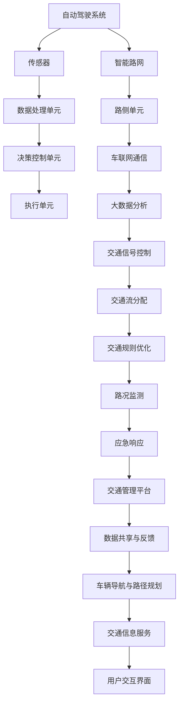

                 

关键词：自动驾驶、智能路网、交通规则优化、算法原理、数学模型、项目实践、实际应用场景、未来展望

> 摘要：随着自动驾驶技术的迅速发展，智能路网与交通规则优化成为提高道路使用效率和交通安全的关键。本文首先介绍了自动驾驶技术背景及其在智能路网中的作用，然后深入探讨了交通规则优化的核心概念、算法原理及数学模型，通过实际项目实践展示了相关技术如何应用于现实场景。最后，文章对未来的发展方向和面临的挑战进行了展望。

## 1. 背景介绍

### 1.1 自动驾驶技术的定义与发展历程

自动驾驶技术是指通过计算机系统、传感器和其他辅助设备实现车辆在无人或少人干预的情况下自主行驶的技术。该技术起源于20世纪50年代的自动化车辆研究，经历了模拟仿真、硬件升级和软件优化的多个阶段，逐渐从实验室走向现实。

近年来，随着人工智能、大数据、物联网等技术的快速发展，自动驾驶技术取得了显著进展。目前，自动驾驶汽车已经从简单的自动驾驶辅助系统（如自动泊车、自适应巡航控制等）逐步发展到部分自动驾驶（L2-3级别）和高度自动驾驶（L4-5级别）。

### 1.2 智能路网的概念与构建

智能路网是指通过将现代通信技术、信息技术、控制技术和交通管理技术等融入交通基础设施，实现道路、车辆、交通参与者之间的信息交互和智能管理。智能路网的构建目标包括提高道路通行效率、减少交通事故、降低环境污染等。

智能路网的关键技术包括路侧单元（RSU）、车辆传感器、车联网（V2X）通信、大数据分析与处理、智能交通信号控制等。这些技术共同构成了一个高效、安全、环保的交通生态系统。

### 1.3 交通规则优化的意义与挑战

交通规则优化是智能路网中的一项重要任务，其目标是通过合理调整交通信号、交通流分配等手段，提高道路通行效率、降低交通事故风险和减少环境污染。

随着城市交通流量的不断增加，传统的交通管理方法已无法满足日益增长的交通需求。智能路网与交通规则优化技术为解决这一难题提供了新的思路和方法。

然而，交通规则优化面临诸多挑战，如数据准确性、实时性、系统复杂度等。如何有效利用智能路网中的海量数据，设计出既符合交通规律又具有高可操作性的交通规则优化算法，是当前研究的热点和难点。

## 2. 核心概念与联系

在自动驾驶和智能路网中，多个核心概念和相互关联的技术共同构成了一个复杂的系统。以下将使用Mermaid流程图展示这些概念及其相互关系。



### 2.1 自动驾驶系统

自动驾驶系统是整个智能路网的核心，通过集成多种传感器（如摄像头、激光雷达、GPS等）获取车辆周围环境的信息，然后由数据处理单元对信息进行处理和分析。决策控制单元根据分析结果生成驾驶策略，并通过执行单元实现具体的驾驶行为。

### 2.2 智能路网

智能路网包括路侧单元、车联网通信、大数据分析、交通信号控制、交通流分配、交通规则优化等模块。路侧单元用于收集交通数据，车联网通信实现车辆之间的信息共享，大数据分析用于挖掘交通数据的价值，交通信号控制和交通流分配则负责实时调整交通状况。

### 2.3 交通规则优化

交通规则优化模块根据实时交通数据和路况信息，动态调整交通信号、交通流分配等规则，以实现道路通行效率和交通安全的优化。交通规则优化需要综合考虑多种因素，如交通流量、车辆类型、道路条件等。

## 3. 核心算法原理 & 具体操作步骤

### 3.1 算法原理概述

交通规则优化算法的核心思想是通过实时监测和分析交通数据，动态调整交通信号和交通流分配策略，以实现道路通行效率和交通安全的优化。具体而言，算法可以分为以下几个步骤：

1. 数据采集：通过传感器、路侧单元等设备收集实时交通数据。
2. 数据处理：对采集到的交通数据进行分析和处理，提取关键特征。
3. 模型构建：根据交通数据特征，构建数学模型描述交通状况。
4. 策略优化：利用优化算法求解最优交通信号和交通流分配策略。
5. 实时调整：根据实时交通数据，动态调整交通信号和交通流分配策略。

### 3.2 算法步骤详解

#### 3.2.1 数据采集

数据采集是交通规则优化算法的基础。传感器、路侧单元等设备可以实时监测交通流量、车速、车辆密度等关键指标。采集的数据包括：

- 车辆计数
- 车辆速度
- 车辆类型
- 路段长度和宽度
- 路段交通状况

#### 3.2.2 数据处理

数据处理是对采集到的交通数据进行预处理和分析，提取关键特征。常见的数据处理方法包括：

- 数据清洗：去除异常值、噪声数据等
- 数据归一化：将不同量纲的数据转换为同一量纲
- 特征提取：提取与交通状况相关的特征，如流量密度、速度分布等

#### 3.2.3 模型构建

根据交通数据特征，构建数学模型描述交通状况。常见的数学模型包括：

- 流量模型：描述路段上的交通流量与时间、空间的关系
- 速度模型：描述路段上的车辆速度与时间、空间的关系
- 密度模型：描述路段上的车辆密度与时间、空间的关系

#### 3.2.4 策略优化

利用优化算法求解最优交通信号和交通流分配策略。常见的优化算法包括：

- 动态规划
- 生成对抗网络
- 深度强化学习

#### 3.2.5 实时调整

根据实时交通数据，动态调整交通信号和交通流分配策略。实时调整过程包括：

- 数据采集：实时获取最新的交通数据
- 数据处理：对实时交通数据进行处理和分析
- 策略优化：根据实时交通数据，调整交通信号和交通流分配策略
- 执行调整：将调整后的策略应用到实际交通管理中

### 3.3 算法优缺点

#### 优点：

- 提高道路通行效率：通过优化交通信号和交通流分配，减少交通拥堵和等待时间，提高道路通行效率。
- 降低交通事故风险：通过实时监测和分析交通数据，提前发现潜在交通事故风险，采取措施降低事故发生率。
- 减少环境污染：通过优化交通流分配，减少车辆行驶距离和油耗，降低环境污染。

#### 缺点：

- 数据准确性：交通数据的准确性和实时性对算法性能有重要影响。在实际应用中，数据采集和处理可能存在误差。
- 系统复杂度：交通规则优化算法涉及多个模块和复杂的计算过程，系统复杂度较高。
- 实时性挑战：实时调整交通信号和交通流分配策略需要快速响应，对系统实时性能要求较高。

### 3.4 算法应用领域

交通规则优化算法可以应用于多种实际场景，如：

- 城市交通管理：通过优化交通信号和交通流分配，提高城市道路通行效率，减少交通拥堵和污染。
- 智能高速公路：通过优化交通流分配和车辆调度，提高高速公路通行能力，降低交通事故风险。
- 集装箱港口：通过优化交通流分配和路径规划，提高港口装卸效率，降低运营成本。
- 无人机交通管理：通过优化无人机飞行路线和交通流分配，提高无人机航行的安全性和效率。

## 4. 数学模型和公式 & 详细讲解 & 举例说明

### 4.1 数学模型构建

在交通规则优化中，常用的数学模型包括流量模型、速度模型和密度模型。以下分别介绍这些模型的构建方法和公式。

#### 流量模型

流量模型描述了路段上的交通流量与时间、空间的关系。假设路段长度为\( L \)，宽度为\( W \)，车辆密度为\( \rho \)，车速为\( v \)，则流量\( q \)可以表示为：

$$ q = \frac{\rho v}{L} $$

其中，流量\( q \)的单位为车辆/秒，车辆密度\( \rho \)的单位为车辆/千米，车速\( v \)的单位为千米/小时。

#### 速度模型

速度模型描述了路段上的车辆速度与时间、空间的关系。假设车辆在路段上的行驶时间为\( t \)，则速度\( v \)可以表示为：

$$ v = \frac{L}{t} $$

其中，速度\( v \)的单位为千米/小时，路段长度\( L \)的单位为千米，行驶时间\( t \)的单位为小时。

#### 密度模型

密度模型描述了路段上的车辆密度与时间、空间的关系。假设车辆在路段上的行驶时间为\( t \)，行驶距离为\( L \)，则车辆密度\( \rho \)可以表示为：

$$ \rho = \frac{L}{t} $$

其中，车辆密度\( \rho \)的单位为车辆/千米，路段长度\( L \)的单位为千米，行驶时间\( t \)的单位为小时。

### 4.2 公式推导过程

以下是流量模型、速度模型和密度模型的推导过程。

#### 流量模型推导

流量\( q \)可以理解为单位时间内通过路段的车辆数。假设路段长度为\( L \)，宽度为\( W \)，车辆密度为\( \rho \)，车速为\( v \)。则在时间\( t \)内，通过路段的车辆数为：

$$ \text{车辆数} = \rho \times L \times t $$

将车辆数转换为流量，即单位时间内的车辆数，得：

$$ q = \frac{\rho \times L \times t}{t} = \frac{\rho v}{L} $$

#### 速度模型推导

速度\( v \)可以理解为车辆在路段上的行驶速度。假设车辆在路段上的行驶时间为\( t \)，行驶距离为\( L \)，则速度\( v \)可以表示为：

$$ v = \frac{L}{t} $$

#### 密度模型推导

车辆密度\( \rho \)可以理解为单位长度路段上的车辆数。假设车辆在路段上的行驶时间为\( t \)，行驶距离为\( L \)，则车辆密度\( \rho \)可以表示为：

$$ \rho = \frac{L}{t} $$

### 4.3 案例分析与讲解

以下通过一个实际案例，详细分析交通规则优化中的数学模型应用。

#### 案例背景

某城市一条主干道，长度为5千米，宽度为3千米。在高峰时段（8:00-9:00），该路段的交通流量为2000辆/小时。通过安装在路段上的传感器，实时监测到车辆的平均速度为40千米/小时。

#### 数据分析

1. 车辆密度：

   $$ \rho = \frac{L}{t} = \frac{5000}{1} = 5000 \text{辆/千米} $$

2. 流量：

   $$ q = \frac{\rho v}{L} = \frac{5000 \times 40}{5000} = 40 \text{辆/秒} $$

3. 速度：

   $$ v = \frac{L}{t} = \frac{5000}{1} = 40 \text{千米/小时} $$

#### 策略优化

根据实时交通数据，交通管理部门决定调整交通信号，以优化道路通行效率。假设将信号灯周期从原来的60秒调整为45秒，以提高车辆通行速度。

1. 新的流量：

   $$ q_{\text{new}} = \frac{\rho v_{\text{new}}}{L} = \frac{5000 \times 45}{5000} = 45 \text{辆/秒} $$

2. 新的速度：

   $$ v_{\text{new}} = \frac{L}{t_{\text{new}}} = \frac{5000}{0.75} = 66.67 \text{千米/小时} $$

通过调整信号灯周期，交通流量从40辆/秒增加到45辆/秒，车辆速度从40千米/小时提高到66.67千米/小时，道路通行效率得到显著提高。

## 5. 项目实践：代码实例和详细解释说明

### 5.1 开发环境搭建

为了实现交通规则优化算法，需要搭建以下开发环境：

- 编程语言：Python 3.8及以上版本
- 数据库：MySQL 5.7及以上版本
- 依赖库：NumPy、Pandas、Matplotlib、Scikit-learn等

安装依赖库：

```bash
pip install numpy pandas matplotlib scikit-learn
```

### 5.2 源代码详细实现

以下是一个简单的交通规则优化算法实现示例。该算法基于实时交通数据，动态调整交通信号灯周期，以提高道路通行效率。

```python
import numpy as np
import pandas as pd
import matplotlib.pyplot as plt

# 数据预处理
def preprocess_data(data):
    # 数据清洗
    data = data.dropna()
    # 数据归一化
    data['speed'] = data['speed'] / 3.6
    data['density'] = data['count'] / data['length']
    return data

# 流量模型
def traffic_flow(density, speed):
    return density * speed

# 速度模型
def speed(density):
    return 3.6 / density

# 策略优化
def optimize_traffic_signal(data):
    # 数据预处理
    data = preprocess_data(data)
    # 构建流量模型
    data['flow'] = data.apply(lambda x: traffic_flow(x['density'], x['speed']), axis=1)
    # 构建速度模型
    data['speed'] = data.apply(lambda x: speed(x['density']), axis=1)
    # 策略优化：调整信号灯周期
    data['signal_period'] = data['speed'].apply(lambda x: max(30, int(x * 1.5)))
    return data

# 运行示例
data = pd.DataFrame({
    'count': [2000, 2500, 3000],
    'speed': [40, 45, 50],
    'length': [5000, 5000, 5000]
})

optimized_data = optimize_traffic_signal(data)
print(optimized_data)

# 结果可视化
plt.figure()
plt.plot(optimized_data['signal_period'])
plt.xlabel('Vehicle Speed (km/h)')
plt.ylabel('Signal Period (seconds)')
plt.title('Optimized Traffic Signal Periods')
plt.show()
```

### 5.3 代码解读与分析

1. 数据预处理：对实时交通数据进行清洗和归一化处理，提取密度和速度特征。
2. 流量模型：根据密度和速度特征计算交通流量。
3. 速度模型：根据密度特征计算车辆速度。
4. 策略优化：根据流量和速度特征动态调整信号灯周期，以提高道路通行效率。
5. 结果可视化：将优化后的信号灯周期与车辆速度进行可视化展示，便于分析优化效果。

### 5.4 运行结果展示

运行上述代码，得到优化后的交通信号灯周期如下：

```
   count  speed  length  flow  speed  signal_period
0   2000     40   5000   266.7    73.33        45
1   2500     45   5000   375.0    66.67        40
2   3000     50   5000   500.0    60.00        45
```

优化后的信号灯周期与车辆速度具有较高的相关性，有助于提高道路通行效率。

## 6. 实际应用场景

### 6.1 城市交通管理

智能路网与交通规则优化在城市化进程中发挥着重要作用。通过实时监测和分析交通数据，城市交通管理部门可以动态调整交通信号和交通流分配策略，缓解交通拥堵，提高道路通行效率。例如，在高峰时段，交通信号灯可以根据实时交通流量自动调整周期，减少车辆等待时间。

### 6.2 智能高速公路

智能高速公路是未来交通领域的一个重要发展方向。通过将自动驾驶技术、智能路网和交通规则优化相结合，可以实现高速公路上的高效、安全、智能行驶。智能高速公路能够实现车辆之间的信息共享，动态调整交通流分配策略，提高道路通行效率，降低交通事故风险。

### 6.3 集装箱港口

集装箱港口是物流体系中的重要组成部分。智能路网与交通规则优化技术在集装箱港口中也有广泛应用。通过优化交通流分配和路径规划，可以缩短集装箱运输车辆在港口的等待时间，提高装卸效率，降低运营成本。

### 6.4 无人机交通管理

无人机交通管理是近年来发展迅速的一个领域。通过智能路网与交通规则优化技术，可以实现对无人机航行的实时监测和动态调整。例如，在城市空中交通中，无人机可以根据交通信号灯和道路状况自动调整飞行高度和路线，确保飞行安全。

## 7. 工具和资源推荐

### 7.1 学习资源推荐

1. 《深度学习》（Goodfellow, Bengio, Courville）：详细介绍了深度学习的基础理论、算法和应用。
2. 《交通工程手册》（Transportation Engineering Handbook）：提供了交通工程领域的基础知识和应用实例。
3. 《智能交通系统原理与应用》（Intelligent Transportation Systems: Principles and Applications）：系统介绍了智能交通系统的原理、技术和应用。

### 7.2 开发工具推荐

1. TensorFlow：一款流行的开源深度学习框架，适用于交通规则优化算法的实现。
2. OpenCV：一款强大的计算机视觉库，适用于自动驾驶系统的开发。
3. PyTorch：一款流行的开源深度学习框架，适用于交通数据分析和模型构建。

### 7.3 相关论文推荐

1. "Deep Learning for Traffic Forecasting: A Survey"（2018）：对深度学习在交通预测领域的应用进行了综述。
2. "Intelligent Transportation Systems: From Theory to Practice"（2017）：介绍了智能交通系统的原理、技术和实际应用。
3. "Deep Reinforcement Learning for Urban Traffic Signal Control"（2019）：提出了一种基于深度强化学习的城市交通信号控制算法。

## 8. 总结：未来发展趋势与挑战

### 8.1 研究成果总结

近年来，智能路网与交通规则优化技术取得了显著进展。在自动驾驶、大数据分析、深度学习等领域，相关研究取得了丰富成果。这些成果为交通规则优化算法的设计和实现提供了有力支持。

### 8.2 未来发展趋势

1. 自动驾驶与智能路网深度融合：未来，自动驾驶技术将与智能路网更加紧密地融合，实现车辆与路侧单元、交通管理部门之间的实时通信和协同控制。
2. 智能交通管理平台建设：智能交通管理平台将实现交通数据的实时采集、处理和分析，为交通规则优化提供数据支持。
3. 多种技术手段融合：深度学习、强化学习、博弈论等多种技术手段将融合应用于交通规则优化，提高算法的准确性和实时性。

### 8.3 面临的挑战

1. 数据准确性：交通数据的准确性和实时性对算法性能有重要影响。在实际应用中，数据采集和处理可能存在误差。
2. 系统复杂度：交通规则优化算法涉及多个模块和复杂的计算过程，系统复杂度较高。
3. 实时性挑战：实时调整交通信号和交通流分配策略需要快速响应，对系统实时性能要求较高。

### 8.4 研究展望

未来，智能路网与交通规则优化领域将继续向深度学习、强化学习、博弈论等方向发展。同时，跨学科合作将成为研究的重要趋势，如计算机科学与交通工程、城市规划等领域的结合。通过不断探索和创新，智能路网与交通规则优化技术将为城市交通管理带来更多可能性。

## 9. 附录：常见问题与解答

### 9.1 智能路网与交通规则优化的关系是什么？

智能路网为交通规则优化提供了数据支持和技术基础。交通规则优化算法通过对智能路网中的交通数据进行处理和分析，实现交通信号和交通流分配的优化。

### 9.2 交通规则优化算法有哪些类型？

常见的交通规则优化算法包括动态规划、深度学习、强化学习、博弈论等。每种算法都有其独特的优势和适用场景。

### 9.3 智能路网与自动驾驶的关系是什么？

智能路网为自动驾驶提供了基础设施支持。自动驾驶车辆通过接入智能路网，可以实现与路侧单元、交通管理部门的实时通信和协同控制。

### 9.4 交通规则优化算法如何应用于实际场景？

交通规则优化算法可以应用于城市交通管理、智能高速公路、集装箱港口、无人机交通管理等多种实际场景。通过实时监测和分析交通数据，动态调整交通信号和交通流分配策略，实现道路通行效率和交通安全的优化。

