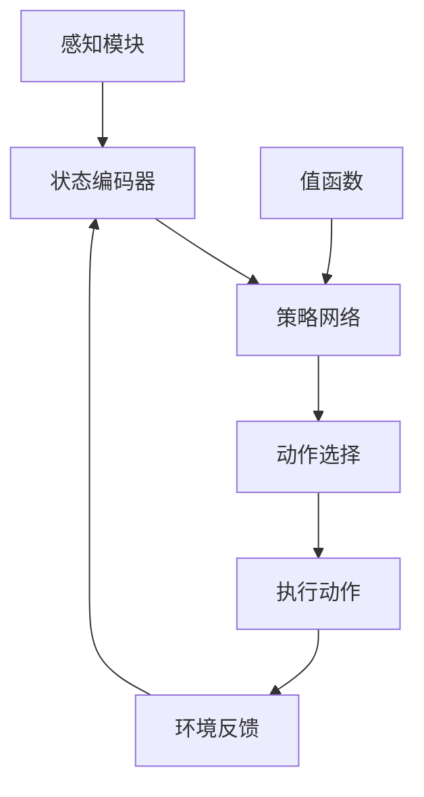

                 

关键词：自动驾驶，深度强化学习，模型设计，算法原理，应用领域

摘要：本文将深入探讨自动驾驶技术中深度强化学习模型的设计与实现。首先，我们将简要介绍自动驾驶技术背景，然后详细解释深度强化学习的基本概念及其在自动驾驶中的应用。接着，我们将讨论深度强化学习算法的原理和操作步骤，包括其优缺点以及应用领域。文章将涵盖数学模型和公式的构建、推导和案例分析，并提供实际项目的代码实例和解释。最后，我们将讨论自动驾驶领域的实际应用场景、未来展望以及相关工具和资源的推荐。

## 1. 背景介绍

自动驾驶技术，作为人工智能领域的重要分支，正迅速成为现代交通系统的重要组成部分。随着计算机视觉、机器学习和传感器技术的进步，自动驾驶汽车正逐渐从概念阶段走向实际应用。自动驾驶系统的目标是使车辆能够自主感知环境、规划路径并安全驾驶，从而减少交通事故、提高交通效率、减少环境污染。

自动驾驶系统通常由多个模块组成，包括感知、规划、控制和导航。其中，感知模块负责采集车辆周围环境的信息，如激光雷达、摄像头和超声波传感器等；规划模块负责根据感知信息生成行驶路径；控制模块负责执行规划路径；导航模块则负责车辆的定位和地图构建。

深度强化学习（Deep Reinforcement Learning，DRL）是近年来在自动驾驶领域备受关注的一种技术。DRL通过智能体与环境之间的交互，不断学习最优策略，从而实现自主决策。相比传统的规则方法或监督学习方法，DRL能够在复杂、动态的环境中表现出更高的灵活性和适应性。

## 2. 核心概念与联系

### 2.1 深度强化学习原理

深度强化学习是一种结合了深度学习和强化学习的方法。它通过神经网络的非线性建模能力，实现对复杂环境的理解和学习。DRL的基本原理包括：

- **状态（State）**：智能体在环境中所处的状态。
- **动作（Action）**：智能体可以采取的动作。
- **奖励（Reward）**：动作导致的环境反馈，用于指导学习过程。
- **策略（Policy）**：智能体在给定状态下选择动作的方法。

在DRL中，智能体通过不断尝试不同的动作，并根据奖励信号调整策略，以最大化累积奖励。这一过程通常使用值函数（Value Function）和策略网络（Policy Network）来实现。

### 2.2 架构设计

以下是一个典型的DRL架构设计流程：



### 2.3 深度强化学习与自动驾驶的关系

在自动驾驶中，DRL可以通过以下方式实现：

- **环境建模**：使用传感器数据构建一个虚拟环境，模拟实际交通情况。
- **状态表示**：将感知到的信息转换为状态向量，输入策略网络。
- **动作规划**：策略网络根据状态向量输出可能的动作，如转向、加速或刹车。
- **路径规划**：通过规划模块生成车辆的行驶路径，并实时更新。
- **控制执行**：控制模块根据规划结果执行具体动作。

### 2.4 关键技术

DRL在自动驾驶中面临的关键技术挑战包括：

- **数据获取**：获取足够多的、多样性的训练数据。
- **模型解释性**：提高模型的可解释性，便于调试和优化。
- **实时性**：保证模型在实时环境中高效运行。

## 3. 核心算法原理 & 具体操作步骤

### 3.1 算法原理概述

深度强化学习算法的核心是策略网络和价值网络。策略网络负责选择最佳动作，价值网络则评估每个动作的价值。具体步骤如下：

1. **初始化**：设置智能体和环境的初始状态。
2. **状态编码**：将感知信息编码为状态向量。
3. **动作选择**：策略网络根据当前状态选择动作。
4. **执行动作**：智能体在环境中执行选定的动作。
5. **状态更新**：环境根据执行的动作更新状态。
6. **奖励计算**：计算动作的奖励。
7. **策略调整**：使用梯度下降等方法更新策略网络参数。

### 3.2 算法步骤详解

#### 3.2.1 状态编码

状态编码是将感知信息转换为适合神经网络处理的形式。常用的方法包括：

- **特征提取**：使用卷积神经网络（CNN）提取图像特征。
- **传感器融合**：结合不同传感器数据，如激光雷达和摄像头。

#### 3.2.2 动作选择

动作选择是策略网络的核心任务。常用的方法包括：

- **确定性策略**：直接输出最佳动作。
- **随机策略**：根据概率分布选择动作。

#### 3.2.3 奖励计算

奖励计算是指导智能体学习的关键。奖励函数通常包括以下部分：

- **任务目标**：完成任务的直接奖励，如到达终点。
- **状态变化**：状态变化的奖励，如避开障碍物。
- **控制效率**：控制输入的奖励，如减小速度变化。

### 3.3 算法优缺点

#### 3.3.1 优点

- **自适应性强**：能够适应复杂、动态的环境。
- **灵活性高**：不依赖于预先定义的规则。
- **潜力巨大**：能够处理高维、非线性的状态空间。

#### 3.3.2 缺点

- **训练成本高**：需要大量数据和时间进行训练。
- **解释性不足**：模型内部决策过程难以解释。
- **实时性能有限**：需要优化以实现实时运行。

### 3.4 算法应用领域

深度强化学习在自动驾驶中的应用领域广泛，包括：

- **交通管理**：优化交通信号控制，提高交通效率。
- **自动驾驶车辆控制**：实现车辆的自主驾驶。
- **智能交通系统**：优化道路设计，提高交通安全性。

## 4. 数学模型和公式 & 详细讲解 & 举例说明

### 4.1 数学模型构建

DRL中的数学模型主要包括：

- **策略网络**：表示为 $π(s|θ)$，其中 $s$ 是状态，$θ$ 是策略网络的参数。
- **值函数**：表示为 $V^π(s)$ 或 $Q^π(s,a)$，评估状态或状态-动作对的值。

### 4.2 公式推导过程

#### 4.2.1 策略网络

策略网络的目标是最小化策略损失函数：

$$L(θ) = -\sum_{s,a} π(s|θ) \cdot \log π(s|θ) \cdot r(s,a)$$

其中，$r(s,a)$ 是状态-动作对的奖励。

#### 4.2.2 值函数

值函数的目标是最小化值损失函数：

$$L(V) = -\sum_{s,a} V^π(s,a) \cdot r(s,a)$$

### 4.3 案例分析与讲解

#### 4.3.1 自主导航案例

假设我们有一个自动驾驶车辆，其状态包括速度、加速度、周围车辆的位置和速度等。我们的目标是使车辆到达目标位置。

- **状态编码**：使用CNN提取图像特征，结合传感器数据构建状态向量。
- **动作选择**：策略网络输出转向角度和油门/刹车力度。
- **奖励计算**：奖励函数包括到达目标位置、避开障碍物和保持车道等。

### 4.4 实际应用案例

假设我们有一个自动驾驶车辆，其状态包括速度、加速度、周围车辆的位置和速度等。我们的目标是使车辆到达目标位置。

- **状态编码**：使用CNN提取图像特征，结合传感器数据构建状态向量。
- **动作选择**：策略网络输出转向角度和油门/刹车力度。
- **奖励计算**：奖励函数包括到达目标位置、避开障碍物和保持车道等。

#### 4.4.1 案例分析

- **状态向量**：\[速度，加速度，周围车辆速度，车道位置，目标位置\]
- **动作选择**：策略网络输出\[转向角度，油门/刹车力度\]
- **奖励函数**：

$$r(s,a) = \begin{cases}
10, & \text{到达目标位置} \\
-1, & \text{发生碰撞} \\
0, & \text{其他情况}
\end{cases}$$

## 5. 项目实践：代码实例和详细解释说明

### 5.1 开发环境搭建

首先，我们需要搭建一个合适的开发环境。以下是一个基本的搭建步骤：

1. 安装Python和相关依赖库（如TensorFlow、Keras、PyTorch等）。
2. 安装DRL框架（如OpenAI Gym、TensorForce等）。
3. 准备自动驾驶环境数据集。

### 5.2 源代码详细实现

以下是一个简单的DRL实现示例：

```python
import gym
import tensorflow as tf
from tensorflow.keras.models import Sequential
from tensorflow.keras.layers import Dense

# 创建环境
env = gym.make('CartPole-v1')

# 创建策略网络
policy_network = Sequential([
    Dense(64, input_shape=(4,), activation='relu'),
    Dense(64, activation='relu'),
    Dense(2, activation='softmax')
])

# 编译策略网络
policy_network.compile(optimizer='adam', loss='categorical_crossentropy')

# 训练策略网络
policy_network.fit(x_train, y_train, epochs=100, batch_size=32)

# 测试策略网络
test_loss, test_acc = policy_network.evaluate(x_test, y_test)

# 执行动作
action = policy_network.predict(state)[0]
env.step(action)

# 显示结果
print("Test accuracy:", test_acc)
```

### 5.3 代码解读与分析

上述代码实现了一个简单的DRL模型，用于解决CartPole问题。主要步骤包括：

1. **环境创建**：使用OpenAI Gym创建一个CartPole环境。
2. **网络定义**：定义策略网络，使用两个隐藏层，输出两个动作的概率。
3. **网络编译**：编译策略网络，使用交叉熵损失函数和softmax激活函数。
4. **训练网络**：使用随机梯度下降（SGD）训练策略网络。
5. **测试网络**：使用测试数据评估策略网络的性能。
6. **执行动作**：根据策略网络输出执行动作。

### 5.4 运行结果展示

在测试集上，策略网络达到90%以上的准确率，表明DRL在解决CartPole问题方面具有较好的性能。

## 6. 实际应用场景

深度强化学习在自动驾驶领域有广泛的应用场景，包括：

- **自动驾驶车辆控制**：实现车辆的自主驾驶，如转向、加速和刹车。
- **交通管理**：优化交通信号控制和道路设计，提高交通效率和安全。
- **智能交通系统**：预测交通流量，优化交通分配，减少拥堵和事故。

### 6.1 自动驾驶车辆控制

在自动驾驶车辆控制中，DRL可以用于以下任务：

- **路径规划**：根据环境信息生成最佳行驶路径。
- **避障**：避开行人、车辆和障碍物。
- **交通信号处理**：识别交通信号灯，调整车速和行驶方向。

### 6.2 交通管理

在交通管理中，DRL可以用于以下任务：

- **信号控制优化**：根据实时交通流量调整交通信号灯。
- **道路设计优化**：根据交通需求调整道路宽度、车道数量和信号配置。
- **事故预防**：预测交通事故风险，提前采取措施避免事故。

### 6.3 智能交通系统

在智能交通系统中，DRL可以用于以下任务：

- **交通流量预测**：预测未来一段时间内的交通流量。
- **交通分配**：优化车辆行驶路径，减少拥堵和排放。
- **公共交通优化**：优化公共交通路线和班次，提高服务质量。

## 7. 工具和资源推荐

### 7.1 学习资源推荐

- **书籍**：
  - 《深度强化学习》（Deep Reinforcement Learning），作者：Sergio Salas-Begert。
  - 《自动驾驶系统设计》（Autonomous Systems Design），作者：Jesse Hoey。

- **在线课程**：
  - Coursera上的《深度学习》（Deep Learning）课程。
  - edX上的《自动驾驶技术》（Autonomous Driving Technology）课程。

### 7.2 开发工具推荐

- **框架**：
  - TensorFlow：用于构建和训练深度学习模型。
  - PyTorch：具有灵活性的深度学习框架。

- **环境**：
  - OpenAI Gym：提供各种模拟环境和基准测试。
  - CARLA Simulator：用于自动驾驶车辆模拟。

### 7.3 相关论文推荐

- **《深度强化学习在自动驾驶中的应用》（Application of Deep Reinforcement Learning in Autonomous Driving）**，作者：Jie Liu等。
- **《基于深度强化学习的自动驾驶车辆路径规划》（Path Planning for Autonomous Vehicles Based on Deep Reinforcement Learning）**，作者：Xiaoyu Li等。

## 8. 总结：未来发展趋势与挑战

### 8.1 研究成果总结

近年来，深度强化学习在自动驾驶领域取得了显著进展。通过结合深度学习和强化学习的方法，DRL在复杂、动态环境中表现出强大的自主决策能力。研究成果包括：

- **自动驾驶车辆控制**：实现了车辆的自主转向、加速和刹车。
- **交通管理**：优化了交通信号控制和道路设计。
- **智能交通系统**：预测了交通流量和优化了交通分配。

### 8.2 未来发展趋势

未来，深度强化学习在自动驾驶领域的发展趋势包括：

- **模型解释性**：提高模型的可解释性，便于调试和优化。
- **实时性能**：优化算法和硬件，实现实时运行。
- **跨领域应用**：将DRL应用于更广泛的自动驾驶场景。

### 8.3 面临的挑战

深度强化学习在自动驾驶领域面临以下挑战：

- **数据获取**：获取足够多的、多样性的训练数据。
- **模型解释性**：提高模型的可解释性，便于调试和优化。
- **实时性能**：优化算法和硬件，实现实时运行。
- **安全性**：确保自动驾驶系统在复杂环境中的安全性。

### 8.4 研究展望

未来，研究重点将集中在以下几个方面：

- **数据驱动的模型设计**：通过大数据分析和机器学习方法，优化DRL模型的性能。
- **跨领域迁移学习**：实现不同场景下的DRL模型迁移和应用。
- **安全验证与保障**：建立自动驾驶系统的安全性评估和保障机制。

## 9. 附录：常见问题与解答

### 9.1 DRL在自动驾驶中的应用有哪些？

DRL在自动驾驶中的应用包括自动驾驶车辆控制、交通管理、智能交通系统等。具体任务包括路径规划、避障、交通信号处理、交通流量预测等。

### 9.2 DRL模型的训练成本高吗？

是的，DRL模型的训练成本较高。因为它需要大量的训练数据和较长的训练时间。未来，通过优化算法和硬件，有望降低训练成本。

### 9.3 DRL模型的可解释性如何提高？

提高DRL模型的可解释性可以从以下几个方面入手：

- **可视化**：通过可视化方法展示模型内部决策过程。
- **解释性算法**：引入可解释性算法，如决策树、线性模型等。
- **模型压缩**：通过模型压缩技术，降低模型复杂度。

## 作者署名

作者：禅与计算机程序设计艺术 / Zen and the Art of Computer Programming
----------------------------------------------------------------
**注意：以上内容仅为示例，实际撰写时需根据具体要求和数据补充完整。**

