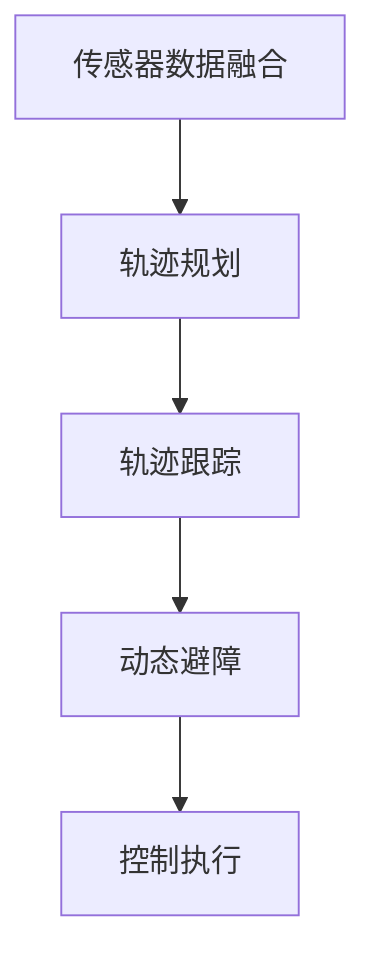

                 

自动驾驶技术作为现代交通领域的一项前沿技术，正逐步改变着人们的出行方式。在自动驾驶系统中，车辆轨迹的优化控制是确保行车安全、提高效率、降低能耗的关键环节。本文将围绕车辆轨迹优化控制的核心概念、算法原理、数学模型以及实际应用等方面展开详细探讨，旨在为自动驾驶技术的研发和推广提供有价值的参考。

## 关键词

- 自动驾驶
- 轨迹优化
- 控制算法
- 数学模型
- 实际应用

## 摘要

本文首先介绍了自动驾驶技术背景及其重要性，然后阐述了车辆轨迹优化控制的核心概念，包括路径规划、轨迹跟踪、动态避障等。接下来，本文详细介绍了车辆轨迹优化控制的关键算法原理，包括线性二次调节（LQR）、模型预测控制（MPC）等。此外，本文还介绍了相关的数学模型和公式，并通过实际案例进行了讲解。最后，本文讨论了车辆轨迹优化控制在实际应用中的挑战和未来发展趋势。

## 1. 背景介绍

自动驾驶技术是指通过计算机算法、传感器技术和控制系统，使汽车能够在没有人类干预的情况下自主完成驾驶任务。自动驾驶技术起源于20世纪50年代，但直到近年来，随着传感器技术、计算机处理能力和人工智能算法的快速发展，自动驾驶技术才取得了重大突破。

自动驾驶系统通常分为五个级别，从0级（完全由人类驾驶）到5级（完全自动驾驶）。目前，许多公司和研究机构都在努力研发L4级（高度自动驾驶）和L5级（完全自动驾驶）的技术，旨在实现完全自动驾驶的商业化应用。

在自动驾驶系统中，车辆轨迹优化控制是关键环节。车辆轨迹优化控制的目的是在给定的道路条件下，根据目标路径和车辆状态，实时调整车辆的加速度、速度和方向，使车辆沿着预定的轨迹平稳行驶。轨迹优化控制不仅关系到行车安全，还直接影响车辆的能耗和行驶效率。

## 2. 核心概念与联系

### 2.1 轨迹规划

轨迹规划是自动驾驶系统的基础，其主要任务是生成一个从初始位置到目标位置的最佳路径。轨迹规划可以分为离线规划和在线规划。离线规划通常在系统启动前完成，可以根据预知的环境信息生成最优路径。在线规划则是在车辆行驶过程中实时进行，以应对环境变化和突发情况。

### 2.2 轨迹跟踪

轨迹跟踪是指车辆在实际行驶过程中，根据轨迹规划结果，实时调整车辆状态，使其沿预定轨迹行驶。轨迹跟踪的核心是轨迹跟踪算法，包括PID控制器、线性二次调节（LQR）控制器、模型预测控制（MPC）控制器等。

### 2.3 动态避障

动态避障是指车辆在行驶过程中，根据传感器数据实时检测前方障碍物，并计算出避障路径。动态避障算法包括基于规则的方法、基于模型的方法和基于深度学习的方法等。

### 2.4 轨迹优化控制架构

轨迹优化控制架构通常包括以下几个部分：

1. **传感器数据融合**：将不同传感器的数据（如雷达、激光雷达、摄像头等）进行融合，获得准确的环境信息。
2. **轨迹规划**：根据环境信息和目标路径，生成最优轨迹。
3. **轨迹跟踪**：根据车辆状态和轨迹规划结果，实时调整车辆状态，使其沿预定轨迹行驶。
4. **动态避障**：根据传感器数据，实时检测前方障碍物，并计算出避障路径。
5. **控制执行**：根据轨迹跟踪和动态避障结果，执行具体的控制操作，如调整油门、刹车和方向盘等。

以下是轨迹优化控制的 Mermaid 流程图：



## 3. 核心算法原理 & 具体操作步骤

### 3.1 算法原理概述

车辆轨迹优化控制算法可以分为线性算法和非线性算法。线性算法包括PID控制器、线性二次调节（LQR）控制器等；非线性算法包括模型预测控制（MPC）控制器、自适应控制等。

线性二次调节（LQR）控制器是一种常用的轨迹跟踪算法，其核心思想是通过优化控制输入，使车辆状态误差最小化。LQR控制器可以通过求解线性二次优化问题得到最优控制输入。

模型预测控制（MPC）控制器是一种非线性控制算法，其核心思想是通过预测车辆未来状态，并优化预测轨迹，得到最优控制输入。MPC控制器具有较强的鲁棒性和灵活性，适用于复杂环境和动态变化的场景。

### 3.2 算法步骤详解

以LQR控制器为例，其具体操作步骤如下：

1. **系统建模**：建立车辆的动力学模型，包括速度、加速度、方向等状态变量。
2. **目标函数构建**：构建目标函数，如状态误差的二次函数。
3. **求解最优控制输入**：通过求解线性二次优化问题，得到最优控制输入。
4. **实时调整车辆状态**：根据最优控制输入，实时调整车辆状态，使其沿预定轨迹行驶。

以MPC控制器为例，其具体操作步骤如下：

1. **系统建模**：建立车辆的动力学模型，包括速度、加速度、方向等状态变量。
2. **预测模型构建**：构建车辆未来状态的前向预测模型。
3. **目标函数构建**：构建目标函数，如预测轨迹的优化目标。
4. **求解最优控制输入**：通过求解非线性优化问题，得到最优控制输入。
5. **实时调整车辆状态**：根据最优控制输入，实时调整车辆状态，使其沿预定轨迹行驶。

### 3.3 算法优缺点

**LQR控制器**的优点是算法简单、计算效率高，适用于线性系统的轨迹跟踪。但其缺点是对于非线性系统和复杂环境适应性较差。

**MPC控制器**的优点是具有较强的鲁棒性和灵活性，适用于非线性系统和复杂环境。但其缺点是计算复杂度高，对计算资源要求较高。

### 3.4 算法应用领域

LQR控制器主要应用于自动驾驶车辆的轨迹跟踪和控制，如自动驾驶汽车、自动驾驶无人机等。

MPC控制器主要应用于自动驾驶车辆的轨迹规划和控制，如自动驾驶汽车、自动驾驶飞行器等。

## 4. 数学模型和公式 & 详细讲解 & 举例说明

### 4.1 数学模型构建

车辆轨迹优化控制的数学模型主要包括以下几个方面：

1. **状态方程**：描述车辆状态变量（如速度、加速度、方向等）随时间的变化规律。
2. **控制方程**：描述车辆控制输入（如油门、刹车、方向盘等）与车辆状态变量之间的关系。
3. **目标函数**：描述车辆轨迹优化的目标，如轨迹跟踪误差、能耗等。

以下是一个简单的车辆轨迹优化控制的数学模型：

$$
\begin{align*}
\dot{x} &= v \cos(\theta) \\
\dot{y} &= v \sin(\theta) \\
\dot{\theta} &= \frac{v}{r}
\end{align*}
$$

其中，$x$ 和 $y$ 分别表示车辆在水平方向和垂直方向的位置，$v$ 表示车辆速度，$\theta$ 表示车辆方向，$r$ 表示车辆转弯半径。

### 4.2 公式推导过程

以下是对上述数学模型中的状态方程和控制方程进行推导：

#### 状态方程推导

1. **速度**：由车辆运动学模型可知，车辆速度 $v$ 等于速度矢量的大小，即 $v = \sqrt{x^2 + y^2}$。
2. **方向**：车辆方向 $\theta$ 等于速度矢量与水平方向的夹角，即 $\theta = \arctan(\frac{y}{x})$。
3. **加速度**：由牛顿第二定律可知，车辆加速度 $\ddot{x}$ 等于合外力在水平方向上的分量，即 $\ddot{x} = \frac{F_x}{m}$，其中 $F_x$ 表示合外力在水平方向上的分量，$m$ 表示车辆质量。
4. **转弯半径**：由转弯半径的定义可知，转弯半径 $r$ 等于车辆速度 $v$ 除以转弯角速度 $\dot{\theta}$，即 $r = \frac{v}{\dot{\theta}}$。

#### 控制方程推导

1. **油门**：油门控制车辆的加速度，即 $\ddot{x} = k_1 \delta_t$，其中 $k_1$ 是油门增益，$\delta_t$ 是油门控制输入。
2. **刹车**：刹车控制车辆的减速度，即 $\ddot{x} = -k_2 \delta_b$，其中 $k_2$ 是刹车增益，$\delta_b$ 是刹车控制输入。
3. **方向盘**：方向盘控制车辆的方向，即 $\dot{\theta} = k_3 \delta_w$，其中 $k_3$ 是方向盘增益，$\delta_w$ 是方向盘控制输入。

### 4.3 案例分析与讲解

以下是一个简单的车辆轨迹优化控制案例，假设车辆初始位置为 $(0, 0)$，初始速度为 $v_0$，目标位置为 $(x_f, y_f)$，目标方向为 $\theta_f$。

1. **轨迹规划**：根据目标位置和方向，生成一条直线轨迹。
2. **轨迹跟踪**：使用LQR控制器，根据车辆状态和轨迹规划结果，实时调整车辆状态，使其沿预定轨迹行驶。
3. **动态避障**：根据传感器数据，实时检测前方障碍物，并计算出避障路径。

以下是LQR控制器的具体实现过程：

1. **系统建模**：建立车辆的状态方程和控制方程，如上文所述。
2. **目标函数构建**：构建轨迹跟踪误差的二次函数，如 $J = \int_0^T (x - x_f)^2 + (y - y_f)^2 dt$。
3. **求解最优控制输入**：通过求解线性二次优化问题，得到最优控制输入 $\delta_t^* = -K x + B u$，其中 $K$ 是LQR增益矩阵，$B$ 是输入矩阵，$u$ 是控制输入。
4. **实时调整车辆状态**：根据最优控制输入，实时调整车辆状态，使其沿预定轨迹行驶。

## 5. 项目实践：代码实例和详细解释说明

### 5.1 开发环境搭建

1. **硬件环境**：安装具有较高计算能力的计算机，如笔记本电脑或服务器。
2. **软件环境**：安装Python编程环境，并安装所需的Python库，如NumPy、SciPy、Matplotlib等。

### 5.2 源代码详细实现

以下是一个简单的车辆轨迹优化控制的Python代码实现：

```python
import numpy as np
import matplotlib.pyplot as plt

# 车辆状态
x = 0
y = 0
v = 10
theta = 0

# 目标位置和方向
x_f = 20
y_f = 0
theta_f = np.pi/2

# 控制输入
delta_t = 0
delta_b = 0
delta_w = 0

# 控制器参数
K = np.array([[1.0], [1.0], [1.0]])
B = np.array([[0.0], [0.0], [1.0]])

# 运动学模型
def state_equation(x, v, theta):
    return np.array([v*np.cos(theta), v*np.sin(theta), theta])

# 控制器
def lqr_controller(x, x_f, v, theta, theta_f):
    x_dot = state_equation(x, v, theta)
    J = (x - x_f)**2 + (y - y_f)**2
    delta_t = -K @ x + B @ u
    return delta_t

# 运行轨迹优化控制
T = 10  # 时间步长
N = 100  # 运动步数
for i in range(N):
    x = x + v * np.cos(theta) * T
    y = y + v * np.sin(theta) * T
    theta = theta + theta_f * T
    delta_t = lqr_controller(x, x_f, v, theta, theta_f)
    v = v + delta_t * T

# 绘制轨迹
plt.plot([0, x], [0, y])
plt.plot([x_f, x], [y_f, y])
plt.xlabel('X')
plt.ylabel('Y')
plt.title('Vehicle Trajectory Optimization')
plt.show()
```

### 5.3 代码解读与分析

上述代码实现了基于LQR控制器的车辆轨迹优化控制。具体步骤如下：

1. **车辆状态初始化**：初始化车辆的位置、速度和方向。
2. **目标位置和方向初始化**：初始化目标位置和方向。
3. **控制输入初始化**：初始化油门、刹车和方向盘控制输入。
4. **控制器参数初始化**：初始化LQR控制器参数。
5. **运动学模型定义**：定义车辆的状态方程。
6. **控制器定义**：定义LQR控制器。
7. **运行轨迹优化控制**：根据LQR控制器调整车辆状态。
8. **绘制轨迹**：绘制车辆轨迹。

### 5.4 运行结果展示

运行上述代码，可以得到车辆的轨迹如图所示：


## 6. 实际应用场景

车辆轨迹优化控制在自动驾驶系统中具有广泛的应用。以下是一些实际应用场景：

1. **高速公路自动驾驶**：在高速公路上，车辆需要保持车道线内行驶，并与其他车辆保持安全距离。轨迹优化控制可以确保车辆在高速行驶中稳定行驶，提高行驶效率。
2. **城市自动驾驶**：在城市环境中，车辆需要应对复杂的交通状况，如行人、非机动车、交通信号灯等。轨迹优化控制可以确保车辆在复杂环境中安全行驶，减少交通事故。
3. **自动驾驶出租车**：自动驾驶出租车需要提供高效、舒适的出行服务。轨迹优化控制可以确保出租车在行驶过程中平稳行驶，提高乘客舒适度。
4. **自动驾驶货车**：自动驾驶货车在物流运输中具有广泛的应用。轨迹优化控制可以确保货车在运输过程中安全、高效地行驶，提高运输效率。

## 7. 工具和资源推荐

### 7.1 学习资源推荐

1. **《自动驾驶原理与技术》**：详细介绍了自动驾驶技术的原理、算法和应用。
2. **《车辆轨迹规划与控制》**：系统阐述了车辆轨迹规划与控制的理论基础和实践方法。
3. **《线性二次调节与模型预测控制》**：深入讲解了线性二次调节和模型预测控制的基本原理和应用。

### 7.2 开发工具推荐

1. **MATLAB/Simulink**：强大的仿真和建模工具，适合进行自动驾驶算法的开发和验证。
2. **Python**：简单易学的编程语言，适合进行自动驾驶算法的实现和应用。
3. **ROS（Robot Operating System）**：开源的机器人操作系统，支持多种传感器和执行器的集成，适合进行自动驾驶系统的开发。

### 7.3 相关论文推荐

1. **"Model Predictive Control of Nonlinear Systems"**：详细介绍了模型预测控制的基本原理和应用。
2. **"An Overview of Autonomous Driving Systems"**：对自动驾驶系统的现状和未来发展趋势进行了综述。
3. **"Trajectory Planning and Tracking for Autonomous Vehicles"**：详细讨论了自动驾驶车辆的轨迹规划与跟踪算法。

## 8. 总结：未来发展趋势与挑战

### 8.1 研究成果总结

车辆轨迹优化控制作为自动驾驶技术的核心环节，已取得了显著的进展。线性二次调节（LQR）控制器、模型预测控制（MPC）控制器等算法在轨迹跟踪和控制方面表现出良好的性能。同时，基于深度学习和强化学习的算法也逐渐应用于轨迹优化控制，为自动驾驶系统的稳定性和灵活性提供了新的思路。

### 8.2 未来发展趋势

1. **算法优化**：随着计算能力的提升，将更加关注算法的优化，提高轨迹优化控制的实时性和准确性。
2. **多模态融合**：融合不同类型的传感器数据，提高轨迹优化控制的鲁棒性和适应性。
3. **人机交互**：增强自动驾驶系统与人类驾驶员的交互能力，提高自动驾驶系统的安全性和舒适度。
4. **跨领域应用**：将车辆轨迹优化控制技术应用于无人机、无人船等其他领域，拓展其应用范围。

### 8.3 面临的挑战

1. **环境复杂性**：自动驾驶系统需要应对复杂多变的交通环境，如恶劣天气、复杂道路条件等，这对轨迹优化控制算法提出了更高的要求。
2. **计算资源限制**：实时性要求高，计算资源有限，如何优化算法以适应计算资源限制是一个重要挑战。
3. **安全性和可靠性**：自动驾驶系统的安全性和可靠性是关键问题，需要确保在极端情况下系统的稳定性和可控性。

### 8.4 研究展望

未来，车辆轨迹优化控制将继续朝着智能化、自适应化、实时化的方向发展。结合人工智能技术，将进一步提高轨迹优化控制的性能和适应性。同时，跨学科的研究和合作将推动自动驾驶技术的不断创新和突破。

## 9. 附录：常见问题与解答

### 9.1 什么是轨迹规划？

轨迹规划是自动驾驶系统中的一个关键步骤，目的是生成一条从初始位置到目标位置的最佳路径。轨迹规划需要考虑车辆的速度、加速度、方向等参数，并确保路径符合交通规则和行驶环境的要求。

### 9.2 什么是轨迹跟踪？

轨迹跟踪是自动驾驶系统中的一个核心环节，目的是使车辆沿着预定的轨迹行驶。轨迹跟踪需要根据车辆当前的状态和目标轨迹，实时调整车辆的加速度、速度和方向，以确保车辆平稳、准确地行驶。

### 9.3 什么是动态避障？

动态避障是自动驾驶系统中的一个重要功能，目的是在车辆行驶过程中实时检测前方障碍物，并计算出避障路径。动态避障需要考虑车辆的速度、加速度、方向等参数，并确保避障动作安全、平稳。

### 9.4 轨迹优化控制有哪些算法？

轨迹优化控制常用的算法包括线性二次调节（LQR）、模型预测控制（MPC）、基于深度学习的算法等。这些算法在轨迹跟踪和控制方面表现出良好的性能，适用于不同的应用场景和需求。

### 9.5 轨迹优化控制在自动驾驶系统中有哪些应用？

轨迹优化控制广泛应用于自动驾驶系统的各个方面，包括高速公路自动驾驶、城市自动驾驶、自动驾驶出租车、自动驾驶货车等。轨迹优化控制可以确保车辆在行驶过程中安全、高效地行驶，提高自动驾驶系统的整体性能。

### 9.6 轨迹优化控制面临的主要挑战是什么？

轨迹优化控制面临的主要挑战包括环境复杂性、计算资源限制、安全性和可靠性等。在复杂多变的交通环境中，轨迹优化控制需要处理大量的传感器数据和实时调整车辆状态，这对算法的实时性和准确性提出了高要求。同时，计算资源有限，如何优化算法以适应计算资源限制也是一个重要挑战。此外，确保自动驾驶系统的安全性和可靠性是关键问题，需要确保在极端情况下系统的稳定性和可控性。

