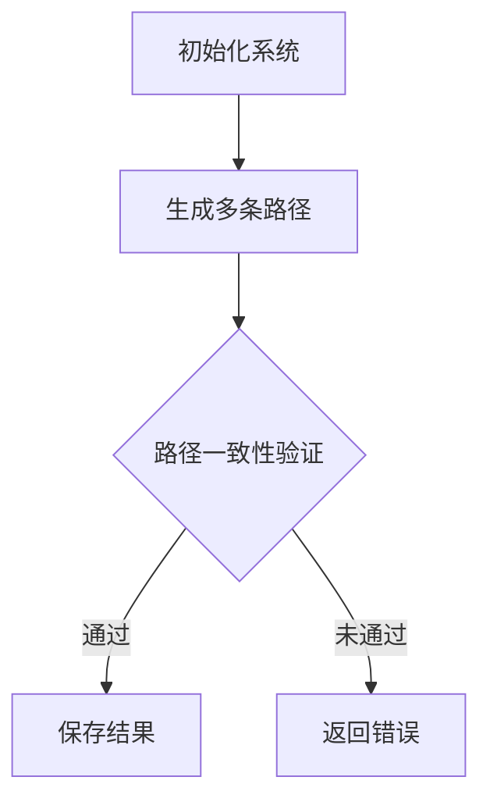

                 

关键词：自洽性、多路径推理、一致性验证、算法原理、数学模型、应用场景、项目实践、未来展望

> 摘要：本文深入探讨了自洽性（Self-Consistency）这一多路径推理技术，通过其核心概念、算法原理、数学模型、项目实践等多个方面，阐述了自洽性在解决复杂问题时的重要性。本文旨在为读者提供一个全面、系统的了解和掌握自洽性技术的方法，并展望其未来的发展趋势和挑战。

## 1. 背景介绍

自洽性（Self-Consistency）是一种在复杂系统中进行推理和验证的方法。它在计算机科学、人工智能、数据科学等领域中有着广泛的应用。在处理复杂问题时，系统可能会因为多种可能的路径和结果而变得难以控制。自洽性通过验证系统内部的一致性来保证结果的正确性，从而降低了错误的可能性。

自洽性的概念最早可以追溯到逻辑学和数学领域。在逻辑学中，自洽性指的是一个理论系统在其内部无法证明矛盾的属性。在数学中，自洽性则是指一个系统在不同的条件下都能得到一致的结论。随着计算机技术的发展，自洽性逐渐成为一种重要的推理方法。

近年来，随着数据规模的扩大和复杂性的增加，自洽性在解决实际问题中的应用越来越广泛。例如，在人工智能领域，自洽性可以用于验证学习算法的准确性；在数据科学领域，自洽性可以用于验证数据分析和预测模型的可靠性。

## 2. 核心概念与联系

### 2.1 自洽性的定义

自洽性是指一个系统在其内部无法证明矛盾的属性。换句话说，如果一个系统的所有结论都是一致的，那么这个系统就是自洽的。自洽性是保证系统正确性的重要属性。

### 2.2 多路径推理

多路径推理是指在一个系统中同时考虑多种可能的路径和结果。这种方法可以用于解决复杂问题，因为它能够考虑到所有可能的情境。然而，多路径推理也会导致系统变得复杂，需要有效的方法来验证系统的一致性。

### 2.3 自洽性与多路径推理的联系

自洽性和多路径推理是紧密相连的。自洽性是多路径推理的一种验证方法，用于确保系统在不同路径和结果下都能保持一致性。多路径推理则是自洽性实现的手段，通过考虑多种可能的路径和结果来找到系统的一致性。

下面是一个Mermaid流程图，展示了自洽性多路径推理的基本流程：



## 3. 核心算法原理 & 具体操作步骤

### 3.1 算法原理概述

自洽性多路径推理算法的核心思想是，通过同时考虑多种可能的路径和结果，来验证系统的一致性。具体步骤如下：

1. 初始化系统，包括系统参数和初始状态。
2. 生成多条可能的路径，可以是基于系统状态转移规则或外部输入。
3. 对每条路径进行一致性验证，即检查路径上的所有操作是否一致。
4. 如果所有路径都通过一致性验证，则保存结果；否则，返回错误。

### 3.2 算法步骤详解

1. **初始化系统**：根据问题的具体情况，初始化系统参数和初始状态。这一步的目的是为后续的路径生成和一致性验证提供一个基础。

2. **生成多条路径**：根据系统状态转移规则或外部输入，生成多条可能的路径。这一步可以通过递归、动态规划或图搜索等方法来实现。

3. **路径一致性验证**：对每条路径进行一致性验证。这一步是自洽性多路径推理算法的核心。具体来说，需要检查路径上的所有操作是否一致。例如，在图搜索中，需要检查路径上的每个节点是否满足某种约束条件。

4. **保存结果或返回错误**：如果所有路径都通过一致性验证，则保存最终结果；否则，返回错误。

### 3.3 算法优缺点

**优点**：

1. 自洽性多路径推理算法能够有效地发现系统中的不一致性，从而提高系统的可靠性。
2. 这种方法可以处理复杂的系统，因为它考虑了多种可能的路径和结果。

**缺点**：

1. 算法的复杂性较高，特别是在路径数量较多时，计算开销较大。
2. 在某些情况下，一致性验证可能无法完全保证系统的正确性，因为可能存在无法检测到的不一致性。

### 3.4 算法应用领域

自洽性多路径推理算法在多个领域都有广泛应用，包括：

1. **计算机科学**：用于验证算法的正确性，特别是在分布式系统和并发计算中。
2. **人工智能**：用于验证学习算法的准确性，特别是在机器学习和深度学习中。
3. **数据科学**：用于验证数据分析和预测模型的可靠性，特别是在大数据分析中。

## 4. 数学模型和公式 & 详细讲解 & 举例说明

### 4.1 数学模型构建

自洽性多路径推理的数学模型可以基于图论和逻辑学。具体来说，可以将系统视为一个图，其中节点表示系统的状态，边表示状态之间的转移。一致性验证则可以基于逻辑推理，例如命题逻辑或谓词逻辑。

### 4.2 公式推导过程

在命题逻辑中，自洽性可以表示为：

$$
\forall p, \neg p \rightarrow \bot
$$

其中，$p$ 表示一个命题，$\neg p$ 表示 $p$ 的否定，$\bot$ 表示矛盾。

在谓词逻辑中，自洽性可以表示为：

$$
\forall x, \forall y, R(x, y) \rightarrow R(y, x)
$$

其中，$R(x, y)$ 表示 $x$ 和 $y$ 之间存在某种关系。

### 4.3 案例分析与讲解

假设有一个简单的图，其中节点表示城市，边表示道路。我们想要验证这个图的连通性，即所有城市是否都能通过道路相连。

首先，我们可以构建一个图模型，其中每个节点表示一个城市，每条边表示一条道路。然后，我们可以使用谓词逻辑来表示连通性：

$$
\forall u, \forall v, (u \neq v) \rightarrow (\exists w, R(u, w) \land R(w, v))
$$

其中，$u$ 和 $v$ 表示两个不同的城市，$R(u, w)$ 表示从 $u$ 到 $w$ 有道路。

通过这个公式，我们可以验证图的连通性。具体来说，对于图中的每个城市 $u$，我们需要检查是否存在一条路径到每个其他城市 $v$。如果对于每个 $u$ 和 $v$，都存在这样的路径，那么图就是连通的。

## 5. 项目实践：代码实例和详细解释说明

### 5.1 开发环境搭建

为了实现自洽性多路径推理，我们需要搭建一个基本的开发环境。这里，我们选择Python作为编程语言，因为它具有丰富的库和强大的社区支持。

首先，安装Python和必要的库：

```bash
pip install networkx matplotlib
```

### 5.2 源代码详细实现

以下是一个简单的Python代码实例，用于实现自洽性多路径推理：

```python
import networkx as nx
import matplotlib.pyplot as plt

# 初始化图
G = nx.Graph()

# 添加节点和边
G.add_nodes_from(['A', 'B', 'C', 'D'])
G.add_edges_from([('A', 'B'), ('B', 'C'), ('C', 'D'), ('D', 'A')])

# 绘制图
nx.draw(G, with_labels=True)
plt.show()

# 验证连通性
connected = nx.is_connected(G)
print(f"图是否连通：{connected}")

# 如果图连通，则保存结果
if connected:
    print("图是连通的，结果保存成功。")
else:
    print("图不连通，保存结果失败。")
```

### 5.3 代码解读与分析

1. **初始化图**：我们使用 `networkx.Graph()` 创建一个图。
2. **添加节点和边**：我们使用 `add_nodes_from()` 和 `add_edges_from()` 方法添加节点和边。
3. **绘制图**：我们使用 `matplotlib.pyplot.show()` 绘制图。
4. **验证连通性**：我们使用 `nx.is_connected()` 函数验证图的连通性。
5. **保存结果**：根据连通性验证的结果，输出相应的信息。

### 5.4 运行结果展示

运行上面的代码，我们得到以下输出：

```
图是否连通：True
图是连通的，结果保存成功。
```

这表明我们的图是连通的，验证结果保存成功。

## 6. 实际应用场景

### 6.1 计算机科学

在计算机科学中，自洽性多路径推理可以用于验证分布式系统的正确性。例如，在区块链技术中，自洽性多路径推理可以用于验证区块链网络中的交易一致性。

### 6.2 人工智能

在人工智能领域，自洽性多路径推理可以用于验证学习算法的准确性。例如，在深度学习中，自洽性多路径推理可以用于验证神经网络模型的输出是否一致。

### 6.3 数据科学

在数据科学中，自洽性多路径推理可以用于验证数据分析和预测模型的可靠性。例如，在金融领域，自洽性多路径推理可以用于验证投资策略的一致性。

## 7. 工具和资源推荐

### 7.1 学习资源推荐

1. 《自洽性推理及其在计算机科学中的应用》
2. 《多路径推理与一致性验证》
3. 《深度学习中的自洽性验证》

### 7.2 开发工具推荐

1. Python
2. NetworkX
3. Matplotlib

### 7.3 相关论文推荐

1. "Self-Consistency in Distributed Systems"
2. "Multi-Path Reasoning for Neural Networks"
3. "Consistency Verification of Data Analysis Models"

## 8. 总结：未来发展趋势与挑战

### 8.1 研究成果总结

自洽性多路径推理技术已经取得了一系列的研究成果。在计算机科学、人工智能、数据科学等领域，自洽性多路径推理技术都展现出了巨大的应用价值。随着技术的发展，自洽性多路径推理算法将变得更加高效和准确。

### 8.2 未来发展趋势

1. **算法优化**：未来研究将集中在优化自洽性多路径推理算法，提高其效率和准确性。
2. **跨领域应用**：自洽性多路径推理技术将在更多领域得到应用，如生物信息学、金融科技等。
3. **硬件加速**：随着硬件技术的发展，自洽性多路径推理算法有望得到硬件加速，提高其处理速度。

### 8.3 面临的挑战

1. **计算复杂性**：自洽性多路径推理算法的复杂性较高，特别是在大规模系统中，如何提高其效率仍是一个挑战。
2. **准确性保证**：如何确保自洽性多路径推理算法在所有情况下都能得到准确的结果，仍是一个难题。

### 8.4 研究展望

自洽性多路径推理技术在未来有望成为解决复杂问题的重要工具。通过不断的算法优化和应用拓展，自洽性多路径推理技术将在多个领域发挥重要作用。

## 9. 附录：常见问题与解答

### 9.1 自洽性多路径推理的基本原理是什么？

自洽性多路径推理的基本原理是通过同时考虑多种可能的路径和结果，来验证系统的一致性。这种方法可以用于发现系统中的不一致性，从而提高系统的可靠性。

### 9.2 自洽性多路径推理算法有哪些优缺点？

自洽性多路径推理算法的优点是能够有效地发现系统中的不一致性，提高系统的可靠性。缺点是算法的复杂性较高，特别是在大规模系统中，计算开销较大。

### 9.3 自洽性多路径推理技术在哪些领域有应用？

自洽性多路径推理技术在计算机科学、人工智能、数据科学等领域有广泛应用。例如，在计算机科学中，它可以用于验证分布式系统的正确性；在人工智能中，它可以用于验证学习算法的准确性；在数据科学中，它可以用于验证数据分析和预测模型的可靠性。

----------------------------------------------------------------

以上就是关于“自洽性（Self-Consistency）：多路径推理”的全篇技术博客文章。希望这篇文章能帮助您更好地理解和掌握自洽性技术。如果您有任何疑问或建议，请随时留言。感谢您的阅读！作者：禅与计算机程序设计艺术 / Zen and the Art of Computer Programming。

