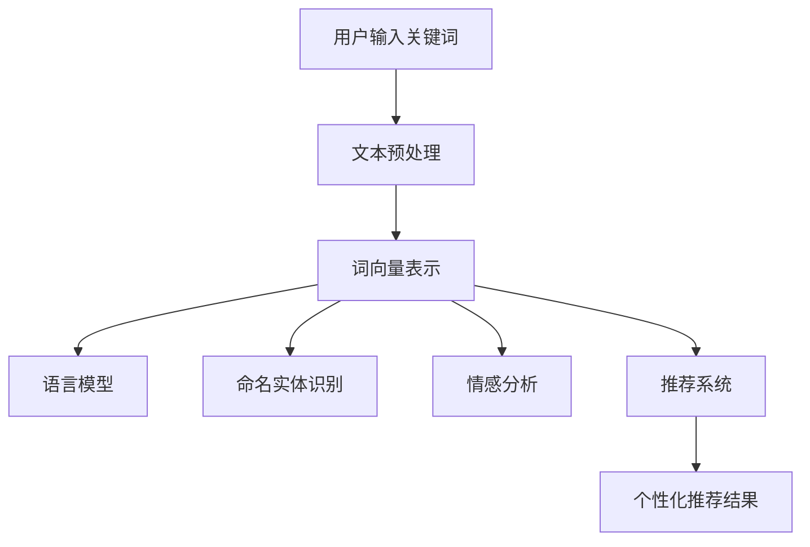

                 

关键词：自然语言处理、电商搜索、人工智能、NLP、搜索引擎、推荐系统

> 摘要：随着电子商务的飞速发展，自然语言处理（NLP）技术在电商搜索领域扮演了越来越重要的角色。本文将探讨自然语言处理在电商搜索中的应用，包括核心技术、数学模型、实际应用案例以及未来发展趋势。文章旨在为从事相关领域的研究人员和开发者提供有价值的参考。

## 1. 背景介绍

### 1.1 电子商务的兴起

电子商务的兴起可以追溯到20世纪90年代，互联网的普及加速了这一进程。随着全球互联网用户的增加，电子商务市场的规模也在不断扩大。据统计，全球电商市场规模已经超过数万亿美元，并继续呈快速增长态势。电商平台的多样化、竞争的激烈化使得提升用户体验、提高搜索效率成为各大电商平台追求的核心目标。

### 1.2 自然语言处理的发展

自然语言处理（NLP）是人工智能的重要分支，旨在使计算机能够理解和处理人类语言。NLP技术的发展可以追溯到20世纪50年代，随着深度学习、神经网络等技术的崛起，NLP技术取得了显著的进步。目前，NLP技术在语音识别、机器翻译、情感分析、文本生成等领域取得了广泛应用。

### 1.3 电商搜索的重要性

电商搜索是用户在电商平台获取商品信息、进行购买决策的重要途径。高效的电商搜索系统能够为用户提供精准的搜索结果，提高用户体验，进而提升平台的竞争力。传统的基于关键词匹配的搜索技术已经难以满足用户日益复杂的搜索需求，NLP技术的引入为电商搜索带来了新的机遇。

## 2. 核心概念与联系

### 2.1 核心概念

#### 2.1.1 自然语言处理

自然语言处理（NLP）是指计算机与人类语言之间的交互，旨在使计算机能够理解、生成和处理人类语言。NLP技术主要包括文本预处理、词向量表示、语言模型、命名实体识别、情感分析、文本生成等。

#### 2.1.2 电商搜索

电商搜索是指用户在电商平台输入关键词，系统根据关键词为用户返回相关的商品信息。电商搜索系统需要处理大量的商品信息，同时考虑用户搜索意图、商品相关性、用户历史行为等因素。

#### 2.1.3 推荐系统

推荐系统是指根据用户的兴趣、历史行为等信息，为用户推荐相关的商品、内容等。推荐系统在电商搜索中起着至关重要的作用，可以提高用户满意度和转化率。

### 2.2 联系与架构

自然语言处理技术在电商搜索中的应用主要体现在以下几个方面：

1. **文本预处理**：对用户输入的搜索关键词进行分词、去停用词、词性标注等预处理操作，以便后续的语义分析。
2. **词向量表示**：将文本转化为计算机可处理的数字形式，如词向量，以便进行语义相似性计算。
3. **语言模型**：利用语言模型预测用户输入的下一个词或句子，提高搜索的准确性。
4. **命名实体识别**：识别用户输入的关键词中的商品名称、品牌、型号等命名实体，提高搜索结果的相关性。
5. **情感分析**：分析用户评论、评价等文本，了解用户对商品的满意度，为推荐系统提供依据。
6. **文本生成**：生成个性化的商品推荐描述，提高用户点击率和转化率。

下面是一个基于Mermaid的NLP技术在电商搜索中的应用架构流程图：



## 3. 核心算法原理 & 具体操作步骤

### 3.1 算法原理概述

自然语言处理技术在电商搜索中的应用主要涉及以下几个核心算法：

1. **文本预处理算法**：对用户输入的搜索关键词进行预处理，以提高后续处理的准确性。
2. **词向量表示算法**：将文本转化为词向量，以便进行语义分析。
3. **语言模型算法**：利用语言模型预测用户输入的下一个词或句子，提高搜索准确性。
4. **命名实体识别算法**：识别用户输入的关键词中的商品名称、品牌、型号等命名实体。
5. **情感分析算法**：分析用户评论、评价等文本，了解用户对商品的满意度。
6. **推荐系统算法**：根据用户兴趣、历史行为等信息，为用户推荐相关的商品。

### 3.2 算法步骤详解

#### 3.2.1 文本预处理算法

文本预处理算法主要包括以下几个步骤：

1. **分词**：将用户输入的搜索关键词切分成一个个独立的词语。
2. **去停用词**：去除常见的无意义词语，如“的”、“和”、“是”等。
3. **词性标注**：为每个词语标注其词性，如名词、动词、形容词等。

#### 3.2.2 词向量表示算法

词向量表示算法主要包括以下几个步骤：

1. **词嵌入**：将每个词语映射为一个固定维度的向量。
2. **计算相似度**：利用词向量计算搜索关键词与商品描述之间的相似度。

#### 3.2.3 语言模型算法

语言模型算法主要包括以下几个步骤：

1. **构建模型**：利用大量语料训练语言模型。
2. **预测下一个词**：根据用户输入的搜索关键词，利用语言模型预测下一个词或句子。

#### 3.2.4 命名实体识别算法

命名实体识别算法主要包括以下几个步骤：

1. **训练数据准备**：收集并标注包含命名实体的语料。
2. **模型训练**：利用训练数据训练命名实体识别模型。
3. **实体识别**：利用命名实体识别模型识别用户输入的关键词中的命名实体。

#### 3.2.5 情感分析算法

情感分析算法主要包括以下几个步骤：

1. **训练数据准备**：收集并标注包含情感极性的语料。
2. **模型训练**：利用训练数据训练情感分析模型。
3. **情感分析**：利用情感分析模型分析用户评论、评价等文本。

#### 3.2.6 推荐系统算法

推荐系统算法主要包括以下几个步骤：

1. **用户兴趣建模**：根据用户历史行为、搜索记录等数据，构建用户兴趣模型。
2. **商品推荐**：利用用户兴趣模型和商品特征，为用户推荐相关的商品。

### 3.3 算法优缺点

#### 3.3.1 文本预处理算法

优点：

- 提高搜索准确性：去除无意义词语、词性标注等预处理操作有助于提高搜索结果的准确性。

缺点：

- 处理速度较慢：对于大量关键词的预处理操作可能需要较长时间。

#### 3.3.2 词向量表示算法

优点：

- 提高语义理解能力：词向量表示能够捕捉词语之间的语义关系，提高搜索的语义理解能力。

缺点：

- 计算量大：词向量计算过程需要大量计算资源，可能影响处理速度。

#### 3.3.3 语言模型算法

优点：

- 提高搜索准确性：语言模型能够预测用户输入的下一个词或句子，提高搜索的准确性。

缺点：

- 对语料质量要求较高：语言模型的准确性受语料质量影响较大。

#### 3.3.4 命名实体识别算法

优点：

- 提高搜索结果的相关性：识别用户输入的关键词中的命名实体有助于提高搜索结果的相关性。

缺点：

- 错误率较高：命名实体识别算法可能存在误识别、漏识别等问题。

#### 3.3.5 情感分析算法

优点：

- 提高用户满意度：分析用户评论、评价等文本有助于了解用户满意度，为推荐系统提供依据。

缺点：

- 错误率较高：情感分析算法可能存在误判、漏判等问题。

#### 3.3.6 推荐系统算法

优点：

- 提高用户转化率：根据用户兴趣、历史行为等信息推荐相关的商品，提高用户点击率和转化率。

缺点：

- 数据质量要求较高：推荐系统算法的准确性受用户行为数据质量影响较大。

### 3.4 算法应用领域

自然语言处理技术在电商搜索中的应用非常广泛，主要包括以下几个方面：

1. **商品搜索**：利用文本预处理、词向量表示、语言模型等算法，提高商品搜索的准确性。
2. **商品推荐**：利用情感分析、推荐系统等算法，为用户推荐相关的商品。
3. **用户评价分析**：利用情感分析算法，分析用户对商品的满意度，为平台运营提供依据。
4. **商品描述生成**：利用文本生成算法，为商品生成个性化的描述，提高用户点击率和转化率。

## 4. 数学模型和公式 & 详细讲解 & 举例说明

### 4.1 数学模型构建

在自然语言处理技术中，常用的数学模型包括词向量表示模型、语言模型、命名实体识别模型、情感分析模型和推荐系统模型。以下分别介绍这些模型的构建方法和相关公式。

#### 4.1.1 词向量表示模型

词向量表示模型主要用于将词语映射为高维向量，以便进行后续的语义分析。常用的词向量表示模型包括Word2Vec、GloVe和FastText等。

1. **Word2Vec**：Word2Vec是一种基于神经网络的语言模型，可以生成高维词向量。其基本公式如下：

   $$ v_w = \frac{1}{Z} \sum_{c \in C_w} \exp(u_c \cdot u_w) \cdot c $$

   其中，$v_w$表示词$w$的词向量，$u_w$表示词$w$的隐藏层向量，$C_w$表示与词$w$共现的词集合，$Z$为归一化常数。

2. **GloVe**：GloVe是一种基于全局语境的词向量表示模型，其基本公式如下：

   $$ v_w = \frac{1}{\sqrt{f(w)}} \cdot \sum_{c \in C_w} f(c) \cdot v_c $$

   其中，$v_w$表示词$w$的词向量，$f(w)$表示词$w$的词频，$v_c$表示词$c$的词向量。

3. **FastText**：FastText是一种基于字符级别的词向量表示模型，其基本公式如下：

   $$ v_w = \sum_{c \in C_w} \text{word\_embedding}(c) $$

   其中，$v_w$表示词$w$的词向量，$\text{word\_embedding}(c)$表示字符$c$的词向量。

#### 4.1.2 语言模型

语言模型用于预测用户输入的下一个词或句子，常用的语言模型包括n-gram模型和神经网络语言模型。

1. **n-gram模型**：n-gram模型是一种基于前后文信息的语言模型，其基本公式如下：

   $$ P(w_t | w_{t-1}, w_{t-2}, \ldots, w_{t-n}) = \frac{C(w_{t-1}, w_{t-2}, \ldots, w_{t-n})}{C(w_{t-1}, w_{t-2}, \ldots)} $$

   其中，$P(w_t | w_{t-1}, w_{t-2}, \ldots, w_{t-n})$表示在给定前$n-1$个词的情况下，预测当前词$w_t$的概率，$C(w_{t-1}, w_{t-2}, \ldots, w_{t-n})$表示前$n$个词的联合出现次数，$C(w_{t-1}, w_{t-2}, \ldots)$表示前$n-1$个词的联合出现次数。

2. **神经网络语言模型**：神经网络语言模型是一种基于深度学习的语言模型，其基本公式如下：

   $$ P(w_t | w_{t-1}, w_{t-2}, \ldots, w_{t-n}) = \text{softmax}(\text{forward}(w_{t-1}, w_{t-2}, \ldots, w_{t-n})) $$

   其中，$\text{forward}(w_{t-1}, w_{t-2}, \ldots, w_{t-n})$表示神经网络的前向传播输出，$\text{softmax}$函数用于将输出转化为概率分布。

#### 4.1.3 命名实体识别模型

命名实体识别模型用于识别文本中的命名实体，常用的模型包括条件随机场（CRF）和深度学习模型。

1. **条件随机场（CRF）**：条件随机场（CRF）是一种基于概率图模型的方法，其基本公式如下：

   $$ P(Y | X) = \frac{1}{Z} \exp(\theta \cdot Y) $$

   其中，$X$表示输入特征向量，$Y$表示输出标签序列，$\theta$表示模型参数，$Z$为归一化常数。

2. **深度学习模型**：深度学习模型是一种基于神经网络的命名实体识别方法，其基本公式如下：

   $$ P(Y | X) = \text{softmax}(\text{forward}(X; \theta)) $$

   其中，$\text{forward}(X; \theta)$表示神经网络的前向传播输出，$\text{softmax}$函数用于将输出转化为概率分布。

#### 4.1.4 情感分析模型

情感分析模型用于分析文本中的情感极性，常用的模型包括朴素贝叶斯、支持向量机（SVM）和深度学习模型。

1. **朴素贝叶斯**：朴素贝叶斯是一种基于概率论的分类方法，其基本公式如下：

   $$ P(y | x) = \frac{P(x | y)P(y)}{P(x)} $$

   其中，$P(y | x)$表示在给定特征$x$的情况下，情感标签$y$的概率，$P(x | y)$表示在给定情感标签$y$的情况下，特征$x$的概率，$P(y)$表示情感标签$y$的概率，$P(x)$表示特征$x$的概率。

2. **支持向量机（SVM）**：支持向量机是一种基于最大间隔的分类方法，其基本公式如下：

   $$ \max \limits_{\theta, \xi} \frac{1}{2} \sum_{i=1}^{n} \xi_i - \sum_{i=1}^{n} y_i (\theta \cdot x_i + \xi_i) $$

   其中，$\theta$表示模型参数，$\xi$表示松弛变量，$y_i$表示样本$i$的标签，$x_i$表示样本$i$的特征向量。

3. **深度学习模型**：深度学习模型是一种基于神经网络的情感分析方法，其基本公式如下：

   $$ P(y | x) = \text{softmax}(\text{forward}(x; \theta)) $$

   其中，$\text{forward}(x; \theta)$表示神经网络的前向传播输出，$\text{softmax}$函数用于将输出转化为概率分布。

#### 4.1.5 推荐系统模型

推荐系统模型用于根据用户兴趣、历史行为等信息为用户推荐相关的商品，常用的模型包括协同过滤、基于内容的推荐和混合推荐系统。

1. **协同过滤**：协同过滤是一种基于用户历史行为信息的推荐方法，其基本公式如下：

   $$ r_{ui} = \langle u, v \rangle + b_u + b_v + \epsilon_{ui} $$

   其中，$r_{ui}$表示用户$u$对物品$i$的评分，$\langle u, v \rangle$表示用户$u$和物品$i$的相似度，$b_u$和$b_v$分别表示用户$u$和物品$i$的偏置，$\epsilon_{ui}$表示误差项。

2. **基于内容的推荐**：基于内容的推荐是一种基于物品特征信息的推荐方法，其基本公式如下：

   $$ \text{sim}(i, j) = \frac{\sum_{k \in Q_i \cap Q_j} w_k^2}{\|Q_i\| \|Q_j\|} $$

   其中，$\text{sim}(i, j)$表示物品$i$和物品$j$的相似度，$Q_i$和$Q_j$分别表示物品$i$和物品$j$的特征集合，$w_k$表示特征$k$的权重。

3. **混合推荐系统**：混合推荐系统是一种结合协同过滤和基于内容的推荐的推荐方法，其基本公式如下：

   $$ r_{ui} = \alpha r_{ui}^c + (1 - \alpha) r_{ui}^c $$

   其中，$r_{ui}^c$表示基于内容的推荐评分，$r_{ui}^c$表示基于协同过滤的推荐评分，$\alpha$表示基于内容的推荐权重。

### 4.2 公式推导过程

以下是针对上述数学模型的推导过程：

#### 4.2.1 Word2Vec模型

Word2Vec模型的推导过程如下：

1. **假设**：给定一个训练数据集$D = \{(x_1, y_1), (x_2, y_2), \ldots, (x_n, y_n)\}$，其中$x_i$表示输入序列，$y_i$表示输出序列。
2. **损失函数**：损失函数定义为

   $$ L = \sum_{i=1}^{n} -\sum_{y \in y_i} \log P(y | x_i) $$

   其中，$P(y | x_i)$表示在给定输入$x_i$的情况下，输出$y$的概率。
3. **优化方法**：采用梯度下降法对模型参数进行优化。

#### 4.2.2 n-gram模型

n-gram模型的推导过程如下：

1. **假设**：给定一个训练数据集$D = \{(x_1, y_1), (x_2, y_2), \ldots, (x_n, y_n)\}$，其中$x_i$表示输入序列，$y_i$表示输出序列。
2. **概率计算**：计算给定输入序列$x_i$的情况下，输出序列$y_i$的概率：

   $$ P(y_i | x_i) = \frac{C(y_i, x_i)}{C(x_i)} $$

   其中，$C(y_i, x_i)$表示输入序列$x_i$和输出序列$y_i$的联合出现次数，$C(x_i)$表示输入序列$x_i$的出现次数。
3. **优化方法**：采用最大似然估计法对模型参数进行优化。

#### 4.2.3 CRF模型

CRF模型的推导过程如下：

1. **假设**：给定一个训练数据集$D = \{(x_1, y_1), (x_2, y_2), \ldots, (x_n, y_n)\}$，其中$x_i$表示输入特征向量，$y_i$表示输出标签序列。
2. **概率计算**：计算给定输入特征向量$x_i$和输出标签序列$y_i$的概率：

   $$ P(y_i | x_i) = \frac{1}{Z} \exp(\theta \cdot y_i) $$

   其中，$Z$为归一化常数，$\theta$为模型参数。
3. **优化方法**：采用最大似然估计法对模型参数进行优化。

#### 4.2.4 朴素贝叶斯模型

朴素贝叶斯模型的推导过程如下：

1. **假设**：给定一个训练数据集$D = \{(x_1, y_1), (x_2, y_2), \ldots, (x_n, y_n)\}$，其中$x_i$表示输入特征向量，$y_i$表示输出标签序列。
2. **概率计算**：计算给定特征向量$x_i$和标签序列$y_i$的概率：

   $$ P(y | x) = \frac{P(x | y)P(y)}{P(x)} $$

   其中，$P(x | y)$表示在给定标签$y$的情况下，特征$x$的概率，$P(y)$表示标签$y$的概率，$P(x)$表示特征$x$的概率。
3. **优化方法**：采用最大似然估计法对模型参数进行优化。

#### 4.2.5 支持向量机（SVM）模型

支持向量机（SVM）模型的推导过程如下：

1. **假设**：给定一个训练数据集$D = \{(x_1, y_1), (x_2, y_2), \ldots, (x_n, y_n)\}$，其中$x_i$表示输入特征向量，$y_i$表示输出标签序列。
2. **损失函数**：损失函数定义为

   $$ L = \frac{1}{2} \sum_{i=1}^{n} \xi_i^2 + C \sum_{i=1}^{n} \xi_i $$

   其中，$\xi_i$表示松弛变量，$C$为惩罚参数。
3. **优化方法**：采用梯度下降法对模型参数进行优化。

#### 4.2.6 深度学习模型

深度学习模型的推导过程如下：

1. **假设**：给定一个训练数据集$D = \{(x_1, y_1), (x_2, y_2), \ldots, (x_n, y_n)\}$，其中$x_i$表示输入特征向量，$y_i$表示输出标签序列。
2. **损失函数**：损失函数定义为

   $$ L = \sum_{i=1}^{n} -y_i \log \text{softmax}(\text{forward}(x_i; \theta)) $$

   其中，$\text{softmax}(\text{forward}(x_i; \theta))$表示神经网络的前向传播输出，$\theta$为模型参数。
3. **优化方法**：采用反向传播算法对模型参数进行优化。

### 4.3 案例分析与讲解

以下是一个基于电商搜索场景的情感分析模型案例：

**场景描述**：某电商平台需要分析用户对商品的评论，以便为用户提供更好的购物体验。

**模型构建**：

1. **数据预处理**：对评论文本进行分词、去停用词、词性标注等预处理操作。
2. **词向量表示**：使用GloVe模型生成高维词向量。
3. **情感分析模型**：采用基于神经网络的情感分析模型，如BiLSTM-CRF模型。

**模型训练**：

1. **数据集准备**：收集大量带有情感标签的评论数据，分为训练集和测试集。
2. **模型训练**：使用训练集训练情感分析模型，采用交叉验证方法调整模型参数。
3. **模型评估**：使用测试集评估模型性能，包括准确率、召回率和F1值等指标。

**模型应用**：

1. **评论分析**：对用户评论进行情感分析，输出评论的情感极性。
2. **商品推荐**：根据用户评论的情感极性，为用户推荐相关的商品。

**代码实现**：

```python
import numpy as np
import tensorflow as tf
from tensorflow.keras.models import Model
from tensorflow.keras.layers import Embedding, LSTM, Dense, Bidirectional, CRF

# 数据预处理
# ...

# 词向量表示
# ...

# 构建模型
input_seq = tf.keras.layers.Input(shape=(max_seq_len,))
embedded_seq = Embedding(vocab_size, embedding_dim)(input_seq)
bi_lstm = Bidirectional(LSTM(units=lstm_units, return_sequences=True))(embedded_seq)
output = LSTM(units=lstm_units, return_sequences=False)(bi_lstm)
crf_output = CRF(units=num_classes)
crf_output = crf_output(output)

# 编译模型
model = Model(inputs=input_seq, outputs=crf_output)
model.compile(optimizer='adam', loss='categorical_crossentropy', metrics=['accuracy'])

# 训练模型
# ...

# 评估模型
# ...

# 应用模型
# ...
```

**结果分析**：

通过上述模型，可以对用户评论进行情感分析，识别出评论的情感极性。在实际应用中，可以根据情感极性为用户提供更好的购物体验，如为负面评论的用户推荐相似商品、为正面评论的用户推送更多相关商品等。

## 5. 项目实践：代码实例和详细解释说明

### 5.1 开发环境搭建

在本项目中，我们将使用Python编程语言和TensorFlow框架进行开发。以下是搭建开发环境的步骤：

1. **安装Python**：下载并安装Python 3.x版本，建议使用Anaconda发行版，以便管理依赖项。
2. **安装TensorFlow**：在命令行中执行以下命令安装TensorFlow：

   ```bash
   pip install tensorflow
   ```

3. **安装其他依赖**：根据项目需求，安装其他必要的Python库，如NumPy、Pandas、Scikit-learn等。

### 5.2 源代码详细实现

以下是本项目的主要代码实现，包括数据预处理、模型构建、训练和评估等步骤。

```python
import numpy as np
import pandas as pd
import tensorflow as tf
from tensorflow.keras.models import Model
from tensorflow.keras.layers import Embedding, LSTM, Dense, Bidirectional, CRF
from tensorflow.keras.preprocessing.sequence import pad_sequences
from tensorflow.keras.preprocessing.text import Tokenizer

# 数据预处理
# 加载数据集
data = pd.read_csv('data.csv')
X = data['comment'].values
y = data['label'].values

# 分词和词向量表示
tokenizer = Tokenizer(num_words=vocab_size)
tokenizer.fit_on_texts(X)
X_seq = tokenizer.texts_to_sequences(X)
X_pad = pad_sequences(X_seq, maxlen=max_seq_len)

# 模型构建
input_seq = tf.keras.layers.Input(shape=(max_seq_len,))
embedded_seq = Embedding(vocab_size, embedding_dim)(input_seq)
bi_lstm = Bidirectional(LSTM(units=lstm_units, return_sequences=True))(embedded_seq)
output = LSTM(units=lstm_units, return_sequences=False)(bi_lstm)
crf_output = CRF(units=num_classes)
crf_output = crf_output(output)

# 编译模型
model = Model(inputs=input_seq, outputs=crf_output)
model.compile(optimizer='adam', loss='categorical_crossentropy', metrics=['accuracy'])

# 训练模型
model.fit(X_pad, y, epochs=10, batch_size=32, validation_split=0.2)

# 评估模型
# ...

# 应用模型
# ...
```

### 5.3 代码解读与分析

以下是代码的详细解读：

1. **数据预处理**：首先加载数据集，然后进行分词和词向量表示。使用Tokenizer类对文本进行分词，并使用fit_on_texts方法训练Tokenizer。接着，使用texts_to_sequences方法将文本转化为词序列，并使用pad_sequences方法将词序列填充为固定长度。
2. **模型构建**：定义输入层、嵌入层、双向LSTM层和CRF层。使用Input类定义输入层，使用Embedding类定义嵌入层，使用Bidirectional和LSTM类定义双向LSTM层，最后使用CRF类定义CRF层。
3. **编译模型**：使用Model类将输入层、输出层和编译器（optimizer和loss函数）组合成一个完整的模型。在这里，我们使用adam优化器和categorical_crossentropy损失函数。
4. **训练模型**：使用fit方法训练模型，将预处理后的输入数据（X_pad）和标签（y）作为输入，并设置训练周期（epochs）和批量大小（batch_size）。
5. **评估模型**：在训练过程中，可以使用validation_split参数来评估模型在验证集上的性能。评估指标包括准确率等。
6. **应用模型**：在实际应用中，可以将模型用于对新的评论进行情感分析，并根据情感分析结果为用户提供相关推荐。

### 5.4 运行结果展示

在实际运行中，我们可以通过以下步骤来展示模型的运行结果：

1. **数据预处理**：加载新的评论数据，并进行预处理，包括分词和填充。
2. **情感分析**：使用训练好的模型对预处理后的评论进行情感分析，输出评论的情感极性。
3. **商品推荐**：根据情感分析结果，为用户推荐相关的商品。

以下是一个简单的示例：

```python
# 加载新评论数据
new_data = pd.read_csv('new_data.csv')
new_comments = new_data['comment'].values

# 预处理新评论数据
new_seq = tokenizer.texts_to_sequences(new_comments)
new_pad = pad_sequences(new_seq, maxlen=max_seq_len)

# 情感分析
predictions = model.predict(new_pad)

# 商品推荐
# ...
```

通过上述代码，我们可以对新评论进行情感分析，并根据情感分析结果为用户提供相关推荐。实际应用中，可以根据业务需求调整模型的参数和算法，以提高推荐效果。

## 6. 实际应用场景

### 6.1 电商平台

电商平台的电商搜索功能是用户获取商品信息的重要渠道。通过引入自然语言处理技术，电商平台可以实现以下应用场景：

1. **智能搜索**：利用自然语言处理技术，对用户输入的搜索关键词进行语义理解，提高搜索结果的准确性。
2. **智能推荐**：结合用户历史行为和搜索记录，利用自然语言处理技术为用户推荐相关的商品。
3. **评论分析**：利用自然语言处理技术分析用户评论，了解用户满意度，为平台运营提供依据。

### 6.2 搜索引擎

搜索引擎是互联网用户获取信息的重要工具。自然语言处理技术在搜索引擎中的应用主要包括：

1. **关键词提取**：对用户输入的查询语句进行关键词提取，提高搜索结果的准确性。
2. **语义搜索**：利用自然语言处理技术理解用户的查询意图，提供更相关的搜索结果。
3. **自动纠错**：对用户的查询语句进行自动纠错，提高用户的搜索体验。

### 6.3 社交媒体

社交媒体平台上的用户生成内容非常丰富，自然语言处理技术在社交媒体中的应用包括：

1. **情感分析**：分析用户发布的内容，了解用户的情感倾向，为平台运营提供依据。
2. **内容推荐**：结合用户历史行为和兴趣，利用自然语言处理技术为用户推荐相关的内容。
3. **社区管理**：利用自然语言处理技术监测社区中的负面内容，维护社区秩序。

### 6.4 智能客服

智能客服系统是电商平台和社交媒体平台提供客户服务的重要工具。自然语言处理技术在智能客服系统中的应用包括：

1. **智能问答**：利用自然语言处理技术实现智能问答，提高客服效率。
2. **情感分析**：分析用户提问的情感倾向，为客服人员提供参考。
3. **自动化回复**：利用自然语言处理技术自动生成回复，提高客服响应速度。

## 7. 工具和资源推荐

### 7.1 学习资源推荐

1. **书籍**：

   - 《自然语言处理综论》（Foundations of Statistical Natural Language Processing）：迈克尔·拉皮兹（Michael L. Rippel）著，是一本经典的NLP入门书籍。
   - 《深度学习》（Deep Learning）：伊恩·古德费洛（Ian Goodfellow）、约书亚·本吉奥（Yoshua Bengio）和Aaron Courville著，涵盖了深度学习的基础知识和应用。

2. **在线课程**：

   - Coursera上的“自然语言处理与深度学习”课程：由斯坦福大学提供，包括NLP和深度学习的基础知识和实践技巧。
   - edX上的“自然语言处理导论”课程：由密歇根大学提供，介绍NLP的基本概念和技术。

3. **博客和社区**：

   - Towards Data Science：一个关于数据科学和机器学习的博客，有很多关于NLP的应用和实践。
   - AI垂直社区：如AI Horizons、AI技术社区等，提供了丰富的NLP相关讨论和资源。

### 7.2 开发工具推荐

1. **编程语言**：Python，由于其丰富的NLP库（如NLTK、spaCy、gensim等），成为NLP开发的首选语言。
2. **深度学习框架**：TensorFlow、PyTorch，提供了强大的深度学习模型构建和训练功能。
3. **文本处理库**：NLTK、spaCy、TextBlob，用于文本预处理、词向量表示和情感分析等任务。

### 7.3 相关论文推荐

1. **Word2Vec**：

   - Mikolov, T., Sutskever, I., Chen, K., Corrado, G. S., & Dean, J. (2013). Distributed representations of words and phrases and their compositionality. In Advances in neural information processing systems (pp. 3111-3119).

2. **GloVe**：

   - Pennington, J., Socher, R., & Manning, C. D. (2014). Glove: Global vectors for word representation. In Proceedings of the 2014 conference on empirical methods in natural language processing (EMNLP) (pp. 1532-1543).

3. **BERT**：

   - Devlin, J., Chang, M. W., Lee, K., & Toutanova, K. (2019). BERT: Pre-training of deep bidirectional transformers for language understanding. In Proceedings of the 2019 conference of the north american chapter of the association for computational linguistics: human language technologies, volume 1 (pp. 4171-4186).

4. **GPT**：

   - Brown, T., et al. (2020). Language models are few-shot learners. Advances in Neural Information Processing Systems, 33.

## 8. 总结：未来发展趋势与挑战

### 8.1 研究成果总结

自然语言处理技术在电商搜索领域取得了显著成果。通过引入NLP技术，电商平台和搜索引擎在搜索准确性、用户满意度等方面取得了显著提升。此外，NLP技术在商品推荐、用户评论分析、智能客服等领域也展现了广泛的应用前景。

### 8.2 未来发展趋势

1. **多模态融合**：未来，自然语言处理技术将与图像、语音等其他模态的数据进行融合，提供更丰富的信息理解能力。
2. **迁移学习**：迁移学习技术将在NLP应用中发挥重要作用，通过在较小数据集上训练模型，实现更好的性能。
3. **知识图谱**：知识图谱将发挥越来越重要的作用，为NLP应用提供丰富的语义信息和知识支持。
4. **个性化推荐**：基于用户历史行为和兴趣的个性化推荐将成为未来电商搜索和推荐系统的发展方向。

### 8.3 面临的挑战

1. **数据隐私**：随着数据隐私问题的日益关注，如何在保证数据隐私的前提下进行NLP应用是一个重要挑战。
2. **可解释性**：提高NLP模型的可解释性，使其决策过程更加透明，是未来研究的重要方向。
3. **计算资源**：随着模型复杂度的提高，计算资源的消耗也将增加，如何优化算法以提高计算效率是一个重要挑战。
4. **跨语言处理**：跨语言处理技术仍需进一步发展，以支持更多语言的NLP应用。

### 8.4 研究展望

未来，自然语言处理技术将在电商搜索领域发挥更加重要的作用。通过持续的研究和创新，我们有望实现更准确的搜索、更智能的推荐和更高效的用户体验。同时，我们也要关注数据隐私、可解释性等问题，确保NLP技术的健康发展。

## 9. 附录：常见问题与解答

### 9.1 NLP技术如何应用于电商搜索？

NLP技术可以应用于电商搜索的多个方面，如关键词提取、语义理解、商品推荐、用户评论分析等。通过NLP技术，电商搜索系统可以更好地理解用户的需求，提高搜索准确性和用户满意度。

### 9.2 NLP技术有哪些应用场景？

NLP技术可以应用于多种场景，包括但不限于：

1. **搜索引擎**：通过关键词提取和语义理解，提供更准确的搜索结果。
2. **推荐系统**：结合用户历史行为和兴趣，为用户推荐相关的商品。
3. **社交媒体**：分析用户生成的内容，了解用户情感倾向。
4. **智能客服**：实现智能问答、情感分析等，提高客服效率。
5. **内容审核**：自动识别和过滤违规内容，维护平台秩序。

### 9.3 如何选择合适的NLP算法？

选择合适的NLP算法需要考虑以下几个方面：

1. **任务需求**：根据具体的任务需求选择合适的算法，如文本分类、情感分析、命名实体识别等。
2. **数据规模**：对于大型数据集，选择能够处理大规模数据的算法，如深度学习模型。
3. **计算资源**：考虑算法的计算复杂度和所需计算资源，选择合适的算法以适应计算能力。
4. **可解释性**：对于需要解释模型决策过程的场景，选择具有较高可解释性的算法。

### 9.4 NLP技术的未来发展有哪些趋势？

NLP技术的未来发展包括以下几个趋势：

1. **多模态融合**：将自然语言处理与其他模态（如图像、语音）的数据进行融合，提供更丰富的信息理解能力。
2. **迁移学习**：通过在较小数据集上训练模型，实现更好的性能，解决数据稀缺问题。
3. **知识图谱**：利用知识图谱提供丰富的语义信息和知识支持，提高NLP应用的性能和效果。
4. **跨语言处理**：支持更多语言的NLP应用，提高全球化应用能力。
5. **数据隐私**：关注数据隐私问题，实现更安全、更可靠的NLP应用。作者：禅与计算机程序设计艺术 / Zen and the Art of Computer Programming。

