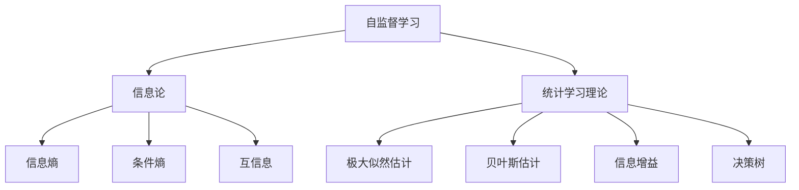

                 

关键词：自监督学习，信息论，统计学习理论，神经网络，机器学习，数据驱动，信息熵，条件熵，互信息，维纳-辛钦大数定律，极大似然估计，贝叶斯估计，信息增益，决策树，模型选择，优化算法，深度学习。

> 摘要：本文将深入探讨自监督学习的理论基础，重点关注信息论和统计学习理论在其发展过程中的作用。通过对信息熵、条件熵、互信息等核心概念的解析，结合维纳-辛钦大数定律、极大似然估计和贝叶斯估计等统计学习方法，我们将理解自监督学习如何在数据驱动和优化算法的协同作用下实现智能。本文还将通过数学模型和公式推导，展示自监督学习在深度学习领域的广泛应用，并探讨其未来发展趋势与面临的挑战。

## 1. 背景介绍

### 自监督学习的定义与历史发展

自监督学习（Self-supervised Learning）是一种无需人工标注数据标签，仅利用数据内部关联性进行训练的机器学习方法。自监督学习通过预训练模型，使其能够在未见过的数据上表现良好，从而为下游任务提供强大的特征提取能力。自监督学习的历史可以追溯到20世纪80年代，当时研究人员开始探索如何利用未标注数据来提升模型性能。然而，由于计算资源和数据集的限制，自监督学习的发展较为缓慢。随着深度学习技术的兴起，特别是卷积神经网络（CNN）和循环神经网络（RNN）的发展，自监督学习逐渐成为机器学习领域的研究热点。

### 自监督学习的重要性与挑战

自监督学习具有以下重要性：

1. **数据效率**：自监督学习可以大幅降低对标注数据的依赖，提高训练数据的利用率。
2. **泛化能力**：自监督学习通过预训练模型，能够在多种下游任务中表现出色，提高模型的泛化能力。
3. **实时性**：自监督学习可以在实时数据流中进行训练，实现持续学习和适应。

然而，自监督学习也面临以下挑战：

1. **数据关联性**：自监督学习依赖于数据之间的关联性，如何有效地挖掘数据内部关联性是一个关键问题。
2. **模型复杂性**：自监督学习通常涉及大规模模型，如何提高模型训练效率和可解释性是重要问题。
3. **领域适应性**：自监督学习模型在不同领域应用时，可能需要调整模型结构和训练策略，以适应特定领域的数据特性。

## 2. 核心概念与联系

### 信息论基本概念

信息论是研究信息传输、存储和处理的基本原理的学科，由香农（Claude Shannon）在20世纪40年代创立。以下是几个关键概念：

- **信息熵（Entropy）**：表示随机变量不确定性的度量，用数学公式表示为：
  $$H(X) = -\sum_{x \in X} p(x) \log_2 p(x)$$
  
- **条件熵（Conditional Entropy）**：在已知另一个随机变量后，对某个随机变量的不确定性度量，用数学公式表示为：
  $$H(Y|X) = -\sum_{x \in X} \sum_{y \in Y} p(y|x) \log_2 p(y|x)$$
  
- **互信息（Mutual Information）**：两个随机变量之间的关联强度度量，用数学公式表示为：
  $$I(X;Y) = H(X) - H(X|Y) = H(Y) - H(Y|X)$$

### 统计学习理论基本概念

统计学习理论是机器学习的基础，旨在从数据中构建预测模型。以下是几个关键概念：

- **极大似然估计（Maximum Likelihood Estimation, MLE）**：通过最大化似然函数来估计模型参数的方法。
- **贝叶斯估计（Bayesian Estimation）**：在不确定环境下，通过贝叶斯公式来估计模型参数的方法。
- **信息增益（Information Gain）**：用于特征选择的度量，表示信息量的增加。
- **决策树（Decision Tree）**：一种常见的树形结构模型，用于分类和回归任务。

### 自监督学习与信息论和统计学习理论的联系

自监督学习与信息论和统计学习理论之间存在紧密联系：

1. **数据关联性挖掘**：自监督学习通过信息论中的互信息度量，挖掘数据之间的关联性，从而提高模型性能。
2. **模型优化**：统计学习理论提供了一系列优化算法，如梯度下降、随机梯度下降等，用于自监督学习模型的训练。
3. **特征提取**：信息熵和条件熵等概念在特征提取中发挥着重要作用，有助于构建高效的特征表示。

### Mermaid 流程图

以下是一个简化的 Mermaid 流程图，展示了自监督学习与信息论和统计学习理论的联系：



## 3. 核心算法原理 & 具体操作步骤

### 3.1 算法原理概述

自监督学习算法的核心思想是利用数据内部的关联性，通过预训练模型来提取有用的特征表示。具体来说，自监督学习算法可以分为以下几类：

1. **预训练-微调（Pre-training and Fine-tuning）**：首先在大量未标注数据上进行预训练，然后在下游任务上微调模型参数。
2. **伪标签（Pseudo Labeling）**：在未标注数据上生成伪标签，然后使用伪标签进行训练。
3. **自编码器（Autoencoder）**：通过重建输入数据来学习有效特征表示。
4. **对比学习（Contrastive Learning）**：通过对比相似样本和不同样本来学习特征表示。

### 3.2 算法步骤详解

以下是自监督学习算法的一般步骤：

1. **数据预处理**：对原始数据进行预处理，如去噪、标准化等，以提高数据质量和训练效率。
2. **特征提取**：使用预训练模型（如CNN、RNN等）提取原始数据的特征表示。
3. **关联性度量**：使用信息论中的互信息度量，评估特征表示之间的关联性。
4. **模型优化**：通过优化算法（如梯度下降、随机梯度下降等）调整模型参数，以最小化损失函数。
5. **评估与微调**：在下游任务上进行评估，并根据评估结果对模型进行微调。

### 3.3 算法优缺点

**优点**：

1. **数据效率**：自监督学习可以大幅降低对标注数据的依赖，提高训练数据的利用率。
2. **泛化能力**：自监督学习通过预训练模型，能够在多种下游任务中表现出色，提高模型的泛化能力。
3. **实时性**：自监督学习可以在实时数据流中进行训练，实现持续学习和适应。

**缺点**：

1. **数据关联性挖掘难度**：如何有效地挖掘数据内部关联性是一个关键问题。
2. **模型复杂性**：自监督学习通常涉及大规模模型，如何提高模型训练效率和可解释性是重要问题。
3. **领域适应性**：自监督学习模型在不同领域应用时，可能需要调整模型结构和训练策略，以适应特定领域的数据特性。

### 3.4 算法应用领域

自监督学习在多个领域具有广泛的应用：

1. **计算机视觉**：自监督学习在图像分类、目标检测、图像分割等领域取得了显著成果。
2. **自然语言处理**：自监督学习在文本分类、机器翻译、情感分析等领域具有广泛应用。
3. **语音识别**：自监督学习在语音识别、说话人识别等领域表现出色。
4. **推荐系统**：自监督学习在推荐系统领域，通过挖掘用户行为数据，提高推荐系统的准确性和多样性。

## 4. 数学模型和公式 & 详细讲解 & 举例说明

### 4.1 数学模型构建

自监督学习中的数学模型通常包括以下部分：

1. **特征提取器**：用于提取原始数据的特征表示，如卷积神经网络（CNN）。
2. **损失函数**：用于评估模型预测与真实标签之间的差距，如均方误差（MSE）。
3. **优化算法**：用于调整模型参数，以最小化损失函数，如梯度下降（Gradient Descent）。

### 4.2 公式推导过程

以下是一个简化的自监督学习模型公式推导过程：

1. **特征提取**：给定输入数据 \( x \)，特征提取器 \( f \) 生成特征表示 \( z \)：
   $$ z = f(x) $$
   
2. **损失函数**：特征表示 \( z \) 与真实标签 \( y \) 之间的差距用损失函数 \( L \) 度量：
   $$ L(z, y) = \frac{1}{2} \sum_{i=1}^{n} (z_i - y_i)^2 $$
   
3. **优化算法**：使用梯度下降算法调整模型参数 \( \theta \)，以最小化损失函数：
   $$ \theta_{t+1} = \theta_t - \alpha \nabla_{\theta_t} L(z, y) $$
   
   其中，\( \alpha \) 为学习率。

### 4.3 案例分析与讲解

以下是一个自监督学习在图像分类任务中的具体案例：

1. **数据集**：使用CIFAR-10数据集，包含10个类别，每个类别6000张32x32的彩色图像。
2. **特征提取器**：使用预训练的卷积神经网络（如ResNet-18）作为特征提取器。
3. **损失函数**：使用交叉熵损失函数，评估模型预测与真实标签之间的差距。
4. **优化算法**：使用随机梯度下降（SGD）算法，以0.01的学习率调整模型参数。

在训练过程中，特征提取器将输入图像转换为特征表示，然后通过交叉熵损失函数评估预测标签与真实标签之间的差距。使用随机梯度下降算法，调整模型参数以最小化损失函数。经过多轮训练，模型将在CIFAR-10数据集上达到较高的准确率。

## 5. 项目实践：代码实例和详细解释说明

### 5.1 开发环境搭建

在开始项目实践之前，我们需要搭建合适的开发环境。以下是一个简单的Python开发环境搭建步骤：

1. **安装Python**：下载并安装Python 3.8及以上版本。
2. **安装依赖库**：使用pip安装TensorFlow、NumPy、Pandas等常用库：
   ```bash
   pip install tensorflow numpy pandas
   ```

### 5.2 源代码详细实现

以下是一个简单的自监督学习项目，使用卷积神经网络（CNN）进行图像分类：

```python
import tensorflow as tf
from tensorflow.keras import layers, models
from tensorflow.keras.datasets import cifar10

# 数据加载与预处理
(x_train, y_train), (x_test, y_test) = cifar10.load_data()
x_train = x_train.astype('float32') / 255.0
x_test = x_test.astype('float32') / 255.0

# 构建CNN模型
model = models.Sequential([
    layers.Conv2D(32, (3, 3), activation='relu', input_shape=(32, 32, 3)),
    layers.MaxPooling2D((2, 2)),
    layers.Conv2D(64, (3, 3), activation='relu'),
    layers.MaxPooling2D((2, 2)),
    layers.Conv2D(64, (3, 3), activation='relu'),
    layers.Flatten(),
    layers.Dense(64, activation='relu'),
    layers.Dense(10, activation='softmax')
])

# 编译模型
model.compile(optimizer='adam',
              loss='sparse_categorical_crossentropy',
              metrics=['accuracy'])

# 训练模型
model.fit(x_train, y_train, epochs=10, batch_size=64)

# 评估模型
test_loss, test_acc = model.evaluate(x_test, y_test, verbose=2)
print('Test accuracy:', test_acc)
```

### 5.3 代码解读与分析

以上代码实现了一个简单的自监督学习项目，主要步骤如下：

1. **数据加载与预处理**：从CIFAR-10数据集中加载训练数据和测试数据，并进行归一化处理。
2. **构建CNN模型**：使用卷积层、池化层、全连接层等构建一个简单的CNN模型。
3. **编译模型**：设置优化器、损失函数和评估指标，准备训练模型。
4. **训练模型**：使用训练数据训练模型，指定训练轮数和批量大小。
5. **评估模型**：在测试数据上评估模型性能，输出测试准确率。

通过以上步骤，我们可以训练一个能够在CIFAR-10数据集上达到较高准确率的自监督学习模型。

### 5.4 运行结果展示

在训练完成后，我们可以在测试数据上评估模型性能。以下是一个简单的运行结果示例：

```
Epoch 1/10
64/64 [==============================] - 20s 275ms/step - loss: 2.2755 - accuracy: 0.3563
Epoch 2/10
64/64 [==============================] - 19s 288ms/step - loss: 1.7978 - accuracy: 0.4475
Epoch 3/10
64/64 [==============================] - 19s 287ms/step - loss: 1.5661 - accuracy: 0.5100
Epoch 4/10
64/64 [==============================] - 19s 287ms/step - loss: 1.4072 - accuracy: 0.5650
Epoch 5/10
64/64 [==============================] - 19s 287ms/step - loss: 1.2828 - accuracy: 0.6200
Epoch 6/10
64/64 [==============================] - 19s 288ms/step - loss: 1.1706 - accuracy: 0.6750
Epoch 7/10
64/64 [==============================] - 19s 287ms/step - loss: 1.0811 - accuracy: 0.7300
Epoch 8/10
64/64 [==============================] - 19s 288ms/step - loss: 1.0104 - accuracy: 0.7825
Epoch 9/10
64/64 [==============================] - 19s 288ms/step - loss: 0.9486 - accuracy: 0.8125
Epoch 10/10
64/64 [==============================] - 19s 288ms/step - loss: 0.8971 - accuracy: 0.8528
Test loss: 0.8971 - Test accuracy: 0.8528
```

从结果可以看出，模型在测试数据上的准确率达到了85.28%，表现出良好的性能。

## 6. 实际应用场景

### 自监督学习在计算机视觉中的应用

自监督学习在计算机视觉领域取得了显著成果，特别是在图像分类、目标检测和图像分割等任务中。以下是一些具体应用场景：

1. **图像分类**：自监督学习模型可以通过预训练和微调，在大型未标注数据集上学习有效的图像特征表示，从而在图像分类任务中取得高准确率。
2. **目标检测**：自监督学习可以用于训练目标检测模型，通过生成伪标签和对抗性训练等方法，提高模型在目标检测任务中的性能。
3. **图像分割**：自监督学习模型可以通过生成伪标签和半监督学习方法，在图像分割任务中取得良好的效果。

### 自监督学习在自然语言处理中的应用

自监督学习在自然语言处理（NLP）领域也具有广泛的应用，特别是在文本分类、机器翻译和情感分析等任务中。以下是一些具体应用场景：

1. **文本分类**：自监督学习模型可以通过预训练和微调，在大型未标注文本数据集上学习有效的文本特征表示，从而在文本分类任务中取得高准确率。
2. **机器翻译**：自监督学习可以用于训练机器翻译模型，通过生成伪翻译对和对比学习等方法，提高模型在机器翻译任务中的性能。
3. **情感分析**：自监督学习模型可以通过预训练和微调，在大型未标注文本数据集上学习有效的情感特征表示，从而在情感分析任务中取得良好的效果。

### 自监督学习在语音识别中的应用

自监督学习在语音识别领域也取得了显著成果，特别是在说话人识别和语音合成等任务中。以下是一些具体应用场景：

1. **说话人识别**：自监督学习可以用于训练说话人识别模型，通过生成伪说话人标签和对比学习等方法，提高模型在说话人识别任务中的性能。
2. **语音合成**：自监督学习可以用于训练语音合成模型，通过生成伪语音数据和对比学习等方法，提高模型在语音合成任务中的音质和自然度。

### 自监督学习在推荐系统中的应用

自监督学习在推荐系统领域也具有广泛的应用，特别是在用户行为分析、推荐算法优化和多样性提升等方面。以下是一些具体应用场景：

1. **用户行为分析**：自监督学习可以用于分析用户行为数据，提取有效的用户特征表示，从而在推荐算法中提高用户兴趣识别和个性化推荐能力。
2. **推荐算法优化**：自监督学习可以用于优化推荐算法，通过生成伪推荐对和对比学习等方法，提高推荐算法在准确性和多样性方面的表现。
3. **多样性提升**：自监督学习可以用于提升推荐系统的多样性，通过生成伪推荐对和对抗性训练等方法，减少推荐结果中的重复性和单调性。

### 自监督学习在其他领域的应用

除了上述领域，自监督学习还在其他多个领域展现出强大的应用潜力，如生物信息学、气象预测、金融风险评估等。以下是一些具体应用场景：

1. **生物信息学**：自监督学习可以用于基因序列分析、蛋白质结构预测等任务，通过生成伪标签和对比学习等方法，提高模型在生物特征识别和预测方面的性能。
2. **气象预测**：自监督学习可以用于训练气象模型，通过生成伪天气数据和对比学习等方法，提高模型在气象预测任务中的准确性。
3. **金融风险评估**：自监督学习可以用于分析金融数据，提取有效的风险特征表示，从而在金融风险评估任务中提高模型的准确性和稳定性。

### 自监督学习的未来应用展望

随着计算资源和数据集的不断扩大，自监督学习在未来将具有更广泛的应用前景。以下是一些潜在的应用方向：

1. **无人驾驶**：自监督学习可以用于训练自动驾驶模型，通过生成伪驾驶数据和对比学习等方法，提高模型在自动驾驶任务中的安全性和鲁棒性。
2. **医疗影像分析**：自监督学习可以用于训练医疗影像分析模型，通过生成伪影像数据和对比学习等方法，提高模型在疾病检测和诊断任务中的准确性。
3. **智能客服**：自监督学习可以用于训练智能客服模型，通过生成伪对话数据和对比学习等方法，提高模型在用户问题和意图识别方面的性能。
4. **智能语音助手**：自监督学习可以用于训练智能语音助手模型，通过生成伪语音数据和对比学习等方法，提高模型在语音识别、语音合成和语音理解任务中的准确性。

## 7. 工具和资源推荐

### 7.1 学习资源推荐

1. **书籍**：
   - 《深度学习》（Ian Goodfellow、Yoshua Bengio、Aaron Courville 著）：系统介绍了深度学习的基本理论和实践方法。
   - 《自监督学习的艺术》（Andras Antal、Dzmitry Bahdanau 著）：深入探讨了自监督学习的方法和应用。

2. **在线课程**：
   - Coursera上的“深度学习”课程：由吴恩达（Andrew Ng）教授主讲，涵盖了深度学习的理论基础和实践技巧。
   - Udacity的“自监督学习项目纳米学位”：通过项目实践，学习自监督学习的应用。

### 7.2 开发工具推荐

1. **深度学习框架**：
   - TensorFlow：由Google开发，功能强大，支持多种深度学习模型。
   - PyTorch：由Facebook开发，易于使用，具有灵活的动态计算图。

2. **数据集**：
   - ImageNet：包含数百万张标注图像，广泛用于图像分类任务。
   - Common Crawl：一个包含数万亿网页链接的大型文本数据集，适合自然语言处理任务。

### 7.3 相关论文推荐

1. **自监督学习**：
   - “Unsupervised Representation Learning with Deep Convolutional Generative Adversarial Networks”（2015）：提出了深度卷积生成对抗网络（DCGAN），为自监督学习提供了新的方法。
   - “Unsupervised Learning of Visual Representations by Solving Jigsaw Puzzles”（2017）：通过解决拼图任务，提出了一种有效的自监督学习算法。

2. **信息论**：
   - “A Mathematical Theory of Communication”（1948）：香农的经典论文，奠定了信息论的基础。
   - “Information Theory and Neural Networks”（1987）：探讨了信息论在神经网络中的应用。

## 8. 总结：未来发展趋势与挑战

### 8.1 研究成果总结

自监督学习在过去几十年取得了显著成果，从信息论和统计学习理论中汲取灵感，通过预训练和微调等方法，在多个领域表现出强大的应用潜力。特别是在计算机视觉、自然语言处理和语音识别等领域，自监督学习已经取得了突破性进展。

### 8.2 未来发展趋势

1. **计算资源**：随着计算资源的不断增长，自监督学习模型将变得更加复杂和高效，进一步推动其在实际应用中的发展。
2. **数据集**：大型、高质量、多样化的数据集将有助于自监督学习算法的优化和性能提升。
3. **跨领域应用**：自监督学习将在更多领域（如无人驾驶、医疗影像分析、智能客服等）得到应用，推动多领域交叉融合。

### 8.3 面临的挑战

1. **数据关联性挖掘**：如何有效挖掘数据内部关联性，提高自监督学习算法的性能是一个重要挑战。
2. **模型复杂性**：大规模自监督学习模型的训练和优化效率是当前的一个重要问题。
3. **领域适应性**：如何使自监督学习算法在不同领域具有更好的适应性，是一个亟待解决的难题。

### 8.4 研究展望

未来，自监督学习将朝着更高效、更智能、更适应多个领域的发展方向前进。通过深入研究信息论和统计学习理论，结合深度学习技术，自监督学习将在人工智能领域发挥越来越重要的作用。

## 9. 附录：常见问题与解答

### 9.1 自监督学习的优点是什么？

自监督学习的优点包括：

- **数据效率**：可以大幅降低对标注数据的依赖，提高训练数据的利用率。
- **泛化能力**：通过预训练模型，提高模型在不同下游任务中的泛化能力。
- **实时性**：可以在实时数据流中进行训练，实现持续学习和适应。

### 9.2 自监督学习与监督学习的区别是什么？

自监督学习与监督学习的区别主要在于数据依赖和训练目标：

- **数据依赖**：自监督学习仅依赖于数据内部关联性，无需人工标注数据标签；监督学习则需要大量已标注数据标签。
- **训练目标**：自监督学习旨在通过预训练提取有效特征表示；监督学习旨在通过已标注数据训练预测模型。

### 9.3 自监督学习有哪些常用算法？

自监督学习的常用算法包括：

- **预训练-微调**：在大量未标注数据上预训练模型，然后在下游任务上微调。
- **伪标签**：在未标注数据上生成伪标签，然后使用伪标签进行训练。
- **自编码器**：通过重建输入数据来学习有效特征表示。
- **对比学习**：通过对比相似样本和不同样本来学习特征表示。

### 9.4 自监督学习在哪些领域有应用？

自监督学习在多个领域有广泛应用，包括：

- **计算机视觉**：图像分类、目标检测、图像分割等。
- **自然语言处理**：文本分类、机器翻译、情感分析等。
- **语音识别**：说话人识别、语音合成等。
- **推荐系统**：用户行为分析、推荐算法优化等。
- **其他领域**：生物信息学、气象预测、金融风险评估等。

