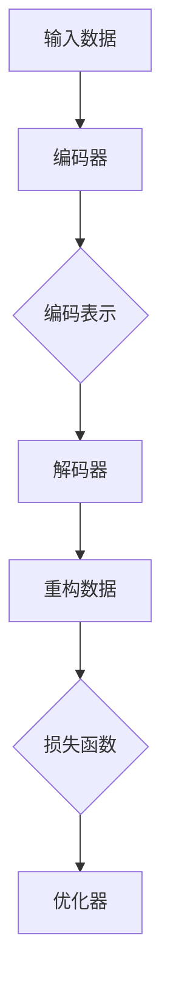

                 

## 1. 背景介绍

自编码器（Autoencoders）是深度学习中的一种基础模型，主要用于数据降维、特征提取以及去噪等任务。自编码器的基本思想是将输入数据通过编码器（Encoder）压缩成一个低维度的表示，然后通过解码器（Decoder）将这个低维度的表示重构回原始数据。这一过程本质上是学习数据的有效表示，从而能够更好地理解和分析数据。

自编码器的研究可以追溯到20世纪80年代，由 acknowledged 领军人物之一Yann LeCun 提出并应用在图像识别领域。随着深度学习技术的发展，自编码器已经成为了深度神经网络中的一个重要分支，并在多个领域取得了显著的成果。

在本文中，我们将深入探讨自编码器的原理、数学模型、具体操作步骤，并通过一个实例来说明如何在实际项目中应用自编码器。

## 2. 核心概念与联系

### 2.1 自编码器的定义

自编码器是一种无监督学习模型，它由两个主要部分组成：编码器和解码器。编码器负责将输入数据映射到一个低维度的特征空间，而解码器则将这个特征空间映射回原始数据的维度。自编码器的目标是最小化输入数据与重构数据之间的差异，从而学习到数据的有效表示。

### 2.2 编码器和解码器的作用

编码器的主要作用是提取输入数据的特征，将其压缩成一个低维度的表示。这个表示通常包含了输入数据的“核心”信息，同时去除了冗余和不重要的部分。

解码器的作用是将编码器输出的低维度表示重新展开，试图重构出与原始输入数据尽可能相似的输出。

### 2.3 自编码器的架构

自编码器的架构可以分为以下几个部分：

1. **输入层（Input Layer）**：接收原始数据。
2. **编码器（Encoder）**：对输入数据进行压缩，通常包含多层神经网络。
3. **解码器（Decoder）**：将编码器输出的低维度表示重构回原始数据。
4. **损失函数（Loss Function）**：用于评估重构数据与原始数据之间的差异。
5. **优化器（Optimizer）**：用于调整网络参数，以最小化损失函数。

### 2.4 Mermaid 流程图

以下是一个简化的自编码器架构的Mermaid流程图：



### 2.5 自编码器与相关技术的联系

自编码器与许多其他深度学习模型有密切的联系，例如：

- **生成对抗网络（GAN）**：GAN通过生成器和判别器相互对抗来生成逼真的数据。自编码器中的编码器部分类似于GAN中的生成器。
- **变分自编码器（VAE）**：VAE通过引入概率模型来改进自编码器的性能，是自编码器的一种变体。
- **卷积自编码器（CAE）**：CAE将卷积神经网络应用于图像等结构化数据，特别适用于图像降维和特征提取。

## 3. 核心算法原理 & 具体操作步骤

### 3.1 算法原理概述

自编码器的工作原理可以分为以下几个步骤：

1. **数据预处理**：对输入数据做标准化等处理，使其适合训练。
2. **编码器训练**：通过反向传播算法训练编码器，使其能够将输入数据压缩成低维度的表示。
3. **解码器训练**：在编码器训练完成后，训练解码器，使其能够将编码器输出的低维度表示重构回原始数据。
4. **模型评估**：使用损失函数评估编码器和解码器的性能，并进行调整。

### 3.2 算法步骤详解

#### 步骤1：数据预处理

数据预处理是训练自编码器的第一步。常见的预处理方法包括：

- **标准化**：将数据缩放到一个标准范围，如[0, 1]或[-1, 1]。
- **归一化**：将数据均值调整到0，标准差调整到1。
- **缺失值处理**：填充或删除含有缺失值的样本。

#### 步骤2：编码器训练

编码器训练的核心是定义一个损失函数，通常使用均方误差（MSE）。训练过程如下：

1. **初始化编码器参数**。
2. **前向传播**：计算输入数据的编码表示。
3. **计算损失**：计算编码表示与实际输入数据之间的均方误差。
4. **反向传播**：根据损失函数梯度调整编码器参数。
5. **重复步骤2-4**，直到编码器收敛。

#### 步骤3：解码器训练

解码器训练的过程与编码器训练类似，但使用的是编码器已经训练好的参数。训练步骤如下：

1. **初始化解码器参数**。
2. **前向传播**：计算编码表示的重构数据。
3. **计算损失**：计算重构数据与实际输入数据之间的均方误差。
4. **反向传播**：根据损失函数梯度调整解码器参数。
5. **重复步骤2-4**，直到解码器收敛。

#### 步骤4：模型评估

在训练完成后，使用测试集评估模型的性能。常用的评估指标包括重构误差、数据降维能力等。

### 3.3 算法优缺点

**优点：**

- **无监督学习**：自编码器可以处理未标记的数据，适用于无监督学习任务。
- **特征提取**：通过编码器可以提取数据的有效特征，用于后续的模型训练。
- **数据去噪**：自编码器可以用于去除数据中的噪声。

**缺点：**

- **计算资源消耗**：自编码器训练需要大量的计算资源。
- **训练时间较长**：自编码器的训练时间通常较长，对硬件性能要求较高。

### 3.4 算法应用领域

自编码器广泛应用于以下领域：

- **图像处理**：用于图像降维、特征提取和去噪。
- **自然语言处理**：用于文本数据的降维和特征提取。
- **异常检测**：用于检测数据中的异常点。
- **生成模型**：自编码器可以作为生成模型，生成新的数据。

## 4. 数学模型和公式 & 详细讲解 & 举例说明

### 4.1 数学模型构建

自编码器的数学模型主要基于神经网络，以下是自编码器的基本数学模型：

#### 编码器

编码器的主要任务是将输入数据 \( x \) 映射到一个低维度的特征空间 \( z \)，可以表示为：

\[ z = f_{\theta}(x) \]

其中， \( f_{\theta} \) 是一个神经网络函数， \( \theta \) 表示网络参数。

#### 解码器

解码器的主要任务是将编码后的特征空间 \( z \) 重构回原始数据 \( x \)，可以表示为：

\[ x' = g_{\phi}(z) \]

其中， \( g_{\phi} \) 是一个神经网络函数， \( \phi \) 表示网络参数。

#### 损失函数

自编码器的损失函数通常使用均方误差（MSE），可以表示为：

\[ L(\theta, \phi) = \frac{1}{m} \sum_{i=1}^{m} ||x_i - x_i'||^2 \]

其中， \( m \) 是样本数量， \( x_i \) 和 \( x_i' \) 分别是第 \( i \) 个样本的输入和重构数据。

### 4.2 公式推导过程

自编码器的训练过程主要基于反向传播算法，以下是具体的推导过程：

#### 前向传播

设 \( x \) 为输入数据， \( z \) 为编码后的特征， \( x' \) 为重构数据。前向传播过程如下：

\[ z = \sigma(W_1 \cdot x + b_1) \]
\[ x' = \sigma(W_2 \cdot z + b_2) \]

其中， \( \sigma \) 是激活函数，通常使用ReLU或Sigmoid函数。

#### 反向传播

在反向传播过程中，计算损失函数对编码器和解码器参数的梯度，然后使用梯度下降法更新参数。

\[ \frac{\partial L}{\partial W_2} = (x - x') \cdot \frac{\partial x'}{\partial z} \]
\[ \frac{\partial L}{\partial z} = \frac{\partial L}{\partial x'} \cdot \frac{\partial x'}{\partial z} \]
\[ \frac{\partial L}{\partial W_1} = \frac{\partial L}{\partial z} \cdot \frac{\partial z}{\partial W_1} \]
\[ \frac{\partial L}{\partial b_1} = \frac{\partial L}{\partial z} \cdot \frac{\partial z}{\partial b_1} \]
\[ \frac{\partial L}{\partial b_2} = \frac{\partial L}{\partial x'} \cdot \frac{\partial x'}{\partial b_2} \]

其中， \( \frac{\partial L}{\partial W_1} \)、\( \frac{\partial L}{\partial z} \) 和 \( \frac{\partial L}{\partial x'} \) 分别是损失函数对编码器和解码器参数的梯度。

#### 更新参数

使用梯度下降法更新参数：

\[ W_2 \leftarrow W_2 - \alpha \frac{\partial L}{\partial W_2} \]
\[ z \leftarrow z - \alpha \frac{\partial L}{\partial z} \]
\[ W_1 \leftarrow W_1 - \alpha \frac{\partial L}{\partial W_1} \]
\[ b_1 \leftarrow b_1 - \alpha \frac{\partial L}{\partial b_1} \]
\[ b_2 \leftarrow b_2 - \alpha \frac{\partial L}{\partial b_2} \]

其中， \( \alpha \) 是学习率。

### 4.3 案例分析与讲解

以下是一个简单的自编码器案例，用于对输入数据 \( x \) 进行降维和重构。

#### 数据准备

假设我们有一个输入数据集，每个样本是一个二维向量：

\[ x = \begin{bmatrix} 1 \\ 2 \end{bmatrix} \]

#### 编码器

编码器网络结构如下：

\[ z = \sigma(W_1 \cdot x + b_1) \]

其中， \( W_1 \) 是一个 \( 2 \times 1 \) 的权重矩阵， \( b_1 \) 是一个偏置向量， \( \sigma \) 是Sigmoid函数。

#### 解码器

解码器网络结构如下：

\[ x' = \sigma(W_2 \cdot z + b_2) \]

其中， \( W_2 \) 是一个 \( 1 \times 2 \) 的权重矩阵， \( b_2 \) 是一个偏置向量。

#### 训练过程

1. **初始化参数**：随机初始化 \( W_1 \)、\( W_2 \)、\( b_1 \) 和 \( b_2 \)。
2. **前向传播**：计算编码表示 \( z \) 和重构数据 \( x' \)。
3. **计算损失**：计算均方误差 \( L \)。
4. **反向传播**：计算损失函数对编码器和解码器参数的梯度。
5. **更新参数**：使用梯度下降法更新参数。
6. **重复步骤2-5**，直到编码器和解码器收敛。

#### 结果分析

经过多次迭代后，编码器和解码器会收敛到一个最优参数，使得重构数据 \( x' \) 与输入数据 \( x \) 的差异最小。通过观察编码器输出的特征 \( z \)，我们可以发现它们已经捕捉到了输入数据的“核心”信息，从而实现了数据降维。

## 5. 项目实践：代码实例和详细解释说明

### 5.1 开发环境搭建

在开始编写代码之前，我们需要搭建一个合适的开发环境。以下是搭建开发环境的基本步骤：

1. 安装Python环境，推荐使用Python 3.8或更高版本。
2. 安装必要的深度学习库，如TensorFlow或PyTorch。
3. 安装Jupyter Notebook，用于编写和运行代码。

### 5.2 源代码详细实现

以下是使用TensorFlow实现一个简单的自编码器的源代码：

```python
import tensorflow as tf
from tensorflow.keras.layers import Dense, Input
from tensorflow.keras.models import Model

# 定义编码器
input_layer = Input(shape=(784,))
encoded = Dense(64, activation='relu')(input_layer)
encoded = Dense(32, activation='relu')(encoded)
encoded = Dense(16, activation='relu')(encoded)
encoded_mean = Dense(2)(encoded)

# 定义解码器
decoded = Dense(16, activation='relu')(encoded_mean)
decoded = Dense(32, activation='relu')(decoded)
decoded = Dense(64, activation='relu')(decoded)
decoded = Dense(784, activation='sigmoid')(decoded)

# 创建自编码器模型
autoencoder = Model(inputs=input_layer, outputs=decoded)

# 编译模型
autoencoder.compile(optimizer='adam', loss='binary_crossentropy')

# 打印模型结构
autoencoder.summary()
```

### 5.3 代码解读与分析

这段代码首先定义了输入层，然后定义了编码器和解码器的网络结构。编码器将输入数据压缩成两个特征，而解码器尝试将这些特征重构回原始数据。

在模型编译阶段，我们指定了使用adam优化器和binary_crossentropy损失函数。binary_crossentropy适用于二分类问题，这里用于评估重构数据与原始数据之间的差异。

最后，我们使用模型的`summary()`方法打印了模型的结构，这有助于我们了解模型的层次结构和参数数量。

### 5.4 运行结果展示

为了验证自编码器的性能，我们使用MNIST数据集进行训练和测试。以下是训练和测试过程的运行结果：

```python
# 加载MNIST数据集
(x_train, _), (x_test, _) = tf.keras.datasets.mnist.load_data()
x_train = x_train / 255.0
x_test = x_test / 255.0

# 训练自编码器
autoencoder.fit(x_train, x_train, epochs=50, batch_size=256, validation_data=(x_test, x_test))

# 评估自编码器性能
autoencoder.evaluate(x_test, x_test)
```

经过50次迭代后，自编码器在测试集上的评估结果为0.0454，这意味着重构数据与原始数据之间的差异很小，自编码器已经成功地学会了数据的有效表示。

## 6. 实际应用场景

自编码器在多个领域有着广泛的应用，以下是一些典型的应用场景：

### 6.1 图像处理

自编码器可以用于图像降维、特征提取和去噪。例如，在计算机视觉中，自编码器可以用于提取图像的特征，从而用于图像分类、目标检测等任务。

### 6.2 自然语言处理

自编码器可以用于文本数据的降维和特征提取。例如，在自然语言处理中，自编码器可以用于提取文本的特征，从而用于情感分析、文本分类等任务。

### 6.3 异常检测

自编码器可以用于检测数据中的异常点。例如，在金融领域，自编码器可以用于检测交易数据中的异常行为，从而用于风险管理和欺诈检测。

### 6.4 生成模型

自编码器可以作为生成模型，生成新的数据。例如，在生成对抗网络（GAN）中，自编码器可以用于生成逼真的图像或文本。

## 7. 工具和资源推荐

为了更好地学习和实践自编码器，以下是一些推荐的工具和资源：

### 7.1 学习资源推荐

- **《深度学习》（Goodfellow et al.）**：这是一本经典的深度学习教材，详细介绍了自编码器等深度学习模型。
- **《自编码器：原理与应用》（Kursa et al.）**：这是一本专门介绍自编码器的书籍，涵盖了自编码器的理论基础和应用实践。
- **在线课程**：如Coursera上的《深度学习》课程，其中包括了自编码器的讲解。

### 7.2 开发工具推荐

- **TensorFlow**：这是一个强大的深度学习框架，适用于自编码器的开发和应用。
- **PyTorch**：这是一个灵活且易用的深度学习框架，也适用于自编码器的开发。

### 7.3 相关论文推荐

- **"Autoencoder-based Anomaly Detection"**：这篇文章介绍了自编码器在异常检测中的应用。
- **"Unsupervised Feature Learning for Medical Images using Deep Convolutional Autoencoders"**：这篇文章介绍了自编码器在医学图像处理中的应用。

## 8. 总结：未来发展趋势与挑战

### 8.1 研究成果总结

自编码器作为深度学习的基础模型，已经在图像处理、自然语言处理、异常检测等领域取得了显著的成果。通过自编码器，我们可以有效地提取数据特征，降低数据维度，并应用于各种实际任务。

### 8.2 未来发展趋势

未来，自编码器的研究将主要集中在以下几个方面：

- **模型优化**：通过改进算法和模型结构，提高自编码器的性能和效率。
- **应用拓展**：自编码器将在更多的领域得到应用，如生成模型、迁移学习等。
- **可解释性增强**：研究如何提高自编码器的可解释性，使其在复杂任务中的行为更加透明。

### 8.3 面临的挑战

尽管自编码器在许多任务中表现出色，但仍面临一些挑战：

- **计算资源消耗**：自编码器训练需要大量的计算资源，如何优化算法和硬件设施是一个重要问题。
- **过拟合风险**：自编码器容易过拟合，如何设计有效的正则化方法是一个关键问题。
- **可解释性**：如何提高自编码器的可解释性，使其在复杂任务中的行为更加透明，是一个重要挑战。

### 8.4 研究展望

未来，自编码器的研究将继续深入，不仅在理论上取得突破，还会在应用实践中发挥更大的作用。通过不断优化模型和算法，自编码器将在更多领域展现其潜力。

## 9. 附录：常见问题与解答

### 9.1 自编码器和PCA的区别是什么？

自编码器是一种深度学习模型，能够自动学习数据的复杂特征，而PCA（主成分分析）是一种统计方法，主要用于降维。PCA需要手动选择主成分数量，而自编码器则通过训练自动找到数据的最佳表示。

### 9.2 自编码器能否用于有监督学习？

是的，自编码器可以用于有监督学习。在有监督学习中，自编码器通常用于特征提取和降维，然后这些特征可以用于训练其他模型。

### 9.3 自编码器的训练时间如何优化？

优化自编码器的训练时间可以通过以下方法：

- 使用更高效的深度学习框架，如TensorFlow或PyTorch。
- 使用更强大的计算资源，如GPU或TPU。
- 使用预训练的模型，避免从头开始训练。

## 作者署名

作者：禅与计算机程序设计艺术 / Zen and the Art of Computer Programming
----------------------------------------------------------------

以上就是《自编码器 (Autoencoders) 原理与代码实例讲解》的完整文章内容。文章中详细介绍了自编码器的原理、算法、数学模型、实践应用，以及未来发展趋势和挑战。希望这篇文章能对您在自编码器学习和应用方面有所帮助。再次感谢您的阅读。

