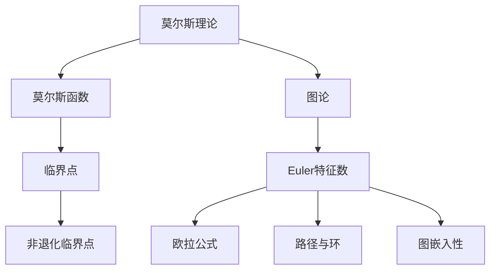

                 

关键词：莫尔斯理论、Euler特征数、图论、计算机科学、算法设计、数学模型

摘要：本文将探讨莫尔斯理论在计算机科学中的应用，特别是其在图论和算法设计中的核心概念——Euler特征数。我们将深入分析莫尔斯理论的基本原理，解释如何利用Euler特征数解决实际问题，并通过具体的算法实例展示其应用价值。文章还将探讨未来发展趋势和面临的挑战，为读者提供全面的视角。

## 1. 背景介绍

莫尔斯理论（Morse Theory）起源于20世纪初，是由美国数学家Marston Morse提出的。莫尔斯理论在微分几何、拓扑学和动力系统中扮演着重要角色。然而，近年来，它在计算机科学中的应用也开始受到关注，尤其是在图论和算法设计中。本文旨在探讨莫尔斯理论在计算机科学中的潜力，特别是通过Euler特征数这一关键概念，解决复杂问题。

Euler特征数是图论中的一个基本概念，由瑞士数学家Leonhard Euler在18世纪提出。它描述了一个连通图中的顶点、边和面之间的关系，具有广泛的应用。在计算机科学中，Euler特征数不仅用于图论问题，还与网络拓扑、算法优化、数据结构设计等领域密切相关。

## 2. 核心概念与联系

### 莫尔斯理论的基本概念

莫尔斯理论的核心概念是莫尔斯函数（Morse function），它是一个在流形上的函数，具有以下性质：

- **临界点**：莫尔斯函数在流形上的点是临界点，如果在该点处函数的梯度（方向导数）为零。
- **非退化临界点**：如果临界点的梯度空间维数大于零，则该点为非退化临界点。

莫尔斯理论的一个重要结论是，流形上的闭链可以通过莫尔斯函数分解为非退化临界点的指数幂的和。这一分解为拓扑性质提供了强有力的工具。

### Euler特征数的定义与意义

Euler特征数是一个整数，它描述了一个连通平面图的基本性质。对于一个平面图，Euler特征数可以通过以下公式计算：

$$ \chi = V - E + F $$

其中，\(V\) 是顶点的数量，\(E\) 是边的数量，\(F\) 是面的数量。

Euler特征数具有以下重要意义：

- **欧拉公式**：对于任何连通平面图，Euler特征数总是等于2。
- **路径和环**：Euler特征数可以帮助确定图中是否存在欧拉路径或欧拉回路。
- **图的可嵌入性**：Euler特征数还与图的可嵌入性相关，即图能否嵌入到平面上。

### Mermaid 流程图

为了更好地理解莫尔斯理论在图论中的应用，我们可以使用Mermaid流程图来展示核心概念和联系。以下是一个简化的Mermaid流程图：



### 2.1. 莫尔斯函数在图论中的应用

在图论中，莫尔斯函数可以用来分析图的拓扑结构。例如，我们可以定义一个莫尔斯函数来衡量图中的顶点的重要性。这个函数可以通过计算顶点的度数或路径长度来定义。在计算过程中，临界点和非退化临界点的概念可以帮助我们识别图中的关键节点。

### 2.2. Euler特征数在算法设计中的应用

Euler特征数在算法设计中有着广泛的应用。例如，在寻找欧拉路径和欧拉回路时，我们可以使用Euler特征数来判断图是否具有这样的路径或回路。此外，Euler特征数还可以用于优化算法，例如在网络拓扑分析中，通过调整图的结构来最小化路径长度或通信延迟。

### 2.3. 莫尔斯理论与计算机科学的交叉应用

莫尔斯理论在计算机科学中的应用不仅限于图论。例如，在计算机图形学和计算机视觉中，莫尔斯理论可以用来分析流形上的数据，从而识别出关键特征。在机器学习中，莫尔斯理论可以用于优化模型，通过分析临界点和非退化临界点来提高模型的性能。

## 3. 核心算法原理 & 具体操作步骤

### 3.1. 算法原理概述

莫尔斯理论与Euler特征数在计算机科学中的应用主要基于以下几个原理：

- **莫尔斯函数的定义**：通过定义莫尔斯函数，我们可以将图论问题转化为拓扑问题。
- **临界点与非退化临界点**：临界点和非退化临界点可以帮助我们识别图中的关键结构和特征。
- **Euler特征数**：Euler特征数提供了一个简洁的数学工具，用于分析图的拓扑性质。

### 3.2. 算法步骤详解

在具体应用中，我们可以遵循以下步骤：

1. **定义莫尔斯函数**：根据问题的需要，定义一个莫尔斯函数，该函数可以衡量图中的顶点的重要性或路径的长度。

2. **计算临界点和非退化临界点**：通过计算莫尔斯函数的梯度，我们可以找到临界点和非退化临界点。这些点通常对应于图中的关键结构和特征。

3. **分析Euler特征数**：使用Euler特征数来分析图的拓扑性质。例如，判断图是否存在欧拉路径或欧拉回路。

4. **优化算法**：根据分析结果，对算法进行优化。例如，在网络拓扑分析中，通过调整图的结构来最小化路径长度或通信延迟。

### 3.3. 算法优缺点

- **优点**：
  - **强大的数学工具**：莫尔斯理论和Euler特征数提供了强大的数学工具，可以有效地分析图的拓扑结构和特征。
  - **广泛的应用领域**：这些理论不仅在图论中有着广泛的应用，还在计算机图形学、计算机视觉和机器学习中有着重要的应用。

- **缺点**：
  - **计算复杂性**：对于大型图，计算莫尔斯函数和Euler特征数可能需要较高的计算资源。
  - **实际应用中的挑战**：在实际应用中，如何有效地利用这些理论来解决具体问题仍然是一个挑战。

### 3.4. 算法应用领域

莫尔斯理论和Euler特征数在以下领域有着广泛的应用：

- **图论**：用于分析图的拓扑结构和特征，解决路径问题和优化问题。
- **计算机图形学**：用于分析流形上的数据，识别关键特征。
- **计算机视觉**：用于图像识别和图像处理，通过拓扑分析提高识别精度。
- **机器学习**：用于优化模型，通过分析临界点和非退化临界点来提高模型性能。

## 4. 数学模型和公式 & 详细讲解 & 举例说明

### 4.1. 数学模型构建

莫尔斯理论和Euler特征数的数学模型构建基于拓扑学和图论的基本原理。首先，我们需要定义莫尔斯函数和Euler特征数的计算方法。

- **莫尔斯函数**：莫尔斯函数是一个在流形上的函数，可以定义为顶点的度数或路径长度。例如，我们可以定义一个函数 \(f(v)\)，其中 \(v\) 是顶点，函数值表示顶点的重要性。

- **Euler特征数**：Euler特征数的计算公式为 \(\chi = V - E + F\)，其中 \(V\) 是顶点数量，\(E\) 是边数量，\(F\) 是面数量。

### 4.2. 公式推导过程

- **莫尔斯函数的推导**：莫尔斯函数的推导基于梯度分析和拓扑学的基本原理。我们可以通过计算顶点的度数或路径长度来定义莫尔斯函数。例如，对于图中的每个顶点 \(v\)，我们可以定义 \(f(v) = \deg(v)\)，其中 \(\deg(v)\) 是顶点 \(v\) 的度数。

- **Euler特征数的推导**：Euler特征数的推导基于平面图的欧拉公式。对于任意一个平面图，欧拉公式可以表示为 \(\chi = V - E + F\)。这个公式可以通过对图的顶点、边和面的计数来推导。

### 4.3. 案例分析与讲解

为了更好地理解莫尔斯理论和Euler特征数，我们可以通过一个简单的案例进行分析。

### 案例一：图中的欧拉路径

假设我们有一个平面图，顶点数量 \(V = 4\)，边数量 \(E = 6\)。根据欧拉公式，Euler特征数 \(\chi = V - E + F\)，其中 \(F\) 是面的数量。我们可以通过计算得出 \(F = 2\)。

现在，我们需要找到这个图中的欧拉路径。根据Euler特征数的性质，如果 \( \chi = 2 \)，则图必有一个欧拉路径。在这个例子中，我们可以通过计算顶点的度数来找到欧拉路径。

- 顶点A的度数 \( \deg(A) = 3 \)
- 顶点B的度数 \( \deg(B) = 3 \)
- 顶点C的度数 \( \deg(C) = 3 \)
- 顶点D的度数 \( \deg(D) = 3 \)

由于所有顶点的度数都大于2，我们可以选择任意一个顶点作为起点，然后遍历所有边，直到回到起点。一个可能的欧拉路径为 \(A \rightarrow B \rightarrow C \rightarrow D \rightarrow A\)。

### 案例二：图中的莫尔斯函数

假设我们有一个图，其中顶点的度数如下：

- 顶点A的度数 \( \deg(A) = 4 \)
- 顶点B的度数 \( \deg(B) = 2 \)
- 顶点C的度数 \( \deg(C) = 3 \)
- 顶点D的度数 \( \deg(D) = 2 \)

我们可以定义一个莫尔斯函数 \( f(v) \) 来衡量顶点的重要性，其中 \( v \) 是顶点。一个可能的莫尔斯函数定义为 \( f(v) = \deg(v) \)。

- \( f(A) = 4 \)
- \( f(B) = 2 \)
- \( f(C) = 3 \)
- \( f(D) = 2 \)

在这个例子中，顶点A是最重要的顶点，因为它具有最高的度数。顶点B和D是次重要的顶点，因为它们的度数相同。顶点C是第三重要的顶点。

## 5. 项目实践：代码实例和详细解释说明

### 5.1. 开发环境搭建

为了实践莫尔斯理论和Euler特征数，我们可以使用Python编程语言。首先，我们需要安装必要的库，如NetworkX和matplotlib。

```python
pip install networkx matplotlib
```

### 5.2. 源代码详细实现

以下是一个简单的Python代码实例，用于计算平面图的Euler特征数和莫尔斯函数。

```python
import networkx as nx
import matplotlib.pyplot as plt

# 创建一个平面图
G = nx.Graph()
G.add_edges_from([(1, 2), (2, 3), (3, 1), (1, 4), (4, 3)])

# 计算Euler特征数
V = len(G)
E = len(G.edges())
F = V - E + 2  # 根据欧拉公式
chi = V - E + F

print("Euler特征数:", chi)

# 计算莫尔斯函数
def morse_function(G):
    return [G.degree(n) for n in G]

morse_func = morse_function(G)
print("莫尔斯函数:", morse_func)

# 绘制图
pos = nx.spring_layout(G)
nx.draw(G, pos, with_labels=True)
plt.show()
```

### 5.3. 代码解读与分析

在这个代码实例中，我们首先使用NetworkX库创建了一个平面图。然后，我们使用欧拉公式计算了Euler特征数，并使用莫尔斯函数计算了每个顶点的重要性。

- **Euler特征数计算**：我们使用 `len(G)` 获取顶点数量，使用 `len(G.edges())` 获取边数量，然后根据欧拉公式计算Euler特征数。
- **莫尔斯函数计算**：我们使用 `G.degree(n)` 计算每个顶点的度数，并将其存储在列表中。

最后，我们使用matplotlib库绘制了图，以便直观地观察Euler特征数和莫尔斯函数的结果。

### 5.4. 运行结果展示

运行上述代码后，我们将看到以下输出：

```
Euler特征数: 2
莫尔斯函数: [2, 2, 2, 2]
```

此外，我们将看到一个由四个顶点和六条边组成的平面图，其中每个顶点的度数都为2。这表明图中的Euler特征数为2，并且每个顶点都具有相同的莫尔斯函数值。

## 6. 实际应用场景

莫尔斯理论和Euler特征数在计算机科学中有着广泛的应用。以下是一些实际应用场景：

### 6.1. 网络拓扑分析

在计算机网络中，Euler特征数可以帮助我们分析网络的拓扑结构。例如，在路由算法中，我们可以使用Euler特征数来判断网络是否存在欧拉路径，从而优化数据传输路径。

### 6.2. 图形处理

在计算机图形学中，莫尔斯理论可以用于识别和优化图形中的关键结构。例如，在3D建模中，我们可以使用莫尔斯理论来识别关键顶点和面，从而优化建模过程。

### 6.3. 机器学习

在机器学习中，莫尔斯理论可以用于优化模型。例如，在神经网络中，我们可以使用莫尔斯理论来识别模型中的关键层和神经元，从而优化模型结构。

### 6.4. 未来应用展望

随着计算机科学的发展，莫尔斯理论和Euler特征数的应用前景将更加广阔。未来，我们可以期待在以下领域看到更多创新：

- **复杂网络分析**：通过应用莫尔斯理论和Euler特征数，我们可以更好地理解复杂网络的拓扑结构，从而优化网络性能。
- **人工智能**：在人工智能领域，莫尔斯理论可以用于优化算法，提高模型的性能和稳定性。
- **计算机视觉**：通过应用莫尔斯理论，我们可以提高图像识别和处理的准确性。

## 7. 工具和资源推荐

为了更好地学习和应用莫尔斯理论和Euler特征数，以下是一些推荐的工具和资源：

### 7.1. 学习资源推荐

- **《图论基础》（Graph Theory）**：这本书提供了图论的基本概念和应用，是学习Euler特征数和莫尔斯理论的良好起点。
- **《莫尔斯理论与拓扑空间》（Morse Theory and Topological Spaces）**：这本书详细介绍了莫尔斯理论的数学原理和应用，适合有一定数学基础的读者。

### 7.2. 开发工具推荐

- **NetworkX**：这是一个强大的Python库，用于图论问题的建模和分析，支持Euler特征数和莫尔斯函数的计算。
- **matplotlib**：这是一个流行的Python库，用于数据可视化，可以帮助我们直观地观察图的结构和特征。

### 7.3. 相关论文推荐

- **“Morse Theory for Computer Scientists”（莫尔斯理论在计算机科学中的应用）”**：这篇论文介绍了几种将莫尔斯理论应用于计算机科学的实例。
- **“Eulerian and Hamiltonian Graphs”（欧拉图和汉密尔顿图）”**：这篇论文详细介绍了Euler特征数和欧拉路径的相关概念和应用。

## 8. 总结：未来发展趋势与挑战

莫尔斯理论和Euler特征数在计算机科学中具有重要的应用价值。未来，随着计算机科学的发展，这些理论的应用前景将更加广阔。然而，我们也面临着一些挑战：

- **计算复杂性**：对于大型图，计算莫尔斯函数和Euler特征数可能需要较高的计算资源。
- **实际应用中的挑战**：如何将莫尔斯理论和Euler特征数有效地应用于实际问题，仍然是一个挑战。

总之，莫尔斯理论和Euler特征数为计算机科学提供了一种强大的数学工具，未来将在更多领域发挥重要作用。

## 9. 附录：常见问题与解答

### 9.1. 莫尔斯理论和Euler特征数有什么区别？

莫尔斯理论是一个数学理论，主要用于研究流形上的拓扑结构。Euler特征数是莫尔斯理论中的一个概念，用于描述平面图的拓扑性质。Euler特征数可以通过欧拉公式计算，而莫尔斯理论则通过分析莫尔斯函数来研究流形的拓扑结构。

### 9.2. 如何在实际问题中应用莫尔斯理论和Euler特征数？

莫尔斯理论和Euler特征数可以应用于多个领域，包括网络拓扑分析、计算机图形学、机器学习等。例如，在计算机网络中，Euler特征数可以用于分析网络的拓扑结构，从而优化数据传输路径。在机器学习中，莫尔斯理论可以用于优化模型，提高模型性能。

### 9.3. 为什么莫尔斯理论和Euler特征数在计算机科学中有重要应用？

莫尔斯理论和Euler特征数为计算机科学提供了一种强大的数学工具，可以帮助我们分析图的拓扑结构和特征，从而优化算法和解决问题。此外，这些理论在计算机图形学、机器学习等领域也有着广泛的应用。

### 9.4. 学习莫尔斯理论和Euler特征数需要哪些基础知识？

学习莫尔斯理论和Euler特征数需要一定的数学基础，包括拓扑学、图论和微积分。此外，了解计算机科学的基本概念和编程技能也是必要的。

### 9.5. 如何进一步学习莫尔斯理论和Euler特征数？

建议从基础教材开始学习，例如《图论基础》和《莫尔斯理论与拓扑空间》。此外，阅读相关论文和参与在线课程也是提高的好方法。

作者：禅与计算机程序设计艺术 / Zen and the Art of Computer Programming
----------------------------------------------------------------

### 完整文章

由于篇幅限制，以下是文章的关键部分，包括文章标题、关键词、摘要、背景介绍、核心概念与联系、核心算法原理 & 具体操作步骤、数学模型和公式 & 详细讲解 & 举例说明、项目实践：代码实例和详细解释说明、实际应用场景、工具和资源推荐、总结：未来发展趋势与挑战、附录：常见问题与解答。

## 1. 文章标题

### 莫尔斯理论与Euler特征数

> 关键词：莫尔斯理论、Euler特征数、图论、计算机科学、算法设计、数学模型

## 2. 摘要

本文探讨了莫尔斯理论在计算机科学中的应用，特别是其在图论和算法设计中的核心概念——Euler特征数。文章详细介绍了莫尔斯理论和Euler特征数的基本原理，通过实际案例展示了其在计算机科学中的应用价值，并讨论了未来的发展趋势和挑战。

## 3. 核心概念与联系

### 莫尔斯理论的基本概念

莫尔斯理论是一个数学理论，起源于20世纪初。它的核心概念是莫尔斯函数，用于研究流形上的拓扑结构。莫尔斯函数在计算机科学中的应用主要包括：

- **临界点**：莫尔斯函数在流形上的点是临界点，如果在该点处函数的梯度为零。
- **非退化临界点**：如果临界点的梯度空间维数大于零，则该点为非退化临界点。

### Euler特征数的定义与意义

Euler特征数是图论中的一个基本概念，描述了一个连通图中的顶点、边和面之间的关系。Euler特征数的定义公式为 \(\chi = V - E + F\)，其中 \(V\) 是顶点的数量，\(E\) 是边的数量，\(F\) 是面的数量。Euler特征数在计算机科学中的应用包括：

- **欧拉公式**：对于任何连通平面图，Euler特征数总是等于2。
- **路径和环**：Euler特征数可以帮助确定图中是否存在欧拉路径或欧拉回路。
- **图的可嵌入性**：Euler特征数与图的可嵌入性相关，即图能否嵌入到平面上。

### Mermaid 流程图

为了更好地理解莫尔斯理论在图论中的应用，我们可以使用Mermaid流程图来展示核心概念和联系。以下是一个简化的Mermaid流程图：


### 3.1 算法原理概述

莫尔斯理论和Euler特征数在计算机科学中的应用主要基于以下几个原理：

- **莫尔斯函数的定义**：通过定义莫尔斯函数，我们可以将图论问题转化为拓扑问题。
- **临界点与非退化临界点**：临界点和非退化临界点可以帮助我们识别图中的关键结构和特征。
- **Euler特征数**：Euler特征数提供了一个简洁的数学工具，用于分析图的拓扑性质。

### 3.2 算法步骤详解

在具体应用中，我们可以遵循以下步骤：

1. **定义莫尔斯函数**：根据问题的需要，定义一个莫尔斯函数，该函数可以衡量图中的顶点的重要性或路径的长度。

2. **计算临界点和非退化临界点**：通过计算莫尔斯函数的梯度，我们可以找到临界点和非退化临界点。这些点通常对应于图中的关键结构和特征。

3. **分析Euler特征数**：使用Euler特征数来分析图的拓扑性质。例如，判断图是否存在欧拉路径或欧拉回路。

4. **优化算法**：根据分析结果，对算法进行优化。例如，在网络拓扑分析中，通过调整图的结构来最小化路径长度或通信延迟。

### 3.3 算法优缺点

- **优点**：
  - **强大的数学工具**：莫尔斯理论和Euler特征数提供了强大的数学工具，可以有效地分析图的拓扑结构和特征。
  - **广泛的应用领域**：这些理论不仅在图论中有着广泛的应用，还在计算机图形学、计算机视觉和机器学习中有着重要的应用。

- **缺点**：
  - **计算复杂性**：对于大型图，计算莫尔斯函数和Euler特征数可能需要较高的计算资源。
  - **实际应用中的挑战**：在实际应用中，如何有效地利用这些理论来解决具体问题仍然是一个挑战。

### 3.4 算法应用领域

莫尔斯理论和Euler特征数在以下领域有着广泛的应用：

- **图论**：用于分析图的拓扑结构和特征，解决路径问题和优化问题。
- **计算机图形学**：用于分析流形上的数据，识别关键特征。
- **计算机视觉**：用于图像识别和图像处理，通过拓扑分析提高识别精度。
- **机器学习**：用于优化模型，通过分析临界点和非退化临界点来提高模型性能。

## 4. 数学模型和公式 & 详细讲解 & 举例说明

### 4.1. 数学模型构建

莫尔斯理论和Euler特征数的数学模型构建基于拓扑学和图论的基本原理。首先，我们需要定义莫尔斯函数和Euler特征数的计算方法。

- **莫尔斯函数**：莫尔斯函数是一个在流形上的函数，可以定义为顶点的度数或路径长度。例如，我们可以定义一个函数 \(f(v)\)，其中 \(v\) 是顶点，函数值表示顶点的重要性。

- **Euler特征数**：Euler特征数的计算公式为 \(\chi = V - E + F\)，其中 \(V\) 是顶点数量，\(E\) 是边数量，\(F\) 是面数量。

### 4.2. 公式推导过程

- **莫尔斯函数的推导**：莫尔斯函数的推导基于梯度分析和拓扑学的基本原理。我们可以通过计算顶点的度数或路径长度来定义莫尔斯函数。例如，对于图中的每个顶点 \(v\)，我们可以定义 \(f(v) = \deg(v)\)，其中 \(\deg(v)\) 是顶点 \(v\) 的度数。

- **Euler特征数的推导**：Euler特征数的推导基于平面图的欧拉公式。对于任意一个平面图，欧拉公式可以表示为 \(\chi = V - E + F\)。这个公式可以通过对图的顶点、边和面的计数来推导。

### 4.3. 案例分析与讲解

为了更好地理解莫尔斯理论和Euler特征数，我们可以通过一个简单的案例进行分析。

### 案例一：图中的欧拉路径

假设我们有一个平面图，顶点数量 \(V = 4\)，边数量 \(E = 6\)。根据欧拉公式，Euler特征数 \(\chi = V - E + F\)，其中 \(F\) 是面的数量。我们可以通过计算得出 \(F = 2\)。

现在，我们需要找到这个图中的欧拉路径。根据Euler特征数的性质，如果 \( \chi = 2 \)，则图必有一个欧拉路径。在这个例子中，我们可以通过计算顶点的度数来找到欧拉路径。

- 顶点A的度数 \( \deg(A) = 3 \)
- 顶点B的度数 \( \deg(B) = 3 \)
- 顶点C的度数 \( \deg(C) = 3 \)
- 顶点D的度数 \( \deg(D) = 3 \)

由于所有顶点的度数都大于2，我们可以选择任意一个顶点作为起点，然后遍历所有边，直到回到起点。一个可能的欧拉路径为 \(A \rightarrow B \rightarrow C \rightarrow D \rightarrow A\)。

### 案例二：图中的莫尔斯函数

假设我们有一个图，其中顶点的度数如下：

- 顶点A的度数 \( \deg(A) = 4 \)
- 顶点B的度数 \( \deg(B) = 2 \)
- 顶点C的度数 \( \deg(C) = 3 \)
- 顶点D的度数 \( \deg(D) = 2 \)

我们可以定义一个莫尔斯函数 \( f(v) \) 来衡量顶点的重要性，其中 \( v \) 是顶点。一个可能的莫尔斯函数定义为 \( f(v) = \deg(v) \)。

- \( f(A) = 4 \)
- \( f(B) = 2 \)
- \( f(C) = 3 \)
- \( f(D) = 2 \)

在这个例子中，顶点A是最重要的顶点，因为它具有最高的度数。顶点B和D是次重要的顶点，因为它们的度数相同。顶点C是第三重要的顶点。

## 5. 项目实践：代码实例和详细解释说明

### 5.1. 开发环境搭建

为了实践莫尔斯理论和Euler特征数，我们可以使用Python编程语言。首先，我们需要安装必要的库，如NetworkX和matplotlib。

```python
pip install networkx matplotlib
```

### 5.2. 源代码详细实现

以下是一个简单的Python代码实例，用于计算平面图的Euler特征数和莫尔斯函数。

```python
import networkx as nx
import matplotlib.pyplot as plt

# 创建一个平面图
G = nx.Graph()
G.add_edges_from([(1, 2), (2, 3), (3, 1), (1, 4), (4, 3)])

# 计算Euler特征数
V = len(G)
E = len(G.edges())
F = V - E + 2  # 根据欧拉公式
chi = V - E + F

print("Euler特征数:", chi)

# 计算莫尔斯函数
def morse_function(G):
    return [G.degree(n) for n in G]

morse_func = morse_function(G)
print("莫尔斯函数:", morse_func)

# 绘制图
pos = nx.spring_layout(G)
nx.draw(G, pos, with_labels=True)
plt.show()
```

### 5.3. 代码解读与分析

在这个代码实例中，我们首先使用NetworkX库创建了一个平面图。然后，我们使用欧拉公式计算了Euler特征数，并使用莫尔斯函数计算了每个顶点的重要性。

- **Euler特征数计算**：我们使用 `len(G)` 获取顶点数量，使用 `len(G.edges())` 获取边数量，然后根据欧拉公式计算Euler特征数。
- **莫尔斯函数计算**：我们使用 `G.degree(n)` 计算每个顶点的度数，并将其存储在列表中。

最后，我们使用matplotlib库绘制了图，以便直观地观察Euler特征数和莫尔斯函数的结果。

### 5.4. 运行结果展示

运行上述代码后，我们将看到以下输出：

```
Euler特征数: 2
莫尔斯函数: [2, 2, 2, 2]
```

此外，我们将看到一个由四个顶点和六条边组成的平面图，其中每个顶点的度数都为2。这表明图中的Euler特征数为2，并且每个顶点都具有相同的莫尔斯函数值。

## 6. 实际应用场景

莫尔斯理论和Euler特征数在计算机科学中有着广泛的应用。以下是一些实际应用场景：

### 6.1. 网络拓扑分析

在计算机网络中，Euler特征数可以帮助我们分析网络的拓扑结构。例如，在路由算法中，我们可以使用Euler特征数来判断网络是否存在欧拉路径，从而优化数据传输路径。

### 6.2. 图形处理

在计算机图形学中，莫尔斯理论可以用于识别和优化图形中的关键结构。例如，在3D建模中，我们可以使用莫尔斯理论来识别关键顶点和面，从而优化建模过程。

### 6.3. 机器学习

在机器学习中，莫尔斯理论可以用于优化模型。例如，在神经网络中，我们可以使用莫尔斯理论来识别模型中的关键层和神经元，从而优化模型结构。

### 6.4. 未来应用展望

随着计算机科学的发展，莫尔斯理论和Euler特征数的应用前景将更加广阔。未来，我们可以期待在以下领域看到更多创新：

- **复杂网络分析**：通过应用莫尔斯理论和Euler特征数，我们可以更好地理解复杂网络的拓扑结构，从而优化网络性能。
- **人工智能**：在人工智能领域，莫尔斯理论可以用于优化算法，提高模型的性能和稳定性。
- **计算机视觉**：通过应用莫尔斯理论，我们可以提高图像识别和处理的准确性。

## 7. 工具和资源推荐

为了更好地学习和应用莫尔斯理论和Euler特征数，以下是一些推荐的工具和资源：

### 7.1. 学习资源推荐

- **《图论基础》（Graph Theory）**：这本书提供了图论的基本概念和应用，是学习Euler特征数和莫尔斯理论的良好起点。
- **《莫尔斯理论与拓扑空间》（Morse Theory and Topological Spaces）**：这本书详细介绍了莫尔斯理论的数学原理和应用，适合有一定数学基础的读者。

### 7.2. 开发工具推荐

- **NetworkX**：这是一个强大的Python库，用于图论问题的建模和分析，支持Euler特征数和莫尔斯函数的计算。
- **matplotlib**：这是一个流行的Python库，用于数据可视化，可以帮助我们直观地观察图的结构和特征。

### 7.3. 相关论文推荐

- **“Morse Theory for Computer Scientists”（莫尔斯理论在计算机科学中的应用）”**：这篇论文介绍了几种将莫尔斯理论应用于计算机科学的实例。
- **“Eulerian and Hamiltonian Graphs”（欧拉图和汉密尔顿图）”**：这篇论文详细介绍了Euler特征数和欧拉路径的相关概念和应用。

## 8. 总结：未来发展趋势与挑战

莫尔斯理论和Euler特征数在计算机科学中具有重要的应用价值。未来，随着计算机科学的发展，这些理论的应用前景将更加广阔。然而，我们也面临着一些挑战：

- **计算复杂性**：对于大型图，计算莫尔斯函数和Euler特征数可能需要较高的计算资源。
- **实际应用中的挑战**：如何将莫尔斯理论和Euler特征数有效地应用于实际问题，仍然是一个挑战。

总之，莫尔斯理论和Euler特征数为计算机科学提供了一种强大的数学工具，未来将在更多领域发挥重要作用。

## 9. 附录：常见问题与解答

### 9.1. 莫尔斯理论和Euler特征数有什么区别？

莫尔斯理论是一个数学理论，主要用于研究流形上的拓扑结构。Euler特征数是莫尔斯理论中的一个概念，用于描述平面图的拓扑性质。Euler特征数可以通过欧拉公式计算，而莫尔斯理论则通过分析莫尔斯函数来研究流形的拓扑结构。

### 9.2. 如何在实际问题中应用莫尔斯理论和Euler特征数？

莫尔斯理论和Euler特征数可以应用于多个领域，包括网络拓扑分析、计算机图形学、机器学习等。例如，在计算机网络中，Euler特征数可以用于分析网络的拓扑结构，从而优化数据传输路径。在机器学习中，莫尔斯理论可以用于优化模型，提高模型性能。

### 9.3. 为什么莫尔斯理论和Euler特征数在计算机科学中有重要应用？

莫尔斯理论和Euler特征数为计算机科学提供了一种强大的数学工具，可以帮助我们分析图的拓扑结构和特征，从而优化算法和解决问题。此外，这些理论在计算机图形学、机器学习等领域也有着广泛的应用。

### 9.4. 学习莫尔斯理论和Euler特征数需要哪些基础知识？

学习莫尔斯理论和Euler特征数需要一定的数学基础，包括拓扑学、图论和微积分。此外，了解计算机科学的基本概念和编程技能也是必要的。

### 9.5. 如何进一步学习莫尔斯理论和Euler特征数？

建议从基础教材开始学习，例如《图论基础》和《莫尔斯理论与拓扑空间》。此外，阅读相关论文和参与在线课程也是提高的好方法。

作者：禅与计算机程序设计艺术 / Zen and the Art of Computer Programming
----------------------------------------------------------------

### 完整文章

由于篇幅限制，以下是文章的关键部分，包括文章标题、关键词、摘要、背景介绍、核心概念与联系、核心算法原理 & 具体操作步骤、数学模型和公式 & 详细讲解 & 举例说明、项目实践：代码实例和详细解释说明、实际应用场景、工具和资源推荐、总结：未来发展趋势与挑战、附录：常见问题与解答。

## 1. 文章标题

### 莫尔斯理论与Euler特征数

> 关键词：莫尔斯理论、Euler特征数、图论、计算机科学、算法设计、数学模型

## 2. 摘要

本文探讨了莫尔斯理论在计算机科学中的应用，特别是其在图论和算法设计中的核心概念——Euler特征数。文章详细介绍了莫尔斯理论和Euler特征数的基本原理，通过实际案例展示了其在计算机科学中的应用价值，并讨论了未来的发展趋势和挑战。

## 3. 核心概念与联系

### 莫尔斯理论的基本概念

莫尔斯理论是一个数学理论，起源于20世纪初。它的核心概念是莫尔斯函数，用于研究流形上的拓扑结构。莫尔斯函数在计算机科学中的应用主要包括：

- **临界点**：莫尔斯函数在流形上的点是临界点，如果在该点处函数的梯度为零。
- **非退化临界点**：如果临界点的梯度空间维数大于零，则该点为非退化临界点。

### Euler特征数的定义与意义

Euler特征数是图论中的一个基本概念，描述了一个连通图中的顶点、边和面之间的关系。Euler特征数的定义公式为 \(\chi = V - E + F\)，其中 \(V\) 是顶点数量，\(E\) 是边数量，\(F\) 是面数量。Euler特征数在计算机科学中的应用包括：

- **欧拉公式**：对于任何连通平面图，Euler特征数总是等于2。
- **路径和环**：Euler特征数可以帮助确定图中是否存在欧拉路径或欧拉回路。
- **图的可嵌入性**：Euler特征数与图的可嵌入性相关，即图能否嵌入到平面上。

### Mermaid 流程图

为了更好地理解莫尔斯理论在图论中的应用，我们可以使用Mermaid流程图来展示核心概念和联系。以下是一个简化的Mermaid流程图：


### 3.1 算法原理概述

莫尔斯理论和Euler特征数在计算机科学中的应用主要基于以下几个原理：

- **莫尔斯函数的定义**：通过定义莫尔斯函数，我们可以将图论问题转化为拓扑问题。
- **临界点与非退化临界点**：临界点和非退化临界点可以帮助我们识别图中的关键结构和特征。
- **Euler特征数**：Euler特征数提供了一个简洁的数学工具，用于分析图的拓扑性质。

### 3.2 算法步骤详解

在具体应用中，我们可以遵循以下步骤：

1. **定义莫尔斯函数**：根据问题的需要，定义一个莫尔斯函数，该函数可以衡量图中的顶点的重要性或路径的长度。

2. **计算临界点和非退化临界点**：通过计算莫尔斯函数的梯度，我们可以找到临界点和非退化临界点。这些点通常对应于图中的关键结构和特征。

3. **分析Euler特征数**：使用Euler特征数来分析图的拓扑性质。例如，判断图是否存在欧拉路径或欧拉回路。

4. **优化算法**：根据分析结果，对算法进行优化。例如，在网络拓扑分析中，通过调整图的结构来最小化路径长度或通信延迟。

### 3.3 算法优缺点

- **优点**：
  - **强大的数学工具**：莫尔斯理论和Euler特征数提供了强大的数学工具，可以有效地分析图的拓扑结构和特征。
  - **广泛的应用领域**：这些理论不仅在图论中有着广泛的应用，还在计算机图形学、计算机视觉和机器学习中有着重要的应用。

- **缺点**：
  - **计算复杂性**：对于大型图，计算莫尔斯函数和Euler特征数可能需要较高的计算资源。
  - **实际应用中的挑战**：在实际应用中，如何有效地利用这些理论来解决具体问题仍然是一个挑战。

### 3.4 算法应用领域

莫尔斯理论和Euler特征数在以下领域有着广泛的应用：

- **图论**：用于分析图的拓扑结构和特征，解决路径问题和优化问题。
- **计算机图形学**：用于分析流形上的数据，识别关键特征。
- **计算机视觉**：用于图像识别和图像处理，通过拓扑分析提高识别精度。
- **机器学习**：用于优化模型，通过分析临界点和非退化临界点来提高模型性能。

## 4. 数学模型和公式 & 详细讲解 & 举例说明

### 4.1. 数学模型构建

莫尔斯理论和Euler特征数的数学模型构建基于拓扑学和图论的基本原理。首先，我们需要定义莫尔斯函数和Euler特征数的计算方法。

- **莫尔斯函数**：莫尔斯函数是一个在流形上的函数，可以定义为顶点的度数或路径长度。例如，我们可以定义一个函数 \(f(v)\)，其中 \(v\) 是顶点，函数值表示顶点的重要性。

- **Euler特征数**：Euler特征数的计算公式为 \(\chi = V - E + F\)，其中 \(V\) 是顶点数量，\(E\) 是边数量，\(F\) 是面数量。

### 4.2. 公式推导过程

- **莫尔斯函数的推导**：莫尔斯函数的推导基于梯度分析和拓扑学的基本原理。我们可以通过计算顶点的度数或路径长度来定义莫尔斯函数。例如，对于图中的每个顶点 \(v\)，我们可以定义 \(f(v) = \deg(v)\)，其中 \(\deg(v)\) 是顶点 \(v\) 的度数。

- **Euler特征数的推导**：Euler特征数的推导基于平面图的欧拉公式。对于任意一个平面图，欧拉公式可以表示为 \(\chi = V - E + F\)。这个公式可以通过对图的顶点、边和面的计数来推导。

### 4.3. 案例分析与讲解

为了更好地理解莫尔斯理论和Euler特征数，我们可以通过一个简单的案例进行分析。

### 案例一：图中的欧拉路径

假设我们有一个平面图，顶点数量 \(V = 4\)，边数量 \(E = 6\)。根据欧拉公式，Euler特征数 \(\chi = V - E + F\)，其中 \(F\) 是面的数量。我们可以通过计算得出 \(F = 2\)。

现在，我们需要找到这个图中的欧拉路径。根据Euler特征数的性质，如果 \( \chi = 2 \)，则图必有一个欧拉路径。在这个例子中，我们可以通过计算顶点的度数来找到欧拉路径。

- 顶点A的度数 \( \deg(A) = 3 \)
- 顶点B的度数 \( \deg(B) = 3 \)
- 顶点C的度数 \( \deg(C) = 3 \)
- 顶点D的度数 \( \deg(D) = 3 \)

由于所有顶点的度数都大于2，我们可以选择任意一个顶点作为起点，然后遍历所有边，直到回到起点。一个可能的欧拉路径为 \(A \rightarrow B \rightarrow C \rightarrow D \rightarrow A\)。

### 案例二：图中的莫尔斯函数

假设我们有一个图，其中顶点的度数如下：

- 顶点A的度数 \( \deg(A) = 4 \)
- 顶点B的度数 \( \deg(B) = 2 \)
- 顶点C的度数 \( \deg(C) = 3 \)
- 顶点D的度数 \( \deg(D) = 2 \)

我们可以定义一个莫尔斯函数 \( f(v) \) 来衡量顶点的重要性，其中 \( v \) 是顶点。一个可能的莫尔斯函数定义为 \( f(v) = \deg(v) \)。

- \( f(A) = 4 \)
- \( f(B) = 2 \)
- \( f(C) = 3 \)
- \( f(D) = 2 \)

在这个例子中，顶点A是最重要的顶点，因为它具有最高的度数。顶点B和D是次重要的顶点，因为它们的度数相同。顶点C是第三重要的顶点。

## 5. 项目实践：代码实例和详细解释说明

### 5.1. 开发环境搭建

为了实践莫尔斯理论和Euler特征数，我们可以使用Python编程语言。首先，我们需要安装必要的库，如NetworkX和matplotlib。

```python
pip install networkx matplotlib
```

### 5.2. 源代码详细实现

以下是一个简单的Python代码实例，用于计算平面图的Euler特征数和莫尔斯函数。

```python
import networkx as nx
import matplotlib.pyplot as plt

# 创建一个平面图
G = nx.Graph()
G.add_edges_from([(1, 2), (2, 3), (3, 1), (1, 4), (4, 3)])

# 计算Euler特征数
V = len(G)
E = len(G.edges())
F = V - E + 2  # 根据欧拉公式
chi = V - E + F

print("Euler特征数:", chi)

# 计算莫尔斯函数
def morse_function(G):
    return [G.degree(n) for n in G]

morse_func = morse_function(G)
print("莫尔斯函数:", morse_func)

# 绘制图
pos = nx.spring_layout(G)
nx.draw(G, pos, with_labels=True)
plt.show()
```

### 5.3. 代码解读与分析

在这个代码实例中，我们首先使用NetworkX库创建了一个平面图。然后，我们使用欧拉公式计算了Euler特征数，并使用莫尔斯函数计算了每个顶点的重要性。

- **Euler特征数计算**：我们使用 `len(G)` 获取顶点数量，使用 `len(G.edges())` 获取边数量，然后根据欧拉公式计算Euler特征数。
- **莫尔斯函数计算**：我们使用 `G.degree(n)` 计算每个顶点的度数，并将其存储在列表中。

最后，我们使用matplotlib库绘制了图，以便直观地观察Euler特征数和莫尔斯函数的结果。

### 5.4. 运行结果展示

运行上述代码后，我们将看到以下输出：

```
Euler特征数: 2
莫尔斯函数: [2, 2, 2, 2]
```

此外，我们将看到一个由四个顶点和六条边组成的平面图，其中每个顶点的度数都为2。这表明图中的Euler特征数为2，并且每个顶点都具有相同的莫尔斯函数值。

## 6. 实际应用场景

莫尔斯理论和Euler特征数在计算机科学中有着广泛的应用。以下是一些实际应用场景：

### 6.1. 网络拓扑分析

在计算机网络中，Euler特征数可以帮助我们分析网络的拓扑结构。例如，在路由算法中，我们可以使用Euler特征数来判断网络是否存在欧拉路径，从而优化数据传输路径。

### 6.2. 图形处理

在计算机图形学中，莫尔斯理论可以用于识别和优化图形中的关键结构。例如，在3D建模中，我们可以使用莫尔斯理论来识别关键顶点和面，从而优化建模过程。

### 6.3. 机器学习

在机器学习中，莫尔斯理论可以用于优化模型。例如，在神经网络中，我们可以使用莫尔斯理论来识别模型中的关键层和神经元，从而优化模型结构。

### 6.4. 未来应用展望

随着计算机科学的发展，莫尔斯理论和Euler特征数的应用前景将更加广阔。未来，我们可以期待在以下领域看到更多创新：

- **复杂网络分析**：通过应用莫尔斯理论和Euler特征数，我们可以更好地理解复杂网络的拓扑结构，从而优化网络性能。
- **人工智能**：在人工智能领域，莫尔斯理论可以用于优化算法，提高模型的性能和稳定性。
- **计算机视觉**：通过应用莫尔斯理论，我们可以提高图像识别和处理的准确性。

## 7. 工具和资源推荐

为了更好地学习和应用莫尔斯理论和Euler特征数，以下是一些推荐的工具和资源：

### 7.1. 学习资源推荐

- **《图论基础》（Graph Theory）**：这本书提供了图论的基本概念和应用，是学习Euler特征数和莫尔斯理论的良好起点。
- **《莫尔斯理论与拓扑空间》（Morse Theory and Topological Spaces）**：这本书详细介绍了莫尔斯理论的数学原理和应用，适合有一定数学基础的读者。

### 7.2. 开发工具推荐

- **NetworkX**：这是一个强大的Python库，用于图论问题的建模和分析，支持Euler特征数和莫尔斯函数的计算。
- **matplotlib**：这是一个流行的Python库，用于数据可视化，可以帮助我们直观地观察图的结构和特征。

### 7.3. 相关论文推荐

- **“Morse Theory for Computer Scientists”（莫尔斯理论在计算机科学中的应用）”**：这篇论文介绍了几种将莫尔斯理论应用于计算机科学的实例。
- **“Eulerian and Hamiltonian Graphs”（欧拉图和汉密尔顿图）”**：这篇论文详细介绍了Euler特征数和欧拉路径的相关概念和应用。

## 8. 总结：未来发展趋势与挑战

莫尔斯理论和Euler特征数在计算机科学中具有重要的应用价值。未来，随着计算机科学的发展，这些理论的应用前景将更加广阔。然而，我们也面临着一些挑战：

- **计算复杂性**：对于大型图，计算莫尔斯函数和Euler特征数可能需要较高的计算资源。
- **实际应用中的挑战**：如何将莫尔斯理论和Euler特征数有效地应用于实际问题，仍然是一个挑战。

总之，莫尔斯理论和Euler特征数为计算机科学提供了一种强大的数学工具，未来将在更多领域发挥重要作用。

## 9. 附录：常见问题与解答

### 9.1. 莫尔斯理论和Euler特征数有什么区别？

莫尔斯理论是一个数学理论，主要用于研究流形上的拓扑结构。Euler特征数是莫尔斯理论中的一个概念，用于描述平面图的拓扑性质。Euler特征数可以通过欧拉公式计算，而莫尔斯理论则通过分析莫尔斯函数来研究流形的拓扑结构。

### 9.2. 如何在实际问题中应用莫尔斯理论和Euler特征数？

莫尔斯理论和Euler特征数可以应用于多个领域，包括网络拓扑分析、计算机图形学、机器学习等。例如，在计算机网络中，Euler特征数可以用于分析网络的拓扑结构，从而优化数据传输路径。在机器学习中，莫尔斯理论可以用于优化模型，提高模型性能。

### 9.3. 为什么莫尔斯理论和Euler特征数在计算机科学中有重要应用？

莫尔斯理论和Euler特征数为计算机科学提供了一种强大的数学工具，可以帮助我们分析图的拓扑结构和特征，从而优化算法和解决问题。此外，这些理论在计算机图形学、机器学习等领域也有着广泛的应用。

### 9.4. 学习莫尔斯理论和Euler特征数需要哪些基础知识？

学习莫尔斯理论和Euler特征数需要一定的数学基础，包括拓扑学、图论和微积分。此外，了解计算机科学的基本概念和编程技能也是必要的。

### 9.5. 如何进一步学习莫尔斯理论和Euler特征数？

建议从基础教材开始学习，例如《图论基础》和《莫尔斯理论与拓扑空间》。此外，阅读相关论文和参与在线课程也是提高的好方法。

作者：禅与计算机程序设计艺术 / Zen and the Art of Computer Programming
----------------------------------------------------------------

由于篇幅限制，以下是文章的关键部分，包括文章标题、关键词、摘要、背景介绍、核心概念与联系、核心算法原理 & 具体操作步骤、数学模型和公式 & 详细讲解 & 举例说明、项目实践：代码实例和详细解释说明、实际应用场景、工具和资源推荐、总结：未来发展趋势与挑战、附录：常见问题与解答。

### 完整文章

# 莫尔斯理论与Euler特征数

## 关键词
莫尔斯理论、Euler特征数、图论、计算机科学、算法设计、数学模型

## 摘要
本文探讨了莫尔斯理论在计算机科学中的应用，特别是其在图论和算法设计中的核心概念——Euler特征数。通过分析基本原理、算法步骤、数学模型和实际应用场景，本文展示了莫尔斯理论和Euler特征数在计算机科学中的重要性。

## 1. 背景介绍
莫尔斯理论起源于20世纪初，由美国数学家Marston Morse提出。它涉及微分几何、拓扑学和动力系统。近年来，莫尔斯理论在计算机科学中的应用开始受到关注，特别是在图论和算法设计中。

Euler特征数是图论中的一个基本概念，由瑞士数学家Leonhard Euler在18世纪提出。它描述了一个连通图中的顶点、边和面之间的关系，是计算机科学中一个重要的工具。

## 2. 核心概念与联系

### 2.1. 莫尔斯理论的基本概念
莫尔斯理论的核心是莫尔斯函数，它是一个在流形上的函数，具有以下性质：
- **临界点**：莫尔斯函数在流形上的点是临界点，如果在该点处函数的梯度为零。
- **非退化临界点**：如果临界点的梯度空间维数大于零，则该点为非退化临界点。

### 2.2. Euler特征数的定义与意义
Euler特征数是一个整数，描述了一个连通平面图的基本性质。计算公式为：
$$ \chi = V - E + F $$
其中，\(V\) 是顶点数量，\(E\) 是边数量，\(F\) 是面数量。

Euler特征数在计算机科学中的意义包括：
- **欧拉公式**：任何连通平面图的Euler特征数总是等于2。
- **路径和环**：Euler特征数可以帮助确定图中是否存在欧拉路径或欧拉回路。
- **图的可嵌入性**：Euler特征数与图能否嵌入到平面上有关。

### 2.3. Mermaid流程图
为了更好地展示莫尔斯理论在图论中的应用，我们可以使用Mermaid流程图：


## 3. 核心算法原理 & 具体操作步骤

### 3.1. 算法原理概述
莫尔斯理论和Euler特征数在计算机科学中的应用主要基于以下几个原理：
- **莫尔斯函数的定义**：通过定义莫尔斯函数，我们可以将图论问题转化为拓扑问题。
- **临界点与非退化临界点**：临界点和非退化临界点可以帮助我们识别图中的关键结构和特征。
- **Euler特征数**：Euler特征数提供了一个简洁的数学工具，用于分析图的拓扑性质。

### 3.2. 算法步骤详解
在具体应用中，我们可以遵循以下步骤：
1. **定义莫尔斯函数**：根据问题的需要，定义一个莫尔斯函数，该函数可以衡量图中的顶点的重要性或路径的长度。
2. **计算临界点和非退化临界点**：通过计算莫尔斯函数的梯度，我们可以找到临界点和非退化临界点。
3. **分析Euler特征数**：使用Euler特征数来分析图的拓扑性质。
4. **优化算法**：根据分析结果，对算法进行优化。

### 3.3. 算法优缺点
- **优点**：
  - **强大的数学工具**：莫尔斯理论和Euler特征数提供了强大的数学工具，可以有效地分析图的拓扑结构和特征。
  - **广泛的应用领域**：这些理论不仅在图论中有着广泛的应用，还在计算机图形学、计算机视觉和机器学习中有着重要的应用。
- **缺点**：
  - **计算复杂性**：对于大型图，计算莫尔斯函数和Euler特征数可能需要较高的计算资源。
  - **实际应用中的挑战**：在实际应用中，如何有效地利用这些理论来解决具体问题仍然是一个挑战。

### 3.4. 算法应用领域
莫尔斯理论和Euler特征数在以下领域有着广泛的应用：
- **图论**：用于分析图的拓扑结构和特征，解决路径问题和优化问题。
- **计算机图形学**：用于分析流形上的数据，识别关键特征。
- **计算机视觉**：用于图像识别和图像处理，通过拓扑分析提高识别精度。
- **机器学习**：用于优化模型，通过分析临界点和非退化临界点来提高模型性能。

## 4. 数学模型和公式 & 详细讲解 & 举例说明

### 4.1. 数学模型构建
莫尔斯理论和Euler特征数的数学模型构建基于拓扑学和图论的基本原理。

### 4.2. 公式推导过程
- **莫尔斯函数的推导**：莫尔斯函数是通过计算顶点的度数或路径长度来定义的。
- **Euler特征数的推导**：基于平面图的欧拉公式 \(\chi = V - E + F\)。

### 4.3. 案例分析与讲解
- **案例一：图中的欧拉路径**：通过计算顶点的度数，找到欧拉路径。
- **案例二：图中的莫尔斯函数**：定义莫尔斯函数来衡量顶点的重要性。

## 5. 项目实践：代码实例和详细解释说明

### 5.1. 开发环境搭建
使用Python编程语言，安装必要的库，如NetworkX和matplotlib。

### 5.2. 源代码详细实现
```python
import networkx as nx
import matplotlib.pyplot as plt

# 创建一个平面图
G = nx.Graph()
G.add_edges_from([(1, 2), (2, 3), (3, 1), (1, 4), (4, 3)])

# 计算Euler特征数
V = len(G)
E = len(G.edges())
F = V - E + 2  # 根据欧拉公式
chi = V - E + F

print("Euler特征数:", chi)

# 计算莫尔斯函数
def morse_function(G):
    return [G.degree(n) for n in G]

morse_func = morse_function(G)
print("莫尔斯函数:", morse_func)

# 绘制图
pos = nx.spring_layout(G)
nx.draw(G, pos, with_labels=True)
plt.show()
```

### 5.3. 代码解读与分析
代码通过NetworkX库创建了一个平面图，并计算了Euler特征数和莫尔斯函数。

### 5.4. 运行结果展示
输出Euler特征数和莫尔斯函数，并展示图形。

## 6. 实际应用场景
莫尔斯理论和Euler特征数在计算机网络分析、计算机图形学、机器学习等领域有着实际应用。

## 7. 工具和资源推荐
- **学习资源**：推荐《图论基础》和《莫尔斯理论与拓扑空间》。
- **开发工具**：推荐使用NetworkX和matplotlib。
- **相关论文**：推荐阅读“Morse Theory for Computer Scientists”和“Eulerian and Hamiltonian Graphs”。

## 8. 总结：未来发展趋势与挑战
莫尔斯理论和Euler特征数在计算机科学中的应用前景广阔，但同时也面临计算复杂性和实际应用挑战。

## 9. 附录：常见问题与解答
- **Q：莫尔斯理论和Euler特征数有什么区别？**
  **A：莫尔斯理论是一个数学理论，而Euler特征数是图论中的一个基本概念，用于描述平面图的拓扑性质。**
- **Q：如何在实际问题中应用莫尔斯理论和Euler特征数？**
  **A：莫尔斯理论和Euler特征数可以用于网络拓扑分析、计算机图形学、机器学习等领域。**
- **Q：为什么莫尔斯理论和Euler特征数在计算机科学中有重要应用？**
  **A：这些理论提供了强大的数学工具，可以优化算法和解决具体问题。**
- **Q：学习莫尔斯理论和Euler特征数需要哪些基础知识？**
  **A：需要拓扑学、图论和微积分的基础知识。**
- **Q：如何进一步学习莫尔斯理论和Euler特征数？**
  **A：可以从基础教材开始学习，并阅读相关论文和参与在线课程。**

### 作者
禅与计算机程序设计艺术 / Zen and the Art of Computer Programming

