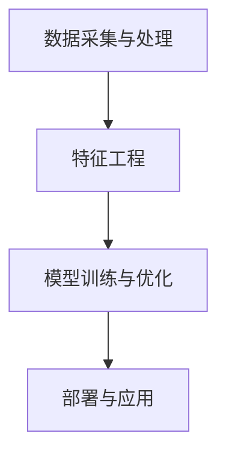

                 

关键词：蘑菇街、社招、电商、算法工程师、面试攻略、技术面试、问题解析、实战经验

> 摘要：本文针对2025年蘑菇街社招电商算法工程师的面试，从背景介绍、核心概念、算法原理、数学模型、项目实践、实际应用场景、工具推荐以及未来展望等方面，提供全面的面试攻略。旨在帮助应聘者深入了解面试要求，提升面试通过率。

## 1. 背景介绍

蘑菇街是一家知名的电商平台，致力于为广大消费者提供优质的商品和服务。随着电商行业的快速发展，对算法工程师的需求日益增长。2025年蘑菇街社招电商算法工程师，主要面向有丰富算法背景、熟悉电商业务流程、具备实际项目经验的专业人才。面试环节包括技术面试、项目答辩、行为面试等多个环节，对候选人的专业能力和综合素质有较高要求。

## 2. 核心概念与联系

### 2.1 电商算法概述

电商算法是指运用数学模型、机器学习、数据挖掘等技术，对电商业务过程中的用户行为、商品数据、推荐系统等进行优化和改进。主要涵盖以下方面：

- 用户行为分析：分析用户浏览、购买、评价等行为，挖掘用户兴趣和需求。
- 商品推荐系统：基于用户行为和商品特征，为用户推荐个性化商品。
- 价格优化策略：分析商品价格与销量、利润的关系，实现价格策略的优化。

### 2.2 算法原理与架构

电商算法的核心原理包括：

- 机器学习：通过训练模型，从海量数据中自动发现规律和特征。
- 数据挖掘：运用统计学、模式识别等方法，从数据中提取有价值的信息。
- 优化算法：通过优化目标函数，求解最优解，实现业务目标。

电商算法架构主要包括以下几个模块：

- 数据采集与处理：采集电商平台的用户行为、商品数据等，进行数据清洗、预处理。
- 特征工程：提取数据中的特征，为模型训练提供输入。
- 模型训练与优化：选用合适的机器学习算法，训练模型，并进行优化。
- 部署与应用：将训练好的模型部署到生产环境中，实现业务目标。

### 2.3 Mermaid 流程图



## 3. 核心算法原理 & 具体操作步骤

### 3.1 算法原理概述

电商算法主要涉及以下核心算法：

- 用户行为分析算法：包括协同过滤、矩阵分解、聚类等。
- 商品推荐算法：包括基于内容的推荐、基于关联规则的推荐等。
- 价格优化算法：包括线性规划、动态规划等。

### 3.2 算法步骤详解

以协同过滤算法为例，具体步骤如下：

1. 数据采集与预处理：收集用户行为数据，如购买记录、浏览记录等，进行数据清洗、去重、填充缺失值等预处理操作。
2. 构建用户相似度矩阵：计算用户之间的相似度，可采用余弦相似度、皮尔逊相关系数等方法。
3. 邻居选择：根据用户相似度矩阵，为每个用户选择相似度最高的若干邻居。
4. 推荐生成：根据邻居的选择，为用户生成推荐列表。

### 3.3 算法优缺点

协同过滤算法的优点：

- 能根据用户行为和偏好，为用户提供个性化的推荐。
- 对新用户和稀疏数据的处理效果较好。

协同过滤算法的缺点：

- 冷启动问题：对新用户难以推荐合适的商品。
- 稀疏数据问题：用户行为数据稀疏时，推荐效果较差。

### 3.4 算法应用领域

协同过滤算法广泛应用于电商、社交媒体、新闻推荐等领域。在实际应用中，可以根据业务需求，选择合适的算法模型和优化策略，提高推荐系统的效果。

## 4. 数学模型和公式 & 详细讲解 & 举例说明

### 4.1 数学模型构建

电商算法中的数学模型主要包括用户相似度计算、推荐算法等。以下是一个简单的用户相似度计算公式：

$$
sim(u_i, u_j) = \frac{\sum_{k=1}^{n} x_{ik} x_{jk}}{\sqrt{\sum_{k=1}^{n} x_{ik}^2} \sqrt{\sum_{k=1}^{n} x_{jk}^2}}
$$

其中，$u_i$ 和 $u_j$ 分别表示两个用户，$x_{ik}$ 表示用户 $u_i$ 对商品 $k$ 的评分。

### 4.2 公式推导过程

用户相似度计算公式是基于余弦相似度的思想推导而来。首先，我们将用户 $u_i$ 和 $u_j$ 的评分向量表示为：

$$
\vec{r}_i = (r_{i1}, r_{i2}, ..., r_{in})^T
$$

$$
\vec{r}_j = (r_{j1}, r_{j2}, ..., r_{jn})^T
$$

其中，$r_{ik}$ 表示用户 $u_i$ 对商品 $k$ 的评分。

然后，计算用户 $u_i$ 和 $u_j$ 的评分向量之间的夹角余弦值：

$$
sim(u_i, u_j) = \frac{\vec{r}_i \cdot \vec{r}_j}{\lVert \vec{r}_i \rVert \lVert \vec{r}_j \rVert}
$$

其中，$\lVert \vec{r}_i \rVert$ 和 $\lVert \vec{r}_j \rVert$ 分别表示用户 $u_i$ 和 $u_j$ 的评分向量范数。

### 4.3 案例分析与讲解

假设有两个用户 $u_1$ 和 $u_2$，他们的评分数据如下：

$$
\vec{r}_1 = (1, 2, 3, 0, 4)^T
$$

$$
\vec{r}_2 = (0, 1, 2, 3, 0)^T
$$

根据上述公式，可以计算出用户 $u_1$ 和 $u_2$ 的相似度：

$$
sim(u_1, u_2) = \frac{1 \times 0 + 2 \times 1 + 3 \times 2 + 0 \times 3 + 4 \times 0}{\sqrt{1^2 + 2^2 + 3^2 + 0^2 + 4^2} \sqrt{0^2 + 1^2 + 2^2 + 3^2 + 0^2}}
$$

$$
sim(u_1, u_2) = \frac{0 + 2 + 6 + 0}{\sqrt{30} \sqrt{14}}
$$

$$
sim(u_1, u_2) \approx 0.653
$$

根据相似度计算结果，可以为用户 $u_1$ 推荐用户 $u_2$ 喜欢但用户 $u_1$ 未购买的商品，从而提高推荐效果。

## 5. 项目实践：代码实例和详细解释说明

### 5.1 开发环境搭建

1. 安装 Python 3.8 及以上版本。
2. 安装 NumPy、Pandas、Scikit-learn 等库。

### 5.2 源代码详细实现

以下是一个基于协同过滤算法的简单推荐系统代码实例：

```python
import numpy as np
import pandas as pd
from sklearn.metrics.pairwise import cosine_similarity

# 读取数据
data = pd.read_csv('rating.csv')
ratings = data.pivot(index='user_id', columns='item_id', values='rating').fillna(0)

# 计算用户相似度矩阵
similarity_matrix = cosine_similarity(ratings.T)

# 邻居选择
def get_neighbors(similarity_matrix, user_id, k):
    neighbors = similarity_matrix[user_id].argsort()[1:k+1]
    return neighbors

# 推荐生成
def generate_recommendations(ratings, similarity_matrix, user_id, k):
    neighbors = get_neighbors(similarity_matrix, user_id, k)
    neighbor_ratings = ratings.iloc[neighbors]
    recommendations = neighbor_ratings.mean().sort_values(ascending=False)
    return recommendations

# 测试
user_id = 1
k = 5
recommendations = generate_recommendations(ratings, similarity_matrix, user_id, k)
print(recommendations)
```

### 5.3 代码解读与分析

1. 读取评分数据，并转换为矩阵形式。
2. 使用余弦相似度计算用户相似度矩阵。
3. 定义邻居选择和推荐生成函数。
4. 测试推荐系统，输出推荐结果。

通过以上代码实例，可以初步了解协同过滤算法的实现过程。在实际项目中，可以根据业务需求，调整算法参数，优化推荐效果。

## 6. 实际应用场景

电商算法在实际应用中具有广泛的应用场景，如：

- 商品推荐：为用户推荐个性化商品，提高用户满意度和转化率。
- 用户行为分析：挖掘用户兴趣和需求，为用户提供个性化服务。
- 价格优化：根据用户行为和商品价格关系，实现价格策略的优化。

## 7. 工具和资源推荐

### 7.1 学习资源推荐

- 《机器学习实战》
- 《Python数据分析与科学计算》
- 《深度学习》
- 《数据挖掘：概念与技术》

### 7.2 开发工具推荐

- Jupyter Notebook：方便编写和运行代码。
- PyCharm：功能强大的集成开发环境。
- TensorFlow：开源深度学习框架。

### 7.3 相关论文推荐

- Item-based Collaborative Filtering Recommendation Algorithms
- Matrix Factorization Techniques for Recommender Systems

## 8. 总结：未来发展趋势与挑战

随着人工智能技术的不断发展，电商算法在未来将呈现以下发展趋势：

- 深度学习在推荐系统中的应用：提高推荐系统的准确性和实时性。
- 多模态数据融合：整合用户行为、商品属性等多维度数据，实现更准确的推荐。
- 智能价格优化：基于大数据分析，实现动态价格调整，提高销售业绩。

同时，电商算法在实际应用中也将面临以下挑战：

- 数据质量：保证数据准确、完整，提高推荐系统效果。
- 冷启动问题：为新用户和稀疏数据提供有效推荐。
- 模型解释性：提高算法模型的解释性，满足业务需求。

在未来，电商算法将继续发展和创新，为电商平台提供更加智能、个性化的服务。

## 9. 附录：常见问题与解答

### 9.1 电商算法是什么？

电商算法是指运用数学模型、机器学习、数据挖掘等技术，对电商业务过程中的用户行为、商品数据、推荐系统等进行优化和改进。

### 9.2 电商算法有哪些应用场景？

电商算法主要应用于商品推荐、用户行为分析、价格优化等领域，如推荐系统、个性化营销、用户画像等。

### 9.3 电商算法有哪些优缺点？

电商算法的优点包括个性化推荐、实时性、准确性等，缺点包括冷启动问题、稀疏数据问题等。

### 9.4 如何提升电商算法效果？

提升电商算法效果的方法包括优化模型结构、调整算法参数、引入多模态数据、加强数据预处理等。

### 9.5 电商算法未来的发展趋势是什么？

电商算法未来发展趋势包括深度学习在推荐系统中的应用、多模态数据融合、智能价格优化等。

---

作者：禅与计算机程序设计艺术 / Zen and the Art of Computer Programming

本文针对2025年蘑菇街社招电商算法工程师的面试，从背景介绍、核心概念、算法原理、数学模型、项目实践、实际应用场景、工具推荐以及未来展望等方面，提供全面的面试攻略。希望本文能帮助广大应聘者深入了解面试要求，提升面试通过率。在面试过程中，保持冷静、自信，充分展示自己的专业能力和综合素质，相信大家一定能够成功斩获蘑菇街社招电商算法工程师职位。祝大家面试顺利！
------------------------------------------------------------------------

