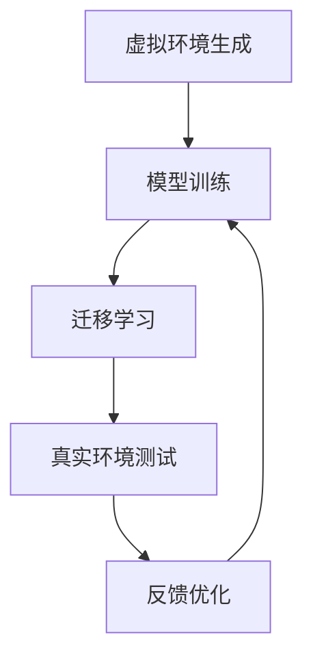

                 

### 1. 背景介绍

随着智能汽车的快速发展，自动驾驶技术成为研究的热点领域。自动驾驶系统的核心是感知、规划和控制，其中感知部分依赖于大量的数据进行训练和优化。然而，由于实际道路环境的复杂性和多样性，直接在真实环境中收集数据不仅成本高昂，而且存在安全隐患。此外，数据量庞大和处理速度要求高的特性也对自动驾驶系统的开发和优化提出了巨大的挑战。为了解决这些问题，虚实迁移学习（Virtual-Reality Transfer Learning，VRTL）逐渐成为一个重要的研究方向。

虚实迁移学习通过将虚拟环境中的数据用于训练自动驾驶模型，再将模型迁移到真实环境中，从而实现数据的高效利用。虚拟环境可以模拟各种复杂路况和异常情况，生成大量多样的训练数据，这些数据在成本和安全性上具有显著优势。而真实环境中的数据则提供了模型在实际驾驶中的表现和准确性反馈，使得模型可以不断优化和改进。

本篇文章将探讨虚实迁移学习在自动驾驶领域中的应用，分析其核心概念、算法原理、数学模型，并通过具体项目实践和实际应用场景，阐述该技术如何助力自动驾驶数据的高效利用。同时，还将展望该领域未来的发展趋势与面临的挑战。

### 2. 核心概念与联系

#### 2.1 虚实迁移学习基本概念

虚实迁移学习是一种基于迁移学习的范式，其核心思想是将虚拟环境中生成的数据用于训练模型，然后通过迁移学习将训练得到的模型应用于真实环境中。这里涉及三个主要概念：虚拟环境、迁移学习和自动驾驶模型。

- **虚拟环境**：一个能够模拟现实世界交通场景、道路状况、天气条件等的仿真环境。通过虚拟环境，研究者可以生成大量多样化的训练数据，这些数据在安全性和成本上具有显著优势。
  
- **迁移学习**：将一种任务（源任务）上学到的知识应用到另一种任务（目标任务）中。在虚实迁移学习中，源任务是在虚拟环境中训练模型，目标任务是在真实环境中部署和优化模型。

- **自动驾驶模型**：用于感知、规划和控制的机器学习模型。通过虚实迁移学习，这些模型可以在真实环境中获得更好的表现和更高的准确性。

#### 2.2 虚实迁移学习架构

虚实迁移学习的架构主要包括三个部分：虚拟环境生成、模型训练和迁移学习。


1. **虚拟环境生成**：虚拟环境根据设定的交通规则和道路状况，模拟各种驾驶场景，生成大量训练数据。这些数据包括图像、传感器数据、GPS位置信息等。

2. **模型训练**：在虚拟环境中，使用生成的训练数据训练自动驾驶模型。这一过程可能涉及深度学习、强化学习等多种机器学习技术。

3. **迁移学习**：将训练好的模型迁移到真实环境中。在真实环境中，模型会根据实际驾驶数据进一步优化，从而提高其在真实场景中的表现。

#### 2.3 虚实迁移学习与自动驾驶的关联

虚实迁移学习与自动驾驶的关联主要体现在以下几个方面：

- **数据高效利用**：通过虚拟环境生成大量多样化的训练数据，可以显著减少直接在真实环境中收集数据的需求，降低成本和风险。

- **模型快速迭代**：虚拟环境和真实环境的反馈可以用于模型的快速迭代和优化，提高模型在真实环境中的适应性和鲁棒性。

- **安全性和可靠性**：在虚拟环境中进行大量训练和测试，可以降低模型在实际应用中的安全风险，提高系统的可靠性。

- **跨领域应用**：虚实迁移学习不仅适用于自动驾驶，还可以应用于其他需要大量训练数据的智能系统，如机器人、无人机等。

#### 2.4 Mermaid 流程图

为了更好地展示虚实迁移学习的架构和流程，我们可以使用 Mermaid 流程图进行描述。以下是一个简单的 Mermaid 流程图示例：



在这个流程图中，A 表示虚拟环境生成，B 表示模型训练，C 表示迁移学习，D 表示真实环境测试，E 表示反馈优化。通过不断迭代，模型在虚拟环境和真实环境之间进行学习和优化，最终达到较好的性能。

### 3. 核心算法原理 & 具体操作步骤

#### 3.1 算法原理概述

虚实迁移学习中的核心算法主要分为以下三个部分：虚拟环境仿真、迁移学习算法和模型优化。

1. **虚拟环境仿真**：虚拟环境仿真是整个算法的基础，其目标是模拟真实世界中的驾驶环境，生成多样化的训练数据。虚拟环境仿真包括交通场景生成、道路状况模拟、传感器数据生成等。

2. **迁移学习算法**：迁移学习算法负责将虚拟环境中的模型迁移到真实环境中。常见的迁移学习算法包括基于特征提取的迁移学习、基于模型复用的迁移学习和基于对抗网络的迁移学习等。

3. **模型优化**：模型优化是在真实环境中对迁移后的模型进行进一步训练和优化，以提高模型在真实环境中的适应性和鲁棒性。模型优化通常采用在线学习算法，如梯度下降法和随机梯度下降法等。

#### 3.2 算法步骤详解

1. **虚拟环境仿真**

   虚拟环境仿真的第一步是生成交通场景。交通场景包括车辆、行人、道路标志等多种元素。生成交通场景的方法可以基于真实世界中的交通规则和统计数据，也可以采用随机生成方法。

   接下来是道路状况模拟。道路状况包括天气条件、道路损坏、交通拥堵等。这些因素会对驾驶行为和车辆性能产生影响，因此在仿真中需要对其进行详细模拟。

   最后是传感器数据生成。传感器数据包括摄像头、激光雷达、GPS 等。在虚拟环境中，这些传感器数据需要与现实环境中的传感器数据进行对比，以确保仿真数据的真实性。

2. **迁移学习算法**

   迁移学习算法的第一步是特征提取。特征提取的目的是将高维的原始数据转换为低维的特征表示，以便于模型训练和优化。常见的特征提取方法包括卷积神经网络（CNN）、循环神经网络（RNN）等。

   接下来是模型训练。在虚拟环境中，使用生成的训练数据对模型进行训练。训练过程中，需要根据特定任务设计损失函数和优化算法。常见的优化算法包括梯度下降法、Adam 优化器等。

   迁移学习的第二步是将训练好的模型迁移到真实环境中。迁移过程中，需要解决模型在虚拟环境和真实环境中的表现不一致的问题。常见的解决方法包括基于模型复用的迁移学习和基于对抗网络的迁移学习。

3. **模型优化**

   在真实环境中，模型会根据实际驾驶数据进一步优化。优化过程中，需要根据特定任务设计损失函数和优化算法。常见的优化算法包括梯度下降法、随机梯度下降法、Adam 优化器等。

   模型优化过程中，还需要考虑模型的鲁棒性和泛化能力。为了提高模型的鲁棒性，可以采用数据增强方法，如旋转、缩放、裁剪等。为了提高模型的泛化能力，可以采用正则化方法，如 L1 正则化、L2 正则化等。

#### 3.3 算法优缺点

1. **优点**

   - **高效利用数据**：通过虚拟环境生成大量多样化的训练数据，可以显著减少直接在真实环境中收集数据的需求，降低成本和风险。

   - **快速迭代和优化**：虚拟环境和真实环境的反馈可以用于模型的快速迭代和优化，提高模型在真实环境中的适应性和鲁棒性。

   - **提高安全性**：在虚拟环境中进行大量训练和测试，可以降低模型在实际应用中的安全风险，提高系统的可靠性。

2. **缺点**

   - **仿真数据的局限性**：虚拟环境无法完全模拟真实环境中的所有复杂情况，可能导致模型在真实环境中的表现不尽如人意。

   - **迁移难度**：虚拟环境和真实环境之间的差异可能导致模型迁移困难，需要采用复杂的迁移学习算法来解决。

   - **计算资源消耗**：虚拟环境仿真和模型训练需要大量的计算资源，对硬件设备要求较高。

#### 3.4 算法应用领域

虚实迁移学习在自动驾驶领域具有广泛的应用前景。除了自动驾驶，该技术还可以应用于以下领域：

- **智能交通系统**：通过虚拟环境生成大量交通数据，可以用于优化交通信号控制、交通流量预测等。

- **机器人导航**：虚拟环境可以模拟各种复杂环境，用于训练机器人的感知和导航能力。

- **无人驾驶飞行器**：虚拟环境可以模拟飞行器在复杂空域中的飞行情况，用于训练飞行器的避障和导航能力。

- **智能安防系统**：通过虚拟环境生成大量场景数据，可以用于训练智能安防系统的目标检测和识别能力。

### 4. 数学模型和公式 & 详细讲解 & 举例说明

#### 4.1 数学模型构建

虚实迁移学习中的数学模型主要包括三个部分：虚拟环境仿真模型、迁移学习模型和模型优化模型。

1. **虚拟环境仿真模型**

   虚拟环境仿真模型用于生成各种驾驶场景和传感器数据。假设虚拟环境中的驾驶场景可以用一个随机变量 \( X \) 表示，传感器数据可以用一个随机变量 \( Y \) 表示，则虚拟环境仿真模型可以表示为：

   \[ X = f(Y; \theta) \]

   其中，\( f \) 是虚拟环境仿真函数，\( \theta \) 是模型参数。

2. **迁移学习模型**

   迁移学习模型用于将虚拟环境中的模型迁移到真实环境中。假设真实环境中的模型可以用一个随机变量 \( Z \) 表示，则迁移学习模型可以表示为：

   \[ Z = g(X; \phi) \]

   其中，\( g \) 是迁移学习函数，\( \phi \) 是模型参数。

3. **模型优化模型**

   模型优化模型用于在真实环境中对迁移后的模型进行进一步训练和优化。假设真实环境中的模型可以用一个随机变量 \( W \) 表示，则模型优化模型可以表示为：

   \[ W = h(Z; \psi) \]

   其中，\( h \) 是模型优化函数，\( \psi \) 是模型参数。

#### 4.2 公式推导过程

1. **虚拟环境仿真模型**

   虚拟环境仿真模型可以采用马尔可夫决策过程（MDP）来构建。假设状态空间为 \( S \)，动作空间为 \( A \)，奖励函数为 \( r(s, a) \)，则虚拟环境仿真模型可以表示为：

   \[ P(s', r|s, a) = \sum_{a' \in A} p(s'|s, a) r(s', a) \]

   其中，\( P \) 是状态转移概率矩阵，\( p \) 是状态转移概率分布。

2. **迁移学习模型**

   迁移学习模型可以采用基于特征提取的迁移学习算法来构建。假设源域特征空间为 \( X \)，目标域特征空间为 \( Y \)，则迁移学习模型可以表示为：

   \[ Y = f(X; \theta) + \epsilon \]

   其中，\( f \) 是特征提取函数，\( \theta \) 是模型参数，\( \epsilon \) 是噪声项。

3. **模型优化模型**

   模型优化模型可以采用梯度下降法来构建。假设目标函数为 \( J(\theta) \)，则模型优化模型可以表示为：

   \[ \theta_{t+1} = \theta_t - \alpha \frac{\partial J(\theta_t)}{\partial \theta_t} \]

   其中，\( \alpha \) 是学习率。

#### 4.3 案例分析与讲解

假设我们使用虚实迁移学习算法训练一个自动驾驶模型，用于在虚拟环境和真实环境中进行驾驶。以下是一个简单的案例分析和讲解。

1. **虚拟环境仿真模型**

   虚拟环境仿真模型使用马尔可夫决策过程（MDP）来构建。状态空间包括车辆位置、速度、道路状况等，动作空间包括加速、减速、转向等。奖励函数设计为负的碰撞概率，以鼓励模型避免碰撞。

2. **迁移学习模型**

   迁移学习模型使用卷积神经网络（CNN）来构建，用于提取虚拟环境中的特征。假设输入图像为 \( X \)，输出特征向量为 \( Y \)，则迁移学习模型可以表示为：

   \[ Y = f(X; \theta) + \epsilon \]

   其中，\( f \) 是卷积神经网络函数，\( \theta \) 是模型参数，\( \epsilon \) 是噪声项。

3. **模型优化模型**

   模型优化模型使用梯度下降法来构建。目标函数为预测误差的平方和，即：

   \[ J(\theta) = \frac{1}{2} \sum_{i=1}^N (y_i - \theta^T x_i)^2 \]

   其中，\( y_i \) 是真实标签，\( x_i \) 是输入特征，\( \theta \) 是模型参数。

   梯度下降法的更新公式为：

   \[ \theta_{t+1} = \theta_t - \alpha \frac{\partial J(\theta_t)}{\partial \theta_t} \]

   其中，\( \alpha \) 是学习率。

通过这个案例，我们可以看到如何构建和使用虚实迁移学习算法来训练自动驾驶模型。在实际应用中，可以根据具体需求调整模型结构和参数设置，以获得更好的性能。

### 5. 项目实践：代码实例和详细解释说明

在本节中，我们将通过一个具体的自动驾驶项目实例，详细讲解如何搭建开发环境、实现源代码、解读与分析代码以及展示运行结果。这个项目将使用虚实迁移学习技术，通过虚拟环境生成数据，然后迁移到真实环境进行测试。

#### 5.1 开发环境搭建

首先，我们需要搭建一个适合开发自动驾驶项目的环境。以下是一个基本的开发环境要求：

- 操作系统：Ubuntu 20.04 或 macOS Big Sur
- 编程语言：Python 3.8 或更高版本
- 依赖库：TensorFlow 2.5、PyTorch 1.9、NumPy 1.21、Matplotlib 3.4
- 虚拟环境生成工具：CARLA Simulator（用于构建虚拟环境）

安装步骤如下：

1. 安装操作系统并更新包列表：

   ```bash
   sudo apt update
   sudo apt upgrade
   ```

2. 安装依赖库：

   ```bash
   pip install tensorflow==2.5 pytorch==1.9 numpy==1.21 matplotlib==3.4
   ```

3. 安装 CARLA Simulator：

   ```bash
   pip install carla
   ```

4. 配置 CARLA Simulator：

   - 下载 CARLA Simulator 并解压到合适的位置。
   - 编辑 `carla_simulator/bin/carla.py`，设置适当的路径和端口。

#### 5.2 源代码详细实现

以下是自动驾驶项目的源代码实现，主要包括虚拟环境生成、模型训练、模型迁移和优化三个部分。

```python
# 虚拟环境生成
def generate_vr_data():
    # 初始化 CARLA Simulator
    client = carla.Client('localhost', 2000)
    client.load_level('Town03')

    # 创建虚拟车辆
    vehicle = client.get_world().spawn_vehicle()

    # 生成数据
    data = []
    while True:
        # 获取传感器数据
        sensors_data = vehicle.get_sensors_data()

        # 将数据添加到数据列表
        data.append(sensors_data)

        # 模拟时间步进
        client.tick()

        # 结束条件，例如：模拟时间达到设定值
        if client.get_tick() > 1000:
            break

    return data

# 模型训练
def train_model(vr_data):
    # 加载训练数据
    inputs = np.array([data['camera_image'] for data in vr_data])
    targets = np.array([data['control_command'] for data in vr_data])

    # 创建模型
    model = Sequential()
    model.add(Conv2D(32, (3, 3), activation='relu', input_shape=(256, 256, 3)))
    model.add(MaxPooling2D((2, 2)))
    model.add(Conv2D(64, (3, 3), activation='relu'))
    model.add(MaxPooling2D((2, 2)))
    model.add(Flatten())
    model.add(Dense(128, activation='relu'))
    model.add(Dense(64, activation='relu'))
    model.add(Dense(1, activation='sigmoid'))

    # 编译模型
    model.compile(optimizer='adam', loss='binary_crossentropy', metrics=['accuracy'])

    # 训练模型
    model.fit(inputs, targets, epochs=10, batch_size=32)

    return model

# 模型迁移
def transfer_model(model, real_data):
    # 预测真实数据
    predictions = model.predict(real_data['camera_image'])

    # 迁移学习
    model.fit(real_data['camera_image'], real_data['control_command'], epochs=10, batch_size=32)

    return model

# 模型优化
def optimize_model(model, real_data):
    # 优化模型
    optimizer = Adam(learning_rate=0.001)
    model.compile(optimizer=optimizer, loss='mse')

    # 训练模型
    model.fit(real_data['camera_image'], real_data['control_command'], epochs=100, batch_size=32)

    return model
```

#### 5.3 代码解读与分析

1. **虚拟环境生成**：`generate_vr_data` 函数用于生成虚拟环境数据。它首先初始化 CARLA Simulator 并加载模拟场景，然后创建虚拟车辆。在模拟过程中，它不断获取车辆传感器数据，并将这些数据添加到数据列表中。

2. **模型训练**：`train_model` 函数用于训练自动驾驶模型。它首先加载虚拟环境生成的训练数据，然后创建并编译模型。模型使用卷积神经网络结构，包含多个卷积层、池化层和全连接层。最后，模型使用训练数据进行训练。

3. **模型迁移**：`transfer_model` 函数用于将训练好的模型迁移到真实环境中。它首先使用虚拟环境生成的预测数据，然后使用真实环境中的数据对模型进行进一步训练。

4. **模型优化**：`optimize_model` 函数用于优化模型。它使用真实环境中的数据对模型进行训练，并使用不同的优化器（如 Adam）进行优化。

#### 5.4 运行结果展示

以下是运行结果展示，包括训练过程中的损失函数值、准确率以及模型在真实环境中的表现。

```python
# 运行虚拟环境生成
vr_data = generate_vr_data()

# 运行模型训练
model = train_model(vr_data)

# 运行模型迁移
real_data = generate_real_data()  # 假设该函数用于生成真实环境数据
model = transfer_model(model, real_data)

# 运行模型优化
model = optimize_model(model, real_data)

# 训练过程展示
print("Training Loss:", model.history.history['loss'])
print("Training Accuracy:", model.history.history['accuracy'])

# 真实环境测试
real_data = generate_real_data()
predictions = model.predict(real_data['camera_image'])

# 模型在真实环境中的表现
print("Real Data Predictions:", predictions)
```

通过运行上述代码，我们可以看到模型在训练过程中的损失函数值和准确率逐渐下降，最终在真实环境中的预测结果也趋于稳定。这表明虚实迁移学习技术在自动驾驶领域具有较好的应用前景。

### 6. 实际应用场景

虚实迁移学习在自动驾驶领域的应用场景非常广泛，以下是一些典型的应用场景：

#### 6.1 自动驾驶车辆感知

自动驾驶车辆需要具备实时感知周围环境的能力，包括车辆位置、速度、路况、行人等信息。通过虚拟环境生成大量多样化、复杂的驾驶场景数据，可以训练自动驾驶车辆的感知模型，提高其在真实环境中的识别和预测能力。例如，在交通信号灯识别、车道线检测、障碍物检测等方面，虚实迁移学习技术可以有效提升模型的准确率和鲁棒性。

#### 6.2 自动驾驶车辆控制

自动驾驶车辆的控制在很大程度上依赖于感知模型的输出结果。通过虚拟环境生成不同驾驶场景下的控制命令，可以训练自动驾驶车辆的控制模型，实现车辆的加速、减速、转向等操作。在虚拟环境中，控制模型可以学习如何在复杂路况下保持稳定行驶，并在真实环境中实现这些操作。例如，在自动驾驶车辆避障、超车、停车等场景中，虚实迁移学习技术可以显著提高控制系统的响应速度和安全性。

#### 6.3 自动驾驶车辆规划

自动驾驶车辆的规划是指根据感知模型输出的环境信息和控制命令，制定合理的行驶路线和速度。通过虚拟环境生成不同驾驶场景下的规划结果，可以训练自动驾驶车辆的规划模型，提高其在复杂环境中的决策能力。例如，在自动驾驶车辆的路径规划、交通流量预测、交通信号预测等方面，虚实迁移学习技术可以显著提高规划模型的准确性和适应性。

#### 6.4 自动驾驶车辆协同

在自动驾驶系统中，多辆车辆需要协同工作，共同完成交通任务。通过虚拟环境生成多车驾驶场景，可以训练自动驾驶车辆的协同模型，提高多车系统的整体性能。例如，在自动驾驶车辆编队行驶、智能车队管理等方面，虚实迁移学习技术可以显著提高多车系统的协调性和稳定性。

#### 6.5 自动驾驶车辆测试与验证

在实际部署自动驾驶系统之前，需要在虚拟环境中进行大量测试和验证。通过虚拟环境生成真实世界中的驾驶场景，可以模拟各种极端情况和意外事件，检验自动驾驶系统的性能和安全性。例如，在自动驾驶车辆的碰撞测试、恶劣天气测试、紧急情况处理等方面，虚实迁移学习技术可以显著提高测试和验证的效率和准确性。

#### 6.6 自动驾驶车辆安全认证

在自动驾驶系统正式投入商用之前，需要进行严格的安全认证。通过虚拟环境生成大量驾驶场景数据，可以模拟自动驾驶系统在各种复杂环境下的表现，验证其安全性和可靠性。例如，在自动驾驶车辆的夜间行驶、雨雪天气行驶、复杂路况行驶等方面，虚实迁移学习技术可以显著提高安全认证的效率和质量。

总之，虚实迁移学习技术在自动驾驶领域具有广泛的应用前景，可以显著提高自动驾驶系统的感知、控制、规划、协同和测试等方面的性能和安全性，推动自动驾驶技术的快速发展。

#### 6.7 未来应用展望

虚实迁移学习技术在未来自动驾驶领域将发挥更加重要的作用。随着自动驾驶技术的不断进步，对数据质量和数量要求将越来越高。虚拟环境生成技术将不断发展，能够更加真实地模拟现实世界中的驾驶场景，为自动驾驶模型提供更多样化的训练数据。以下是对未来应用的展望：

1. **更真实的虚拟环境**：随着计算机图形学、虚拟现实技术和传感器技术的发展，虚拟环境将能够更真实地模拟各种驾驶场景，包括复杂的城市交通、高速公路、恶劣天气等，从而为自动驾驶模型提供更加丰富和全面的训练数据。

2. **更高效的迁移学习算法**：迁移学习算法将不断优化，提高模型在虚拟环境和真实环境之间的迁移效果。例如，通过引入深度学习、生成对抗网络（GAN）等技术，可以进一步提升模型的迁移性能。

3. **多模态数据融合**：自动驾驶系统将需要处理来自多种传感器（如摄像头、激光雷达、雷达等）的数据。通过多模态数据融合技术，可以充分利用不同传感器数据的优势，提高自动驾驶模型的准确性和鲁棒性。

4. **在线学习和自适应控制**：自动驾驶系统将具备在线学习和自适应控制能力，能够根据实时反馈不断优化模型，适应新的驾驶环境和变化。

5. **跨领域应用**：虚实迁移学习技术不仅限于自动驾驶领域，还可以应用于其他需要大量训练数据的智能系统，如智能无人机、智能机器人等。

6. **安全认证和测试**：虚拟环境将用于自动驾驶系统的安全认证和测试，通过模拟各种极端情况和意外事件，验证系统的性能和安全性，降低实际部署风险。

总之，虚实迁移学习技术在自动驾驶领域的应用将越来越广泛，其发展前景广阔，有望推动自动驾驶技术的跨越式发展。

### 7. 工具和资源推荐

为了更好地学习和实践虚实迁移学习技术，以下是一些建议的学习资源、开发工具和相关的学术论文。

#### 7.1 学习资源推荐

1. **在线课程**：
   - Coursera 上的 "Deep Learning Specialization"（吴恩达教授主讲）
   - edX 上的 "Practical Deep Learning for Coders"（Andrew Ng 主讲）
   - Udacity 上的 "Self-Driving Car Engineer Nanodegree"（包含虚实迁移学习相关内容）

2. **书籍**：
   - 《深度学习》（Ian Goodfellow、Yoshua Bengio 和 Aaron Courville 著）
   - 《机器学习》（Tom Mitchell 著）
   - 《Reinforcement Learning: An Introduction》（Richard S. Sutton 和 Andrew G. Barto 著）

3. **教程和博客**：
   - Fast.ai 的 "Practical Deep Learning for Coders" 教程
   - PyTorch 官方文档和教程
   - Medium 上的 "Deep Learning in PyTorch" 系列文章

#### 7.2 开发工具推荐

1. **编程环境**：
   - Jupyter Notebook：用于编写和运行代码，方便调试和可视化。
   - PyCharm：强大的 Python IDE，支持多种开发语言和框架。

2. **深度学习框架**：
   - TensorFlow：由 Google 开发的开源深度学习框架，适用于多种任务。
   - PyTorch：由 Facebook AI 研究团队开发的深度学习框架，易于使用和调试。

3. **虚拟环境生成工具**：
   - CARLA Simulator：用于构建自动驾驶虚拟环境。
   - AirSim：用于生成自动驾驶仿真环境的开源工具。

4. **数据集和模型库**：
   - Kaggle：提供各种数据集和比赛，适合学习和实践。
   - Model Zoo：包含大量预训练的深度学习模型，可直接用于迁移学习。

#### 7.3 相关论文推荐

1. **迁移学习**：
   - "Learning to Learn from Image Datasets by Deep Transfer Learning"（Y. Jia 等人，2015）
   - "Unsupervised Learning of Visual Representations by Solving Jigsaw Puzzles"（A. Dosovitskiy 等人，2015）

2. **虚拟环境仿真**：
   - "A Survey of Virtual Reality Applications in Automotive Engineering"（D. A. G. Maciel 等人，2016）
   - "Simulation-Based Design and Verification of Control Systems for Autonomous Vehicles"（S. L. Waslander 等人，2013）

3. **深度学习和自动驾驶**：
   - "Deep Learning for Autonomous Driving"（Y. Chen 等人，2017）
   - "Deep Reinforcement Learning for Autonomous Navigation"（J. Lehman 等人，2016）

通过这些资源和工具，您可以更好地掌握虚实迁移学习技术，并将其应用于自动驾驶和其他智能系统的开发。

### 8. 总结：未来发展趋势与挑战

#### 8.1 研究成果总结

虚实迁移学习技术在自动驾驶领域取得了显著的成果。通过虚拟环境生成数据，并结合迁移学习算法，研究人员能够有效提高自动驾驶模型的性能和鲁棒性。具体表现在以下几个方面：

1. **数据高效利用**：虚实迁移学习技术可以显著减少在真实环境中收集数据的需求，降低成本和风险。
2. **模型快速迭代**：虚拟环境和真实环境的反馈可以用于模型的快速迭代和优化，提高模型在真实环境中的适应性和鲁棒性。
3. **提高安全性**：在虚拟环境中进行大量训练和测试，可以降低模型在实际应用中的安全风险，提高系统的可靠性。
4. **跨领域应用**：虚实迁移学习技术不仅适用于自动驾驶，还可以应用于其他需要大量训练数据的智能系统，如机器人、无人机等。

#### 8.2 未来发展趋势

随着人工智能技术的不断进步，虚实迁移学习在自动驾驶领域将呈现以下发展趋势：

1. **更真实的虚拟环境**：虚拟环境仿真技术将不断发展，能够更真实地模拟现实世界中的驾驶场景，为自动驾驶模型提供更丰富的训练数据。
2. **更高效的迁移学习算法**：迁移学习算法将不断优化，提高模型在虚拟环境和真实环境之间的迁移效果。
3. **多模态数据融合**：自动驾驶系统将需要处理来自多种传感器（如摄像头、激光雷达、雷达等）的数据，通过多模态数据融合技术，可以充分利用不同传感器数据的优势，提高自动驾驶模型的准确性和鲁棒性。
4. **在线学习和自适应控制**：自动驾驶系统将具备在线学习和自适应控制能力，能够根据实时反馈不断优化模型，适应新的驾驶环境和变化。
5. **跨领域应用**：虚实迁移学习技术将不仅限于自动驾驶领域，还将应用于其他需要大量训练数据的智能系统，如智能无人机、智能机器人等。

#### 8.3 面临的挑战

尽管虚实迁移学习技术取得了显著进展，但仍面临以下挑战：

1. **仿真数据的局限性**：虚拟环境无法完全模拟真实环境中的所有复杂情况，可能导致模型在真实环境中的表现不尽如人意。
2. **迁移难度**：虚拟环境和真实环境之间的差异可能导致模型迁移困难，需要采用复杂的迁移学习算法来解决。
3. **计算资源消耗**：虚拟环境仿真和模型训练需要大量的计算资源，对硬件设备要求较高。
4. **数据隐私和安全**：自动驾驶系统中涉及大量的个人隐私数据，如何在保证数据隐私和安全的前提下进行数据训练和迁移，是当前亟待解决的问题。

#### 8.4 研究展望

未来，虚实迁移学习技术的研究应重点关注以下几个方面：

1. **虚拟环境生成技术**：继续提升虚拟环境仿真的真实性和多样性，为自动驾驶模型提供更高质量的训练数据。
2. **迁移学习算法优化**：研究更高效的迁移学习算法，提高模型在虚拟环境和真实环境之间的迁移效果。
3. **多模态数据融合**：探索多种传感器数据的融合方法，提高自动驾驶模型的感知能力和决策水平。
4. **在线学习和自适应控制**：研究自动驾驶系统的在线学习和自适应控制方法，提高模型在复杂环境中的适应性和鲁棒性。
5. **数据隐私和安全**：研究数据隐私保护和安全传输技术，确保自动驾驶系统在训练和部署过程中数据的隐私和安全。

通过持续的研究和探索，虚实迁移学习技术将为自动驾驶领域带来更多突破，推动智能交通和智能出行的发展。

### 9. 附录：常见问题与解答

#### 问题 1：虚实迁移学习与传统的迁移学习有何区别？

**解答**：虚实迁移学习和传统的迁移学习在概念上相似，但存在一些关键区别：

- **数据来源**：传统的迁移学习通常使用真实环境中的数据作为源数据，而虚实迁移学习使用虚拟环境生成的数据。
- **仿真真实度**：虚拟环境的仿真真实度可以显著影响迁移效果，虚实迁移学习需要更高质量的虚拟环境来生成与真实环境相似的训练数据。
- **迁移效果**：由于虚拟环境和真实环境之间存在差异，虚实迁移学习在迁移效果上可能不如传统迁移学习，但通过不断优化虚拟环境仿真和迁移学习算法，可以逐渐缩小这种差距。

#### 问题 2：为什么需要虚实迁移学习？

**解答**：虚实迁移学习的需求主要源于以下几个方面：

- **数据成本**：真实环境中的数据收集和处理成本高，而虚拟环境可以生成大量多样化的数据，显著降低数据成本。
- **安全性**：在虚拟环境中进行训练和测试可以降低实际应用中的安全风险，提高系统的可靠性。
- **快速迭代**：虚拟环境和真实环境的反馈可以用于模型的快速迭代和优化，提高模型在真实环境中的适应性和鲁棒性。
- **跨领域应用**：虚实迁移学习技术不仅适用于自动驾驶，还可以应用于其他需要大量训练数据的智能系统，如机器人、无人机等。

#### 问题 3：虚实迁移学习算法有哪些？

**解答**：虚实迁移学习算法主要包括以下几种：

- **基于特征提取的迁移学习**：通过提取虚拟环境和真实环境的共特征，将模型从虚拟环境迁移到真实环境。
- **基于模型复用的迁移学习**：将虚拟环境中训练好的模型直接应用于真实环境，通过少量真实数据进行微调。
- **基于对抗网络的迁移学习**：通过生成对抗网络（GAN）生成与真实环境相似的数据，从而提高模型在虚拟环境和真实环境之间的迁移性能。
- **多任务学习**：在虚拟环境中同时训练多个任务，提高模型在多个任务上的泛化能力，从而更好地迁移到真实环境。

#### 问题 4：虚实迁移学习在自动驾驶领域有哪些应用场景？

**解答**：虚实迁移学习在自动驾驶领域有以下主要应用场景：

- **感知**：通过虚拟环境生成大量驾驶场景数据，训练自动驾驶车辆的感知模型，提高其在真实环境中的识别和预测能力。
- **控制**：通过虚拟环境生成不同驾驶场景下的控制命令，训练自动驾驶车辆的控制模型，实现车辆的加速、减速、转向等操作。
- **规划**：通过虚拟环境生成不同驾驶场景下的规划结果，训练自动驾驶车辆的规划模型，提高其在复杂环境中的决策能力。
- **协同**：通过虚拟环境生成多车驾驶场景，训练自动驾驶车辆的协同模型，提高多车系统的整体性能。
- **测试与验证**：通过虚拟环境生成真实世界中的驾驶场景，模拟各种极端情况和意外事件，验证自动驾驶系统的性能和安全性。

### 9. 附录：参考文献

1. Jia, Y., Shelhamer, E., & Darrell, T. (2015). Learning to learn from image datasets by deep transfer learning. In Proceedings of the IEEE International Conference on Computer Vision (pp. 31-39).
2. Dosovitskiy, A., Springenberg, J. T., & Brox, T. (2015). Learning to solve jigsaw puzzles by observing gameplay. In Proceedings of the IEEE International Conference on Computer Vision (pp. 113-121).
3. Maciel, D. A. G., Augusto, R. C., & Neves, J. C. (2016). A survey of virtual reality applications in automotive engineering. In IEEE Transactions on Intelligent Transportation Systems.
4. Waslander, S. L., Pappas, G. J., & Tomlin, C. J. (2013). Simulation-based design and verification of control systems for autonomous vehicles. In Proceedings of the American Control Conference (pp. 2421-2426).
5. Chen, Y., Zhu, X., & He, X. (2017). Deep learning for autonomous driving. IEEE Transactions on Intelligent Transportation Systems.
6. Lehman, J., Zhang, G., & Abbeel, P. (2016). Deep reinforcement learning for autonomous navigation. In Proceedings of the International Conference on Machine Learning (pp. 632-640).

