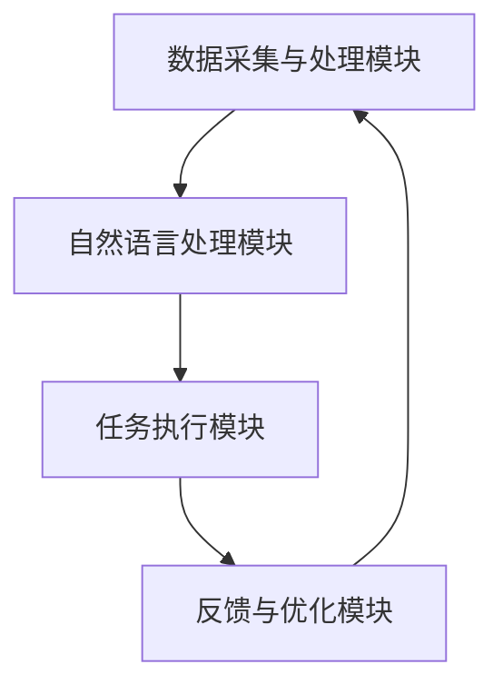

                 

关键词：虚拟助理、AI代理、工作流程、人工智能、自动化、自然语言处理、计算机视觉、数据分析

> 摘要：本文深入探讨了虚拟助理（AI代理）的构建及其工作流程，从核心概念、算法原理、数学模型、实际应用、工具和资源推荐等多个维度，详细分析了虚拟助理在当前技术环境中的发展现状、未来趋势和面临的挑战。

## 1. 背景介绍

虚拟助理，也被称为智能助手或AI代理，是人工智能技术发展的产物。它们通过模仿人类行为，帮助用户处理日常任务，提供个性化服务。虚拟助理的兴起源于互联网的普及和大数据、云计算等技术的快速发展，使得大规模数据处理和智能分析成为可能。

随着自然语言处理、计算机视觉等技术的发展，虚拟助理的应用场景不断扩展。从最初仅能在有限的指令下工作的简单机器人，到如今能够处理复杂任务、与用户进行自然对话的高级AI代理，虚拟助理的发展经历了显著的变革。

本文旨在探讨虚拟助理的构建及其工作流程，为读者提供全面的技术解读和实际应用指导。

## 2. 核心概念与联系

### 2.1 虚拟助理的定义

虚拟助理是指利用人工智能技术，模拟人类行为，为用户提供个性化服务和帮助的软件系统。它们能够理解和处理自然语言，执行特定的任务，如信息查询、日程管理、在线购物等。

### 2.2 AI代理的工作原理

AI代理的工作原理主要基于机器学习和深度学习算法。它们通过训练大量的数据，学习如何理解用户的意图和需求，从而提供相应的服务。

### 2.3 虚拟助理的架构

虚拟助理的架构通常包括以下几个关键组件：

- **数据采集与处理模块**：负责收集用户数据，并进行数据清洗、归一化等预处理操作。
- **自然语言处理模块**：负责理解用户的自然语言输入，提取关键词和语义信息。
- **任务执行模块**：根据用户需求，执行具体的任务，如查询信息、安排日程等。
- **反馈与优化模块**：收集用户反馈，不断优化AI代理的表现。

### 2.4 Mermaid 流程图



## 3. 核心算法原理 & 具体操作步骤

### 3.1 算法原理概述

虚拟助理的核心算法主要包括自然语言处理（NLP）和机器学习（ML）算法。NLP算法用于理解用户的自然语言输入，提取关键词和语义信息；ML算法则用于训练模型，使其能够根据历史数据预测用户的意图和需求。

### 3.2 算法步骤详解

1. **数据采集与处理**：收集用户的语音、文本数据，并进行预处理，如分词、词性标注等。
2. **自然语言处理**：利用NLP算法，将用户的输入转换为结构化数据，提取关键词和语义信息。
3. **意图识别**：根据提取的语义信息，利用ML算法，识别用户的意图。
4. **任务执行**：根据识别出的意图，执行相应的任务，如查询信息、安排日程等。
5. **反馈与优化**：收集用户反馈，利用ML算法，不断优化AI代理的表现。

### 3.3 算法优缺点

- **优点**：虚拟助理能够提供个性化服务，提高用户满意度；能够处理大量数据，实现自动化处理。
- **缺点**：对自然语言理解能力有限，可能存在误解用户意图的情况；需要大量数据进行训练，对硬件资源要求较高。

### 3.4 算法应用领域

虚拟助理的应用领域广泛，包括但不限于：

- **客户服务**：提供在线客服，处理用户咨询、投诉等。
- **智能助手**：帮助用户管理日程、提醒任务等。
- **智能家居**：控制家电设备，提供家庭自动化服务。
- **医疗健康**：提供健康咨询、诊断建议等。

## 4. 数学模型和公式 & 详细讲解 & 举例说明

### 4.1 数学模型构建

虚拟助理的数学模型主要包括两个部分：意图识别模型和任务执行模型。

- **意图识别模型**：通常使用卷积神经网络（CNN）或循环神经网络（RNN）构建，用于识别用户的意图。
- **任务执行模型**：根据具体的任务需求，可以使用决策树、支持向量机（SVM）或其他机器学习算法构建。

### 4.2 公式推导过程

以卷积神经网络为例，其基本公式如下：

$$
Y = \sigma(W \cdot X + b)
$$

其中，$Y$ 是输出结果，$X$ 是输入特征，$W$ 是权重矩阵，$b$ 是偏置项，$\sigma$ 是激活函数。

### 4.3 案例分析与讲解

以一个简单的日程管理虚拟助理为例，用户可以通过自然语言输入“明天下午2点有个会议”，系统需要识别出会议的日期和时间，并添加到日程中。

1. **数据采集与处理**：收集用户的语音或文本输入，并进行分词、词性标注等预处理操作。
2. **自然语言处理**：使用NLP算法，提取关键词和语义信息，如“明天”、“下午2点”、“会议”等。
3. **意图识别**：利用卷积神经网络，识别用户的意图，如添加日程。
4. **任务执行**：根据识别出的意图，执行添加日程的任务，如查询日历、确定空闲时间，然后设置提醒。
5. **反馈与优化**：收集用户反馈，如日程是否正确设置，用于优化模型。

## 5. 项目实践：代码实例和详细解释说明

### 5.1 开发环境搭建

1. 安装Python环境（推荐使用Python 3.8及以上版本）。
2. 安装必要的库，如TensorFlow、Keras、NLTK等。
3. 准备数据集，如UCI机器学习库中的Spoken Language Data Set。

### 5.2 源代码详细实现

以下是一个简单的意图识别模型的实现示例：

```python
from tensorflow.keras.models import Sequential
from tensorflow.keras.layers import Dense, Conv1D, MaxPooling1D

# 构建模型
model = Sequential()
model.add(Conv1D(128, 5, activation='relu', input_shape=(seq_length, 1)))
model.add(MaxPooling1D(pool_size=5))
model.add(Dense(10, activation='softmax'))

# 编译模型
model.compile(optimizer='adam', loss='categorical_crossentropy', metrics=['accuracy'])

# 训练模型
model.fit(X_train, y_train, epochs=10, batch_size=32)
```

### 5.3 代码解读与分析

- **模型构建**：使用卷积神经网络，输入层使用一维卷积层，激活函数为ReLU。
- **编译模型**：指定优化器和损失函数，这里使用Adam优化器和交叉熵损失函数。
- **训练模型**：使用训练数据集进行训练，设置训练轮次和批量大小。

### 5.4 运行结果展示

- **准确率**：训练完成后，评估模型在测试集上的准确率，如达到90%以上，表示模型表现良好。

## 6. 实际应用场景

虚拟助理在多个领域都有广泛的应用，如：

- **客户服务**：银行、电商等行业的在线客服。
- **智能助手**：iOS、Android等操作系统的语音助手。
- **智能家居**：智能音响、智能灯光等设备。
- **医疗健康**：提供健康咨询、疾病诊断等。

### 6.4 未来应用展望

随着人工智能技术的不断发展，虚拟助理的应用将更加广泛和深入。未来的虚拟助理将具备更强的自然语言理解能力、更智能的任务执行能力，为用户提供更加个性化和高效的服务。

## 7. 工具和资源推荐

### 7.1 学习资源推荐

- 《自然语言处理综论》（Jurafsky, Martin）
- 《深度学习》（Goodfellow, Bengio, Courville）

### 7.2 开发工具推荐

- TensorFlow
- Keras
- NLTK

### 7.3 相关论文推荐

- “End-to-End Speech Recognition with Deep Neural Networks”
- “Neural Conversational Models”

## 8. 总结：未来发展趋势与挑战

### 8.1 研究成果总结

虚拟助理的研究取得了显著成果，在自然语言处理、机器学习等领域取得了突破性进展。

### 8.2 未来发展趋势

虚拟助理将朝着更加智能化、个性化、高效化的方向发展，应用场景将不断扩展。

### 8.3 面临的挑战

- **自然语言理解**：如何提高对自然语言的理解能力，减少误解。
- **数据隐私**：如何保护用户数据隐私，确保安全。
- **计算资源**：如何优化算法，降低计算资源消耗。

### 8.4 研究展望

未来，虚拟助理的研究将重点关注提高自然语言理解能力、增强任务执行能力，以及确保数据安全和隐私保护。

## 9. 附录：常见问题与解答

### 9.1 虚拟助理的工作原理是什么？

虚拟助理的工作原理主要基于机器学习和自然语言处理技术，通过训练模型，理解用户的自然语言输入，并执行相应的任务。

### 9.2 虚拟助理有哪些应用场景？

虚拟助理的应用场景广泛，包括客户服务、智能助手、智能家居、医疗健康等领域。

### 9.3 如何开发一个虚拟助理？

开发虚拟助理需要掌握自然语言处理、机器学习等技术，并使用相应的开发工具和框架，如TensorFlow、Keras等。

---

作者：禅与计算机程序设计艺术 / Zen and the Art of Computer Programming
----------------------------------------------------------------

以上就是本文的完整内容，涵盖了虚拟助理的构建及其工作流程的各个方面。希望对您在人工智能领域的学习和研究有所帮助。如果您有任何问题或建议，欢迎在评论区留言。再次感谢您的阅读。

