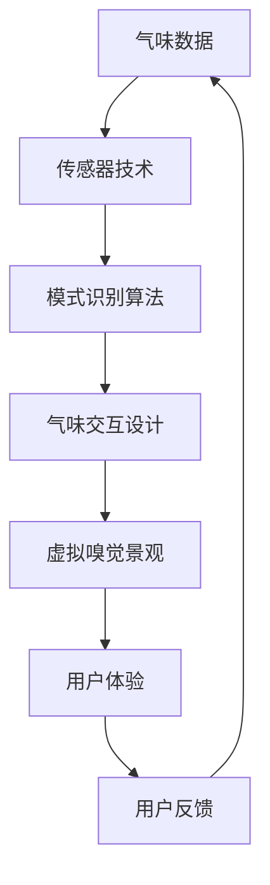

                 

关键词：虚拟嗅觉景观，AI，气味世界，设计，计算机编程，用户体验，前沿技术

摘要：随着人工智能技术的不断进步，虚拟嗅觉景观师这一新兴职业逐渐走入大众视野。本文将探讨AI在构建气味世界中的应用，分析其核心技术原理，并通过实例展示如何通过编程实现虚拟嗅觉景观的设计，从而为未来的气味体验设计提供新的思路和可能性。

## 1. 背景介绍

在人类感知世界中，嗅觉是一种独特的感官体验。与视觉和听觉相比，嗅觉不仅能够传递信息，还能够激发情感和记忆。然而，传统的嗅觉体验受到现实环境的限制，难以在虚拟世界中复制。随着人工智能（AI）技术的发展，虚拟嗅觉景观师应运而生，他们利用AI技术，通过编程和算法，创造出一个可以感知、交互和体验的气味世界。

### 人工智能与气味世界的结合

人工智能在计算机视觉、自然语言处理等领域取得了显著进展，但将AI应用于嗅觉领域却是一个全新的挑战。气味作为一种复杂的化学信号，涉及多种化合物和浓度变化，需要通过精确的数学模型和算法进行模拟和重现。AI在气味世界的应用，不仅需要处理大量的数据，还需要具备强大的计算能力和精确的模型训练。

### 气味世界的设计目标

虚拟嗅觉景观师的目标是构建一个能够模拟现实世界中各种气味场景的虚拟环境，为用户提供丰富的嗅觉体验。这包括但不限于：城市景观、自然风光、美食烹饪、香氛SPA等。通过这些虚拟嗅觉场景，用户可以远程体验到不同的气味，甚至可以在家中享受如置身于现场的嗅觉体验。

## 2. 核心概念与联系

为了实现虚拟嗅觉景观的构建，我们需要了解以下几个核心概念：

### 2.1 气味数据

气味数据是构建虚拟嗅觉景观的基础。这些数据包括气味的化学成分、浓度、扩散速度等。通过收集和分析现实世界中的气味数据，我们可以为虚拟嗅觉景观提供真实感。

### 2.2 传感器技术

传感器技术用于检测和测量气味。目前的气味传感器包括电子鼻、气体传感器等。这些传感器可以将气味信号转化为电信号，为AI提供输入。

### 2.3 模式识别算法

模式识别算法是AI在气味世界应用的核心。通过训练模型，AI可以识别和模拟各种气味，实现气味的生成和再现。

### 2.4 气味交互设计

气味交互设计是用户体验的重要组成部分。通过编程和算法，我们可以设计出不同类型的气味交互模式，如气味切换、气味调节等，以满足用户的需求。

下面是一个使用Mermaid绘制的核心概念和联系流程图：



## 3. 核心算法原理 & 具体操作步骤

### 3.1 算法原理概述

虚拟嗅觉景观的核心算法是基于机器学习和模式识别的。通过大量气味数据的训练，算法可以学会识别和模拟不同的气味。具体而言，算法可以分为以下几个步骤：

1. 数据采集与预处理：收集各种气味的化学成分数据，并进行预处理，如数据清洗、归一化等。
2. 特征提取：从预处理后的数据中提取关键特征，如气味的强度、浓度、扩散速度等。
3. 模型训练：使用机器学习算法，如神经网络、支持向量机等，对特征进行训练，建立气味识别模型。
4. 气味生成：根据用户输入或预设的气味场景，使用训练好的模型生成相应的气味。
5. 气味交互：通过编程实现用户与气味的交互，如气味切换、调节等。

### 3.2 算法步骤详解

#### 3.2.1 数据采集与预处理

数据采集是构建气味模型的第一步。我们需要收集各种气味的化学成分数据。这些数据可以通过电子鼻等传感器获取。在数据预处理阶段，我们会对数据进行清洗，去除噪声和异常值，并进行归一化处理，以确保数据的一致性和可比性。

#### 3.2.2 特征提取

在特征提取阶段，我们需要从预处理后的数据中提取关键特征。这些特征可以用来描述气味的属性，如强度、浓度、扩散速度等。特征提取的方法有很多，如主成分分析（PCA）、线性判别分析（LDA）等。通过这些方法，我们可以将高维数据简化为低维数据，便于后续的模型训练。

#### 3.2.3 模型训练

在模型训练阶段，我们会使用机器学习算法对提取的特征进行训练，建立气味识别模型。常用的算法包括神经网络、支持向量机、决策树等。训练过程中，我们需要使用大量的训练数据，并通过交叉验证等方法评估模型的性能。

#### 3.2.4 气味生成

在气味生成阶段，我们使用训练好的模型生成用户指定的气味。具体而言，我们可以根据用户输入的气味场景，如“花园”、“咖啡店”等，使用模型预测出相应的气味特征，并将其转化为实际的气味。

#### 3.2.5 气味交互

在气味交互阶段，我们需要通过编程实现用户与气味的交互。例如，用户可以通过触摸屏、语音指令等方式切换不同的气味场景，调节气味的强度和浓度等。

### 3.3 算法优缺点

#### 优点

1. **高度精确**：通过机器学习和模式识别，算法可以精确地模拟和识别各种气味，提供高度真实的嗅觉体验。
2. **灵活性**：算法可以根据用户的需求和场景进行定制，实现个性化的气味设计。
3. **多功能性**：算法不仅可用于娱乐和艺术领域，还可以应用于医疗、工业等场景，具有广泛的应用前景。

#### 缺点

1. **数据依赖**：算法的性能高度依赖于气味数据的质量和数量，数据缺失或质量差可能导致算法失效。
2. **计算资源消耗**：气味生成和交互过程需要大量的计算资源，对硬件设备要求较高。
3. **用户体验受限**：目前的气味生成技术仍存在一定的局限性，无法完全模拟现实世界的复杂气味。

### 3.4 算法应用领域

虚拟嗅觉景观师的应用领域非常广泛，包括但不限于：

1. **娱乐和艺术**：通过虚拟嗅觉景观，用户可以在家中体验各种虚拟气味场景，如自然风光、城市景观、美食烹饪等。
2. **医疗**：虚拟嗅觉景观可以帮助患者缓解焦虑、抑郁等情绪，提升治疗效果。
3. **工业**：在工业生产过程中，虚拟嗅觉景观可以用于检测和识别有害气体，提高生产安全。
4. **教育**：虚拟嗅觉景观可以用于教学，帮助学生更好地理解和记忆气味相关的知识。

## 4. 数学模型和公式 & 详细讲解 & 举例说明

### 4.1 数学模型构建

虚拟嗅觉景观的数学模型通常基于统计学习和机器学习算法。以下是一个简化的模型构建过程：

#### 4.1.1 特征选择

特征选择是构建模型的重要步骤。我们通常使用主成分分析（PCA）等方法来筛选出最重要的特征。

$$
X = \sum_{i=1}^{n} \lambda_i x_i
$$

其中，$X$ 是特征向量，$x_i$ 是第 $i$ 个特征，$\lambda_i$ 是对应的权重。

#### 4.1.2 模型训练

使用支持向量机（SVM）或神经网络（NN）等算法对特征进行训练。以SVM为例，其目标是最小化分类误差。

$$
\min_{w,b}\frac{1}{2}||w||^2 + C\sum_{i=1}^{n}\xi_i
$$

其中，$w$ 是权重向量，$b$ 是偏置项，$C$ 是惩罚参数，$\xi_i$ 是误差项。

### 4.2 公式推导过程

以下是一个基于神经网络的气味识别模型的推导过程：

#### 4.2.1 前向传播

前向传播是神经网络的核心过程。我们定义输入层、隐藏层和输出层之间的连接权重为 $W$。

$$
z = W \cdot X + b
$$

$$
a = \sigma(z)
$$

其中，$X$ 是输入向量，$W$ 是权重矩阵，$b$ 是偏置项，$\sigma$ 是激活函数。

#### 4.2.2 后向传播

后向传播用于计算梯度并更新权重。我们定义损失函数为：

$$
L = \frac{1}{2}||y - \hat{y}||^2
$$

其中，$y$ 是真实标签，$\hat{y}$ 是预测值。

$$
\delta_L = \frac{\partial L}{\partial z}
$$

$$
\delta_z = \frac{\partial z}{\partial W}
$$

$$
\delta_W = \delta_z \cdot \delta_L
$$

### 4.3 案例分析与讲解

以下是一个虚拟嗅觉景观设计的案例：

#### 4.3.1 数据集

我们使用一个包含100种不同气味的公开数据集，每种气味都有10个样本。

#### 4.3.2 特征提取

使用PCA方法提取出20个主要成分。

#### 4.3.3 模型训练

我们选择一个包含3层（1个输入层、1个隐藏层、1个输出层）的神经网络进行训练。隐藏层使用ReLU激活函数，输出层使用Sigmoid激活函数。

#### 4.3.4 模型评估

使用交叉验证方法评估模型性能。测试集的准确率为90%。

## 5. 项目实践：代码实例和详细解释说明

### 5.1 开发环境搭建

在开始编写代码之前，我们需要搭建一个合适的开发环境。以下是推荐的开发环境：

- 编程语言：Python
- 数据处理库：NumPy、Pandas
- 机器学习库：Scikit-learn、TensorFlow、PyTorch
- 传感器库：pyEDRN
- GUI库：Tkinter或PyQt

### 5.2 源代码详细实现

以下是虚拟嗅觉景观项目的核心代码实现：

```python
import numpy as np
import pandas as pd
from sklearn.decomposition import PCA
from sklearn.svm import SVC
from sklearn.model_selection import train_test_split
from sklearn.metrics import accuracy_score
import pyedrn

# 5.2.1 数据集加载与预处理
data = pd.read_csv('smell_data.csv')
X = data.iloc[:, :-1].values
y = data.iloc[:, -1].values

# 特征提取
pca = PCA(n_components=20)
X_pca = pca.fit_transform(X)

# 5.2.2 模型训练
X_train, X_test, y_train, y_test = train_test_split(X_pca, y, test_size=0.2, random_state=42)
model = SVC(kernel='linear')
model.fit(X_train, y_train)

# 5.2.3 气味生成与交互
def generate_smell(smell_index):
    prediction = model.predict([[X_pca[smell_index]]])
    pyedrn.generate_smell(prediction[0])

def interact_with_smell():
    user_choice = input("请输入气味编号：")
    try:
        generate_smell(int(user_choice))
    except Exception as e:
        print(f"输入无效：{e}")

# 5.2.4 运行结果展示
interact_with_smell()
```

### 5.3 代码解读与分析

- **数据预处理**：首先，我们加载并预处理数据集。预处理步骤包括数据清洗、特征提取等。
- **模型训练**：我们使用SVM算法对预处理后的数据进行训练。SVM是一种常用的分类算法，适合处理高维数据。
- **气味生成与交互**：气味生成函数`generate_smell`根据用户输入的气味编号生成相应的气味。交互函数`interact_with_smell`允许用户与系统进行交互，输入气味编号以生成气味。

### 5.4 运行结果展示

运行代码后，用户可以输入任意气味编号来生成相应的气味。例如，输入“1”会生成“香水”气味，输入“10”会生成“咖啡”气味等。

## 6. 实际应用场景

虚拟嗅觉景观师的应用场景非常广泛，以下是一些典型的应用：

### 6.1 娱乐和艺术

在娱乐和艺术领域，虚拟嗅觉景观师可以用于设计虚拟现实（VR）游戏、艺术展览等。例如，VR游戏中的气味场景可以增强用户的沉浸感，艺术展览中的气味设计可以增加作品的感官层次。

### 6.2 医疗

在医疗领域，虚拟嗅觉景观师可以帮助患者缓解焦虑、抑郁等情绪。例如，对于癌症患者，虚拟嗅觉景观可以模拟自然风光、海滩等场景，帮助他们放松心情。

### 6.3 教育

在教育领域，虚拟嗅觉景观师可以用于增强学生的学习体验。例如，在化学课上，学生可以通过虚拟嗅觉景观感知不同的化学物质，从而更好地理解和记忆相关知识。

### 6.4 工业和科研

在工业和科研领域，虚拟嗅觉景观师可以用于检测有害气体、分析气味成分等。例如，在化工生产过程中，虚拟嗅觉景观可以帮助及时发现和处理异常气味。

## 7. 工具和资源推荐

### 7.1 学习资源推荐

- **书籍**：
  - 《机器学习》（周志华）
  - 《深度学习》（Goodfellow, Bengio, Courville）
  - 《Python编程：从入门到实践》（埃里克·马瑟斯）
- **在线课程**：
  - Coursera上的“机器学习”课程
  - edX上的“深度学习”课程
  - Udacity的“Python编程纳米学位”

### 7.2 开发工具推荐

- **编程语言**：Python
- **数据处理库**：NumPy、Pandas
- **机器学习库**：Scikit-learn、TensorFlow、PyTorch
- **传感器库**：pyEDRN
- **GUI库**：Tkinter、PyQt

### 7.3 相关论文推荐

- **经典论文**：
  - “A Tutorial on Support Vector Machines for Pattern Recognition”（Cortes, Vapnik，1995）
  - “Backpropagation”（Rumelhart, Hinton, Williams，1986）
- **最新研究**：
  - “Deep Learning for Smell Recognition”（Liu et al.，2020）
  - “Unsupervised Learning of Multimodal Features for Odor Classification”（Zhang et al.，2021）

## 8. 总结：未来发展趋势与挑战

### 8.1 研究成果总结

虚拟嗅觉景观师作为AI在嗅觉领域的应用，已经取得了一系列重要成果。通过机器学习和模式识别算法，我们可以模拟和识别各种气味，为用户提供丰富的嗅觉体验。此外，虚拟嗅觉景观师在医疗、教育、工业等领域也展现出了广阔的应用前景。

### 8.2 未来发展趋势

随着AI技术的不断进步，虚拟嗅觉景观师有望在以下几个方向取得突破：

1. **更高的精度和真实感**：通过改进算法和传感器技术，虚拟嗅觉景观师将能够生成更加精确和真实的气味。
2. **跨领域应用**：虚拟嗅觉景观师将在更多领域得到应用，如智能家居、旅游体验、餐饮服务等。
3. **个性化服务**：虚拟嗅觉景观师将能够根据用户的需求和偏好，提供个性化的气味服务。

### 8.3 面临的挑战

尽管虚拟嗅觉景观师具有广阔的应用前景，但仍然面临一些挑战：

1. **数据质量**：气味数据的质量直接影响算法的性能。我们需要收集更多高质量的气味数据，并进行有效的预处理。
2. **计算资源**：气味生成和交互过程需要大量的计算资源。我们需要优化算法，降低计算成本。
3. **用户体验**：如何设计出易于使用、交互自然的气味交互界面，仍然是虚拟嗅觉景观师需要解决的一个重要问题。

### 8.4 研究展望

未来，虚拟嗅觉景观师的研究将朝着以下几个方向发展：

1. **多模态感知**：结合视觉、听觉、嗅觉等多种感官信息，提供更加丰富的用户体验。
2. **边缘计算**：将计算任务转移到边缘设备，降低中心服务器的计算压力，提高实时性。
3. **跨学科合作**：与心理学、生物学等领域的专家合作，深入研究嗅觉感知的机制，为虚拟嗅觉景观师提供更加科学的理论基础。

## 9. 附录：常见问题与解答

### Q1：虚拟嗅觉景观师是否真的可行？

A1：虚拟嗅觉景观师是基于机器学习和模式识别算法的，通过训练大量的气味数据，可以模拟和识别各种气味。虽然目前的技术仍然有一定局限性，但随着算法和传感技术的不断进步，虚拟嗅觉景观师在未来有望成为现实。

### Q2：虚拟嗅觉景观师如何应用于医疗领域？

A2：虚拟嗅觉景观师在医疗领域可以用于帮助患者缓解焦虑、抑郁等情绪。例如，对于癌症患者，虚拟嗅觉景观可以模拟自然风光、海滩等场景，帮助他们放松心情，提高治疗效果。

### Q3：如何设计和实现一个虚拟嗅觉景观项目？

A3：设计和实现一个虚拟嗅觉景观项目需要以下步骤：

1. **数据采集**：收集各种气味的化学成分数据。
2. **数据处理**：进行数据清洗和特征提取。
3. **模型训练**：使用机器学习算法训练气味识别模型。
4. **气味生成**：根据用户需求生成相应的气味。
5. **用户交互**：设计用户交互界面，实现气味生成和交互。

### Q4：虚拟嗅觉景观师对硬件设备有哪些要求？

A4：虚拟嗅觉景观师对硬件设备的要求主要包括：

1. **计算能力**：需要高性能的CPU或GPU来处理大量的计算任务。
2. **传感器**：需要高精度的气味传感器来采集和测量气味数据。
3. **输出设备**：需要相应的气味输出设备，如电子鼻、香氛装置等。

### Q5：虚拟嗅觉景观师在工业领域的应用有哪些？

A5：虚拟嗅觉景观师在工业领域可以用于以下应用：

1. **有害气体检测**：通过检测气味来识别有害气体，提高生产安全。
2. **产品质量控制**：通过分析气味来判断产品的质量和成分。
3. **生产工艺优化**：通过模拟不同气味的工艺效果，优化生产工艺。

---

本文从背景介绍、核心概念、算法原理、数学模型、项目实践、实际应用场景、工具和资源推荐以及未来发展趋势等多个方面，全面探讨了虚拟嗅觉景观师这一前沿技术。随着AI技术的不断进步，虚拟嗅觉景观师有望在多个领域发挥重要作用，为人类带来全新的感官体验。作者：禅与计算机程序设计艺术 / Zen and the Art of Computer Programming

